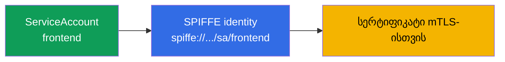
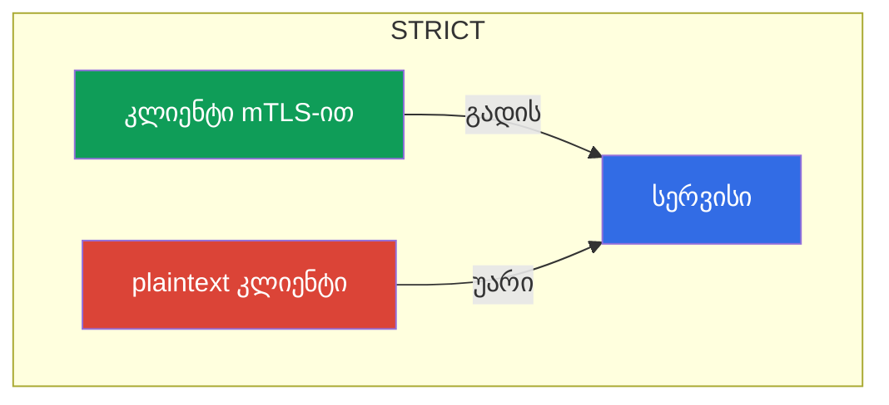
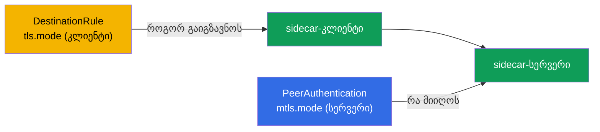
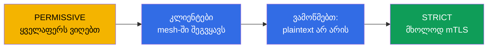

[Русская версия](ru.md) · [Eng version](en.md) · [Versión en español](es.md) · [Version française](fr.md) · [Deutsche Version](de.md) · [繁體中文版](tw.md) · [日本語版](jp.md)

# თავი 13. mTLS და PeerAuthentication: Zero Trust მოდელი

> **რა არის შემდეგ.** იწყება გამოცდის მეორე დიდი დომენი - უსაფრთხოება. ნაგულისხმევად,
> კლასტერის შიგნით ნებისმიერ პოდს შეუძლია ნებისმიერ სერვისთან დაკავშირება, მათ შორის
> ტრაფიკი კი ღია ტექსტით გადაიცემა. ამ თავში ავაგებთ უსაფრთხოების საფუძველს:
> ორმხრივ TLS-ს (mTLS) სერვისებს შორის და მის მართვას PeerAuthentication-ის მეშვეობით. ეს
> Zero Trust მოდელის საფუძველია.

## 13.1. პრობლემა: ბრტყელი სანდო ქსელი

ჩვეულებრივ კლასტერში ქსელი „ბრტყელია“: თუ A პოდმა იცის B პოდის მისამართი, მას შეუძლია მასთან
დაკავშირება და ტრაფიკი დაუშიფრავად გადაიცემა. არავინ ამოწმებს, სინამდვილეში ვინ
უკავშირდება. შიგნით მოხვედრილი თავდამსხმელისთვის ეს საჩუქარია: მას შეუძლია თავისუფლად
გადაადგილდეს სერვისებს შორის და მოუსმინოს ტრაფიკს.

**Zero Trust** („არ ენდო არავის“) მოდელი ამას თავდაყირა აყენებს: ნაგულისხმევად არცერთ
კავშირს არ ვენდობით, სანამ ის არ დაამტკიცებს, რომ მისი ნდობა შეიძლება. Istio-ში
ამისკენ პირველი ნაბიჯი ყველა სერვისს შორის ორმხრივი TLS-ია.

## 13.2. Identity და SPIFFE

ტრაფიკის დასაშიფრად და შესამოწმებლად თითოეულ სერვისს სჭირდება **იდენტობა** (identity). Istio-ში
ის Kubernetes ServiceAccount-ის საფუძველზე იქმნება და **SPIFFE** სტანდარტით ფორმდება.

**SPIFFE** (Secure Production Identity Framework For Everyone) ღია სტანდარტია
(CNCF-ის პროექტი), რომელიც აღწერს, როგორ მიენიჭოს სერვისებს შემოწმებადი იდენტობა ქსელზე
მიბმის გარეშე (IP, პორტი და ჰოსტის სახელი არასანდოა და იცვლება). SPIFFE-ში იდენტობა არის
სტრიქონული იდენტიფიკატორი (SPIFFE ID) URI-ის სახით, რომელიც სპეციალური ფორმატის
სერტიფიკატში (SVID) „იფუთება“ და მისი მეშვეობით სერვისი ამტკიცებს, ვინ არის. სტანდარტი
მომწოდებლისგან დამოუკიდებელია, ამიტომ ასეთი identity Istio-ს ფარგლებს გარეთაც გასაგებია.
Istio-ში SPIFFE ID ასე გამოიყურება:

```
spiffe://cluster.local/ns/<namespace>/sa/<serviceaccount>
```

იკითხება მარტივად: სერვისი namespace `<namespace>`-იდან, ServiceAccount-ით
`<serviceaccount>`, სანდო დომენში `cluster.local`.



ანუ იგივე ServiceAccount, რომელსაც CKA-ში Kubernetes API-ზე წვდომისთვის იყენებდით,
აქ mesh-ში სერვისის კრიპტოგრაფიულ იდენტობად იქცევა. სწორედ ამ იდენტობის მიხედვით
შიფრავს Istio ტრაფიკს და შემდეგ (მე-14 თავში) წყვეტს, ვის რა შეუძლია.

**რა მოხდება, თუ ServiceAccount მითითებული არ არის?** Kubernetes-ში პოდს **ყოველთვის** აქვს ServiceAccount: თუ
ის აშკარად არ მიგითითებიათ, პოდი თავისი namespace-ის `default` SA-ს იღებს. „იდენტობა არ
არსებობს“ არ ხდება - არსებობს **`default` იდენტობა**. აქედან მნიშვნელოვანი შედეგი: თუ ათი სხვადასხვა სერვისი
საკუთარი SA-ს გარეშეა გაშვებული, ყველა მათგანი **ერთსა და იმავე** SPIFFE-იდენტობას
(`spiffe://.../sa/default`) იღებს. mTLS დაშიფვრისთვის ეს კრიტიკული არ არის, მაგრამ ავტორიზაციისთვის (თავი
14) პრობლემაა: მათი ერთმანეთისგან გარჩევა შეუძლებელია და წესი „მხოლოდ `frontend` დაუშვი“ სხვებისგან
ვერ გამოყოფს. ამიტომ საუკეთესო პრაქტიკაა - **თითოეულ სერვისს საკუთარი ServiceAccount** (ან სულ მცირე,
ერთნაირი უფლებების მქონე თითოეულ ჯგუფს).

**რა მოხდება, თუ პოდი sidecar-ის გარეშეა (mesh-ის გარეთ)?** Istio-ში იდენტობას სწორედ sidecar იძლევა: ის
istiod-ისგან სერტიფიკატს იღებს და წარადგენს. sidecar-ის გარეშე მყოფ პოდს (არ არის ინექცირებული ან იმყოფება namespace-ში
`istio-injection`-ის გარეშე) **არც SPIFFE-იდენტობა აქვს და არც სერტიფიკატი** და ჩვეულებრივ
plaintext-ს აგზავნის. ქცევა მიმღები სერვერის რეჟიმზეა დამოკიდებული (13.4):

- სერვერი **`PERMISSIVE`** რეჟიმში ასეთ კავშირს მიიღებს (ღია ტექსტით), რაც mesh-ის
  თანდათანობით დანერგვის საშუალებას იძლევა;
- სერვერი **`STRICT`** რეჟიმში მას **უარყოფს**: არ არის mTLS - არ არის კავშირი.

ავტორიზაციის თვალსაზრისითაც, ასეთი პოდიდან მოსულ ტრაფიკს **შემოწმებული იდენტობა არ აქვს**
(`source.principal` ცარიელია), ამიტომ მასზე principal-ებზე დაფუძნებულ წესებს ვერ გამოვიყენებთ - მაქსიმუმ IP-ს,
რაც არასანდოა. დასკვნა: ნამდვილ identity-ს რომ ფლობდეს, სერვისი mesh-ში უნდა იყოს
(sidecar-ით), წინააღმდეგ შემთხვევაში Zero Trust-ისთვის ის „ანონიმურია“.

## 13.3. ავტომატური mTLS

Istio-ს მთავარი მოხერხებულობა ისაა, რომ mTLS **ავტომატურად** მუშაობს და სერტიფიკატებთან
წვალება არ გჭირდებათ. istiod სერტიფიკაციის ცენტრის (CA) როლს ასრულებს:

- თითოეულ sidecar-ს მისი SPIFFE-იდენტობის შემცველ სერტიფიკატს აძლევს;
- ამ სერტიფიკატებს ავტომატურად ანახლებს (ნაგულისხმევად ყოველ დღე-ღამეში);
- მათ Envoy-ს SDS-ის მეშვეობით აწვდის (გაიხსენეთ მე-4 თავიდან - Secret Discovery Service).

როდესაც ერთი sidecar მეორეს უკავშირდება, ისინი **ორმხრივ** TLS handshake-ს ასრულებენ: ორივე
მხარე წარადგენს სერტიფიკატს და ერთმანეთს ამოწმებს. ჩვეულებრივ TLS-ში (როგორც მე-9 თავში)
სერვერი კლიენტს უმტკიცებს, ვინ არის. mutual TLS-ში **ორივე** მხარე ამტკიცებს საკუთარ
იდენტობას. შედეგად ტრაფიკი დაშიფრულიცაა და ავთენტიფიცირებულიც - და ეს ყველაფერი
აპლიკაციის კოდში ერთი სტრიქონის დამატების გარეშე.

## 13.4. PeerAuthentication: mTLS რეჟიმები

რესურსი `PeerAuthentication` მართავს, როგორ იღებენ სერვისები შემომავალ კავშირებს.
მას სამი რეჟიმი აქვს:

| რეჟიმი | რას იღებს სერვერი | როდის გამოვიყენოთ |
|-------|----------------------|--------------------|
| `PERMISSIVE` | mTLS-საც და plaintext-საც | ნაგულისხმევი რეჟიმი, გარდამავალი პერიოდი |
| `STRICT` | მხოლოდ mTLS-ს | Zero Trust-ის მიზანი |
| `DISABLE` | მხოლოდ plaintext-ს | mTLS-ის გამორთვა (იშვიათად, გამართვისთვის) |

ნაგულისხმევად Istio `PERMISSIVE` რეჟიმში მუშაობს: სერვისი იღებს როგორც დაშიფრულ, ისე
ღია ტრაფიკს. ეს იმისთვისაა გაკეთებული, რომ mesh თანდათანობით დაინერგოს და ისინი არ
გაფუჭდეს, ვინც ჯერ mesh-ში არ არის.

მკაცრი mTLS-ის ჩართვა მთელ namespace-ზე:

```yaml
apiVersion: security.istio.io/v1
kind: PeerAuthentication
metadata:
  name: default         # default სახელი + selector-ის გარეშე = მთელ namespace-ზე
  namespace: app
spec:
  mtls:
    mode: STRICT
```



`STRICT` რეჟიმში სერვისი ნებისმიერ დაუშიფრავ ტრაფიკს უარყოფს. sidecar-ის გარეშე მყოფი კლიენტი
(რომელიც plaintext-ს აგზავნის) კავშირს უბრალოდ ვერ დაამყარებს.

## 13.5. პოლიტიკის მოქმედების არეალი

`PeerAuthentication` სამ დონეზე შეიძლება გამოვიყენოთ და ამის გაგება მნიშვნელოვანია:

- **მთელი mesh** - პოლიტიკა root namespace-ში (`istio-system`) სახელით `default`.
- **Namespace** - პოლიტიკა სახელით `default` და `selector`-ის გარეშე საჭირო namespace-ში
  (როგორც ზემოთ მოცემულ მაგალითში).
- **კონკრეტული პოდები** - პოლიტიკა `selector.matchLabels`-ით, რომელიც მხოლოდ
  შერჩეულ პოდებზე მოქმედებს.

```yaml
spec:
  selector:
    matchLabels:
      app: payments     # მხოლოდ payments pod-ები
  mtls:
    mode: STRICT
```

უფრო ვიწრო პოლიტიკა უფრო ფართოს გადაწერს. მაგალითად, შეიძლება `STRICT` მთელ
mesh-ზე ჩავრთოთ, მაგრამ ერთ legacy-სერვისს selector-იანი პოლიტიკის მეშვეობით `PERMISSIVE` დავუტოვოთ.

არსებობს კიდევ უფრო ზუსტი დონე - **ცალკეული პორტი**. `portLevelMtls`-ის მეშვეობით შეიძლება
კონკრეტული პორტებისთვის საერთო რეჟიმისგან განსხვავებული რეჟიმის დაყენება. კლასიკური მაგალითია: მთელი სერვისი
`STRICT` რეჟიმშია, მაგრამ მეტრიკების/შემოწმებების პორტი, რომელსაც mesh-ის გარედან რაღაც უკავშირდება, `PERMISSIVE` რეჟიმში რჩება:

```yaml
spec:
  selector:
    matchLabels:
      app: payments
  mtls:
    mode: STRICT          # ნაგულისხმევად pod-ის ყველა პორტისთვის
  portLevelMtls:
    9090:
      mode: PERMISSIVE    # მაგრამ 9090 პორტზე (მეტრიკები) plaintext-საც ვუშვებთ
```

## 13.6. კლიენტი და სერვერი: PeerAuthentication vs DestinationRule

როლების გამიჯვნის გაგება მნიშვნელოვანია, წინააღმდეგ შემთხვევაში იდუმალი `503`-ების მიღება ადვილია.

- **`PeerAuthentication` მხოლოდ სერვერის (შემომავალ) მხარეს მართავს** - იმას, რის
  **მიღებასაც** სერვისი თანხმდება (mTLS, plaintext ან ორივე).
- **კლიენტის (გამავალი) მხარე** - როგორ ამყარებს გამომგზავნი sidecar კავშირს -
  განისაზღვრება **ავტო-mTLS-ით**: Istio თავად ხედავს, რომ მიმღებს sidecar აქვს და mTLS-ს აგზავნის.
  კლიენტის რეჟიმი აშკარად `DestinationRule`-ში, `trafficPolicy.tls.mode:
  ISTIO_MUTUAL`-ის მეშვეობით მიეთითება.

ჩვეულებრივ ამაზე ფიქრი არ არის საჭირო - ავტო-mTLS მხარეებს თავად ათანხმებს. პრობლემა მაშინ ჩნდება, როდესაც
ვინმე ხელით აყენებს `DestinationRule`-ს ისეთი `tls.mode`-ით, რომელიც `PeerAuthentication`-თან კონფლიქტშია:

- სერვერი `STRICT` რეჟიმშია, კლიენტის `DestinationRule` კი `mode: DISABLE`-ით (ან `SIMPLE`) → კლიენტი
  plaintext-ს აგზავნის, სერვერი mTLS-ს მოითხოვს → **კავშირი წყდება, `503`**.
- საპირისპირო სიტუაციაც (`DestinationRule` მოითხოვს `ISTIO_MUTUAL`-ს, სერვერი კი `DISABLE` რეჟიმშია) - ასევე
  შეცდომაა.



წესი: კლიენტის (`DestinationRule`) და სერვერის (`PeerAuthentication`) რეჟიმები
შეთანხმებული უნდა იყოს. თუ DestinationRule-ში `tls`-ს არ შეეხებით, ავტო-mTLS ყველაფერს თავად შეათანხმებს - ესაა
რეკომენდებული გზა.

## 13.7. მიგრაცია PERMISSIVE-დან STRICT-ზე შეფერხების გარეშე

ცოცხალ კლასტერზე `STRICT`-ის პირდაპირ ჩართვა სახიფათოა: ყველა კლიენტი, რომელიც ჯერ კიდევ
plaintext-ს აგზავნის (არ არის mesh-ში, legacy-აპლიკაციები), მყისიერად გაითიშება. სწორი გზაა
თანდათანობითი მიგრაცია და `PERMISSIVE` სწორედ ამისთვისაა შექმნილი.

თანმიმდევრობა ასეთია:

1. **დაწყება PERMISSIVE რეჟიმში** (ეს ნაგულისხმევი რეჟიმია). სერვისი იღებს mTLS-საც და plaintext-საც, არაფერი
   ფუჭდება.
2. **კლიენტების mesh-ში შეყვანა.** თანდათან ვუმატებთ sidecar-ს ყველას, ვინც
   სერვისს უკავშირდება. როგორც კი კლიენტს sidecar ექნება, ის ავტომატურად იწყებს mTLS-ით დაკავშირებას
   (სერვისი `PERMISSIVE` რეჟიმში ამას იღებს).
3. **ვამოწმებთ, რომ plaintext აღარ არის.** მეტრიკები და ლოგები გვეხმარება დავრწმუნდეთ,
   დარჩა თუ არა სერვისთან დაუშიფრავი კავშირები.
4. **STRICT რეჟიმზე გადართვა.** როცა მთელი ტრაფიკი უკვე mTLS-ით გადაიცემა, ვრთავთ `STRICT`-ს.
   ახლა plaintext აკრძალულია, მაგრამ რადგან ის ისედაც აღარ დარჩა, არავინ დაზარალდება.



მთავარი იდეა: `PERMISSIVE` არ ნიშნავს „სამუდამოდ დაუცველს“, ის უსაფრთხო ხიდია
plaintext-დან მკაცრ mTLS-მდე.

## 13.8. Kubernetes-ის probe-ები და STRICT mTLS

პრაქტიკული მახე, რომელსაც STRICT mTLS-ის ჩართვისას ხშირად აწყდებიან.
პოდის ჯანმრთელობის შემოწმებებს (liveness/readiness/startup) **kubelet** აგზავნის - პირდაპირ
პოდთან, kubelet კი **mesh-ის გარეთაა**: მას sidecar და mTLS-იდენტობა არ აქვს. თუ აპლიკაციის
პორტზე STRICT mTLS მოითხოვება, sidecar დაშიფრულ კავშირს ელის, kubelet კი ჩვეულებრივ
HTTP-ს აგზავნის - probe ვერ სრულდება, პოდი „არაჯანსაღად“ ითვლება და გადატვირთვების ციკლში ხვდება.

Istio ამას ავტომატურად აგვარებს: ინექციისას ის **HTTP probe-ებს გადაწერს** (პარამეტრი
`rewriteAppHTTPProbers`, ნაგულისხმევად ჩართულია). kubelet-ის probe sidecar-ის შიგნით
pilot-agent-ზე გადამისამართდება, ის კი მას აპლიკაციასთან localhost-ით, mTLS-ის გვერდის ავლით გადაამისამართებს.


რა უნდა გვახსოვდეს:

- HTTP და gRPC probe-ებისთვის ეს **მზადყოფნაში** მუშაობს; ქცევას მართავს ანოტაცია
  `sidecar.istio.io/rewriteAppHTTPProbers`.
- თუ STRICT mTLS-ის დროს rewrite-ს **გამორთავთ**, HTTP probe-ები ჩავარდება და პოდები
  ციკლურად გადაიტვირთება (CrashLoop). ეს პრობლემების ხშირი მიზეზია **mesh-ის ჩართვისთანავე** -
  თუ ინექციის შემდეგ პოდები restart-ებში „გაიჭედა“, probe-ები შეამოწმეთ.
- **TCP probe-ები** ჩვეულებრივ არ ზიანდება - ისინი მხოლოდ პორტის გახსნილობას ამოწმებს. **exec probe-ები**
  კონტეინერის შიგნით სრულდება და mesh-ს არ ეხება.

## 13.9. mTLS-ის შემოწმება

mTLS-ის ჩართვა საკმარისი არ არის - უნდა დავრწმუნდეთ, რომ ტრაფიკი მართლაც იშიფრება. რამდენიმე მეთოდი არსებობს.

**`istioctl` describe** პოდის მიხედვით აჩვენებს, მოქმედებს თუ არა მასზე mTLS და რომელი პოლიტიკაა გამოყენებული:

```bash
istioctl x describe pod <pod> -n app
# გამოტანაში: "Effective PeerAuthentication mode: STRICT" და ა.შ.
```

**Envoy-ის კონფიგურაცია** - ჩანს, რომელი რეჟიმია შეთანხმებული შემომავალი listener-ებისთვის:

```bash
istioctl proxy-config listeners <pod> -n app -o json | grep -i tlsMode
```

**Envoy-ის მეტრიკები** - თითოეულ კავშირს უსაფრთხოების ნიშანი აქვს. თუ ტრაფიკი
mTLS-ით გადაიცემა, მეტრიკებში მითითებულია `connection_security_policy="mutual_tls"`:

```bash
kubectl exec <pod> -c istio-proxy -n app -- \
  pilot-agent request GET stats/prometheus | grep connection_security_policy
```

ამის ვიზუალურად ნახვა კიდევ უფრო მოსახერხებელია: **Kiali** (თავი 16) გრაფის იმ წიბოებზე
„ბოქლომს“ ხატავს, სადაც ტრაფიკი mTLS-ითაა დაცული. თუ `STRICT`-ს ელოდით, მაგრამ ბოქლომი არ არის ან მეტრიკებში
`connection_security_policy="none"` ჩანს - ტრაფიკი ჯერ კიდევ plaintext-ია; მოძებნეთ მიზეზი (კლიენტი
sidecar-ის გარეშე ან `DestinationRule`-ის კონფლიქტი, იხ. 13.6).

## 13.10. mTLS ჯერ კიდევ არ არის ავტორიზაცია

მნიშვნელოვანია, mTLS-ის შესაძლებლობები გადაჭარბებულად არ შევაფასოთ. ის პასუხობს კითხვას: **„შეიძლება თუ არა ამ
კავშირის ნდობა და ვინ არის მეორე ბოლოში?“** - ანუ არხს შიფრავს და თანამოსაუბრის
იდენტობას ადასტურებს. მაგრამ ის **არ** ზღუდავს, კონკრეტულად რისი გაკეთება შეუძლია ამ თანამოსაუბრეს.

მაგალითი: ჩავრთეთ `STRICT` mTLS. ახლა sidecar-ის გარეშე მყოფი კლიენტი სერვის `payments`-ს
ვერ მისწვდება. თუმცა mesh-ში მყოფ ნებისმიერ სერვისს, რომელსაც მოქმედი mTLS-სერტიფიკატი აქვს, კვლავ შეუძლია
`payments`-თან დაკავშირება. იმის სათქმელად, რომ „payments-თან წვდომა მხოლოდ frontend-იდან და მხოლოდ
GET მეთოდით შეიძლება“, უკვე სხვა მექანიზმია საჭირო - `AuthorizationPolicy`, რაც შემდეგი,
მე-14 თავის თემაა. mTLS და ავტორიზაცია ერთად მუშაობს: ავტორიზაცია mTLS-ის მიერ მინიჭებულ
იდენტობას ეყრდნობა.

## 13.11. საფრთხეების მოდელი: რისგან იცავს mTLS და რისგან არა

mTLS-ის სწორად გამოსაყენებლად მისი საზღვრები უნდა გვესმოდეს: ის სრულიად კონკრეტულ
შეტევებს კეტავს, მაგრამ „ვერცხლის ტყვია“ არ არის.

**რისგან იცავს:**

- **ტრაფიკის მოსმენა (sniffing).** mesh-ის შიგნით ყველაფერი დაშიფრულია - თავდამსხმელი, რომელიც
  ქსელურ ტრაფიკს კითხულობს (სხვა პოდზე ჩაჭერა, სარკისებური გადამისამართება, კომპრომეტირებული ქსელური
  კომპონენტი), მხოლოდ შიფრულ ტექსტს ხედავს.
- **ქსელში იდენტობის გაყალბება (spoofing).** მხოლოდ სერვისის IP-ის ან სახელის ცოდნით მის სახელად
  თავის გასაღება შეუძლებელია: საჭირო SPIFFE ID-ის მქონე მოქმედი სერტიფიკატის გარეშე `STRICT` რეჟიმის სერვერი
  კავშირს არ მიიღებს.
- **Lateral movement „უცხო“ პოდის მხრიდან.** sidecar-ის გარეშე მყოფი (ან mesh-ის გარეთ მყოფი) პოდი
  `STRICT` რეჟიმში მყოფ სერვისებს ვერ მისწვდება.
- **MITM კლასტერის შიგნით.** სერტიფიკატების ორმხრივი შემოწმება შუაში ჩადგომის საშუალებას არ იძლევა.

**რისგან არ იცავს:**

- **ნოდის კომპრომეტირება.** ეს საკვანძო მომენტია. workload-ების პირადი გასაღებები და სერტიფიკატები
  sidecar-ების (Envoy) მეხსიერებაში ინახება და SDS-ით ნოდზე არსებული socket-ის გავლით მიეწოდება. თუ
  თავდამსხმელმა კონტეინერიდან გააღწია და ნოდზე **root** მიიღო, მას შეუძლია:
  - წაიკითხოს ამ ნოდზე გაშვებული **ყველა პოდის გასაღები/სერტიფიკატი** და თავი მათ
    SPIFFE-იდენტობებად გაასაღოს - mesh-ისთვის ეს ლეგიტიმური ტრაფიკი იქნება;
  - წაიღოს ამ პოდების დამონტაჟებული **ServiceAccount token-ები** და მათი სახელით დაუკავშირდეს როგორც
    Kubernetes API-ს, ისე mesh-ის სერვისებს.

  **სხვა** ნოდების პოდების გასაღებებს ის ამ გზით ვერ მიიღებს (იქ ისინი არ არის), ამიტომ ზიანის რადიუსი
  ნოდზე მეზობლად განთავსებული იდენტობებით შემოიფარგლება. თუმცა ნოდის ფარგლებში mTLS ბარიერი აღარ არის.
- **კომპრომეტირებული აპლიკაცია.** თუ თავად სერვისია გატეხილი, მას მოქმედი იდენტობა აქვს -
  mTLS მას პატიოსნად დაადასტურებს. იმის შეზღუდვა, თუ რისი გაკეთება შეუძლია ამ სერვისს,
  `AuthorizationPolicy`-ის (თავი 14) ამოცანაა და არა mTLS-ის.
- **აპლიკაციის დონის სისუსტეები** (ინექციები, ლოგიკური შეცდომები) - mTLS ტრანსპორტს ეხება და არა
  ლოგიკას.

**დასკვნა და defense-in-depth.** mTLS ქსელური შეტევების ბარიერს ზრდის, მაგრამ ნოდის ხელში ჩაგდება = მისი
პოდების იდენტობების ხელში ჩაგდება. ამიტომ mTLS-ს ავსებენ:

- კონტეინერიდან გაქცევისგან დაცვით (privileged-ის აკრძალვა, drop capabilities, `runAsNonRoot`,
  read-only rootfs, seccomp, AppArmor/SELinux, Pod Security Standards + admission-კონტროლი,
  sandbox runtime-ები, როგორიცაა gVisor/Kata) - ეს CKS-ის დომენია;
- მნიშვნელოვანი workload-ების გამოყოფილ ნოდებზე იზოლაციით (taints/`nodeSelector`), რათა ისინი
  არასანდო workload-ების მეზობლად არ იყვნენ;
- მოპარული credential-ების გაუფასურებით: მოკლევადიანი bound-token-ები, `automountServiceAccountToken:
  false`, RBAC least-privilege, სერტიფიკატების მოკლე TTL;
- `AuthorizationPolicy`-ით ავტორიზაციით (least-privilege mesh-ში) და runtime-დეტექტირებით (Falco,
  აუდიტი), რათა იდენტობის ანომალიური გამოყენება ხილული იყოს.

## 13.12. საუკეთესო პრაქტიკები

- **მიზანია `STRICT` მთელ mesh-ზე**, მაგრამ იქამდე უნდა მივიდეთ `PERMISSIVE`-ისა და ტრაფიკის
  შემოწმების (13.7) გავლით და არა პირდაპირ.
- **საჭიროების გარეშე `DestinationRule`-ში `tls`-ს ნუ შეეხებით.** ავტო-mTLS მხარეებს თავად ათანხმებს;
  ხელით მითითებული `mode` ხშირად იწვევს `503`-ს `PeerAuthentication`-თან კონფლიქტისას (13.6).
- **გამონაკლისები ზუსტად განსაზღვრეთ.** mesh-ის გარეთ მყოფი Legacy - `PERMISSIVE`-ითა და `selector`-ით ან
  კონკრეტულ პორტზე `portLevelMtls`-ით, და არა მთელი mesh-ის უკან დაბრუნებით.
- **არ გამორთოთ `rewriteAppHTTPProbers`.** წინააღმდეგ შემთხვევაში STRICT mTLS HTTP probe-ებს გააფუჭებს და
  პოდებს CrashLoop-ში ჩააგდებს (13.8).
- **შეამოწმეთ, რომ mTLS რეალურად მუშაობს** (13.9): მეტრიკები `connection_security_policy`,
  `istioctl x describe`, ბოქლომი Kiali-ში - ნუ დაეყრდნობით ვარაუდს, რომ „ჩავრთეთ და მორჩა“.
- **identity აზრიან ServiceAccount-ებს დააფუძნეთ.** ყველაფერს `default` SA-ით ნუ გაუშვებთ:
  SPIFFE-იდენტობა = namespace + ServiceAccount და ავტორიზაციაც მას დაეყრდნობა
  (თავი 14).
- **mTLS ავტორიზაციის შემცვლელი არ არის.** STRICT შიფრავს და იდენტობას ადასტურებს, მაგრამ წვდომას
  `AuthorizationPolicy` ზღუდავს (თავი 14).

## 13.13. თავის შეჯამება

- კლასტერის ბრტყელი ქსელი უსაფრთხო არ არის; Zero Trust მოდელი სერვისებს შორის ტრაფიკის დაშიფვრასა და
  ავთენტიფიკაციას მოითხოვს.
- სერვისის იდენტობა ServiceAccount-ისგან იქმნება და SPIFFE-ით ფორმდება
  (`spiffe://.../ns/.../sa/...`).
- SA პოდს ყოველთვის აქვს (ნაგულისხმევად `default`); საკუთარი SA-ის გარეშე სერვისები ერთ იდენტობას იზიარებენ და
  ავტორიზაციისას მათი გარჩევა შეუძლებელია - თითოეულ სერვისს საკუთარი ServiceAccount მიეცით. sidecar-ის გარეშე
  პოდს იდენტობა არ აქვს: ის plaintext-ს აგზავნის (`PERMISSIVE` მიიღებს, `STRICT` უარყოფს) და
  ავტორიზაციისთვის „ანონიმად“ რჩება.
- Istio-ში mTLS ავტომატურია: istiod სერტიფიკატებს გასცემს და ანახლებს, მიწოდება კი SDS-ით ხდება.
- **PeerAuthentication** რეჟიმს განსაზღვრავს: `PERMISSIVE` (mTLS-იც და plaintext-იც), `STRICT`
  (მხოლოდ mTLS), `DISABLE`.
- პოლიტიკის გამოყენება შეიძლება mesh-ის, namespace-ის ან კონკრეტული პოდების დონეზე; ვიწრო
  პოლიტიკა ფართოს გადაწერს.
- `STRICT` რეჟიმზე მიგრაცია `PERMISSIVE`-ის გავლით ხდება: ყველა mesh-ში შევიყვანოთ, შევამოწმოთ, შემდეგ
  გადავრთოთ - შეფერხების გარეშე.
- mTLS პასუხს აგებს „ვის ვენდოთ და დაშიფვრაზე“, მაგრამ არა „რა არის ნებადართული“ - ეს
  AuthorizationPolicy-ის ამოცანაა (თავი 14).
- Kubernetes probe-ები kubelet-იდან (mesh-ის გარედან) მოდის; STRICT mTLS-ის დროს Istio ნაგულისხმევად
  HTTP probe-ებს გადაწერს (`rewriteAppHTTPProbers`), რათა ისინი არ ჩავარდეს. rewrite-ის გამორთვა
  mesh-ის ჩართვის შემდეგ CrashLoop-ს იწვევს.
- `PeerAuthentication` **სერვერის** (შემომავალ) მხარეს მართავს; კლიენტის მხარე -
  ავტო-mTLS/`DestinationRule`-ია. DestinationRule-ში `tls.mode`-ის კონფლიქტი სერვერის პოლიტიკასთან
  `503`-ის ხშირი მიზეზია.
- რეჟიმის მითითება **ცალკეული პორტისთვისაც** შეიძლება `portLevelMtls`-ის მეშვეობით.
- mTLS ფაქტობრივად უნდა შემოწმდეს: მეტრიკები `connection_security_policy=mutual_tls`,
  `istioctl x describe`/`proxy-config`, ბოქლომი Kiali-ში.
- საფრთხეების მოდელი: mTLS იცავს მოსმენისგან, spoofing-ისა და ქსელში lateral movement-ისგან, მაგრამ
  **არა** ნოდის კომპრომეტირებისგან (ნოდზე root კითხულობს მისი პოდების გასაღებებსა და SA-token-ებს) და არც
  გატეხილი აპლიკაციისგან. საჭიროა defense-in-depth: კონტეინერიდან გაქცევისგან დაცვა (CKS),
  მნიშვნელოვანი workload-ების იზოლაცია, least-privilege, `AuthorizationPolicy`, runtime-დეტექტირება.

## 13.14. თვითშემოწმების კითხვები

1. რა არის Zero Trust მოდელი და რატომ ეწინააღმდეგება მას კლასტერის ბრტყელი ქსელი?
2. როგორ იქმნება სერვისის identity Istio-ში და რა კავშირი აქვს ამას ServiceAccount-თან? რა დაემართება იდენტობას,
   თუ საკუთარ SA-ს არ მიუთითებთ?
3. რა იდენტობა აქვს sidecar-ის გარეშე მყოფ პოდს და როგორ დაუკავშირდება ის სერვისებს `PERMISSIVE` და
   `STRICT` რეჟიმებში?
4. რით განსხვავდება mutual TLS ჩვეულებრივი TLS-ისგან?
5. რა განსხვავებაა PERMISSIVE და STRICT რეჟიმებს შორის?
6. რატომ არ შეიძლება ცოცხალ კლასტერზე STRICT-ის დაუყოვნებლივ ჩართვა და როგორ უნდა შესრულდეს მიგრაცია სწორად?
7. რას არ წყვეტს mTLS და რომელი მექანიზმია საჭირო წვდომის კონტროლისთვის?
8. რატომ შეიძლება გაფუჭდეს Kubernetes probe-ები STRICT mTLS-ის დროს და როგორ აგვარებს ამას Istio
   ნაგულისხმევად?
9. რით განსხვავდება `PeerAuthentication` (სერვერი) `DestinationRule`-ისგან (კლიენტი)? როგორ იწვევს
   მათი შეუთანხმებლობა `503`-ს?
10. როგორ მივუთითოთ mTLS რეჟიმი ცალკეული პორტისთვის?
11. როგორ დავრწმუნდეთ პრაქტიკულად, რომ ტრაფიკი მართლაც mTLS-ით გადაიცემა?
12. რომელი შეტევებისგან იცავს mTLS და რომლისგან არა? რა მოხდება, თუ თავდამსხმელი კლასტერის ნოდზე
    root-ს მიიღებს?
13. რატომ უნდა შეივსოს mTLS defense-in-depth-ით და კონკრეტულად რომელი ზომებით?

## პრაქტიკა

ივარჯიშეთ STRICT mTLS-ზე PeerAuthentication-ის მეშვეობით (და ნახეთ plaintext-კლიენტის უარყოფა):

🧪 ლაბორატორია 04: [tasks/ica/labs/04](../../labs/04/README_GE.MD)

ივარჯიშეთ უსაფრთხო მიგრაციაზე PERMISSIVE-დან STRICT-ზე:

🧪 ლაბორატორია 20: [tasks/ica/labs/20](../../labs/20/README_GE.MD)

---
[სარჩევი](../README_GE.md) · [თავი 12](../12/ge.md) · [თავი 14](../14/ge.md)
