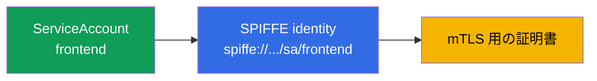
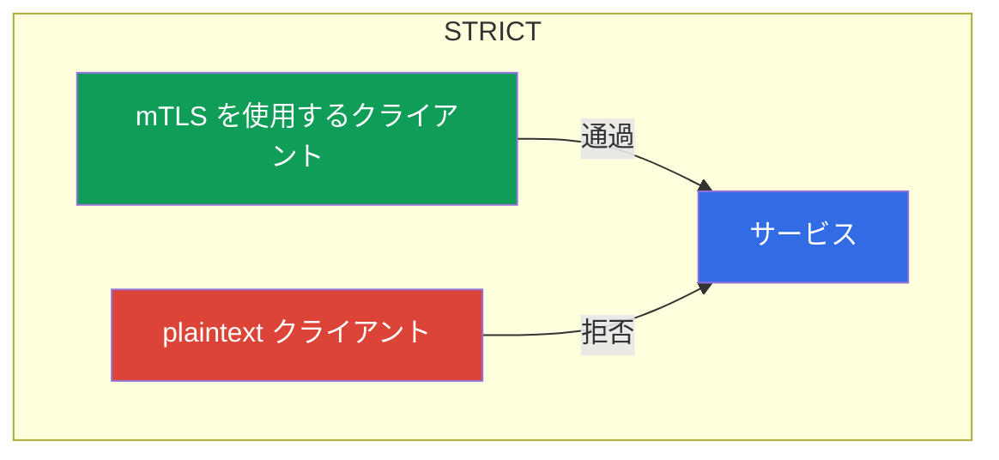
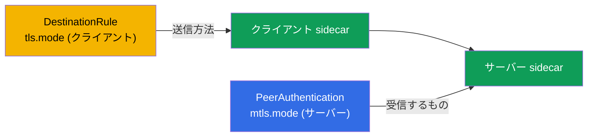
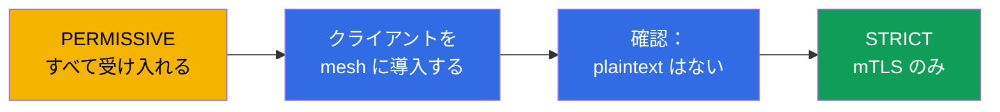

[Русская версия](ru.md) · [Eng version](en.md) · [Versión en español](es.md) · [Version française](fr.md) · [Deutsche Version](de.md) · [ქართული ვერსია](ge.md) · [繁體中文版](tw.md)

# 第13章。mTLS と PeerAuthentication：Zero Trust モデル

> **次へ。** 試験の第2の大きなドメイン、セキュリティが始まります。デフォルトでは、クラスター内の任意の Pod は任意のサービスに到達でき、その間のトラフィックは平文で流れます。この章では、セキュリティの基盤を構築します。サービス間の相互 TLS（mTLS）と、PeerAuthentication によるその管理です。これが Zero Trust モデルの基礎です。

## 13.1. 問題：フラットな信頼ネットワーク

通常のクラスターではネットワークは「フラット」です。Pod A が Pod B のアドレスを知っていれば、その Pod にアクセスでき、トラフィックは暗号化されずに流れます。実際に誰が接続しているのかを検証するものはありません。内部に侵入した攻撃者にとっては格好の標的です。サービス間を自由に移動し、トラフィックを盗聴できます。

**Zero Trust** モデル（「誰も信頼しない」）はこれを覆します。信頼できることを証明するまで、デフォルトではいかなる接続も信頼しません。Istio でこれを実現する最初のステップが、すべてのサービス間の相互 TLS です。

## 13.2. Identity と SPIFFE

トラフィックを暗号化して検証するには、各サービスに **アイデンティティ**（identity）が必要です。Istio ではこれは Kubernetes ServiceAccount を基に構築され、**SPIFFE** 標準に従って表現されます。

**SPIFFE**（Secure Production Identity Framework For Everyone）は、ネットワークに依存せずに（IP、ポート、ホスト名は信頼性が低く変化するため）サービスへ検証可能なアイデンティティを発行する方法を定義するオープン標準（CNCF プロジェクト）です。SPIFFE ではアイデンティティは URI 形式の文字列識別子（SPIFFE ID）であり、サービスは特別な形式の証明書（SVID）に格納されたこれを用いて自らを証明します。この標準はベンダー中立であるため、こうした identity は Istio の外部でも理解できます。Istio における SPIFFE ID は次のようになります。

```
spiffe://cluster.local/ns/<namespace>/sa/<serviceaccount>
```

これは単純に、信頼ドメイン `cluster.local` 内の namespace `<namespace>` に属し、ServiceAccount `<serviceaccount>` を持つサービスを意味します。



つまり、CKA で Kubernetes API へのアクセスに使用したあの ServiceAccount が、ここでは mesh 内におけるサービスの暗号学的アイデンティティになります。Istio はこのアイデンティティによりトラフィックを暗号化し、その後（第14章で）誰に何を許可するかを決定します。

**ServiceAccount が指定されていない場合は？** Kubernetes では Pod には **常に** ServiceAccount があります。明示的に指定しなければ、Pod はその namespace の SA `default` を取得します。「アイデンティティがない」ことはなく、あるのは **`default` のアイデンティティ**です。ここから重要な帰結が得られます。複数の異なるサービスをそれぞれの SA なしで実行すると、それらはすべて**同一の** SPIFFE アイデンティティ（`spiffe://.../sa/default`）を持ちます。mTLS 暗号化では重大ではありませんが、認可（第14章）では問題です。これらを区別できないため、「`frontend` のみ許可する」というルールを他から切り分けられません。したがってベストプラクティスは、**サービスごとに独自の ServiceAccount** を用意することです（少なくとも同じ権限を持つグループごとに）。

**sidecar なしの Pod（mesh 外）の場合は？** Istio でアイデンティティを与えるのは sidecar です。sidecar が istiod から証明書を取得して提示します。sidecar のない Pod（インジェクトされていない、または `istio-injection` のない namespace にある）は、**SPIFFE アイデンティティも証明書も持たず**、通常の plaintext を送信します。挙動は受信サーバーのモード（13.4）に依存します。

- **`PERMISSIVE`** のサーバーはこの接続を（平文で）受け入れます。これにより mesh を段階的に導入できます。
- **`STRICT`** のサーバーは**拒否**します。mTLS がなければ接続もありません。

また認可の観点では、この Pod からのトラフィックには**検証済みのアイデンティティ**がありません（`source.principal` は空です）。したがってプリンシパルに基づくルールは適用できず、せいぜい信頼性の低い IP に基づくものだけになります。結論として、サービスが本物の identity を持つには sidecar を伴って mesh 内に存在する必要があり、そうでなければ Zero Trust においては「匿名」です。

## 13.3. 自動 mTLS

Istio の最大の利便性は、mTLS が**自動的に**機能することです。証明書を扱う必要はありません。istiod は認証局（CA）として動作します。

- 各 sidecar に SPIFFE アイデンティティを持つ証明書を発行します。
- これらの証明書を自動的にローテーションします（デフォルトでは毎日）。
- SDS 経由で Envoy に配信します（第4章で扱った Secret Discovery Service を思い出してください）。

一方の sidecar が別の sidecar に接続すると、両者は**相互** TLS ハンドシェイクを実行します。双方が証明書を提示し、互いを検証します。通常の TLS（第9章のように）では、サーバーがクライアントに自らを証明します。mutual TLS では、**双方**が自らのアイデンティティを証明します。その結果、トラフィックは暗号化されると同時に認証されます。しかもアプリケーションコードを1行も書かずに実現できます。

## 13.4. PeerAuthentication：mTLS モード

サービスが着信接続をどのように受け入れるかは、`PeerAuthentication` リソースで管理します。モードは3つあります。

| モード | サーバーが受け入れるもの | 使用する場面 |
|-------|----------------------|--------------------|
| `PERMISSIVE` | mTLS と plaintext の両方 | デフォルト、移行期間 |
| `STRICT` | mTLS のみ | Zero Trust の目標 |
| `DISABLE` | plaintext のみ | mTLS を無効化（まれ、デバッグ用） |

デフォルトで Istio は `PERMISSIVE` で動作します。サービスは暗号化されたトラフィックと平文のトラフィックの両方を受け入れます。これは、まだ mesh 内にいないものを壊さずに、mesh を段階的に導入できるようにするためです。

namespace 全体で厳格な mTLS を有効にするには、次のようにします。

```yaml
apiVersion: security.istio.io/v1
kind: PeerAuthentication
metadata:
  name: default         # 名前 default + selector なし = namespace 全体
  namespace: app
spec:
  mtls:
    mode: STRICT
```



`STRICT` モードでは、サービスはすべての暗号化されていないトラフィックを拒否します。sidecar のないクライアント（plaintext を送信するもの）は、単に接続を確立できません。

## 13.5. ポリシーの適用範囲

`PeerAuthentication` は3つのレベルで適用できます。これは重要な点です。

- **mesh 全体**：ルート namespace（`istio-system`）にある、名前が `default` のポリシー。
- **Namespace**：対象 namespace 内で、名前が `default` かつ `selector` のないポリシー（上の例のとおり）。
- **特定の Pod**：`selector.matchLabels` を持つポリシー。選択された Pod にのみ適用されます。

```yaml
spec:
  selector:
    matchLabels:
      app: payments     # payments の Pod のみ
  mtls:
    mode: STRICT
```

より狭いポリシーは、より広いポリシーを上書きします。たとえば mesh 全体で `STRICT` を有効にしつつ、1つの legacy サービスだけは selector を持つポリシーにより `PERMISSIVE` のままにできます。

さらに細かいレベルとして、**個別ポート**があります。`portLevelMtls` により、全体設定とは異なるモードを特定ポートに設定できます。典型例は、サービス全体は `STRICT` にしながら、mesh 外の何かが接続するメトリクス／ヘルスチェック用ポートを `PERMISSIVE` のままにすることです。

```yaml
spec:
  selector:
    matchLabels:
      app: payments
  mtls:
    mode: STRICT          # Pod の全ポートに対するデフォルト
  portLevelMtls:
    9090:
      mode: PERMISSIVE    # ただしポート 9090 (メトリクス) には plaintext も許可する
```

## 13.6. クライアントとサーバー：PeerAuthentication vs DestinationRule

役割の分離を理解することが重要です。そうしなければ不可解な `503` が発生しがちです。

- **`PeerAuthentication` はサーバー側（着信側）のみを管理します**。すなわち、サービスが**受け入れることに同意する**もの（mTLS、plaintext、または両方）です。
- **クライアント側（送信側）**、つまり送信 sidecar が接続を確立する方法は、**自動 mTLS** により決定されます。Istio は受信側に sidecar があることを自動的に検知し、mTLS を送信します。クライアントモードを明示的に設定する場合は、`DestinationRule` の `trafficPolicy.tls.mode: ISTIO_MUTUAL` を使用します。

通常はこれを意識する必要はありません。自動 mTLS が両側を自動的に整合させます。問題は、誰かが `PeerAuthentication` と競合する `tls.mode` を持つ `DestinationRule` を手動で設定した場合に発生します。

- サーバーが `STRICT` で、クライアントの `DestinationRule` が `mode: DISABLE`（または `SIMPLE`）の場合 → クライアントは plaintext を送信し、サーバーは mTLS を要求します → **接続は切断され、`503`**。
- 逆の状況（`DestinationRule` が `ISTIO_MUTUAL` を要求し、サーバーが `DISABLE`）もエラーです。



ルール：クライアント（`DestinationRule`）とサーバー（`PeerAuthentication`）のモードは整合していなければなりません。DestinationRule の `tls` に手を加えなければ、自動 mTLS がすべてを自動的に整合させます。これが推奨される方法です。

## 13.7. ダウンタイムなしでの PERMISSIVE から STRICT への移行

稼働中のクラスターでいきなり `STRICT` を有効にするのは危険です。まだ plaintext を送信しているすべてのクライアント（mesh 外、legacy アプリケーション）が即座に切断されます。正しい方法は段階的な移行であり、`PERMISSIVE` はまさにそのために存在します。

手順は次のとおりです。

1. **PERMISSIVE で開始します**（デフォルト）。サービスは mTLS と plaintext の両方を受け入れるため、何も壊れません。
2. **クライアントを mesh に導入します。** サービスにアクセスするすべてのクライアントへ、段階的に sidecar を追加します。クライアントに sidecar が追加されると、mTLS 経由の通信を自動的に開始します（`PERMISSIVE` のサービスはこれを受け入れます）。
3. **plaintext が残っていないことを確認します。** メトリクスとログが役立ちます。サービスへの暗号化されていない接続が残っていないか確認します。
4. **STRICT に切り替えます。** すべてのトラフィックが mTLS を経由するようになったら、`STRICT` を有効にします。これで plaintext は禁止されますが、もはや残っていないため、誰も影響を受けません。



重要な考え方：`PERMISSIVE` は「永続的に安全でない」ものではなく、plaintext から厳格な mTLS へ移行するための安全な橋渡しです。

## 13.8. Kubernetes プローブと STRICT mTLS

STRICT mTLS を有効にする際に頻繁につまずく実用上の落とし穴があります。Pod のヘルスチェック（liveness/readiness/startup）を送信するのは **kubelet** です。kubelet は Pod に直接アクセスし、**mesh 外**にあります。sidecar も mTLS アイデンティティもありません。アプリケーションポートで STRICT mTLS が必要な場合、sidecar は暗号化された接続を待ちますが、kubelet は通常の HTTP を送信します。そのためプローブは失敗し、Pod は「異常」と見なされ、再起動ループに入ります。

Istio はこれを自動的に解決します。インジェクション時に **HTTP プローブを書き換えます**（`rewriteAppHTTPProbers` パラメータはデフォルトで有効です）。kubelet からのプローブは sidecar 内の pilot-agent にリダイレクトされ、pilot-agent は mTLS を迂回して localhost 経由でアプリケーションにプロキシします。


覚えておくべき重要事項：

- HTTP および gRPC プローブでは**そのままで**機能します。挙動はアノテーション `sidecar.istio.io/rewriteAppHTTPProbers` により制御されます。
- STRICT mTLS 使用時に rewrite を**無効化**すると、HTTP プローブが失敗し始め、Pod は繰り返し再起動されます（CrashLoop）。これは **mesh を有効にした直後**によくある問題です。インジェクション後に Pod が再起動で「停止」した場合、プローブを確認してください。
- **TCP プローブ**は通常影響を受けません。ポートが開いているかだけを確認します。**exec プローブ**はコンテナ内で実行され、mesh には関係しません。

## 13.9. mTLS の確認

mTLS を有効にするだけでは不十分です。トラフィックが実際に暗号化されていることを確認する必要があります。いくつかの方法があります。

**`istioctl` describe** は、Pod に mTLS が適用されているか、またどのポリシーかを表示します。

```bash
istioctl x describe pod <pod> -n app
# 出力例: "Effective PeerAuthentication mode: STRICT" など
```

**Envoy 設定**では、着信リスナーでどのモードが整合しているかを確認できます。

```bash
istioctl proxy-config listeners <pod> -n app -o json | grep -i tlsMode
```

**Envoy メトリクス**では、各接続にセキュリティの指標があります。トラフィックが mTLS を使用する場合、メトリクスは `connection_security_policy="mutual_tls"` になります。

```bash
kubectl exec <pod> -c istio-proxy -n app -- \
  pilot-agent request GET stats/prometheus | grep connection_security_policy
```

さらに便利なのは視覚的に確認する方法です。**Kiali**（第16章）は、トラフィックが mTLS で保護されているグラフのエッジに「鍵」を描画します。`STRICT` を期待していたのに鍵がない、またはメトリクスが `connection_security_policy="none"` である場合は、トラフィックはまだ plaintext です。原因を探してください（sidecar のないクライアント、または `DestinationRule` の競合。13.6 を参照）。

## 13.10. mTLS はまだ認可ではない

mTLS を過大評価しないことが重要です。mTLS は**「この接続は信頼できるか、接続先は誰か？」**という問いに答えます。つまり、チャネルを暗号化し、相手のアイデンティティを確認します。しかし、その相手が具体的に何を実行してよいかは制限**しません**。

例として、`STRICT` mTLS を有効にしたとします。これにより sidecar のないクライアントは `payments` サービスに到達できなくなります。しかし、独自の有効な mTLS 証明書を持つ mesh 内の任意のサービスは、依然として `payments` にアクセスできます。「`payments` には `frontend` から、かつ GET メソッドのみ許可する」と指定するには、別の仕組みである `AuthorizationPolicy` が必要です。これは次の第14章のテーマです。mTLS と認可は連携して機能します。認可は mTLS が提供するアイデンティティに依存します。

## 13.11. 脅威モデル：mTLS が防ぐものと防がないもの

mTLS を正しく適用するには、その境界を理解する必要があります。mTLS は明確な攻撃を防ぎますが、「銀の弾丸」ではありません。

**防ぐもの：**

- **トラフィックの盗聴（sniffing）。** mesh 内ではすべてが暗号化されます。ネットワークトラフィックを読む攻撃者（別の Pod での傍受、ミラーリング、侵害されたネットワークコンポーネント）は、暗号文しか見ることができません。
- **ネットワーク上のアイデンティティ詐称（spoofing）。** 単にサービスの IP または名前を知っているだけでそのサービスを装うことはできません。必要な SPIFFE ID を持つ有効な証明書がなければ、`STRICT` のサーバーは接続を受け入れません。
- **「外部」の Pod からの Lateral movement。** sidecar のない Pod（または mesh 外の Pod）は、`STRICT` のサービスに到達できません。
- **クラスター内部での MITM。** 証明書の相互検証により、中間に割り込むことはできません。

**防がないもの：**

- **ノードの侵害。** これは重要な点です。workload の秘密鍵と証明書は sidecar（Envoy）のメモリに存在し、ノード上のソケットを経由して SDS により配信されます。攻撃者がコンテナから脱出してノード上の **root** を取得すると、次のことが可能になります。
  - **そのノード上で実行されているすべての Pod の**鍵／証明書を読み取り、その SPIFFE アイデンティティを偽装できます。mesh にとってはこれは正当なトラフィックです。
  - これらの Pod にマウントされた**ServiceAccount トークン**を取得し、それらのアイデンティティとして Kubernetes API と mesh サービスの両方へアクセスできます。

  **別の**ノードの Pod の鍵はそこには存在しないため取得できません。したがって影響範囲は、同じノード上の隣接ワークロードのアイデンティティに限定されます。しかしノード内では、mTLS はすでに障壁ではありません。
- **侵害されたアプリケーション。** サービス自体が侵害された場合、そのサービスには有効なアイデンティティがあります。mTLS はそれを正しく確認します。そのサービスが実行できることを制限するのは、mTLS ではなく `AuthorizationPolicy`（第14章）の役割です。
- **アプリケーションレベルの脆弱性**（インジェクション、ロジックのバグ）。mTLS はトランスポートの仕組みであり、ロジックの仕組みではありません。

**結論と defense-in-depth。** mTLS はネットワーク攻撃への防御レベルを引き上げますが、ノードを奪取することはそのノードの Pod アイデンティティを奪取することと同じです。そのため mTLS は以下で補完します。

- コンテナ脱出からの保護（privileged の禁止、capabilities の drop、`runAsNonRoot`、read-only rootfs、seccomp、AppArmor/SELinux、Pod Security Standards + admission コントロール、gVisor/Kata などの sandbox ランタイム）。これは CKS のドメインです。
- 高価値 workload を専用ノードに隔離すること（taints/`nodeSelector`）。信頼できない workload と共存させないためです。
- 盗まれた認証情報の価値を下げること。短命な bound トークン、`automountServiceAccountToken: false`、RBAC least-privilege、短い証明書 TTL。
- `AuthorizationPolicy`（mesh における least-privilege）と runtime 検知（Falco、監査）により、異常なアイデンティティ利用を可視化すること。

## 13.12. ベストプラクティス

- **目標は mesh 全体での `STRICT`**ですが、「いきなり」ではなく `PERMISSIVE` とトラフィック検証（13.7）を通じて到達してください。
- **必要がない限り、`DestinationRule` の `tls` を変更しないでください。** 自動 mTLS が両側を整合させます。手動の `mode` は、`PeerAuthentication`（13.6）との競合による `503` のよくある原因です。
- **例外は限定的に設定してください。** mesh 外の legacy サービスには、mesh 全体を後退させるのではなく、特定のポートに対する `selector` または `portLevelMtls` を持つ `PERMISSIVE` を使用します。
- **`rewriteAppHTTPProbers` を無効にしないでください。** そうしないと STRICT mTLS が HTTP プローブを壊し、Pod を CrashLoop に陥らせます（13.8）。
- **mTLS が実際に機能していることを確認してください**（13.9）。`connection_security_policy` メトリクス、`istioctl x describe`、Kiali の鍵を確認し、「有効にしたから大丈夫」とは考えないでください。
- **意味のある ServiceAccount に identity を基づかせてください。** すべてを `default` SA で実行しないでください。SPIFFE アイデンティティ = namespace + ServiceAccount であり、認可（第14章）もこれに依存します。
- **mTLS は認可の代替ではありません。** STRICT は暗号化とアイデンティティ確認を行いますが、アクセスを制限するのは `AuthorizationPolicy`（第14章）です。

## 13.13. この章のまとめ

- フラットなクラスターのネットワークは安全ではありません。Zero Trust モデルでは、サービス間トラフィックの暗号化と認証が必要です。
- サービスのアイデンティティは ServiceAccount から構築され、SPIFFE として表現されます（`spiffe://.../ns/.../sa/...`）。
- Pod には常に SA があります（デフォルトは `default`）。独自の SA がなければ、サービスは1つのアイデンティティを共有し、認可で区別できません。各サービスに独自の ServiceAccount を与えてください。sidecar のない Pod はアイデンティティを持ちません。plaintext を送信し（`PERMISSIVE` は受け入れ、`STRICT` は拒否）、認可では「匿名」のままです。
- Istio の mTLS は自動です。istiod が証明書を発行、ローテーションし、SDS 経由で配信します。
- **PeerAuthentication** はモードを設定します。`PERMISSIVE`（mTLS と plaintext の両方）、`STRICT`（mTLS のみ）、`DISABLE`。
- ポリシーは mesh、namespace、または特定 Pod のレベルで適用でき、狭いものが広いものを上書きします。
- `STRICT` への移行は `PERMISSIVE` を経由します。全員を mesh に導入し、確認してから切り替えることで、ダウンタイムなしに実施できます。
- mTLS は「誰を信頼し、暗号化するか」を担いますが、「何を許可するか」は担いません。これは AuthorizationPolicy（第14章）の役割です。
- Kubernetes プローブは kubelet（mesh 外）から送信されます。STRICT mTLS では、Istio はデフォルトで HTTP プローブ（`rewriteAppHTTPProbers`）を書き換え、失敗しないようにします。rewrite を無効にすると、mesh の有効化後に CrashLoop が発生します。
- `PeerAuthentication` は**サーバー側**（着信側）を管理します。クライアント側は自動 mTLS／`DestinationRule` です。DestinationRule の `tls.mode` とサーバーポリシーの競合は、`503` のよくある原因です。
- `portLevelMtls` を使用すれば、**個別ポート**にもモードを設定できます。
- mTLS は実際に確認する必要があります。`connection_security_policy=mutual_tls` メトリクス、`istioctl x describe`/`proxy-config`、Kiali の鍵を利用します。
- 脅威モデル：mTLS は盗聴、spoofing、ネットワーク上の lateral movement を防ぎますが、**ノードの侵害**（ノードの root はその Pod の鍵と SA トークンを読み取れる）や侵害されたアプリケーションは防ぎません。container escape からの保護（CKS）、高価値 workload の隔離、least-privilege、`AuthorizationPolicy`、runtime 検知という defense-in-depth が必要です。

## 13.14. 理解度チェックの質問

1. Zero Trust モデルとは何ですか。また、なぜフラットなクラスターのネットワークはこれに反しますか？
2. Istio ではサービスの identity はどのように構築され、ServiceAccount はどのように関係しますか？独自の SA を指定しない場合、アイデンティティはどうなりますか？
3. sidecar のない Pod はどのアイデンティティを持ち、`PERMISSIVE` および `STRICT` のサービスとどのように通信しますか？
4. mutual TLS は通常の TLS とどう異なりますか？
5. PERMISSIVE と STRICT モードの違いは何ですか？
6. 稼働中のクラスターで即座に STRICT を有効にできない理由と、正しい移行方法は何ですか？
7. mTLS が**解決しない**ことは何ですか？アクセス制御にはどの仕組みが必要ですか？
8. STRICT mTLS で Kubernetes プローブが壊れる可能性がある理由と、Istio がデフォルトでこれを解決する方法は何ですか？
9. `PeerAuthentication`（サーバー）と `DestinationRule`（クライアント）の違いは何ですか？それらの不整合はどのように `503` につながりますか？
10. 個別ポートの mTLS モードを設定するにはどうしますか？
11. トラフィックが実際に mTLS を経由していることを実運用で確認するにはどうしますか？
12. mTLS はどの攻撃から保護し、どの攻撃からは保護しませんか？攻撃者がクラスターのノードで root を取得すると何が起こりますか？
13. mTLS を defense-in-depth で補完する必要がある理由と、その具体的な対策は何ですか？

## 演習

PeerAuthentication による STRICT mTLS を練習してください（plaintext クライアントの拒否も確認します）。

🧪 ラボ 04: [tasks/ica/labs/04](../../labs/04/README_JP.MD)

PERMISSIVE から STRICT への安全な移行を練習してください。

🧪 ラボ 20: [tasks/ica/labs/20](../../labs/20/README_JP.MD)

---
[目次](../README_JP.md) · [第12章](../12/jp.md) · [第14章](../14/jp.md)