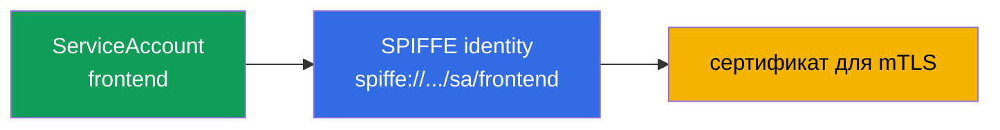
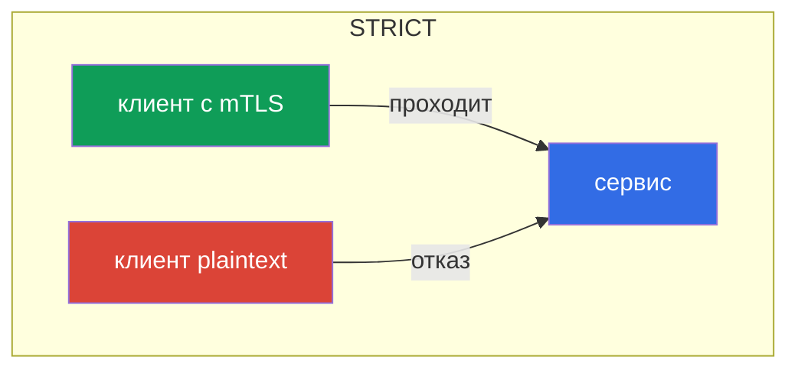
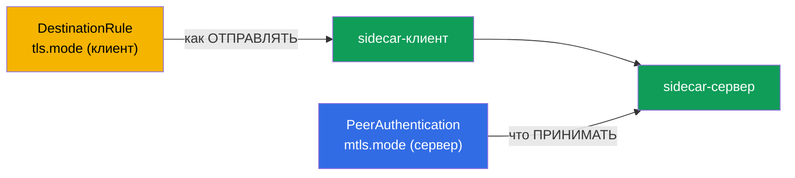
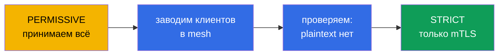
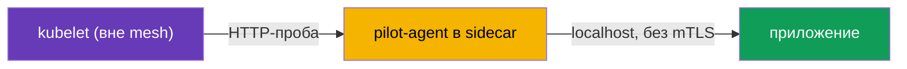

[Eng version](en.md) · [Versión en español](es.md) · [Version française](fr.md) · [Deutsche Version](de.md)

# Глава 13. mTLS и PeerAuthentication: модель Zero Trust

> **Что дальше.** Начинается второй большой домен экзамена - безопасность. По
> умолчанию внутри кластера любой под может достучаться до любого сервиса, и трафик
> между ними идёт открытым текстом. В этой главе построим фундамент безопасности:
> взаимный TLS (mTLS) между сервисами и управление им через PeerAuthentication. Это
> основа модели Zero Trust.

## 13.1. Проблема: плоская доверенная сеть

В обычном кластере сеть «плоская»: если под А знает адрес пода Б, он может к нему
обратиться, и трафик пойдёт незашифрованным. Никто не проверяет, кто на самом деле
стучится. Для злоумышленника, попавшего внутрь, это подарок: можно свободно ходить
между сервисами и слушать трафик.

Модель **Zero Trust** («не доверяй никому») переворачивает это: по умолчанию не
доверяем никакому соединению, пока оно не доказало, что ему можно доверять. В Istio
первый шаг к этому - взаимный TLS между всеми сервисами.

## 13.2. Identity и SPIFFE

Чтобы шифровать и проверять трафик, каждому сервису нужна **личность** (identity). В
Istio она строится на основе Kubernetes ServiceAccount и оформляется по стандарту
**SPIFFE**.

**SPIFFE** (Secure Production Identity Framework For Everyone) - это открытый стандарт
(проект CNCF), который описывает, как выдавать сервисам проверяемую личность, не
завязываясь на сеть (IP, порт, имя хоста ненадёжны и меняются). Личность в SPIFFE это
строка-идентификатор (SPIFFE ID) в виде URI, а «упаковывается» она в сертификат
специального формата (SVID), которым сервис и доказывает, кто он. Стандарт вендор-
нейтральный, поэтому такая identity понятна и за пределами Istio. В Istio SPIFFE ID
выглядит так:

```
spiffe://cluster.local/ns/<namespace>/sa/<serviceaccount>
```

Читается просто: сервис из namespace `<namespace>` с ServiceAccount `<serviceaccount>`
в доверенном домене `cluster.local`.



То есть тот самый ServiceAccount, который вы в CKA использовали для доступа к API
Kubernetes, здесь становится криптографической личностью сервиса в mesh. Именно по
этой личности Istio шифрует трафик и потом (в главе 14) решает, кому что можно.

**А если ServiceAccount не задан?** В Kubernetes у пода **всегда** есть ServiceAccount: если
вы не указали его явно, под получает SA `default` своего namespace. «Личности нет» не бывает — бывает **личность `default`**. Отсюда важное следствие: если десяток разных сервисов
запущен без своего SA, все они получают **одну и ту же** SPIFFE-личность
(`spiffe://.../sa/default`). Для mTLS-шифрования это не критично, но для авторизации (глава
14) - беда: их невозможно различить, правило «пускать только `frontend`» отделить от других
не выйдет. Поэтому best practice - **свой ServiceAccount на каждый сервис** (или хотя бы на
каждую группу с одинаковыми правами).

**А если под без sidecar (вне mesh)?** Личность в Istio даёт именно sidecar: он получает
сертификат от istiod и предъявляет его. Под без sidecar (не инжектирован, или в namespace без
`istio-injection`) **никакой SPIFFE-личности и сертификата не имеет** и шлёт обычный
plaintext. Поведение зависит от режима сервера-получателя (13.4):

- сервер в **`PERMISSIVE`** - примет такое соединение (открытым текстом), это и позволяет
  внедрять mesh постепенно;
- сервер в **`STRICT`** - **отвергнет**: нет mTLS - нет соединения.

И с точки зрения авторизации у трафика от такого пода **нет проверенной личности**
(`source.principal` пуст), поэтому правила по принципалам к нему не применить - максимум по IP,
что ненадёжно. Вывод: чтобы сервис имел настоящую identity, он должен быть в mesh (с
sidecar), иначе для Zero Trust он «аноним».

## 13.3. Автоматический mTLS

Главное удобство Istio: mTLS работает **автоматически**, вам не надо возиться с
сертификатами. istiod выступает как центр сертификации (CA):

- выдаёт каждому sidecar сертификат с его SPIFFE-личностью;
- автоматически ротирует эти сертификаты (по умолчанию каждые сутки);
- доставляет их в Envoy по SDS (помните из главы 4 - Secret Discovery Service).

Когда один sidecar соединяется с другим, они выполняют **взаимный** TLS-хендшейк: обе
стороны предъявляют сертификаты и проверяют друг друга. В обычном TLS (как в главе 9)
сервер доказывает клиенту, кто он. В mutual TLS **обе** стороны доказывают свою
личность. В результате трафик и зашифрован, и аутентифицирован - и всё это без единой
строчки в коде приложения.

## 13.4. PeerAuthentication: режимы mTLS

Управляет тем, как сервисы принимают входящие соединения, ресурс `PeerAuthentication`.
У него три режима:

| Режим | Что принимает сервер | Когда использовать |
|-------|----------------------|--------------------|
| `PERMISSIVE` | и mTLS, и plaintext | дефолт, переходный период |
| `STRICT` | только mTLS | цель для Zero Trust |
| `DISABLE` | только plaintext | отключить mTLS (редко, для отладки) |

По умолчанию Istio работает в `PERMISSIVE`: сервис принимает и зашифрованный, и
открытый трафик. Это сделано, чтобы mesh можно было внедрять постепенно, не ломая тех,
кто ещё не в mesh.

Включить строгий mTLS на весь namespace:

```yaml
apiVersion: security.istio.io/v1
kind: PeerAuthentication
metadata:
  name: default         # имя default + без selector = на весь namespace
  namespace: app
spec:
  mtls:
    mode: STRICT
```



В режиме `STRICT` сервис отвергает любой незашифрованный трафик. Клиент без sidecar
(который шлёт plaintext) просто не сможет установить соединение.

## 13.5. Область действия политики

`PeerAuthentication` можно применять на трёх уровнях, и это важно понимать:

- **Весь mesh** - политика в корневом namespace (`istio-system`) с именем `default`.
- **Namespace** - политика с именем `default` и без `selector` в нужном namespace
  (как в примере выше).
- **Конкретные поды** - политика с `selector.matchLabels`, действует только на
  выбранные поды.

```yaml
spec:
  selector:
    matchLabels:
      app: payments     # только поды payments
  mtls:
    mode: STRICT
```

Более узкая политика переопределяет более широкую. Например, можно включить `STRICT` на
весь mesh, но для одного legacy-сервиса оставить `PERMISSIVE` через политику с selector.

Есть и ещё более тонкий уровень - **отдельный порт**. Через `portLevelMtls` можно задать
режим для конкретных портов, отличный от общего. Классический пример: весь сервис в
`STRICT`, но порт метрик/проверок, куда стучится что-то вне mesh, оставить `PERMISSIVE`:

```yaml
spec:
  selector:
    matchLabels:
      app: payments
  mtls:
    mode: STRICT          # по умолчанию для всех портов пода
  portLevelMtls:
    9090:
      mode: PERMISSIVE    # но на порт 9090 (метрики) пускаем и plaintext
```

## 13.6. Клиент и сервер: PeerAuthentication vs DestinationRule

Важно понимать разделение ролей, иначе легко получить загадочные `503`.

- **`PeerAuthentication` управляет только серверной (входящей) стороной** - тем, что сервис
  соглашается **принимать** (mTLS, plaintext или оба).
- **Клиентская (исходящая) сторона** - то, как sidecar-отправитель устанавливает соединение
  - определяется **авто-mTLS**: Istio сам видит, что у получателя есть sidecar, и шлёт mTLS.
  Явно клиентский режим задаётся в `DestinationRule` через `trafficPolicy.tls.mode:
  ISTIO_MUTUAL`.

В норме про это думать не нужно - авто-mTLS согласует стороны сам. Проблема возникает, когда
кто-то вручную ставит `DestinationRule` с `tls.mode`, конфликтующим с `PeerAuthentication`:

- Сервер в `STRICT`, а `DestinationRule` у клиента с `mode: DISABLE` (или `SIMPLE`) → клиент
  шлёт plaintext, сервер требует mTLS → **соединение рвётся, `503`**.
- Обратная ситуация (`DestinationRule` требует `ISTIO_MUTUAL`, а сервер в `DISABLE`) - тоже
  ошибка.



Правило: режимы клиента (`DestinationRule`) и сервера (`PeerAuthentication`) должны быть
согласованы. Если не трогать `tls` в DestinationRule, авто-mTLS всё согласует сам - это и
есть рекомендуемый путь.

## 13.7. Миграция PERMISSIVE в STRICT без даунтайма

Включить `STRICT` «в лоб» на живом кластере опасно: все клиенты, которые ещё шлют
plaintext (не в mesh, legacy-приложения), мгновенно отвалятся. Правильный путь -
постепенная миграция, и `PERMISSIVE` создан именно для неё.

Порядок такой:

1. **Старт в PERMISSIVE** (это дефолт). Сервис принимает и mTLS, и plaintext, ничего не
   ломается.
2. **Заводим клиентов в mesh.** Постепенно добавляем sidecar всем, кто обращается к
   сервису. Как только у клиента есть sidecar, он автоматически начинает ходить по mTLS
   (сервис в PERMISSIVE это принимает).
3. **Проверяем, что plaintext больше нет.** Убедиться помогают метрики и логи: смотрим,
   остались ли незашифрованные соединения к сервису.
4. **Переключаем на STRICT.** Когда весь трафик уже идёт по mTLS, включаем `STRICT`.
   Теперь plaintext запрещён, но раз его и так не осталось, никто не пострадал.



Ключевая идея: `PERMISSIVE` это не «навсегда небезопасно», а безопасный мостик от
plaintext к строгому mTLS.

## 13.8. Пробы Kubernetes и STRICT mTLS

Практический подводный камень, на котором часто спотыкаются при включении STRICT mTLS.
Проверки здоровья пода (liveness/readiness/startup) отправляет **kubelet** - напрямую на
под, а kubelet находится **вне mesh**: у него нет sidecar и mTLS-личности. Если на порт
приложения требуется STRICT mTLS, sidecar ждёт зашифрованное соединение, а kubelet шлёт
обычный HTTP - проба падает, под считается «нездоровым» и уходит в цикл перезапусков.

Istio решает это автоматически: при инъекции он **переписывает HTTP-пробы** (параметр
`rewriteAppHTTPProbers`, включён по умолчанию). Проба от kubelet перенаправляется на
pilot-agent внутри sidecar, а тот проксирует её к приложению по localhost, минуя mTLS.



Что важно помнить:

- Для HTTP- и gRPC-проб это работает **из коробки**; поведение управляется аннотацией
  `sidecar.istio.io/rewriteAppHTTPProbers`.
- Если rewrite **отключить** при STRICT mTLS, HTTP-пробы начнут падать, и поды будут
  циклически перезапускаться (CrashLoop). Это частая причина проблем **сразу после
  включения mesh** - если поды «залипли» в рестартах после инъекции, проверьте пробы.
- **TCP-пробы** обычно не страдают - они лишь проверяют, что порт открыт. **exec-пробы**
  выполняются внутри контейнера и mesh не касаются.

## 13.9. Проверка mTLS

Включить mTLS мало - надо убедиться, что трафик действительно шифруется. Несколько способов.

**`istioctl` describe** покажет по поду, действует ли на него mTLS и какая политика:

```bash
istioctl x describe pod <pod> -n app
# в выводе: "Effective PeerAuthentication mode: STRICT" и т.п.
```

**Конфигурация Envoy** - видно, какой режим согласован для входящих слушателей:

```bash
istioctl proxy-config listeners <pod> -n app -o json | grep -i tlsMode
```

**Метрики Envoy** - у каждого соединения есть признак безопасности. Если трафик идёт по
mTLS, в метриках стоит `connection_security_policy="mutual_tls"`:

```bash
kubectl exec <pod> -c istio-proxy -n app -- \
  pilot-agent request GET stats/prometheus | grep connection_security_policy
```

Ещё удобнее смотреть на это визуально: **Kiali** (глава 16) рисует «замок» на рёбрах графа,
где трафик защищён mTLS. Если ожидали `STRICT`, а замка нет или в метриках
`connection_security_policy="none"` - трафик всё ещё plaintext, ищите причину (клиент без
sidecar или конфликт `DestinationRule`, см. 13.6).

## 13.10. mTLS это ещё не авторизация

Важно не переоценивать mTLS. Он отвечает на вопрос **«можно ли доверять этому
соединению и кто на том конце?»** - то есть шифрует канал и подтверждает личность
собеседника. Но он **не** ограничивает, что именно этому собеседнику позволено делать.

Пример: включили `STRICT` mTLS. Теперь до сервиса `payments` не дотянется клиент без
sidecar. Но любой сервис в mesh со своим валидным mTLS-сертификатом по-прежнему может к
`payments` обратиться. Чтобы сказать «к payments можно только из frontend и только
методом GET», нужен уже другой механизм - `AuthorizationPolicy`, и это тема следующей
главы 14. mTLS и авторизация работают в связке: авторизация опирается на личность,
которую даёт mTLS.

## 13.11. Модель угроз: от чего mTLS защищает, а от чего нет

Чтобы правильно применять mTLS, надо понимать его границы: он закрывает вполне конкретные
атаки, но не является «серебряной пулей».

**От чего защищает:**

- **Подслушивание трафика (sniffing).** Внутри mesh всё зашифровано - злоумышленник, читающий
  сетевой трафик (перехват на другом поде, зеркалирование, скомпрометированный сетевой
  компонент), видит только шифртекст.
- **Подмена личности по сети (spoofing).** Нельзя выдать себя за сервис, просто зная его IP
  или имя: без валидного сертификата с нужным SPIFFE ID сервер в `STRICT` не примет
  соединение.
- **Lateral movement со стороны «чужого» пода.** Под без sidecar (или вне mesh) не сможет
  дотянуться до сервисов в `STRICT`.
- **MITM внутри кластера.** Взаимная проверка сертификатов не даёт вклиниться посредине.

**От чего НЕ защищает:**

- **Компрометация ноды.** Это ключевой момент. Приватные ключи и сертификаты workload'ов
  живут в памяти sidecar'ов (Envoy) и доставляются по SDS через сокет на ноде. Если
  злоумышленник сбежал из контейнера и получил **root на ноде**, он:
  - читает ключи/сертификаты **всех подов, запущенных на этой ноде**, и может выдавать себя за
    их SPIFFE-личности - для mesh это будет легитимный трафик;
  - забирает примонтированные **токены ServiceAccount** этих подов и ходит от их имени и в API
    Kubernetes, и в сервисы mesh.

  Ключи подов с **других** нод он так не получит (их там нет), поэтому радиус поражения -
  личности соседей по ноде. Но в пределах ноды mTLS уже не барьер.
- **Скомпрометированное приложение.** Если взломан сам сервис, у него есть валидная личность -
  mTLS честно её подтвердит. Ограничить, что этот сервис может делать, - задача
  `AuthorizationPolicy` (глава 14), а не mTLS.
- **Уязвимости на уровне приложения** (инъекции, логические баги) - mTLS про транспорт, а не
  про логику.

**Вывод и defense-in-depth.** mTLS поднимает планку для сетевых атак, но захват ноды = захват
личностей её подов. Поэтому mTLS дополняют:

- защитой от побега из контейнера (запрет privileged, drop capabilities, `runAsNonRoot`,
  read-only rootfs, seccomp, AppArmor/SELinux, Pod Security Standards + admission-контроль,
  sandbox-рантаймы вроде gVisor/Kata) - это домен CKS;
- изоляцией ценных workload'ов на выделенных нодах (taints/`nodeSelector`), чтобы они не
  соседствовали с недоверенными;
- обесцениванием украденных кредов: короткоживущие bound-токены, `automountServiceAccountToken:
  false`, RBAC least-privilege, короткий TTL сертификатов;
- авторизацией `AuthorizationPolicy` (least-privilege в mesh) и runtime-детектом (Falco,
  аудит), чтобы аномальное использование личности было видно.

## 13.12. Best practices

- **Цель - `STRICT` на весь mesh**, но приходить к ней через `PERMISSIVE` и проверку
  трафика (13.7), а не «в лоб».
- **Не трогайте `tls` в `DestinationRule` без необходимости.** Авто-mTLS согласует стороны
  сам; ручной `mode` - частая причина `503` при конфликте с `PeerAuthentication` (13.6).
- **Исключения делайте точечно.** Legacy вне mesh - через `PERMISSIVE` c `selector` или
  `portLevelMtls` на конкретный порт, а не откатом всего mesh.
- **Не отключайте `rewriteAppHTTPProbers`.** Иначе STRICT mTLS сломает HTTP-пробы и уронит
  поды в CrashLoop (13.8).
- **Проверяйте, что mTLS реально работает** (13.9): метрики `connection_security_policy`,
  `istioctl x describe`, замок в Kiali - не полагайтесь на то, что «включили и всё».
- **Опирайте identity на осмысленные ServiceAccount.** Не запускайте всё под `default` SA:
  SPIFFE-личность = namespace + ServiceAccount, и на неё же будет опираться авторизация
  (глава 14).
- **mTLS - не замена авторизации.** STRICT шифрует и подтверждает личность, но доступ
  ограничивает `AuthorizationPolicy` (глава 14).

## 13.13. Итоги главы

- Плоская сеть кластера небезопасна; модель Zero Trust требует шифровать и
  аутентифицировать трафик между сервисами.
- Личность сервиса строится из ServiceAccount и оформляется по SPIFFE
  (`spiffe://.../ns/.../sa/...`).
- SA есть у пода всегда (по умолчанию `default`); без своего SA сервисы делят одну личность и
  их не различить в авторизации - давайте каждому сервису свой ServiceAccount. Под без
  sidecar личности не имеет: шлёт plaintext (примет `PERMISSIVE`, отвергнет `STRICT`) и для
  авторизации остаётся «анонимом».
- mTLS в Istio автоматический: istiod выдаёт и ротирует сертификаты, доставка по SDS.
- **PeerAuthentication** задаёт режим: `PERMISSIVE` (и mTLS, и plaintext), `STRICT`
  (только mTLS), `DISABLE`.
- Политику можно применять на уровне mesh, namespace или конкретных подов; узкая
  переопределяет широкую.
- Миграцию на `STRICT` делают через `PERMISSIVE`: завести всех в mesh, проверить, потом
  переключить - без даунтайма.
- mTLS отвечает за «кому доверять и шифрование», но не за «что разрешено» - это задача
  AuthorizationPolicy (глава 14).
- Пробы Kubernetes идут от kubelet (вне mesh); при STRICT mTLS Istio по умолчанию
  переписывает HTTP-пробы (`rewriteAppHTTPProbers`), чтобы они не падали. Отключение
  rewrite ведёт к CrashLoop после включения mesh.
- `PeerAuthentication` управляет **серверной** (входящей) стороной; клиентская - это
  авто-mTLS/`DestinationRule`. Конфликт `tls.mode` в DestinationRule с политикой сервера -
  частая причина `503`.
- Режим можно задать и на **отдельный порт** через `portLevelMtls`.
- Проверять mTLS нужно фактически: метрики `connection_security_policy=mutual_tls`,
  `istioctl x describe`/`proxy-config`, замок в Kiali.
- Модель угроз: mTLS защищает от подслушивания, спуфинга и lateral movement по сети, но
  **не** от компрометации ноды (root на ноде читает ключи и SA-токены её подов) и не от
  взломанного приложения. Нужна defense-in-depth: защита от побега из контейнера (CKS),
  изоляция ценных нагрузок, least-privilege, `AuthorizationPolicy`, runtime-детект.

## 13.14. Вопросы для самопроверки

1. Что такое модель Zero Trust и почему плоская сеть кластера ей противоречит?
2. Как строится identity сервиса в Istio и при чём тут ServiceAccount? Что будет с личностью,
   если свой SA не задать?
3. Какую личность имеет под без sidecar и как он будет общаться с сервисами в `PERMISSIVE` и
   в `STRICT`?
4. Чем mutual TLS отличается от обычного TLS?
5. В чём разница между режимами PERMISSIVE и STRICT?
6. Почему нельзя сразу включить STRICT на живом кластере и как правильно мигрировать?
7. Что mTLS НЕ решает и какой механизм нужен для контроля доступа?
8. Почему пробы Kubernetes могут ломаться при STRICT mTLS и как Istio это решает по
   умолчанию?
9. Чем `PeerAuthentication` (сервер) отличается от `DestinationRule` (клиент)? Как их
   рассогласование приводит к `503`?
10. Как задать режим mTLS для отдельного порта?
11. Как на практике убедиться, что трафик реально идёт по mTLS?
12. От каких атак mTLS защищает, а от каких нет? Что произойдёт, если злоумышленник получит
    root на ноде кластера?
13. Почему mTLS нужно дополнять defense-in-depth и какими именно мерами?

## Практика

Отработайте STRICT mTLS через PeerAuthentication (и увидите отказ plaintext-клиента):

🧪 Лаба 04: [tasks/ica/labs/04](../../labs/04/README_RU.MD)

Отработайте безопасную миграцию PERMISSIVE в STRICT:

🧪 Лаба 20: [tasks/ica/labs/20](../../labs/20/README_RU.MD)

---
[Оглавление](../README.md) · [Глава 12](../12/ru.md) · [Глава 14](../14/ru.md)
