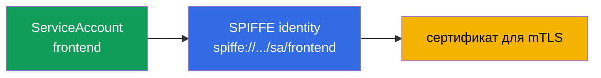
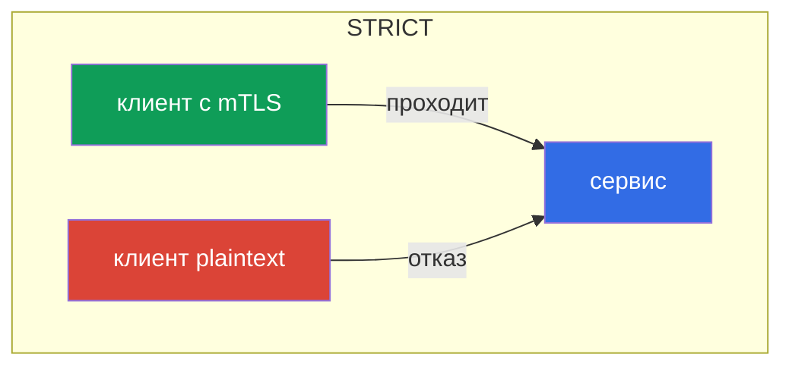
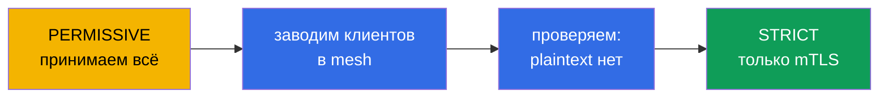

# Глава 13. mTLS и PeerAuthentication: модель Zero Trust

> **Что дальше.** Начинается второй большой домен экзамена - безопасность. По
> умолчанию внутри кластера любой под может достучаться до любого сервиса, и трафик
> между ними идёт открытым текстом. В этой главе построим фундамент безопасности:
> взаимный TLS (mTLS) между сервисами и управление им через PeerAuthentication. Это
> основа модели Zero Trust.

## 13.1. Проблема: плоская доверенная сеть

В обычном кластере сеть «плоская»: если под А знает адрес пода Б, он может к нему
обратиться, и трафик пойдёт незашифрованным. Никто не проверяет, кто на самом деле
стучится. Для злоумышленника, попавшего внутрь, это подарок: можно свободно ходить
между сервисами и слушать трафик.

Модель **Zero Trust** («не доверяй никому») переворачивает это: по умолчанию не
доверяем никакому соединению, пока оно не доказало, что ему можно доверять. В Istio
первый шаг к этому - взаимный TLS между всеми сервисами.

## 13.2. Identity и SPIFFE

Чтобы шифровать и проверять трафик, каждому сервису нужна **личность** (identity). В
Istio она строится на основе Kubernetes ServiceAccount и оформляется по стандарту
**SPIFFE**.

**SPIFFE** (Secure Production Identity Framework For Everyone) - это открытый стандарт
(проект CNCF), который описывает, как выдавать сервисам проверяемую личность, не
завязываясь на сеть (IP, порт, имя хоста ненадёжны и меняются). Личность в SPIFFE это
строка-идентификатор (SPIFFE ID) в виде URI, а «упаковывается» она в сертификат
специального формата (SVID), которым сервис и доказывает, кто он. Стандарт вендор-
нейтральный, поэтому такая identity понятна и за пределами Istio. В Istio SPIFFE ID
выглядит так:

```
spiffe://cluster.local/ns/<namespace>/sa/<serviceaccount>
```

Читается просто: сервис из namespace `<namespace>` с ServiceAccount `<serviceaccount>`
в доверенном домене `cluster.local`.



То есть тот самый ServiceAccount, который вы в CKA использовали для доступа к API
Kubernetes, здесь становится криптографической личностью сервиса в mesh. Именно по
этой личности Istio шифрует трафик и потом (в главе 14) решает, кому что можно.

## 13.3. Автоматический mTLS

Главное удобство Istio: mTLS работает **автоматически**, вам не надо возиться с
сертификатами. istiod выступает как центр сертификации (CA):

- выдаёт каждому sidecar сертификат с его SPIFFE-личностью;
- автоматически ротирует эти сертификаты (по умолчанию каждые сутки);
- доставляет их в Envoy по SDS (помните из главы 4 - Secret Discovery Service).

Когда один sidecar соединяется с другим, они выполняют **взаимный** TLS-хендшейк: обе
стороны предъявляют сертификаты и проверяют друг друга. В обычном TLS (как в главе 9)
сервер доказывает клиенту, кто он. В mutual TLS **обе** стороны доказывают свою
личность. В результате трафик и зашифрован, и аутентифицирован - и всё это без единой
строчки в коде приложения.

## 13.4. PeerAuthentication: режимы mTLS

Управляет тем, как сервисы принимают входящие соединения, ресурс `PeerAuthentication`.
У него три режима:

| Режим | Что принимает сервер | Когда использовать |
|-------|----------------------|--------------------|
| `PERMISSIVE` | и mTLS, и plaintext | дефолт, переходный период |
| `STRICT` | только mTLS | цель для Zero Trust |
| `DISABLE` | только plaintext | отключить mTLS (редко, для отладки) |

По умолчанию Istio работает в `PERMISSIVE`: сервис принимает и зашифрованный, и
открытый трафик. Это сделано, чтобы mesh можно было внедрять постепенно, не ломая тех,
кто ещё не в mesh.

Включить строгий mTLS на весь namespace:

```yaml
apiVersion: security.istio.io/v1
kind: PeerAuthentication
metadata:
  name: default         # имя default + без selector = на весь namespace
  namespace: app
spec:
  mtls:
    mode: STRICT
```



В режиме `STRICT` сервис отвергает любой незашифрованный трафик. Клиент без sidecar
(который шлёт plaintext) просто не сможет установить соединение.

## 13.5. Область действия политики

`PeerAuthentication` можно применять на трёх уровнях, и это важно понимать:

- **Весь mesh** - политика в корневом namespace (`istio-system`) с именем `default`.
- **Namespace** - политика с именем `default` и без `selector` в нужном namespace
  (как в примере выше).
- **Конкретные поды** - политика с `selector.matchLabels`, действует только на
  выбранные поды.

```yaml
spec:
  selector:
    matchLabels:
      app: payments     # только поды payments
  mtls:
    mode: STRICT
```

Более узкая политика переопределяет более широкую. Например, можно включить `STRICT` на
весь mesh, но для одного legacy-сервиса оставить `PERMISSIVE` через политику с selector.

## 13.6. Миграция PERMISSIVE в STRICT без даунтайма

Включить `STRICT` «в лоб» на живом кластере опасно: все клиенты, которые ещё шлют
plaintext (не в mesh, legacy-приложения), мгновенно отвалятся. Правильный путь -
постепенная миграция, и `PERMISSIVE` создан именно для неё.

Порядок такой:

1. **Старт в PERMISSIVE** (это дефолт). Сервис принимает и mTLS, и plaintext, ничего не
   ломается.
2. **Заводим клиентов в mesh.** Постепенно добавляем sidecar всем, кто обращается к
   сервису. Как только у клиента есть sidecar, он автоматически начинает ходить по mTLS
   (сервис в PERMISSIVE это принимает).
3. **Проверяем, что plaintext больше нет.** Убедиться помогают метрики и логи: смотрим,
   остались ли незашифрованные соединения к сервису.
4. **Переключаем на STRICT.** Когда весь трафик уже идёт по mTLS, включаем `STRICT`.
   Теперь plaintext запрещён, но раз его и так не осталось, никто не пострадал.



Ключевая идея: `PERMISSIVE` это не «навсегда небезопасно», а безопасный мостик от
plaintext к строгому mTLS.

## 13.7. Пробы Kubernetes и STRICT mTLS

Практический подводный камень, на котором часто спотыкаются при включении STRICT mTLS.
Проверки здоровья пода (liveness/readiness/startup) отправляет **kubelet** - напрямую на
под, а kubelet находится **вне mesh**: у него нет sidecar и mTLS-личности. Если на порт
приложения требуется STRICT mTLS, sidecar ждёт зашифрованное соединение, а kubelet шлёт
обычный HTTP - проба падает, под считается «нездоровым» и уходит в цикл перезапусков.

Istio решает это автоматически: при инъекции он **переписывает HTTP-пробы** (параметр
`rewriteAppHTTPProbers`, включён по умолчанию). Проба от kubelet перенаправляется на
pilot-agent внутри sidecar, а тот проксирует её к приложению по localhost, минуя mTLS.


Что важно помнить:

- Для HTTP- и gRPC-проб это работает **из коробки**; поведение управляется аннотацией
  `sidecar.istio.io/rewriteAppHTTPProbers`.
- Если rewrite **отключить** при STRICT mTLS, HTTP-пробы начнут падать, и поды будут
  циклически перезапускаться (CrashLoop). Это частая причина проблем **сразу после
  включения mesh** - если поды «залипли» в рестартах после инъекции, проверьте пробы.
- **TCP-пробы** обычно не страдают - они лишь проверяют, что порт открыт. **exec-пробы**
  выполняются внутри контейнера и mesh не касаются.

## 13.8. mTLS это ещё не авторизация

Важно не переоценивать mTLS. Он отвечает на вопрос **«можно ли доверять этому
соединению и кто на том конце?»** - то есть шифрует канал и подтверждает личность
собеседника. Но он **не** ограничивает, что именно этому собеседнику позволено делать.

Пример: включили `STRICT` mTLS. Теперь до сервиса `payments` не дотянется клиент без
sidecar. Но любой сервис в mesh со своим валидным mTLS-сертификатом по-прежнему может к
`payments` обратиться. Чтобы сказать «к payments можно только из frontend и только
методом GET», нужен уже другой механизм - `AuthorizationPolicy`, и это тема следующей
главы 14. mTLS и авторизация работают в связке: авторизация опирается на личность,
которую даёт mTLS.

## 13.9. Итоги главы

- Плоская сеть кластера небезопасна; модель Zero Trust требует шифровать и
  аутентифицировать трафик между сервисами.
- Личность сервиса строится из ServiceAccount и оформляется по SPIFFE
  (`spiffe://.../ns/.../sa/...`).
- mTLS в Istio автоматический: istiod выдаёт и ротирует сертификаты, доставка по SDS.
- **PeerAuthentication** задаёт режим: `PERMISSIVE` (и mTLS, и plaintext), `STRICT`
  (только mTLS), `DISABLE`.
- Политику можно применять на уровне mesh, namespace или конкретных подов; узкая
  переопределяет широкую.
- Миграцию на `STRICT` делают через `PERMISSIVE`: завести всех в mesh, проверить, потом
  переключить - без даунтайма.
- mTLS отвечает за «кому доверять и шифрование», но не за «что разрешено» - это задача
  AuthorizationPolicy (глава 14).
- Пробы Kubernetes идут от kubelet (вне mesh); при STRICT mTLS Istio по умолчанию
  переписывает HTTP-пробы (`rewriteAppHTTPProbers`), чтобы они не падали. Отключение
  rewrite ведёт к CrashLoop после включения mesh.

## 13.10. Вопросы для самопроверки

1. Что такое модель Zero Trust и почему плоская сеть кластера ей противоречит?
2. Как строится identity сервиса в Istio и при чём тут ServiceAccount?
3. Чем mutual TLS отличается от обычного TLS?
4. В чём разница между режимами PERMISSIVE и STRICT?
5. Почему нельзя сразу включить STRICT на живом кластере и как правильно мигрировать?
6. Что mTLS НЕ решает и какой механизм нужен для контроля доступа?
7. Почему пробы Kubernetes могут ломаться при STRICT mTLS и как Istio это решает по
   умолчанию?

## Практика

Отработайте STRICT mTLS через PeerAuthentication (и увидите отказ plaintext-клиента):

🧪 Лаба 04: [tasks/ica/labs/04](../../labs/04/README_RU.MD)

Отработайте безопасную миграцию PERMISSIVE в STRICT:

🧪 Лаба 20: [tasks/ica/labs/20](../../labs/20/README_RU.MD)

---
[Оглавление](../README.md) · [Глава 12](../12/ru.md) · [Глава 14](../14/ru.md)
