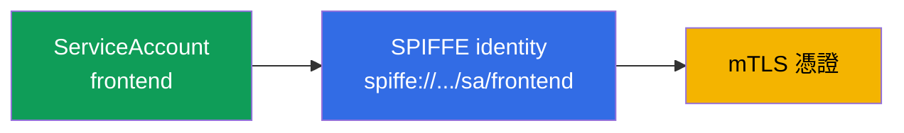
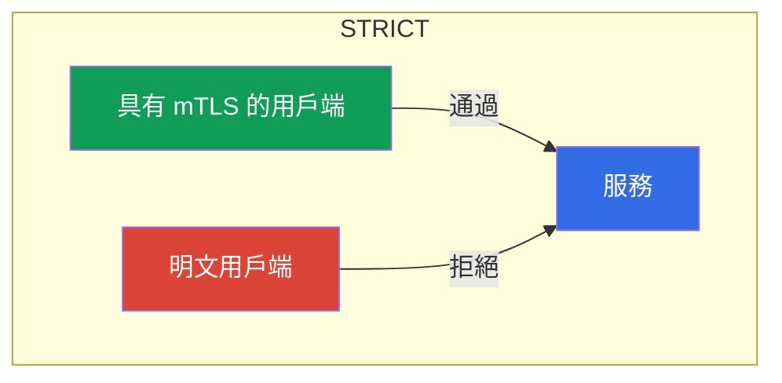
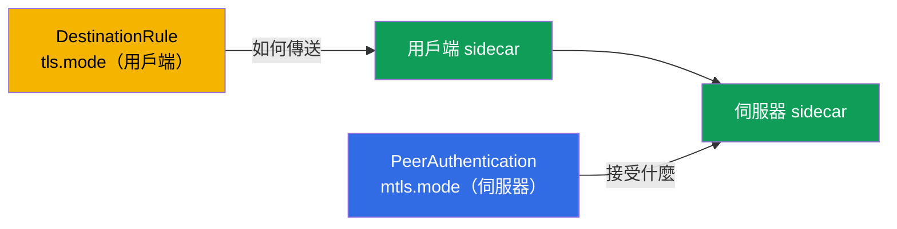
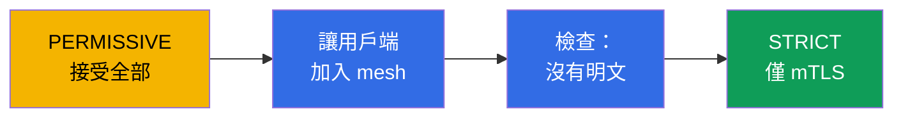

[Русская версия](ru.md) · [Eng version](en.md) · [Versión en español](es.md) · [Version française](fr.md) · [Deutsche Version](de.md) · [ქართული ვერსია](ge.md) · [日本語版](jp.md)

# 第 13 章。mTLS 與 PeerAuthentication：Zero Trust 模型

> **下一步。** 考試的第二個大型領域--安全性--現在開始。預設情況下，叢集內任何 Pod 都能連線到任何服務，且它們之間的流量以明文傳輸。本章將建立安全性的基礎：服務間的雙向 TLS（mTLS）及其透過 PeerAuthentication 的管理。這是 Zero Trust 模型的基礎。

## 13.1. 問題：扁平的信任網路

在一般叢集中，網路是「扁平的」：只要 Pod A 知道 Pod B 的位址，就能向其發出請求，且流量未經加密。沒有人會驗證究竟是誰在發出請求。對於進入內部的攻擊者來說，這是一份大禮：可以在服務間自由移動並竊聽流量。

**Zero Trust**（「不信任任何人」）模型顛倒了這點：預設不信任任何連線，直到它證明自己可信。在 Istio 中，實現此目標的第一步是所有服務之間的雙向 TLS。

## 13.2. Identity 與 SPIFFE

為了加密及驗證流量，每個服務都需要一個**身分**（identity）。在 Istio 中，它以 Kubernetes ServiceAccount 為基礎建立，並依照 **SPIFFE** 標準設計。

**SPIFFE**（Secure Production Identity Framework For Everyone）是一項開放標準（CNCF 專案），描述如何為服務簽發可驗證的身分，而不依賴網路（IP、連接埠和主機名稱不可靠且會變動）。SPIFFE 中的身分是一個 URI 形式的識別字串（SPIFFE ID），並被「封裝」在特殊格式的憑證（SVID）中，服務便以此證明自己的身分。該標準不受廠商限制，因此這種 identity 在 Istio 之外也可被理解。在 Istio 中，SPIFFE ID 如下：

```
spiffe://cluster.local/ns/<namespace>/sa/<serviceaccount>
```

閱讀方式很簡單：信任網域 `cluster.local` 中，namespace `<namespace>` 內使用 ServiceAccount `<serviceaccount>` 的服務。



也就是說，您在 CKA 中用來存取 Kubernetes API 的那個 ServiceAccount，在此成為 mesh 中服務的加密身分。Istio 正是根據這個身分加密流量，並在後續（第 14 章）決定誰能做什麼。

**若未設定 ServiceAccount 呢？** Kubernetes 中的 Pod **一定**會有 ServiceAccount：如果您未明確指定，Pod 會取得其 namespace 的 `default` SA。不會有「沒有身分」的情況--只會有**`default` 身分**。這帶來重要的結果：若十個不同服務沒有各自的 SA，所有服務都會取得**同一個** SPIFFE 身分（`spiffe://.../sa/default`）。這對 mTLS 加密無關緊要，但對授權（第 14 章）則是個問題：無法區分它們，也就無法將「只允許 `frontend`」的規則與其他服務分開。因此，最佳實務是**每個服務各有自己的 ServiceAccount**（或至少每組具有相同權限的服務各有一個）。

**若 Pod 沒有 sidecar（不在 mesh 中）呢？** Istio 中的身分正是由 sidecar 提供：它從 istiod 取得憑證並出示它。沒有 sidecar 的 Pod（未注入，或位於沒有 `istio-injection` 的 namespace）**沒有任何 SPIFFE 身分或憑證**，並傳送普通明文。其行為取決於接收服務端的模式（13.4）：

- **`PERMISSIVE`** 模式中的伺服器會接受此連線（以明文傳輸），這讓您能逐步導入 mesh；
- **`STRICT`** 模式中的伺服器會**拒絕**：沒有 mTLS，就沒有連線。

從授權角度而言，來自此類 Pod 的流量**沒有已驗證的身分**（`source.principal` 為空），因此無法對它套用基於 principal 的規則--最多只能依 IP，而這並不可靠。結論是：服務必須在 mesh 中（具有 sidecar）才能有真正的 identity，否則對 Zero Trust 而言它是「匿名的」。

## 13.3. 自動 mTLS

Istio 最便利之處在於：mTLS **自動**運作，您無須處理憑證。istiod 扮演憑證授權中心（CA）：

- 為每個 sidecar 簽發帶有其 SPIFFE 身分的憑證；
- 自動輪替這些憑證（預設每 24 小時）；
- 透過 SDS 將它們傳遞給 Envoy（還記得第 4 章的 Secret Discovery Service 嗎）。

當一個 sidecar 連線到另一個 sidecar 時，兩者會進行**雙向** TLS 交握：雙方都出示憑證並驗證彼此。在一般 TLS 中（如第 9 章），伺服器向用戶端證明自己是誰。在 mutual TLS 中，**雙方**都證明自己的身分。因此，流量既經過加密也已驗證--而這一切無須撰寫任何一行應用程式碼。

## 13.4. PeerAuthentication：mTLS 模式

用來控制服務如何接受傳入連線的資源是 `PeerAuthentication`。它有三種模式：

| 模式 | 伺服器接受什麼 | 何時使用 |
|-------|----------------------|--------------------|
| `PERMISSIVE` | mTLS 和明文 | 預設值、過渡期間 |
| `STRICT` | 僅 mTLS | Zero Trust 的目標 |
| `DISABLE` | 僅明文 | 停用 mTLS（罕見，用於偵錯） |

預設情況下，Istio 以 `PERMISSIVE` 運作：服務同時接受加密與明文流量。如此設計是為了能逐步導入 mesh，而不會破壞尚未加入 mesh 的對象。

為整個 namespace 啟用嚴格 mTLS：

```yaml
apiVersion: security.istio.io/v1
kind: PeerAuthentication
metadata:
  name: default         # 名稱 default + 無 selector = 套用於整個 namespace
  namespace: app
spec:
  mtls:
    mode: STRICT
```



在 `STRICT` 模式中，服務會拒絕所有未加密流量。沒有 sidecar（傳送明文）的用戶端完全無法建立連線。

## 13.5. 政策的作用範圍

`PeerAuthentication` 可套用於三個層級，理解這點很重要：

- **整個 mesh**--根 namespace（`istio-system`）中名稱為 `default` 的政策。
- **Namespace**--所需 namespace 中名稱為 `default` 且沒有 `selector` 的政策（如上述範例）。
- **特定 Pod**--具有 `selector.matchLabels` 的政策，只對所選 Pod 生效。

```yaml
spec:
  selector:
    matchLabels:
      app: payments     # 僅 payments 的 pod
  mtls:
    mode: STRICT
```

較狹窄的政策會覆寫較寬泛的政策。例如，可在整個 mesh 啟用 `STRICT`，但透過具 selector 的政策讓一項舊版服務保持 `PERMISSIVE`。

還有更精細的層級--**個別連接埠**。透過 `portLevelMtls`，您可以為特定連接埠設定不同於整體的模式。典型範例是：整個服務使用 `STRICT`，但將由 mesh 外部的對象存取的 metrics/health-check 連接埠保留為 `PERMISSIVE`：

```yaml
spec:
  selector:
    matchLabels:
      app: payments
  mtls:
    mode: STRICT          # pod 所有連接埠的預設值
  portLevelMtls:
    9090:
      mode: PERMISSIVE    # 但連接埠 9090（metrics）也允許 plaintext
```

## 13.6. 用戶端與伺服器：PeerAuthentication vs DestinationRule

理解角色分工很重要，否則很容易遇到神祕的 `503`。

- **`PeerAuthentication` 只控制伺服器（傳入）端**--即服務同意**接受**什麼（mTLS、明文或兩者）。
- **用戶端（傳出）端**--發送端 sidecar 建立連線的方式--由**自動 mTLS**決定：Istio 自行偵測接收者是否具有 sidecar，並傳送 mTLS。可透過 `DestinationRule` 中的 `trafficPolicy.tls.mode: ISTIO_MUTUAL` 明確設定用戶端模式。

正常情況下您不必考慮這件事--自動 mTLS 會自行協調雙方。問題發生於有人手動設定了 `DestinationRule` 的 `tls.mode`，而它與 `PeerAuthentication` 衝突時：

- 伺服器為 `STRICT`，但用戶端的 `DestinationRule` 設為 `mode: DISABLE`（或 `SIMPLE`）→ 用戶端傳送明文，伺服器要求 mTLS → **連線中斷，`503`**。
- 相反情況（`DestinationRule` 要求 `ISTIO_MUTUAL`，伺服器為 `DISABLE`）也同樣是錯誤。



規則是：用戶端（`DestinationRule`）和伺服器（`PeerAuthentication`）的模式必須一致。若不碰 DestinationRule 中的 `tls`，自動 mTLS 會自行協調一切--這正是建議的做法。

## 13.7. 從 PERMISSIVE 無停機遷移至 STRICT

在運行中的叢集中直接啟用 `STRICT` 很危險：所有仍傳送明文的用戶端（不在 mesh 中、舊版應用程式）都會立即斷線。正確做法是逐步遷移，而 `PERMISSIVE` 正是為此建立。

順序如下：

1. **從 PERMISSIVE 開始**（這是預設值）。服務同時接受 mTLS 和明文，不會破壞任何項目。
2. **讓用戶端加入 mesh。** 逐步為所有存取服務的對象加入 sidecar。用戶端一旦有 sidecar，便會自動開始以 mTLS 連線（處於 PERMISSIVE 的服務會接受它）。
3. **確認不再有明文。** 指標和日誌有助於確認：檢查是否仍有前往服務的未加密連線。
4. **切換至 STRICT。** 當所有流量都已透過 mTLS 傳送時，啟用 `STRICT`。現在禁止明文，但既然明文已不存在，就沒有人會受到影響。



關鍵概念是：`PERMISSIVE` 並非「永遠不安全」，而是從明文到嚴格 mTLS 的安全橋樑。

## 13.8. Kubernetes 探針與 STRICT mTLS

在啟用 STRICT mTLS 時常遇到的一個實務陷阱。Pod 健康檢查（liveness/readiness/startup）由 **kubelet** 發送--它直接連到 Pod，而 kubelet 位於 **mesh 外部**：它沒有 sidecar 和 mTLS 身分。若應用程式連接埠要求 STRICT mTLS，sidecar 會等待加密連線，但 kubelet 傳送一般 HTTP--探針失敗，Pod 被視為「不健康」並進入重新啟動迴圈。

Istio 會自動解決此問題：注入時會**重寫 HTTP 探針**（參數 `rewriteAppHTTPProbers`，預設啟用）。來自 kubelet 的探針會重新導向至 sidecar 內部的 pilot-agent，後者透過 localhost 將其代理至應用程式，繞過 mTLS。


需記住的重點：

- 對於 HTTP 與 gRPC 探針，這可**開箱即用**；行為由註解 `sidecar.istio.io/rewriteAppHTTPProbers` 控制。
- 若在 STRICT mTLS 下**停用**重寫，HTTP 探針會開始失敗，且 Pod 會反覆重啟（CrashLoop）。這是**剛啟用 mesh 後**常見的問題原因--若 Pod 在注入後卡在重啟，請檢查探針。
- **TCP 探針**通常不受影響--它們只檢查連接埠是否開啟。**exec 探針**在容器內執行，不會接觸 mesh。

## 13.9. 驗證 mTLS

只啟用 mTLS 並不夠--還必須確認流量確實已加密。有幾種方法。

**`istioctl` describe** 會顯示該 Pod 是否套用了 mTLS 及使用哪項政策：

```bash
istioctl x describe pod <pod> -n app
# 輸出中："Effective PeerAuthentication mode: STRICT" 等
```

**Envoy 組態**--可查看傳入 listener 協商了哪種模式：

```bash
istioctl proxy-config listeners <pod> -n app -o json | grep -i tlsMode
```

**Envoy 指標**--每個連線都有安全性標記。若流量透過 mTLS 傳送，指標會是 `connection_security_policy="mutual_tls"`：

```bash
kubectl exec <pod> -c istio-proxy -n app -- \
  pilot-agent request GET stats/prometheus | grep connection_security_policy
```

以視覺方式查看更加方便：**Kiali**（第 16 章）會在流量受 mTLS 保護的圖形邊上繪製「鎖」。若您預期是 `STRICT`，但看不到鎖，或指標為 `connection_security_policy="none"`，表示流量仍是明文；請找出原因（用戶端沒有 sidecar，或 `DestinationRule` 衝突，請見 13.6）。

## 13.10. mTLS 尚非授權

不要過度高估 mTLS 很重要。它回答的是**「此連線是否可信、另一端是誰？」**--也就是加密通道並確認對端身分。但它**不會**限制該對端究竟能做什麼。

舉例來說，啟用了 `STRICT` mTLS。現在沒有 sidecar 的用戶端無法存取 `payments` 服務。但 mesh 中任何帶有自身有效 mTLS 憑證的服務依然可以存取 `payments`。若要說「只有 frontend 能以 GET 方法存取 payments」，便需要另一種機制--`AuthorizationPolicy`，這是下一章第 14 章的主題。mTLS 與授權共同運作：授權依賴 mTLS 提供的身分。

## 13.11. 威脅模型：mTLS 防護什麼，以及無法防護什麼

若要正確套用 mTLS，必須了解其邊界：它防護的是非常明確的攻擊，但不是「萬靈丹」。

**它防護的項目：**

- **流量竊聽（sniffing）。** mesh 內所有內容均已加密--讀取網路流量的攻擊者（在其他 Pod 上攔截、鏡像流量、遭入侵的網路元件）只能看到密文。
- **透過網路冒充身分（spoofing）。** 無法只因知道服務 IP 或名稱就冒充該服務：沒有帶有所需 SPIFFE ID 的有效憑證，`STRICT` 模式的伺服器不會接受連線。
- **來自「外來」Pod 的橫向移動。** 沒有 sidecar 的 Pod（或在 mesh 外）無法存取處於 `STRICT` 模式的服務。
- **叢集內 MITM。** 憑證的雙向驗證使中間人無法插入其中。

**它無法防護的項目：**

- **節點遭入侵。** 這是關鍵點。workload 的私鑰和憑證存在 sidecar（Envoy）記憶體中，並透過節點上的 socket 以 SDS 傳送。若攻擊者逃離容器並在節點上取得 **root**，他可以：
  - 讀取**該節點上運行的所有 Pod** 的金鑰/憑證，並可冒充其 SPIFFE 身分--對 mesh 而言，這會是合法流量；
  - 取得這些 Pod 掛載的 **ServiceAccount 權杖**，並以其身分存取 Kubernetes API 和 mesh 服務。

  他無法取得**其他**節點上 Pod 的金鑰（它們不在該節點上），因此受影響範圍是同一節點鄰居的身分。但在該節點內，mTLS 已不再構成屏障。
- **應用程式遭入侵。** 若服務本身遭攻破，它具有有效身分--mTLS 會如實驗證它。限制該服務能做什麼是 `AuthorizationPolicy`（第 14 章）的工作，而非 mTLS。
- **應用程式層級漏洞**（注入、邏輯錯誤）--mTLS 處理傳輸，而非邏輯。

**結論與 defense-in-depth。** mTLS 提高了網路攻擊的門檻，但攻陷節點 = 攻陷其 Pod 的身分。因此，mTLS 應搭配以下措施：

- 防護容器逃逸（禁止 privileged、drop capabilities、`runAsNonRoot`、唯讀 rootfs、seccomp、AppArmor/SELinux、Pod Security Standards + admission control、如 gVisor/Kata 的 sandbox runtime）--這是 CKS 領域；
- 將重要 workload 隔離於專屬節點（taints/`nodeSelector`），使其不與不受信任的對象共置；
- 降低被竊 credential 的價值：短生命週期 bound-token、`automountServiceAccountToken: false`、RBAC least-privilege、短憑證 TTL；
- `AuthorizationPolicy` 授權（mesh 中的 least-privilege）和 runtime 偵測（Falco、稽核），以便發現身分的異常使用。

## 13.12. 最佳實務

- **目標是在整個 mesh 使用 `STRICT`**，但應透過 `PERMISSIVE` 和流量驗證（13.7）逐步達成，而不是「直接硬上」。
- **非必要時不要在 `DestinationRule` 中調整 `tls`。** 自動 mTLS 會自行協調雙方；手動設定 `mode` 是與 `PeerAuthentication` 衝突而造成 `503` 的常見原因（13.6）。
- **例外應精確處理。** mesh 外的舊版系統應透過帶有 `selector` 的 `PERMISSIVE` 或特定連接埠的 `portLevelMtls` 處理，而非回退整個 mesh。
- **不要停用 `rewriteAppHTTPProbers`。** 否則 STRICT mTLS 會破壞 HTTP 探針，並使 Pod 進入 CrashLoop（13.8）。
- **驗證 mTLS 確實運作**（13.9）：指標 `connection_security_policy`、`istioctl x describe`、Kiali 中的鎖--不要以為「已啟用就沒事了」。
- **讓 identity 建立在有意義的 ServiceAccount 上。** 不要讓所有項目都以 `default` SA 運行：SPIFFE 身分 = namespace + ServiceAccount，而授權也將以它為基礎（第 14 章）。
- **mTLS 不是授權的替代品。** STRICT 會加密並驗證身分，但由 `AuthorizationPolicy`（第 14 章）限制存取。

## 13.13. 本章總結

- 扁平的叢集網路並不安全；Zero Trust 模型要求加密並驗證服務間流量。
- 服務身分由 ServiceAccount 建立，並以 SPIFFE（`spiffe://.../ns/.../sa/...`）呈現。
- Pod 一定有 SA（預設為 `default`）；沒有專用 SA 的服務會共用同一個身分，因此在授權中無法區分--請為每個服務提供自己的 ServiceAccount。沒有 sidecar 的 Pod 沒有身分：它傳送明文（`PERMISSIVE` 會接受，`STRICT` 會拒絕），且在授權上保持「匿名」。
- Istio 的 mTLS 是自動化的：istiod 簽發並輪替憑證，透過 SDS 傳送。
- **PeerAuthentication** 設定模式：`PERMISSIVE`（mTLS 和明文）、`STRICT`（僅 mTLS）、`DISABLE`。
- 政策可套用於 mesh、namespace 或特定 Pod 層級；較窄的政策會覆寫較寬的政策。
- 遷移至 `STRICT` 應透過 `PERMISSIVE`：讓所有對象加入 mesh、驗證、再切換--無須停機。
- mTLS 負責「信任誰與加密」，而非「允許做什麼」--後者是 AuthorizationPolicy（第 14 章）的工作。
- Kubernetes 探針由 kubelet（mesh 外部）發送；在 STRICT mTLS 下，Istio 預設重寫 HTTP 探針（`rewriteAppHTTPProbers`），以避免它們失敗。停用重寫會在啟用 mesh 後導致 CrashLoop。
- `PeerAuthentication` 控制**伺服器**（傳入）端；用戶端則是自動 mTLS/`DestinationRule`。DestinationRule 中的 `tls.mode` 與伺服器政策衝突，是造成 `503` 的常見原因。
- 亦可透過 `portLevelMtls` 為**個別連接埠**設定模式。
- 必須實際驗證 mTLS：指標 `connection_security_policy=mutual_tls`、`istioctl x describe`/`proxy-config`、Kiali 中的鎖。
- 威脅模型：mTLS 可防範網路竊聽、spoofing 和橫向移動，但**無法**防範節點遭入侵（節點 root 可讀取其 Pod 的金鑰與 SA 權杖）及遭入侵的應用程式。需要 defense-in-depth：防護容器逃逸（CKS）、隔離重要 workload、least-privilege、`AuthorizationPolicy`、runtime 偵測。

## 13.14. 自我檢測問題

1. 什麼是 Zero Trust 模型，為何扁平的叢集網路與其相矛盾？
2. Istio 中服務的 identity 如何建立，ServiceAccount 與它有何關係？若未指定專用 SA，身分會如何？
3. 沒有 sidecar 的 Pod 具有什麼身分？它將如何與處於 `PERMISSIVE` 和 `STRICT` 的服務通訊？
4. mutual TLS 與一般 TLS 有何差異？
5. PERMISSIVE 與 STRICT 模式有何差異？
6. 為什麼不能在運行中的叢集中立即啟用 STRICT，以及正確的遷移方式是什麼？
7. mTLS **無法**解決什麼問題，以及存取控制需要什麼機制？
8. 為什麼 Kubernetes 探針可能在 STRICT mTLS 下失敗，Istio 預設如何解決此問題？
9. `PeerAuthentication`（伺服器）與 `DestinationRule`（用戶端）有何不同？它們的不一致如何導致 `503`？
10. 如何為個別連接埠設定 mTLS 模式？
11. 實務上如何確定流量確實透過 mTLS 傳送？
12. mTLS 可防護哪些攻擊，又無法防護哪些？若攻擊者取得叢集節點的 root，會發生什麼事？
13. 為何 mTLS 需要搭配 defense-in-depth，以及具體需要哪些措施？

## 實作

透過 PeerAuthentication 練習 STRICT mTLS（並觀察明文用戶端被拒絕）：

🧪 實驗 04：[tasks/ica/labs/04](../../labs/04/README_TW.MD)

練習從 PERMISSIVE 安全遷移至 STRICT：

🧪 實驗 20：[tasks/ica/labs/20](../../labs/20/README_TW.MD)

---
[目錄](../README_TW.md) · [第 12 章](../12/tw.md) · [第 14 章](../14/tw.md)
