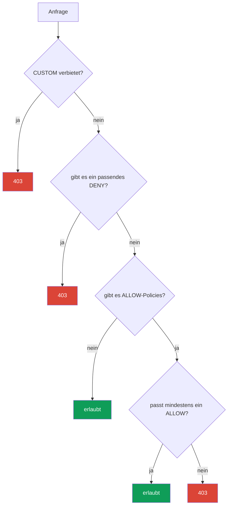

[RU version](ru.md) · [Eng version](en.md) · [Versión en español](es.md) · [Version française](fr.md)

# Kapitel 14. AuthorizationPolicy: Autorisierung Service-zu-Service

> **Was kommt als Nächstes.** In Kapitel 13 haben wir mTLS eingeschaltet: nun ist der Verkehr verschlüsselt, und wir wissen,
> wer am anderen Ende der Verbindung ist. Aber mTLS beschränkt nicht, was diesem Gegenüber
> zu tun erlaubt ist. Damit befasst sich die `AuthorizationPolicy` – sie beantwortet die Frage
> „wer darf wohin und auf welche Weise zugreifen". Das ist die zweite Säule der Sicherheit von Istio.

## 14.1. Wozu Autorisierung nötig ist

Erinnern wir uns an das Ende des letzten Kapitels. `STRICT` mTLS wurde eingeschaltet – den Service `payments` erreicht
niemand mehr ohne gültige Mesh-Identity. Aber jeder Service innerhalb des Mesh mit seinem
Zertifikat kann `payments` immer noch ansprechen. Und man möchte es genauer sagen: „auf
payments darf nur aus frontend und nur mit der Methode GET zugegriffen werden".

Das ist die Autorisierung. mTLS hat uns eine geprüfte Identity gegeben (wer das ist), und die
`AuthorizationPolicy` nutzt diese Identity, um zu entscheiden, was diesem Client
erlaubt ist.

## 14.2. Aufbau der AuthorizationPolicy

Die Ressource hat drei Hauptteile:

```yaml
apiVersion: security.istio.io/v1
kind: AuthorizationPolicy
metadata:
  name: payments-policy
  namespace: app
spec:
  selector:               # auf welche Pods angewendet wird
    matchLabels:
      app: payments
  action: ALLOW           # was zu tun ist: ALLOW / DENY / CUSTOM / AUDIT
  rules:                  # unter welchen Bedingungen
  - from:
    - source:
        principals: ["cluster.local/ns/app/sa/frontend"]
    to:
    - operation:
        methods: ["GET"]
```

- **`selector`** – auf welche Pods die Policy wirkt (hier `payments`). Ohne selector –
  auf den ganzen Namespace.
- **`action`** – was mit den passenden Anfragen zu tun ist.
- **`rules`** – Bedingungen: wer (`from`), wohin und wie (`to`), unter welchen Umständen
  (`when`).

## 14.3. Default-deny: alles schließen

Das Zero-Trust-Prinzip: zuerst alles verbieten, dann punktuell das Nötige erlauben. In Istio
sieht der kanonische Weg „alles verbieten" unerwartet aus – das ist eine `ALLOW`-Policy **ohne
eine einzige Regel**:

```yaml
apiVersion: security.istio.io/v1
kind: AuthorizationPolicy
metadata:
  name: payments-deny-all
  namespace: app
spec:
  selector:
    matchLabels:
      app: payments
  action: ALLOW
  # rules fehlen => keine Anfrage passt => alles verboten (403)
```

Die Logik ist so: sobald einem Pod mindestens eine `ALLOW`-Policy angehängt ist, gilt die
Regel „erlaubt ist nur das, was explizit in `rules` aufgeführt ist". Keine Regeln – also passt
nichts, und alle Anfragen erhalten `403`.

Oft macht man das Default-deny für den ganzen Namespace (oder sogar das ganze Mesh über eine Policy in
`istio-system`) und fügt danach punktuelle Erlaubnisse hinzu.

## 14.4. Punktuell erlauben: from, to, when

Nun öffnen wir genau das, was nötig ist. Wir fügen eine zweite Policy hinzu, die den Zugriff
auf `payments` nur aus `frontend` und nur mit der Methode `GET` erlaubt:

```yaml
spec:
  selector:
    matchLabels:
      app: payments
  action: ALLOW
  rules:
  - from:
    - source:
        principals: ["cluster.local/ns/app/sa/frontend"]  # WER
    to:
    - operation:
        methods: ["GET"]                                   # WAS erlaubt ist
        paths: ["/api/*"]                                  # über welche Pfade
    when:
    - key: request.headers[x-env]                          # zusätzliche Bedingung
      values: ["prod"]
```

Drei Blöcke der Regel:

- **`from`** – die Quelle der Anfrage. Am häufigsten sind das `principals` (die SPIFFE-Identity aus Kapitel
  13), aber es gibt auch `namespaces` und `ipBlocks`.
- **`to`** – was man tun darf: HTTP-Methoden (`methods`), Pfade (`paths`), Ports.
- **`when`** – zusätzliche Bedingungen: Header, JWT-Claims und andere Attribute der Anfrage.

Policies mit `action: ALLOW` werden nach dem ODER-Prinzip zusammengefasst: eine Anfrage kommt durch, wenn sie
**mindestens eine** ALLOW-Policy erlaubt. Das heißt, Default-deny + diese Erlaubnis ergeben zusammen:
„auf payments darf nur aus frontend, nur GET, nur über /api/*, nur in prod".

## 14.5. Verneinungen, when-Bedingungen und Wirkungsbereich

Noch einige wichtige Möglichkeiten, die in der Praxis oft nötig sind.

**Verneinungen.** Die meisten Felder haben eine Form mit `not-`: `notPrincipals`, `notNamespaces`,
`notMethods`, `notPaths`, `notPorts`. Die Regel greift, wenn das Attribut der Anfrage **nicht** in
der Aufzählung enthalten ist. Zum Beispiel „alles außer der Methode DELETE erlauben":

```yaml
  rules:
  - to:
    - operation:
        notMethods: ["DELETE"]
```

**`when`-Schlüssel.** Der `when`-Block matcht nach beliebigen Attributen der Anfrage. Die nützlichsten Schlüssel:

- `request.auth.claims[<claim>]` – ein Claim aus dem geprüften JWT (Kapitel 15);
- `request.headers[<name>]` – ein HTTP-Header;
- `source.namespace` / `source.principal` – woher die Anfrage kam;
- `destination.port` – an welchen Port;
- `remote.ip` – die echte Client-IP (siehe 14.10 zum Edge).

**Wirkungsbereich.** Wie bei `PeerAuthentication` (Kapitel 13) wird die Ebene durch Namespace und
das Vorhandensein eines `selector` bestimmt:

- **ganzes Mesh** – Policy im Root-Namespace (`istio-system`);
- **Namespace** – Policy ohne `selector` im gewünschten Namespace;
- **konkrete Pods** – Policy mit `selector.matchLabels`.

Das erlaubt es zum Beispiel, ein Default-deny für das ganze Mesh in `istio-system` zu machen und die punktuellen
Erlaubnisse bei den Services in ihrem Namespace zu halten.

## 14.6. Aktionen: ALLOW, DENY, CUSTOM, AUDIT

Das Feld `action` hat vier Werte:

| Aktion | Was sie tut |
|----------|-----------|
| `ALLOW` | passende Anfragen erlauben (am häufigsten) |
| `DENY` | passende Anfragen explizit verbieten |
| `CUSTOM` | die Entscheidung an einen externen Autorisierungs-Service delegieren |
| `AUDIT` | die Übereinstimmung nur loggen, ohne die Entscheidung zu beeinflussen |

`ALLOW` wird für das Modell „wir erlauben das Nötige" verwendet. `DENY` ist praktisch, um etwas
Konkretes explizit zu schließen (zum Beispiel die Methode DELETE von überall her zu verbieten). `CUSTOM` – für externe
Autorisierung (zum Beispiel über OPA oder einen eigenen Service). `AUDIT` – um zu sehen, was
greifen würde, ohne vorerst etwas zu blockieren.

Ein Beispiel für ein explizites `DENY` – Verbot der Methode `DELETE` an `payments` für alle, unabhängig von anderen
ALLOW-Policies (zur Erinnerung aus 14.7: `DENY` wird vor `ALLOW` geprüft):

```yaml
apiVersion: security.istio.io/v1
kind: AuthorizationPolicy
metadata:
  name: payments-deny-delete
  namespace: app
spec:
  selector:
    matchLabels:
      app: payments
  action: DENY
  rules:
  - to:
    - operation:
        methods: ["DELETE"]     # jedes DELETE an payments -> 403, egal was ALLOW erlaubt
```

## 14.7. Auswertungsreihenfolge der Policies

Wenn einem Pod mehrere Policies angehängt sind, wertet Istio sie in strikter Reihenfolge aus. Das ist eine
häufige Quelle der Verwirrung, deshalb merken Sie sich die Abfolge:



In Worten:

1. Zuerst werden die `CUSTOM`-Policies geprüft. Wenn die externe authz „nein" gesagt hat – Verbot.
2. Dann die `DENY`-Policies. Wenn die Anfrage auf irgendeine passt – Verbot.
3. Dann `ALLOW`. Wenn es **überhaupt keine** ALLOW-Policies gibt – ist die Anfrage erlaubt (das ist der Default ohne
   Policies). Wenn es ALLOW-Policies **gibt**, muss die Anfrage auf mindestens eine passen,
   sonst Verbot.

Daher auch die „Magie" des Default-deny aus Abschnitt 14.3: das Vorhandensein einer leeren ALLOW-Policy versetzt den
Pod in den Modus „erlaubt ist nur das explizit Aufgeführte", und aufzuführen gibt es nichts – also ist
alles verboten.

## 14.8. Verbindung zu mTLS

Ein wichtiges Detail, das man leicht übersieht. Die Regel `from.source.principals` prüft die
SPIFFE-Identity des Clients. Aber woher kennt Istio diese Identity? Aus dem mTLS-Zertifikat,
das der Client bei der Verbindung vorgelegt hat (Kapitel 13).

Also kann eine Regel nach `principals` ohne mTLS nicht zuverlässig funktionieren: wenn der Verkehr im
Klartext läuft, hat Istio keine geprüfte Identity des Absenders. Deshalb gehen die Autorisierung nach
Identity und mTLS immer im Verbund: zuerst garantiert `PeerAuthentication` (STRICT mTLS),
dass die Identity echt ist, und dann entscheidet die `AuthorizationPolicy` anhand dieser Identity, was
erlaubt ist.

Wenn Sie hingegen Regeln nur nach `namespaces` oder `ipBlocks` und nicht nach `principals` schreiben,
dann ist mTLS formal nicht zwingend – aber solche Regeln sind schwächer, weil IP und Namespace
leichter zu fälschen sind als eine kryptografische Identity.

## 14.9. AuthorizationPolicy und NetworkPolicy: Schutzschichten

Ein Ingenieur nach der CKA sollte sich sofort die Frage stellen: wodurch unterscheidet sich das von der `NetworkPolicy`,
die ich bereits kenne? Beide Ressourcen beschränken den Zugriff, arbeiten aber auf verschiedenen Ebenen und
ergänzen einander.

**NetworkPolicy** (Kubernetes) arbeitet auf L3/L4: erlaubt oder verbietet **Netzwerk-Verbindungen**
zwischen Pods nach IP, Ports und Labels. Sie wird vom CNI-Plugin auf Netzwerkebene angewendet (im Grunde im
Kernel), noch bevor der Verkehr die Anwendung oder Envoy erreicht.

**AuthorizationPolicy** (Istio) arbeitet auf L7: betrachtet die kryptografische Identity
(SPIFFE), die HTTP-Methode, den Pfad, die Header. Sie wird von der Envoy-sidecar angewendet.

| | NetworkPolicy | AuthorizationPolicy |
|---|---------------|---------------------|
| Ebene | L3/L4 (IP, Port) | L7 (Identity, Methode, Pfad) |
| Wer wendet an | CNI (Netzwerk-/Kernel-Ebene) | Envoy sidecar |
| Was kontrolliert wird | ob ein Pod sich überhaupt verbinden kann | was genau dem Client erlaubt ist |
| Sieht Identity | nein, nur IP und Pod-Labels | ja, die SPIFFE-Identity |
| Sieht HTTP | nein | ja (Methode, Pfad, Header) |
| Ist ein Mesh nötig | nein | ja (sidecar oder ztunnel) |

Der Kerngedanke: es ist kein „entweder – oder", sondern **zwei Schutzschichten (Defense in Depth)**.

- NetworkPolicy schneidet unerwünschte Verbindungen auf Netzwerkebene ab. Sie funktioniert, selbst
  wenn ein Pod keine sidecar hat, und ist aus einer kompromittierten Anwendung nicht zu umgehen, weil
  die Regeln im Kernel leben, nicht im Container.
- AuthorizationPolicy fügt hinzu, was NetworkPolicy prinzipiell nicht kann: Regeln nach der
  geprüften Identity eines Service und nach Details der HTTP-Anfrage.

**Best Practices der gemeinsamen Anwendung:**

- Machen Sie **Default-deny auf beiden Ebenen**: eine Basis-NetworkPolicy, die überflüssige
  Verbindungen im Namespace verbietet, plus ein Default-deny per AuthorizationPolicy.
- NetworkPolicy verwenden Sie für die grobe Segmentierung: welche Namespaces und Pods überhaupt
  über das Netz kommunizieren dürfen (einschließlich Nicht-Mesh-Verkehr und Zugriff auf die control plane).
- AuthorizationPolicy verwenden Sie für feine Regeln: wer (nach Identity), mit welchen Methoden
  und über welche Pfade auf den Service zugreifen darf.
- Verlassen Sie sich nicht nur auf die AuthorizationPolicy: sie wird in Envoy innerhalb des Pods angewendet.
  NetworkPolicy ist eine unabhängige Grenze auf Netzwerkebene, die bestehen bleibt, selbst wenn mit der sidecar etwas
  schiefgelaufen ist.

Fazit: NetworkPolicy beantwortet die Frage „wer mit wem sich über das Netz verbinden kann",
AuthorizationPolicy – „was genau diesem Service auf Anwendungsebene erlaubt ist".
Zusammen ergeben sie einen vollwertigen mehrschichtigen Schutz.

### Und es gibt auch L7-NetworkPolicy (Cilium)

Das Bild ist etwas komplexer als „NetworkPolicy = L4, Istio = L7". Die Standard-Kubernetes-
NetworkPolicy ist tatsächlich nur L3/L4. Aber manche CNI können mehr. Das auffälligste
Beispiel – **Cilium**: auf Basis von eBPF bietet es **L7-aware Netzwerk-Policies**, die
HTTP-Methoden und -Pfade, gRPC, Kafka, DNS-Anfragen filtern können. Das heißt, einen Teil der L7-Regeln
kann man auch auf CNI-Ebene machen, ohne Istio.

Es stellt sich die offensichtliche Frage: wenn sowohl Cilium als auch Istio L7 können, wozu beide und wie
sie kombinieren? Klären wir das.

- **Verschiedene Identity-Modelle.** Istio autorisiert nach der SPIFFE-Identity aus dem mTLS-Zertifikat.
  Cilium verwendet sein eigenes Identity-Modell auf Basis von Pod-Labels (über eBPF), und mTLS ist bei ihm
  eine separate Option. Das sind grundlegend verschiedene Ansätze für „wer ist das".
- **Verschiedene Anwendungspunkte.** Cilium wendet die Regeln im Kernel (eBPF) und im eingebauten
  per-node-Envoy an. Istio – in der sidecar oder im waypoint. Wenn man L7 in beiden einschaltet, durchläuft der
  Verkehr zwei L7-Analysen, was Latenz und Debugging-Komplexität hinzufügt.

**Sollte man sie zusammen anwenden.** Die allgemeine Empfehlung – **L7-Regeln nicht in zwei
Systemen duplizieren**. Praktikable Varianten:

- **Cilium für L3/L4 + Istio für L7.** Die verbreitetste und gesündeste Variante: Cilium
  als CNI ist für die schnelle Netzwerk-Segmentierung (L3/L4) und ggf. DNS-Policies zuständig, und
  Istio übernimmt das gesamte L7: mTLS, Autorisierung nach Identity, Traffic-Management. Das ist
  genau die häufige Kombination mit dem Ambient-Modus von Istio.
- **Nur Cilium (mit seinem L7)** ohne Istio – sinnvoll, wenn Ihnen die L7-Filterung des CNI reicht und
  Sie kein vollwertiges Mesh brauchen (Traffic-Management, Spiegelung, reiche
  Observability).
- **Nur Istio** – wenn das Mesh bereits existiert, ist es logisch, die L7-Policies darin zu halten und vom CNI
  nur L3/L4 zu nehmen.

Was zu vermeiden ist: gleichzeitig sich überschneidende L7-Regeln sowohl in Cilium als auch in Istio zu schreiben.
Das ist doppelter Overhead, zwei Wahrheitsquellen und ein sehr schwieriges Debugging, wenn eine Anfrage
„unerklärlich" ein 403 erhält. Wählen Sie eine Schicht für L7 und halten Sie die Regeln dort.

## 14.10. Autorisierung am ingress gateway (Edge) und die IP-Falle

Eine `AuthorizationPolicy` hängt man nicht nur an Services innerhalb des Mesh, sondern auch an das **ingress
gateway selbst** – um den Verkehr bereits am Eingang zu filtern (zum Beispiel in einen Admin-Bereich nur aus dem
Büronetz durchzulassen). Eine solche Policy wird im Namespace des Gateway (`istio-system`) mit einem `selector` auf die
Pods des Gateway gesetzt:

```yaml
apiVersion: security.istio.io/v1
kind: AuthorizationPolicy
metadata:
  name: ingress-allow-office
  namespace: istio-system
spec:
  selector:
    matchLabels:
      istio: ingressgateway
  action: ALLOW
  rules:
  - from:
    - source:
        remoteIpBlocks: ["203.0.113.0/24"]   # echte Client-IP
    to:
    - operation:
        hosts: ["admin.example.com"]
```

**Die IP-Falle – `ipBlocks` vs `remoteIpBlocks`.** Das bricht regelmäßig die IP-Allowlist,
besonders hinter einem Load Balancer:

- **`ipBlocks`** – die IP der **Verbindungsquelle**, wie Envoy sie sieht. Hinter einem Load Balancer wird das
  die IP des LB/Proxy selbst sein, nicht die des Clients. Danach den Client zu filtern ist zwecklos.
- **`remoteIpBlocks`** – die **echte Client-IP**, die Istio aus dem Header
  `X-Forwarded-For` unter Berücksichtigung der Anzahl vertrauenswürdiger Proxys ermittelt. Genau das ist für eine Allowlist nach
  Client-Adresse nötig.

Aber **woher die richtige Client-IP kommt – hängt vom Typ des Load Balancer ab**, und hier
teilt sich AWS in zwei Fälle.

**ALB (L7).** Der ALB fügt selbst `X-Forwarded-For` mit der echten Client-IP hinzu. Es genügt,
Istio zu erklären, wie viele vertrauenswürdige Proxys vor dem Gateway stehen, über `numTrustedProxies` in
MeshConfig:

```yaml
apiVersion: install.istio.io/v1alpha1
kind: IstioOperator
spec:
  meshConfig:
    defaultConfig:
      gatewayTopology:
        numTrustedProxies: 1     # 1 vertrauenswürdiger Proxy (ALB) vor dem ingress gateway
```

**NLB (L4).** Der Schlüsselpunkt: **der NLB arbeitet auf L4 und fügt `X-Forwarded-For` nicht hinzu** – er hat
nichts, womit er einen HTTP-Header „unterschreiben" könnte, er dreht sich um TCP. Deshalb hilft `numTrustedProxies` allein hier
nicht: XFF hat schlicht keinen Ursprung. Die Client-IP hinter dem NLB bewahrt man über **Proxy Protocol
v2**. Es sind drei Dinge nötig:

1. **Proxy Protocol am NLB einschalten** – über eine Annotation am Service ingress gateway:

   ```yaml
   serviceAnnotations:
     service.beta.kubernetes.io/aws-load-balancer-type: external
     service.beta.kubernetes.io/aws-load-balancer-proxy-protocol: "*"   # PROXY v2
   ```

2. **Dem ingress gateway beibringen, das Proxy Protocol zu parsen** – über einen Listener-Filter via EnvoyFilter:

   ```yaml
   apiVersion: networking.istio.io/v1alpha3
   kind: EnvoyFilter
   metadata:
     name: ingress-proxy-protocol
     namespace: istio-system
   spec:
     selector:
       matchLabels:
         istio: ingressgateway
     configPatches:
     - applyTo: LISTENER
       patch:
         operation: MERGE
         value:
           listener_filters:
           - name: envoy.filters.listener.proxy_protocol
   ```

3. **Istio sagen, der Quelle aus dem Proxy Protocol zu vertrauen** wie dem echten Client – über
   `gatewayTopology`:

   ```yaml
   apiVersion: install.istio.io/v1alpha1
   kind: IstioOperator
   spec:
     meshConfig:
       defaultConfig:
         gatewayTopology:
           proxyProtocol: {}      # Client-IP aus dem PROXY-Header nehmen
   ```

Danach ist die echte Client-IP verfügbar, und `remoteIpBlocks` / `remote.ip` in der
`AuthorizationPolicy` funktionieren korrekt. Eine Alternative ohne Proxy Protocol – `instance`-Targets des
NLB mit `externalTrafficPolicy: Local`, aber sie ändert das Balancing und die Health-Checks, deshalb nimmt man im
Mesh in der Regel gerade Proxy Protocol.

Kurz: für eine Allowlist nach Client-IP verwenden Sie **`remoteIpBlocks`**, und die Client-IP bis zum
Gateway bringen Sie durch – hinter einem **ALB** über `numTrustedProxies` (es gibt XFF), hinter einem **NLB** über **Proxy
Protocol v2** (kein XFF). Verlassen Sie sich niemals auf `ipBlocks` hinter einem Load Balancer.

## 14.11. Überprüfung und Debugging

Eine Autorisierungs-Ablehnung sieht eindeutig aus: HTTP **`403`** mit dem Body **`RBAC: access denied`**. Wenn Sie
eine solche Antwort sehen – sie kam nicht vom Service, sondern von Envoy gemäß Ihrer Policy.

Nützliches beim Debuggen:

- **Die Logs der sidecar** des Ziels zeigen den Grund der Ablehnung:

  ```bash
  kubectl logs <pod> -c istio-proxy -n app | grep -i rbac
  # wir suchen rbac_access_denied_matched_policy - welche Policy gegriffen hat
  ```

- **Temporäres `AUDIT` statt DENY/ALLOW** – um zu prüfen, ob die Policy die gewünschten Anfragen matcht, ohne sie zu
  blockieren (Übereinstimmungen werden ins Log geschrieben).
- **`istioctl` Pod-Beschreibung** zeigt, welche Policies ihm angehängt sind:

  ```bash
  istioctl x describe pod <pod> -n app
  ```

Häufige Ursachen eines „unerklärlichen 403": vergessen, dass es irgendwo ein Default-deny gibt; eine Regel nach
`principals` greift nicht, weil es kein STRICT mTLS gibt (14.8); Sie filtern nach `ipBlocks` statt
`remoteIpBlocks` am Edge (14.10).

## 14.12. Best Practices

- **Default-deny als Grundlage.** Beginnen Sie mit dem Verbot von allem (leeres `ALLOW` auf Namespace/Mesh) und
  fügen Sie punktuelle Erlaubnisse hinzu – das ist Zero Trust.
- **Regeln nach `principals`, nicht nach IP.** Die Krypto-Identity aus mTLS ist zuverlässiger als IP/Namespace;
  verwenden Sie die Filterung nach Identity als Hauptmethode (und halten Sie mTLS im `STRICT`-Modus, siehe 14.8).
- **`DENY` für explizite Verbote.** Gefährliche Operationen (zum Beispiel `DELETE`, Admin-Pfade) schließen Sie
  mit einer separaten `DENY`-Policy – sie greift vor jedem `ALLOW`.
- **Am Edge – `remoteIpBlocks` + Vertrauen zu XFF.** Für eine Allowlist nach Client-IP verwechseln Sie sie nicht mit
  `ipBlocks` (14.10).
- **Least Privilege.** Erlauben Sie das Minimum: konkrete Methoden, Pfade und Quellen, nicht „alles aus
  diesem Namespace".
- **Prüfen Sie die Policies** (14.11): `AUDIT` vor dem Einschalten, `rbac`-Logs, `istioctl x describe`
  – verlassen Sie sich nicht darauf, dass „eine Regel geschrieben ist, also funktioniert sie".
- **Zwei Schutzschichten.** Ergänzen Sie die AuthorizationPolicy durch ein Netzwerk-Default-deny per NetworkPolicy
  (14.9) – für den Fall von Problemen mit der sidecar.

## 14.13. Zusammenfassung des Kapitels

- Die `AuthorizationPolicy` beantwortet die Frage „was diesem Client erlaubt ist", indem sie die
  Identity aus mTLS nutzt.
- Aufbau: `selector` (auf welche Pods), `action` (was zu tun ist), `rules` (Bedingungen:
  `from`, `to`, `when`).
- **Default-deny** ist eine `ALLOW`-Policy ohne Regeln: sie versetzt den Pod in den Modus „nur
  explizit Erlaubtes", und da es keine Regeln gibt – ist alles verboten.
- Punktuelle Erlaubnisse legen `from` (wer, meist `principals`), `to` (Methoden, Pfade),
  `when` (zusätzliche Bedingungen) fest; ALLOW-Policies werden per ODER zusammengefasst.
- Aktionen: `ALLOW`, `DENY`, `CUSTOM` (externe authz), `AUDIT` (nur Log).
- Auswertungsreihenfolge: CUSTOM, dann DENY, dann ALLOW.
- Die Autorisierung nach `principals` arbeitet über der mTLS-Identity, daher geht sie im Verbund mit
  PeerAuthentication.
- AuthorizationPolicy (L7, Envoy) und NetworkPolicy (L3/L4, CNI) ergänzen einander;
  Best Practice – Defense in Depth: Default-deny auf beiden Ebenen.
- Manche CNI (Cilium) können L7-Policies; um keine Komplexität zu vermehren, hält man L7 in
  einem System – häufige Wahl: Cilium für L3/L4, Istio für L7.
- Es gibt Verneinungen (`notMethods`, `notPaths`…), ein flexibles `when` (JWT-Claims, Header, Port,
  `remote.ip`) und Wirkungsebenen (Mesh/Namespace/Pods) – wie bei PeerAuthentication.
- Am **ingress gateway** verwendet man für eine Allowlist nach Client-IP **`remoteIpBlocks`**, nicht
  `ipBlocks` (Verbindungs-IP = LB-IP). Die Client-IP bringt man bis zum Gateway: hinter einem **ALB** über
  `numTrustedProxies` (es gibt XFF), hinter einem **NLB** (L4, kein XFF) über **Proxy Protocol v2**.
- Ablehnung = `403 RBAC: access denied`; debuggt wird mit Envoy-Logs (`rbac_access_denied`),
  temporärem `AUDIT` und `istioctl x describe`.

## 14.14. Fragen zur Selbstüberprüfung

1. Wodurch unterscheidet sich die Aufgabe der AuthorizationPolicy von der Aufgabe von mTLS/PeerAuthentication?
2. Warum verbietet eine `ALLOW`-Policy ohne Regeln alles?
3. Wofür sind die Blöcke `from`, `to` und `when` zuständig?
4. In welcher Reihenfolge wertet Istio CUSTOM, DENY und ALLOW aus?
5. Warum erfordert eine Regel nach `principals` mTLS, eine nach `namespaces` aber formal nicht?
6. Wodurch unterscheidet sich NetworkPolicy von AuthorizationPolicy und warum sollte man sie zusammen
   anwenden?
7. Worin besteht der Unterschied zwischen `ipBlocks` und `remoteIpBlocks` am ingress gateway? Wie bringt man die echte
   Client-IP bis zum Gateway hinter einem **ALB** und hinter einem **NLB** (und warum taugt für den NLB kein XFF)?
8. Wie sieht eine Autorisierungs-Ablehnung aus und wie findet man heraus, welche Policy sie ausgelöst hat?
9. Wie macht man ein explizites Verbot einer gefährlichen Operation (zum Beispiel DELETE) unabhängig von ALLOW-Regeln?

## Praxis

Üben Sie Default-deny und punktuelle Erlaubnis (nur frontend + GET) über STRICT
mTLS – das ist die Fortsetzung des Labs aus Kapitel 13:

🧪 Lab 04: [tasks/ica/labs/04](../../labs/04/README_DE.MD)

---
[Inhaltsverzeichnis](../README_DE.md) · [Kapitel 13](../13/de.md) · [Kapitel 15](../15/de.md)
