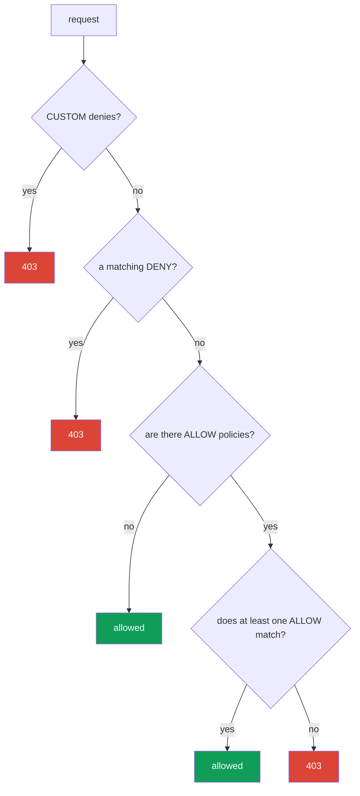

[RU version](ru.md)

# Chapter 14. AuthorizationPolicy: service-to-service authorization

> **What's next.** In chapter 13 we enabled mTLS: now the traffic is encrypted and we know who
> is on the other end of the connection. But mTLS does not limit what that peer is allowed to
> do. That is the job of `AuthorizationPolicy` - it answers the question "who may reach what,
> and how". This is the second pillar of Istio security.

## 14.1. Why authorization is needed

Recall the end of the previous chapter. We enabled `STRICT` mTLS - now nobody without a valid
mesh identity can reach the `payments` service. But any service inside the mesh with its own
certificate can still reach `payments`. And we would like to be more precise: "payments may be
reached only from frontend and only with GET".

That is exactly authorization. mTLS gave us a verified identity (who this is), while
`AuthorizationPolicy` uses that identity to decide what this client is allowed to do.

## 14.2. The structure of AuthorizationPolicy

The resource has three main parts:

```yaml
apiVersion: security.istio.io/v1
kind: AuthorizationPolicy
metadata:
  name: payments-policy
  namespace: app
spec:
  selector:               # which pods it applies to
    matchLabels:
      app: payments
  action: ALLOW           # what to do: ALLOW / DENY / CUSTOM / AUDIT
  rules:                  # under which conditions
  - from:
    - source:
        principals: ["cluster.local/ns/app/sa/frontend"]
    to:
    - operation:
        methods: ["GET"]
```

- **`selector`** - which pods the policy applies to (here `payments`). Without a selector - the
  whole namespace.
- **`action`** - what to do with matching requests.
- **`rules`** - the conditions: who (`from`), where and how (`to`), under what circumstances
  (`when`).

## 14.3. Default-deny: closing everything off

The Zero Trust principle: first forbid everything, then allow exactly what is needed. In Istio
the canonical way to "forbid everything" looks unexpected - it is an `ALLOW` policy **with not
a single rule**:

```yaml
apiVersion: security.istio.io/v1
kind: AuthorizationPolicy
metadata:
  name: payments-deny-all
  namespace: app
spec:
  selector:
    matchLabels:
      app: payments
  action: ALLOW
  # rules are absent => no request matches => everything is forbidden (403)
```

The logic is this: as soon as a pod has at least one `ALLOW` policy attached, the rule "only
what is explicitly listed in `rules` is allowed" takes effect. There are no rules - so nothing
matches, and all requests get `403`.

Often default-deny is done for a whole namespace (or even the whole mesh via a policy in
`istio-system`), and then targeted permissions are added.

## 14.4. Allowing selectively: from, to, when

Now let us open up exactly what is needed. We add a second policy that allows access to
`payments` only from `frontend` and only with the `GET` method:

```yaml
spec:
  selector:
    matchLabels:
      app: payments
  action: ALLOW
  rules:
  - from:
    - source:
        principals: ["cluster.local/ns/app/sa/frontend"]  # WHO
    to:
    - operation:
        methods: ["GET"]                                   # WHAT can be done
        paths: ["/api/*"]                                  # on which paths
    when:
    - key: request.headers[x-env]                          # an extra condition
      values: ["prod"]
```

The three blocks of a rule:

- **`from`** - the source of the request. Most often this is `principals` (the SPIFFE identity
  from chapter 13), but there are also `namespaces` and `ipBlocks`.
- **`to`** - what can be done: HTTP methods (`methods`), paths (`paths`), ports.
- **`when`** - additional conditions: headers, JWT claims and other request attributes.

Policies with `action: ALLOW` combine by OR: a request passes if **at least one** ALLOW policy
allows it. So default-deny + this permission together yield: "payments may be reached only from
frontend, only GET, only on /api/*, only in prod".

## 14.5. Negations, when conditions and scope

A few more important capabilities that are often needed in practice.

**Negations.** Most fields have a `not-` form: `notPrincipals`, `notNamespaces`, `notMethods`,
`notPaths`, `notPorts`. The rule matches if the request attribute is **not** among those
listed. For example, "allow everything except the DELETE method":

```yaml
  rules:
  - to:
    - operation:
        notMethods: ["DELETE"]
```

**The `when` keys.** The `when` block matches on arbitrary request attributes. The most useful
keys:

- `request.auth.claims[<claim>]` - a claim from a verified JWT (chapter 15);
- `request.headers[<name>]` - an HTTP header;
- `source.namespace` / `source.principal` - where the request came from;
- `destination.port` - which port;
- `remote.ip` - the real client IP (see 14.10 on edge).

**Scope.** As with `PeerAuthentication` (chapter 13), the level is determined by the namespace
and the presence of a `selector`:

- **the whole mesh** - a policy in the root namespace (`istio-system`);
- **a namespace** - a policy without a `selector` in the needed namespace;
- **specific pods** - a policy with `selector.matchLabels`.

This allows, for example, a single default-deny for the whole mesh in `istio-system`, while
keeping the targeted permissions next to the services in their namespace.

## 14.6. Actions: ALLOW, DENY, CUSTOM, AUDIT

The `action` field has four values:

| Action | What it does |
|--------|--------------|
| `ALLOW` | allow matching requests (the most common) |
| `DENY` | explicitly forbid matching requests |
| `CUSTOM` | delegate the decision to an external authorization service |
| `AUDIT` | only log the match, without affecting the decision |

`ALLOW` is used for the "allow what is needed" model. `DENY` is handy to explicitly close off
something specific (for example, forbid the DELETE method everywhere). `CUSTOM` is for external
authorization (for example, via OPA or your own service). `AUDIT` is to see what would trigger,
without blocking anything yet.

An example of an explicit `DENY` - forbidding the `DELETE` method to `payments` for everyone,
regardless of other ALLOW policies (recall from 14.7: `DENY` is checked before `ALLOW`):

```yaml
apiVersion: security.istio.io/v1
kind: AuthorizationPolicy
metadata:
  name: payments-deny-delete
  namespace: app
spec:
  selector:
    matchLabels:
      app: payments
  action: DENY
  rules:
  - to:
    - operation:
        methods: ["DELETE"]     # any DELETE to payments -> 403, whatever ALLOW permits
```

## 14.7. Policy evaluation order

When several policies are attached to a pod, Istio evaluates them in a strict order. This is a
frequent source of confusion, so remember the sequence:



In words:

1. First the `CUSTOM` policies are checked. If the external authz said "no" - denied.
2. Then the `DENY` policies. If the request matches any - denied.
3. Then `ALLOW`. If there are **no ALLOW policies at all** - the request is allowed (this is the
   default without policies). If there **are** ALLOW policies, the request must match at least
   one, otherwise denied.

Hence the "magic" of default-deny from section 14.3: the presence of an empty ALLOW policy puts
the pod into "only what is explicitly listed is allowed" mode, and there is nothing to list -
so everything is forbidden.

## 14.8. The link with mTLS

An important detail that is easy to miss. The `from.source.principals` rule checks the client's
SPIFFE identity. But where does Istio know this identity from? From the mTLS certificate the
client presented on connection (chapter 13).

So without mTLS a `principals` rule cannot work reliably: if the traffic is plaintext, Istio
has no verified identity of the sender. That is why identity-based authorization and mTLS always
go together: first `PeerAuthentication` (STRICT mTLS) guarantees the identity is genuine, then
`AuthorizationPolicy` decides, based on that identity, what is allowed.

If, however, you write rules only by `namespaces` or `ipBlocks` rather than by `principals`,
mTLS is formally not required - but such rules are weaker, because an IP and a namespace are
easier to spoof than a cryptographic identity.

## 14.9. AuthorizationPolicy and NetworkPolicy: layers of defense

An engineer coming from CKA should immediately ask: how is this different from the
`NetworkPolicy` I already know? Both resources restrict access, but they work at different
levels and complement each other.

**NetworkPolicy** (Kubernetes) works at L3/L4: it allows or forbids **network connections**
between pods by IP, ports and labels. It is applied by the CNI plugin at the network level
(essentially in the kernel), before the traffic even reaches the application or Envoy.

**AuthorizationPolicy** (Istio) works at L7: it looks at the cryptographic identity (SPIFFE),
the HTTP method, path, headers. It is applied by the Envoy sidecar.

| | NetworkPolicy | AuthorizationPolicy |
|---|---------------|---------------------|
| Level | L3/L4 (IP, port) | L7 (identity, method, path) |
| Who applies it | CNI (network/kernel level) | Envoy sidecar |
| What it controls | whether a pod can connect at all | what exactly a client is allowed to do |
| Sees identity | no, only IP and pod labels | yes, the SPIFFE identity |
| Sees HTTP | no | yes (method, path, headers) |
| Needs a mesh | no | yes (sidecar or ztunnel) |

The key idea: it is not "either-or", but **two layers of defense (defense in depth)**.

- NetworkPolicy cuts off unwanted connections at the network level. It works even if the pod has
  no sidecar, and it cannot be bypassed from a compromised application, because the rules live
  in the kernel, not in the container.
- AuthorizationPolicy adds what NetworkPolicy fundamentally cannot: rules by a service's verified
  identity and by the details of the HTTP request.

**Best practices for using them together:**

- Do **default-deny at both levels**: a base NetworkPolicy forbidding unnecessary connections in
  a namespace, plus a default-deny AuthorizationPolicy.
- Use NetworkPolicy for coarse segmentation: which namespaces and pods can talk over the network
  at all (including non-mesh traffic and access to the control plane).
- Use AuthorizationPolicy for fine rules: who (by identity), with which methods and on which
  paths may reach a service.
- Do not rely on AuthorizationPolicy alone: it is applied in Envoy inside the pod. NetworkPolicy
  is an independent line at the network level that remains even if something went wrong with the
  sidecar.

Bottom line: NetworkPolicy answers "who can connect to whom over the network",
AuthorizationPolicy answers "what exactly this service is allowed to do at the application
level". Together they provide full multi-layered protection.

### There is also L7 NetworkPolicy (Cilium)

The picture is a bit more complex than "NetworkPolicy = L4, Istio = L7". The standard Kubernetes
NetworkPolicy is indeed only L3/L4. But some CNIs can do more. The most notable example is
**Cilium**: based on eBPF it offers **L7-aware network policies** that can filter HTTP methods
and paths, gRPC, Kafka, DNS queries. So some L7 rules can be done at the CNI level too, without
Istio.

An obvious question arises: if both Cilium and Istio can do L7, why have both and how to combine
them? Let us break it down.

- **Different identity models.** Istio authorizes by the SPIFFE identity from the mTLS
  certificate. Cilium uses its own identity model based on pod labels (via eBPF), and mTLS is a
  separate option for it. These are fundamentally different approaches to "who this is".
- **Different enforcement points.** Cilium applies rules in the kernel (eBPF) and in a built-in
  per-node Envoy. Istio - in the sidecar or waypoint. If you enable L7 in both, traffic goes
  through two L7 parses, which adds latency and debugging complexity.

**Whether to use them together.** The general recommendation is **not to duplicate L7 rules in
two systems**. The practical options:

- **Cilium for L3/L4 + Istio for L7.** The most common and healthy option: Cilium as the CNI
  handles fast network segmentation (L3/L4) and possibly DNS policies, while Istio takes on all
  of L7: mTLS, identity-based authorization, traffic management. This is exactly the common
  pairing with Istio's ambient mode.
- **Cilium only (with its L7)** without Istio - reasonable if the CNI's L7 filtering is enough
  for you and you do not need a full mesh (traffic management, mirroring, rich observability).
- **Istio only** - if a mesh already exists, it is logical to keep L7 policies in it and take
  only L3/L4 from the CNI.

What to avoid: writing overlapping L7 rules in both Cilium and Istio at the same time. That is
double overhead, two sources of truth and very hard debugging when a request "inexplicably" gets
a 403. Pick one layer for L7 and keep the rules there.

## 14.10. Authorization on the ingress gateway (edge) and the IP trap

`AuthorizationPolicy` is attached not only to services inside the mesh but also to the **ingress
gateway itself** - to filter traffic already at the entrance (for example, allow the admin panel
only from the office network). Such a policy is placed in the gateway's namespace
(`istio-system`) with a `selector` on the gateway pods:

```yaml
apiVersion: security.istio.io/v1
kind: AuthorizationPolicy
metadata:
  name: ingress-allow-office
  namespace: istio-system
spec:
  selector:
    matchLabels:
      istio: ingressgateway
  action: ALLOW
  rules:
  - from:
    - source:
        remoteIpBlocks: ["203.0.113.0/24"]   # the real client IP
    to:
    - operation:
        hosts: ["admin.example.com"]
```

**The IP trap - `ipBlocks` vs `remoteIpBlocks`.** This regularly breaks IP allowlists,
especially behind a load balancer:

- **`ipBlocks`** - the IP of the **connection source** as Envoy sees it. Behind a balancer this
  will be the IP of the LB/proxy itself, not the client. Filtering the client by it is useless.
- **`remoteIpBlocks`** - the **real client IP** that Istio determines from the `X-Forwarded-For`
  header, taking into account the number of trusted proxies. This is what is needed for an
  allowlist by the client's address.

But **where the correct client IP comes from depends on the type of balancer**, and here AWS
splits into two cases.

**ALB (L7).** The ALB adds `X-Forwarded-For` with the real client IP itself. It is enough to
tell Istio how many trusted proxies stand in front of the gateway, via `numTrustedProxies` in
MeshConfig:

```yaml
apiVersion: install.istio.io/v1alpha1
kind: IstioOperator
spec:
  meshConfig:
    defaultConfig:
      gatewayTopology:
        numTrustedProxies: 1     # 1 trusted proxy (the ALB) in front of the ingress gateway
```

**NLB (L4).** The key point: **the NLB works at L4 and does not add `X-Forwarded-For`** - it has
nothing to "sign" an HTTP header with, it is about TCP. So `numTrustedProxies` by itself will
not help here: there is simply nowhere for XFF to come from. The client IP behind an NLB is
preserved via **Proxy Protocol v2**. Three things are needed:

1. **Enable Proxy Protocol on the NLB** - with an annotation on the ingress gateway Service:

   ```yaml
   serviceAnnotations:
     service.beta.kubernetes.io/aws-load-balancer-type: external
     service.beta.kubernetes.io/aws-load-balancer-proxy-protocol: "*"   # PROXY v2
   ```

2. **Teach the ingress gateway to parse Proxy Protocol** - with a listener filter via an
   EnvoyFilter:

   ```yaml
   apiVersion: networking.istio.io/v1alpha3
   kind: EnvoyFilter
   metadata:
     name: ingress-proxy-protocol
     namespace: istio-system
   spec:
     selector:
       matchLabels:
         istio: ingressgateway
     configPatches:
     - applyTo: LISTENER
       patch:
         operation: MERGE
         value:
           listener_filters:
           - name: envoy.filters.listener.proxy_protocol
   ```

3. **Tell Istio to trust the source from Proxy Protocol** as the real client - via
   `gatewayTopology`:

   ```yaml
   apiVersion: install.istio.io/v1alpha1
   kind: IstioOperator
   spec:
     meshConfig:
       defaultConfig:
         gatewayTopology:
           proxyProtocol: {}      # take the client IP from the PROXY header
   ```

After this the real client IP is available, and `remoteIpBlocks` / `remote.ip` in an
`AuthorizationPolicy` work correctly. The alternative without Proxy Protocol is `instance`
targets for the NLB with `externalTrafficPolicy: Local`, but it changes balancing and health
checks, so in a mesh Proxy Protocol is usually chosen.

In short: for an allowlist by the client IP use **`remoteIpBlocks`**, and get the client IP to
the gateway - behind an **ALB** via `numTrustedProxies` (there is XFF), behind an **NLB** via
**Proxy Protocol v2** (no XFF). Never rely on `ipBlocks` behind a balancer.

## 14.11. Verification and debugging

An authorization denial looks unambiguous: HTTP **`403`** with the body **`RBAC: access
denied`**. If you see such a response, it was returned not by the service but by Envoy per your
policy.

Useful when debugging:

- **The target's sidecar logs** show the reason for the denial:

  ```bash
  kubectl logs <pod> -c istio-proxy -n app | grep -i rbac
  # look for rbac_access_denied_matched_policy - which policy triggered
  ```

- **A temporary `AUDIT` instead of DENY/ALLOW** - to check that the policy matches the intended
  requests without blocking them (matches are written to the log).
- **`istioctl` pod description** shows which policies are attached to it:

  ```bash
  istioctl x describe pod <pod> -n app
  ```

Common causes of an "inexplicable 403": you forgot there is a default-deny somewhere; a
`principals` rule does not trigger because there is no STRICT mTLS (14.8); you filter by
`ipBlocks` instead of `remoteIpBlocks` at the edge (14.10).

## 14.12. Best practices

- **Default-deny as the foundation.** Start with forbidding everything (an empty `ALLOW` on the
  namespace/mesh) and add targeted permissions - that is Zero Trust.
- **Rules by `principals`, not by IP.** A cryptographic identity from mTLS is more reliable than
  IP/namespace; use identity-based filtering as the main one (and keep mTLS in `STRICT`, see
  14.8).
- **`DENY` for explicit prohibitions.** Close off dangerous operations (for example, `DELETE`,
  admin paths) with a separate `DENY` policy - it triggers before any `ALLOW`.
- **At the edge - `remoteIpBlocks` + trust in XFF.** For an allowlist by the client IP do not
  confuse it with `ipBlocks` (14.10).
- **Least privilege.** Allow the minimum: specific methods, paths and sources, not "everything
  from this namespace".
- **Verify the policies** (14.11): `AUDIT` before enabling, the `rbac` logs, `istioctl x
  describe` - do not rely on "the rule is written, so it works".
- **Two layers of defense.** Complement AuthorizationPolicy with a network default-deny via
  NetworkPolicy (14.9) - in case of sidecar problems.

## 14.13. Chapter summary

- `AuthorizationPolicy` answers "what this client is allowed to do", using the identity from
  mTLS.
- Structure: `selector` (which pods), `action` (what to do), `rules` (conditions: `from`, `to`,
  `when`).
- **Default-deny** is an `ALLOW` policy without rules: it puts the pod into "only what is
  explicitly allowed" mode, and since there are no rules - everything is forbidden.
- Targeted permissions set `from` (who, usually `principals`), `to` (methods, paths), `when`
  (extra conditions); ALLOW policies combine by OR.
- Actions: `ALLOW`, `DENY`, `CUSTOM` (external authz), `AUDIT` (log only).
- Evaluation order: CUSTOM, then DENY, then ALLOW.
- Authorization by `principals` works on top of the mTLS identity, so it goes together with
  PeerAuthentication.
- AuthorizationPolicy (L7, Envoy) and NetworkPolicy (L3/L4, CNI) complement each other; the best
  practice is defense in depth: default-deny at both levels.
- Some CNIs (Cilium) can do L7 policies; to avoid extra complexity, keep L7 in one system - a
  common choice: Cilium for L3/L4, Istio for L7.
- There are negations (`notMethods`, `notPaths`…), a flexible `when` (JWT claims, headers, port,
  `remote.ip`) and action levels (mesh/namespace/pods) - as with PeerAuthentication.
- On the **ingress gateway**, for an allowlist by client IP use **`remoteIpBlocks`**, not
  `ipBlocks` (the connection IP = the LB IP). Get the client IP to the gateway: behind an **ALB**
  via `numTrustedProxies` (there is XFF), behind an **NLB** (L4, no XFF) via **Proxy Protocol
  v2**.
- A denial = `403 RBAC: access denied`; debug it with Envoy logs (`rbac_access_denied`), a
  temporary `AUDIT` and `istioctl x describe`.

## 14.14. Self-check questions

1. How does the task of AuthorizationPolicy differ from that of mTLS/PeerAuthentication?
2. Why does an `ALLOW` policy without rules forbid everything?
3. What do the `from`, `to` and `when` blocks handle?
4. In what order does Istio evaluate CUSTOM, DENY and ALLOW?
5. Why does a `principals` rule require mTLS, while a `namespaces` one formally does not?
6. How does NetworkPolicy differ from AuthorizationPolicy and why should they be used together?
7. What is the difference between `ipBlocks` and `remoteIpBlocks` on the ingress gateway? How do
   you get the real client IP to the gateway behind an **ALB** and behind an **NLB** (and why is
   XFF not suitable for the NLB)?
8. What does an authorization denial look like and how do you find which policy caused it?
9. How do you make an explicit prohibition of a dangerous operation (for example, DELETE)
   regardless of ALLOW rules?

## Practice

Practice default-deny and a targeted permission (only frontend + GET) on top of STRICT mTLS -
this continues the lab from chapter 13:

🧪 Lab 04: [tasks/ica/labs/04](../../labs/04/README.MD)

---
[Contents](../README.md) · [Chapter 13](../13/en.md) · [Chapter 15](../15/en.md)
