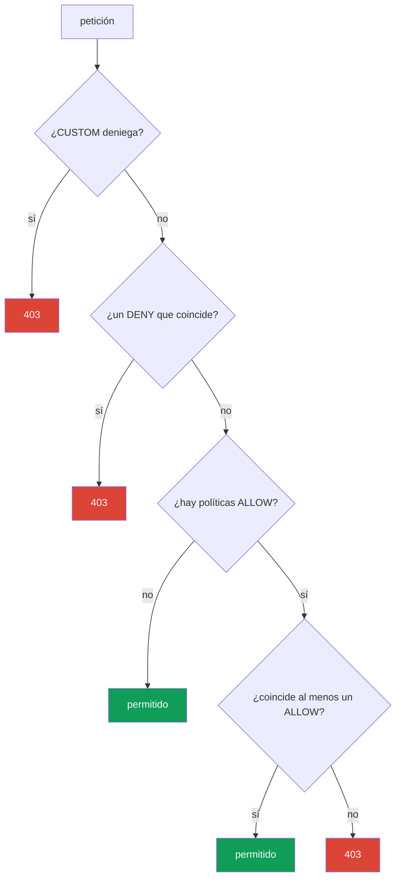

[RU version](ru.md) · [Eng version](en.md)

# Capítulo 14. AuthorizationPolicy: autorización entre servicios

> **Qué sigue.** En el capítulo 13 habilitamos mTLS: ahora el tráfico está cifrado y sabemos quién
> está al otro extremo de la conexión. Pero mTLS no limita lo que ese par tiene permitido hacer.
> Ese es el trabajo de `AuthorizationPolicy`: responde a la pregunta "quién puede alcanzar qué, y
> cómo". Este es el segundo pilar de la seguridad de Istio.

## 14.1. Por qué se necesita la autorización

Recuerda el final del capítulo anterior. Habilitamos mTLS `STRICT`: ahora nadie sin una identidad
válida de la malla puede alcanzar el servicio `payments`. Pero cualquier servicio dentro de la
malla con su propio certificado todavía puede alcanzar `payments`. Y nos gustaría ser más
precisos: "a payments solo se puede llegar desde frontend y solo con GET".

Eso es exactamente la autorización. mTLS nos dio una identidad verificada (quién es esto),
mientras que `AuthorizationPolicy` usa esa identidad para decidir qué tiene permitido hacer ese
cliente.

## 14.2. La estructura de AuthorizationPolicy

El recurso tiene tres partes principales:

```yaml
apiVersion: security.istio.io/v1
kind: AuthorizationPolicy
metadata:
  name: payments-policy
  namespace: app
spec:
  selector:               # a qué pods se aplica
    matchLabels:
      app: payments
  action: ALLOW           # qué hacer: ALLOW / DENY / CUSTOM / AUDIT
  rules:                  # bajo qué condiciones
  - from:
    - source:
        principals: ["cluster.local/ns/app/sa/frontend"]
    to:
    - operation:
        methods: ["GET"]
```

- **`selector`**: a qué pods se aplica la política (aquí `payments`). Sin selector, todo el
  namespace.
- **`action`**: qué hacer con las peticiones que coinciden.
- **`rules`**: las condiciones: quién (`from`), dónde y cómo (`to`), bajo qué circunstancias
  (`when`).

## 14.3. Default-deny: cerrarlo todo

El principio Zero Trust: primero prohíbe todo, luego permite exactamente lo que se necesita. En
Istio la forma canónica de "prohibir todo" parece inesperada: es una política `ALLOW` **sin ni
una sola regla**:

```yaml
apiVersion: security.istio.io/v1
kind: AuthorizationPolicy
metadata:
  name: payments-deny-all
  namespace: app
spec:
  selector:
    matchLabels:
      app: payments
  action: ALLOW
  # no hay rules => ninguna petición coincide => todo está prohibido (403)
```

La lógica es esta: en cuanto un pod tiene al menos una política `ALLOW` asociada, entra en vigor
la regla "solo se permite lo que aparece explícitamente en `rules`". No hay reglas, así que nada
coincide y todas las peticiones reciben `403`.

A menudo el default-deny se hace para todo un namespace (o incluso para toda la malla mediante una
política en `istio-system`), y luego se añaden permisos puntuales.

## 14.4. Permitir selectivamente: from, to, when

Ahora abramos exactamente lo que se necesita. Añadimos una segunda política que permite el acceso
a `payments` solo desde `frontend` y solo con el método `GET`:

```yaml
spec:
  selector:
    matchLabels:
      app: payments
  action: ALLOW
  rules:
  - from:
    - source:
        principals: ["cluster.local/ns/app/sa/frontend"]  # QUIÉN
    to:
    - operation:
        methods: ["GET"]                                   # QUÉ se puede hacer
        paths: ["/api/*"]                                  # en qué rutas
    when:
    - key: request.headers[x-env]                          # una condición extra
      values: ["prod"]
```

Los tres bloques de una regla:

- **`from`**: el origen de la petición. Lo más habitual es `principals` (la identidad SPIFFE del
  capítulo 13), pero también existen `namespaces` e `ipBlocks`.
- **`to`**: qué se puede hacer: métodos HTTP (`methods`), rutas (`paths`), puertos.
- **`when`**: condiciones adicionales: cabeceras, claims de JWT y otros atributos de la petición.

Las políticas con `action: ALLOW` se combinan con OR: una petición pasa si **al menos una**
política ALLOW la permite. Así que default-deny + este permiso juntos dan como resultado: "a
payments solo se puede llegar desde frontend, solo GET, solo en /api/*, solo en prod".

## 14.5. Negaciones, condiciones when y alcance

Unas cuantas capacidades importantes más que suelen hacer falta en la práctica.

**Negaciones.** La mayoría de campos tienen una forma `not-`: `notPrincipals`, `notNamespaces`,
`notMethods`, `notPaths`, `notPorts`. La regla coincide si el atributo de la petición **no** está
entre los listados. Por ejemplo, "permitir todo excepto el método DELETE":

```yaml
  rules:
  - to:
    - operation:
        notMethods: ["DELETE"]
```

**Las claves de `when`.** El bloque `when` coincide con atributos arbitrarios de la petición. Las
claves más útiles:

- `request.auth.claims[<claim>]`: un claim de un JWT verificado (capítulo 15);
- `request.headers[<name>]`: una cabecera HTTP;
- `source.namespace` / `source.principal`: de dónde vino la petición;
- `destination.port`: qué puerto;
- `remote.ip`: la IP real del cliente (ver 14.10 sobre el borde).

**Alcance.** Igual que con `PeerAuthentication` (capítulo 13), el nivel viene determinado por el
namespace y la presencia de un `selector`:

- **toda la malla**: una política en el namespace raíz (`istio-system`);
- **un namespace**: una política sin `selector` en el namespace necesario;
- **pods concretos**: una política con `selector.matchLabels`.

Esto permite, por ejemplo, un único default-deny para toda la malla en `istio-system`, mientras se
mantienen los permisos puntuales junto a los servicios en su namespace.

## 14.6. Acciones: ALLOW, DENY, CUSTOM, AUDIT

El campo `action` tiene cuatro valores:

| Acción | Qué hace |
|--------|----------|
| `ALLOW` | permite las peticiones que coinciden (la más común) |
| `DENY` | prohíbe explícitamente las peticiones que coinciden |
| `CUSTOM` | delega la decisión a un servicio de autorización externo |
| `AUDIT` | solo registra la coincidencia, sin afectar a la decisión |

`ALLOW` se usa para el modelo de "permitir lo que se necesita". `DENY` es útil para cerrar
explícitamente algo concreto (por ejemplo, prohibir el método DELETE en todas partes). `CUSTOM` es
para autorización externa (por ejemplo, vía OPA o tu propio servicio). `AUDIT` sirve para ver qué
se dispararía, sin bloquear nada todavía.

Un ejemplo de un `DENY` explícito: prohibir el método `DELETE` a `payments` para todos, sin
importar otras políticas ALLOW (recuerda de 14.7: `DENY` se comprueba antes que `ALLOW`):

```yaml
apiVersion: security.istio.io/v1
kind: AuthorizationPolicy
metadata:
  name: payments-deny-delete
  namespace: app
spec:
  selector:
    matchLabels:
      app: payments
  action: DENY
  rules:
  - to:
    - operation:
        methods: ["DELETE"]     # cualquier DELETE a payments -> 403, pese a lo que permita ALLOW
```

## 14.7. Orden de evaluación de las políticas

Cuando hay varias políticas asociadas a un pod, Istio las evalúa en un orden estricto. Esta es una
fuente frecuente de confusión, así que recuerda la secuencia:



En palabras:

1. Primero se comprueban las políticas `CUSTOM`. Si la autz externa dijo "no", denegado.
2. Luego las políticas `DENY`. Si la petición coincide con alguna, denegado.
3. Luego `ALLOW`. Si **no hay ninguna política ALLOW**, la petición se permite (este es el
   comportamiento por defecto sin políticas). Si **sí hay** políticas ALLOW, la petición debe
   coincidir con al menos una; en caso contrario, denegado.

De ahí la "magia" del default-deny de la sección 14.3: la presencia de una política ALLOW vacía
pone al pod en modo "solo se permite lo que aparece explícitamente", y no hay nada que listar, así
que todo queda prohibido.

## 14.8. El vínculo con mTLS

Un detalle importante que es fácil pasar por alto. La regla `from.source.principals` comprueba la
identidad SPIFFE del cliente. Pero ¿de dónde conoce Istio esta identidad? Del certificado mTLS que
el cliente presentó al conectar (capítulo 13).

Así que sin mTLS una regla `principals` no puede funcionar de forma fiable: si el tráfico es texto
plano, Istio no tiene una identidad verificada del emisor. Por eso la autorización basada en
identidad y mTLS siempre van juntas: primero `PeerAuthentication` (mTLS STRICT) garantiza que la
identidad es genuina, luego `AuthorizationPolicy` decide, basándose en esa identidad, qué está
permitido.

Si, en cambio, escribes reglas solo por `namespaces` o `ipBlocks` en lugar de por `principals`,
mTLS formalmente no es obligatorio, pero esas reglas son más débiles, porque una IP y un namespace
son más fáciles de suplantar que una identidad criptográfica.

## 14.9. AuthorizationPolicy y NetworkPolicy: capas de defensa

Un ingeniero que viene del CKA debería preguntarse de inmediato: ¿en qué se diferencia esto de la
`NetworkPolicy` que ya conozco? Ambos recursos restringen el acceso, pero trabajan a distintos
niveles y se complementan.

**NetworkPolicy** (Kubernetes) trabaja en L3/L4: permite o prohíbe **conexiones de red** entre
pods por IP, puertos y etiquetas. La aplica el plugin CNI a nivel de red (esencialmente en el
kernel), antes de que el tráfico siquiera llegue a la aplicación o a Envoy.

**AuthorizationPolicy** (Istio) trabaja en L7: mira la identidad criptográfica (SPIFFE), el método
HTTP, la ruta, las cabeceras. La aplica el sidecar Envoy.

| | NetworkPolicy | AuthorizationPolicy |
|---|---------------|---------------------|
| Nivel | L3/L4 (IP, puerto) | L7 (identidad, método, ruta) |
| Quién la aplica | CNI (nivel de red/kernel) | sidecar Envoy |
| Qué controla | si un pod puede conectar en absoluto | qué exactamente tiene permitido hacer un cliente |
| Ve la identidad | no, solo la IP y las etiquetas del pod | sí, la identidad SPIFFE |
| Ve HTTP | no | sí (método, ruta, cabeceras) |
| Necesita una malla | no | sí (sidecar o ztunnel) |

La idea clave: no es "una u otra", sino **dos capas de defensa (defense in depth)**.

- NetworkPolicy corta las conexiones no deseadas a nivel de red. Funciona incluso si el pod no
  tiene sidecar, y no se puede sortear desde una aplicación comprometida, porque las reglas viven
  en el kernel, no en el contenedor.
- AuthorizationPolicy añade lo que NetworkPolicy fundamentalmente no puede: reglas por la identidad
  verificada de un servicio y por los detalles de la petición HTTP.

**Buenas prácticas para usarlas juntas:**

- Haz **default-deny en ambos niveles**: una NetworkPolicy base que prohíba las conexiones
  innecesarias en un namespace, más una AuthorizationPolicy default-deny.
- Usa NetworkPolicy para segmentación gruesa: qué namespaces y pods pueden hablar por la red en
  absoluto (incluido el tráfico ajeno a la malla y el acceso al control plane).
- Usa AuthorizationPolicy para reglas finas: quién (por identidad), con qué métodos y en qué rutas
  puede alcanzar un servicio.
- No confíes solo en AuthorizationPolicy: se aplica en Envoy dentro del pod. NetworkPolicy es una
  línea independiente a nivel de red que permanece incluso si algo salió mal con el sidecar.

En resumen: NetworkPolicy responde a "quién puede conectar con quién por la red",
AuthorizationPolicy responde a "qué exactamente tiene permitido hacer este servicio a nivel de
aplicación". Juntas proporcionan una protección multicapa completa.

### También existe la NetworkPolicy L7 (Cilium)

El panorama es un poco más complejo que "NetworkPolicy = L4, Istio = L7". La NetworkPolicy estándar
de Kubernetes es, en efecto, solo L3/L4. Pero algunos CNI pueden hacer más. El ejemplo más notable
es **Cilium**: basado en eBPF ofrece **políticas de red conscientes de L7** que pueden filtrar
métodos y rutas HTTP, gRPC, Kafka, consultas DNS. Así que algunas reglas L7 también se pueden hacer
a nivel de CNI, sin Istio.

Surge una pregunta obvia: si tanto Cilium como Istio pueden hacer L7, ¿por qué tener ambos y cómo
combinarlos? Desglosémoslo.

- **Modelos de identidad distintos.** Istio autoriza por la identidad SPIFFE del certificado mTLS.
  Cilium usa su propio modelo de identidad basado en etiquetas de pod (vía eBPF), y mTLS es para él
  una opción aparte. Son enfoques fundamentalmente distintos sobre "quién es esto".
- **Puntos de aplicación distintos.** Cilium aplica reglas en el kernel (eBPF) y en un Envoy
  incorporado por nodo. Istio, en el sidecar o el waypoint. Si habilitas L7 en ambos, el tráfico
  pasa por dos análisis L7, lo que añade latencia y complejidad de depuración.

**Si usarlos juntos.** La recomendación general es **no duplicar reglas L7 en dos sistemas**. Las
opciones prácticas:

- **Cilium para L3/L4 + Istio para L7.** La opción más común y sana: Cilium como CNI se encarga de
  la segmentación de red rápida (L3/L4) y posiblemente de las políticas de DNS, mientras que Istio
  asume todo L7: mTLS, autorización basada en identidad, gestión del tráfico. Esta es exactamente
  la combinación habitual con el modo ambient de Istio.
- **Solo Cilium (con su L7)** sin Istio: razonable si el filtrado L7 del CNI te basta y no
  necesitas una malla completa (gestión del tráfico, mirroring, observabilidad rica).
- **Solo Istio**: si ya existe una malla, es lógico mantener las políticas L7 en ella y tomar solo
  L3/L4 del CNI.

Qué evitar: escribir reglas L7 solapadas en Cilium e Istio al mismo tiempo. Eso es doble overhead,
dos fuentes de verdad y una depuración muy difícil cuando una petición recibe "inexplicablemente"
un 403. Elige una capa para L7 y mantén ahí las reglas.

## 14.10. Autorización en el ingress gateway (borde) y la trampa de la IP

`AuthorizationPolicy` se asocia no solo a los servicios dentro de la malla, sino también al
**propio ingress gateway**, para filtrar el tráfico ya en la entrada (por ejemplo, permitir el
panel de administración solo desde la red de la oficina). Tal política se coloca en el namespace
del gateway (`istio-system`) con un `selector` sobre los pods del gateway:

```yaml
apiVersion: security.istio.io/v1
kind: AuthorizationPolicy
metadata:
  name: ingress-allow-office
  namespace: istio-system
spec:
  selector:
    matchLabels:
      istio: ingressgateway
  action: ALLOW
  rules:
  - from:
    - source:
        remoteIpBlocks: ["203.0.113.0/24"]   # la IP real del cliente
    to:
    - operation:
        hosts: ["admin.example.com"]
```

**La trampa de la IP: `ipBlocks` vs `remoteIpBlocks`.** Esto rompe con regularidad las listas
blancas de IP, especialmente detrás de un balanceador de carga:

- **`ipBlocks`**: la IP del **origen de la conexión** tal como la ve Envoy. Detrás de un
  balanceador, esta será la IP del propio LB/proxy, no la del cliente. Filtrar al cliente por ella
  es inútil.
- **`remoteIpBlocks`**: la **IP real del cliente** que Istio determina a partir de la cabecera
  `X-Forwarded-For`, teniendo en cuenta el número de proxies de confianza. Esto es lo que hace
  falta para una lista blanca por la dirección del cliente.

Pero **de dónde viene la IP correcta del cliente depende del tipo de balanceador**, y aquí AWS se
divide en dos casos.

**ALB (L7).** El ALB añade él mismo `X-Forwarded-For` con la IP real del cliente. Basta con
decirle a Istio cuántos proxies de confianza hay delante del gateway, vía `numTrustedProxies` en
MeshConfig:

```yaml
apiVersion: install.istio.io/v1alpha1
kind: IstioOperator
spec:
  meshConfig:
    defaultConfig:
      gatewayTopology:
        numTrustedProxies: 1     # 1 proxy de confianza (el ALB) delante del ingress gateway
```

**NLB (L4).** El punto clave: **el NLB trabaja en L4 y no añade `X-Forwarded-For`**; no tiene con
qué "firmar" una cabecera HTTP, va sobre TCP. Así que `numTrustedProxies` por sí solo no ayuda
aquí: simplemente no hay de dónde saque XFF. La IP del cliente detrás de un NLB se preserva vía
**Proxy Protocol v2**. Hacen falta tres cosas:

1. **Habilitar Proxy Protocol en el NLB**, con una anotación en el Service del ingress gateway:

   ```yaml
   serviceAnnotations:
     service.beta.kubernetes.io/aws-load-balancer-type: external
     service.beta.kubernetes.io/aws-load-balancer-proxy-protocol: "*"   # PROXY v2
   ```

2. **Enseñar al ingress gateway a parsear Proxy Protocol**, con un listener filter vía un
   EnvoyFilter:

   ```yaml
   apiVersion: networking.istio.io/v1alpha3
   kind: EnvoyFilter
   metadata:
     name: ingress-proxy-protocol
     namespace: istio-system
   spec:
     selector:
       matchLabels:
         istio: ingressgateway
     configPatches:
     - applyTo: LISTENER
       patch:
         operation: MERGE
         value:
           listener_filters:
           - name: envoy.filters.listener.proxy_protocol
   ```

3. **Decirle a Istio que confíe en el origen de Proxy Protocol** como el cliente real, vía
   `gatewayTopology`:

   ```yaml
   apiVersion: install.istio.io/v1alpha1
   kind: IstioOperator
   spec:
     meshConfig:
       defaultConfig:
         gatewayTopology:
           proxyProtocol: {}      # tomar la IP del cliente de la cabecera PROXY
   ```

Tras esto la IP real del cliente está disponible, y `remoteIpBlocks` / `remote.ip` en una
`AuthorizationPolicy` funcionan correctamente. La alternativa sin Proxy Protocol es usar targets de
tipo `instance` para el NLB con `externalTrafficPolicy: Local`, pero eso cambia el balanceo y los
health checks, así que en una malla se suele elegir Proxy Protocol.

En resumen: para una lista blanca por la IP del cliente usa **`remoteIpBlocks`**, y haz llegar la
IP del cliente al gateway: detrás de un **ALB** vía `numTrustedProxies` (hay XFF), detrás de un
**NLB** vía **Proxy Protocol v2** (no hay XFF). Nunca confíes en `ipBlocks` detrás de un
balanceador.

## 14.11. Verificación y depuración

Una denegación de autorización tiene un aspecto inequívoco: HTTP **`403`** con el cuerpo **`RBAC:
access denied`**. Si ves tal respuesta, no la devolvió el servicio sino Envoy según tu política.

Útil al depurar:

- **Los logs del sidecar del destino** muestran el motivo de la denegación:

  ```bash
  kubectl logs <pod> -c istio-proxy -n app | grep -i rbac
  # busca rbac_access_denied_matched_policy - qué política se disparó
  ```

- **Un `AUDIT` temporal en lugar de DENY/ALLOW**: para comprobar que la política coincide con las
  peticiones previstas sin bloquearlas (las coincidencias se escriben en el log).
- **La descripción del pod con `istioctl`** muestra qué políticas tiene asociadas:

  ```bash
  istioctl x describe pod <pod> -n app
  ```

Causas comunes de un "403 inexplicable": olvidaste que hay un default-deny en algún sitio; una
regla `principals` no se dispara porque no hay mTLS STRICT (14.8); filtras por `ipBlocks` en lugar
de `remoteIpBlocks` en el borde (14.10).

## 14.12. Buenas prácticas

- **Default-deny como base.** Empieza prohibiendo todo (un `ALLOW` vacío sobre el
  namespace/malla) y añade permisos puntuales: eso es Zero Trust.
- **Reglas por `principals`, no por IP.** Una identidad criptográfica de mTLS es más fiable que la
  IP/namespace; usa el filtrado basado en identidad como el principal (y mantén mTLS en `STRICT`,
  ver 14.8).
- **`DENY` para prohibiciones explícitas.** Cierra las operaciones peligrosas (por ejemplo,
  `DELETE`, rutas de administración) con una política `DENY` aparte: se dispara antes que cualquier
  `ALLOW`.
- **En el borde: `remoteIpBlocks` + confianza en XFF.** Para una lista blanca por la IP del cliente
  no la confundas con `ipBlocks` (14.10).
- **Mínimo privilegio.** Permite lo mínimo: métodos, rutas y orígenes concretos, no "todo desde
  este namespace".
- **Verifica las políticas** (14.11): `AUDIT` antes de habilitar, los logs `rbac`, `istioctl x
  describe`; no te fíes de "la regla está escrita, así que funciona".
- **Dos capas de defensa.** Complementa AuthorizationPolicy con un default-deny de red vía
  NetworkPolicy (14.9), por si hay problemas con el sidecar.

## 14.13. Resumen del capítulo

- `AuthorizationPolicy` responde a "qué tiene permitido hacer este cliente", usando la identidad de
  mTLS.
- Estructura: `selector` (qué pods), `action` (qué hacer), `rules` (condiciones: `from`, `to`,
  `when`).
- **Default-deny** es una política `ALLOW` sin reglas: pone al pod en modo "solo lo que se permite
  explícitamente", y como no hay reglas, todo queda prohibido.
- Los permisos puntuales fijan `from` (quién, normalmente `principals`), `to` (métodos, rutas),
  `when` (condiciones extra); las políticas ALLOW se combinan con OR.
- Acciones: `ALLOW`, `DENY`, `CUSTOM` (autz externa), `AUDIT` (solo log).
- Orden de evaluación: CUSTOM, luego DENY, luego ALLOW.
- La autorización por `principals` funciona encima de la identidad de mTLS, así que va junto con
  PeerAuthentication.
- AuthorizationPolicy (L7, Envoy) y NetworkPolicy (L3/L4, CNI) se complementan; la mejor práctica
  es defense in depth: default-deny en ambos niveles.
- Algunos CNI (Cilium) pueden hacer políticas L7; para evitar complejidad extra, mantén L7 en un
  solo sistema: una elección común es Cilium para L3/L4, Istio para L7.
- Existen negaciones (`notMethods`, `notPaths`…), un `when` flexible (claims de JWT, cabeceras,
  puerto, `remote.ip`) y niveles de acción (malla/namespace/pods), como con PeerAuthentication.
- En el **ingress gateway**, para una lista blanca por la IP del cliente usa **`remoteIpBlocks`**,
  no `ipBlocks` (la IP de la conexión = la IP del LB). Haz llegar la IP del cliente al gateway:
  detrás de un **ALB** vía `numTrustedProxies` (hay XFF), detrás de un **NLB** (L4, sin XFF) vía
  **Proxy Protocol v2**.
- Una denegación = `403 RBAC: access denied`; depúrala con los logs de Envoy
  (`rbac_access_denied`), un `AUDIT` temporal e `istioctl x describe`.

## 14.14. Preguntas de autoevaluación

1. ¿En qué se diferencia la tarea de AuthorizationPolicy de la de mTLS/PeerAuthentication?
2. ¿Por qué una política `ALLOW` sin reglas prohíbe todo?
3. ¿De qué se encargan los bloques `from`, `to` y `when`?
4. ¿En qué orden evalúa Istio CUSTOM, DENY y ALLOW?
5. ¿Por qué una regla `principals` requiere mTLS, mientras que una de `namespaces` formalmente no?
6. ¿En qué se diferencia NetworkPolicy de AuthorizationPolicy y por qué deberían usarse juntas?
7. ¿Cuál es la diferencia entre `ipBlocks` y `remoteIpBlocks` en el ingress gateway? ¿Cómo haces
   llegar la IP real del cliente al gateway detrás de un **ALB** y detrás de un **NLB** (y por qué
   XFF no sirve para el NLB)?
8. ¿Qué aspecto tiene una denegación de autorización y cómo encuentras qué política la causó?
9. ¿Cómo haces una prohibición explícita de una operación peligrosa (por ejemplo, DELETE) sin
   importar las reglas ALLOW?

## Práctica

Practica el default-deny y un permiso puntual (solo frontend + GET) encima de mTLS STRICT; esto
continúa el laboratorio del capítulo 13:

🧪 Laboratorio 04: [tasks/ica/labs/04](../../labs/04/README_ES.MD)

---
[Índice](../README_ES.md) · [Capítulo 13](../13/es.md) · [Capítulo 15](../15/es.md)
