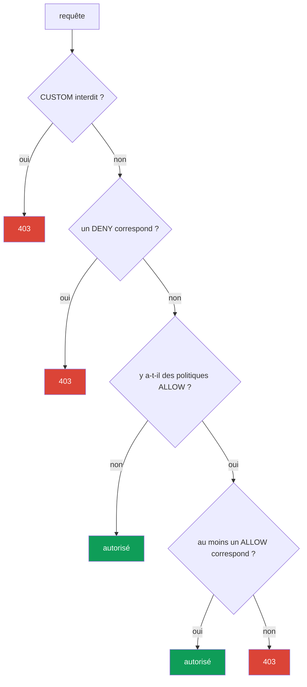

[RU version](ru.md) · [Eng version](en.md) · [Versión en español](es.md) · [Deutsche Version](de.md)

# Chapitre 14. AuthorizationPolicy : autorisation service-to-service

> **La suite.** Au chapitre 13, nous avons activé le mTLS : le trafic est désormais
> chiffré et nous savons qui se trouve à l'autre bout de la connexion. Mais le mTLS ne
> limite pas ce que cet interlocuteur est autorisé à faire. C'est le rôle
> d'`AuthorizationPolicy` - elle répond à la question « qui peut s'adresser à quoi et de
> quelle façon ». C'est le deuxième pilier de la sécurité d'Istio.

## 14.1. Pourquoi l'autorisation est nécessaire

Rappelons la fin du chapitre précédent. On a activé le `STRICT` mTLS - plus personne sans
identité de maillage valide ne peut atteindre le service `payments`. Mais n'importe quel
service à l'intérieur du maillage avec son certificat peut toujours s'adresser à
`payments`. Or on aimerait dire plus précisément : « on ne peut accéder à payments que
depuis frontend et uniquement via la méthode GET ».

C'est cela, l'autorisation. Le mTLS nous a donné une identité vérifiée (qui c'est), et
`AuthorizationPolicy` utilise cette identité pour décider ce que ce client a le droit de
faire.

## 14.2. Structure d'AuthorizationPolicy

La ressource comporte trois parties principales :

```yaml
apiVersion: security.istio.io/v1
kind: AuthorizationPolicy
metadata:
  name: payments-policy
  namespace: app
spec:
  selector:               # à quels pods elle s'applique
    matchLabels:
      app: payments
  action: ALLOW           # quoi faire : ALLOW / DENY / CUSTOM / AUDIT
  rules:                  # sous quelles conditions
  - from:
    - source:
        principals: ["cluster.local/ns/app/sa/frontend"]
    to:
    - operation:
        methods: ["GET"]
```

- **`selector`** - sur quels pods agit la politique (ici `payments`). Sans selector - sur
  tout le namespace.
- **`action`** - ce qu'il faut faire des requêtes correspondantes.
- **`rules`** - les conditions : qui (`from`), vers où et comment (`to`), dans quelles
  circonstances (`when`).

## 14.3. Default-deny : tout fermer

Principe du Zero Trust : d'abord tout interdire, puis autoriser précisément ce qui est
nécessaire. Dans Istio, la façon canonique de « tout interdire » est inattendue - c'est une
politique `ALLOW` **sans aucune règle** :

```yaml
apiVersion: security.istio.io/v1
kind: AuthorizationPolicy
metadata:
  name: payments-deny-all
  namespace: app
spec:
  selector:
    matchLabels:
      app: payments
  action: ALLOW
  # rules absentes => aucune requête ne correspond => tout est interdit (403)
```

La logique est la suivante : dès qu'au moins une politique `ALLOW` est attachée à un pod,
la règle « seul ce qui est explicitement énuméré dans `rules` est autorisé » s'applique.
Pas de règles - donc rien ne correspond, et toutes les requêtes reçoivent un `403`.

Souvent, on fait le default-deny sur tout le namespace (ou même sur tout le maillage via
une politique dans `istio-system`), puis on ajoute des autorisations ciblées.

## 14.4. Autoriser de façon ciblée : from, to, when

Ouvrons maintenant exactement ce qu'il faut. On ajoute une seconde politique qui autorise
l'accès à `payments` uniquement depuis `frontend` et uniquement via la méthode `GET` :

```yaml
spec:
  selector:
    matchLabels:
      app: payments
  action: ALLOW
  rules:
  - from:
    - source:
        principals: ["cluster.local/ns/app/sa/frontend"]  # QUI
    to:
    - operation:
        methods: ["GET"]                                   # CE qu'on peut faire
        paths: ["/api/*"]                                  # sur quels chemins
    when:
    - key: request.headers[x-env]                          # condition supplémentaire
      values: ["prod"]
```

Trois blocs de la règle :

- **`from`** - la source de la requête. Le plus souvent, ce sont des `principals` (identité
  SPIFFE du chapitre 13), mais il y a aussi `namespaces` et `ipBlocks`.
- **`to`** - ce qu'on peut faire : méthodes HTTP (`methods`), chemins (`paths`), ports.
- **`when`** - conditions supplémentaires : en-têtes, claims JWT et autres attributs de la
  requête.

Les politiques avec `action: ALLOW` se combinent selon le principe du OU : une requête
passe si elle est autorisée par **au moins une** politique ALLOW. Autrement dit, le
default-deny + cette autorisation donnent ensemble : « on ne peut accéder à payments que
depuis frontend, uniquement GET, uniquement sur /api/*, uniquement en prod ».

## 14.5. Négations, conditions when et portée

Encore quelques possibilités importantes, souvent nécessaires en pratique.

**Négations.** La plupart des champs ont une forme avec `not-` : `notPrincipals`,
`notNamespaces`, `notMethods`, `notPaths`, `notPorts`. La règle se déclenche si l'attribut
de la requête **ne** figure **pas** dans la liste. Par exemple, « autoriser tout sauf la
méthode DELETE » :

```yaml
  rules:
  - to:
    - operation:
        notMethods: ["DELETE"]
```

**Les clés `when`.** Le bloc `when` matche sur des attributs arbitraires de la requête. Les
clés les plus utiles :

- `request.auth.claims[<claim>]` - un claim du JWT vérifié (chapitre 15) ;
- `request.headers[<name>]` - un en-tête HTTP ;
- `source.namespace` / `source.principal` - d'où vient la requête ;
- `destination.port` - sur quel port ;
- `remote.ip` - la véritable IP cliente (voir 14.10 à propos de l'edge).

**Portée.** Comme pour `PeerAuthentication` (chapitre 13), le niveau est déterminé par le
namespace et la présence d'un `selector` :

- **tout le maillage** - une politique dans le namespace racine (`istio-system`) ;
- **namespace** - une politique sans `selector` dans le namespace voulu ;
- **pods spécifiques** - une politique avec `selector.matchLabels`.

Cela permet, par exemple, de faire un seul default-deny sur tout le maillage dans
`istio-system`, et de garder les autorisations ciblées près des services dans leur
namespace.

## 14.6. Actions : ALLOW, DENY, CUSTOM, AUDIT

Le champ `action` a quatre valeurs :

| Action | Ce qu'elle fait |
|----------|-----------|
| `ALLOW` | autoriser les requêtes correspondantes (le plus fréquent) |
| `DENY` | interdire explicitement les requêtes correspondantes |
| `CUSTOM` | déléguer la décision à un service d'autorisation externe |
| `AUDIT` | seulement journaliser la correspondance, sans influer sur la décision |

`ALLOW` est utilisé pour le modèle « on autorise ce qui est nécessaire ». `DENY` est
pratique pour fermer explicitement quelque chose de précis (par exemple, interdire la
méthode DELETE partout). `CUSTOM` sert à l'autorisation externe (par exemple, via OPA ou
votre propre service). `AUDIT` sert à voir ce qui se déclencherait, sans rien bloquer pour
l'instant.

Exemple de `DENY` explicite - interdiction de la méthode `DELETE` vers `payments` pour
tout le monde, indépendamment des autres politiques ALLOW (rappel de 14.7 : `DENY` est
vérifié avant `ALLOW`) :

```yaml
apiVersion: security.istio.io/v1
kind: AuthorizationPolicy
metadata:
  name: payments-deny-delete
  namespace: app
spec:
  selector:
    matchLabels:
      app: payments
  action: DENY
  rules:
  - to:
    - operation:
        methods: ["DELETE"]     # tout DELETE vers payments -> 403, quoi qu'autorise ALLOW
```

## 14.7. Ordre d'évaluation des politiques

Quand plusieurs politiques sont attachées à un pod, Istio les évalue dans un ordre strict.
C'est une source fréquente de confusion, alors retenez bien la séquence :



En mots :

1. On vérifie d'abord les politiques `CUSTOM`. Si l'authz externe a dit « non » -
   interdiction.
2. Puis les politiques `DENY`. Si la requête correspond à l'une d'elles - interdiction.
3. Puis `ALLOW`. S'il n'y a **aucune** politique ALLOW - la requête est autorisée (c'est le
   comportement par défaut sans politiques). S'il **y a** des politiques ALLOW, la requête
   doit correspondre à au moins une, sinon interdiction.

D'où la « magie » du default-deny de la section 14.3 : la présence d'une politique ALLOW
vide fait passer le pod en mode « seul ce qui est explicitement énuméré est autorisé », et
comme il n'y a rien à énumérer - tout est interdit.

## 14.8. Lien avec le mTLS

Un détail important, facile à manquer. La règle `from.source.principals` vérifie l'identité
SPIFFE du client. Mais d'où Istio connaît-il cette identité ? Du certificat mTLS que le
client a présenté lors de la connexion (chapitre 13).

Donc, sans mTLS, une règle par `principals` ne peut pas fonctionner de manière fiable : si
le trafic circule en plaintext, Istio n'a pas d'identité vérifiée de l'émetteur. C'est
pourquoi l'autorisation par identité et le mTLS vont toujours de pair : d'abord
`PeerAuthentication` (STRICT mTLS) garantit que l'identité est authentique, puis
`AuthorizationPolicy` décide, sur la base de cette identité, ce qui est permis.

Si en revanche vous écrivez des règles uniquement par `namespaces` ou `ipBlocks`, et non
par `principals`, alors formellement le mTLS n'est pas obligatoire - mais de telles règles
sont plus faibles, car une IP et un namespace sont plus faciles à falsifier qu'une identité
cryptographique.

## 14.9. AuthorizationPolicy et NetworkPolicy : des couches de protection

Un ingénieur venant de CKA se posera aussitôt la question : en quoi est-ce différent de la
`NetworkPolicy` que je connais déjà ? Les deux ressources restreignent l'accès, mais
travaillent à des niveaux différents et se complètent.

**NetworkPolicy** (Kubernetes) travaille en L3/L4 : elle autorise ou interdit les
**connexions réseau** entre pods par IP, ports et labels. Elle est appliquée par le plugin
CNI au niveau réseau (essentiellement dans le noyau), avant même que le trafic n'atteigne
l'application ou Envoy.

**AuthorizationPolicy** (Istio) travaille en L7 : elle regarde l'identité cryptographique
(SPIFFE), la méthode HTTP, le chemin, les en-têtes. Elle est appliquée par le sidecar
Envoy.

| | NetworkPolicy | AuthorizationPolicy |
|---|---------------|---------------------|
| Niveau | L3/L4 (IP, port) | L7 (identity, méthode, chemin) |
| Qui l'applique | CNI (niveau réseau/noyau) | sidecar Envoy |
| Ce qu'elle contrôle | si un pod peut se connecter du tout | ce que le client a précisément le droit de faire |
| Voit l'identity | non, seulement l'IP et les labels des pods | oui, l'identité SPIFFE |
| Voit le HTTP | non | oui (méthode, chemin, en-têtes) |
| Maillage requis | non | oui (sidecar ou ztunnel) |

Idée clé : ce n'est pas « l'un ou l'autre », mais **deux couches de protection (defense in
depth)**.

- NetworkPolicy coupe les connexions indésirables au niveau réseau. Elle fonctionne même si
  le pod n'a pas de sidecar, et on ne peut pas la contourner depuis une application
  compromise, car les règles vivent dans le noyau, pas dans le conteneur.
- AuthorizationPolicy ajoute ce que NetworkPolicy ne peut par principe pas faire : des
  règles basées sur l'identité vérifiée du service et sur les détails de la requête HTTP.

**Best practices d'utilisation conjointe :**

- Faites un **default-deny sur les deux niveaux** : une NetworkPolicy de base interdisant
  les connexions superflues dans le namespace, plus une AuthorizationPolicy default-deny.
- Utilisez NetworkPolicy pour la segmentation grossière : quels namespaces et pods peuvent
  du tout communiquer par le réseau (y compris le trafic hors maillage et l'accès au control
  plane).
- Utilisez AuthorizationPolicy pour les règles fines : qui (par identity), avec quelles
  méthodes et sur quels chemins peut s'adresser au service.
- Ne comptez pas uniquement sur AuthorizationPolicy : elle est appliquée dans Envoy à
  l'intérieur du pod. NetworkPolicy est une ligne indépendante au niveau réseau, qui
  subsiste même si quelque chose a mal tourné avec le sidecar.

Bilan : NetworkPolicy répond à « qui peut se connecter à qui par le réseau »,
AuthorizationPolicy - « ce que ce service a précisément le droit de faire au niveau
applicatif ». Ensemble, elles offrent une protection multicouche complète.

### Et il existe aussi la L7 NetworkPolicy (Cilium)

Le tableau est un peu plus complexe que « NetworkPolicy = L4, Istio = L7 ». La NetworkPolicy
standard de Kubernetes est effectivement uniquement L3/L4. Mais certains CNI savent faire
plus. L'exemple le plus notable est **Cilium** : basé sur eBPF, il propose des **politiques
réseau L7-aware** qui peuvent filtrer les méthodes et chemins HTTP, gRPC, Kafka, les
requêtes DNS. Autrement dit, une partie des règles L7 peut aussi se faire au niveau du CNI,
sans Istio.

Une question évidente se pose : si Cilium et Istio savent tous deux faire du L7, pourquoi
les deux et comment les combiner ? Voyons cela.

- **Des modèles d'identity différents.** Istio autorise par identité SPIFFE issue du
  certificat mTLS. Cilium utilise son propre modèle d'identity basé sur les labels des pods
  (via eBPF), et le mTLS y est une option séparée. Ce sont des approches fondamentalement
  différentes de « qui c'est ».
- **Des points d'application différents.** Cilium applique les règles dans le noyau (eBPF)
  et dans un Envoy per-node intégré. Istio - dans le sidecar ou le waypoint. Si l'on active
  le L7 dans les deux, le trafic passe par deux analyses L7, ce qui ajoute de la latence et
  complique le débogage.

**Faut-il les utiliser ensemble.** La recommandation générale est de **ne pas dupliquer les
règles L7 dans deux systèmes**. Les options pratiques :

- **Cilium pour le L3/L4 + Istio pour le L7.** L'option la plus répandue et la plus saine :
  Cilium comme CNI assure une segmentation réseau rapide (L3/L4) et éventuellement des
  politiques DNS, tandis qu'Istio prend en charge tout le L7 : mTLS, autorisation par
  identity, gestion du trafic. C'est justement le tandem fréquent avec le mode ambient
  d'Istio.
- **Cilium seul (avec son L7)** sans Istio - raisonnable si le filtrage L7 du CNI vous
  suffit et que vous n'avez pas besoin d'un maillage complet (gestion du trafic, mirroring,
  observability riche).
- **Istio seul** - si le maillage est déjà en place, il est logique d'y garder les
  politiques L7 et de ne prendre du CNI que le L3/L4.

Ce qu'il faut éviter : écrire simultanément des règles L7 qui se recoupent à la fois dans
Cilium et dans Istio. C'est un overhead doublé, deux sources de vérité et un débogage très
lourd quand une requête reçoit « inexplicablement » un 403. Choisissez une seule couche
pour le L7 et gardez-y les règles.

## 14.10. Autorisation sur l'ingress gateway (edge) et le piège de l'IP

On attache `AuthorizationPolicy` non seulement aux services à l'intérieur du maillage, mais
aussi à l'**ingress gateway lui-même** - pour filtrer le trafic dès l'entrée (par exemple,
ne laisser accéder à l'admin que depuis le réseau du bureau). Une telle politique est placée
dans le namespace de la gateway (`istio-system`) avec un `selector` sur les pods de la
gateway :

```yaml
apiVersion: security.istio.io/v1
kind: AuthorizationPolicy
metadata:
  name: ingress-allow-office
  namespace: istio-system
spec:
  selector:
    matchLabels:
      istio: ingressgateway
  action: ALLOW
  rules:
  - from:
    - source:
        remoteIpBlocks: ["203.0.113.0/24"]   # véritable IP cliente
    to:
    - operation:
        hosts: ["admin.example.com"]
```

**Le piège de l'IP - `ipBlocks` vs `remoteIpBlocks`.** C'est ce qui casse régulièrement une
allowlist par IP, surtout derrière un load balancer :

- **`ipBlocks`** - l'IP **de la source de la connexion**, telle qu'Envoy la voit. Derrière
  un load balancer, ce sera l'IP du LB/proxy lui-même, pas celle du client. Filtrer le
  client par elle est inutile.
- **`remoteIpBlocks`** - la **véritable IP cliente**, qu'Istio détermine à partir de
  l'en-tête `X-Forwarded-For` en tenant compte du nombre de proxies de confiance. C'est
  justement ce qu'il faut pour une allowlist par adresse du client.

Mais **d'où viendra la bonne IP cliente - cela dépend du type de load balancer**, et ici
AWS se divise en deux cas.

**ALB (L7).** L'ALB ajoute lui-même `X-Forwarded-For` avec la véritable IP cliente. Il
suffit d'expliquer à Istio combien de proxies de confiance se trouvent devant la gateway,
via `numTrustedProxies` dans MeshConfig :

```yaml
apiVersion: install.istio.io/v1alpha1
kind: IstioOperator
spec:
  meshConfig:
    defaultConfig:
      gatewayTopology:
        numTrustedProxies: 1     # 1 proxy de confiance (ALB) devant l'ingress gateway
```

**NLB (L4).** Point clé : le **NLB travaille en L4 et n'ajoute pas `X-Forwarded-For`** - il
n'a rien pour « signer » un en-tête HTTP, il concerne le TCP. C'est pourquoi
`numTrustedProxies` seul n'aidera pas ici : il n'y a nulle part d'où faire venir le XFF.
L'IP cliente derrière un NLB est préservée via le **Proxy Protocol v2**. Il faut trois
choses :

1. **Activer le Proxy Protocol sur le NLB** - via une annotation sur le Service de l'ingress
   gateway :

   ```yaml
   serviceAnnotations:
     service.beta.kubernetes.io/aws-load-balancer-type: external
     service.beta.kubernetes.io/aws-load-balancer-proxy-protocol: "*"   # PROXY v2
   ```

2. **Apprendre à l'ingress gateway à analyser le Proxy Protocol** - via un filtre de
   listener dans un EnvoyFilter :

   ```yaml
   apiVersion: networking.istio.io/v1alpha3
   kind: EnvoyFilter
   metadata:
     name: ingress-proxy-protocol
     namespace: istio-system
   spec:
     selector:
       matchLabels:
         istio: ingressgateway
     configPatches:
     - applyTo: LISTENER
       patch:
         operation: MERGE
         value:
           listener_filters:
           - name: envoy.filters.listener.proxy_protocol
   ```

3. **Dire à Istio de faire confiance à la source issue du Proxy Protocol** comme véritable
   client - via `gatewayTopology` :

   ```yaml
   apiVersion: install.istio.io/v1alpha1
   kind: IstioOperator
   spec:
     meshConfig:
       defaultConfig:
         gatewayTopology:
           proxyProtocol: {}      # prendre l'IP cliente dans l'en-tête PROXY
   ```

Après cela, la véritable IP cliente est disponible, et `remoteIpBlocks` / `remote.ip` dans
`AuthorizationPolicy` fonctionnent correctement. Une alternative sans Proxy Protocol - les
cibles `instance` du NLB avec `externalTrafficPolicy: Local`, mais elle change
l'équilibrage et les health-checks, c'est pourquoi dans un maillage on prend généralement
justement le Proxy Protocol.

En bref : pour une allowlist par IP cliente, utilisez **`remoteIpBlocks`**, et amenez l'IP
cliente jusqu'à la gateway - derrière un **ALB** via `numTrustedProxies` (il y a le XFF),
derrière un **NLB** via le **Proxy Protocol v2** (pas de XFF). Ne comptez jamais sur
`ipBlocks` derrière un load balancer.

## 14.11. Vérification et débogage

Un refus d'autorisation se manifeste sans ambiguïté : un HTTP **`403`** avec le corps
**`RBAC: access denied`**. Si vous voyez une telle réponse - ce n'est pas le service qui l'a
renvoyée, mais Envoy, selon votre politique.

Utile pour le débogage :

- **Les logs du sidecar** de la cible montrent la raison du refus :

  ```bash
  kubectl logs <pod> -c istio-proxy -n app | grep -i rbac
  # on cherche rbac_access_denied_matched_policy - quelle politique s'est déclenchée
  ```

- **Un `AUDIT` temporaire à la place de DENY/ALLOW** - pour vérifier que la politique matche
  bien les requêtes voulues, sans les bloquer (les correspondances sont écrites dans le log).
- **La description d'un pod par `istioctl`** montrera quelles politiques lui sont attachées :

  ```bash
  istioctl x describe pod <pod> -n app
  ```

Causes fréquentes d'un « 403 inexplicable » : on a oublié qu'un default-deny existe quelque
part ; la règle par `principals` ne se déclenche pas parce qu'il n'y a pas de STRICT mTLS
(14.8) ; on filtre par `ipBlocks` au lieu de `remoteIpBlocks` sur l'edge (14.10).

## 14.12. Best practices

- **Le default-deny comme base.** Commencez par tout interdire (un `ALLOW` vide sur le
  namespace/le maillage) et ajoutez des autorisations ciblées - c'est cela, le Zero Trust.
- **Des règles par `principals`, pas par IP.** L'identité cryptographique issue du mTLS est
  plus fiable que l'IP/le namespace ; utilisez le filtrage par identité comme mécanisme
  principal (et gardez le mTLS en `STRICT`, voir 14.8).
- **`DENY` pour les interdictions explicites.** Fermez les opérations dangereuses (par
  exemple, `DELETE`, les chemins d'admin) avec une politique `DENY` séparée - elle se
  déclenchera avant tout `ALLOW`.
- **Sur l'edge - `remoteIpBlocks` + confiance dans le XFF.** Pour une allowlist par IP
  cliente, ne la confondez pas avec `ipBlocks` (14.10).
- **Least privilege.** Autorisez le minimum : des méthodes, chemins et sources précis, pas
  « tout depuis ce namespace ».
- **Vérifiez les politiques** (14.11) : `AUDIT` avant activation, logs `rbac`,
  `istioctl x describe` - ne vous fiez pas au fait que « la règle est écrite, donc elle
  fonctionne ».
- **Deux couches de protection.** Complétez AuthorizationPolicy par un default-deny réseau
  via NetworkPolicy (14.9) - en cas de problème avec le sidecar.

## 14.13. Résumé du chapitre

- `AuthorizationPolicy` répond à la question « ce que ce client a le droit de faire », en
  utilisant l'identité issue du mTLS.
- Structure : `selector` (sur quels pods), `action` (quoi faire), `rules` (les conditions :
  `from`, `to`, `when`).
- Le **default-deny** est une politique `ALLOW` sans règles : elle fait passer le pod en
  mode « seul ce qui est explicitement autorisé », et comme il n'y a pas de règles - tout
  est interdit.
- Les autorisations ciblées définissent `from` (qui, généralement `principals`), `to`
  (méthodes, chemins), `when` (conditions supplémentaires) ; les politiques ALLOW se
  combinent par le OU.
- Actions : `ALLOW`, `DENY`, `CUSTOM` (authz externe), `AUDIT` (log seulement).
- Ordre d'évaluation : CUSTOM, puis DENY, puis ALLOW.
- L'autorisation par `principals` fonctionne au-dessus de l'identité mTLS, elle va donc de
  pair avec PeerAuthentication.
- AuthorizationPolicy (L7, Envoy) et NetworkPolicy (L3/L4, CNI) se complètent ; la best
  practice est la defense in depth : un default-deny sur les deux niveaux.
- Certains CNI (Cilium) savent faire des politiques L7 ; pour ne pas démultiplier la
  complexité, on garde le L7 dans un seul système - choix fréquent : Cilium pour le L3/L4,
  Istio pour le L7.
- Il y a des négations (`notMethods`, `notPaths`…), un `when` flexible (claims JWT, en-têtes,
  port, `remote.ip`) et des niveaux d'application (maillage/namespace/pods) - comme pour
  PeerAuthentication.
- Sur l'**ingress gateway**, pour une allowlist par IP cliente on prend **`remoteIpBlocks`**,
  et non `ipBlocks` (IP de la connexion = IP du LB). L'IP cliente est amenée jusqu'à la
  gateway : derrière un **ALB** via `numTrustedProxies` (il y a le XFF), derrière un **NLB**
  (L4, pas de XFF) via le **Proxy Protocol v2**.
- Un refus = `403 RBAC: access denied` ; on débogue avec les logs d'Envoy
  (`rbac_access_denied`), un `AUDIT` temporaire et `istioctl x describe`.

## 14.14. Questions d'auto-évaluation

1. En quoi la tâche d'AuthorizationPolicy diffère-t-elle de celle du mTLS/PeerAuthentication ?
2. Pourquoi une politique `ALLOW` sans règles interdit-elle tout ?
3. De quoi sont responsables les blocs `from`, `to` et `when` ?
4. Dans quel ordre Istio évalue-t-il CUSTOM, DENY et ALLOW ?
5. Pourquoi une règle par `principals` requiert-elle le mTLS, alors qu'une règle par
   `namespaces` ne le requiert formellement pas ?
6. En quoi NetworkPolicy diffère-t-elle d'AuthorizationPolicy et pourquoi faut-il les
   utiliser ensemble ?
7. Quelle est la différence entre `ipBlocks` et `remoteIpBlocks` sur l'ingress gateway ?
   Comment amener la véritable IP cliente jusqu'à la gateway derrière un **ALB** et derrière
   un **NLB** (et pourquoi le XFF ne convient-il pas pour le NLB) ?
8. À quoi ressemble un refus d'autorisation et comment trouver quelle politique l'a provoqué ?
9. Comment interdire explicitement une opération dangereuse (par exemple, DELETE)
   indépendamment des règles ALLOW ?

## Pratique

Entraînez-vous au default-deny et à l'autorisation ciblée (uniquement frontend + GET)
au-dessus du STRICT mTLS - c'est la suite du lab du chapitre 13 :

🧪 Lab 04 : [tasks/ica/labs/04](../../labs/04/README_FR.MD)

---
[Table des matières](../README_FR.md) · [Chapitre 13](../13/fr.md) · [Chapitre 15](../15/fr.md)
