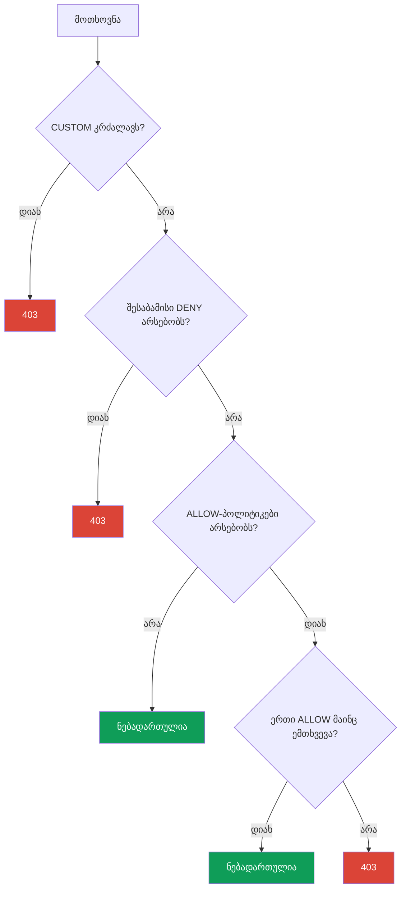

[Русская версия](ru.md) · [Eng version](en.md) · [Versión en español](es.md) · [Version française](fr.md) · [Deutsche Version](de.md) · [繁體中文版](tw.md) · [日本語版](jp.md)

# თავი 14. AuthorizationPolicy: service-to-service ავტორიზაცია

> **რა იქნება შემდეგ.** მე-13 თავში ჩვენ ჩავრთეთ mTLS: ახლა ტრაფიკი დაშიფრულია და ვიცით,
> ვინ არის კავშირის მეორე მხარეს. მაგრამ mTLS არ ზღუდავს, რისი გაკეთების უფლება აქვს
> ამ მხარეს. ამას `AuthorizationPolicy` უზრუნველყოფს - ის პასუხობს კითხვას:
> „ვის, სად და რა გზით შეუძლია მიმართვა“. ეს Istio-ს უსაფრთხოების მეორე საყრდენია.

## 14.1. რატომ გვჭირდება ავტორიზაცია

გავიხსენოთ წინა თავის დასასრული. ჩავრთეთ `STRICT` mTLS - სერვის `payments`-მდე
ვალიდური mesh-იდენტობის გარეშე ვეღარავინ მიაღწევს. მაგრამ mesh-ის შიგნით ნებისმიერ
სერვისს, რომელსაც თავისი სერტიფიკატი აქვს, კვლავ შეუძლია `payments`-ს მიმართოს. ჩვენ კი
გვინდა უფრო ზუსტად ვთქვათ: „payments-ს მხოლოდ frontend-იდან და მხოლოდ GET მეთოდით
შეიძლება მიმართონ“.

სწორედ ეს არის ავტორიზაცია. mTLS-მა მოგვცა შემოწმებული იდენტობა (ვინ არის ეს), ხოლო
`AuthorizationPolicy` ამ იდენტობას იყენებს იმის გადასაწყვეტად, რა არის ამ კლიენტისთვის
ნებადართული.

## 14.2. AuthorizationPolicy-ს სტრუქტურა

რესურსს სამი მთავარი ნაწილი აქვს:

```yaml
apiVersion: security.istio.io/v1
kind: AuthorizationPolicy
metadata:
  name: payments-policy
  namespace: app
spec:
  selector:               # რომელ pod-ებზე გამოიყენება
    matchLabels:
      app: payments
  action: ALLOW           # რა ვქნათ: ALLOW / DENY / CUSTOM / AUDIT
  rules:                  # რა პირობებში
  - from:
    - source:
        principals: ["cluster.local/ns/app/sa/frontend"]
    to:
    - operation:
        methods: ["GET"]
```

- **`selector`** - რომელ პოდებზე მოქმედებს პოლიტიკა (აქ `payments`). selector-ის გარეშე -
  მთელ namespace-ზე.
- **`action`** - რა უნდა გაკეთდეს შესაბამის მოთხოვნებზე.
- **`rules`** - პირობები: ვინ (`from`), სად და როგორ (`to`), რა გარემოებებში
  (`when`).

## 14.3. Default-deny: ვკეტავთ ყველაფერს

Zero Trust-ის პრინციპი: ჯერ ყველაფერი ავკრძალოთ, შემდეგ კი საჭირო წვდომა წერტილოვნად
დავუშვათ. Istio-ში „ყველაფრის აკრძალვის“ კანონიკური გზა მოულოდნელად გამოიყურება - ეს არის
`ALLOW`-პოლიტიკა **არცერთი წესის გარეშე**:

```yaml
apiVersion: security.istio.io/v1
kind: AuthorizationPolicy
metadata:
  name: payments-deny-all
  namespace: app
spec:
  selector:
    matchLabels:
      app: payments
  action: ALLOW
  # rules არ არის => არცერთი მოთხოვნა არ ერგება => ყველაფერი აკრძალულია (403)
```

ლოგიკა ასეთია: როგორც კი პოდზე ერთი `ALLOW`-პოლიტიკა მაინც გავრცელდება, მოქმედებს წესი:
„ნებადართულია მხოლოდ ის, რაც `rules`-ში პირდაპირ არის ჩამოთვლილი“. წესები არ არის -
შესაბამისად, არცერთი მოთხოვნა არ ემთხვევა და ყველა მათგანი `403` პასუხს იღებს.

ხშირად default-deny-ს მთელ namespace-ზე (ან თუნდაც მთელ mesh-ზე, `istio-system`-ში
პოლიტიკის საშუალებით) ქმნიან, შემდეგ კი წერტილოვან ნებართვებს ამატებენ.

## 14.4. წერტილოვანი ნებართვა: from, to, when

ახლა ზუსტად ის გავხსნათ, რაც გვჭირდება. ვამატებთ მეორე პოლიტიკას, რომელიც `payments`-ზე
წვდომას მხოლოდ `frontend`-იდან და მხოლოდ `GET` მეთოდით უშვებს:

```yaml
spec:
  selector:
    matchLabels:
      app: payments
  action: ALLOW
  rules:
  - from:
    - source:
        principals: ["cluster.local/ns/app/sa/frontend"]  # ვინ
    to:
    - operation:
        methods: ["GET"]                                   # რის გაკეთება შეიძლება
        paths: ["/api/*"]                                  # რომელ გზებზე
    when:
    - key: request.headers[x-env]                          # დამატ. პირობა
      values: ["prod"]
```

წესის სამი ბლოკი:

- **`from`** - მოთხოვნის წყარო. უმეტესად ეს არის `principals` (მე-13 თავის
  SPIFFE-იდენტობა), თუმცა შეიძლება იყოს `namespaces` ან `ipBlocks`.
- **`to`** - რისი გაკეთება შეიძლება: HTTP-მეთოდები (`methods`), გზები (`paths`), პორტები.
- **`when`** - დამატებითი პირობები: სათაურები, JWT-claims და მოთხოვნის სხვა ატრიბუტები.

`action: ALLOW`-ის მქონე პოლიტიკები OR პრინციპით ერთიანდება: მოთხოვნა გაივლის, თუ მას
**ერთი მაინც** ALLOW-პოლიტიკა უშვებს. ანუ default-deny და ეს ნებართვა ერთად ნიშნავს:
„payments-ს შეიძლება მიმართონ მხოლოდ frontend-იდან, მხოლოდ GET-ით, მხოლოდ /api/* გზაზე
და მხოლოდ prod გარემოში“.

## 14.5. უარყოფები, when პირობები და მოქმედების არე

კიდევ რამდენიმე მნიშვნელოვანი შესაძლებლობა, რომლებიც პრაქტიკაში ხშირად გვჭირდება.

**უარყოფები.** ველების უმეტესობას აქვს `not-` ფორმა: `notPrincipals`, `notNamespaces`,
`notMethods`, `notPaths`, `notPorts`. წესი ამოქმედდება, თუ მოთხოვნის ატრიბუტი ჩამონათვალში
**არ** შედის. მაგალითად, „დავუშვათ ყველაფერი DELETE მეთოდის გარდა“:

```yaml
  rules:
  - to:
    - operation:
        notMethods: ["DELETE"]
```

**`when` გასაღებები.** `when` ბლოკი მოთხოვნის ნებისმიერ ატრიბუტს ამთხვევს. ყველაზე
სასარგებლო გასაღებებია:

- `request.auth.claims[<claim>]` - claim შემოწმებული JWT-დან (თავი 15);
- `request.headers[<name>]` - HTTP-სათაური;
- `source.namespace` / `source.principal` - საიდან მოვიდა მოთხოვნა;
- `destination.port` - რომელ პორტზე;
- `remote.ip` - კლიენტის რეალური IP (edge-ის შესახებ იხ. 14.10).

**მოქმედების არე.** ისევე, როგორც `PeerAuthentication`-ის შემთხვევაში (თავი 13), დონე
განისაზღვრება namespace-ითა და `selector`-ის არსებობით:

- **მთელი mesh** - პოლიტიკა root namespace-ში (`istio-system`);
- **namespace** - პოლიტიკა `selector`-ის გარეშე საჭირო namespace-ში;
- **კონკრეტული პოდები** - პოლიტიკა `selector.matchLabels`-ით.

ეს საშუალებას გვაძლევს, მაგალითად, `istio-system`-ში მთელი mesh-ისთვის ერთი default-deny
შევქმნათ, ხოლო წერტილოვანი ნებართვები შესაბამის namespace-ებში, სერვისების გვერდით
შევინახოთ.

## 14.6. მოქმედებები: ALLOW, DENY, CUSTOM, AUDIT

`action` ველს ოთხი მნიშვნელობა აქვს:

| მოქმედება | რას აკეთებს |
|----------|-----------|
| `ALLOW` | შესაბამის მოთხოვნებს უშვებს (ყველაზე ხშირი ვარიანტი) |
| `DENY` | შესაბამის მოთხოვნებს პირდაპირ კრძალავს |
| `CUSTOM` | გადაწყვეტილებას ავტორიზაციის გარე სერვისს გადასცემს |
| `AUDIT` | მხოლოდ დამთხვევას აღრიცხავს, გადაწყვეტილებაზე გავლენის გარეშე |

`ALLOW` გამოიყენება მოდელისთვის „ვუშვებთ საჭიროს“. `DENY` მოსახერხებელია რაიმე
კონკრეტულის პირდაპირ დასაკეტად (მაგალითად, DELETE მეთოდის ყველგან აკრძალვა). `CUSTOM` -
გარე ავტორიზაციისთვის (მაგალითად, OPA-ს ან საკუთარი სერვისის საშუალებით). `AUDIT` -
იმის სანახავად, რა ამოქმედდებოდა, ისე, რომ ჯერ არაფერი დაიბლოკოს.

პირდაპირი `DENY`-ს მაგალითი - `payments`-თან `DELETE` მეთოდის აკრძალვა ყველასთვის,
სხვა ALLOW-პოლიტიკების მიუხედავად (14.7-დან შეგახსენებთ: `DENY` მოწმდება `ALLOW`-მდე):

```yaml
apiVersion: security.istio.io/v1
kind: AuthorizationPolicy
metadata:
  name: payments-deny-delete
  namespace: app
spec:
  selector:
    matchLabels:
      app: payments
  action: DENY
  rules:
  - to:
    - operation:
        methods: ["DELETE"]     # ნებისმიერი DELETE payments-ზე -> 403, რასაც არ უნდა უშვებდეს ALLOW
```

## 14.7. პოლიტიკების შეფასების თანმიმდევრობა

როდესაც პოდზე რამდენიმე პოლიტიკა ვრცელდება, Istio მათ მკაცრი თანმიმდევრობით აფასებს.
ეს ხშირად იწვევს დაბნეულობას, ამიტომ დაიმახსოვრეთ თანმიმდევრობა:



სიტყვიერად:

1. ჯერ `CUSTOM`-პოლიტიკები მოწმდება. თუ გარე authz-მა თქვა „არა“ - აკრძალვა.
2. შემდეგ `DENY`-პოლიტიკები. თუ მოთხოვნა რომელიმე მათგანს ემთხვევა - აკრძალვა.
3. შემდეგ `ALLOW`. თუ ALLOW-პოლიტიკები **საერთოდ არ არის** - მოთხოვნა ნებადართულია
   (ეს არის ნაგულისხმევი ქცევა პოლიტიკების გარეშე). თუ ALLOW-პოლიტიკები **არსებობს**,
   მოთხოვნა ერთ მათგანს მაინც უნდა დაემთხვეს, წინააღმდეგ შემთხვევაში აიკრძალება.

აქედან მოდის 14.3 ნაწილის default-deny-ს „მაგია“: ცარიელი ALLOW-პოლიტიკის არსებობა პოდს
გადაჰყავს რეჟიმში „ნებადართულია მხოლოდ პირდაპირ ჩამოთვლილი“, ჩამოსათვლელი კი არაფერია -
შესაბამისად, ყველაფერი აკრძალულია.

## 14.8. კავშირი mTLS-თან

მნიშვნელოვანი დეტალი, რომლის გამოტოვებაც ადვილია. `from.source.principals` წესი კლიენტის
SPIFFE-იდენტობას ამოწმებს. მაგრამ საიდან იცის Istio-მ ეს იდენტობა? mTLS-სერტიფიკატიდან,
რომელიც კლიენტმა კავშირის დამყარებისას წარადგინა (თავი 13).

ეს ნიშნავს, რომ mTLS-ის გარეშე `principals`-ზე დაფუძნებული წესი საიმედოდ ვერ იმუშავებს:
თუ ტრაფიკი plaintext-ით მიდის, Istio-ს გამომგზავნის შემოწმებული იდენტობა არ აქვს. ამიტომ
იდენტობაზე დაფუძნებული ავტორიზაცია და mTLS ყოველთვის ერთად გამოიყენება: ჯერ
`PeerAuthentication` (STRICT mTLS) იძლევა გარანტიას, რომ იდენტობა ნამდვილია, შემდეგ კი
`AuthorizationPolicy` ამ იდენტობის საფუძველზე წყვეტს, რა არის ნებადართული.

თუ წესებს მხოლოდ `namespaces`-ის ან `ipBlocks`-ის მიხედვით წერთ და არა `principals`-ის
მიხედვით, მაშინ ფორმალურად mTLS აუცილებელი არ არის - თუმცა ასეთი წესები უფრო სუსტია,
რადგან IP-ისა და namespace-ის გაყალბება კრიპტოგრაფიულ იდენტობასთან შედარებით მარტივია.

## 14.9. AuthorizationPolicy და NetworkPolicy: დაცვის შრეები

CKA-ს შემდეგ ინჟინერმა მაშინვე უნდა დასვას კითხვა: რით განსხვავდება ეს უკვე ნაცნობი
`NetworkPolicy`-სგან? ორივე რესურსი ზღუდავს წვდომას, მაგრამ სხვადასხვა დონეზე მუშაობს და
ერთმანეთს ავსებს.

**NetworkPolicy** (Kubernetes) L3/L4 დონეზე მუშაობს: IP-ების, პორტებისა და ჭდეების
მიხედვით პოდებს შორის **ქსელურ კავშირებს** უშვებს ან კრძალავს. მას ქსელის დონეზე
(ფაქტობრივად ბირთვში) CNI-პლაგინი იყენებს, ჯერ კიდევ მანამდე, სანამ ტრაფიკი აპლიკაციამდე
ან Envoy-მდე მივა.

**AuthorizationPolicy** (Istio) L7 დონეზე მუშაობს: ამოწმებს კრიპტოგრაფიულ იდენტობას
(SPIFFE), HTTP-მეთოდს, გზას, სათაურებს. მას Envoy-sidecar იყენებს.

| | NetworkPolicy | AuthorizationPolicy |
|---|---------------|---------------------|
| დონე | L3/L4 (IP, პორტი) | L7 (identity, მეთოდი, გზა) |
| ვინ იყენებს | CNI (ქსელის/ბირთვის დონე) | Envoy sidecar |
| რას აკონტროლებს | შეუძლია თუ არა პოდს საერთოდ დაკავშირება | კონკრეტულად რისი გაკეთება შეუძლია კლიენტს |
| ხედავს identity-ს | არა, მხოლოდ IP-სა და პოდების ჭდეებს | დიახ, SPIFFE-იდენტობას |
| ხედავს HTTP-ს | არა | დიახ (მეთოდი, გზა, სათაურები) |
| სჭირდება თუ არა mesh | არა | დიახ (sidecar ან ztunnel) |

მთავარი აზრი: ეს არ არის „ან - ან“, არამედ **დაცვის ორი შრე (defense in depth)**.

- NetworkPolicy არასასურველ კავშირებს ქსელის დონეზე კვეთს. ის მაშინაც მუშაობს, თუ პოდს
  sidecar არ აქვს, და კომპრომეტირებული აპლიკაციიდან მისი გვერდის ავლა შეუძლებელია, რადგან
  წესები ბირთვშია და არა კონტეინერში.
- AuthorizationPolicy ამატებს იმას, რისი გაკეთებაც NetworkPolicy-ს პრინციპულად არ
  შეუძლია: წესებს სერვისის შემოწმებული იდენტობისა და HTTP-მოთხოვნის დეტალების მიხედვით.

**ერთობლივი გამოყენების Best practices:**

- შექმენით **default-deny ორივე დონეზე**: საბაზისო NetworkPolicy, რომელიც namespace-ში
  ზედმეტ კავშირებს კრძალავს, და დამატებით default-deny AuthorizationPolicy.
- NetworkPolicy გამოიყენეთ უხეში სეგმენტაციისთვის: რომელ namespace-ებსა და პოდებს
  შეუძლიათ საერთოდ ქსელით ურთიერთობა (მათ შორის non-mesh ტრაფიკი და control plane-ზე
  წვდომა).
- AuthorizationPolicy გამოიყენეთ დეტალური წესებისთვის: ვის (identity-ის მიხედვით),
  რომელი მეთოდებითა და რომელი გზებით შეუძლია სერვისთან მიმართვა.
- მხოლოდ AuthorizationPolicy-ს ნუ დაეყრდნობით: ის პოდის შიგნით Envoy-ში გამოიყენება.
  NetworkPolicy დამოუკიდებელი ქსელური ზღუდეა, რომელიც რჩება მაშინაც, თუ sidecar-ს რამე
  პრობლემა შეექმნა.

შედეგი: NetworkPolicy პასუხობს კითხვას „ვისთან შეუძლია ვინმეს ქსელით დაკავშირება“,
AuthorizationPolicy კი - „კონკრეტულად რისი გაკეთება შეუძლია ამ სერვისს აპლიკაციის დონეზე“.
ერთად ისინი სრულფასოვან მრავალდონიან დაცვას გვაძლევს.

### არსებობს კიდევ L7 NetworkPolicy (Cilium)

სურათი უფრო რთულია, ვიდრე „NetworkPolicy = L4, Istio = L7“. Kubernetes-ის სტანდარტული
NetworkPolicy მართლაც მხოლოდ L3/L4 დონეზე მუშაობს. მაგრამ ზოგიერთ CNI-ს მეტი შეუძლია.
ყველაზე თვალსაჩინო მაგალითია **Cilium**: eBPF-ის საფუძველზე ის გვთავაზობს **L7-aware
ქსელურ პოლიტიკებს**, რომლებსაც HTTP-მეთოდებისა და გზების, gRPC-ის, Kafka-სა და
DNS-მოთხოვნების ფილტრაცია შეუძლია. ანუ L7-წესების ნაწილის განხორციელება CNI-ის დონეზეც,
Istio-ს გარეშე შეიძლება.

ჩნდება აშკარა კითხვა: თუ L7 ორივეს, Cilium-საც და Istio-საც შეუძლია, რატომ გვჭირდება
ორივე და როგორ შევათავსოთ ისინი? განვიხილოთ.

- **identity-ის განსხვავებული მოდელები.** Istio ავტორიზაციას mTLS-სერტიფიკატიდან მიღებული
  SPIFFE-იდენტობით ახორციელებს. Cilium identity-ის საკუთარ მოდელს იყენებს, რომელიც პოდების
  ჭდეებს ეფუძნება (eBPF-ის საშუალებით), ხოლო mTLS მისთვის ცალკე პარამეტრია. ეს „ვინ არის“
  კითხვაზე პასუხის ფუნდამენტურად განსხვავებული მიდგომებია.
- **გამოყენების განსხვავებული წერტილები.** Cilium წესებს ბირთვში (eBPF) და ჩაშენებულ
  per-node Envoy-ში იყენებს. Istio - sidecar-ში ან waypoint-ში. თუ L7 ორივეგან ჩაირთვება,
  ტრაფიკი ორ L7-ანალიზს გაივლის, რაც დაყოვნებასა და გამართვის სირთულეს ზრდის.

**ღირს თუ არა მათი ერთად გამოყენება.** ზოგადი რეკომენდაციაა, **არ დაადუბლიროთ L7-წესები
ორ სისტემაში**. პრაქტიკული ვარიანტებია:

- **Cilium L3/L4-ისთვის + Istio L7-ისთვის.** ყველაზე გავრცელებული და ჯანსაღი ვარიანტი:
  Cilium, როგორც CNI, პასუხისმგებელია სწრაფ ქსელურ სეგმენტაციაზე (L3/L4) და შესაძლოა
  DNS-პოლიტიკებზე, Istio კი მთლიანად იღებს L7-ს: mTLS-ს, identity-ზე დაფუძნებულ
  ავტორიზაციასა და ტრაფიკის მართვას. სწორედ ეს არის Istio-ს ambient-რეჟიმთან ხშირად
  გამოყენებული კომბინაცია.
- **მხოლოდ Cilium (მისი L7-ით)** Istio-ს გარეშე - გონივრულია, თუ CNI-ის L7-ფილტრაცია
  საკმარისია და სრულფასოვანი mesh (ტრაფიკის მართვა, სარკისებრი გადამისამართება, მდიდარი
  observability) არ გჭირდებათ.
- **მხოლოდ Istio** - თუ mesh უკვე არსებობს, ლოგიკურია L7-პოლიტიკები მასში შეინახოთ, CNI-სგან
  კი მხოლოდ L3/L4 მიიღოთ.

რას უნდა ავარიდოთ თავი: გადამკვეთი L7-წესების ერთდროულად Cilium-სა და Istio-ში წერას.
ეს არის გაორმაგებული overhead, სიმართლის ორი წყარო და ძალიან რთული გამართვა, როდესაც
მოთხოვნა „აუხსნელად“ იღებს 403-ს. L7-ისთვის ერთი შრე აირჩიეთ და წესები იქ შეინახეთ.

## 14.10. ავტორიზაცია ingress gateway-ზე (edge) და IP-ის ხაფანგი

`AuthorizationPolicy` არა მხოლოდ mesh-ის შიგნით არსებულ სერვისებზე, არამედ უშუალოდ
**ingress gateway**-ზეც ვრცელდება - რათა ტრაფიკი შესვლისთანავე გაიფილტროს (მაგალითად,
ადმინისტრაციულ პანელზე წვდომა მხოლოდ ოფისის ქსელიდან იყოს შესაძლებელი). ასეთი პოლიტიკა
gateway-ის namespace-ში (`istio-system`) თავსდება და gateway-ის პოდებზე `selector` აქვს:

```yaml
apiVersion: security.istio.io/v1
kind: AuthorizationPolicy
metadata:
  name: ingress-allow-office
  namespace: istio-system
spec:
  selector:
    matchLabels:
      istio: ingressgateway
  action: ALLOW
  rules:
  - from:
    - source:
        remoteIpBlocks: ["203.0.113.0/24"]   # კლიენტის რეალური IP
    to:
    - operation:
        hosts: ["admin.example.com"]
```

**IP-ის ხაფანგი - `ipBlocks` vs `remoteIpBlocks`.** ამის გამო IP allowlist ხშირად ფუჭდება,
განსაკუთრებით load balancer-ის უკან:

- **`ipBlocks`** - **კავშირის წყაროს** IP, როგორც მას Envoy ხედავს. load balancer-ის უკან
  ეს თავად LB-ის/პროქსის IP იქნება და არა კლიენტის. მისი მიხედვით კლიენტის გაფილტვრა
  უსარგებლოა.
- **`remoteIpBlocks`** - **კლიენტის რეალური IP**, რომელსაც Istio `X-Forwarded-For`
  სათაურიდან, სანდო პროქსების რაოდენობის გათვალისწინებით განსაზღვრავს. კლიენტის მისამართის
  allowlist-ისთვის სწორედ ეს არის საჭირო.

მაგრამ **კლიენტის სწორი IP-ის მიღების გზა load balancer-ის ტიპზეა დამოკიდებული**, AWS-ში
კი ორი შემთხვევა გვაქვს.

**ALB (L7).** ALB თავად ამატებს `X-Forwarded-For`-ს კლიენტის რეალური IP-ით. საკმარისია
MeshConfig-ში `numTrustedProxies`-ის საშუალებით Istio-ს ავუხსნათ, რამდენი სანდო პროქსია
gateway-ის წინ:

```yaml
apiVersion: install.istio.io/v1alpha1
kind: IstioOperator
spec:
  meshConfig:
    defaultConfig:
      gatewayTopology:
        numTrustedProxies: 1     # 1 სანდო proxy (ALB) ingress gateway-ის წინ
```

**NLB (L4).** მთავარი მომენტი: **NLB L4 დონეზე მუშაობს და `X-Forwarded-For`-ს არ ამატებს** -
მას HTTP-სათაურის „ხელმოწერა“ არ შეუძლია, რადგან TCP-სთან მუშაობს. ამიტომ მხოლოდ
`numTrustedProxies` აქ ვერ დაგვეხმარება: XFF-ს წარმოქმნის წყარო უბრალოდ არ არსებობს.
NLB-ის უკან კლიენტის IP-ს **Proxy Protocol v2**-ის საშუალებით ინარჩუნებენ. სამი რამ არის
საჭირო:

1. **Proxy Protocol-ის ჩართვა NLB-ზე** - ingress gateway-ის Service-ზე ანოტაციით:

   ```yaml
   serviceAnnotations:
     service.beta.kubernetes.io/aws-load-balancer-type: external
     service.beta.kubernetes.io/aws-load-balancer-proxy-protocol: "*"   # PROXY v2
   ```

2. **ingress gateway-სთვის Proxy Protocol-ის გარჩევის სწავლება** - listener-ფილტრით,
   EnvoyFilter-ის საშუალებით:

   ```yaml
   apiVersion: networking.istio.io/v1alpha3
   kind: EnvoyFilter
   metadata:
     name: ingress-proxy-protocol
     namespace: istio-system
   spec:
     selector:
       matchLabels:
         istio: ingressgateway
     configPatches:
     - applyTo: LISTENER
       patch:
         operation: MERGE
         value:
           listener_filters:
           - name: envoy.filters.listener.proxy_protocol
   ```

3. **Istio-სთვის მითითება, რომ Proxy Protocol-ის წყარო რეალურ კლიენტად მიიჩნიოს** -
   `gatewayTopology`-ის საშუალებით:

   ```yaml
   apiVersion: install.istio.io/v1alpha1
   kind: IstioOperator
   spec:
     meshConfig:
       defaultConfig:
         gatewayTopology:
           proxyProtocol: {}      # კლიენტის IP-ის აღება PROXY-სათაურიდან
   ```

ამის შემდეგ კლიენტის რეალური IP ხელმისაწვდომია და `AuthorizationPolicy`-ში
`remoteIpBlocks` / `remote.ip` სწორად მუშაობს. Proxy Protocol-ის გარეშე ალტერნატივაა NLB-ის
`instance`-target-ები `externalTrafficPolicy: Local`-ით, მაგრამ ეს ბალანსირებასა და
health-check-ებს ცვლის, ამიტომ mesh-ში, ჩვეულებრივ, სწორედ Proxy Protocol-ს იყენებენ.

მოკლედ: კლიენტის IP-ის allowlist-ისთვის გამოიყენეთ **`remoteIpBlocks`**, ხოლო კლიენტის IP
კარიბჭემდე მიიტანეთ - **ALB**-ის შემთხვევაში `numTrustedProxies`-ის საშუალებით (XFF
არსებობს), **NLB**-ის შემთხვევაში კი **Proxy Protocol v2**-ის საშუალებით (XFF არ არის).
load balancer-ის უკან არასოდეს დაეყრდნოთ `ipBlocks`-ს.

## 14.11. შემოწმება და გამართვა

ავტორიზაციის უარი ერთმნიშვნელოვნად გამოიყურება: HTTP **`403`** ტექსტით **`RBAC: access
denied`**. თუ ასეთ პასუხს ხედავთ, ის სერვისმა კი არა, თქვენი პოლიტიკის საფუძველზე Envoy-მ
დააბრუნა.

გამართვისას სასარგებლოა:

- სამიზნის **sidecar-ის ლოგები** უარის მიზეზს აჩვენებს:

  ```bash
  kubectl logs <pod> -c istio-proxy -n app | grep -i rbac
  # ვეძებთ rbac_access_denied_matched_policy - რომელი პოლიტიკა ამოქმედდა
  ```

- **დროებითი `AUDIT` DENY/ALLOW-ის ნაცვლად** - შეამოწმეთ, ემთხვევა თუ არა პოლიტიკა საჭირო
  მოთხოვნებს მათი დაბლოკვის გარეშე (დამთხვევები ლოგში იწერება).
- **პოდის `istioctl` აღწერა** აჩვენებს, რომელი პოლიტიკები ვრცელდება მასზე:

  ```bash
  istioctl x describe pod <pod> -n app
  ```

„აუხსნელი 403“-ის ხშირი მიზეზებია: დაგავიწყდათ, რომ სადღაც default-deny არსებობს;
`principals`-ზე დაფუძნებული წესი არ მუშაობს, რადგან STRICT mTLS არ არის (14.8); edge-ზე
`remoteIpBlocks`-ის ნაცვლად `ipBlocks`-ით ფილტრავთ (14.10).

## 14.12. Best practices

- **Default-deny, როგორც საფუძველი.** დაიწყეთ ყველაფრის აკრძალვით (ცარიელი `ALLOW`
  namespace-ზე/mesh-ზე) და დაამატეთ წერტილოვანი ნებართვები - სწორედ ეს არის Zero Trust.
- **წესები `principals`-ის და არა IP-ის მიხედვით.** mTLS-იდან მიღებული კრიპტოიდენტობა
  IP-ზე/namespace-ზე საიმედოა; იდენტობის მიხედვით ფილტრაცია ძირითადად გამოიყენეთ (და mTLS
  `STRICT` რეჟიმში შეინარჩუნეთ, იხ. 14.8).
- **`DENY` პირდაპირი აკრძალვებისთვის.** სახიფათო ოპერაციები (მაგალითად, `DELETE`,
  ადმინისტრაციული გზები) ცალკე `DENY`-პოლიტიკით დაკეტეთ - ის ნებისმიერ `ALLOW`-ზე ადრე
  ამოქმედდება.
- **edge-ზე - `remoteIpBlocks` + ნდობა XFF-ის მიმართ.** კლიენტის IP-ის allowlist-ისთვის
  `ipBlocks`-ში არ აგერიოთ (14.10).
- **Least privilege.** დაუშვით მინიმუმი: კონკრეტული მეთოდები, გზები და წყაროები, და არა
  „ყველაფერი ამ namespace-იდან“.
- **შეამოწმეთ პოლიტიკები** (14.11): ჩართვამდე `AUDIT`, `rbac` ლოგები,
  `istioctl x describe` - ნუ დაეყრდნობით აზრს, რომ „რაკი წესი დაწერილია, მუშაობს კიდეც“.
- **დაცვის ორი შრე.** AuthorizationPolicy შეავსეთ ქსელური default-deny-ით NetworkPolicy-ს
  საშუალებით (14.9) - sidecar-თან პრობლემების შემთხვევისთვის.

## 14.13. თავის შეჯამება

- `AuthorizationPolicy` პასუხობს კითხვას „რა არის ნებადართული ამ კლიენტისთვის“ და mTLS-ის
  იდენტობას იყენებს.
- სტრუქტურა: `selector` (რომელი პოდებისთვის), `action` (რა უნდა გაკეთდეს), `rules`
  (პირობები: `from`, `to`, `when`).
- **Default-deny** არის `ALLOW`-პოლიტიკა წესების გარეშე: ის პოდს გადაჰყავს რეჟიმში „მხოლოდ
  პირდაპირ ნებადართული“, ხოლო რადგან წესები არ არის - ყველაფერი აკრძალულია.
- წერტილოვანი ნებართვები განისაზღვრება `from`-ით (ვინ, ჩვეულებრივ `principals`), `to`-თი
  (მეთოდები, გზები), `when`-ით (დამატებითი პირობები); ALLOW-პოლიტიკები OR პრინციპით
  ერთიანდება.
- მოქმედებები: `ALLOW`, `DENY`, `CUSTOM` (გარე authz), `AUDIT` (მხოლოდ ლოგირება).
- შეფასების თანმიმდევრობა: CUSTOM, შემდეგ DENY, შემდეგ ALLOW.
- `principals`-ზე დაფუძნებული ავტორიზაცია mTLS-იდენტობის ზედა შრედ მუშაობს, ამიტომ
  PeerAuthentication-თან ერთად გამოიყენება.
- AuthorizationPolicy (L7, Envoy) და NetworkPolicy (L3/L4, CNI) ერთმანეთს ავსებს; best
  practice არის defense in depth: default-deny ორივე დონეზე.
- ზოგიერთ CNI-ს (Cilium) L7-პოლიტიკებიც შეუძლია; ზედმეტი სირთულის თავიდან ასაცილებლად L7
  ერთ სისტემაში უნდა დარჩეს - ხშირი არჩევანია Cilium L3/L4-ისთვის, Istio კი L7-ისთვის.
- არსებობს უარყოფები (`notMethods`, `notPaths`…), მოქნილი `when` (JWT-claims, სათაურები,
  პორტი, `remote.ip`) და მოქმედების დონეები (mesh/namespace/პოდები) - ისევე, როგორც
  PeerAuthentication-ში.
- **ingress gateway**-ზე კლიენტის IP-ის allowlist-ისთვის გამოიყენება
  **`remoteIpBlocks`** და არა `ipBlocks` (კავშირის IP = LB-ის IP). კლიენტის IP gateway-მდე
  მიაქვთ: **ALB**-ის უკან `numTrustedProxies`-ის საშუალებით (XFF არსებობს), **NLB**-ის უკან
  კი (L4, XFF არ არის) **Proxy Protocol v2**-ის საშუალებით.
- უარი = `403 RBAC: access denied`; გამართვისთვის გამოიყენება Envoy-ს ლოგები
  (`rbac_access_denied`), დროებითი `AUDIT` და `istioctl x describe`.

## 14.14. თვითშემოწმების კითხვები

1. რით განსხვავდება AuthorizationPolicy-ს ამოცანა mTLS/PeerAuthentication-ის ამოცანისგან?
2. რატომ კრძალავს ყველაფერს `ALLOW`-პოლიტიკა წესების გარეშე?
3. რაზეა პასუხისმგებელი `from`, `to` და `when` ბლოკები?
4. რა თანმიმდევრობით აფასებს Istio CUSTOM, DENY და ALLOW მოქმედებებს?
5. რატომ მოითხოვს `principals`-ზე დაფუძნებული წესი mTLS-ს, ხოლო `namespaces`-ზე
   დაფუძნებული წესი ფორმალურად - არა?
6. რით განსხვავდება NetworkPolicy AuthorizationPolicy-სგან და რატომ ღირს მათი ერთად
   გამოყენება?
7. რა განსხვავებაა ingress gateway-ზე `ipBlocks`-სა და `remoteIpBlocks`-ს შორის? როგორ
   მივიტანოთ კლიენტის რეალური IP gateway-მდე **ALB**-ისა და **NLB**-ის უკან (და რატომ არ
   გამოდგება XFF NLB-სთვის)?
8. როგორ გამოიყურება ავტორიზაციის უარი და როგორ გავარკვიოთ, რომელმა პოლიტიკამ გამოიწვია ის?
9. როგორ შევქმნათ სახიფათო ოპერაციის (მაგალითად, DELETE-ის) პირდაპირი აკრძალვა
   ALLOW-წესებისგან დამოუკიდებლად?

## პრაქტიკა

ივარჯიშეთ default-deny-სა და წერტილოვან ნებართვაზე (მხოლოდ frontend + GET) STRICT mTLS-ის
ზედა შრედ - ეს მე-13 თავის ლაბორატორიული სამუშაოს გაგრძელებაა:

🧪 ლაბორატორიული სამუშაო 04: [tasks/ica/labs/04](../../labs/04/README_GE.MD)

---
[სარჩევი](../README_GE.md) · [თავი 13](../13/ge.md) · [თავი 15](../15/ge.md)