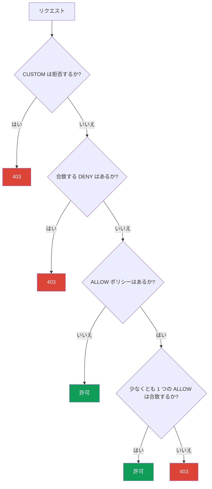

[Русская версия](ru.md) · [Eng version](en.md) · [Versión en español](es.md) · [Version française](fr.md) · [Deutsche Version](de.md) · [ქართული ვერსია](ge.md) · [繁體中文版](tw.md)

# 第14章。AuthorizationPolicy: service-to-service 認可

> **次に進む前に。** 第13章で mTLS を有効化しました。これでトラフィックは暗号化され、
> 接続の相手が誰かを把握できます。しかし mTLS は、その相手に何を行うことが許可されているかを
> 制限しません。これを担うのが `AuthorizationPolicy` です。これは「誰が、どこへ、どの方法で
> アクセスできるか」という問いに答えます。Istio セキュリティの二本目の柱です。

## 14.1. 認可が必要な理由

前章の終わりを思い出しましょう。`STRICT` mTLS を有効にしたため、`payments` サービスには
有効な mesh アイデンティティなしでは誰も到達できなくなりました。しかし、独自の証明書を持つ
mesh 内の任意のサービスは、依然として `payments` にアクセスできます。より正確には、
「payments には frontend から、かつ GET メソッドでのみアクセスできる」と指定したいのです。

これが認可です。mTLS は検証済みのアイデンティティ（誰であるか）を提供し、
`AuthorizationPolicy` はそのアイデンティティを使って、そのクライアントに何を許可するかを
判断します。

## 14.2. AuthorizationPolicy の構造

リソースには主に 3 つの部分があります。

```yaml
apiVersion: security.istio.io/v1
kind: AuthorizationPolicy
metadata:
  name: payments-policy
  namespace: app
spec:
  selector:               # どの Pod に適用されるか
    matchLabels:
      app: payments
  action: ALLOW           # 何をするか: ALLOW / DENY / CUSTOM / AUDIT
  rules:                  # どの条件で
  - from:
    - source:
        principals: ["cluster.local/ns/app/sa/frontend"]
    to:
    - operation:
        methods: ["GET"]
```

- **`selector`** - ポリシーが適用される Pod（ここでは `payments`）。selector がない場合は
  namespace 全体に適用されます。
- **`action`** - 条件に合致するリクエストに対して行う処理。
- **`rules`** - 条件: 誰が（`from`）、どこへどのように（`to`）、どのような状況で
  （`when`）。

## 14.3. Default-deny: すべてを閉じる

Zero Trust の原則は、まずすべてを拒否し、次に必要なものだけを明示的に許可することです。Istio で
「すべてを拒否」する正規の方法は意外です。それは、**ルールを一つも持たない** `ALLOW` ポリシーです。

```yaml
apiVersion: security.istio.io/v1
kind: AuthorizationPolicy
metadata:
  name: payments-deny-all
  namespace: app
spec:
  selector:
    matchLabels:
      app: payments
  action: ALLOW
  # rules がない => どのリクエストも該当しない => すべて拒否 (403)
```

ロジックはこうです。Pod に少なくとも 1 つの `ALLOW` ポリシーが適用されると、
「`rules` に明示的に列挙されたものだけが許可される」というルールが有効になります。ルールがなければ
何も合致せず、すべてのリクエストが `403` になります。

多くの場合、default-deny は namespace 全体（あるいは `istio-system` のポリシーにより mesh 全体）に
設定し、その後で限定的な許可を追加します。

## 14.4. 必要なものだけを許可: from、to、when

では必要なものだけを開放しましょう。`payments` へのアクセスを `frontend` から、かつ `GET`
メソッドにのみ許可する 2 つ目のポリシーを追加します。

```yaml
spec:
  selector:
    matchLabels:
      app: payments
  action: ALLOW
  rules:
  - from:
    - source:
        principals: ["cluster.local/ns/app/sa/frontend"]  # 誰が
    to:
    - operation:
        methods: ["GET"]                                   # 何をできるか
        paths: ["/api/*"]                                  # どのパスで
    when:
    - key: request.headers[x-env]                          # 追加条件
      values: ["prod"]
```

ルールの 3 つのブロック:

- **`from`** - リクエストの送信元。ほとんどの場合は `principals`（第13章の SPIFFE
  アイデンティティ）ですが、`namespaces` や `ipBlocks` もあります。
- **`to`** - 実行できる操作: HTTP メソッド（`methods`）、パス（`paths`）、ポート。
- **`when`** - 追加条件: ヘッダー、JWT claims、その他のリクエスト属性。

`action: ALLOW` のポリシーは OR の原則で結合されます。少なくとも 1 つの ALLOW ポリシーが
許可すれば、リクエストは通過します。したがって default-deny とこの許可を組み合わせると、
「payments には frontend から、GET でのみ、/api/* のみ、prod でのみアクセスできる」となります。

## 14.5. 否定、when 条件、スコープ

実務で頻繁に必要となる、さらに重要な機能を見ていきましょう。

**否定。** 多くのフィールドには `not-` 形式があります: `notPrincipals`、`notNamespaces`、
`notMethods`、`notPaths`、`notPorts`。リクエスト属性が列挙された値に**含まれない**場合に、
ルールは合致します。たとえば「DELETE メソッド以外のすべてを許可」:

```yaml
  rules:
  - to:
    - operation:
        notMethods: ["DELETE"]
```

**`when` キー。** `when` ブロックは任意のリクエスト属性に対してマッチします。特に有用なキーは次のとおりです。

- `request.auth.claims[<claim>]` - 検証済み JWT の claim（第15章）;
- `request.headers[<name>]` - HTTP ヘッダー;
- `source.namespace` / `source.principal` - リクエストの送信元;
- `destination.port` - 宛先ポート;
- `remote.ip` - 実際のクライアント IP（edge については 14.10 を参照）。

**適用範囲。** `PeerAuthentication`（第13章）と同じく、レベルは namespace と `selector` の有無で決まります。

- **mesh 全体** - ルート namespace（`istio-system`）内のポリシー;
- **namespace** - 対象 namespace 内で `selector` を持たないポリシー;
- **特定の Pod** - `selector.matchLabels` を持つポリシー。

これにより、たとえば `istio-system` に mesh 全体用の default-deny を 1 つ作成し、限定的な許可は
各 namespace のサービスの近くに配置できます。

## 14.6. アクション: ALLOW、DENY、CUSTOM、AUDIT

`action` フィールドには 4 つの値があります。

| アクション | 動作 |
|----------|-----------|
| `ALLOW` | 条件に合致するリクエストを許可する（最も一般的） |
| `DENY` | 条件に合致するリクエストを明示的に拒否する |
| `CUSTOM` | 判断を外部認可サービスに委譲する |
| `AUDIT` | 判断に影響せず、合致だけをログに記録する |

`ALLOW` は「必要なものを許可する」モデルに使用します。`DENY` は特定のものを明示的に閉じる
（たとえば、どこからでも DELETE メソッドを拒否する）際に便利です。`CUSTOM` は外部認可
（たとえば OPA や独自サービス経由）に、`AUDIT` はまだ何もブロックせずに、何が発生するかを
確認するために使用します。

明示的な `DENY` の例です。ほかの ALLOW ポリシーにかかわらず、すべての `payments` への `DELETE`
メソッドを拒否します（14.7 のとおり、`DENY` は `ALLOW` より先に評価されます）。

```yaml
apiVersion: security.istio.io/v1
kind: AuthorizationPolicy
metadata:
  name: payments-deny-delete
  namespace: app
spec:
  selector:
    matchLabels:
      app: payments
  action: DENY
  rules:
  - to:
    - operation:
        methods: ["DELETE"]     # payments への DELETE は ALLOW が何を許可していても 403
```

## 14.7. ポリシーの評価順序

複数のポリシーが Pod に適用される場合、Istio は厳密な順序で評価します。これはよくある混乱の
原因なので、順序を覚えておきましょう。



言葉で説明すると:

1. まず `CUSTOM` ポリシーを確認します。外部 authz が「no」と回答した場合は拒否です。
2. 次に `DENY` ポリシーです。リクエストがいずれかに合致すれば拒否されます。
3. 次に `ALLOW` です。ALLOW ポリシーが**まったくない**場合、リクエストは許可されます
   （これがポリシーなしのデフォルトです）。ALLOW ポリシーが**ある**場合、少なくとも 1 つに
   リクエストが合致しなければ、拒否されます。

ここから 14.3 の default-deny の「仕組み」が分かります。空の ALLOW ポリシーがあると、Pod は
「明示的に列挙されたものだけを許可」するモードに移行しますが、列挙されたものがないため、
すべてが拒否されます。

## 14.8. mTLS との関係

見落としやすい重要な詳細があります。`from.source.principals` ルールはクライアントの SPIFFE
アイデンティティを確認します。しかし、Istio はどこからこのアイデンティティを知るのでしょうか。
接続時にクライアントが提示した mTLS 証明書からです（第13章）。

つまり、mTLS がなければ `principals` によるルールは信頼性高く機能しません。トラフィックが
plaintext の場合、Istio には送信者の検証済みアイデンティティがありません。そのため、アイデンティティ
による認可と mTLS は常に組み合わせて使用します。最初に `PeerAuthentication`（STRICT mTLS）が
アイデンティティが本物であることを保証し、その後 `AuthorizationPolicy` がそのアイデンティティに
基づき許可する操作を決定します。

一方、`principals` ではなく `namespaces` や `ipBlocks` だけでルールを作成する場合、形式上 mTLS は
必須ではありません。しかし IP や namespace は暗号学的アイデンティティより偽装しやすいため、
このようなルールは弱くなります。

## 14.9. AuthorizationPolicy と NetworkPolicy: 防御の層

CKA の後にエンジニアがすぐ抱くべき疑問は、既知の `NetworkPolicy` と何が異なるのか、ということです。
どちらのリソースもアクセスを制限しますが、異なるレベルで機能し、相互に補完します。

**NetworkPolicy**（Kubernetes）は L3/L4 で機能します。IP、ポート、ラベルに基づき、Pod 間の**ネットワーク
接続**を許可または拒否します。CNI プラグインがネットワークレベル（実質的にはカーネル内）で適用し、
トラフィックがアプリケーションや Envoy に到達する前に処理されます。

**AuthorizationPolicy**（Istio）は L7 で機能します。暗号学的アイデンティティ（SPIFFE）、HTTP メソッド、
パス、ヘッダーを確認します。これは Envoy sidecar が適用します。

| | NetworkPolicy | AuthorizationPolicy |
|---|---------------|---------------------|
| レベル | L3/L4（IP、ポート） | L7（identity、メソッド、パス） |
| 適用者 | CNI（ネットワーク/カーネルレベル） | Envoy sidecar |
| 制御するもの | Pod がそもそも接続できるか | クライアントに許可される具体的な操作 |
| identity を認識するか | いいえ、IP と Pod ラベルのみ | はい、SPIFFE アイデンティティ |
| HTTP を認識するか | いいえ | はい（メソッド、パス、ヘッダー） |
| mesh が必要か | いいえ | はい（sidecar または ztunnel） |

重要な考え方は、これは「どちらか一方」ではなく、**2 層の防御（defense in depth）**だということです。

- NetworkPolicy はネットワークレベルで望ましくない接続を遮断します。Pod に sidecar がなくても機能し、
  ルールはコンテナ内ではなくカーネル内に存在するため、侵害されたアプリケーションからも迂回できません。
- AuthorizationPolicy は、検証済みサービスアイデンティティと HTTP リクエストの詳細に基づくルールという、
  NetworkPolicy が原理的に提供できないものを追加します。

**併用のベストプラクティス:**

- **両方のレベルで default-deny を設定**します。namespace 内の不要な接続を拒否する基本的な
  NetworkPolicy に、default-deny AuthorizationPolicy を組み合わせます。
- NetworkPolicy は粗いセグメンテーションに使用します。どの namespace と Pod がネットワーク上で
  通信できるかを定めます（non-mesh トラフィックと control plane へのアクセスも含む）。
- AuthorizationPolicy は細かなルールに使用します。誰が（identity に基づき）、どのメソッドとパスで
  サービスにアクセスできるかを定めます。
- AuthorizationPolicy だけに依存しないでください。これは Pod 内の Envoy によって適用されます。
  NetworkPolicy はネットワークレベルの独立した境界であり、sidecar に問題が起きても残ります。

要するに、NetworkPolicy は「誰が誰とネットワークで接続できるか」に答え、AuthorizationPolicy は
「アプリケーションレベルでこのサービスに何が許可されるか」に答えます。両者を組み合わせることで、
完全な多層防御が得られます。

### さらに L7 NetworkPolicy（Cilium）もある

状況は「NetworkPolicy = L4、Istio = L7」より少し複雑です。標準の Kubernetes NetworkPolicy は
確かに L3/L4 のみです。しかし、一部の CNI はより多くの機能を持ちます。特に顕著な例が **Cilium** です。
eBPF に基づき、HTTP メソッドとパス、gRPC、Kafka、DNS リクエストをフィルタリングできる、**L7 対応の
ネットワークポリシー**を提供します。つまり、Istio なしで CNI レベルでも L7 ルールの一部を実現できます。

当然の疑問が生まれます。Cilium と Istio の両方が L7 を扱えるなら、なぜ両方が必要で、どう組み合わせる
のでしょうか。見ていきましょう。

- **identity モデルの違い。** Istio は mTLS 証明書の SPIFFE アイデンティティにより認可します。
  Cilium は Pod ラベルに基づく独自の identity モデル（eBPF 経由）を使用し、mTLS は別のオプションです。
  これは「誰であるか」への根本的に異なるアプローチです。
- **適用ポイントの違い。** Cilium はカーネル内（eBPF）および組み込みの per-node Envoy でルールを
  適用します。Istio は sidecar または waypoint で適用します。両方で L7 を有効にすると、トラフィックは
  2 つの L7 解析を通過するため、レイテンシーとデバッグの複雑さが増します。

**併用すべきか。** 一般的な推奨は、**2 つのシステムで L7 ルールを重複させない**ことです。実践的な
選択肢は次のとおりです。

- **L3/L4 は Cilium、L7 は Istio。** 最も一般的で健全な選択です。Cilium は CNI として高速な
  ネットワークセグメンテーション（L3/L4）、および必要に応じて DNS ポリシーを担い、Istio が mTLS、
  identity による認可、トラフィック管理を含む L7 全体を担います。これは Istio の ambient モードで
  よく使われる組み合わせです。
- **Cilium のみ（その L7 を使用）**、Istio なし。CNI の L7 フィルタリングで十分で、完全な mesh
  （トラフィック管理、ミラーリング、豊富な observability）が不要なら妥当です。
- **Istio のみ。** すでに mesh がある場合、L7 ポリシーはそこで管理し、CNI には L3/L4 のみを
  担わせるのが合理的です。

避けるべきことは、Cilium と Istio の両方に重複する L7 ルールを同時に書くことです。これはオーバーヘッドが
二重になり、2 つの信頼できる情報源を生み、リクエストが「理由不明に」403 を受けたときのデバッグを
非常に困難にします。L7 用の層を 1 つ選び、ルールはそこに保持してください。

## 14.10. ingress gateway（edge）での認可と IP の罠

`AuthorizationPolicy` は mesh 内のサービスだけでなく、**ingress gateway 自体**にも適用します。これは
入口でトラフィックをフィルタリングするためです（たとえば、管理画面を社内ネットワークからのみ許可する）。
このようなポリシーは gateway の namespace（`istio-system`）に、gateway Pod の `selector` を指定して
作成します。

```yaml
apiVersion: security.istio.io/v1
kind: AuthorizationPolicy
metadata:
  name: ingress-allow-office
  namespace: istio-system
spec:
  selector:
    matchLabels:
      istio: ingressgateway
  action: ALLOW
  rules:
  - from:
    - source:
        remoteIpBlocks: ["203.0.113.0/24"]   # 実際のクライアント IP
    to:
    - operation:
        hosts: ["admin.example.com"]
```

**IP の罠 - `ipBlocks` と `remoteIpBlocks`。** これは特にロードバランサーの背後で、IP による
allowlist を頻繁に壊します。

- **`ipBlocks`** - Envoy から見える**接続の送信元 IP**です。ロードバランサーの背後では、これは
  クライアントではなく LB/プロキシ自体の IP です。クライアントをこれでフィルタリングしても意味がありません。
- **`remoteIpBlocks`** - Istio が信頼済みプロキシの数を考慮して `X-Forwarded-For` ヘッダーから判定する、
  **実際のクライアント IP**です。クライアントアドレスの allowlist にはこれが必要です。

しかし、**正しいクライアント IP がどこから得られるかはロードバランサーの種類に依存し**、ここで AWS は
2 つのケースに分かれます。

**ALB（L7）。** ALB は実際のクライアント IP を持つ `X-Forwarded-For` を自ら追加します。MeshConfig の
`numTrustedProxies` を通じて、gateway の前に信頼できるプロキシがいくつあるかを Istio に知らせれば十分です。

```yaml
apiVersion: install.istio.io/v1alpha1
kind: IstioOperator
spec:
  meshConfig:
    defaultConfig:
      gatewayTopology:
        numTrustedProxies: 1     # ingress gateway の前段にある信頼できるプロキシ 1 台 (ALB)
```

**NLB（L4）。** 重要な点は、**NLB は L4 で動作し、`X-Forwarded-For` を追加しない**ことです。TCP を扱うため、
HTTP ヘッダーに「署名」を追加できません。従って `numTrustedProxies` だけでは役に立ちません。XFF の
取得元がないためです。NLB の背後でクライアント IP を維持するには、**Proxy Protocol v2** を使用します。
必要なものは 3 つです。

1. **NLB で Proxy Protocol を有効にする** - ingress gateway の Service にアノテーションを設定します。

   ```yaml
   serviceAnnotations:
     service.beta.kubernetes.io/aws-load-balancer-type: external
     service.beta.kubernetes.io/aws-load-balancer-proxy-protocol: "*"   # PROXY v2
   ```

2. **ingress gateway に Proxy Protocol を解析させる** - EnvoyFilter による listener フィルターを使用します。

   ```yaml
   apiVersion: networking.istio.io/v1alpha3
   kind: EnvoyFilter
   metadata:
     name: ingress-proxy-protocol
     namespace: istio-system
   spec:
     selector:
       matchLabels:
         istio: ingressgateway
     configPatches:
     - applyTo: LISTENER
       patch:
         operation: MERGE
         value:
           listener_filters:
           - name: envoy.filters.listener.proxy_protocol
   ```

3. **Proxy Protocol の送信元を実際のクライアントとして信頼するよう Istio に指示する** - `gatewayTopology` を
   使用します。

   ```yaml
   apiVersion: install.istio.io/v1alpha1
   kind: IstioOperator
   spec:
     meshConfig:
       defaultConfig:
         gatewayTopology:
           proxyProtocol: {}      # PROXY ヘッダーからクライアント IP を取得する
   ```

これで実際のクライアント IP を利用でき、`AuthorizationPolicy` の `remoteIpBlocks` / `remote.ip` が
正しく動作します。Proxy Protocol を使用しない代替案は、`externalTrafficPolicy: Local` を持つ NLB の
`instance` ターゲットですが、負荷分散と health-check が変わるため、mesh では通常 Proxy Protocol を
使用します。

簡潔に言えば、クライアント IP の allowlist には **`remoteIpBlocks`** を使い、クライアント IP を gateway
まで届けます。**ALB** の背後では `numTrustedProxies`（XFF が存在する）を通じて、**NLB** の背後では
**Proxy Protocol v2**（XFF は存在しない）を通じて行います。ロードバランサーの背後で `ipBlocks` に
依存してはいけません。

## 14.11. 確認とデバッグ

認可拒否は明確に現れます。本文が **`RBAC: access denied`** の HTTP **`403`** です。この応答を見た場合、
返したのはサービスではなく、ポリシーに基づく Envoy です。

デバッグで役立つもの:

- **宛先 sidecar のログ**は拒否の理由を示します。

  ```bash
  kubectl logs <pod> -c istio-proxy -n app | grep -i rbac
  # rbac_access_denied_matched_policy を探す - どのポリシーが作動したか
  ```

- **DENY/ALLOW の代わりに一時的な `AUDIT`** を使用し、必要なリクエストにポリシーがマッチするかを、
  ブロックせずに確認します（マッチはログに記録されます）。
- **`istioctl` による Pod の記述**で、どのポリシーが適用されているかを確認できます。

  ```bash
  istioctl x describe pod <pod> -n app
  ```

「理由不明の 403」のよくある原因: どこかに default-deny があることを忘れている; STRICT mTLS がないため
`principals` のルールが機能しない（14.8）; edge で `remoteIpBlocks` ではなく `ipBlocks` により
フィルタリングしている（14.10）。

## 14.12. ベストプラクティス

- **default-deny を基盤にする。** すべてを拒否するところから始め（namespace/mesh の空の `ALLOW`）、
  限定的な許可を追加します。これが Zero Trust です。
- **IP ではなく `principals` によるルール。** mTLS の暗号学的アイデンティティは IP/namespace より
  信頼できます。アイデンティティによるフィルタリングを基本にし（mTLS は `STRICT` に保つ、14.8 を参照）、
  使用してください。
- **明示的な拒否には `DENY`。** 危険な操作（たとえば `DELETE`、管理パス）は個別の `DENY` ポリシーで
  閉じます。これはすべての `ALLOW` より先に機能します。
- **edge では `remoteIpBlocks` + XFF への信頼。** クライアント IP の allowlist では、`ipBlocks` と
  混同しないでください（14.10）。
- **最小権限。** 「この namespace からすべて」ではなく、特定のメソッド、パス、送信元という最小限だけを
  許可します。
- **ポリシーを確認する**（14.11）。有効化前に `AUDIT`、`rbac` ログ、`istioctl x describe` を使用します。
  「ルールを書いたから動く」とは考えないでください。
- **2 層の防御。** sidecar の問題に備え、AuthorizationPolicy を NetworkPolicy によるネットワーク
  default-deny（14.9）で補完してください。

## 14.13. 章のまとめ

- `AuthorizationPolicy` は mTLS のアイデンティティを使用し、「このクライアントに何が許可されるか」に
  答えます。
- 構造: `selector`（対象 Pod）、`action`（処理）、`rules`（条件: `from`、`to`、`when`）。
- **Default-deny** はルールを持たない `ALLOW` ポリシーです。Pod を「明示的に許可されたものだけ」モードに
  移行させ、ルールがないため、すべてが拒否されます。
- 限定的な許可は `from`（誰か、通常は `principals`）、`to`（メソッド、パス）、`when`（追加条件）で
  定義します。ALLOW ポリシーは OR で結合されます。
- アクション: `ALLOW`、`DENY`、`CUSTOM`（外部 authz）、`AUDIT`（ログのみ）。
- 評価順序: CUSTOM、次に DENY、次に ALLOW。
- `principals` による認可は mTLS アイデンティティの上で機能するため、PeerAuthentication と組み合わせて
  使用します。
- AuthorizationPolicy（L7、Envoy）と NetworkPolicy（L3/L4、CNI）は互いを補完します。ベストプラクティスは
  defense in depth、すなわち両方のレベルでの default-deny です。
- 一部の CNI（Cilium）は L7 ポリシーを扱えます。複雑さを増やさないため、L7 は 1 つのシステムで管理します。
  よくある選択は L3/L4 を Cilium、L7 を Istio に任せることです。
- 否定（`notMethods`、`notPaths`…）、柔軟な `when`（JWT claims、ヘッダー、ポート、`remote.ip`）、および
  適用レベル（mesh/namespace/Pod）は、PeerAuthentication と同様に利用できます。
- **ingress gateway** でクライアント IP の allowlist を行うには、`ipBlocks`（接続の IP = LB の IP）ではなく
  **`remoteIpBlocks`** を使用します。クライアント IP は gateway まで、**ALB** の背後では
  `numTrustedProxies`（XFF がある）を通じ、**NLB**（L4、XFF なし）の背後では **Proxy Protocol v2** を通じて
  届けます。
- 拒否 = `403 RBAC: access denied`。Envoy ログ（`rbac_access_denied`）、一時的な `AUDIT`、
  `istioctl x describe` でデバッグします。

## 14.14. 自己確認の質問

1. AuthorizationPolicy の役割は mTLS/PeerAuthentication の役割とどう異なりますか？
2. なぜルールを持たない `ALLOW` ポリシーはすべてを拒否するのですか？
3. `from`、`to`、`when` ブロックはそれぞれ何を担いますか？
4. Istio は CUSTOM、DENY、ALLOW をどの順序で評価しますか？
5. `principals` によるルールには mTLS が必要で、`namespaces` によるルールには形式上必要ないのはなぜですか？
6. NetworkPolicy は AuthorizationPolicy とどう異なり、なぜ両方を使うべきですか？
7. ingress gateway での `ipBlocks` と `remoteIpBlocks` の違いは何ですか？ **ALB** と **NLB** の背後で、
   実際のクライアント IP を gateway にどう届けますか（また、なぜ NLB では XFF が使えないのですか）？
8. 認可拒否はどのように見え、どのポリシーが原因かをどう特定しますか？
9. ALLOW ルールに関係なく、危険な操作（たとえば DELETE）を明示的に拒否するにはどうしますか？

## 演習

STRICT mTLS の上で default-deny と限定的な許可（frontend + GET のみ）を練習しましょう。第13章の
ラボの続きです。

🧪 ラボ 04: [tasks/ica/labs/04](../../labs/04/README_JP.MD)

---
[目次](../README_JP.md) · [第13章](../13/jp.md) · [第15章](../15/jp.md)
