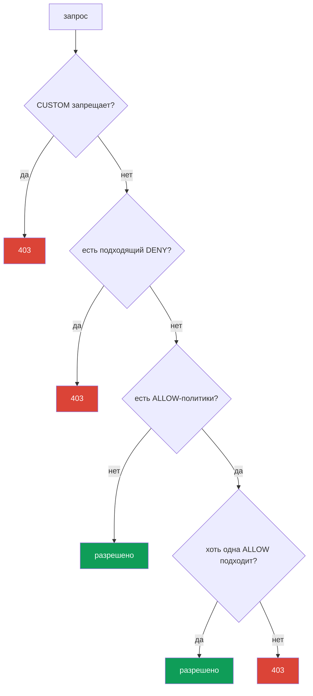

# Глава 14. AuthorizationPolicy: авторизация service-to-service

> **Что дальше.** В главе 13 мы включили mTLS: теперь трафик зашифрован, и мы знаем,
> кто на том конце соединения. Но mTLS не ограничивает, что этому собеседнику
> позволено делать. Этим занимается `AuthorizationPolicy` - она отвечает на вопрос
> «кому, куда и каким способом можно обращаться». Это второй столп безопасности Istio.

## 14.1. Зачем нужна авторизация

Вспомним конец прошлой главы. Включили `STRICT` mTLS - до сервиса `payments` больше не
дотянется никто без валидной mesh-личности. Но любой сервис внутри mesh со своим
сертификатом всё ещё может обратиться к `payments`. А хочется сказать точнее: «к
payments можно только из frontend и только методом GET».

Это и есть авторизация. mTLS дал нам проверенную личность (кто это), а
`AuthorizationPolicy` использует эту личность, чтобы решать, что этому клиенту
разрешено.

## 14.2. Структура AuthorizationPolicy

У ресурса три главные части:

```yaml
apiVersion: security.istio.io/v1
kind: AuthorizationPolicy
metadata:
  name: payments-policy
  namespace: app
spec:
  selector:               # к каким подам применяется
    matchLabels:
      app: payments
  action: ALLOW           # что делать: ALLOW / DENY / CUSTOM / AUDIT
  rules:                  # при каких условиях
  - from:
    - source:
        principals: ["cluster.local/ns/app/sa/frontend"]
    to:
    - operation:
        methods: ["GET"]
```

- **`selector`** - на какие поды действует политика (здесь `payments`). Без selector -
  на весь namespace.
- **`action`** - что делать с подходящими запросами.
- **`rules`** - условия: кто (`from`), куда и как (`to`), при каких обстоятельствах
  (`when`).

## 14.3. Default-deny: закрываем всё

Принцип Zero Trust: сначала запретить всё, потом точечно разрешить нужное. В Istio
канонический способ «запретить всё» выглядит неожиданно - это `ALLOW`-политика **без
единого правила**:

```yaml
apiVersion: security.istio.io/v1
kind: AuthorizationPolicy
metadata:
  name: payments-deny-all
  namespace: app
spec:
  selector:
    matchLabels:
      app: payments
  action: ALLOW
  # rules отсутствуют => ни один запрос не подходит => всё запрещено (403)
```

Логика такая: как только на под навешена хотя бы одна `ALLOW`-политика, действует
правило «разрешено только то, что явно перечислено в `rules`». Правил нет - значит, не
подходит ничего, и все запросы получают `403`.

Часто default-deny делают на весь namespace (или даже весь mesh через политику в
`istio-system`), а потом добавляют точечные разрешения.

## 14.4. Разрешаем точечно: from, to, when

Теперь откроем ровно то, что нужно. Добавляем вторую политику, которая разрешает доступ
к `payments` только из `frontend` и только методом `GET`:

```yaml
spec:
  selector:
    matchLabels:
      app: payments
  action: ALLOW
  rules:
  - from:
    - source:
        principals: ["cluster.local/ns/app/sa/frontend"]  # КТО
    to:
    - operation:
        methods: ["GET"]                                   # ЧТО можно делать
        paths: ["/api/*"]                                  # по каким путям
    when:
    - key: request.headers[x-env]                          # доп. условие
      values: ["prod"]
```

Три блока правила:

- **`from`** - источник запроса. Чаще всего это `principals` (SPIFFE-личность из главы
  13), но бывает и `namespaces`, и `ipBlocks`.
- **`to`** - что можно делать: HTTP-методы (`methods`), пути (`paths`), порты.
- **`when`** - дополнительные условия: заголовки, JWT-claims и другие атрибуты запроса.

Политики с `action: ALLOW` объединяются по принципу ИЛИ: запрос проходит, если его
разрешает **хотя бы одна** ALLOW-политика. То есть default-deny + это разрешение вместе
дают: «к payments можно только из frontend, только GET, только по /api/*, только в prod».

## 14.5. Действия: ALLOW, DENY, CUSTOM, AUDIT

У поля `action` четыре значения:

| Действие | Что делает |
|----------|-----------|
| `ALLOW` | разрешить подходящие запросы (самое частое) |
| `DENY` | явно запретить подходящие запросы |
| `CUSTOM` | делегировать решение внешнему сервису авторизации |
| `AUDIT` | только логировать совпадение, не влияя на решение |

`ALLOW` используют для модели «разрешаем нужное». `DENY` удобен, чтобы явно закрыть
что-то конкретное (например, запретить метод DELETE отовсюду). `CUSTOM` - для внешней
авторизации (например, через OPA или свой сервис). `AUDIT` - чтобы посмотреть, что бы
сработало, ничего пока не блокируя.

## 14.6. Порядок вычисления политик

Когда на под навешано несколько политик, Istio вычисляет их в строгом порядке. Это
частый источник путаницы, поэтому запомните последовательность:



Словами:

1. Сначала проверяются `CUSTOM`-политики. Если внешний authz сказал «нет» - запрет.
2. Потом `DENY`-политики. Если запрос подходит под любую - запрет.
3. Потом `ALLOW`. Если ALLOW-политик **нет вообще** - запрос разрешён (это дефолт без
   политик). Если ALLOW-политики **есть**, запрос должен подойти хотя бы под одну,
   иначе запрет.

Отсюда и «магия» default-deny из раздела 14.3: наличие пустой ALLOW-политики переводит
под в режим «разрешено только явно перечисленное», а перечислять нечего - значит,
запрещено всё.

## 14.7. Связь с mTLS

Важная деталь, которую легко упустить. Правило `from.source.principals` проверяет
SPIFFE-личность клиента. Но откуда Istio знает эту личность? Из mTLS-сертификата,
который клиент предъявил при соединении (глава 13).

Значит, без mTLS правило по `principals` работать надёжно не может: если трафик идёт
plaintext, у Istio нет проверенной личности отправителя. Поэтому авторизация по
личности и mTLS всегда идут в связке: сначала `PeerAuthentication` (STRICT mTLS)
гарантирует, что личность настоящая, а потом `AuthorizationPolicy` по этой личности
решает, что можно.

Если же вы пишете правила только по `namespaces` или `ipBlocks`, а не по `principals`,
то формально mTLS не обязателен - но такие правила слабее, потому что IP и namespace
подделать проще, чем криптографическую личность.

## 14.8. AuthorizationPolicy и NetworkPolicy: слои защиты

Инженеру после CKA стоит сразу задать вопрос: а чем это отличается от `NetworkPolicy`,
которую я уже знаю? Оба ресурса ограничивают доступ, но работают на разных уровнях и
дополняют друг друга.

**NetworkPolicy** (Kubernetes) работает на L3/L4: разрешает или запрещает **сетевые
соединения** между подами по IP, портам и меткам. Её применяет CNI-плагин на уровне
сети (по сути в ядре), ещё до того, как трафик дойдёт до приложения или Envoy.

**AuthorizationPolicy** (Istio) работает на L7: смотрит на криптографическую личность
(SPIFFE), HTTP-метод, путь, заголовки. Её применяет Envoy-sidecar.

| | NetworkPolicy | AuthorizationPolicy |
|---|---------------|---------------------|
| Уровень | L3/L4 (IP, порт) | L7 (identity, метод, путь) |
| Кто применяет | CNI (уровень сети/ядра) | Envoy sidecar |
| Что контролирует | может ли под вообще соединиться | что именно клиенту разрешено сделать |
| Видит identity | нет, только IP и метки подов | да, SPIFFE-личность |
| Видит HTTP | нет | да (метод, путь, заголовки) |
| Нужен ли mesh | нет | да (sidecar или ztunnel) |

Ключевая мысль: это не «или - или», а **два слоя защиты (defense in depth)**.

- NetworkPolicy отсекает нежелательные соединения на уровне сети. Она работает, даже
  если у пода нет sidecar, и её не обойти из скомпрометированного приложения, потому
  что правила живут в ядре, а не в контейнере.
- AuthorizationPolicy добавляет то, чего NetworkPolicy в принципе не может: правила по
  проверенной личности сервиса и по деталям HTTP-запроса.

**Best practices совместного применения:**

- Делайте **default-deny на обоих уровнях**: базовая NetworkPolicy, запрещающая лишние
  соединения в namespace, плюс default-deny AuthorizationPolicy.
- NetworkPolicy используйте для грубой сегментации: какие namespace и поды вообще могут
  общаться по сети (в том числе не-mesh трафик и доступ к control plane).
- AuthorizationPolicy используйте для тонких правил: кто (по identity), какими методами
  и по каким путям может обращаться к сервису.
- Не полагайтесь только на AuthorizationPolicy: она применяется в Envoy внутри пода.
  NetworkPolicy это независимый рубеж на уровне сети, который остаётся, даже если что-то
  пошло не так с sidecar.

Итог: NetworkPolicy отвечает на вопрос «кто с кем может соединиться по сети»,
AuthorizationPolicy - «что именно этому сервису разрешено на уровне приложения».
Вместе они дают полноценную многоуровневую защиту.

### А есть ещё L7 NetworkPolicy (Cilium)

Картина чуть сложнее, чем «NetworkPolicy = L4, Istio = L7». Стандартная Kubernetes
NetworkPolicy действительно только L3/L4. Но некоторые CNI умеют больше. Самый заметный
пример - **Cilium**: на базе eBPF он предлагает **L7-aware сетевые политики**, которые
могут фильтровать HTTP-методы и пути, gRPC, Kafka, DNS-запросы. То есть часть L7-правил
можно делать и на уровне CNI, без Istio.

Возникает очевидный вопрос: если и Cilium, и Istio умеют L7, зачем оба и как их
совмещать? Разберём.

- **Разные модели identity.** Istio авторизует по SPIFFE-личности из mTLS-сертификата.
  Cilium использует свою модель identity на основе меток подов (через eBPF), а mTLS у
  него отдельная опция. Это фундаментально разные подходы к «кто это».
- **Разные точки применения.** Cilium применяет правила в ядре (eBPF) и во встроенном
  per-node Envoy. Istio - в sidecar или waypoint. Если включить L7 в обоих, трафик
  пройдёт через два L7-разбора, что добавляет задержку и сложность отладки.

**Стоит ли применять вместе.** Общая рекомендация - **не дублировать L7-правила в двух
системах**. Практичные варианты:

- **Cilium для L3/L4 + Istio для L7.** Самый распространённый и здоровый вариант: Cilium
  как CNI отвечает за быструю сетевую сегментацию (L3/L4) и, возможно, DNS-политики, а
  Istio берёт на себя весь L7: mTLS, авторизацию по identity, управление трафиком. Это
  как раз частая связка с ambient-режимом Istio.
- **Только Cilium (с его L7)** без Istio - разумно, если вам хватает L7-фильтрации CNI и
  не нужен полноценный mesh (управление трафиком, зеркалирование, богатая
  observability).
- **Только Istio** - если mesh уже есть, L7-политики логично держать в нём, а от CNI
  брать лишь L3/L4.

Чего избегать: одновременно писать пересекающиеся L7-правила и в Cilium, и в Istio.
Это удвоенный оверхед, две точки правды и очень тяжёлая отладка, когда запрос
«необъяснимо» получает 403. Выберите один слой для L7 и держите правила там.

## 14.9. Итоги главы

- `AuthorizationPolicy` отвечает на вопрос «что этому клиенту разрешено», используя
  личность из mTLS.
- Структура: `selector` (на какие поды), `action` (что делать), `rules` (условия:
  `from`, `to`, `when`).
- **Default-deny** это `ALLOW`-политика без правил: она переводит под в режим «только
  явно разрешённое», а раз правил нет - запрещено всё.
- Точечные разрешения задают `from` (кто, обычно `principals`), `to` (методы, пути),
  `when` (доп. условия); ALLOW-политики объединяются по ИЛИ.
- Действия: `ALLOW`, `DENY`, `CUSTOM` (внешний authz), `AUDIT` (только лог).
- Порядок вычисления: CUSTOM, затем DENY, затем ALLOW.
- Авторизация по `principals` работает поверх mTLS-личности, поэтому идёт в связке с
  PeerAuthentication.
- AuthorizationPolicy (L7, Envoy) и NetworkPolicy (L3/L4, CNI) дополняют друг друга;
  best practice - defense in depth: default-deny на обоих уровнях.
- Некоторые CNI (Cilium) умеют L7-политики; чтобы не плодить сложность, L7 держат в
  одной системе - частый выбор: Cilium для L3/L4, Istio для L7.

## 14.10. Вопросы для самопроверки

1. Чем задача AuthorizationPolicy отличается от задачи mTLS/PeerAuthentication?
2. Почему `ALLOW`-политика без правил запрещает всё?
3. За что отвечают блоки `from`, `to` и `when`?
4. В каком порядке Istio вычисляет CUSTOM, DENY и ALLOW?
5. Почему правило по `principals` требует mTLS, а по `namespaces` формально нет?
6. Чем NetworkPolicy отличается от AuthorizationPolicy и почему их стоит применять
   вместе?

## Практика

Отработайте default-deny и точечное разрешение (только frontend + GET) поверх STRICT
mTLS - это продолжение лабы из главы 13:

🧪 Лаба 04: [tasks/ica/labs/04](../../labs/04/README_RU.MD)

---
[Оглавление](../README.md) · [Глава 13](../13/ru.md) · [Глава 15](../15/ru.md)
