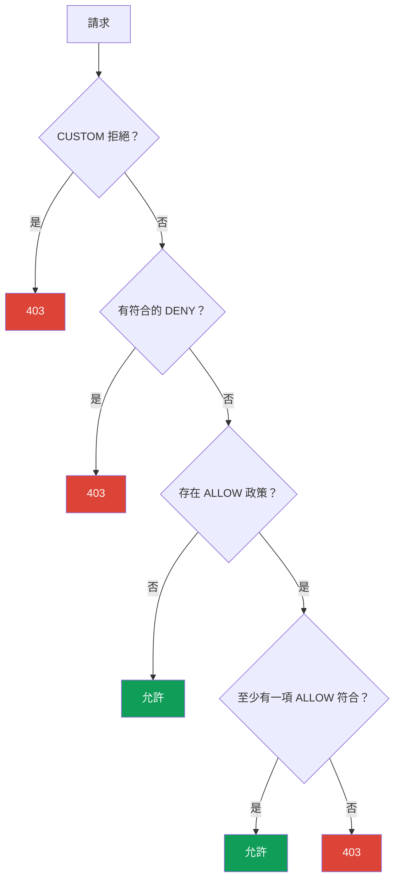

[Русская версия](ru.md) · [Eng version](en.md) · [Versión en español](es.md) · [Version française](fr.md) · [Deutsche Version](de.md) · [ქართული ვერსია](ge.md) · [日本語版](jp.md)

# 第 14 章：AuthorizationPolicy：服務對服務授權

> **接下來。** 在第 13 章中，我們啟用了 mTLS：現在流量已加密，而且我們知道
> 連線另一端是誰。但 mTLS 並不限制該對象被允許做什麼。這正是
> `AuthorizationPolicy` 的職責--它回答「誰可以用何種方式存取何處」。這是 Istio 安全性的第二根支柱。

## 14.1. 為什麼需要授權

回想上一章的結尾。我們啟用了 `STRICT` mTLS--沒有有效 mesh 身分，任何人都無法再連到服務
`payments`。但 mesh 中任何擁有自己憑證的服務仍可存取 `payments`。而我們希望更精確地說：「只有
frontend 可以存取 payments，而且只能使用 GET 方法。」

這就是授權。mTLS 提供了已驗證的身分（是誰），而
`AuthorizationPolicy` 使用這個身分來判定允許該用戶端做什麼。

## 14.2. AuthorizationPolicy 的結構

此資源由三個主要部分組成：

```yaml
apiVersion: security.istio.io/v1
kind: AuthorizationPolicy
metadata:
  name: payments-policy
  namespace: app
spec:
  selector:               # 套用至哪些 pod
    matchLabels:
      app: payments
  action: ALLOW           # 執行動作：ALLOW / DENY / CUSTOM / AUDIT
  rules:                  # 在哪些條件下
  - from:
    - source:
        principals: ["cluster.local/ns/app/sa/frontend"]
    to:
    - operation:
        methods: ["GET"]
```

- **`selector`**--此政策套用至哪些 Pod（此處為 `payments`）。未指定 selector 時--
  套用至整個 namespace。
- **`action`**--如何處理符合條件的請求。
- **`rules`**--條件：誰（`from`）、到哪裡及如何（`to`）、
  在何種情況下（`when`）。

## 14.3. Default-deny：封鎖一切

Zero Trust 原則：先拒絕一切，再精確允許所需項目。在 Istio 中，典型的
「拒絕一切」方式看似出乎意料--它是**沒有任何規則**的 `ALLOW` 政策：

```yaml
apiVersion: security.istio.io/v1
kind: AuthorizationPolicy
metadata:
  name: payments-deny-all
  namespace: app
spec:
  selector:
    matchLabels:
      app: payments
  action: ALLOW
  # 沒有 rules => 沒有請求符合 => 全部拒絕（403）
```

邏輯如下：只要 Pod 附加了至少一個 `ALLOW` 政策，就會套用
「只允許在 `rules` 中明確列出的項目」規則。沒有規則--代表沒有任何請求
符合，所有請求都會收到 `403`。

通常會在整個 namespace（甚至透過 `istio-system` 中的政策套用至整個 mesh）實作 default-deny，
然後再加入精確的允許規則。

## 14.4. 精確允許：from、to、when

現在只開放所需項目。新增第二個政策，只允許 `frontend` 以 `GET` 方法
存取 `payments`：

```yaml
spec:
  selector:
    matchLabels:
      app: payments
  action: ALLOW
  rules:
  - from:
    - source:
        principals: ["cluster.local/ns/app/sa/frontend"]  # 誰
    to:
    - operation:
        methods: ["GET"]                                   # 可執行什麼
        paths: ["/api/*"]                                  # 於哪些路徑
    when:
    - key: request.headers[x-env]                          # 額外條件
      values: ["prod"]
```

規則有三個區塊：

- **`from`**--請求來源。最常見是 `principals`（第 13 章的 SPIFFE 身分），
  也可以是 `namespaces` 和 `ipBlocks`。
- **`to`**--可執行的操作：HTTP 方法（`methods`）、路徑（`paths`）、連接埠。
- **`when`**--額外條件：標頭、JWT claims 與其他請求屬性。

`action: ALLOW` 的政策依 OR 原則組合：只要請求獲得**至少一個** ALLOW 政策允許，
就可通過。也就是說，default-deny 與這個允許規則共同帶來：
「只有 frontend、只有 GET、只有 /api/*、只有在 prod 中，才能存取 payments」。

## 14.5. 否定、when 條件與作用範圍

以下是實務上經常需要的幾項重要功能。

**否定。** 大部分欄位都有 `not-` 形式：`notPrincipals`、`notNamespaces`、
`notMethods`、`notPaths`、`notPorts`。若請求屬性**不在**所列項目內，規則
就會符合。例如，「允許除了 DELETE 方法以外的全部操作」：

```yaml
  rules:
  - to:
    - operation:
        notMethods: ["DELETE"]
```

**`when` 鍵。** `when` 區塊依任意請求屬性進行比對。最實用的鍵包括：

- `request.auth.claims[<claim>]`--已驗證 JWT 的 claim（第 15 章）；
- `request.headers[<name>]`--HTTP 標頭；
- `source.namespace` / `source.principal`--請求來自何處；
- `destination.port`--目標連接埠；
- `remote.ip`--真實用戶端 IP（參見 14.10 的 edge）。

**作用範圍。** 如同 `PeerAuthentication`（第 13 章），其層級由 namespace 與
是否存在 `selector` 決定：

- **整個 mesh**--根 namespace（`istio-system`）中的政策；
- **namespace**--目標 namespace 中沒有 `selector` 的政策；
- **特定 Pod**--具有 `selector.matchLabels` 的政策。

例如，這讓您可以在 `istio-system` 中為整個 mesh 建立一項 default-deny，
並將精確允許規則放在其所屬 namespace 的服務旁。

## 14.6. 動作：ALLOW、DENY、CUSTOM、AUDIT

`action` 欄位有四個值：

| 動作 | 功能 |
|------|------|
| `ALLOW` | 允許符合條件的請求（最常用） |
| `DENY` | 明確拒絕符合條件的請求 |
| `CUSTOM` | 將決策委派給外部授權服務 |
| `AUDIT` | 僅記錄符合項目，不影響決策 |

`ALLOW` 用於「允許所需項目」的模型。`DENY` 很適合明確封鎖某個項目
（例如禁止任何來源的 DELETE 方法）。`CUSTOM` 用於外部
授權（例如透過 OPA 或自有服務）。`AUDIT` 可讓您檢查會符合什麼，暫時不封鎖任何項目。

以下為明確 `DENY` 的範例--無論其他 ALLOW 政策允許什麼，都禁止所有人對
`payments` 使用 `DELETE` 方法（如 14.7 所述，`DENY` 早於 `ALLOW` 檢查）：

```yaml
apiVersion: security.istio.io/v1
kind: AuthorizationPolicy
metadata:
  name: payments-deny-delete
  namespace: app
spec:
  selector:
    matchLabels:
      app: payments
  action: DENY
  rules:
  - to:
    - operation:
        methods: ["DELETE"]     # 對 payments 的任何 DELETE -> 403，無論 ALLOW 允許什麼
```

## 14.7. 政策評估順序

當 Pod 附加多項政策時，Istio 會以嚴格順序評估它們。這經常造成混淆，
請記住以下順序：



換句話說：

1. 首先檢查 `CUSTOM` 政策。若外部 authz 回覆「否」--拒絕。
2. 接著檢查 `DENY` 政策。若請求符合任一項--拒絕。
3. 接著是 `ALLOW`。若**完全沒有** ALLOW 政策--請求獲允許（這是沒有
   政策時的預設值）。若**存在** ALLOW 政策，請求必須符合至少一項，
   否則拒絕。

這也解釋了 14.3 節 default-deny 的「魔法」：空的 ALLOW 政策會使
Pod 進入「只允許明確列出項目」模式，而沒有項目可列出--即拒絕一切。

## 14.8. 與 mTLS 的關係

這是一個容易忽略的重要細節。`from.source.principals` 規則會驗證用戶端的
SPIFFE 身分。但 Istio 從何得知這個身分？它來自用戶端在建立連線時出示的
mTLS 憑證（第 13 章）。

因此，沒有 mTLS 時，依 `principals` 建立的規則無法可靠運作：若流量為
plaintext，Istio 沒有已驗證的傳送者身分。因此，依身分進行的授權和 mTLS
始終結合使用：首先，`PeerAuthentication`（STRICT mTLS）確保身分真實，
接著 `AuthorizationPolicy` 根據該身分決定可執行的操作。

反之，若只依 `namespaces` 或 `ipBlocks` 而非 `principals` 撰寫規則，
形式上 mTLS 並非必要--但這些規則較弱，因為 IP 和 namespace 比加密身分更容易偽造。

## 14.9. AuthorizationPolicy 與 NetworkPolicy：防護層級

完成 CKA 的工程師應立即提出一個問題：這和我已經熟悉的 `NetworkPolicy`
有何不同？兩種資源都會限制存取，但在不同層級運作，且彼此互補。

**NetworkPolicy**（Kubernetes）在 L3/L4 運作：依 IP、連接埠與標籤，允許或拒絕 Pod
間的**網路連線**。它由 CNI 外掛在網路層（實質上在核心中）套用，
流量尚未到達應用程式或 Envoy 時就已生效。

**AuthorizationPolicy**（Istio）在 L7 運作：檢視加密身分
（SPIFFE）、HTTP 方法、路徑、標頭。它由 Envoy sidecar 套用。

| | NetworkPolicy | AuthorizationPolicy |
|---|---------------|---------------------|
| 層級 | L3/L4（IP、連接埠） | L7（identity、方法、路徑） |
| 套用者 | CNI（網路/核心層） | Envoy sidecar |
| 控制內容 | Pod 是否能建立連線 | 允許用戶端執行什麼操作 |
| 可見 identity | 否，僅 IP 和 Pod 標籤 | 是，SPIFFE 身分 |
| 可見 HTTP | 否 | 是（方法、路徑、標頭） |
| 是否需要 mesh | 否 | 是（sidecar 或 ztunnel） |

關鍵概念：這不是「二選一」，而是**兩層防護（defense in depth）**。

- NetworkPolicy 在網路層篩除不需要的連線。即使 Pod 沒有 sidecar 它仍可運作，
  且無法從遭入侵的應用程式繞過，因為規則位於核心而非容器中。
- AuthorizationPolicy 補足了 NetworkPolicy 原則上做不到的內容：依已驗證服務身分
  與 HTTP 請求細節建立的規則。

**共同使用的最佳實務：**

- 在**兩個層級都實作 default-deny**：在 namespace 中禁止多餘連線的基礎 NetworkPolicy，
  加上 default-deny AuthorizationPolicy。
- 使用 NetworkPolicy 進行粗略分段：哪些 namespace 與 Pod 可以透過網路通訊
  （包括非 mesh 流量和存取 control plane）。
- 使用 AuthorizationPolicy 建立精細規則：誰（依 identity）可以使用哪些方法和路徑
  存取服務。
- 不要只依賴 AuthorizationPolicy：它在 Pod 內的 Envoy 中套用。
  NetworkPolicy 是獨立的網路層防線，即使 sidecar 發生問題也會保留。

總結：NetworkPolicy 回答「誰能在網路上與誰連線」，
AuthorizationPolicy 回答「允許該服務在應用程式層做什麼」。
兩者合用可提供完整的分層防護。

### 還有 L7 NetworkPolicy（Cilium）

情況比「NetworkPolicy = L4、Istio = L7」稍複雜。標準 Kubernetes
NetworkPolicy 的確僅限 L3/L4。但有些 CNI 能做得更多。最顯著的例子是
**Cilium**：它基於 eBPF 提供**具 L7 感知的網路政策**，可篩選 HTTP 方法與路徑、
gRPC、Kafka、DNS 請求。也就是說，您可以在 CNI 層完成部分 L7 規則，而無需 Istio。

隨之而來的明顯問題是：既然 Cilium 和 Istio 都支援 L7，為何兩者都要使用，
又該如何整合？讓我們說明。

- **不同的 identity 模型。** Istio 依 mTLS 憑證中的 SPIFFE 身分進行授權。
  Cilium 使用基於 Pod 標籤的自身 identity 模型（透過 eBPF），而 mTLS 對它來說是
  獨立選項。這是完全不同的「這是誰」方法。
- **不同的套用位置。** Cilium 在核心（eBPF）及內建的
  per-node Envoy 中套用規則。Istio 則在 sidecar 或 waypoint 中套用。若兩者都啟用 L7，
  流量會經過兩次 L7 剖析，增加延遲與除錯複雜度。

**是否應同時使用。** 一般建議是：**不要在兩個系統中重複 L7 規則**。
實務選項如下：

- **Cilium 負責 L3/L4 + Istio 負責 L7。** 最常見且健全的選擇：Cilium
  作為 CNI 負責快速網路分段（L3/L4）及可能的 DNS 政策，Istio 則負責所有 L7：
  mTLS、依 identity 授權、流量管理。這也是 Istio ambient 模式常見的組合。
- **僅 Cilium（使用其 L7）**，不使用 Istio--若 CNI 的 L7 篩選已足夠，且不需要完整
  mesh（流量管理、鏡像、豐富的 observability），這是合理選擇。
- **僅 Istio**--若已存在 mesh，將 L7 政策保留在其中是合乎邏輯的，而 CNI 僅處理 L3/L4。

應避免的做法：同時在 Cilium 和 Istio 撰寫重疊的 L7 規則。這會造成雙倍額外負荷、
兩個真實來源，並在請求「莫名其妙」收到 403 時使除錯極其困難。
請選擇一個 L7 層級並在其中維護規則。

## 14.10. ingress gateway（edge）的授權與 IP 陷阱

`AuthorizationPolicy` 不僅可附加至 mesh 內的服務，亦可附加至**ingress gateway 本身**，
以在入口處篩選流量（例如只讓辦公室網路存取管理後台）。此類政策置於 gateway 的 namespace
（`istio-system`），並使用 selector 選取 gateway Pod：

```yaml
apiVersion: security.istio.io/v1
kind: AuthorizationPolicy
metadata:
  name: ingress-allow-office
  namespace: istio-system
spec:
  selector:
    matchLabels:
      istio: ingressgateway
  action: ALLOW
  rules:
  - from:
    - source:
        remoteIpBlocks: ["203.0.113.0/24"]   # 真實的用戶端 IP
    to:
    - operation:
        hosts: ["admin.example.com"]
```

**IP 陷阱--`ipBlocks` 與 `remoteIpBlocks`。** 這經常使 IP allowlist 失效，
尤其是在負載平衡器之後：

- **`ipBlocks`**--Envoy 所見的**連線來源** IP。在負載平衡器之後，這會是
  LB/代理本身的 IP，而不是用戶端 IP。用它篩選用戶端毫無用處。
- **`remoteIpBlocks`**--Istio 根據 `X-Forwarded-For` 標頭並考量受信任代理數量，
  判定的**真實用戶端 IP**。這才是依用戶端位址建立 allowlist 所需的項目。

但**正確的用戶端 IP 從何而來取決於負載平衡器的類型**，而 AWS 在此分為兩種情況。

**ALB（L7）。** ALB 會自行新增帶有真實用戶端 IP 的 `X-Forwarded-For`。只須透過
MeshConfig 中的 `numTrustedProxies` 告知 Istio gateway 前方有多少受信任代理：

```yaml
apiVersion: install.istio.io/v1alpha1
kind: IstioOperator
spec:
  meshConfig:
    defaultConfig:
      gatewayTopology:
        numTrustedProxies: 1     # ingress gateway 前有 1 個受信任的 proxy（ALB）
```

**NLB（L4）。** 關鍵點是：**NLB 在 L4 運作且不會新增 `X-Forwarded-For`**--它無法「簽署」
HTTP 標頭，因為它處理的是 TCP。因此，單靠 `numTrustedProxies` 在此無效：
XFF 根本沒有來源。透過 NLB 保留用戶端 IP 的方式是 **Proxy Protocol
v2**。需要三項設定：

1. **在 NLB 啟用 Proxy Protocol**--在 ingress gateway 的 Service 加上註解：

   ```yaml
   serviceAnnotations:
     service.beta.kubernetes.io/aws-load-balancer-type: external
     service.beta.kubernetes.io/aws-load-balancer-proxy-protocol: "*"   # PROXY v2
   ```

2. **讓 ingress gateway 能剖析 Proxy Protocol**--透過 EnvoyFilter 新增 listener-filter：

   ```yaml
   apiVersion: networking.istio.io/v1alpha3
   kind: EnvoyFilter
   metadata:
     name: ingress-proxy-protocol
     namespace: istio-system
   spec:
     selector:
       matchLabels:
         istio: ingressgateway
     configPatches:
     - applyTo: LISTENER
       patch:
         operation: MERGE
         value:
           listener_filters:
           - name: envoy.filters.listener.proxy_protocol
   ```

3. **告知 Istio 將 Proxy Protocol 的來源視為真實用戶端**--透過
   `gatewayTopology`：

   ```yaml
   apiVersion: install.istio.io/v1alpha1
   kind: IstioOperator
   spec:
     meshConfig:
       defaultConfig:
         gatewayTopology:
           proxyProtocol: {}      # 從 PROXY 標頭取得用戶端 IP
   ```

完成後，真實用戶端 IP 即可使用，且 `AuthorizationPolicy` 中的 `remoteIpBlocks` /
`remote.ip` 可正確運作。不使用 Proxy Protocol 的替代方案是使用具有
`externalTrafficPolicy: Local` 的 NLB `instance` targets，但這會改變負載平衡與 health-check，
所以 mesh 通常會選擇 Proxy Protocol。

簡言之：針對用戶端 IP 的 allowlist 請使用 **`remoteIpBlocks`**，並將用戶端 IP
帶至 gateway--在 **ALB** 後方透過 `numTrustedProxies`（存在 XFF），在 **NLB** 後方透過
**Proxy Protocol v2**（不存在 XFF）。絕不可在負載平衡器後方依賴 `ipBlocks`。

## 14.11. 驗證與除錯

授權拒絕有明確表現：HTTP **`403`**，回應主體為 **`RBAC: access denied`**。若看到此回應，
不是服務回傳的，而是 Envoy 根據您的政策回傳。

除錯時的實用項目：

- **目標 sidecar 日誌**會顯示拒絕原因：

  ```bash
  kubectl logs <pod> -c istio-proxy -n app | grep -i rbac
  # 尋找 rbac_access_denied_matched_policy - 哪個政策生效
  ```

- **以暫時的 `AUDIT` 取代 DENY/ALLOW**--驗證政策符合所需請求而不封鎖
  它們（符合項目會寫入日誌）。
- **`istioctl` 的 Pod 描述**會顯示附加了哪些政策：

  ```bash
  istioctl x describe pod <pod> -n app
  ```

「難以解釋的 403」常見原因：忘了某處存在 default-deny；依
`principals` 的規則因沒有 STRICT mTLS 而未符合（14.8）；在 edge 使用 `ipBlocks`
而非 `remoteIpBlocks` 進行篩選（14.10）。

## 14.12. 最佳實務

- **以 Default-deny 為基礎。** 由拒絕一切開始（namespace/mesh 上的空 `ALLOW`），
  再加入精確允許規則--這就是 Zero Trust。
- **依 `principals` 而非 IP 建立規則。** mTLS 的加密身分比 IP/namespace 更可靠；
  將身分篩選作為主要方式（並維持 `STRICT` mTLS，見 14.8）。
- **以 `DENY` 建立明確拒絕。** 將危險操作（例如 `DELETE`、管理路徑）透過
  獨立的 `DENY` 政策封鎖--它會先於任何 `ALLOW` 生效。
- **在 edge 使用 `remoteIpBlocks` + 信任 XFF。** 針對用戶端 IP 的 allowlist 不要與
  `ipBlocks` 混淆（14.10）。
- **Least privilege。** 僅允許最少項目：明確的方法、路徑與來源，而非「此 namespace
  的所有項目」。
- **驗證政策**（14.11）：啟用前使用 `AUDIT`、檢查 `rbac` 日誌、使用 `istioctl x describe`--
  不要以為「規則寫好了，就一定能運作」。
- **兩層防護。** 使用 NetworkPolicy 的網路 default-deny 補強 AuthorizationPolicy
  （14.9）--以因應 sidecar 問題。

## 14.13. 本章總結

- `AuthorizationPolicy` 使用 mTLS 身分回答「允許此用戶端做什麼」。
- 結構：`selector`（套用至哪些 Pod）、`action`（要做什麼）、`rules`（條件：
  `from`、`to`、`when`）。
- **Default-deny** 是沒有規則的 `ALLOW` 政策：它使 Pod 進入「僅明確
  允許」模式，而沒有規則--即拒絕一切。
- 精確允許由 `from`（誰，通常是 `principals`）、`to`（方法、路徑）、
  `when`（額外條件）定義；ALLOW 政策以 OR 組合。
- 動作：`ALLOW`、`DENY`、`CUSTOM`（外部 authz）、`AUDIT`（僅記錄）。
- 評估順序：CUSTOM，接著 DENY，最後 ALLOW。
- 依 `principals` 的授權建立在 mTLS 身分之上，因此會與
  PeerAuthentication 一同使用。
- AuthorizationPolicy（L7、Envoy）與 NetworkPolicy（L3/L4、CNI）彼此互補；
  最佳實務是 defense in depth：兩個層級都採用 default-deny。
- 部分 CNI（Cilium）支援 L7 政策；為避免複雜性，應將 L7 保留在一個系統中--
  常見選擇為 Cilium 處理 L3/L4、Istio 處理 L7。
- 有否定（`notMethods`、`notPaths`……）、彈性的 `when`（JWT claims、標頭、連接埠、
  `remote.ip`）與作用層級（mesh/namespace/Pod）--如同 PeerAuthentication。
- 在 **ingress gateway**，針對用戶端 IP 的 allowlist 應使用 **`remoteIpBlocks`**，而非
  `ipBlocks`（連線 IP = LB IP）。將用戶端 IP 帶至 gateway 的方式：在 **ALB** 後方透過
  `numTrustedProxies`（存在 XFF），在 **NLB**（L4，沒有 XFF）後方透過 **Proxy Protocol v2**。
- 拒絕 = `403 RBAC: access denied`；可用 Envoy 日誌（`rbac_access_denied`）、
  暫時的 `AUDIT` 與 `istioctl x describe` 除錯。

## 14.14. 自我檢查問題

1. AuthorizationPolicy 的任務和 mTLS/PeerAuthentication 的任務有何不同？
2. 為何沒有規則的 `ALLOW` 政策會拒絕一切？
3. `from`、`to` 與 `when` 區塊分別負責什麼？
4. Istio 以何種順序評估 CUSTOM、DENY 和 ALLOW？
5. 為何依 `principals` 的規則需要 mTLS，而依 `namespaces` 的規則形式上不需要？
6. NetworkPolicy 和 AuthorizationPolicy 有何不同，為何應該一起使用？
7. 在 ingress gateway 上，`ipBlocks` 與 `remoteIpBlocks` 有何不同？如何在 **ALB** 和
   **NLB** 後方將真實用戶端 IP 帶到 gateway（為何 NLB 不適用 XFF）？
8. 授權拒絕的表現為何，如何找出是哪項政策造成它？
9. 如何建立危險操作（例如 DELETE）的明確拒絕，使其不受 ALLOW 規則影響？

## 練習

在 STRICT mTLS 之上練習 default-deny 與精確允許（僅 frontend + GET）--
這是第 13 章實驗的延續：

🧪 實驗 04：[tasks/ica/labs/04](../../labs/04/README_TW.MD)

---
[目錄](../README_TW.md) · [第 13 章](../13/tw.md) · [第 15 章](../15/tw.md)
