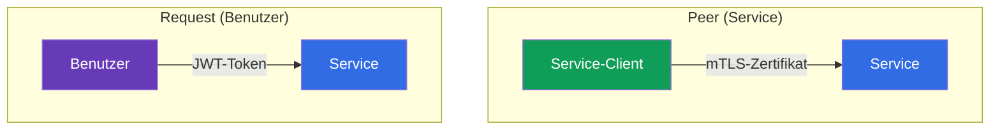
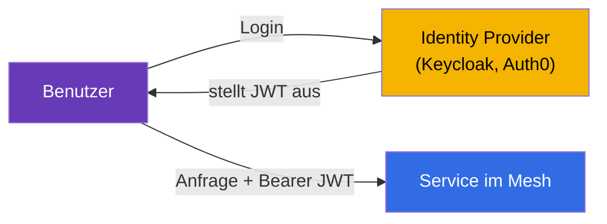
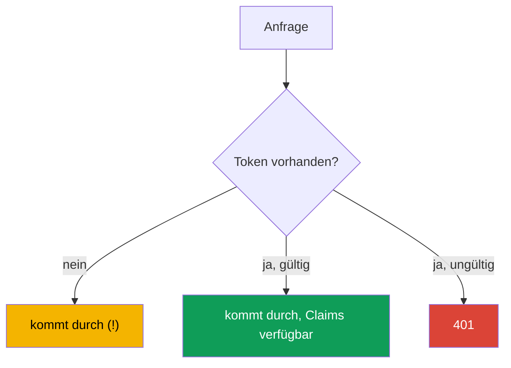
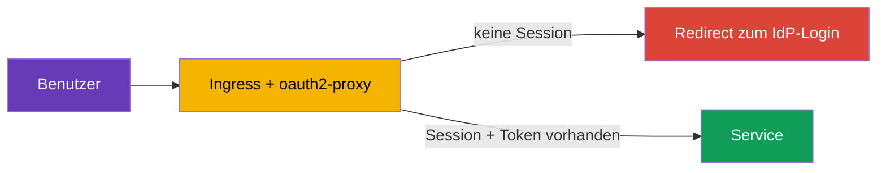
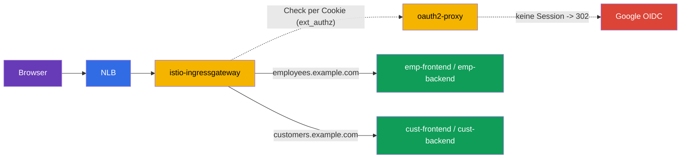

[RU version](ru.md) · [Eng version](en.md) · [Versión en español](es.md) · [Version française](fr.md)

# Kapitel 15. Benutzer-Authentifizierung: RequestAuthentication und JWT

> **Was kommt als Nächstes.** In den Kapiteln 13 und 14 haben wir uns mit der Authentifizierung und Autorisierung
> von **Services** untereinander befasst (mTLS, PeerAuthentication, AuthorizationPolicy). Aber es gibt auch
> einen zweiten Typ der Authentifizierung – den des **Endbenutzers**: wenn eine Anfrage ein Token trägt
> (JWT), das von Ihrem Identity Provider ausgestellt wurde, und der Service dieses Token prüfen muss. Damit befasst
> sich RequestAuthentication.

## 15.1. Zwei Typen der Authentifizierung

In Istio ist es wichtig, zwei Fragen „wer ist das" zu unterscheiden:

- **Peer authentication** – wer ist dieser **absendende Service**. Wird über das
  mTLS-Zertifikat geprüft, konfiguriert über `PeerAuthentication` (Kapitel 13).
- **Request authentication** – wer ist dieser **Endbenutzer**, in dessen Namen
  die Anfrage läuft. Wird über ein Token (JWT) geprüft, konfiguriert über `RequestAuthentication`.



Das sind unabhängige Dinge: eine Anfrage kann gleichzeitig sowohl eine mTLS-Identity des Service als auch ein
JWT-Token des Benutzers haben. Zum Beispiel spricht `frontend` (der Service) `backend` an und trägt dabei das Token
eines Benutzers, der sich im System angemeldet hat.

## 15.2. Was ist ein JWT

**JWT** (JSON Web Token) ist eine standardisierte Art, signierte Informationen über einen
Benutzer zu übertragen. Das Token besteht aus drei Teilen, getrennt durch Punkte: `header.payload.signature`.

- **header** – der Signaturalgorithmus.
- **payload** – die Nutzdaten, die sogenannten Claims: wer ausgestellt hat (`iss`), für wen
  (`aud`), wer der Benutzer ist (`sub`), wann es abläuft (`exp`) und beliebige benutzerdefinierte Felder
  (Rollen, E-Mail usw.).
- **signature** – die Signatur, mit der der Identity Provider (Auth0, Keycloak, Google usw.)
  das Token beglaubigt.

Die Echtheit des Tokens lässt sich anhand der Signatur mit den öffentlichen Schlüsseln des Providers prüfen.
Diese Schlüssel werden unter einer standardisierten Adresse im Format **JWKS** (JSON Web Key Set) veröffentlicht.
Istio lädt das JWKS selbst herunter und prüft die Signatur – manuell muss nichts entschlüsselt werden.

## 15.3. Wozu ein JWT nötig ist und wie man es einsetzt

Die Theorie ist klar, aber wozu das alles in der Praxis? Betrachten wir ein reales Szenario.

**Wie das in einer Anwendung funktioniert.** Der Benutzer meldet sich im System über einen Identity Provider
(Keycloak, Auth0, Google, Okta usw.) nach dem Protokoll OIDC/OAuth2 an. Als Antwort erhält er ein
JWT-Token. Weiter hängt der Client (Browser, mobile Anwendung) dieses Token an
jede Anfrage im Header `Authorization: Bearer <token>` an. Die Services prüfen das Token und
verstehen, wer der Benutzer ist und was ihm erlaubt ist.



**Warum gerade JWT und keine Sessions.** Klassische serverseitige Sessions erfordern, dass der Server
den Session-Zustand speichert und alle Replikate Zugriff darauf haben. In Microservices ist das unpraktisch.
JWT löst das anders:

- **Das Token ist selbsttragend.** Alle Informationen über den Benutzer stecken bereits im Token und sind durch die
  Signatur beglaubigt. Der Server muss keine Sessions speichern und bei jeder Anfrage in die Datenbank gehen.
- **Funktioniert über die gesamte Service-Kette.** `frontend` hat das Token erhalten und gibt es
  weiter an `orders`, `payments` usw. Jeder Service kann das Token selbst prüfen, wenn er
  nur die öffentlichen Schlüssel des Ausstellers kennt – man muss nicht bei jeder Anfrage einen Autorisierungs-Server anstoßen.
- **Standard.** JWT ist Teil des OAuth2/OIDC-Ökosystems, es wird von allen IdP und Bibliotheken verstanden.

**Wo man das real einsetzt:**

- **Single Sign-On (SSO).** Der Benutzer meldet sich einmal am unternehmensweiten Keycloak an und
  bewegt sich mit einem Token durch alle internen Services.
- **API-Zugriff nach Rollen.** In den Claims des Tokens liegen Rollen oder Scopes (`role: admin`,
  `scope: orders.write`). Verschiedene Endpunkte erfordern verschiedene Rollen.
- **Mandantenfähigkeit.** Im Token liegt eine Mandanten-Kennung (`tenant: acme`), und der
  Service gibt nur Daten dieses Mandanten heraus.

**Wozu das in Istio machen und nicht in jeder Anwendung.** Man kann natürlich das JWT im
Code jedes Service prüfen. Aber dann müsste man die Prüflogik (Herunterladen der Schlüssel, Validierung der Signatur,
der Gültigkeitsdauer) in jeder Sprache und in jedem Service wiederholen. Istio verlagert das
in die Infrastruktur:

- die Anwendungen **schreiben keinen** Code zur Token-Prüfung – das macht Envoy;
- ungültige Tokens werden **am Eingang** abgefangen, noch vor der Anwendung;
- der Aussteller und die Schlüssel werden **an einer Stelle** konfiguriert, nicht in jedem Service;
- die Regeln „welche Rolle zu welchem Endpunkt" werden deklarativ über
  `AuthorizationPolicy` beschrieben.

### Beispiel: verschiedene Benutzer mit verschiedenen Rechten

Betrachten wir eine typische Aufgabe im Detail. In einem Unternehmen gibt es zwei Portale:

- **customer-portal** – für externe Kunden (schauen sich den Katalog, ihre Bestellungen an);
- **internal-portal** – für Mitarbeiter (Admin-Bereich, Warenverwaltung, Berichte).

Beide sind über einen Cluster und ein Istio erreichbar, aber es sollen verschiedene Personen hineingelassen werden. Alle
melden sich über einen Keycloak an, aber in ihren Tokens stehen verschiedene Claims. Zum Beispiel hat ein Kunde im Token
`role: customer`, ein Mitarbeiter – `role: employee`, ein Administrator – `role: admin`.

Die Aufgabe wird so gelöst: Istio prüft das Token einmal, und die `AuthorizationPolicy` lässt in jedes
Portal nur die passenden Rollen hinein.

Kundenportal – wir lassen nur `customer` hinein:

```yaml
apiVersion: security.istio.io/v1
kind: AuthorizationPolicy
metadata:
  name: customer-portal-access
  namespace: app
spec:
  selector:
    matchLabels:
      app: customer-portal
  action: ALLOW
  rules:
  - from:
    - source:
        requestPrincipals: ["*"]        # gültiges Token erforderlich
    when:
    - key: request.auth.claims[role]
      values: ["customer"]              # und die Rolle muss customer sein
```

Internes Portal – wir lassen nur Mitarbeiter und Admins hinein:

```yaml
apiVersion: security.istio.io/v1
kind: AuthorizationPolicy
metadata:
  name: internal-portal-access
  namespace: app
spec:
  selector:
    matchLabels:
      app: internal-portal
  action: ALLOW
  rules:
  - from:
    - source:
        requestPrincipals: ["*"]
    when:
    - key: request.auth.claims[role]
      values: ["employee", "admin"]     # nur Mitarbeiter und Admins
```

Was wir erhalten:

- Ein Kunde mit seinem Token (`role: customer`) gelangt ins customer-portal, aber auf dem
  internal-portal erhält er `403` – seine Rolle steht nicht in der Liste.
- Ein Mitarbeiter (`role: employee`) umgekehrt: kommt ins interne Portal, aber auf das Kundenportal –
  `403`.
- Ein Benutzer ohne Token kommt nirgendwohin.

Beachten Sie: die Anwendungen `customer-portal` und `internal-portal` selbst **enthalten
keinen Code zur Rollenprüfung**. Sie erhalten einfach bereits gefilterten Verkehr. Die gesamte Logik „wer
wohin darf" ist deklarativ in zwei `AuthorizationPolicy` beschrieben, und die Token-Prüfung hat
Istio gemacht. Wollten Sie ein Portal für Partner mit der Rolle `partner` hinzufügen – schreiben Sie einfach noch eine
Policy, die Anwendungen müssen nicht angefasst werden.

### Und versteht die Anwendung selbst, was für ein Benutzer gekommen ist?

Eine berechtigte Frage: wenn Istio die Prüfung macht, weiß die Anwendung dann, wer genau sie
angesprochen hat? Ja, aber mit einer wichtigen Einschränkung. Standardmäßig **validiert** Istio das Token und **gibt** es **nicht** weiter an die Anwendung (das Feld `forwardOriginalToken: false` standardmäßig) –
das ist eine häufige Falle: die Anwendung erwartet einen `Authorization`-Header, und er ist nicht da. Es gibt zwei Wege,
der Anwendung die Identity des Benutzers zu geben:

- **`forwardOriginalToken: true`** in `jwtRules` – das Originaltoken für den upstream aufbewahren,
  und die Anwendung parst selbst `Authorization: Bearer <token>`;
- **`outputClaimToHeaders`** – die nötigen Claims in einfache Header herausziehen (siehe unten), dann
  braucht die Anwendung das Token selbst nicht.

Hier ist es wichtig, die Verantwortung zu trennen:

- **Istio ist für den groben Zugriff zuständig**: ist das Token gültig? lässt die Rolle zu diesem Service oder
  Endpunkt zu? Das ist das, was nicht von der Geschäftslogik abhängt.
- **Die Anwendung ist für die Logik auf Datenebene zuständig**: genau *meine* Bestellungen anzeigen,
  die Ausgabe personalisieren, ins Audit schreiben, wer eine Aktion durchgeführt hat. Dafür braucht die Anwendung
  eine Benutzer-Kennung, und sie nimmt sie aus dem Token.

Ein Beispiel: die `AuthorizationPolicy` hat einen Benutzer mit `role: customer` ins customer-portal gelassen
(grober Zugriff). Aber welcher Kunde genau gekommen ist und welche Bestellungen ihm anzuzeigen sind – entscheidet bereits
die Anwendung anhand des Claim `sub` (die Benutzer-Kennung) aus dem Token.

Damit die Anwendung nicht selbst das JWT parsen muss, kann Istio **die nötigen Claims
in einfache Header** über `outputClaimToHeaders` in der `RequestAuthentication` herausziehen:

```yaml
apiVersion: security.istio.io/v1
kind: RequestAuthentication
metadata:
  name: jwt-auth
  namespace: app
spec:
  selector:
    matchLabels:
      app: backend                 # auf welche Pods angewendet wird
  jwtRules:
  - issuer: "https://my-idp.example.com"              # wer das Token ausgestellt hat
    jwksUri: "https://my-idp.example.com/jwks.json"   # woher die Schlüssel zur Prüfung
    outputClaimToHeaders:
    - header: x-user-id
      claim: sub          # die Anwendung liest den fertigen Header x-user-id
    - header: x-user-email
      claim: email
```

Nun liest die Anwendung einfach den Header `x-user-id`, ohne irgendetwas über JWT zu wissen. Die
Echtheitsprüfung hat bereits Istio gemacht, deshalb kann man diesen Headern vertrauen (ein externer Client kann
sie nicht fälschen – Istio überschreibt sie mit Werten aus dem geprüften Token).

Fazit: Istio nimmt der Anwendung die Authentifizierung und den groben Zugriff ab, aber die Identity des
Benutzers ist der Anwendung nach wie vor zugänglich – für die Logik, die nur die
Anwendung selbst kennen kann.

## 15.4. RequestAuthentication: JWT-Prüfung

Die Ressource `RequestAuthentication` sagt Istio, welche Tokens als gültig gelten: von welchem
Aussteller und wo die Schlüssel zur Signaturprüfung zu holen sind.

```yaml
apiVersion: security.istio.io/v1
kind: RequestAuthentication
metadata:
  name: jwt-auth
  namespace: app
spec:
  selector:
    matchLabels:
      app: backend
  jwtRules:
  - issuer: "https://my-idp.example.com"          # wer das Token ausgestellt hat
    jwksUri: "https://my-idp.example.com/jwks.json"  # woher die Schlüssel zur Prüfung
```

Was Istio mit dieser Policy macht:

- wenn in der Anfrage ein Token **vorhanden** und gültig ist (richtiger Aussteller, lebendige Signatur, nicht
  abgelaufen) – werden die Claims aus dem Token für die Autorisierungsregeln verfügbar;
- wenn ein Token **vorhanden, aber ungültig** ist (schlechte Signatur, fremder Aussteller, abgelaufen) –
  wird die Anfrage mit `401` abgelehnt.

Standardmäßig wird das Token aus dem Header `Authorization: Bearer <token>` genommen. Wenn Ihr Client
das Token an einer nicht standardmäßigen Stelle ablegt (eigener Header oder Query-Parameter), geben Sie das explizit
über `fromHeaders` / `fromParams` an:

```yaml
  jwtRules:
  - issuer: "https://my-idp.example.com"
    jwksUri: "https://my-idp.example.com/jwks.json"
    fromHeaders:
    - name: x-jwt-token       # Token in einem eigenen Header
    fromParams:
    - token                   # oder im Query-Parameter ?token=...
```

Man kann mehrere Quellen aufzählen – Istio prüft sie der Reihe nach.

## 15.5. Die wichtigste Feinheit: ohne Token kommt die Anfrage durch

Hier ist die Hauptfalle, über die alle stolpern. Die `RequestAuthentication` **verlangt kein**
Vorhandensein eines Tokens. Sie prüft ein Token nur, **wenn es vorhanden ist**. Eine Anfrage ganz ohne Token kommt
problemlos durch die `RequestAuthentication`.



Das heißt, die `RequestAuthentication` an sich schützt den Service nicht – sie validiert nur
Tokens. Um ein Token zu **verlangen**, braucht man den Verbund mit einer `AuthorizationPolicy`. Das ist dasselbe
Prinzip wie zuvor: eine Policy prüft, die andere verlangt.

## 15.6. Verbund mit der AuthorizationPolicy

Um den Service wirklich zu schließen, fügen wir eine `AuthorizationPolicy` hinzu, die eine
geprüfte Benutzer-Identity verlangt. Sie wird über `requestPrincipals` festgelegt:

```yaml
apiVersion: security.istio.io/v1
kind: AuthorizationPolicy
metadata:
  name: require-jwt
  namespace: app
spec:
  selector:
    matchLabels:
      app: backend
  action: ALLOW
  rules:
  - from:
    - source:
        requestPrincipals: ["*"]   # jedes gültige Token erforderlich
```

- **`requestPrincipals: ["*"]`** – verlangt, dass die Anfrage eine geprüfte
  Request-Identity hat (also ein gültiges JWT). Das Format der Identity:
  `<issuer>/<subject>`. Das Sternchen bedeutet „jedes gültige Token".
- Nun erhält eine Anfrage ohne Token `403` von der Autorisierung (und mit einem ungültigen Token – `401`
  bereits in der Phase der RequestAuthentication).

Man kann nicht nur das Vorhandensein eines Tokens verlangen, sondern konkrete Claims – zum Beispiel eine bestimmte
Rolle oder einen Aussteller – über den `when`-Block:

```yaml
apiVersion: security.istio.io/v1
kind: AuthorizationPolicy
metadata:
  name: require-jwt-admin
  namespace: app
spec:
  selector:
    matchLabels:
      app: backend
  action: ALLOW
  rules:
  - from:
    - source:
        requestPrincipals: ["*"]        # gültiges Token erforderlich
    when:
    - key: request.auth.claims[role]    # und der Claim role...
      values: ["admin"]                 # ...muss admin sein
```

Die resultierende Logik für den Service `backend`:

- kein Token -> `403` (AuthorizationPolicy);
- ungültiges Token -> `401` (RequestAuthentication);
- gültiges Token mit dem nötigen Claim -> kommt durch.

## 15.7. Abgelaufenes Token: Refresh und Redirect

Tokens leben nicht lange (oft 5–15 Minuten) – das ist Teil der Sicherheit. Was passiert, wenn ein
Token abgelaufen ist?

**Aus Sicht von Istio ist alles einfach:** bei einem abgelaufenen Token besteht die Prüfung des Claim `exp` nicht,
deshalb lehnt die `RequestAuthentication` die Anfrage mit `401` ab – genau wie jedes ungültige
Token. Es gibt für Istio keinerlei Unterschied zwischen „Signatur schlecht" und „Token abgelaufen": beide
Fälle sind `401`.

**Und hier ist eine wichtige Grenze, die man klar verstehen muss.** Istio **prüft** Tokens
**nur**. Es meldet Benutzer **nicht** an, leitet **nicht** auf die Login-Seite des IdP um und
**erneuert** Tokens **nicht**. Istio ist kein OAuth2-Client. Deshalb kann man „einen Redirect für ein
neues Token machen" mit Istio allein nicht. Das Beschaffen eines neuen Tokens ist eine Aufgabe eine Ebene
höher. Es gibt zwei Hauptansätze.

**Ansatz 1: Refresh auf der Client-Seite (SPA, mobile Anwendungen).** Der Client erhält beim Login
nicht nur ein kurzlebiges Access-Token, sondern auch ein Refresh-Token. Wenn die Anwendung ein
`401` erhält, dann:

- entweder tauscht sie das Refresh-Token gegen ein neues Access-Token beim IdP und wiederholt die Anfrage;
- oder, wenn auch der Refresh abgelaufen ist, leitet sie den Benutzer auf die Login-Seite des IdP um.

Diese gesamte Logik lebt im Client-Code, Istio ist daran nicht beteiligt – es gibt einfach
`401` heraus, und weiter kümmert sich der Client selbst.

**Ansatz 2: Auth-Proxy an der Grenze (Browser-Anwendungen mit Sessions).** Für klassische
Web-Anwendungen legt man den Redirect zum Login bequem in einen speziellen Proxy am Eingang aus –
zum Beispiel **oauth2-proxy** oder ein Analog. Er führt den vollen OIDC-Flow durch: leitet einen
nicht autorisierten Benutzer zum IdP um, hält die Session in einem Cookie und setzt das Token in die
Anfragen ein. Istio bindet einen solchen Proxy über die externe Autorisierung (`action: CUSTOM` in der
`AuthorizationPolicy`, erinnern Sie sich aus Kapitel 14) an.



**Ansatz 3: Login am Cloud-Edge (ALB, Cloudflare, CloudFront).** Den Login kann man
noch weiter auslagern – auf den Load Balancer/das CDN selbst, dann braucht man keinen separaten oauth2-proxy. Das funktioniert
nur dort, wo der Edge L7 und OIDC versteht:

- **AWS ALB – ja, ab Werk.** Eine Listener-Regel hat die Aktion `authenticate-oidc` (und
  `authenticate-cognito`): der ALB leitet einen nicht Autorisierten selbst zum IdP um, hält die Session in einem
  Cookie und fügt der Anfrage ein signiertes JWT im Header `x-amzn-oidc-data` hinzu (plus
  `x-amzn-oidc-identity` / `x-amzn-oidc-accesstoken`). Istio **validiert weiter einfach dieses
  JWT** über `RequestAuthentication`. Der Preis – vor dem Mesh erscheint ein ALB (L7), nicht ein „reiner"
  NLB.
- **Cloudflare – ja, Cloudflare Access (Zero Trust).** Vollständiges SSO/OIDC am Edge; nach außen
  wird ein signiertes JWT `Cf-Access-Jwt-Assertion` ausgestellt, und Istio validiert es anhand des JWKS von
  Cloudflare (`https://<team>.cloudflareaccess.com/cdn-cgi/access/certs`).
- **CloudFront – nicht out of the box.** Es gibt keinen eingebauten OIDC-Login; man macht ihn über
  **Lambda@Edge / CloudFront Functions** (eigener OIDC-Code) oder Cognito – das heißt, die Proxy-Logik
  schreiben Sie trotzdem, nur in Form einer Edge-Funktion.
- **NLB – nein.** Das ist L4, keinerlei HTTP/OIDC-Logik; ein Login darauf ist prinzipiell unmöglich.

In allen „Ja"-Varianten ändert sich die Rolle von Istio nicht: den interaktiven Login macht der Edge, und Istio
**prüft das signierte JWT** (`RequestAuthentication`) und erzwingt den Zugriff
(`AuthorizationPolicy`). Der Aussteller und `jwksUri` in der `RequestAuthentication` verweisen auf den
entsprechenden Edge (ALB/Cloudflare), nicht auf den ursprünglichen IdP.

> **Kritisch – die Umgehung des Edge schließen.** Wenn man das ingress gateway **an** ALB/
> Cloudflare **vorbei** erreichen kann, fälscht ein Angreifer die Header (`x-amzn-oidc-*`, `Cf-Access-*`) und kommt durch.
> Deshalb ist zwingend: (1) Istio **prüft die Signatur** des Edge-JWT anhand des JWKS und vertraut nicht
> dem Header aufs Wort; (2) der Zugriff auf das Gateway ist nur vom Edge her beschränkt – Security Group auf die
> IP von CDN/ALB, privater NLB, mTLS vom Edge usw.

**Was wählen:** für SPA und mobile Anwendungen macht der Client selbst den Refresh; für serverseitige
Browser-Anwendungen mit Sessions – ein Auth-Proxy (`oauth2-proxy`) oder Login am Cloud-Edge
(ALB `authenticate-oidc`, Cloudflare Access). In allen Fällen ist Istio nur für die
JWT-Prüfung und die Ausgabe von `401` zuständig, und Redirect und Token-Erneuerung – Sache des Clients, des Auth-Proxy oder des
Edge.

> **Und warum das nicht einfach über einen VirtualService anhand des fehlenden Headers machen?**
> Die Idee drängt sich auf: im `VirtualService` `withoutHeaders` matchen (kein `Authorization`) und
> solche Anfragen an einen „Redirect-Service" senden. Technisch gibt es das Match und sogar einen statischen `redirect`
> im VirtualService, aber als Ersatz für einen Auth-Proxy funktioniert das nicht: (1) der VirtualService sieht
> nur „Header ist da/ist nicht da", aber **prüft die Gültigkeit nicht** – `Authorization: Bearer Müll`
> kommt durch das Match; (2) der Browser sendet bei der Navigation `Authorization` überhaupt nicht (die Session ist im Cookie),
> also ist das Signal falsch; (3) den vollen OIDC-Flow (`/callback`, Austausch von `code`, Cookie, PKCE) muss
> trotzdem der empfangende Service implementieren – und das ist eben oauth2-proxy. Für den „Redirect
> nicht Autorisierter" existiert `ext_authz` (`action: CUSTOM`), bei dem die Entscheidung eine
> Komponente trifft, die zu prüfen **versteht**, und nicht ein Match anhand des Vorhandenseins eines Headers.

> **Kosten: Datenpfad vs nur Prüfung.** Eine häufige Befürchtung – „durch den Proxy läuft der
> gesamte Verkehr, das ist teuer". Das gilt nur für den Modus, bei dem `oauth2-proxy` als
> **Reverse-Proxy vor der Anwendung** steht (durch ihn fließen Bodies und Antworten). Im empfohlenen
> Modus **`ext_authz` (`action: CUSTOM`) ist der Proxy nicht im Datenpfad**: Envoy sendet pro Anfrage eine
> leichte Check-Subanfrage (nur Header/Cookie, ohne Body), erhält „durchlassen/`302`" und bei
> Erfolg sendet es die Anfrage **direkt an die Anwendung**. Die Nutzlast läuft nicht durch den Proxy.
> Weiter verbilligt man das so: nur am ingress gateway prüfen; die `CUSTOM`-Policy auf die
> nötigen Hosts/Pfade (Admin-Bereich) scopen, ohne die öffentlichen anzufassen; und nach dem Login, wenn die Anfragen ein
> gültiges JWT tragen, auf `RequestAuthentication` umsteigen – Envoy validiert die Signatur **lokal, ohne
> externe Aufrufe**. Beim Login am Cloud-Edge (ALB/Cloudflare) ist innerhalb des Mesh gar kein Proxy im Pfad
> – nur lokale JWT-Validierung.

## 15.8. Vollständiges Beispiel: zwei Portale, Login über Google und oauth2-proxy

Fügen wir alles an einem realen Szenario zusammen. Gegeben:

- Der Eingang in den Cluster – **NLB → istio-ingressgateway** (L4-Load-Balancer, kann keinen Login machen,
  15.7).
- Die Benutzer melden sich über **Google** (OIDC) an.
- Zwei Portale auf verschiedenen Hosts: **`employees.example.com`** (für Mitarbeiter) und
  **`customers.example.com`** (für Kunden).
- Jedes Portal hat eigene **frontend- und backend**-Services.
- Abgrenzung: ins Mitarbeiterportal lassen wir nur Unternehmens-Accounts
  (`*@company.com`), ins Kundenportal – jeden autorisierten Google-Account.

Die Login-Logik übernimmt **oauth2-proxy** (Google kann er selbst nicht umleiten – das macht der
Proxy), an Istio als externe Autorisierung angebunden (`ext_authz`, `action: CUSTOM`). Der Proxy
steht **nicht im Datenpfad**: Envoy fragt ihn nur „durchlassen?" anhand des Cookie (15.7).



**1. oauth2-proxy: Deployment, Service und Secret** (Namespace `auth`). Das Cookie wird auf
`.example.com` gesetzt, damit eine Session auf beiden Portalen funktioniert; `--email-domain=*` erlaubt den
Login jedem Google-Account (die Abgrenzung nach Portalen machen wir unten in Istio).

```yaml
apiVersion: v1
kind: Secret
metadata:
  name: oauth2-proxy
  namespace: auth
type: Opaque
stringData:
  client-id: "<google-client-id>"
  client-secret: "<google-client-secret>"
  cookie-secret: "<32-Byte-Zufallsgeheimnis>"   # openssl rand -base64 32
---
apiVersion: apps/v1
kind: Deployment
metadata:
  name: oauth2-proxy
  namespace: auth
spec:
  replicas: 2
  selector:
    matchLabels: { app: oauth2-proxy }
  template:
    metadata:
      labels: { app: oauth2-proxy }
    spec:
      containers:
      - name: oauth2-proxy
        image: quay.io/oauth2-proxy/oauth2-proxy:v7.6.0
        args:
        - --provider=google
        - --email-domain=*                       # Login für jeden Google-Account erlaubt
        - --http-address=0.0.0.0:4180
        - --reverse-proxy=true                   # X-Forwarded-* vom ingress vertrauen
        - --set-xauthrequest=true                # X-Auth-Request-* in der auth-Antwort ausgeben
        - --cookie-domain=.example.com           # gemeinsame Session für *.example.com
        - --whitelist-domain=.example.com
        - --redirect-url=https://auth.example.com/oauth2/callback
        - --upstream=static://200
        env:
        - name: OAUTH2_PROXY_CLIENT_ID
          valueFrom: { secretKeyRef: { name: oauth2-proxy, key: client-id } }
        - name: OAUTH2_PROXY_CLIENT_SECRET
          valueFrom: { secretKeyRef: { name: oauth2-proxy, key: client-secret } }
        - name: OAUTH2_PROXY_COOKIE_SECRET
          valueFrom: { secretKeyRef: { name: oauth2-proxy, key: cookie-secret } }
        ports:
        - containerPort: 4180
---
apiVersion: v1
kind: Service
metadata:
  name: oauth2-proxy
  namespace: auth
spec:
  selector: { app: oauth2-proxy }
  ports:
  - name: http
    port: 4180
    targetPort: 4180
```

**2. Wir registrieren oauth2-proxy als Anbieter externer Autorisierung** in MeshConfig. Genau auf
ihn wird sich `action: CUSTOM` beziehen:

```yaml
apiVersion: install.istio.io/v1alpha1
kind: IstioOperator
spec:
  meshConfig:
    extensionProviders:
    - name: oauth2-proxy
      envoyExtAuthzHttp:
        service: oauth2-proxy.auth.svc.cluster.local
        port: 4180
        includeRequestHeadersInCheck: ["authorization", "cookie"]   # was zur Prüfung geschickt wird
        headersToUpstreamOnAllow:                                   # was bei allow der Anfrage hinzugefügt wird
        - "authorization"
        - "x-auth-request-email"
        - "x-auth-request-user"
        headersToDownstreamOnDeny: ["content-type", "set-cookie"]   # für 302 zum Login
```

**3. Gateway** auf drei Hosts: das Portal-Login selbst (`auth.example.com` → oauth2-proxy) und die zwei
Portale. TLS über `SIMPLE` (Kapitel 9), Zertifikate – meinetwegen von cert-manager:

```yaml
apiVersion: networking.istio.io/v1
kind: Gateway
metadata:
  name: portals-gw
  namespace: istio-system
spec:
  selector:
    istio: ingressgateway
  servers:
  - port: { number: 443, name: https, protocol: HTTPS }
    tls: { mode: SIMPLE, credentialName: portals-cert }
    hosts:
    - auth.example.com
    - employees.example.com
    - customers.example.com
```

**4. Die VirtualServices.** Der Host `auth.example.com` geht komplett an oauth2-proxy (dort leben
`/oauth2/start`, `/oauth2/callback`). Jedes Portal: `/api` → backend, alles Übrige →
frontend.

```yaml
apiVersion: networking.istio.io/v1
kind: VirtualService
metadata:
  name: auth-vs
  namespace: istio-system
spec:
  hosts: ["auth.example.com"]
  gateways: ["portals-gw"]
  http:
  - route:
    - destination:
        host: oauth2-proxy.auth.svc.cluster.local
        port: { number: 4180 }
---
apiVersion: networking.istio.io/v1
kind: VirtualService
metadata:
  name: employees-vs
  namespace: istio-system
spec:
  hosts: ["employees.example.com"]
  gateways: ["portals-gw"]
  http:
  - match: [{ uri: { prefix: /api } }]
    route:
    - destination: { host: emp-backend.portals.svc.cluster.local, port: { number: 8080 } }
  - route:
    - destination: { host: emp-frontend.portals.svc.cluster.local, port: { number: 8080 } }
---
apiVersion: networking.istio.io/v1
kind: VirtualService
metadata:
  name: customers-vs
  namespace: istio-system
spec:
  hosts: ["customers.example.com"]
  gateways: ["portals-gw"]
  http:
  - match: [{ uri: { prefix: /api } }]
    route:
    - destination: { host: cust-backend.portals.svc.cluster.local, port: { number: 8080 } }
  - route:
    - destination: { host: cust-frontend.portals.svc.cluster.local, port: { number: 8080 } }
```

**5. Wir verlangen den Login am Eingang** – eine `AuthorizationPolicy` mit `action: CUSTOM` auf dem ingress gateway.
Sie ruft oauth2-proxy für alle Portal-Hosts auf, aber **nicht** für die Pfade `/oauth2/*` (sonst
könnte sie den Callback nicht einloggen) und nicht für `auth.example.com`:

```yaml
apiVersion: security.istio.io/v1
kind: AuthorizationPolicy
metadata:
  name: require-login
  namespace: istio-system
spec:
  selector:
    matchLabels:
      istio: ingressgateway
  action: CUSTOM
  provider:
    name: oauth2-proxy          # Name aus extensionProviders (Schritt 2)
  rules:
  - to:
    - operation:
        hosts: ["employees.example.com", "customers.example.com"]
        notPaths: ["/oauth2/*"]   # callback-/Login-Endpunkte werden nicht gegated
```

Danach erhält ein nicht autorisierter Benutzer auf jedem Portal ein `302` zum Google-Login,
und nach dem Login gibt oauth2-proxy in die Anfrage den Header `X-Auth-Request-Email` hinein (vertrauenswürdig – ihn
setzt die Antwort der Autorisierung, nicht der Client).

**6. Wir grenzen die Portale ab** durch gewöhnliche `ALLOW`-Policies an den Services selbst (Namespace
`portals`). Kundenportal – jeder Eingeloggte, Mitarbeiterportal – nur
`*@company.com`. Wildcard in `values` wird unterstützt:

```yaml
# Mitarbeiterportal: nur Unternehmensadressen
apiVersion: security.istio.io/v1
kind: AuthorizationPolicy
metadata:
  name: employees-only-corp
  namespace: portals
spec:
  selector:
    matchLabels: { portal: employees }   # Label an emp-frontend und emp-backend
  action: ALLOW
  rules:
  - when:
    - key: request.headers[x-auth-request-email]
      values: ["*@company.com"]           # Suffix-Wildcard
---
# Kundenportal: eingeloggt zu sein reicht (Header ist vorhanden)
apiVersion: security.istio.io/v1
kind: AuthorizationPolicy
metadata:
  name: customers-any-authenticated
  namespace: portals
spec:
  selector:
    matchLabels: { portal: customers }
  action: ALLOW
  rules:
  - when:
    - key: request.headers[x-auth-request-email]
      values: ["*"]                        # jede nicht leere E-Mail = eingeloggt
```

**Was wir erhalten:**

- Ein Kunde mit privatem Gmail gelangt auf `customers.example.com`, aber auf `employees.example.com`
  erhält er `403` (seine E-Mail ist nicht `*@company.com`).
- Ein Mitarbeiter (`ivan@company.com`) kommt in beide (wenn so beabsichtigt) oder Sie beschränken das Kundenportal
  separat.
- Ein Anonymer – `302` zum Google-Login bereits am Eingang.

**7. Wir schließen das Fälschen der Header.** `X-Auth-Request-Email` ist nur dann vertrauenswürdig, wenn der Client
ihn nicht selbst senden kann. Andernfalls sendet jemand `X-Auth-Request-Email: boss@company.com` und
umgeht die Regel aus Schritt 6. Am ingress gateway muss man eingehende `x-auth-request-*` **abschneiden**.

Die Feinheit: es ist wichtig, **wann** abgeschnitten wird. Ein gewöhnliches `headers.request.remove` im VirtualService taugt hier
nicht – es läuft im Router **nach** `ext_authz` ab und würde den bereits von oauth2-proxy gesetzten
vertrauenswürdigen Header wegräumen. Abschneiden muss man **vor** der Prüfung, deshalb verwenden wir einen EnvoyFilter,
der **vor** dem Filter `ext_authz` eingefügt wird:

```yaml
apiVersion: networking.istio.io/v1alpha3
kind: EnvoyFilter
metadata:
  name: strip-auth-headers
  namespace: istio-system
spec:
  selector:
    matchLabels:
      istio: ingressgateway
  configPatches:
  - applyTo: HTTP_FILTER
    match:
      context: GATEWAY
      listener:
        filterChain:
          filter:
            name: envoy.filters.network.http_connection_manager
            subFilter:
              name: envoy.filters.http.ext_authz
    patch:
      operation: INSERT_BEFORE          # VOR ext_authz ausführen
      value:
        name: envoy.filters.http.lua
        typed_config:
          "@type": type.googleapis.com/envoy.extensions.filters.http.lua.v3.Lua
          inlineCode: |
            function envoy_on_request(handle)
              -- wir schneiden alles ab, was der Client fälschen konnte; vertrauenswürdige Werte
              -- setzt oauth2-proxy über headersToUpstreamOnAllow (Schritt 2)
              handle:headers():remove("x-auth-request-email")
              handle:headers():remove("x-auth-request-user")
              handle:headers():remove("x-auth-request-preferred-username")
              handle:headers():remove("x-auth-request-groups")
            end
```

Die Reihenfolge der Filter ergibt sich so: zuerst **entfernt** Lua die Client-`x-auth-request-*`,
dann **setzt** `ext_authz` (oauth2-proxy) sie bei erfolgreicher Prüfung erneut – bereits mit
geprüften Werten. Nun kann man dem Header, der die Portale erreicht, vertrauen.

**Durchreichen der Identity an die Anwendung (für die Geschäftslogik).** Den Portalen genügt „durchlassen/nicht durchlassen" nicht –
sie müssen wissen, **wer genau** sich angemeldet hat: wessen Bestellungen anzuzeigen sind, was ins Audit zu schreiben ist, wie man die
Ausgabe personalisiert. Diese Identity bringt derselbe Mechanismus heran. In Schritt 2 haben wir bereits
in `headersToUpstreamOnAllow` die Header aufgeführt, die Envoy der Anfrage bei erfolgreicher
Prüfung hinzufügt – genau die liest die Anwendung:

- `X-Auth-Request-Email` – die E-Mail des Benutzers;
- `X-Auth-Request-User` – die Kennung (`sub`);
- bei Bedarf mehr: `X-Auth-Request-Preferred-Username`, `X-Auth-Request-Groups`,
  `X-Auth-Request-Access-Token` (letzterer – wenn bei oauth2-proxy `--pass-access-token` aktiviert ist).

Das heißt, `emp-frontend`/`emp-backend` parsen kein JWT und gehen nicht zu Google – sie lesen einfach den
fertigen Header `X-Auth-Request-Email` aus der Anfrage. Um ein neues Attribut hinzuzufügen, aktivieren Sie das
entsprechende Flag bei oauth2-proxy und ergänzen den Header in `headersToUpstreamOnAllow`
(Schritt 2) – die Anwendungen müssen nicht angefasst werden.

```yaml
# Fragment von extensionProviders aus Schritt 2 - wir erweitern die Header-Liste
        headersToUpstreamOnAllow:
        - "authorization"
        - "x-auth-request-email"
        - "x-auth-request-user"
        - "x-auth-request-preferred-username"
        - "x-auth-request-groups"
```

Diesen Headern kann die Anwendung **nur deshalb** vertrauen, weil der Client sie nicht selbst senden
kann – eingehende `x-auth-request-*` werden am ingress gateway abgeschnitten (siehe den Kasten oben zum Fälschen).
Das ist dasselbe Prinzip wie `outputClaimToHeaders` in 15.3: die Authentifizierung und den groben Zugriff hat das
Mesh gemacht, und die Identity ist der Anwendung in einem einfachen Header übergeben.

**Strengere Variante.** Statt dem Header zu vertrauen, kann man oauth2-proxy dazu bringen, **das
Google-ID-Token selbst** durchzureichen (`Authorization: Bearer`), es im Mesh über
`RequestAuthentication` zu prüfen (issuer `https://accounts.google.com`, JWKS
`https://www.googleapis.com/oauth2/v3/certs`) und die Portale nach dem Claim
`request.auth.claims[hd]` (hosted domain von Google Workspace) statt nach dem Header abzugrenzen. So wird die Identity
durch eine Krypto-Signatur bestätigt und nicht durch einen vertrauenswürdigen Header. Dann erhält auch die Anwendung alle
Claims aus dem geprüften Token (bei `forwardOriginalToken: true` oder über
`outputClaimToHeaders`, 15.3).

## 15.9. Wo anwenden: ingress gateway oder Service

`RequestAuthentication` kann man sowohl an einen konkreten Service als auch an das ingress gateway hängen.

- **Am ingress gateway** – das Token wird am Eingang in den Cluster geprüft, noch bevor der Verkehr
  zu den Services gelangt. Praktisch, um den Benutzer einmal an der Grenze zu prüfen.
- **An einem konkreten Service** – feinere Kontrolle, wenn verschiedene Services
  Tokens von verschiedenen Ausstellern annehmen oder ein Teil der Services überhaupt öffentlich ist.

In der Praxis macht man die Prüfung oft am ingress gateway (ein einziger Eingangspunkt), und die internen
Services vertrauen dann dem Verkehr, der die Grenze passiert hat (plus sie sind durch mTLS und
AuthorizationPolicy untereinander geschützt).

## 15.10. Überprüfung und Debugging

Die JWT-Konfiguration bricht auf vorhersehbare Weise, und die Antwortcodes geben sofort einen Hinweis, wo zu suchen ist:

- **`401`** gab die `RequestAuthentication` zurück – das Token ist da, aber ungültig: falscher `issuer`,
  abgelaufen (`exp`), schlechte Signatur, `jwksUri` nicht erreichbar.
- **`403 RBAC: access denied`** gab die `AuthorizationPolicy` zurück – gar kein Token vorhanden (und
  `requestPrincipals` verlangt es) oder der nötige Claim in `when` stimmte nicht überein.

Häufige Ursachen und was zu prüfen ist:

- **`issuer` stimmt nicht überein** mit dem Claim `iss` im Token – sie müssen zeichengenau übereinstimmen (ein häufiger
  Fehler – ein überflüssiger/fehlender Schrägstrich).
- **`jwksUri` ist nicht erreichbar** aus dem Cluster. Wenn der IdP außen ist und der egress geschlossen ist (`REGISTRY_ONLY`,
  Kapitel 12), lädt Istio die Schlüssel nicht herunter – es braucht einen `ServiceEntry` auf den IdP-Host.
- **Die Anwendung sieht das Token nicht** – standardmäßig wird es nicht weitergereicht (`forwardOriginalToken`,
  15.3).
- **Der Claim matcht nicht** – prüfen Sie den echten Inhalt des Tokens, indem Sie den Payload dekodieren (das ist
  base64url), zum Beispiel `jwt.io` oder `cut -d. -f2 | base64 -d`.

Die Logs der sidecar des Ziels zeigen, wie in Kapitel 14, den Grund der Ablehnung (`grep -i jwt` / `rbac`).

## 15.11. Best Practices

- **`RequestAuthentication` immer im Paar mit `AuthorizationPolicy`.** An sich verlangt sie kein
  Token (15.5); ohne `requestPrincipals` bleibt der Service für Anfragen ohne
  Token offen.
- **Genauer `issuer` und HTTPS-`jwksUri`.** Der Aussteller muss genau mit `iss` übereinstimmen; die Schlüssel
  ziehen Sie nur über HTTPS. Hardcoden Sie keine Schlüssel, wenn es `jwksUri` gibt – Istio aktualisiert sie selbst.
- **Reichen Sie das Token nicht ohne Not weiter.** Belassen Sie `forwardOriginalToken: false` (Default) und
  geben Sie der Anwendung nur die nötigen Claims über `outputClaimToHeaders` – geringeres Risiko eines Token-Lecks
  weiter entlang der Kette.
- **Prüfen Sie nicht nur das Vorhandensein eines Tokens, sondern auch die Claims.** `requestPrincipals: ["*"]` lässt
  jedes gültige Token durch; für einen echten Zugriff beschränken Sie nach Rolle/Audience über `when`.
- **JWT hebt mTLS nicht auf.** Request-Authentifizierung (Benutzer) und Peer-Authentifizierung
  (Service) ergänzen einander: schließen Sie die Services sowohl mit STRICT mTLS als auch mit JWT.
- **Die Prüfung – an der Grenze.** Validieren Sie das Token am ingress gateway (ein einziger Punkt) und
  verteilen Sie sie nicht über alle Services, wenn es einen einzigen Aussteller gibt.

## 15.12. Zusammenfassung des Kapitels

- Istio unterscheidet die Authentifizierung des Service (peer, mTLS, `PeerAuthentication`) und
  des Benutzers (request, JWT, `RequestAuthentication`); das sind unabhängige Mechanismen.
- JWT ist ein signiertes Token mit Claims (iss, sub, aud, exp und benutzerdefinierte); die Signatur
  wird anhand der öffentlichen Schlüssel des Ausstellers (JWKS) geprüft.
- JWT ist in Microservices praktisch: selbsttragend (keine serverseitigen Sessions nötig), wird über die
  Service-Kette übertragen, wird ohne Zugriff auf einen Autorisierungs-Server geprüft. Man verwendet es für SSO,
  Zugriff nach Rollen, Mandantenfähigkeit.
- Die JWT-Prüfung verlagert man in Istio, damit die Anwendungen sie nicht im Code duplizieren und ungültige
  Tokens am Eingang abgefangen werden.
- Ein abgelaufenes Token weist Istio mit `401` ab. Der Redirect zum Login und die Token-Erneuerung sind nicht
  Aufgabe von Istio: das macht der Client (Refresh-Token), ein Auth-Proxy (oauth2-proxy über
  `action: CUSTOM`) oder der Cloud-Edge (ALB `authenticate-oidc`, Cloudflare Access), der
  ein signiertes JWT ausstellt, und Istio validiert es. Der NLB (L4) kann keinen Login machen.
- Ein Auth-Proxy muss nicht im Datenpfad sein: im Modus `ext_authz` sendet Envoy nur einen leichten
  Check anhand der Header, und die Nutzlast geht direkt an die Anwendung; nach dem Login prüft man den Zugriff
  am billigsten lokal über `RequestAuthentication`. Ein Match nach `withoutHeaders`
  im VirtualService ersetzt keinen Auth-Proxy (prüft das Vorhandensein, nicht die Gültigkeit).
- `RequestAuthentication` legt fest, welche Tokens gültig sind (`issuer`, `jwksUri`), und
  prüft sie.
- **Die Schlüsselfeinheit:** an sich verlangt die `RequestAuthentication` kein Token – eine Anfrage
  ohne Token kommt durch. Validiert wird nur ein vorhandenes Token (ungültig -> 401).
- Um ein Token zu **verlangen**, braucht man eine `AuthorizationPolicy` mit `requestPrincipals`;
  konkrete Claims werden über `when` geprüft.
- Standardmäßig **reicht** Istio das Token **nicht** an die Anwendung weiter (`forwardOriginalToken: false`);
  um der Anwendung die Identity zu geben – `forwardOriginalToken: true` oder `outputClaimToHeaders`.
- Das Token wird standardmäßig aus `Authorization: Bearer` genommen; eine nicht standardmäßige Stelle wird über
  `fromHeaders`/`fromParams` festgelegt.
- Diagnose: `401` = ungültiges Token (`RequestAuthentication`), `403` = kein Token oder falscher
  Claim (`AuthorizationPolicy`); häufige Ursachen – Nichtübereinstimmung des `issuer`, nicht erreichbares
  `jwksUri` (es braucht egress/ServiceEntry).
- Die Prüfung macht man bequem am ingress gateway (ein einziger Eingangspunkt) oder punktuell am Service.

## 15.13. Fragen zur Selbstüberprüfung

1. Wodurch unterscheidet sich die Request Authentication (Benutzer) von der Peer Authentication (Service)?
2. Woraus besteht ein JWT und wie prüft Istio seine Echtheit?
3. Warum schützt die `RequestAuthentication` an sich den Service nicht?
4. Wie verlangt man das Vorhandensein eines Tokens und wie prüft man einen konkreten Claim?
5. Welche Codes gibt der Service auf eine Anfrage ohne Token und mit einem ungültigen Token zurück (bei vollständiger
   Konfiguration)?
6. Warum ist JWT in Microservices praktischer als serverseitige Sessions und wozu verlagert man seine Prüfung in
   Istio und nicht in den Code jeder Anwendung?
7. Was gibt Istio auf ein abgelaufenes Token zurück und wer ist für den Redirect zum Login und die Erneuerung des
   Tokens zuständig?
8. Erhält die Anwendung standardmäßig das JWT? Wie übergibt man der Anwendung die Identity des Benutzers?
9. Wodurch unterscheiden sich die Codes `401` und `403` bei der JWT-Konfiguration und welche häufigen Ursachen hat jeder?
10. Kann man den OIDC-Login auf ALB / Cloudflare / CloudFront / NLB statt oauth2-proxy auslagern?
    Was macht Istio dabei und wie schützt man sich vor der Umgehung des Edge?
11. Warum ersetzt ein Match nach `withoutHeaders` im VirtualService keinen Auth-Proxy?
12. Läuft zwingend der gesamte Verkehr durch den Auth-Proxy? Wodurch ist `ext_authz` billiger als ein
    Reverse-Proxy und wie senkt man die Prüfkosten noch?
13. Im durchgehenden Beispiel mit zwei Portalen: wie ist der Login über Google umgesetzt, wie sind die Portale
    abgegrenzt und warum müssen die eingehenden Header `x-auth-request-*` abgeschnitten werden?

## Praxis

Üben Sie die JWT-Prüfung: RequestAuthentication + AuthorizationPolicy, das Verhalten ohne
Token, mit einem ungültigen und mit einem gültigen Token:

🧪 Lab 11: [tasks/ica/labs/11](../../labs/11/README_DE.MD)

---
[Inhaltsverzeichnis](../README_DE.md) · [Kapitel 14](../14/de.md) · [Kapitel 16](../16/de.md)
