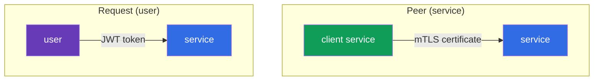
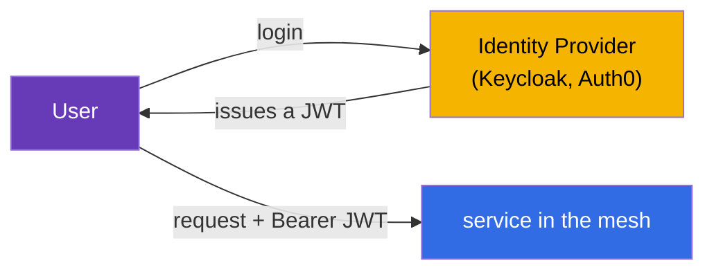
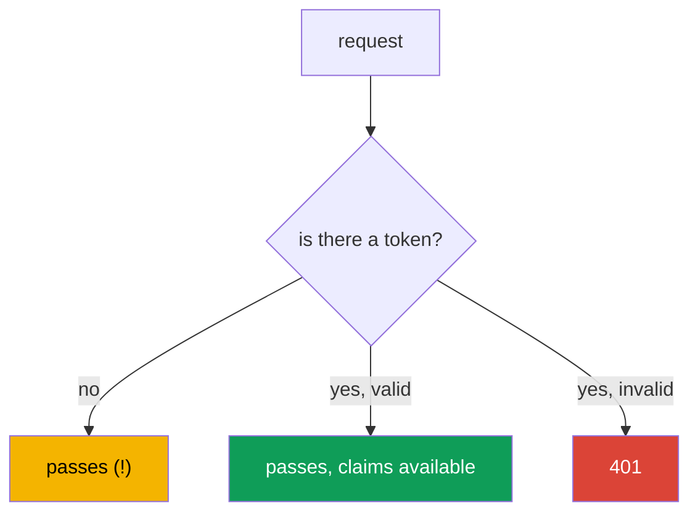
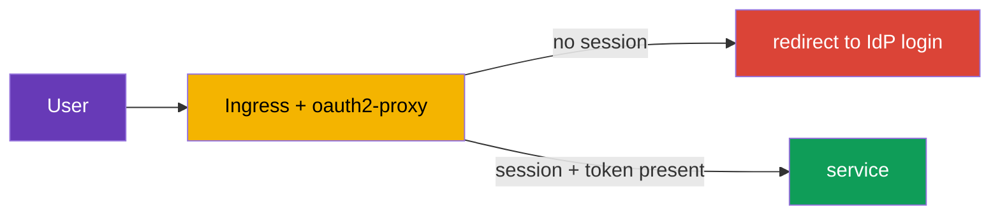
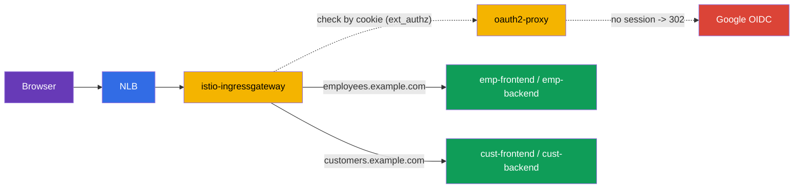

[RU version](ru.md) · [Versión en español](es.md)

# Chapter 15. End-user authentication: RequestAuthentication and JWT

> **What's next.** In chapters 13 and 14 we dealt with the authentication and authorization of
> **services** among themselves (mTLS, PeerAuthentication, AuthorizationPolicy). But there is a
> second type of authentication - the **end user**: when a request carries a token (JWT) issued
> by your Identity Provider, and the service must verify that token. This is the job of
> RequestAuthentication.

## 15.1. Two types of authentication

In Istio it is important to distinguish two "who is this" questions:

- **Peer authentication** - who this **sending service** is. Verified by the mTLS certificate,
  configured via `PeerAuthentication` (chapter 13).
- **Request authentication** - who this **end user** is, on whose behalf the request is made.
  Verified by a token (JWT), configured via `RequestAuthentication`.



These are independent things: a request may simultaneously have both a service's mTLS identity
and a user's JWT. For example, `frontend` (a service) reaches `backend` while carrying the
token of the user who logged in.

## 15.2. What a JWT is

**JWT** (JSON Web Token) is a standard way to pass signed information about a user. The token
consists of three parts separated by dots: `header.payload.signature`.

- **header** - the signing algorithm.
- **payload** - the useful data, the so-called claims: who issued it (`iss`), for whom (`aud`),
  who the user is (`sub`), when it expires (`exp`) and any custom fields (roles, email, etc.).
- **signature** - the signature with which the Identity Provider (Auth0, Keycloak, Google, etc.)
  certifies the token.

The token's authenticity can be verified by its signature, using the provider's public keys.
These keys are published at a standard address in the **JWKS** (JSON Web Key Set) format. Istio
downloads the JWKS itself and verifies the signature - you do not need to decrypt anything by
hand.

## 15.3. Why a JWT is needed and how it is used

The theory is clear, but why all this in practice? Let us go through a real scenario.

**How it works in an application.** The user logs in through an Identity Provider (Keycloak,
Auth0, Google, Okta, etc.) via the OIDC/OAuth2 protocol. In response they get a JWT. Then the
client (browser, mobile app) attaches this token to every request in the `Authorization: Bearer
<token>` header. Services verify the token and understand who the user is and what they may do.



**Why JWT rather than sessions.** Classic server-side sessions require the server to keep
session state and all replicas to have access to it. In microservices this is inconvenient. JWT
solves it differently:

- **The token is self-contained.** All the information about the user is already inside the
  token and certified by the signature. The server does not need to keep sessions and hit the
  database on every request.
- **It works across the whole service chain.** `frontend` got the token and passes it on to
  `orders`, `payments`, etc. Each service can verify the token itself, knowing only the issuer's
  public keys - no need to hit an authorization server on every request.
- **It is a standard.** JWT is part of the OAuth2/OIDC ecosystem, understood by all IdPs and
  libraries.

**Where this is actually used:**

- **Single Sign-On (SSO).** The user logs in once to the corporate Keycloak and moves across all
  internal services with a single token.
- **API access by roles.** The token's claims carry roles or scopes (`role: admin`, `scope:
  orders.write`). Different endpoints require different roles.
- **Multitenancy.** The token carries a tenant identifier (`tenant: acme`), and the service
  returns only that tenant's data.

**Why do this in Istio rather than in every application.** You could, of course, verify the JWT
in each service's code. But then the verification logic (fetching keys, validating the
signature, the expiry) has to be repeated in every language and every service. Istio moves it
into the infrastructure:

- applications **do not write** token-verification code - Envoy does it;
- invalid tokens are cut off **at the entrance**, before the application;
- the issuer and keys are configured **in one place**, not in every service;
- the rules "which role for which endpoint" are described declaratively via
  `AuthorizationPolicy`.

### Example: different users with different rights

Let us go through a typical task in detail. A company has two portals:

- **customer-portal** - for external customers (they view the catalog, their own orders);
- **internal-portal** - for employees (admin panel, product management, reports).

Both are reachable through a single cluster and a single Istio, but different people must be let
into them. Everyone logs in through a single Keycloak, but their tokens have different claims.
For example, a customer's token has `role: customer`, an employee's - `role: employee`, an
administrator's - `role: admin`.

The task is solved like this: Istio verifies the token once, and `AuthorizationPolicy` lets only
the needed roles into each portal.

The customer portal - allow only `customer`:

```yaml
apiVersion: security.istio.io/v1
kind: AuthorizationPolicy
metadata:
  name: customer-portal-access
  namespace: app
spec:
  selector:
    matchLabels:
      app: customer-portal
  action: ALLOW
  rules:
  - from:
    - source:
        requestPrincipals: ["*"]        # a valid token is required
    when:
    - key: request.auth.claims[role]
      values: ["customer"]              # and the role must be customer
```

The internal portal - allow only employees and admins:

```yaml
apiVersion: security.istio.io/v1
kind: AuthorizationPolicy
metadata:
  name: internal-portal-access
  namespace: app
spec:
  selector:
    matchLabels:
      app: internal-portal
  action: ALLOW
  rules:
  - from:
    - source:
        requestPrincipals: ["*"]
    when:
    - key: request.auth.claims[role]
      values: ["employee", "admin"]     # only employees and admins
```

What we get:

- A customer with their token (`role: customer`) gets into customer-portal, but on
  internal-portal gets a `403` - their role is not in the list.
- An employee (`role: employee`) is the opposite: they get into the internal portal, but the
  customer one gives a `403`.
- A user without a token gets nowhere.

Note: the `customer-portal` and `internal-portal` applications themselves **contain no
role-checking code**. They simply receive already-filtered traffic. All the "who may go where"
logic is described declaratively in two `AuthorizationPolicy`s, and Istio did the token
verification. If you want to add a partner portal with the `partner` role - you just write one
more policy, the applications are left untouched.

### And does the application itself know which user came?

A fair question: if Istio does the verification, does the application know who exactly reached
it? Yes, but with an important caveat. By default Istio **validates** the token and does **not
forward** it on to the application (the field `forwardOriginalToken: false` by default) - this
is a common trap: the application expects an `Authorization` header, and it is not there. There
are two ways to give the application the user's identity:

- **`forwardOriginalToken: true`** in `jwtRules` - keep the original token for the upstream, and
  the application parses `Authorization: Bearer <token>` itself;
- **`outputClaimToHeaders`** - extract the needed claims into plain headers (see below), then
  the application does not need the token itself.

Here it is important to separate responsibilities:

- **Istio is responsible for coarse access**: is the token valid? does the role let it into this
  service or endpoint? This is what does not depend on the business logic.
- **The application is responsible for data-level logic**: show exactly *my* orders, personalize
  the response, record in the audit who performed an action. For this the application needs the
  user identifier, and it takes it from the token.

Example: `AuthorizationPolicy` let a user with `role: customer` into customer-portal (coarse
access). But which customer exactly came and which orders to show them - that is decided by the
application, from the `sub` claim (the user identifier) in the token.

So the application does not have to parse the JWT itself, Istio can **extract the needed claims
into plain headers** via `outputClaimToHeaders` in `RequestAuthentication`:

```yaml
apiVersion: security.istio.io/v1
kind: RequestAuthentication
metadata:
  name: jwt-auth
  namespace: app
spec:
  selector:
    matchLabels:
      app: backend                 # which pods it applies to
  jwtRules:
  - issuer: "https://my-idp.example.com"              # who issued the token
    jwksUri: "https://my-idp.example.com/jwks.json"   # where to get the keys for verification
    outputClaimToHeaders:
    - header: x-user-id
      claim: sub          # the application reads the ready header x-user-id
    - header: x-user-email
      claim: email
```

Now the application simply reads the `x-user-id` header, knowing nothing about JWT. Istio already
did the authenticity check, so these headers can be trusted (an external client cannot spoof
them - Istio overwrites them with the values from the verified token).

In sum: Istio takes authentication and coarse authorization off the application, but the user's
identity is still available to the application - for the logic that only the application itself
can know.

## 15.4. RequestAuthentication: verifying a JWT

The `RequestAuthentication` resource tells Istio which tokens to consider valid: from which
issuer and where to get the keys to verify the signature.

```yaml
apiVersion: security.istio.io/v1
kind: RequestAuthentication
metadata:
  name: jwt-auth
  namespace: app
spec:
  selector:
    matchLabels:
      app: backend
  jwtRules:
  - issuer: "https://my-idp.example.com"          # who issued the token
    jwksUri: "https://my-idp.example.com/jwks.json"  # where to get the verification keys
```

What Istio does with this policy:

- if the request **has** a token and it is valid (correct issuer, live signature, not expired) -
  the claims from the token become available to the authorization rules;
- if the token **is present but invalid** (bad signature, wrong issuer, expired) - the request is
  rejected with `401`.

By default the token is taken from the `Authorization: Bearer <token>` header. If your client
puts the token in a non-standard place (a custom header or a query parameter), specify it
explicitly via `fromHeaders` / `fromParams`:

```yaml
  jwtRules:
  - issuer: "https://my-idp.example.com"
    jwksUri: "https://my-idp.example.com/jwks.json"
    fromHeaders:
    - name: x-jwt-token       # token in a custom header
    fromParams:
    - token                   # or in a query parameter ?token=...
```

You can list several sources - Istio checks them in order.

## 15.5. The most important subtlety: without a token the request passes

Here is the main trap everyone trips over. `RequestAuthentication` does **not require** a token
to be present. It only verifies the token **if there is one**. A request with no token at all
passes `RequestAuthentication` just fine.



So `RequestAuthentication` by itself does not protect the service - it only validates tokens. To
**require** a token, you need to pair it with `AuthorizationPolicy`. This is the same principle
as before: one policy verifies, another requires.

## 15.6. Pairing with AuthorizationPolicy

To actually close off the service, we add an `AuthorizationPolicy` that requires a verified user
identity. It is set via `requestPrincipals`:

```yaml
apiVersion: security.istio.io/v1
kind: AuthorizationPolicy
metadata:
  name: require-jwt
  namespace: app
spec:
  selector:
    matchLabels:
      app: backend
  action: ALLOW
  rules:
  - from:
    - source:
        requestPrincipals: ["*"]   # any valid token is required
```

- **`requestPrincipals: ["*"]`** - requires the request to have a verified request identity (i.e.
  a valid JWT). The identity format is `<issuer>/<subject>`. The asterisk means "any valid
  token".
- Now a request without a token gets a `403` from authorization (and with an invalid token - a
  `401` already at the RequestAuthentication stage).

You can require not just the presence of a token but specific claims - for example, a particular
role or issuer - via the `when` block:

```yaml
apiVersion: security.istio.io/v1
kind: AuthorizationPolicy
metadata:
  name: require-jwt-admin
  namespace: app
spec:
  selector:
    matchLabels:
      app: backend
  action: ALLOW
  rules:
  - from:
    - source:
        requestPrincipals: ["*"]        # a valid token is required
    when:
    - key: request.auth.claims[role]    # and the role claim...
      values: ["admin"]                 # ...must be admin
```

The resulting logic for the `backend` service:

- no token -> `403` (AuthorizationPolicy);
- invalid token -> `401` (RequestAuthentication);
- a valid token with the needed claim -> passes.

## 15.7. An expired token: refresh and redirect

Tokens are short-lived (often 5-15 minutes) - this is part of security. What happens when a token
has expired?

**On Istio's side it is simple:** an expired token fails the `exp` claim check, so
`RequestAuthentication` rejects the request with `401` - exactly like any invalid token. For
Istio there is no difference between "bad signature" and "expired token": both are a `401`.

**And here is the important boundary you must clearly understand.** Istio **only verifies**
tokens. It does **not** log users in, does **not** redirect to the IdP login page and does
**not** refresh tokens. Istio is not an OAuth2 client. So "do a redirect for a new token" is not
possible with Istio alone. Getting a new token is a task one level up. There are two main
approaches.

**Approach 1: refresh on the client side (SPA, mobile apps).** On login the client gets not only
a short-lived access token but also a refresh token. When the application gets a `401`, it:

- either exchanges the refresh token for a new access token at the IdP and retries the request;
- or, if the refresh has also expired, redirects the user to the IdP login page.

All this logic lives in the client code, Istio takes no part in it - it just returns `401`, and
the client figures out the rest.

**Approach 2: an auth proxy at the edge (browser applications with sessions).** For classic web
applications it is convenient to move the login redirect into a dedicated proxy at the entrance -
for example, **oauth2-proxy** or an equivalent. It performs the full OIDC flow: redirects an
unauthenticated user to the IdP, keeps the session in a cookie and injects the token into
requests. Istio connects such a proxy via external authorization (`action: CUSTOM` in
`AuthorizationPolicy`, remember from chapter 14).



**Approach 3: login at the cloud edge (ALB, Cloudflare, CloudFront).** The login can be moved even
further out - to the balancer/CDN itself, and then a separate oauth2-proxy is not needed. This
works only where the edge understands L7 and OIDC:

- **AWS ALB - yes, built-in.** A listener rule has the `authenticate-oidc` (and
  `authenticate-cognito`) action: the ALB itself redirects an unauthenticated user to the IdP,
  keeps a session in a cookie and adds a signed JWT to the request in the `x-amzn-oidc-data`
  header (plus `x-amzn-oidc-identity` / `x-amzn-oidc-accesstoken`). Istio then simply **validates
  this JWT** via `RequestAuthentication`. The cost is that an ALB (L7) appears in front of the
  mesh rather than a "clean" NLB.
- **Cloudflare - yes, Cloudflare Access (Zero Trust).** Full SSO/OIDC at the edge; outward it
  issues a signed JWT `Cf-Access-Jwt-Assertion`, and Istio validates it by Cloudflare's JWKS
  (`https://<team>.cloudflareaccess.com/cdn-cgi/access/certs`).
- **CloudFront - not out of the box.** There is no built-in OIDC login; it is done via
  **Lambda@Edge / CloudFront Functions** (your own OIDC code) or Cognito - that is, you still
  write the proxy logic, just as an edge function.
- **NLB - no.** It is L4, no HTTP/OIDC logic; login on it is impossible in principle.

In all the "yes" options Istio's role does not change: the interactive login is done by the edge,
while Istio **verifies the signed JWT** (`RequestAuthentication`) and enforces access
(`AuthorizationPolicy`). The issuer and `jwksUri` in `RequestAuthentication` point to the
respective edge (ALB/Cloudflare), not to the original IdP.

> **Critical - close off bypassing the edge.** If the ingress gateway can be reached **around**
> the ALB/Cloudflare, an attacker will spoof the headers (`x-amzn-oidc-*`, `Cf-Access-*`) and get
> through. So it is mandatory: (1) Istio **verifies the signature** of the edge JWT by JWKS,
> rather than trusting the header at face value; (2) access to the gateway is restricted to the
> edge only - a security group on the CDN/ALB IP, a private NLB, mTLS from the edge, and so on.

**What to choose:** for SPAs and mobile apps the client does the refresh; for server-side browser
applications with sessions - an auth proxy (`oauth2-proxy`) or a login at the cloud edge (ALB
`authenticate-oidc`, Cloudflare Access). In all cases Istio is responsible only for verifying the
JWT and returning `401`, while the redirect and token refresh are up to the client, the auth
proxy or the edge.

> **And why not just do this via a VirtualService on a missing header?**
> The idea is tempting: in a `VirtualService` match `withoutHeaders` (no `Authorization`) and send
> such requests to a "redirector service". Technically the match and even a static `redirect`
> exist in a VirtualService, but as a replacement for an auth proxy it does not work: (1) the
> VirtualService sees only "header present/absent" but does **not check validity** -
> `Authorization: Bearer garbage` passes the match; (2) a browser does not send `Authorization`
> at all on navigation (the session is in a cookie), so the signal is wrong; (3) the full OIDC
> flow (`/callback`, exchanging the `code`, a cookie, PKCE) still has to be implemented by the
> receiving service - and that is exactly oauth2-proxy. For "redirecting the unauthenticated"
> there is `ext_authz` (`action: CUSTOM`), where the decision is made by a component that
> **knows how** to verify, not a match on the presence of a header.

> **Cost: the data path vs a check only.** A common worry is "all the traffic will go through the
> proxy, that is expensive". This is true only for the mode where `oauth2-proxy` stands as a
> **reverse proxy in front of the application** (bodies and responses flow through it). In the
> recommended mode **`ext_authz` (`action: CUSTOM`) keeps the proxy out of the data path**: Envoy
> sends a lightweight check subrequest per request (only headers/cookie, no body), gets
> "allow/`302`" and on success forwards the request **directly to the application**. The payload
> does not go through the proxy. It is made cheaper further: check only at the ingress gateway;
> scope the `CUSTOM` policy to the needed hosts/paths (the admin panel), leaving the public ones
> alone; and after login, when requests carry a valid JWT, switch to `RequestAuthentication` -
> Envoy verifies the signature **locally, without any external calls**. With a login at the cloud
> edge (ALB/Cloudflare) there is no proxy in the data path inside the mesh at all - only local JWT
> validation.

## 15.8. A full example: two portals, login via Google and oauth2-proxy

Let us put it all together on a real scenario. Given:

- The entry into the cluster is **NLB → istio-ingressgateway** (an L4 balancer that cannot do
  login, 15.7).
- Users log in via **Google** (OIDC).
- Two portals on different hosts: **`employees.example.com`** (for employees) and
  **`customers.example.com`** (for customers).
- Each portal has its own **frontend and backend** services.
- Separation: into the employee portal we allow only corporate accounts (`*@company.com`), into
  the customer one - any authenticated Google account.

The login logic is handled by **oauth2-proxy** (Istio cannot redirect to Google itself - the
proxy does that), connected to Istio as external authorization (`ext_authz`, `action: CUSTOM`).
The proxy is **not in the data path**: Envoy only asks it "allow?" by cookie (15.7).



**1. oauth2-proxy: Deployment, Service and Secret** (namespace `auth`). The cookie is set on
`.example.com` so a single session works on both portals; `--email-domain=*` allows any Google
account to log in (the per-portal separation we do below in Istio).

```yaml
apiVersion: v1
kind: Secret
metadata:
  name: oauth2-proxy
  namespace: auth
type: Opaque
stringData:
  client-id: "<google-client-id>"
  client-secret: "<google-client-secret>"
  cookie-secret: "<32-byte-random-secret>"   # openssl rand -base64 32
---
apiVersion: apps/v1
kind: Deployment
metadata:
  name: oauth2-proxy
  namespace: auth
spec:
  replicas: 2
  selector:
    matchLabels: { app: oauth2-proxy }
  template:
    metadata:
      labels: { app: oauth2-proxy }
    spec:
      containers:
      - name: oauth2-proxy
        image: quay.io/oauth2-proxy/oauth2-proxy:v7.6.0
        args:
        - --provider=google
        - --email-domain=*                       # login allowed for any Google account
        - --http-address=0.0.0.0:4180
        - --reverse-proxy=true                   # trust X-Forwarded-* from the ingress
        - --set-xauthrequest=true                # return X-Auth-Request-* in the auth response
        - --cookie-domain=.example.com           # shared session for *.example.com
        - --whitelist-domain=.example.com
        - --redirect-url=https://auth.example.com/oauth2/callback
        - --upstream=static://200
        env:
        - name: OAUTH2_PROXY_CLIENT_ID
          valueFrom: { secretKeyRef: { name: oauth2-proxy, key: client-id } }
        - name: OAUTH2_PROXY_CLIENT_SECRET
          valueFrom: { secretKeyRef: { name: oauth2-proxy, key: client-secret } }
        - name: OAUTH2_PROXY_COOKIE_SECRET
          valueFrom: { secretKeyRef: { name: oauth2-proxy, key: cookie-secret } }
        ports:
        - containerPort: 4180
---
apiVersion: v1
kind: Service
metadata:
  name: oauth2-proxy
  namespace: auth
spec:
  selector: { app: oauth2-proxy }
  ports:
  - name: http
    port: 4180
    targetPort: 4180
```

**2. Register oauth2-proxy as an external authorization provider** in MeshConfig. It is exactly
this that `action: CUSTOM` will reference:

```yaml
apiVersion: install.istio.io/v1alpha1
kind: IstioOperator
spec:
  meshConfig:
    extensionProviders:
    - name: oauth2-proxy
      envoyExtAuthzHttp:
        service: oauth2-proxy.auth.svc.cluster.local
        port: 4180
        includeRequestHeadersInCheck: ["authorization", "cookie"]   # what to send for the check
        headersToUpstreamOnAllow:                                   # what to add to the request on allow
        - "authorization"
        - "x-auth-request-email"
        - "x-auth-request-user"
        headersToDownstreamOnDeny: ["content-type", "set-cookie"]   # for the 302 to login
```

**3. Gateway** on three hosts: the login portal itself (`auth.example.com` → oauth2-proxy) and
the two portals. TLS via `SIMPLE` (chapter 9), certificates - even from cert-manager:

```yaml
apiVersion: networking.istio.io/v1
kind: Gateway
metadata:
  name: portals-gw
  namespace: istio-system
spec:
  selector:
    istio: ingressgateway
  servers:
  - port: { number: 443, name: https, protocol: HTTPS }
    tls: { mode: SIMPLE, credentialName: portals-cert }
    hosts:
    - auth.example.com
    - employees.example.com
    - customers.example.com
```

**4. The VirtualServices.** The host `auth.example.com` goes entirely to oauth2-proxy (that is
where `/oauth2/start`, `/oauth2/callback` live). Each portal: `/api` → backend, everything else
→ frontend.

```yaml
apiVersion: networking.istio.io/v1
kind: VirtualService
metadata:
  name: auth-vs
  namespace: istio-system
spec:
  hosts: ["auth.example.com"]
  gateways: ["portals-gw"]
  http:
  - route:
    - destination:
        host: oauth2-proxy.auth.svc.cluster.local
        port: { number: 4180 }
---
apiVersion: networking.istio.io/v1
kind: VirtualService
metadata:
  name: employees-vs
  namespace: istio-system
spec:
  hosts: ["employees.example.com"]
  gateways: ["portals-gw"]
  http:
  - match: [{ uri: { prefix: /api } }]
    route:
    - destination: { host: emp-backend.portals.svc.cluster.local, port: { number: 8080 } }
  - route:
    - destination: { host: emp-frontend.portals.svc.cluster.local, port: { number: 8080 } }
---
apiVersion: networking.istio.io/v1
kind: VirtualService
metadata:
  name: customers-vs
  namespace: istio-system
spec:
  hosts: ["customers.example.com"]
  gateways: ["portals-gw"]
  http:
  - match: [{ uri: { prefix: /api } }]
    route:
    - destination: { host: cust-backend.portals.svc.cluster.local, port: { number: 8080 } }
  - route:
    - destination: { host: cust-frontend.portals.svc.cluster.local, port: { number: 8080 } }
```

**5. Require login at the entrance** - an `AuthorizationPolicy` with `action: CUSTOM` on the
ingress gateway. It calls oauth2-proxy for all portal hosts, but **not** for the `/oauth2/*`
paths (otherwise the callback cannot log in) and not for `auth.example.com`:

```yaml
apiVersion: security.istio.io/v1
kind: AuthorizationPolicy
metadata:
  name: require-login
  namespace: istio-system
spec:
  selector:
    matchLabels:
      istio: ingressgateway
  action: CUSTOM
  provider:
    name: oauth2-proxy          # the name from extensionProviders (step 2)
  rules:
  - to:
    - operation:
        hosts: ["employees.example.com", "customers.example.com"]
        notPaths: ["/oauth2/*"]   # do not gate the callback/login endpoints
```

After this an unauthenticated user on any portal gets a `302` to the Google login, and after
logging in oauth2-proxy provides the `X-Auth-Request-Email` header on the request (trusted - it
is set by the authorization response, not by the client).

**6. Separate the portals** with ordinary `ALLOW` policies on the services themselves (namespace
`portals`). The customer portal - any logged-in user, the employee portal - only `*@company.com`.
A wildcard is supported in `values`:

```yaml
# employee portal: only corporate addresses
apiVersion: security.istio.io/v1
kind: AuthorizationPolicy
metadata:
  name: employees-only-corp
  namespace: portals
spec:
  selector:
    matchLabels: { portal: employees }   # a label on emp-frontend and emp-backend
  action: ALLOW
  rules:
  - when:
    - key: request.headers[x-auth-request-email]
      values: ["*@company.com"]           # a suffix wildcard
---
# customer portal: being logged in is enough (the header is present)
apiVersion: security.istio.io/v1
kind: AuthorizationPolicy
metadata:
  name: customers-any-authenticated
  namespace: portals
spec:
  selector:
    matchLabels: { portal: customers }
  action: ALLOW
  rules:
  - when:
    - key: request.headers[x-auth-request-email]
      values: ["*"]                        # any non-empty email = logged in
```

**What we get:**

- A customer with a personal Gmail gets into `customers.example.com`, but on
  `employees.example.com` gets a `403` (their email is not `*@company.com`).
- An employee (`ivan@company.com`) gets into both (if that is intended) or restrict the customer
  portal separately.
- An anonymous user - a `302` to the Google login already at the entrance.

**7. Close off header spoofing.** `X-Auth-Request-Email` is trusted only if the client cannot
send it itself. Otherwise someone sends `X-Auth-Request-Email: boss@company.com` and bypasses the
rule from step 6. On the ingress gateway the incoming `x-auth-request-*` must be **stripped**.

A subtlety: it matters **when** to strip. An ordinary `headers.request.remove` in a
VirtualService is not suitable here - it runs in the router **after** `ext_authz` and would strip
the trusted header that oauth2-proxy just set. The stripping must happen **before** the check, so
we use an EnvoyFilter inserted **before** the `ext_authz` filter:

```yaml
apiVersion: networking.istio.io/v1alpha3
kind: EnvoyFilter
metadata:
  name: strip-auth-headers
  namespace: istio-system
spec:
  selector:
    matchLabels:
      istio: ingressgateway
  configPatches:
  - applyTo: HTTP_FILTER
    match:
      context: GATEWAY
      listener:
        filterChain:
          filter:
            name: envoy.filters.network.http_connection_manager
            subFilter:
              name: envoy.filters.http.ext_authz
    patch:
      operation: INSERT_BEFORE          # run BEFORE ext_authz
      value:
        name: envoy.filters.http.lua
        typed_config:
          "@type": type.googleapis.com/envoy.extensions.filters.http.lua.v3.Lua
          inlineCode: |
            function envoy_on_request(handle)
              -- strip everything the client could spoof; the trusted values
              -- will be set by oauth2-proxy via headersToUpstreamOnAllow (step 2)
              handle:headers():remove("x-auth-request-email")
              handle:headers():remove("x-auth-request-user")
              handle:headers():remove("x-auth-request-preferred-username")
              handle:headers():remove("x-auth-request-groups")
            end
```

The filter order becomes: first Lua **removes** the client's `x-auth-request-*`, then `ext_authz`
(oauth2-proxy) on a successful check **sets** them again - now with verified values. Now the
header that reaches the portals can be trusted.

**Passing the identity into the application (for business logic).** For the portals "allow/deny"
is not enough - they need to know **who exactly** logged in: whose orders to show, what to record
in the audit, how to personalize the response. This identity is delivered by the same mechanism.
In step 2 we already listed in `headersToUpstreamOnAllow` the headers that Envoy adds to the
request on a successful check - these are exactly what the application reads:

- `X-Auth-Request-Email` - the user's email;
- `X-Auth-Request-User` - the identifier (`sub`);
- if desired, more: `X-Auth-Request-Preferred-Username`, `X-Auth-Request-Groups`,
  `X-Auth-Request-Access-Token` (the last one - if oauth2-proxy has `--pass-access-token`
  enabled).

That is, `emp-frontend`/`emp-backend` do not parse the JWT and do not go to Google - they just
read the ready `X-Auth-Request-Email` header from the request. To add a new attribute, you enable
the corresponding flag on oauth2-proxy and add the header to `headersToUpstreamOnAllow` (step 2)
- the applications are left untouched.

```yaml
# a fragment of extensionProviders from step 2 - extending the header list
        headersToUpstreamOnAllow:
        - "authorization"
        - "x-auth-request-email"
        - "x-auth-request-user"
        - "x-auth-request-preferred-username"
        - "x-auth-request-groups"
```

The application can trust these headers **only because** the client cannot send them itself - the
incoming `x-auth-request-*` are stripped at the ingress gateway (see the box above about
spoofing). This is the same principle as `outputClaimToHeaders` in 15.3: the mesh did the
authentication and coarse access, and the identity is handed to the application in a plain header.

**A stricter variant.** Instead of trusting the header, you can make oauth2-proxy forward **the
Google ID token itself** (`Authorization: Bearer`), verify it in the mesh via
`RequestAuthentication` (issuer `https://accounts.google.com`, JWKS
`https://www.googleapis.com/oauth2/v3/certs`), and separate the portals by the
`request.auth.claims[hd]` claim (the Google Workspace hosted domain) instead of a header. This
way the identity is confirmed by a cryptographic signature rather than a trusted header. Then the
application too gets all the claims from the verified token (with `forwardOriginalToken: true` or
via `outputClaimToHeaders`, 15.3).

## 15.9. Where to apply: the ingress gateway or the service

`RequestAuthentication` can be attached both to a specific service and to the ingress gateway.

- **On the ingress gateway** - the token is verified at the entrance to the cluster, before the
  traffic reaches the services. Convenient to verify the user once at the edge.
- **On a specific service** - finer control, when different services accept tokens from different
  issuers or some services are public altogether.

In practice the verification is often done on the ingress gateway (a single entry point), while
the internal services trust the traffic that passed the edge (plus they are protected by mTLS and
AuthorizationPolicy among themselves).

## 15.10. Verification and debugging

A JWT setup breaks in predictable ways, and the response codes immediately hint at where to look:

- **`401`** was returned by `RequestAuthentication` - a token is present but invalid: wrong
  `issuer`, expired (`exp`), bad signature, unreachable `jwksUri`.
- **`403 RBAC: access denied`** was returned by `AuthorizationPolicy` - there is no token at all
  (and `requestPrincipals` requires it) or the needed claim in `when` did not match.

Common causes and what to check:

- **The `issuer` does not match** the `iss` claim in the token - they must match character for
  character (a common mistake is an extra/missing slash).
- **The `jwksUri` is unreachable** from the cluster. If the IdP is external and egress is closed
  (`REGISTRY_ONLY`, chapter 12), Istio cannot fetch the keys - a `ServiceEntry` for the IdP host
  is needed.
- **The application does not see the token** - by default it is not forwarded
  (`forwardOriginalToken`, 15.3).
- **A claim does not match** - check the actual token contents by decoding the payload (it is
  base64url), e.g. with `jwt.io` or `cut -d. -f2 | base64 -d`.

The target's sidecar logs, as in chapter 14, show the reason for the denial (`grep -i jwt` /
`rbac`).

## 15.11. Best practices

- **`RequestAuthentication` always paired with `AuthorizationPolicy`.** By itself it does not
  require a token (15.5); without `requestPrincipals` the service stays open to requests without a
  token.
- **A precise `issuer` and an HTTPS `jwksUri`.** The issuer must match `iss` exactly; fetch the
  keys only over HTTPS. Do not hardcode the keys if there is a `jwksUri` - Istio refreshes them
  itself.
- **Do not forward the token without need.** Leave `forwardOriginalToken: false` (the default),
  and give the application only the needed claims via `outputClaimToHeaders` - less risk of the
  token leaking further down the chain.
- **Check not only the presence of a token but the claims too.** `requestPrincipals: ["*"]`
  admits any valid token; for real access restrict by role/audience via `when`.
- **JWT does not replace mTLS.** Request authentication (the user) and peer authentication (the
  service) complement each other: close off services with both STRICT mTLS and JWT.
- **Verification - at the edge.** Validate the token at the ingress gateway (a single point)
  rather than smearing it across all services if there is a single issuer.

## 15.12. Chapter summary

- Istio distinguishes service authentication (peer, mTLS, `PeerAuthentication`) and user
  authentication (request, JWT, `RequestAuthentication`); these are independent mechanisms.
- A JWT is a signed token with claims (iss, sub, aud, exp and custom ones); the signature is
  verified by the issuer's public keys (JWKS).
- JWT is convenient in microservices: self-contained (no server sessions needed), passed along
  the service chain, verified without contacting an authorization server. Used for SSO,
  role-based access, multitenancy.
- JWT verification is moved into Istio so applications do not duplicate it in code and invalid
  tokens are cut off at the entrance.
- An expired token is rejected by Istio with `401`. The login redirect and token refresh are not
  Istio's job: this is done by the client (a refresh token), an auth proxy (oauth2-proxy via
  `action: CUSTOM`) or the cloud edge (ALB `authenticate-oidc`, Cloudflare Access), which issues a
  signed JWT that Istio validates. An NLB (L4) cannot do login.
- The auth proxy does not have to be in the data path: in `ext_authz` mode Envoy sends only a
  lightweight check by headers, while the payload goes straight to the application; after login,
  access is cheapest to verify locally via `RequestAuthentication`. A `withoutHeaders` match in a
  VirtualService does not replace an auth proxy (it checks presence, not validity).
- `RequestAuthentication` defines which tokens are valid (`issuer`, `jwksUri`) and verifies them.
- **A key subtlety:** `RequestAuthentication` by itself does not require a token - a request
  without a token passes. Only a present token is validated (an invalid one -> 401).
- To **require** a token you need an `AuthorizationPolicy` with `requestPrincipals`; specific
  claims are checked via `when`.
- By default Istio does **not forward** the token to the application (`forwardOriginalToken:
  false`); to hand the identity to the application use `forwardOriginalToken: true` or
  `outputClaimToHeaders`.
- By default the token is taken from `Authorization: Bearer`; a non-standard location is set via
  `fromHeaders`/`fromParams`.
- Diagnostics: `401` = an invalid token (`RequestAuthentication`), `403` = no token or the wrong
  claim (`AuthorizationPolicy`); common causes are an `issuer` mismatch, an unreachable `jwksUri`
  (needs egress/ServiceEntry).
- The verification is convenient to do on the ingress gateway (a single entry point) or per
  service.

## 15.13. Self-check questions

1. How does request authentication (the user) differ from peer authentication (the service)?
2. What does a JWT consist of and how does Istio verify its authenticity?
3. Why does `RequestAuthentication` by itself not protect a service?
4. How do you require the presence of a token and how do you check a specific claim?
5. What codes will a service return for a request without a token and with an invalid token (with
   a full setup)?
6. Why is JWT more convenient than server sessions in microservices and why move its verification
   into Istio rather than the code of each application?
7. What will Istio return for an expired token and who is responsible for the login redirect and
   token refresh?
8. Will the application get the JWT by default? How do you pass the user's identity to the
   application?
9. How do the `401` and `403` codes differ in a JWT setup and what are the common causes of each?
10. Can you move OIDC login to ALB / Cloudflare / CloudFront / NLB instead of oauth2-proxy? What
    does Istio do then and how do you protect against bypassing the edge?
11. Why does a `withoutHeaders` match in a VirtualService not replace an auth proxy?
12. Does all the traffic necessarily go through the auth proxy? Why is `ext_authz` cheaper than a
    reverse proxy and how else can you reduce the cost of the check?
13. In the end-to-end example with two portals: how is login via Google implemented, how are the
    portals separated and why is it necessary to strip incoming `x-auth-request-*` headers?

## Practice

Practice JWT verification: RequestAuthentication + AuthorizationPolicy, the behavior without a
token, with an invalid and with a valid token:

🧪 Lab 11: [tasks/ica/labs/11](../../labs/11/README.MD)

---
[Contents](../README.md) · [Chapter 14](../14/en.md) · [Chapter 16](../16/en.md)
