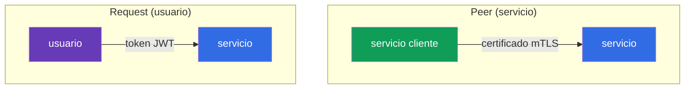
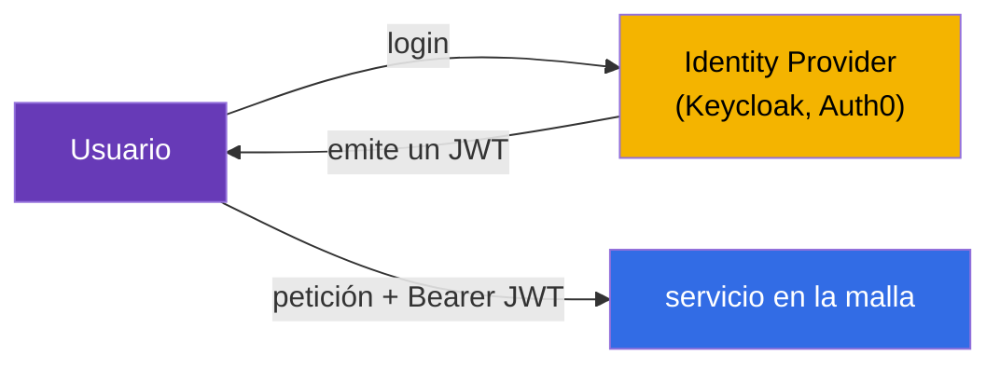
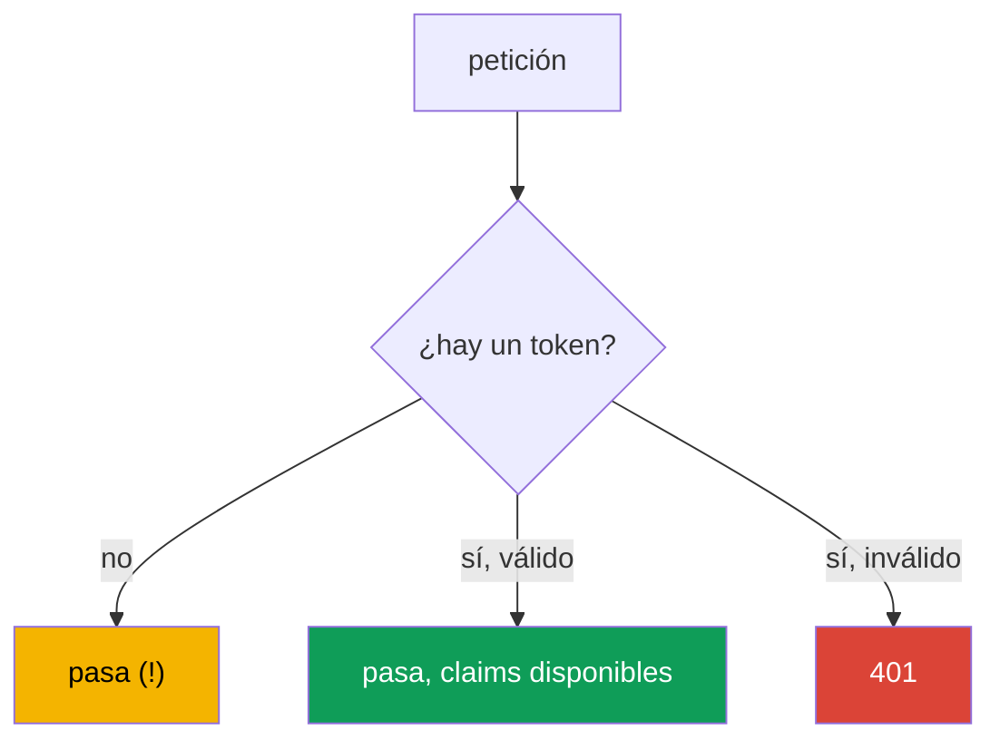
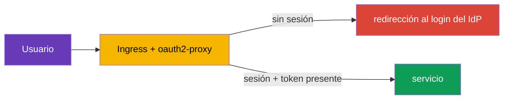
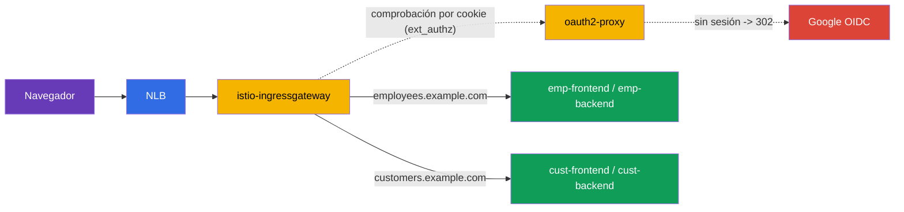

[RU version](ru.md) · [Eng version](en.md) · [Version française](fr.md) · [Deutsche Version](de.md)

# Capítulo 15. Autenticación del usuario final: RequestAuthentication y JWT

> **Qué sigue.** En los capítulos 13 y 14 tratamos la autenticación y la autorización de los
> **servicios** entre sí (mTLS, PeerAuthentication, AuthorizationPolicy). Pero hay un segundo tipo
> de autenticación: el **usuario final**, cuando una petición lleva un token (JWT) emitido por tu
> Identity Provider, y el servicio debe verificar ese token. Este es el trabajo de
> RequestAuthentication.

## 15.1. Dos tipos de autenticación

En Istio es importante distinguir dos preguntas de "quién es esto":

- **Peer authentication**: quién es este **servicio emisor**. Se verifica con el certificado mTLS,
  se configura vía `PeerAuthentication` (capítulo 13).
- **Request authentication**: quién es este **usuario final**, en cuyo nombre se hace la petición.
  Se verifica con un token (JWT), se configura vía `RequestAuthentication`.



Son cosas independientes: una petición puede tener simultáneamente tanto la identidad mTLS de un
servicio como el JWT de un usuario. Por ejemplo, `frontend` (un servicio) alcanza `backend` mientras
lleva el token del usuario que inició sesión.

## 15.2. Qué es un JWT

**JWT** (JSON Web Token) es una forma estándar de pasar información firmada sobre un usuario. El
token consta de tres partes separadas por puntos: `header.payload.signature`.

- **header**: el algoritmo de firma.
- **payload**: los datos útiles, los llamados claims: quién lo emitió (`iss`), para quién (`aud`),
  quién es el usuario (`sub`), cuándo expira (`exp`) y cualquier campo personalizado (roles, email,
  etc.).
- **signature**: la firma con la que el Identity Provider (Auth0, Keycloak, Google, etc.) certifica
  el token.

La autenticidad del token se puede verificar por su firma, usando las claves públicas del
proveedor. Estas claves se publican en una dirección estándar en formato **JWKS** (JSON Web Key
Set). Istio descarga el JWKS por sí mismo y verifica la firma; no necesitas descifrar nada a mano.

## 15.3. Por qué se necesita un JWT y cómo se usa

La teoría está clara, pero ¿para qué todo esto en la práctica? Repasemos un escenario real.

**Cómo funciona en una aplicación.** El usuario inicia sesión a través de un Identity Provider
(Keycloak, Auth0, Google, Okta, etc.) vía el protocolo OIDC/OAuth2. Como respuesta obtiene un JWT.
Luego el cliente (navegador, app móvil) adjunta este token a cada petición en la cabecera
`Authorization: Bearer <token>`. Los servicios verifican el token y entienden quién es el usuario y
qué puede hacer.



**Por qué JWT en lugar de sesiones.** Las sesiones clásicas del lado del servidor requieren que el
servidor mantenga el estado de sesión y que todas las réplicas tengan acceso a él. En microservicios
esto es incómodo. JWT lo resuelve de otra forma:

- **El token es autocontenido.** Toda la información sobre el usuario ya está dentro del token y
  certificada por la firma. El servidor no necesita mantener sesiones ni golpear la base de datos en
  cada petición.
- **Funciona a lo largo de toda la cadena de servicios.** `frontend` obtuvo el token y lo pasa a
  `orders`, `payments`, etc. Cada servicio puede verificar el token por sí mismo, conociendo solo
  las claves públicas del emisor; no hace falta golpear un servidor de autorización en cada
  petición.
- **Es un estándar.** JWT es parte del ecosistema OAuth2/OIDC, entendido por todos los IdP y
  librerías.

**Dónde se usa esto realmente:**

- **Single Sign-On (SSO).** El usuario inicia sesión una vez en el Keycloak corporativo y se mueve
  por todos los servicios internos con un único token.
- **Acceso a API por roles.** Los claims del token llevan roles o scopes (`role: admin`, `scope:
  orders.write`). Distintos endpoints requieren distintos roles.
- **Multitenancy.** El token lleva un identificador de tenant (`tenant: acme`), y el servicio
  devuelve solo los datos de ese tenant.

**Por qué hacer esto en Istio en lugar de en cada aplicación.** Podrías, por supuesto, verificar el
JWT en el código de cada servicio. Pero entonces la lógica de verificación (obtener las claves,
validar la firma, la expiración) hay que repetirla en cada lenguaje y en cada servicio. Istio la
mueve a la infraestructura:

- las aplicaciones **no escriben** código de verificación de tokens; lo hace Envoy;
- los tokens inválidos se cortan **en la entrada**, antes de la aplicación;
- el emisor y las claves se configuran **en un solo sitio**, no en cada servicio;
- las reglas "qué rol para qué endpoint" se describen de forma declarativa vía
  `AuthorizationPolicy`.

### Ejemplo: distintos usuarios con distintos permisos

Repasemos en detalle una tarea típica. Una empresa tiene dos portales:

- **customer-portal**: para clientes externos (ven el catálogo, sus propios pedidos);
- **internal-portal**: para empleados (panel de administración, gestión de productos, informes).

Ambos son alcanzables a través de un único clúster y un único Istio, pero deben entrar personas
distintas. Todos inician sesión a través de un único Keycloak, pero sus tokens tienen claims
distintos. Por ejemplo, el token de un cliente tiene `role: customer`, el de un empleado `role:
employee`, el de un administrador `role: admin`.

La tarea se resuelve así: Istio verifica el token una vez, y `AuthorizationPolicy` deja entrar solo
los roles necesarios en cada portal.

El portal de clientes: permitir solo `customer`:

```yaml
apiVersion: security.istio.io/v1
kind: AuthorizationPolicy
metadata:
  name: customer-portal-access
  namespace: app
spec:
  selector:
    matchLabels:
      app: customer-portal
  action: ALLOW
  rules:
  - from:
    - source:
        requestPrincipals: ["*"]        # se requiere un token válido
    when:
    - key: request.auth.claims[role]
      values: ["customer"]              # y el rol debe ser customer
```

El portal interno: permitir solo a empleados y administradores:

```yaml
apiVersion: security.istio.io/v1
kind: AuthorizationPolicy
metadata:
  name: internal-portal-access
  namespace: app
spec:
  selector:
    matchLabels:
      app: internal-portal
  action: ALLOW
  rules:
  - from:
    - source:
        requestPrincipals: ["*"]
    when:
    - key: request.auth.claims[role]
      values: ["employee", "admin"]     # solo empleados y administradores
```

Lo que obtenemos:

- Un cliente con su token (`role: customer`) entra en customer-portal, pero en internal-portal
  recibe un `403`: su rol no está en la lista.
- Un empleado (`role: employee`) es lo contrario: entra en el portal interno, pero el de clientes le
  da un `403`.
- Un usuario sin token no entra a ninguna parte.

Nota: las propias aplicaciones `customer-portal` e `internal-portal` **no contienen código de
comprobación de roles**. Simplemente reciben tráfico ya filtrado. Toda la lógica de "quién puede ir
a dónde" se describe de forma declarativa en dos `AuthorizationPolicy`, e Istio hizo la verificación
del token. Si quieres añadir un portal de partners con el rol `partner`, solo escribes una política
más; las aplicaciones quedan intactas.

### ¿Y la propia aplicación sabe qué usuario llegó?

Una pregunta justa: si Istio hace la verificación, ¿sabe la aplicación quién exactamente la
alcanzó? Sí, pero con una salvedad importante. Por defecto Istio **valida** el token y **no lo
reenvía** a la aplicación (el campo `forwardOriginalToken: false` por defecto); esta es una trampa
común: la aplicación espera una cabecera `Authorization`, y no está. Hay dos formas de dar a la
aplicación la identidad del usuario:

- **`forwardOriginalToken: true`** en `jwtRules`: conservar el token original para el upstream, y la
  aplicación parsea `Authorization: Bearer <token>` por sí misma;
- **`outputClaimToHeaders`**: extraer los claims necesarios a cabeceras planas (ver abajo), y
  entonces la aplicación no necesita el token en sí.

Aquí es importante separar responsabilidades:

- **Istio es responsable del acceso grueso**: ¿es válido el token? ¿el rol lo deja entrar en este
  servicio o endpoint? Esto es lo que no depende de la lógica de negocio.
- **La aplicación es responsable de la lógica a nivel de datos**: mostrar exactamente *mis* pedidos,
  personalizar la respuesta, registrar en la auditoría quién realizó una acción. Para esto la
  aplicación necesita el identificador del usuario, y lo toma del token.

Ejemplo: `AuthorizationPolicy` dejó entrar en customer-portal a un usuario con `role: customer`
(acceso grueso). Pero qué cliente exactamente llegó y qué pedidos mostrarle, eso lo decide la
aplicación, a partir del claim `sub` (el identificador del usuario) en el token.

Así que la aplicación no tiene que parsear el JWT por sí misma; Istio puede **extraer los claims
necesarios a cabeceras planas** vía `outputClaimToHeaders` en `RequestAuthentication`:

```yaml
apiVersion: security.istio.io/v1
kind: RequestAuthentication
metadata:
  name: jwt-auth
  namespace: app
spec:
  selector:
    matchLabels:
      app: backend                 # a qué pods se aplica
  jwtRules:
  - issuer: "https://my-idp.example.com"              # quién emitió el token
    jwksUri: "https://my-idp.example.com/jwks.json"   # dónde obtener las claves para la verificación
    outputClaimToHeaders:
    - header: x-user-id
      claim: sub          # la aplicación lee la cabecera lista x-user-id
    - header: x-user-email
      claim: email
```

Ahora la aplicación simplemente lee la cabecera `x-user-id`, sin saber nada de JWT. Istio ya hizo la
comprobación de autenticidad, así que estas cabeceras se pueden confiar (un cliente externo no puede
suplantarlas: Istio las sobrescribe con los valores del token verificado).

En resumen: Istio quita a la aplicación la autenticación y la autorización gruesa, pero la identidad
del usuario sigue estando disponible para la aplicación, para la lógica que solo la propia
aplicación puede conocer.

## 15.4. RequestAuthentication: verificar un JWT

El recurso `RequestAuthentication` le dice a Istio qué tokens considerar válidos: de qué emisor y
dónde obtener las claves para verificar la firma.

```yaml
apiVersion: security.istio.io/v1
kind: RequestAuthentication
metadata:
  name: jwt-auth
  namespace: app
spec:
  selector:
    matchLabels:
      app: backend
  jwtRules:
  - issuer: "https://my-idp.example.com"          # quién emitió el token
    jwksUri: "https://my-idp.example.com/jwks.json"  # dónde obtener las claves de verificación
```

Qué hace Istio con esta política:

- si la petición **tiene** un token y es válido (emisor correcto, firma viva, no expirado), los
  claims del token quedan disponibles para las reglas de autorización;
- si el token **está presente pero es inválido** (firma mala, emisor equivocado, expirado), la
  petición se rechaza con `401`.

Por defecto el token se toma de la cabecera `Authorization: Bearer <token>`. Si tu cliente coloca el
token en un sitio no estándar (una cabecera personalizada o un parámetro de query), especifícalo
explícitamente vía `fromHeaders` / `fromParams`:

```yaml
  jwtRules:
  - issuer: "https://my-idp.example.com"
    jwksUri: "https://my-idp.example.com/jwks.json"
    fromHeaders:
    - name: x-jwt-token       # token en una cabecera personalizada
    fromParams:
    - token                   # o en un parámetro de query ?token=...
```

Puedes listar varias fuentes; Istio las comprueba en orden.

## 15.5. La sutileza más importante: sin token la petición pasa

Aquí está la trampa principal con la que todos tropiezan. `RequestAuthentication` **no requiere** que
haya un token presente. Solo verifica el token **si lo hay**. Una petición sin token alguno pasa
`RequestAuthentication` sin problema.



Así que `RequestAuthentication` por sí solo no protege el servicio: solo valida tokens. Para
**requerir** un token, hay que emparejarlo con `AuthorizationPolicy`. Este es el mismo principio que
antes: una política verifica, otra requiere.

## 15.6. Emparejamiento con AuthorizationPolicy

Para cerrar realmente el servicio, añadimos una `AuthorizationPolicy` que requiere una identidad de
usuario verificada. Se fija vía `requestPrincipals`:

```yaml
apiVersion: security.istio.io/v1
kind: AuthorizationPolicy
metadata:
  name: require-jwt
  namespace: app
spec:
  selector:
    matchLabels:
      app: backend
  action: ALLOW
  rules:
  - from:
    - source:
        requestPrincipals: ["*"]   # se requiere cualquier token válido
```

- **`requestPrincipals: ["*"]`**: requiere que la petición tenga una identidad de request verificada
  (es decir, un JWT válido). El formato de la identidad es `<issuer>/<subject>`. El asterisco
  significa "cualquier token válido".
- Ahora una petición sin token recibe un `403` de la autorización (y con un token inválido, un `401`
  ya en la etapa de RequestAuthentication).

Puedes requerir no solo la presencia de un token sino claims concretos (por ejemplo, un rol o emisor
particular) vía el bloque `when`:

```yaml
apiVersion: security.istio.io/v1
kind: AuthorizationPolicy
metadata:
  name: require-jwt-admin
  namespace: app
spec:
  selector:
    matchLabels:
      app: backend
  action: ALLOW
  rules:
  - from:
    - source:
        requestPrincipals: ["*"]        # se requiere un token válido
    when:
    - key: request.auth.claims[role]    # y el claim role...
      values: ["admin"]                 # ...debe ser admin
```

La lógica resultante para el servicio `backend`:

- sin token -> `403` (AuthorizationPolicy);
- token inválido -> `401` (RequestAuthentication);
- un token válido con el claim necesario -> pasa.

## 15.7. Un token expirado: refresco y redirección

Los tokens son de vida corta (a menudo 5-15 minutos): esto es parte de la seguridad. ¿Qué pasa
cuando un token ha expirado?

**Del lado de Istio es simple:** un token expirado falla la comprobación del claim `exp`, así que
`RequestAuthentication` rechaza la petición con `401`, exactamente como cualquier token inválido.
Para Istio no hay diferencia entre "firma mala" y "token expirado": ambos son un `401`.

**Y aquí está el límite importante que debes entender con claridad.** Istio **solo verifica**
tokens. **No** inicia sesión de usuarios, **no** redirige a la página de login del IdP y **no**
refresca tokens. Istio no es un cliente OAuth2. Así que "hacer una redirección para un token nuevo"
no es posible solo con Istio. Obtener un token nuevo es una tarea un nivel más arriba. Hay dos
enfoques principales.

**Enfoque 1: refresco del lado del cliente (SPA, apps móviles).** Al iniciar sesión el cliente
obtiene no solo un access token de vida corta sino también un refresh token. Cuando la aplicación
recibe un `401`:

- o bien intercambia el refresh token por un nuevo access token en el IdP y reintenta la petición;
- o bien, si el refresh también ha expirado, redirige al usuario a la página de login del IdP.

Toda esta lógica vive en el código del cliente, Istio no participa en ella: solo devuelve `401`, y
el cliente resuelve el resto.

**Enfoque 2: un auth proxy en el borde (aplicaciones de navegador con sesiones).** Para
aplicaciones web clásicas es conveniente mover la redirección de login a un proxy dedicado en la
entrada, por ejemplo **oauth2-proxy** o un equivalente. Realiza el flujo OIDC completo: redirige a
un usuario no autenticado al IdP, mantiene la sesión en una cookie e inyecta el token en las
peticiones. Istio conecta tal proxy vía autorización externa (`action: CUSTOM` en
`AuthorizationPolicy`, recuerda del capítulo 14).



**Enfoque 3: login en el borde de la nube (ALB, Cloudflare, CloudFront).** El login se puede mover
aún más afuera, al propio balanceador/CDN, y entonces no hace falta un oauth2-proxy aparte. Esto
funciona solo donde el borde entiende L7 y OIDC:

- **AWS ALB: sí, integrado.** Una regla de listener tiene la acción `authenticate-oidc` (y
  `authenticate-cognito`): el propio ALB redirige a un usuario no autenticado al IdP, mantiene una
  sesión en una cookie y añade un JWT firmado a la petición en la cabecera `x-amzn-oidc-data` (más
  `x-amzn-oidc-identity` / `x-amzn-oidc-accesstoken`). Istio simplemente **valida este JWT** vía
  `RequestAuthentication`. El coste es que aparece un ALB (L7) delante de la malla en lugar de un
  NLB "limpio".
- **Cloudflare: sí, Cloudflare Access (Zero Trust).** SSO/OIDC completo en el borde; hacia afuera
  emite un JWT firmado `Cf-Access-Jwt-Assertion`, e Istio lo valida por el JWKS de Cloudflare
  (`https://<team>.cloudflareaccess.com/cdn-cgi/access/certs`).
- **CloudFront: no de fábrica.** No hay login OIDC integrado; se hace vía **Lambda@Edge / CloudFront
  Functions** (tu propio código OIDC) o Cognito; es decir, sigues escribiendo la lógica del proxy,
  solo que como una función de edge.
- **NLB: no.** Es L4, sin lógica HTTP/OIDC; el login en él es imposible en principio.

En todas las opciones "sí" el papel de Istio no cambia: el login interactivo lo hace el borde,
mientras que Istio **verifica el JWT firmado** (`RequestAuthentication`) y aplica el acceso
(`AuthorizationPolicy`). El emisor y el `jwksUri` en `RequestAuthentication` apuntan al borde
correspondiente (ALB/Cloudflare), no al IdP original.

> **Crítico: cierra el bypass del borde.** Si al ingress gateway se puede llegar **rodeando** el
> ALB/Cloudflare, un atacante suplantará las cabeceras (`x-amzn-oidc-*`, `Cf-Access-*`) y pasará.
> Así que es obligatorio: (1) Istio **verifica la firma** del JWT del borde por JWKS, en lugar de
> confiar en la cabecera a ciegas; (2) el acceso al gateway se restringe solo al borde: un security
> group sobre la IP del CDN/ALB, un NLB privado, mTLS desde el borde, etc.

**Qué elegir:** para SPA y apps móviles el cliente hace el refresco; para aplicaciones de navegador
del lado del servidor con sesiones, un auth proxy (`oauth2-proxy`) o un login en el borde de la nube
(ALB `authenticate-oidc`, Cloudflare Access). En todos los casos Istio es responsable solo de
verificar el JWT y devolver `401`, mientras que la redirección y el refresco del token corren a
cargo del cliente, el auth proxy o el borde.

> **¿Y por qué no hacer esto simplemente vía un VirtualService sobre una cabecera ausente?**
> La idea es tentadora: en un `VirtualService` hacer match con `withoutHeaders` (sin `Authorization`)
> y enviar tales peticiones a un "servicio redirector". Técnicamente el match e incluso un `redirect`
> estático existen en un VirtualService, pero como reemplazo de un auth proxy no funciona: (1) el
> VirtualService ve solo "cabecera presente/ausente" pero **no comprueba la validez**:
> `Authorization: Bearer garbage` pasa el match; (2) un navegador no envía `Authorization` en
> absoluto en la navegación (la sesión está en una cookie), así que la señal es errónea; (3) el flujo
> OIDC completo (`/callback`, intercambiar el `code`, una cookie, PKCE) todavía tiene que
> implementarlo el servicio receptor, y eso es exactamente oauth2-proxy. Para "redirigir al no
> autenticado" está `ext_authz` (`action: CUSTOM`), donde la decisión la toma un componente que
> **sabe cómo** verificar, no un match sobre la presencia de una cabecera.

> **Coste: la ruta de datos vs solo una comprobación.** Una preocupación común es "todo el tráfico
> pasará por el proxy, eso es caro". Esto es cierto solo para el modo en que `oauth2-proxy` está
> como un **reverse proxy delante de la aplicación** (los cuerpos y las respuestas fluyen por él). En
> el modo recomendado **`ext_authz` (`action: CUSTOM`) mantiene al proxy fuera de la ruta de
> datos**: Envoy envía una subpetición de comprobación ligera por petición (solo cabeceras/cookie,
> sin cuerpo), obtiene "permitir/`302`" y, si tiene éxito, reenvía la petición **directamente a la
> aplicación**. La carga útil no pasa por el proxy. Se abarata aún más: comprobar solo en el ingress
> gateway; acotar la política `CUSTOM` a los hosts/rutas necesarios (el panel de administración),
> dejando en paz los públicos; y tras el login, cuando las peticiones llevan un JWT válido, cambiar a
> `RequestAuthentication`: Envoy verifica la firma **localmente, sin llamadas externas**. Con un
> login en el borde de la nube (ALB/Cloudflare) no hay proxy alguno en la ruta de datos dentro de la
> malla, solo validación local del JWT.

## 15.8. Un ejemplo completo: dos portales, login vía Google y oauth2-proxy

Juntémoslo todo en un escenario real. Dado:

- La entrada al clúster es **NLB → istio-ingressgateway** (un balanceador L4 que no puede hacer
  login, 15.7).
- Los usuarios inician sesión vía **Google** (OIDC).
- Dos portales en distintos hosts: **`employees.example.com`** (para empleados) y
  **`customers.example.com`** (para clientes).
- Cada portal tiene sus propios servicios **frontend y backend**.
- Separación: en el portal de empleados permitimos solo cuentas corporativas (`*@company.com`), en
  el de clientes, cualquier cuenta de Google autenticada.

La lógica de login la maneja **oauth2-proxy** (Istio no puede redirigir a Google por sí mismo, eso
lo hace el proxy), conectado a Istio como autorización externa (`ext_authz`, `action: CUSTOM`). El
proxy **no está en la ruta de datos**: Envoy solo le pregunta "¿permitir?" por cookie (15.7).



**1. oauth2-proxy: Deployment, Service y Secret** (namespace `auth`). La cookie se fija en
`.example.com` para que una única sesión funcione en ambos portales; `--email-domain=*` permite que
cualquier cuenta de Google inicie sesión (la separación por portal la hacemos abajo en Istio).

```yaml
apiVersion: v1
kind: Secret
metadata:
  name: oauth2-proxy
  namespace: auth
type: Opaque
stringData:
  client-id: "<google-client-id>"
  client-secret: "<google-client-secret>"
  cookie-secret: "<32-byte-random-secret>"   # openssl rand -base64 32
---
apiVersion: apps/v1
kind: Deployment
metadata:
  name: oauth2-proxy
  namespace: auth
spec:
  replicas: 2
  selector:
    matchLabels: { app: oauth2-proxy }
  template:
    metadata:
      labels: { app: oauth2-proxy }
    spec:
      containers:
      - name: oauth2-proxy
        image: quay.io/oauth2-proxy/oauth2-proxy:v7.6.0
        args:
        - --provider=google
        - --email-domain=*                       # login permitido para cualquier cuenta de Google
        - --http-address=0.0.0.0:4180
        - --reverse-proxy=true                   # confiar en X-Forwarded-* del ingress
        - --set-xauthrequest=true                # devolver X-Auth-Request-* en la respuesta de auth
        - --cookie-domain=.example.com           # sesión compartida para *.example.com
        - --whitelist-domain=.example.com
        - --redirect-url=https://auth.example.com/oauth2/callback
        - --upstream=static://200
        env:
        - name: OAUTH2_PROXY_CLIENT_ID
          valueFrom: { secretKeyRef: { name: oauth2-proxy, key: client-id } }
        - name: OAUTH2_PROXY_CLIENT_SECRET
          valueFrom: { secretKeyRef: { name: oauth2-proxy, key: client-secret } }
        - name: OAUTH2_PROXY_COOKIE_SECRET
          valueFrom: { secretKeyRef: { name: oauth2-proxy, key: cookie-secret } }
        ports:
        - containerPort: 4180
---
apiVersion: v1
kind: Service
metadata:
  name: oauth2-proxy
  namespace: auth
spec:
  selector: { app: oauth2-proxy }
  ports:
  - name: http
    port: 4180
    targetPort: 4180
```

**2. Registra oauth2-proxy como un proveedor de autorización externa** en MeshConfig. Es
exactamente a esto a lo que hará referencia `action: CUSTOM`:

```yaml
apiVersion: install.istio.io/v1alpha1
kind: IstioOperator
spec:
  meshConfig:
    extensionProviders:
    - name: oauth2-proxy
      envoyExtAuthzHttp:
        service: oauth2-proxy.auth.svc.cluster.local
        port: 4180
        includeRequestHeadersInCheck: ["authorization", "cookie"]   # qué enviar para la comprobación
        headersToUpstreamOnAllow:                                   # qué añadir a la petición al permitir
        - "authorization"
        - "x-auth-request-email"
        - "x-auth-request-user"
        headersToDownstreamOnDeny: ["content-type", "set-cookie"]   # para el 302 al login
```

**3. Gateway** en tres hosts: el propio portal de login (`auth.example.com` → oauth2-proxy) y los
dos portales. TLS vía `SIMPLE` (capítulo 9), certificados incluso de cert-manager:

```yaml
apiVersion: networking.istio.io/v1
kind: Gateway
metadata:
  name: portals-gw
  namespace: istio-system
spec:
  selector:
    istio: ingressgateway
  servers:
  - port: { number: 443, name: https, protocol: HTTPS }
    tls: { mode: SIMPLE, credentialName: portals-cert }
    hosts:
    - auth.example.com
    - employees.example.com
    - customers.example.com
```

**4. Los VirtualServices.** El host `auth.example.com` va enteramente a oauth2-proxy (ahí es donde
viven `/oauth2/start`, `/oauth2/callback`). Cada portal: `/api` → backend, todo lo demás → frontend.

```yaml
apiVersion: networking.istio.io/v1
kind: VirtualService
metadata:
  name: auth-vs
  namespace: istio-system
spec:
  hosts: ["auth.example.com"]
  gateways: ["portals-gw"]
  http:
  - route:
    - destination:
        host: oauth2-proxy.auth.svc.cluster.local
        port: { number: 4180 }
---
apiVersion: networking.istio.io/v1
kind: VirtualService
metadata:
  name: employees-vs
  namespace: istio-system
spec:
  hosts: ["employees.example.com"]
  gateways: ["portals-gw"]
  http:
  - match: [{ uri: { prefix: /api } }]
    route:
    - destination: { host: emp-backend.portals.svc.cluster.local, port: { number: 8080 } }
  - route:
    - destination: { host: emp-frontend.portals.svc.cluster.local, port: { number: 8080 } }
---
apiVersion: networking.istio.io/v1
kind: VirtualService
metadata:
  name: customers-vs
  namespace: istio-system
spec:
  hosts: ["customers.example.com"]
  gateways: ["portals-gw"]
  http:
  - match: [{ uri: { prefix: /api } }]
    route:
    - destination: { host: cust-backend.portals.svc.cluster.local, port: { number: 8080 } }
  - route:
    - destination: { host: cust-frontend.portals.svc.cluster.local, port: { number: 8080 } }
```

**5. Requiere login en la entrada**: una `AuthorizationPolicy` con `action: CUSTOM` en el ingress
gateway. Llama a oauth2-proxy para todos los hosts de portal, pero **no** para las rutas `/oauth2/*`
(de lo contrario el callback no puede iniciar sesión) y no para `auth.example.com`:

```yaml
apiVersion: security.istio.io/v1
kind: AuthorizationPolicy
metadata:
  name: require-login
  namespace: istio-system
spec:
  selector:
    matchLabels:
      istio: ingressgateway
  action: CUSTOM
  provider:
    name: oauth2-proxy          # el nombre de extensionProviders (paso 2)
  rules:
  - to:
    - operation:
        hosts: ["employees.example.com", "customers.example.com"]
        notPaths: ["/oauth2/*"]   # no filtrar los endpoints de callback/login
```

Tras esto un usuario no autenticado en cualquier portal recibe un `302` al login de Google, y tras
iniciar sesión oauth2-proxy proporciona la cabecera `X-Auth-Request-Email` en la petición (de
confianza: la fija la respuesta de autorización, no el cliente).

**6. Separa los portales** con políticas `ALLOW` ordinarias en los propios servicios (namespace
`portals`). El portal de clientes: cualquier usuario con sesión iniciada; el portal de empleados:
solo `*@company.com`. Se admite un comodín en `values`:

```yaml
# portal de empleados: solo direcciones corporativas
apiVersion: security.istio.io/v1
kind: AuthorizationPolicy
metadata:
  name: employees-only-corp
  namespace: portals
spec:
  selector:
    matchLabels: { portal: employees }   # una etiqueta en emp-frontend y emp-backend
  action: ALLOW
  rules:
  - when:
    - key: request.headers[x-auth-request-email]
      values: ["*@company.com"]           # un comodín de sufijo
---
# portal de clientes: basta con tener la sesión iniciada (la cabecera está presente)
apiVersion: security.istio.io/v1
kind: AuthorizationPolicy
metadata:
  name: customers-any-authenticated
  namespace: portals
spec:
  selector:
    matchLabels: { portal: customers }
  action: ALLOW
  rules:
  - when:
    - key: request.headers[x-auth-request-email]
      values: ["*"]                        # cualquier email no vacío = con sesión iniciada
```

**Lo que obtenemos:**

- Un cliente con un Gmail personal entra en `customers.example.com`, pero en `employees.example.com`
  recibe un `403` (su email no es `*@company.com`).
- Un empleado (`ivan@company.com`) entra en ambos (si es lo deseado) o restringe el portal de
  clientes por separado.
- Un usuario anónimo: un `302` al login de Google ya en la entrada.

**7. Cierra la suplantación de cabeceras.** `X-Auth-Request-Email` es de confianza solo si el
cliente no puede enviarla él mismo. De lo contrario alguien envía `X-Auth-Request-Email:
boss@company.com` y sortea la regla del paso 6. En el ingress gateway las `x-auth-request-*`
entrantes deben ser **eliminadas**.

Una sutileza: importa **cuándo** eliminarlas. Un `headers.request.remove` ordinario en un
VirtualService no sirve aquí: se ejecuta en el router **después** de `ext_authz` y eliminaría la
cabecera de confianza que oauth2-proxy acaba de fijar. La eliminación debe ocurrir **antes** de la
comprobación, así que usamos un EnvoyFilter insertado **antes** del filtro `ext_authz`:

```yaml
apiVersion: networking.istio.io/v1alpha3
kind: EnvoyFilter
metadata:
  name: strip-auth-headers
  namespace: istio-system
spec:
  selector:
    matchLabels:
      istio: ingressgateway
  configPatches:
  - applyTo: HTTP_FILTER
    match:
      context: GATEWAY
      listener:
        filterChain:
          filter:
            name: envoy.filters.network.http_connection_manager
            subFilter:
              name: envoy.filters.http.ext_authz
    patch:
      operation: INSERT_BEFORE          # ejecutar ANTES de ext_authz
      value:
        name: envoy.filters.http.lua
        typed_config:
          "@type": type.googleapis.com/envoy.extensions.filters.http.lua.v3.Lua
          inlineCode: |
            function envoy_on_request(handle)
              -- elimina todo lo que el cliente podría suplantar; los valores de confianza
              -- los fijará oauth2-proxy vía headersToUpstreamOnAllow (paso 2)
              handle:headers():remove("x-auth-request-email")
              handle:headers():remove("x-auth-request-user")
              handle:headers():remove("x-auth-request-preferred-username")
              handle:headers():remove("x-auth-request-groups")
            end
```

El orden de los filtros pasa a ser: primero Lua **elimina** las `x-auth-request-*` del cliente,
luego `ext_authz` (oauth2-proxy) en una comprobación exitosa las **fija** de nuevo, ahora con
valores verificados. Ahora la cabecera que llega a los portales se puede confiar.

**Pasar la identidad a la aplicación (para la lógica de negocio).** Para los portales "permitir/
denegar" no basta: necesitan saber **quién exactamente** inició sesión: qué pedidos mostrar, qué
registrar en la auditoría, cómo personalizar la respuesta. Esta identidad la entrega el mismo
mecanismo. En el paso 2 ya listamos en `headersToUpstreamOnAllow` las cabeceras que Envoy añade a la
petición en una comprobación exitosa; estas son exactamente las que lee la aplicación:

- `X-Auth-Request-Email`: el email del usuario;
- `X-Auth-Request-User`: el identificador (`sub`);
- si se desea, más: `X-Auth-Request-Preferred-Username`, `X-Auth-Request-Groups`,
  `X-Auth-Request-Access-Token` (esta última, si oauth2-proxy tiene `--pass-access-token`
  habilitado).

Es decir, `emp-frontend`/`emp-backend` no parsean el JWT ni van a Google: solo leen de la petición
la cabecera lista `X-Auth-Request-Email`. Para añadir un atributo nuevo, habilitas el flag
correspondiente en oauth2-proxy y añades la cabecera a `headersToUpstreamOnAllow` (paso 2); las
aplicaciones quedan intactas.

```yaml
# un fragmento de extensionProviders del paso 2 - ampliando la lista de cabeceras
        headersToUpstreamOnAllow:
        - "authorization"
        - "x-auth-request-email"
        - "x-auth-request-user"
        - "x-auth-request-preferred-username"
        - "x-auth-request-groups"
```

La aplicación puede confiar en estas cabeceras **solo porque** el cliente no puede enviarlas él
mismo: las `x-auth-request-*` entrantes se eliminan en el ingress gateway (ver el recuadro de arriba
sobre la suplantación). Este es el mismo principio que `outputClaimToHeaders` en 15.3: la malla hizo
la autenticación y el acceso grueso, y la identidad se entrega a la aplicación en una cabecera
plana.

**Una variante más estricta.** En lugar de confiar en la cabecera, puedes hacer que oauth2-proxy
reenvíe **el propio ID token de Google** (`Authorization: Bearer`), verificarlo en la malla vía
`RequestAuthentication` (issuer `https://accounts.google.com`, JWKS
`https://www.googleapis.com/oauth2/v3/certs`), y separar los portales por el claim
`request.auth.claims[hd]` (el hosted domain de Google Workspace) en lugar de una cabecera. Así la
identidad se confirma con una firma criptográfica en lugar de una cabecera de confianza. Entonces la
aplicación también obtiene todos los claims del token verificado (con `forwardOriginalToken: true` o
vía `outputClaimToHeaders`, 15.3).

## 15.9. Dónde aplicar: el ingress gateway o el servicio

`RequestAuthentication` se puede asociar tanto a un servicio concreto como al ingress gateway.

- **En el ingress gateway**: el token se verifica en la entrada al clúster, antes de que el tráfico
  llegue a los servicios. Cómodo para verificar al usuario una vez en el borde.
- **En un servicio concreto**: control más fino, cuando distintos servicios aceptan tokens de
  distintos emisores o algunos servicios son públicos del todo.

En la práctica la verificación se hace a menudo en el ingress gateway (un único punto de entrada),
mientras que los servicios internos confían en el tráfico que pasó el borde (además de estar
protegidos por mTLS y AuthorizationPolicy entre sí).

## 15.10. Verificación y depuración

Una configuración de JWT se rompe de formas predecibles, y los códigos de respuesta pistan de
inmediato dónde mirar:

- **`401`** lo devolvió `RequestAuthentication`: hay un token presente pero inválido: `issuer`
  equivocado, expirado (`exp`), firma mala, `jwksUri` inalcanzable.
- **`403 RBAC: access denied`** lo devolvió `AuthorizationPolicy`: no hay ningún token (y
  `requestPrincipals` lo requiere) o el claim necesario en `when` no coincidió.

Causas comunes y qué comprobar:

- **El `issuer` no coincide** con el claim `iss` del token: deben coincidir carácter por carácter
  (un error común es una barra de más o de menos).
- **El `jwksUri` es inalcanzable** desde el clúster. Si el IdP es externo y el egress está cerrado
  (`REGISTRY_ONLY`, capítulo 12), Istio no puede obtener las claves: hace falta un `ServiceEntry`
  para el host del IdP.
- **La aplicación no ve el token**: por defecto no se reenvía (`forwardOriginalToken`, 15.3).
- **Un claim no coincide**: comprueba el contenido real del token decodificando el payload (es
  base64url), por ejemplo con `jwt.io` o `cut -d. -f2 | base64 -d`.

Los logs del sidecar del destino, como en el capítulo 14, muestran el motivo de la denegación (`grep
-i jwt` / `rbac`).

## 15.11. Buenas prácticas

- **`RequestAuthentication` siempre emparejado con `AuthorizationPolicy`.** Por sí solo no requiere
  un token (15.5); sin `requestPrincipals` el servicio queda abierto a peticiones sin token.
- **Un `issuer` preciso y un `jwksUri` HTTPS.** El issuer debe coincidir con `iss` exactamente;
  obtén las claves solo por HTTPS. No codifiques las claves a mano si hay un `jwksUri`: Istio las
  refresca por sí mismo.
- **No reenvíes el token sin necesidad.** Deja `forwardOriginalToken: false` (el valor por
  defecto), y da a la aplicación solo los claims necesarios vía `outputClaimToHeaders`: menos riesgo
  de que el token se filtre más abajo en la cadena.
- **Comprueba no solo la presencia de un token sino también los claims.** `requestPrincipals:
  ["*"]` admite cualquier token válido; para un acceso real restringe por rol/audience vía `when`.
- **JWT no reemplaza a mTLS.** La request authentication (el usuario) y la peer authentication (el
  servicio) se complementan: cierra los servicios con mTLS STRICT y con JWT a la vez.
- **Verificación en el borde.** Valida el token en el ingress gateway (un único punto) en lugar de
  esparcirlo por todos los servicios si hay un único emisor.

## 15.12. Resumen del capítulo

- Istio distingue la autenticación de servicios (peer, mTLS, `PeerAuthentication`) y la
  autenticación de usuarios (request, JWT, `RequestAuthentication`); son mecanismos independientes.
- Un JWT es un token firmado con claims (iss, sub, aud, exp y personalizados); la firma se verifica
  con las claves públicas del emisor (JWKS).
- JWT es cómodo en microservicios: autocontenido (no hacen falta sesiones de servidor), se pasa a lo
  largo de la cadena de servicios, se verifica sin contactar con un servidor de autorización. Se usa
  para SSO, acceso basado en roles, multitenancy.
- La verificación del JWT se mueve a Istio para que las aplicaciones no la dupliquen en el código y
  los tokens inválidos se corten en la entrada.
- Un token expirado lo rechaza Istio con `401`. La redirección de login y el refresco del token no
  son trabajo de Istio: lo hace el cliente (un refresh token), un auth proxy (oauth2-proxy vía
  `action: CUSTOM`) o el borde de la nube (ALB `authenticate-oidc`, Cloudflare Access), que emite un
  JWT firmado que Istio valida. Un NLB (L4) no puede hacer login.
- El auth proxy no tiene por qué estar en la ruta de datos: en modo `ext_authz` Envoy envía solo una
  comprobación ligera por cabeceras, mientras la carga útil va directa a la aplicación; tras el
  login, el acceso es más barato de verificar localmente vía `RequestAuthentication`. Un match
  `withoutHeaders` en un VirtualService no reemplaza a un auth proxy (comprueba la presencia, no la
  validez).
- `RequestAuthentication` define qué tokens son válidos (`issuer`, `jwksUri`) y los verifica.
- **Una sutileza clave:** `RequestAuthentication` por sí solo no requiere un token; una petición sin
  token pasa. Solo se valida un token presente (uno inválido -> 401).
- Para **requerir** un token hace falta una `AuthorizationPolicy` con `requestPrincipals`; los
  claims concretos se comprueban vía `when`.
- Por defecto Istio **no reenvía** el token a la aplicación (`forwardOriginalToken: false`); para
  entregar la identidad a la aplicación usa `forwardOriginalToken: true` o `outputClaimToHeaders`.
- Por defecto el token se toma de `Authorization: Bearer`; una ubicación no estándar se fija vía
  `fromHeaders`/`fromParams`.
- Diagnóstico: `401` = un token inválido (`RequestAuthentication`), `403` = sin token o el claim
  equivocado (`AuthorizationPolicy`); causas comunes son un desajuste de `issuer`, un `jwksUri`
  inalcanzable (necesita egress/ServiceEntry).
- La verificación es cómoda de hacer en el ingress gateway (un único punto de entrada) o por
  servicio.

## 15.13. Preguntas de autoevaluación

1. ¿En qué se diferencia la request authentication (el usuario) de la peer authentication (el
   servicio)?
2. ¿De qué consta un JWT y cómo verifica Istio su autenticidad?
3. ¿Por qué `RequestAuthentication` por sí solo no protege un servicio?
4. ¿Cómo requieres la presencia de un token y cómo compruebas un claim concreto?
5. ¿Qué códigos devolverá un servicio para una petición sin token y con un token inválido (con una
   configuración completa)?
6. ¿Por qué JWT es más cómodo que las sesiones de servidor en microservicios y por qué mover su
   verificación a Istio en lugar de al código de cada aplicación?
7. ¿Qué devolverá Istio para un token expirado y quién es responsable de la redirección de login y
   el refresco del token?
8. ¿Obtendrá la aplicación el JWT por defecto? ¿Cómo pasas la identidad del usuario a la aplicación?
9. ¿En qué se diferencian los códigos `401` y `403` en una configuración de JWT y cuáles son las
   causas comunes de cada uno?
10. ¿Puedes mover el login OIDC a ALB / Cloudflare / CloudFront / NLB en lugar de oauth2-proxy? ¿Qué
    hace Istio entonces y cómo te proteges contra el bypass del borde?
11. ¿Por qué un match `withoutHeaders` en un VirtualService no reemplaza a un auth proxy?
12. ¿Pasa necesariamente todo el tráfico por el auth proxy? ¿Por qué `ext_authz` es más barato que
    un reverse proxy y de qué otra forma puedes reducir el coste de la comprobación?
13. En el ejemplo de extremo a extremo con dos portales: ¿cómo se implementa el login vía Google,
    cómo se separan los portales y por qué es necesario eliminar las cabeceras `x-auth-request-*`
    entrantes?

## Práctica

Practica la verificación de JWT: RequestAuthentication + AuthorizationPolicy, el comportamiento sin
token, con un token inválido y con uno válido:

🧪 Laboratorio 11: [tasks/ica/labs/11](../../labs/11/README_ES.MD)

---
[Índice](../README_ES.md) · [Capítulo 14](../14/es.md) · [Capítulo 16](../16/es.md)
