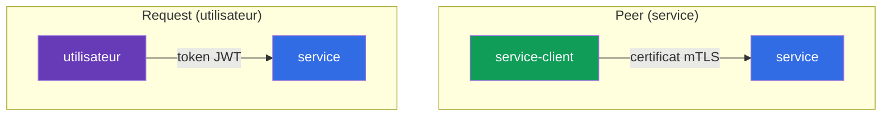
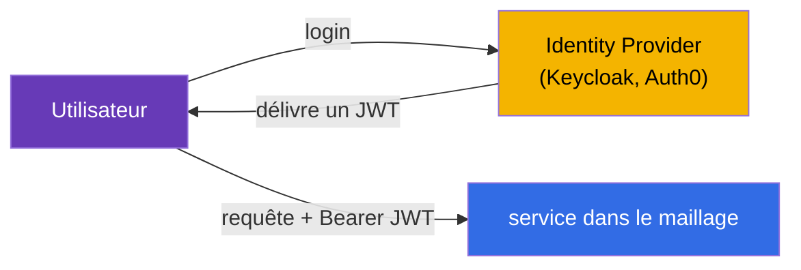
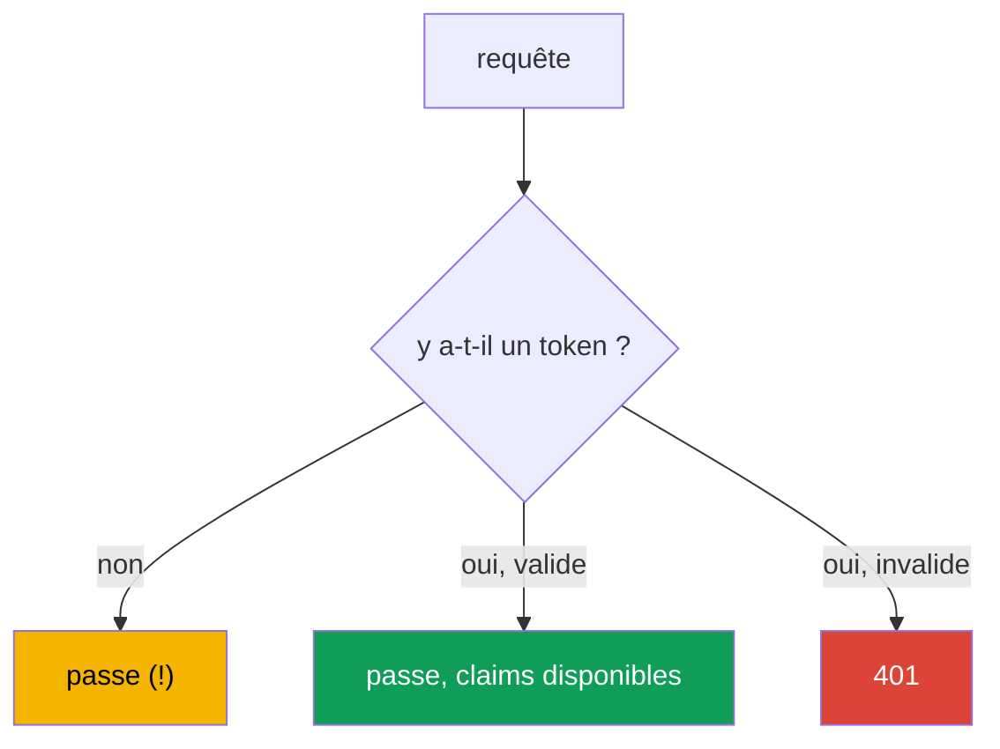
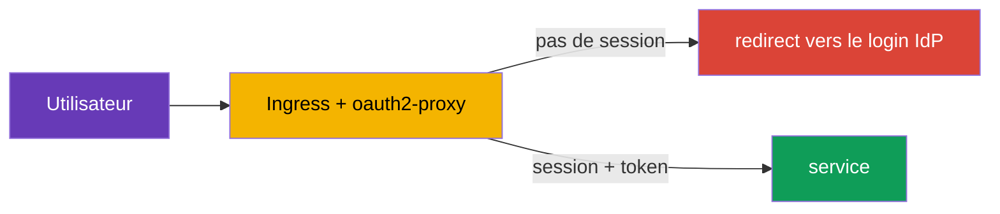
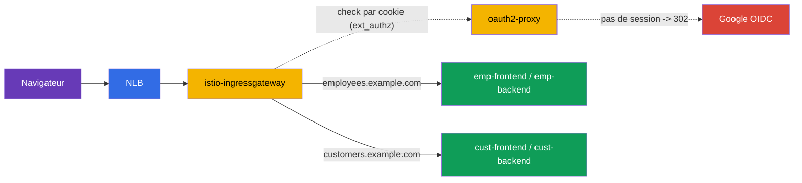

[RU version](ru.md) · [Eng version](en.md) · [Versión en español](es.md) · [Deutsche Version](de.md)

# Chapitre 15. Authentification des utilisateurs : RequestAuthentication et JWT

> **La suite.** Aux chapitres 13 et 14, nous nous sommes occupés de l'authentification et
> de l'autorisation des **services** entre eux (mTLS, PeerAuthentication,
> AuthorizationPolicy). Mais il existe un second type d'authentification - celle de
> l'**utilisateur final** : quand une requête porte un token (JWT) délivré par votre
> Identity Provider, et que le service doit vérifier ce token. C'est le rôle de
> RequestAuthentication.

## 15.1. Deux types d'authentification

Dans Istio, il est important de distinguer deux questions « qui c'est » :

- **Peer authentication** - qui est ce **service émetteur**. Vérifié par le certificat
  mTLS, configuré via `PeerAuthentication` (chapitre 13).
- **Request authentication** - qui est cet **utilisateur final** au nom duquel la requête
  est faite. Vérifié par le token (JWT), configuré via `RequestAuthentication`.



Ce sont des choses indépendantes : une requête peut simultanément avoir une identité mTLS
de service et un token JWT d'utilisateur. Par exemple, `frontend` (service) s'adresse à
`backend` en portant le token de l'utilisateur qui s'est connecté au système.

## 15.2. Qu'est-ce qu'un JWT

**JWT** (JSON Web Token) est une manière standard de transmettre des informations signées
sur un utilisateur. Le token se compose de trois parties séparées par des points :
`header.payload.signature`.

- **header** - l'algorithme de signature.
- **payload** - les données utiles, appelées claims : qui l'a émis (`iss`), pour qui
  (`aud`), qui est l'utilisateur (`sub`), quand il expire (`exp`) et tout champ personnalisé
  (rôles, email, etc.).
- **signature** - la signature par laquelle l'Identity Provider (Auth0, Keycloak, Google,
  etc.) certifie le token.

On peut vérifier l'authenticité du token par sa signature, en utilisant les clés publiques
du fournisseur. Ces clés sont publiées à une adresse standard au format **JWKS** (JSON Web
Key Set). Istio télécharge lui-même le JWKS et vérifie la signature - il n'y a rien à
déchiffrer manuellement.

## 15.3. Pourquoi le JWT est nécessaire et comment on l'utilise

La théorie est claire, mais à quoi tout cela sert-il en pratique ? Examinons un scénario
réel.

**Comment cela fonctionne dans une application.** L'utilisateur se connecte au système via
un Identity Provider (Keycloak, Auth0, Google, Okta, etc.) selon le protocole OIDC/OAuth2.
En réponse, il reçoit un token JWT. Ensuite, le client (navigateur, application mobile)
joint ce token à chaque requête dans l'en-tête `Authorization: Bearer <token>`. Les
services vérifient le token et comprennent qui est l'utilisateur et ce qui lui est permis.



**Pourquoi le JWT plutôt que des sessions.** Les sessions serveur classiques exigent que le
serveur stocke l'état des sessions et que toutes les répliques y aient accès. Dans les
microservices, c'est peu pratique. Le JWT résout cela autrement :

- **Le token est autosuffisant.** Toute l'information sur l'utilisateur est déjà à
  l'intérieur du token et certifiée par la signature. Le serveur n'a pas besoin de stocker
  les sessions ni d'interroger une base à chaque requête.
- **Fonctionne à travers toute la chaîne de services.** `frontend` a reçu le token et le
  transmet plus loin à `orders`, `payments`, etc. Chaque service peut vérifier le token
  lui-même, en connaissant seulement les clés publiques de l'émetteur - pas besoin
  d'interroger un serveur d'autorisation à chaque requête.
- **Standard.** Le JWT fait partie de l'écosystème OAuth2/OIDC, il est compris par tous les
  IdP et toutes les bibliothèques.

**Où on l'utilise réellement :**

- **Single Sign-On (SSO).** L'utilisateur se connecte une seule fois au Keycloak
  d'entreprise et navigue sur tous les services internes avec un seul token.
- **Accès à l'API par rôles.** Les claims du token contiennent des rôles ou des scopes
  (`role: admin`, `scope: orders.write`). Différents endpoints exigent différents rôles.
- **Multitenancy.** Le token contient un identifiant de locataire (`tenant: acme`), et le
  service ne renvoie que les données de ce locataire.

**Pourquoi faire cela dans Istio, et non dans chaque application.** On peut, bien sûr,
vérifier le JWT dans le code de chaque service. Mais il faudrait alors répéter la logique de
vérification (téléchargement des clés, validation de la signature, de la durée de validité)
dans chaque langage et chaque service. Istio déporte cela dans l'infrastructure :

- les applications **n'écrivent pas** de code de vérification des tokens - c'est Envoy qui
  le fait ;
- les tokens invalides sont coupés **à l'entrée**, avant même l'application ;
- l'émetteur et les clés se configurent **à un seul endroit**, et non dans chaque service ;
- les règles « quel rôle pour quel endpoint » sont décrites de façon déclarative via
  `AuthorizationPolicy`.

### Exemple : différents utilisateurs avec différents droits

Examinons en détail une tâche typique. L'entreprise a deux portails :

- **customer-portal** - pour les clients externes (consultation du catalogue, de leurs
  commandes) ;
- **internal-portal** - pour les employés (admin, gestion des produits, rapports).

Les deux sont accessibles via un seul cluster et un seul Istio, mais il faut y laisser
entrer des personnes différentes. Tous se connectent via un seul Keycloak, mais leurs
tokens ont des claims différents. Par exemple, un client a `role: customer` dans son token,
un employé - `role: employee`, un administrateur - `role: admin`.

La tâche se résout ainsi : Istio vérifie le token une seule fois, et
`AuthorizationPolicy` ne laisse entrer dans chaque portail que les rôles nécessaires.

Portail client - on ne laisse entrer que `customer` :

```yaml
apiVersion: security.istio.io/v1
kind: AuthorizationPolicy
metadata:
  name: customer-portal-access
  namespace: app
spec:
  selector:
    matchLabels:
      app: customer-portal
  action: ALLOW
  rules:
  - from:
    - source:
        requestPrincipals: ["*"]        # un token valide est requis
    when:
    - key: request.auth.claims[role]
      values: ["customer"]              # et le rôle doit être customer
```

Portail interne - on ne laisse entrer que les employés et les admins :

```yaml
apiVersion: security.istio.io/v1
kind: AuthorizationPolicy
metadata:
  name: internal-portal-access
  namespace: app
spec:
  selector:
    matchLabels:
      app: internal-portal
  action: ALLOW
  rules:
  - from:
    - source:
        requestPrincipals: ["*"]
    when:
    - key: request.auth.claims[role]
      values: ["employee", "admin"]     # uniquement les employés et les admins
```

Ce que l'on obtient :

- Un client avec son token (`role: customer`) accédera au customer-portal, mais sur
  l'internal-portal il obtiendra un `403` - son rôle n'est pas dans la liste.
- Un employé (`role: employee`) c'est l'inverse : il accédera au portail interne, mais sur
  le portail client - `403`.
- Un utilisateur sans token n'accédera nulle part.

Notez bien : les applications `customer-portal` et `internal-portal` elles-mêmes **ne
contiennent pas de code de vérification des rôles**. Elles reçoivent simplement du trafic
déjà filtré. Toute la logique « qui peut aller où » est décrite de façon déclarative dans
deux `AuthorizationPolicy`, et la vérification du token a été faite par Istio. Vous voulez
ajouter un portail pour les partenaires avec le rôle `partner` - il suffit d'écrire une
politique de plus, sans toucher aux applications.

### Et l'application elle-même sait-elle quel utilisateur est arrivé ?

Question légitime : si la vérification est faite par Istio, l'application sait-elle qui
s'est précisément adressé à elle ? Oui, mais avec une réserve importante. Par défaut, Istio
**valide** le token et **ne le transmet pas** plus loin à l'application (le champ
`forwardOriginalToken: false` par défaut) - c'est un piège fréquent : l'application attend
un en-tête `Authorization`, et il n'y en a pas. Il y a deux façons de donner à
l'application l'identité de l'utilisateur :

- **`forwardOriginalToken: true`** dans `jwtRules` - conserver le token original pour
  l'upstream, et l'application analysera elle-même `Authorization: Bearer <token>` ;
- **`outputClaimToHeaders`** - extraire les claims nécessaires dans de simples en-têtes
  (voir ci-dessous), auquel cas l'application n'a pas besoin du token lui-même.

Il est important ici de répartir les responsabilités :

- **Istio est responsable de l'accès grossier** : le token est-il valide ? le rôle
  laisse-t-il accéder à ce service ou cet endpoint ? C'est ce qui ne dépend pas de la
  logique métier.
- **L'application est responsable de la logique au niveau des données** : montrer
  précisément *mes* commandes, personnaliser l'affichage, écrire dans l'audit qui a effectué
  une action. Pour cela, l'application a besoin de l'identifiant de l'utilisateur, et elle le
  prend dans le token.

Exemple : `AuthorizationPolicy` a laissé entrer un utilisateur avec `role: customer` dans le
customer-portal (accès grossier). Mais quel client précis est arrivé et quelles commandes lui
montrer - c'est déjà l'application qui le décide, à partir du claim `sub` (identifiant de
l'utilisateur) du token.

Pour que l'application n'ait pas à analyser elle-même le JWT, Istio peut **extraire les
claims nécessaires dans de simples en-têtes** via `outputClaimToHeaders` dans
`RequestAuthentication` :

```yaml
apiVersion: security.istio.io/v1
kind: RequestAuthentication
metadata:
  name: jwt-auth
  namespace: app
spec:
  selector:
    matchLabels:
      app: backend                 # à quels pods elle s'applique
  jwtRules:
  - issuer: "https://my-idp.example.com"              # qui a émis le token
    jwksUri: "https://my-idp.example.com/jwks.json"   # où prendre les clés pour la vérification
    outputClaimToHeaders:
    - header: x-user-id
      claim: sub          # l'application lira l'en-tête prêt x-user-id
    - header: x-user-email
      claim: email
```

Maintenant, l'application lit simplement l'en-tête `x-user-id`, sans rien connaître du JWT.
La vérification d'authenticité a déjà été faite par Istio, on peut donc faire confiance à ces
en-têtes (un client externe ne peut pas les falsifier - Istio les réécrira avec les valeurs
issues du token vérifié).

Bilan : Istio décharge l'application de l'authentification et de l'autorisation grossière,
mais l'identité de l'utilisateur reste accessible à l'application - pour la logique que seule
l'application peut connaître.

## 15.4. RequestAuthentication : vérification du JWT

La ressource `RequestAuthentication` indique à Istio quels tokens considérer comme valides :
de quel émetteur et où prendre les clés pour vérifier la signature.

```yaml
apiVersion: security.istio.io/v1
kind: RequestAuthentication
metadata:
  name: jwt-auth
  namespace: app
spec:
  selector:
    matchLabels:
      app: backend
  jwtRules:
  - issuer: "https://my-idp.example.com"          # qui a émis le token
    jwksUri: "https://my-idp.example.com/jwks.json"  # où prendre les clés pour la vérification
```

Ce qu'Istio fait avec cette politique :

- si la requête **a** un token et qu'il est valide (bon émetteur, signature vivante, non
  expiré) - les claims du token deviennent disponibles pour les règles d'autorisation ;
- si le token **existe, mais est invalide** (mauvaise signature, émetteur étranger, expiré)
  - la requête est rejetée avec un `401`.

Par défaut, le token est pris dans l'en-tête `Authorization: Bearer <token>`. Si votre
client place le token à un endroit non standard (son propre en-tête ou un paramètre de
requête), indiquez-le explicitement via `fromHeaders` / `fromParams` :

```yaml
  jwtRules:
  - issuer: "https://my-idp.example.com"
    jwksUri: "https://my-idp.example.com/jwks.json"
    fromHeaders:
    - name: x-jwt-token       # token dans son propre en-tête
    fromParams:
    - token                   # ou dans le paramètre de requête ?token=...
```

On peut énumérer plusieurs sources - Istio les vérifiera dans l'ordre.

## 15.5. La subtilité essentielle : sans token, la requête passe

Voici le principal piège sur lequel tout le monde trébuche. `RequestAuthentication` **ne
requiert pas** la présence d'un token. Elle vérifie seulement le token **s'il existe**. Une
requête totalement sans token passe tranquillement `RequestAuthentication`.



Autrement dit, `RequestAuthentication` en elle-même ne protège pas le service - elle valide
seulement les tokens. Pour **exiger** un token, il faut la combiner avec
`AuthorizationPolicy`. C'est le même principe que précédemment : une politique vérifie,
l'autre exige.

## 15.6. Combinaison avec AuthorizationPolicy

Pour réellement fermer le service, on ajoute une `AuthorizationPolicy` qui exige une
identité vérifiée de l'utilisateur. Elle se définit via `requestPrincipals` :

```yaml
apiVersion: security.istio.io/v1
kind: AuthorizationPolicy
metadata:
  name: require-jwt
  namespace: app
spec:
  selector:
    matchLabels:
      app: backend
  action: ALLOW
  rules:
  - from:
    - source:
        requestPrincipals: ["*"]   # n'importe quel token valide est requis
```

- **`requestPrincipals: ["*"]`** - exige que la requête ait une request-identité vérifiée
  (c'est-à-dire un JWT valide). Format de l'identité : `<issuer>/<subject>`. L'astérisque
  signifie « n'importe quel token valide ».
- Désormais, une requête sans token recevra un `403` de l'autorisation (et avec un token
  invalide - un `401` dès l'étape RequestAuthentication).

On peut exiger non pas simplement la présence d'un token, mais des claims précis - par
exemple un certain rôle ou un certain émetteur - via le bloc `when` :

```yaml
apiVersion: security.istio.io/v1
kind: AuthorizationPolicy
metadata:
  name: require-jwt-admin
  namespace: app
spec:
  selector:
    matchLabels:
      app: backend
  action: ALLOW
  rules:
  - from:
    - source:
        requestPrincipals: ["*"]        # un token valide est requis
    when:
    - key: request.auth.claims[role]    # et le claim role...
      values: ["admin"]                 # ...doit être admin
```

Logique finale pour le service `backend` :

- pas de token -> `403` (AuthorizationPolicy) ;
- token invalide -> `401` (RequestAuthentication) ;
- token valide avec le bon claim -> passe.

## 15.7. Token expiré : refresh et redirect

Les tokens vivent peu (souvent 5-15 minutes) - cela fait partie de la sécurité. Que se
passe-t-il quand un token a expiré ?

**Du côté d'Istio, tout est simple :** un token expiré échoue à la vérification du claim
`exp`, donc `RequestAuthentication` rejette la requête avec un `401` - exactement comme
n'importe quel token invalide. Pour Istio, il n'y a aucune différence entre « signature
mauvaise » et « token expiré » : les deux cas sont un `401`.

**Et voici une frontière importante à bien comprendre.** Istio **ne fait que vérifier** les
tokens. Il **ne** connecte **pas** les utilisateurs, **ne** les redirige **pas** vers la
page de login de l'IdP et **ne** rafraîchit **pas** les tokens. Istio n'est pas un client
OAuth2. C'est pourquoi « faire un redirect pour un nouveau token » avec Istio seul est
impossible. L'obtention d'un nouveau token est une tâche d'un niveau supérieur. Il y a deux
approches principales.

**Approche 1 : refresh côté client (SPA, applications mobiles).** Au login, le client reçoit
non seulement un access-token à courte durée de vie, mais aussi un refresh-token. Quand
l'application reçoit un `401`, elle :

- soit échange le refresh-token contre un nouvel access-token auprès de l'IdP et réitère la
  requête ;
- soit, si le refresh a lui aussi expiré, redirige l'utilisateur vers la page de login de
  l'IdP.

Toute cette logique vit dans le code client, Istio n'y participe pas - il renvoie simplement
un `401`, et ensuite le client se débrouille lui-même.

**Approche 2 : auth-proxy en bordure (applications navigateur avec sessions).** Pour les
applications web classiques, il est pratique de déporter le redirect vers le login dans un
proxy spécial à l'entrée - par exemple **oauth2-proxy** ou équivalent. Il réalise le flux
OIDC complet : redirige l'utilisateur non authentifié vers l'IdP, garde la session dans un
cookie et insère le token dans les requêtes. Istio connecte un tel proxy via l'autorisation
externe (`action: CUSTOM` dans `AuthorizationPolicy`, souvenez-vous du chapitre 14).



**Approche 3 : login en bordure cloud (ALB, Cloudflare, CloudFront).** Le login peut être
déporté encore plus loin - sur le load balancer/CDN lui-même, auquel cas un oauth2-proxy
séparé n'est plus nécessaire. Cela ne fonctionne que là où la bordure comprend le L7 et
l'OIDC :

- **AWS ALB - oui, nativement.** Une règle de listener a l'action `authenticate-oidc` (et
  `authenticate-cognito`) : l'ALB redirige lui-même l'utilisateur non authentifié vers
  l'IdP, garde la session dans un cookie et ajoute à la requête un JWT signé dans l'en-tête
  `x-amzn-oidc-data` (plus `x-amzn-oidc-identity` / `x-amzn-oidc-accesstoken`). Istio ne fait
  ensuite que **valider ce JWT** via `RequestAuthentication`. Le prix - un ALB (L7) apparaît
  devant le maillage, et non un NLB « pur ».
- **Cloudflare - oui, Cloudflare Access (Zero Trust).** SSO/OIDC complet en bordure ; vers
  l'extérieur est délivré un JWT signé `Cf-Access-Jwt-Assertion`, et Istio le valide via le
  JWKS de Cloudflare (`https://<team>.cloudflareaccess.com/cdn-cgi/access/certs`).
- **CloudFront - pas d'emblée.** Pas de login OIDC intégré ; on le fait via **Lambda@Edge /
  CloudFront Functions** (votre propre code OIDC) ou Cognito - autrement dit, vous écrivez
  quand même la logique de proxy, mais sous forme de fonction edge.
- **NLB - non.** C'est du L4, aucune logique HTTP/OIDC ; le login y est par principe
  impossible.

Dans toutes les variantes « oui », le rôle d'Istio ne change pas : le login interactif est
fait par la bordure, et Istio **vérifie le JWT signé** (`RequestAuthentication`) et enforce
l'accès (`AuthorizationPolicy`). L'émetteur et le `jwksUri` dans `RequestAuthentication`
pointent vers la bordure correspondante (ALB/Cloudflare), et non vers l'IdP d'origine.

> **Critique - fermer le contournement de la bordure.** Si l'on peut atteindre l'ingress
> gateway **en contournant** l'ALB/Cloudflare, un attaquant falsifiera les en-têtes
> (`x-amzn-oidc-*`, `Cf-Access-*`) et passera. C'est pourquoi il est impératif : (1) Istio
> **vérifie la signature** du JWT-edge par JWKS, et ne fait pas confiance à l'en-tête sur
> parole ; (2) l'accès à la gateway est limité à la seule bordure - security group sur les
> IP du CDN/ALB, NLB privé, mTLS depuis la bordure, etc.

**Que choisir :** pour les SPA et applications mobiles, le refresh est fait par le client
lui-même ; pour les applications navigateur serveur avec sessions - un auth-proxy
(`oauth2-proxy`) ou un login en bordure cloud (ALB `authenticate-oidc`, Cloudflare Access).
Dans tous les cas, Istio n'est responsable que de la vérification du JWT et de l'émission du
`401`, tandis que le redirect et le rafraîchissement du token relèvent du client, de
l'auth-proxy ou de la bordure.

> **Et pourquoi ne pas simplement le faire via un VirtualService sur l'absence d'en-tête ?**
> L'idée s'impose : dans un `VirtualService`, matcher `withoutHeaders` (pas
> d'`Authorization`) et envoyer de telles requêtes vers un « service-redirecteur ».
> Techniquement, le match et même un `redirect` statique existent dans VirtualService, mais
> comme remplacement d'un auth-proxy cela ne fonctionne pas : (1) VirtualService ne voit que
> « en-tête présent/absent », mais **ne vérifie pas la validité** - `Authorization: Bearer
> ordures` passera le match ; (2) le navigateur, lors de la navigation, n'envoie pas du tout
> `Authorization` (session dans un cookie), donc le signal est faux ; (3) le flux OIDC complet
> (`/callback`, échange du `code`, cookie, PKCE) doit de toute façon être implémenté par le
> service récepteur - et c'est justement oauth2-proxy. Pour « rediriger les non
> authentifiés », il existe `ext_authz` (`action: CUSTOM`), où la décision est prise par un
> composant qui **sait** vérifier, et non par un match sur la présence d'un en-tête.

> **Coût : chemin de données vs simple vérification.** Une crainte fréquente - « tout le
> trafic passera par le proxy, c'est cher ». C'est vrai uniquement pour le mode où
> `oauth2-proxy` est placé en **reverse-proxy devant l'application** (les corps et réponses
> transitent par lui). Dans le mode recommandé **`ext_authz` (`action: CUSTOM`), le proxy
> n'est pas dans le chemin de données** : Envoy envoie pour chaque requête une légère
> sous-requête check (uniquement les en-têtes/cookie, sans le corps), reçoit
> « laisser passer/`302` » et, en cas de succès, envoie la requête **directement à
> l'application**. La charge utile ne passe pas par le proxy. Ensuite, on réduit encore les
> coûts ainsi : ne vérifier que sur l'ingress gateway ; scoper la politique `CUSTOM` sur les
> hosts/chemins voulus (l'admin), sans toucher aux publics ; et après le login, quand les
> requêtes portent un JWT valide, passer à `RequestAuthentication` - Envoy valide la signature
> **localement, sans appels externes**. Avec un login en bordure cloud (ALB/Cloudflare), il
> n'y a pas du tout de proxy dans le chemin à l'intérieur du maillage - seulement une
> validation locale du JWT.

## 15.8. Exemple complet : deux portails, login via Google et oauth2-proxy

Assemblons le tout sur un scénario réel. Données :

- Entrée dans le cluster - **NLB → istio-ingressgateway** (load balancer L4, ne sait pas
  faire de login, 15.7).
- Les utilisateurs se connectent via **Google** (OIDC).
- Deux portails sur des hosts différents : **`employees.example.com`** (pour les employés)
  et **`customers.example.com`** (pour les clients).
- Chaque portail a ses services **frontend et backend**.
- Séparation : dans le portail des employés, on ne laisse entrer que les comptes
  d'entreprise (`*@company.com`), dans celui des clients - n'importe quel compte Google
  authentifié.

La logique de login est prise en charge par **oauth2-proxy** (Google ne sait pas rediriger
lui-même - c'est le proxy qui le fait), connecté à Istio comme autorisation externe
(`ext_authz`, `action: CUSTOM`). Le proxy est **hors du chemin de données** : Envoy lui
demande seulement « laisser passer ? » sur la base du cookie (15.7).



**1. oauth2-proxy : Deployment, Service et Secret** (namespace `auth`). Le cookie est posé
sur `.example.com` pour qu'une seule session fonctionne sur les deux portails ;
`--email-domain=*` autorise le login à n'importe quel compte Google (la séparation par
portails sera faite plus bas dans Istio).

```yaml
apiVersion: v1
kind: Secret
metadata:
  name: oauth2-proxy
  namespace: auth
type: Opaque
stringData:
  client-id: "<google-client-id>"
  client-secret: "<google-client-secret>"
  cookie-secret: "<secret-aléatoire-de-32-octets>"   # openssl rand -base64 32
---
apiVersion: apps/v1
kind: Deployment
metadata:
  name: oauth2-proxy
  namespace: auth
spec:
  replicas: 2
  selector:
    matchLabels: { app: oauth2-proxy }
  template:
    metadata:
      labels: { app: oauth2-proxy }
    spec:
      containers:
      - name: oauth2-proxy
        image: quay.io/oauth2-proxy/oauth2-proxy:v7.6.0
        args:
        - --provider=google
        - --email-domain=*                       # login autorisé à tout compte Google
        - --http-address=0.0.0.0:4180
        - --reverse-proxy=true                   # faire confiance à X-Forwarded-* de l'ingress
        - --set-xauthrequest=true                # renvoyer X-Auth-Request-* dans la réponse auth
        - --cookie-domain=.example.com           # session commune pour *.example.com
        - --whitelist-domain=.example.com
        - --redirect-url=https://auth.example.com/oauth2/callback
        - --upstream=static://200
        env:
        - name: OAUTH2_PROXY_CLIENT_ID
          valueFrom: { secretKeyRef: { name: oauth2-proxy, key: client-id } }
        - name: OAUTH2_PROXY_CLIENT_SECRET
          valueFrom: { secretKeyRef: { name: oauth2-proxy, key: client-secret } }
        - name: OAUTH2_PROXY_COOKIE_SECRET
          valueFrom: { secretKeyRef: { name: oauth2-proxy, key: cookie-secret } }
        ports:
        - containerPort: 4180
---
apiVersion: v1
kind: Service
metadata:
  name: oauth2-proxy
  namespace: auth
spec:
  selector: { app: oauth2-proxy }
  ports:
  - name: http
    port: 4180
    targetPort: 4180
```

**2. On enregistre oauth2-proxy comme fournisseur d'autorisation externe** dans MeshConfig.
C'est vers lui que fera référence `action: CUSTOM` :

```yaml
apiVersion: install.istio.io/v1alpha1
kind: IstioOperator
spec:
  meshConfig:
    extensionProviders:
    - name: oauth2-proxy
      envoyExtAuthzHttp:
        service: oauth2-proxy.auth.svc.cluster.local
        port: 4180
        includeRequestHeadersInCheck: ["authorization", "cookie"]   # quoi envoyer à la vérification
        headersToUpstreamOnAllow:                                   # quoi ajouter à la requête en cas d'allow
        - "authorization"
        - "x-auth-request-email"
        - "x-auth-request-user"
        headersToDownstreamOnDeny: ["content-type", "set-cookie"]   # pour le 302 vers le login
```

**3. Gateway** sur trois hosts : le portail-login lui-même (`auth.example.com` →
oauth2-proxy) et les deux portails. TLS en `SIMPLE` (chapitre 9), certificats - au besoin
de cert-manager :

```yaml
apiVersion: networking.istio.io/v1
kind: Gateway
metadata:
  name: portals-gw
  namespace: istio-system
spec:
  selector:
    istio: ingressgateway
  servers:
  - port: { number: 443, name: https, protocol: HTTPS }
    tls: { mode: SIMPLE, credentialName: portals-cert }
    hosts:
    - auth.example.com
    - employees.example.com
    - customers.example.com
```

**4. Les VirtualService.** Le host `auth.example.com` part entièrement vers oauth2-proxy (là
vivent `/oauth2/start`, `/oauth2/callback`). Chaque portail : `/api` → backend, tout le
reste → frontend.

```yaml
apiVersion: networking.istio.io/v1
kind: VirtualService
metadata:
  name: auth-vs
  namespace: istio-system
spec:
  hosts: ["auth.example.com"]
  gateways: ["portals-gw"]
  http:
  - route:
    - destination:
        host: oauth2-proxy.auth.svc.cluster.local
        port: { number: 4180 }
---
apiVersion: networking.istio.io/v1
kind: VirtualService
metadata:
  name: employees-vs
  namespace: istio-system
spec:
  hosts: ["employees.example.com"]
  gateways: ["portals-gw"]
  http:
  - match: [{ uri: { prefix: /api } }]
    route:
    - destination: { host: emp-backend.portals.svc.cluster.local, port: { number: 8080 } }
  - route:
    - destination: { host: emp-frontend.portals.svc.cluster.local, port: { number: 8080 } }
---
apiVersion: networking.istio.io/v1
kind: VirtualService
metadata:
  name: customers-vs
  namespace: istio-system
spec:
  hosts: ["customers.example.com"]
  gateways: ["portals-gw"]
  http:
  - match: [{ uri: { prefix: /api } }]
    route:
    - destination: { host: cust-backend.portals.svc.cluster.local, port: { number: 8080 } }
  - route:
    - destination: { host: cust-frontend.portals.svc.cluster.local, port: { number: 8080 } }
```

**5. On exige le login à l'entrée** - une `AuthorizationPolicy` avec `action: CUSTOM` sur
l'ingress gateway. Elle appelle oauth2-proxy pour tous les hosts des portails, mais **pas**
pour les chemins `/oauth2/*` (sinon le callback ne pourra pas connecter) ni pour
`auth.example.com` :

```yaml
apiVersion: security.istio.io/v1
kind: AuthorizationPolicy
metadata:
  name: require-login
  namespace: istio-system
spec:
  selector:
    matchLabels:
      istio: ingressgateway
  action: CUSTOM
  provider:
    name: oauth2-proxy          # nom issu de extensionProviders (étape 2)
  rules:
  - to:
    - operation:
        hosts: ["employees.example.com", "customers.example.com"]
        notPaths: ["/oauth2/*"]   # on ne gate pas les endpoints callback/login
```

Après cela, un utilisateur non authentifié sur n'importe quel portail reçoit un `302` vers le
login Google, et après connexion oauth2-proxy ajoute à la requête l'en-tête
`X-Auth-Request-Email` (de confiance - c'est la réponse d'autorisation qui le pose, pas le
client).

**6. On sépare les portails** avec de simples politiques `ALLOW` sur les services eux-mêmes
(namespace `portals`). Portail client - tout utilisateur connecté ; portail des employés -
uniquement `*@company.com`. Le wildcard dans `values` est pris en charge :

```yaml
# portail des employés : uniquement les adresses d'entreprise
apiVersion: security.istio.io/v1
kind: AuthorizationPolicy
metadata:
  name: employees-only-corp
  namespace: portals
spec:
  selector:
    matchLabels: { portal: employees }   # label sur emp-frontend et emp-backend
  action: ALLOW
  rules:
  - when:
    - key: request.headers[x-auth-request-email]
      values: ["*@company.com"]           # wildcard suffixe
---
# portail client : il suffit d'être connecté (l'en-tête est présent)
apiVersion: security.istio.io/v1
kind: AuthorizationPolicy
metadata:
  name: customers-any-authenticated
  namespace: portals
spec:
  selector:
    matchLabels: { portal: customers }
  action: ALLOW
  rules:
  - when:
    - key: request.headers[x-auth-request-email]
      values: ["*"]                        # tout email non vide = connecté
```

**Ce que l'on obtient :**

- Un client avec son Gmail personnel accédera à `customers.example.com`, mais sur
  `employees.example.com` il obtiendra un `403` (son email n'est pas `*@company.com`).
- Un employé (`ivan@company.com`) accédera aux deux (si c'est voulu) ou limitez le portail
  client séparément.
- Un anonyme - `302` vers le login Google dès l'entrée.

**7. On ferme la falsification des en-têtes.** `X-Auth-Request-Email` n'est de confiance que
si le client ne peut pas l'envoyer lui-même. Sinon, quelqu'un enverra
`X-Auth-Request-Email: boss@company.com` et contournera la règle de l'étape 6. Sur l'ingress
gateway, il faut **couper** les `x-auth-request-*` entrants.

Subtilité : il est important de savoir **quand** couper. Un `headers.request.remove`
ordinaire dans le VirtualService ne convient pas ici - il s'exécute dans le routeur **après**
`ext_authz` et supprimerait l'en-tête de confiance déjà posé par oauth2-proxy. Il faut couper
**avant** la vérification, on utilise donc un EnvoyFilter inséré **avant** le filtre
`ext_authz` :

```yaml
apiVersion: networking.istio.io/v1alpha3
kind: EnvoyFilter
metadata:
  name: strip-auth-headers
  namespace: istio-system
spec:
  selector:
    matchLabels:
      istio: ingressgateway
  configPatches:
  - applyTo: HTTP_FILTER
    match:
      context: GATEWAY
      listener:
        filterChain:
          filter:
            name: envoy.filters.network.http_connection_manager
            subFilter:
              name: envoy.filters.http.ext_authz
    patch:
      operation: INSERT_BEFORE          # exécuter AVANT ext_authz
      value:
        name: envoy.filters.http.lua
        typed_config:
          "@type": type.googleapis.com/envoy.extensions.filters.http.lua.v3.Lua
          inlineCode: |
            function envoy_on_request(handle)
              -- on coupe tout ce que le client a pu falsifier ; les valeurs de confiance
              -- seront posées par oauth2-proxy via headersToUpstreamOnAllow (étape 2)
              handle:headers():remove("x-auth-request-email")
              handle:headers():remove("x-auth-request-user")
              handle:headers():remove("x-auth-request-preferred-username")
              handle:headers():remove("x-auth-request-groups")
            end
```

L'ordre des filtres devient le suivant : d'abord Lua **supprime** les `x-auth-request-*` du
client, puis `ext_authz` (oauth2-proxy), sur une vérification réussie, les **repose** à
nouveau - cette fois avec des valeurs vérifiées. Maintenant, on peut faire confiance à
l'en-tête qui atteindra les portails.

**Transmission de l'identité à l'application (pour la logique métier).** Aux portails, il ne
suffit pas de « laisser passer/ne pas laisser passer » - ils doivent savoir **qui précisément**
est entré : quelles commandes montrer, quoi écrire dans l'audit, comment personnaliser
l'affichage. Cette identité est amenée par le même mécanisme. À l'étape 2, nous avons déjà
énuméré dans `headersToUpstreamOnAllow` les en-têtes qu'Envoy ajoute à la requête sur une
vérification réussie - c'est justement eux que lit l'application :

- `X-Auth-Request-Email` - l'email de l'utilisateur ;
- `X-Auth-Request-User` - l'identifiant (`sub`) ;
- au besoin, davantage : `X-Auth-Request-Preferred-Username`, `X-Auth-Request-Groups`,
  `X-Auth-Request-Access-Token` (ce dernier - si l'option `--pass-access-token` d'oauth2-proxy
  est activée).

Autrement dit, `emp-frontend`/`emp-backend` n'analysent pas le JWT et ne vont pas chez Google
- ils lisent simplement l'en-tête prêt `X-Auth-Request-Email` de la requête. Pour ajouter un
nouvel attribut, vous activez le flag correspondant sur oauth2-proxy et ajoutez l'en-tête dans
`headersToUpstreamOnAllow` (étape 2) - sans toucher aux applications.

```yaml
# fragment de extensionProviders de l'étape 2 - on étend la liste des en-têtes
        headersToUpstreamOnAllow:
        - "authorization"
        - "x-auth-request-email"
        - "x-auth-request-user"
        - "x-auth-request-preferred-username"
        - "x-auth-request-groups"
```

L'application ne peut faire confiance à ces en-têtes **que parce que** le client ne peut pas
les envoyer lui-même - les `x-auth-request-*` entrants sont coupés sur l'ingress gateway (voir
l'encadré ci-dessus sur la falsification). C'est le même principe que `outputClaimToHeaders`
en 15.3 : l'authentification et l'accès grossier ont été faits par le maillage, et l'identité
est remise à l'application dans un simple en-tête.

**Variante plus stricte.** Au lieu de faire confiance à l'en-tête, on peut forcer oauth2-proxy
à transmettre **le token ID Google lui-même** (`Authorization: Bearer`), le vérifier dans le
maillage via `RequestAuthentication` (issuer `https://accounts.google.com`, JWKS
`https://www.googleapis.com/oauth2/v3/certs`), et séparer les portails par le claim
`request.auth.claims[hd]` (hosted domain de Google Workspace) au lieu de l'en-tête. Ainsi,
l'identité est confirmée par une signature cryptographique, et non par un en-tête de
confiance. L'application recevra alors tous les claims du token vérifié (avec
`forwardOriginalToken: true` ou via `outputClaimToHeaders`, 15.3).

## 15.9. Où appliquer : ingress gateway ou service

`RequestAuthentication` peut s'attacher à un service précis comme à l'ingress gateway.

- **Sur l'ingress gateway** - le token est vérifié à l'entrée du cluster, avant même que le
  trafic n'atteigne les services. Pratique pour vérifier l'utilisateur une seule fois à la
  frontière.
- **Sur un service précis** - un contrôle plus fin, quand différents services acceptent des
  tokens de différents émetteurs ou qu'une partie des services est carrément publique.

En pratique, on fait souvent la vérification sur l'ingress gateway (point d'entrée unique),
et les services internes font ensuite confiance au trafic qui a franchi la frontière (en plus
d'être protégés par le mTLS et l'AuthorizationPolicy entre eux).

## 15.10. Vérification et débogage

La configuration JWT casse de manière prévisible, et les codes de réponse indiquent
immédiatement où chercher :

- **`401`** renvoyé par `RequestAuthentication` - il y a un token, mais il est invalide :
  mauvais `issuer`, expiré (`exp`), mauvaise signature, `jwksUri` inaccessible.
- **`403 RBAC: access denied`** renvoyé par `AuthorizationPolicy` - il n'y a pas du tout de
  token (alors que `requestPrincipals` l'exige) ou le claim voulu dans `when` ne correspond
  pas.

Causes fréquentes et ce qu'il faut vérifier :

- **`issuer` ne correspond pas** au claim `iss` du token - ils doivent correspondre caractère
  par caractère (erreur fréquente - un slash en trop ou en moins).
- **`jwksUri` inaccessible** depuis le cluster. Si l'IdP est à l'extérieur et que l'egress est
  fermé (`REGISTRY_ONLY`, chapitre 12), Istio ne téléchargera pas les clés - il faut un
  `ServiceEntry` vers le host de l'IdP.
- **L'application ne voit pas le token** - par défaut il n'est pas forwardé
  (`forwardOriginalToken`, 15.3).
- **Le claim ne matche pas** - vérifiez le contenu réel du token en décodant le payload
  (c'est du base64url), par exemple `jwt.io` ou `cut -d. -f2 | base64 -d`.

Les logs du sidecar de la cible, comme au chapitre 14, montrent la raison du refus
(`grep -i jwt` / `rbac`).

## 15.11. Best practices

- **`RequestAuthentication` toujours en paire avec `AuthorizationPolicy`.** Seule, elle
  n'exige pas de token (15.5) ; sans `requestPrincipals`, le service reste ouvert aux
  requêtes sans token.
- **`issuer` exact et `jwksUri` en HTTPS.** L'émetteur doit correspondre exactement à `iss` ;
  ne tirez les clés qu'en HTTPS. Ne codez pas les clés en dur s'il y a un `jwksUri` - Istio
  les mettra à jour lui-même.
- **Ne forwardez pas le token sans nécessité.** Laissez `forwardOriginalToken: false`
  (défaut), et donnez à l'application seulement les claims nécessaires via
  `outputClaimToHeaders` - moins de risque de fuite du token plus loin dans la chaîne.
- **Vérifiez non seulement la présence du token, mais aussi les claims.**
  `requestPrincipals: ["*"]` laisse passer n'importe quel token valide ; pour un accès réel,
  restreignez par rôle/audience via `when`.
- **Le JWT n'annule pas le mTLS.** L'authentification request (utilisateur) et
  l'authentification peer (service) se complètent : fermez les services à la fois avec le
  STRICT mTLS et le JWT.
- **La vérification - à la frontière.** Validez le token sur l'ingress gateway (point unique),
  et ne l'étalez pas sur tous les services si l'émetteur est unique.

## 15.12. Résumé du chapitre

- Istio distingue l'authentification du service (peer, mTLS, `PeerAuthentication`) et de
  l'utilisateur (request, JWT, `RequestAuthentication`) ; ce sont des mécanismes
  indépendants.
- Le JWT est un token signé avec des claims (iss, sub, aud, exp et personnalisés) ; la
  signature est vérifiée par les clés publiques de l'émetteur (JWKS).
- Le JWT est pratique dans les microservices : autosuffisant (pas besoin de sessions
  serveur), transmis le long de la chaîne de services, vérifié sans interroger un serveur
  d'autorisation. On l'utilise pour le SSO, l'accès par rôles, la multitenancy.
- On déporte la vérification du JWT dans Istio pour que les applications ne la dupliquent pas
  dans le code, et que les tokens invalides soient coupés à l'entrée.
- Istio rejette un token expiré avec un `401`. Le redirect vers le login et le
  rafraîchissement du token ne sont pas le rôle d'Istio : c'est fait par le client
  (refresh-token), un auth-proxy (oauth2-proxy via `action: CUSTOM`) ou une bordure cloud
  (ALB `authenticate-oidc`, Cloudflare Access) qui délivre un JWT signé, qu'Istio valide.
  Un NLB (L4) ne sait pas faire de login.
- L'auth-proxy n'est pas obligé d'être dans le chemin de données : en mode `ext_authz`, Envoy
  envoie seulement un léger check sur les en-têtes, et la charge utile va directement à
  l'application ; après le login, l'accès se vérifie le plus économiquement en local via
  `RequestAuthentication`. Un match par `withoutHeaders` dans un VirtualService ne remplace
  pas l'auth-proxy (il vérifie la présence, pas la validité).
- `RequestAuthentication` définit quels tokens sont valides (`issuer`, `jwksUri`) et les
  vérifie.
- **Subtilité clé :** `RequestAuthentication` en elle-même n'exige pas de token - une requête
  sans token passe. Seul un token présent est validé (invalide -> 401).
- Pour **exiger** un token, il faut une `AuthorizationPolicy` avec `requestPrincipals` ; les
  claims précis se vérifient via `when`.
- Par défaut, Istio **ne forwarde pas** le token à l'application
  (`forwardOriginalToken: false`) ; pour donner l'identité à l'application -
  `forwardOriginalToken: true` ou `outputClaimToHeaders`.
- Par défaut, le token est pris dans `Authorization: Bearer` ; un emplacement non standard se
  définit via `fromHeaders`/`fromParams`.
- Diagnostic : `401` = token invalide (`RequestAuthentication`), `403` = pas de token ou
  mauvais claim (`AuthorizationPolicy`) ; causes fréquentes - non-correspondance de `issuer`,
  `jwksUri` inaccessible (il faut un egress/ServiceEntry).
- La vérification se fait commodément sur l'ingress gateway (point d'entrée unique) ou de
  façon ciblée sur un service.

## 15.13. Questions d'auto-évaluation

1. En quoi la request authentication (utilisateur) diffère-t-elle de la peer authentication
   (service) ?
2. De quoi se compose un JWT et comment Istio vérifie-t-il son authenticité ?
3. Pourquoi `RequestAuthentication` en elle-même ne protège-t-elle pas le service ?
4. Comment exiger la présence d'un token et comment vérifier un claim précis ?
5. Quels codes le service renverra-t-il pour une requête sans token et avec un token invalide
   (en configuration complète) ?
6. Pourquoi le JWT est-il plus pratique que les sessions serveur dans les microservices et
   pourquoi déporter sa vérification dans Istio plutôt que dans le code de chaque application ?
7. Que renverra Istio pour un token expiré et qui est responsable du redirect vers le login
   et du rafraîchissement du token ?
8. L'application recevra-t-elle le JWT par défaut ? Comment transmettre à l'application
   l'identité de l'utilisateur ?
9. En quoi les codes `401` et `403` diffèrent-ils dans la configuration JWT et quelles sont
   les causes fréquentes de chacun ?
10. Peut-on déporter le login OIDC sur ALB / Cloudflare / CloudFront / NLB au lieu
    d'oauth2-proxy ? Que fait Istio dans ce cas et comment se protéger du contournement de la
    bordure ?
11. Pourquoi un match par `withoutHeaders` dans un VirtualService ne remplace-t-il pas un
    auth-proxy ?
12. Tout le trafic passe-t-il nécessairement par l'auth-proxy ? En quoi `ext_authz` est-il
    moins cher qu'un reverse-proxy et comment réduire encore le coût de la vérification ?
13. Dans l'exemple de bout en bout avec deux portails : comment le login via Google est-il
    implémenté, comment les portails sont-ils séparés et pourquoi faut-il couper les en-têtes
    `x-auth-request-*` entrants ?

## Pratique

Entraînez-vous à la vérification du JWT : RequestAuthentication + AuthorizationPolicy,
comportement sans token, avec un token invalide et avec un token valide :

🧪 Lab 11 : [tasks/ica/labs/11](../../labs/11/README_FR.MD)

---
[Table des matières](../README_FR.md) · [Chapitre 14](../14/fr.md) · [Chapitre 16](../16/fr.md)
