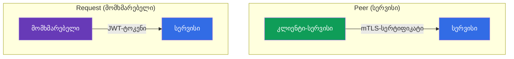
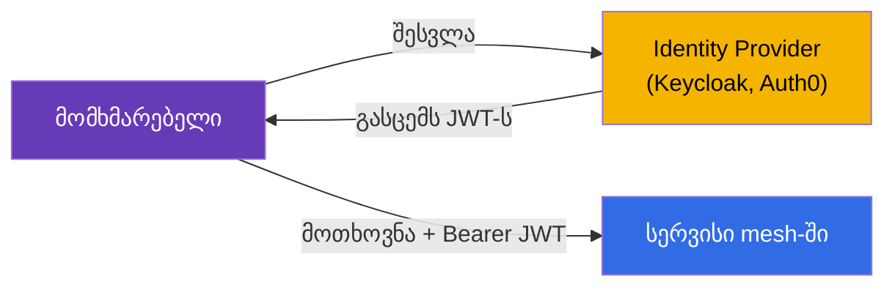
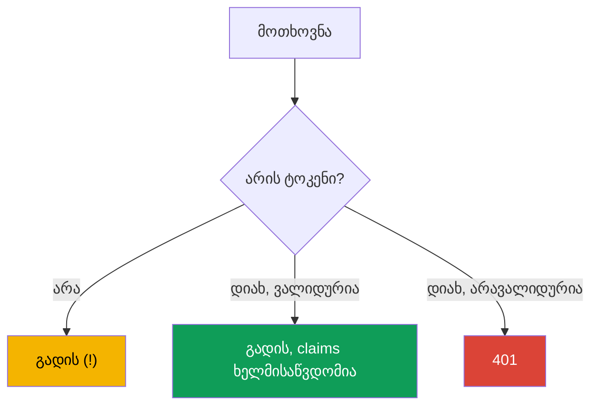
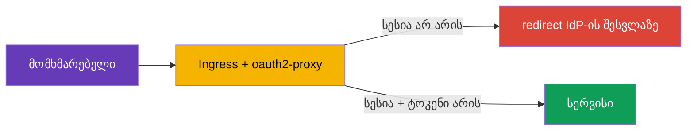
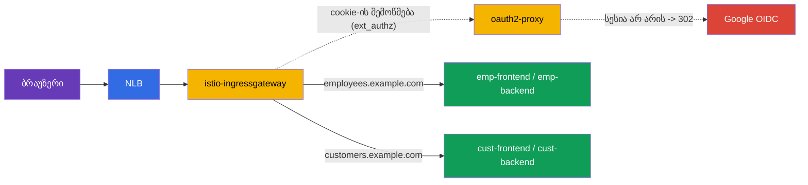

[Русская версия](ru.md) · [Eng version](en.md) · [Versión en español](es.md) · [Version française](fr.md) · [Deutsche Version](de.md) · [繁體中文版](tw.md) · [日本語版](jp.md)

# თავი 15. მომხმარებლების ავთენტიფიკაცია: RequestAuthentication და JWT

> **რა იქნება შემდეგ.** მე-13 და მე-14 თავებში განვიხილეთ **სერვისების** ერთმანეთთან
> ავთენტიფიკაცია და ავტორიზაცია (mTLS, PeerAuthentication, AuthorizationPolicy). თუმცა
> არსებობს ავთენტიფიკაციის მეორე ტიპიც - **საბოლოო მომხმარებლის** ავთენტიფიკაცია: როდესაც
> მოთხოვნას ახლავს თქვენი Identity Provider-ის მიერ გაცემული ტოკენი (JWT), სერვისმა კი ეს
> ტოკენი უნდა შეამოწმოს. სწორედ ამას აკეთებს RequestAuthentication.

## 15.1. ავთენტიფიკაციის ორი ტიპი

Istio-ში მნიშვნელოვანია განვასხვაოთ ორი კითხვა - „ვინ არის ეს“:

- **Peer authentication** - ვინ არის ეს **გამგზავნი სერვისი**. მოწმდება
  mTLS-სერტიფიკატით და კონფიგურირდება `PeerAuthentication`-ის საშუალებით (თავი 13).
- **Request authentication** - ვინ არის ის **საბოლოო მომხმარებელი**, რომლის სახელითაც
  მოთხოვნა იგზავნება. მოწმდება ტოკენით (JWT) და კონფიგურირდება `RequestAuthentication`-ის საშუალებით.



ეს დამოუკიდებელი მექანიზმებია: მოთხოვნას შეიძლება ერთდროულად ჰქონდეს სერვისის
mTLS-იდენტობა და მომხმარებლის JWT-ტოკენი. მაგალითად, `frontend` (სერვისი) მიმართავს
`backend`-ს და თან გადასცემს სისტემაში შესული მომხმარებლის ტოკენს.

## 15.2. რა არის JWT

**JWT** (JSON Web Token) მომხმარებლის შესახებ ხელმოწერილი ინფორმაციის გადაცემის
სტანდარტული საშუალებაა. ტოკენი წერტილებით გამოყოფილი სამი ნაწილისგან შედგება:
`header.payload.signature`.

- **header** - ხელმოწერის ალგორითმი.
- **payload** - სასარგებლო მონაცემები, ე.წ. claims: ვინ გასცა (`iss`), ვისთვისაა
  (`aud`), ვინ არის მომხმარებელი (`sub`), როდის იწურება (`exp`) და ნებისმიერი დამატებითი
  ველი (როლები, email და ა.შ.).
- **signature** - ხელმოწერა, რომლითაც Identity Provider (Auth0, Keycloak, Google და სხვ.)
  ტოკენს ადასტურებს.

ტოკენის ნამდვილობა პროვაიდერის საჯარო გასაღებების გამოყენებით, ხელმოწერის მიხედვით
მოწმდება. ეს გასაღებები სტანდარტულ მისამართზე **JWKS** (JSON Web Key Set) ფორმატში
ქვეყნდება. Istio თავად ჩამოტვირთავს JWKS-ს და ამოწმებს ხელმოწერას - ხელით არაფრის
გაშიფვრა არ არის საჭირო.

## 15.3. რისთვის არის საჭირო JWT და როგორ იყენებენ მას

თეორია გასაგებია, მაგრამ პრაქტიკაში რისთვის გვჭირდება ეს ყველაფერი? განვიხილოთ რეალური
სცენარი.

**როგორ მუშაობს ეს აპლიკაციაში.** მომხმარებელი OIDC/OAuth2 პროტოკოლით შედის სისტემაში
Identity Provider-ის (Keycloak, Auth0, Google, Okta და სხვ.) გავლით. პასუხად ის იღებს
JWT-ტოკენს. შემდეგ კლიენტი (ბრაუზერი, მობილური აპლიკაცია) ამ ტოკენს ყოველი მოთხოვნის
`Authorization: Bearer <token>` სათაურში ურთავს. სერვისები ტოკენს ამოწმებენ და იგებენ,
ვინ არის მომხმარებელი და რისი უფლება აქვს.



**რატომ JWT და არა სესიები.** კლასიკური სერვერული სესიები მოითხოვს, რომ სერვერმა
სესიების მდგომარეობა შეინახოს და ყველა რეპლიკას მასზე წვდომა ჰქონდეს. მიკროსერვისებში
ეს მოუხერხებელია. JWT ამ პრობლემას სხვაგვარად წყვეტს:

- **ტოკენი თვითკმარია.** მომხმარებლის შესახებ მთელი ინფორმაცია უკვე ტოკენშია და
  ხელმოწერითაა დადასტურებული. სერვერს არ სჭირდება სესიების შენახვა და ყოველ მოთხოვნაზე
  მონაცემთა ბაზაში მიმართვა.
- **მუშაობს სერვისების მთელ ჯაჭვში.** `frontend` იღებს ტოკენს და შემდგომ გადასცემს
  `orders`, `payments` და სხვა სერვისებს. თითოეულ სერვისს ტოკენის დამოუკიდებლად შემოწმება
  შეუძლია, თუ მხოლოდ გამომცემლის საჯარო გასაღებები იცის - ყოველ მოთხოვნაზე ავტორიზაციის
  სერვერის გამოძახება საჭირო არ არის.
- **სტანდარტია.** JWT OAuth2/OIDC ეკოსისტემის ნაწილია და ყველა IdP-სა და ბიბლიოთეკას
  ესმის.

**სად იყენებენ მას რეალურად:**

- **Single Sign-On (SSO).** მომხმარებელი ერთხელ შედის კორპორაციულ Keycloak-ში და ყველა
  შიდა სერვისს ერთი ტოკენით მიმართავს.
- **API-ზე წვდომა როლების მიხედვით.** ტოკენის claims-ში ინახება როლები ან scopes
  (`role: admin`, `scope: orders.write`). სხვადასხვა endpoint სხვადასხვა როლს მოითხოვს.
- **მულტიტენანტობა.** ტოკენში ინახება მოიჯარის იდენტიფიკატორი (`tenant: acme`) და
  სერვისი მხოლოდ ამ მოიჯარის მონაცემებს აბრუნებს.

**რატომ უნდა გაკეთდეს ეს Istio-ში და არა თითოეულ აპლიკაციაში.** რა თქმა უნდა, JWT-ის
შემოწმება თითოეული სერვისის კოდშიც შეიძლება. მაგრამ ამ შემთხვევაში შემოწმების ლოგიკა
(გასაღებების ჩამოტვირთვა, ხელმოწერისა და მოქმედების ვადის ვალიდაცია) ყველა ენასა და ყველა
სერვისში უნდა განმეორდეს. Istio ამას ინფრასტრუქტურის დონეზე გადაიტანს:

- აპლიკაციები ტოკენების შემოწმების კოდს **არ წერენ** - ამას Envoy აკეთებს;
- არავალიდური ტოკენები **შესასვლელშივე**, აპლიკაციამდე მისვლამდე იფილტრება;
- გამომცემელი და გასაღებები **ერთ ადგილას** კონფიგურირდება და არა თითოეულ სერვისში;
- წესები „რომელ endpoint-ზე რომელ როლს აქვს წვდომა“ დეკლარაციულად აღიწერება
  `AuthorizationPolicy`-ის საშუალებით.

### მაგალითი: სხვადასხვა უფლების მქონე მომხმარებლები

დეტალურად განვიხილოთ ტიპური ამოცანა. კომპანიას ორი პორტალი აქვს:

- **customer-portal** - გარე კლიენტებისთვის (ათვალიერებენ კატალოგსა და საკუთარ შეკვეთებს);
- **internal-portal** - თანამშრომლებისთვის (ადმინისტრირების პანელი, პროდუქტების მართვა,
  ანგარიშები).

ორივე ერთ კლასტერსა და ერთ Istio-შია ხელმისაწვდომი, თუმცა მათში სხვადასხვა ადამიანები
უნდა შევუშვათ. ყველა ერთი Keycloak-ის გავლით შედის, მაგრამ მათ ტოკენებში claims
განსხვავებულია. მაგალითად, კლიენტის ტოკენშია `role: customer`, თანამშრომლისაში -
`role: employee`, ხოლო ადმინისტრატორისაში - `role: admin`.

ამოცანა ასე წყდება: Istio ტოკენს ერთხელ ამოწმებს, ხოლო `AuthorizationPolicy` თითოეულ
პორტალზე მხოლოდ საჭირო როლებს უშვებს.

კლიენტის პორტალი - ვუშვებთ მხოლოდ `customer`-ს:

```yaml
apiVersion: security.istio.io/v1
kind: AuthorizationPolicy
metadata:
  name: customer-portal-access
  namespace: app
spec:
  selector:
    matchLabels:
      app: customer-portal
  action: ALLOW
  rules:
  - from:
    - source:
        requestPrincipals: ["*"]        # საჭიროა ვალიდური ტოკენი
    when:
    - key: request.auth.claims[role]
      values: ["customer"]              # და როლი უნდა იყოს customer
```

შიდა პორტალი - ვუშვებთ მხოლოდ თანამშრომლებსა და ადმინისტრატორებს:

```yaml
apiVersion: security.istio.io/v1
kind: AuthorizationPolicy
metadata:
  name: internal-portal-access
  namespace: app
spec:
  selector:
    matchLabels:
      app: internal-portal
  action: ALLOW
  rules:
  - from:
    - source:
        requestPrincipals: ["*"]
    when:
    - key: request.auth.claims[role]
      values: ["employee", "admin"]     # მხოლოდ თანამშრომლები და ადმინები
```

შედეგად ვიღებთ:

- კლიენტი თავისი ტოკენით (`role: customer`) შევა customer-portal-ში, მაგრამ
  internal-portal-ზე მიიღებს `403`-ს - მისი როლი სიაში არ არის.
- თანამშრომლისთვის (`role: employee`) პირიქითაა: შიდა პორტალში შევა, კლიენტის პორტალზე
  კი `403`-ს მიიღებს.
- მომხმარებელი ტოკენის გარეშე ვერსად შევა.

ყურადღება მიაქციეთ: თავად აპლიკაციები `customer-portal` და `internal-portal` როლების
შემოწმების კოდს **არ შეიცავს**. ისინი უბრალოდ უკვე გაფილტრულ ტრაფიკს იღებენ. მთელი ლოგიკა
„ვის სად შეუძლია შესვლა“ დეკლარაციულად, ორ `AuthorizationPolicy`-შია აღწერილი, ტოკენი კი
Istio-მ შეამოწმა. თუ პარტნიორებისთვის `partner` როლის მქონე პორტალის დამატება გსურთ,
უბრალოდ კიდევ ერთ პოლიტიკას დაწერთ - აპლიკაციებს არ შეეხებით.

### თავად აპლიკაციამ იცის, რომელი მომხმარებელი მოვიდა?

ლოგიკური კითხვაა: თუ შემოწმებას Istio ასრულებს, იცის თუ არა აპლიკაციამ, კონკრეტულად ვინ
მიმართა? დიახ, თუმცა მნიშვნელოვანი შენიშვნით. ნაგულისხმევად Istio ტოკენს **ამოწმებს** და
აპლიკაციაში შემდგომ **არ გადასცემს** (ველი `forwardOriginalToken: false` ნაგულისხმევად) -
ეს ხშირი ხაფანგია: აპლიკაცია `Authorization` სათაურს ელოდება, მაგრამ ის არ არის.
მომხმარებლის იდენტობის აპლიკაციისთვის გადაცემის ორი გზა არსებობს:

- **`forwardOriginalToken: true`** `jwtRules`-ში - ორიგინალი ტოკენის upstream-ისთვის
  შენარჩუნება, რის შემდეგაც აპლიკაცია თავად გაარჩევს `Authorization: Bearer <token>`-ს;
- **`outputClaimToHeaders`** - საჭირო claims-ის მარტივ სათაურებში გამოტანა (იხ. ქვემოთ),
  რის შემდეგაც თავად ტოკენი აპლიკაციას აღარ სჭირდება.

აქ მნიშვნელოვანია პასუხისმგებლობის გამიჯვნა:

- **Istio პასუხისმგებელია ზოგად წვდომაზე**: ვალიდურია ტოკენი? უშვებს როლი ამ სერვისთან
  ან endpoint-თან? ეს ბიზნესლოგიკაზე დამოკიდებული არ არის.
- **აპლიკაცია პასუხისმგებელია მონაცემების დონის ლოგიკაზე**: აჩვენოს სწორედ *ჩემი*
  შეკვეთები, მოახდინოს შედეგების პერსონალიზაცია, აუდიტში ჩაწეროს მოქმედების შემსრულებელი.
  ამისთვის აპლიკაციას მომხმარებლის იდენტიფიკატორი სჭირდება და მას ტოკენიდან იღებს.

მაგალითად, `AuthorizationPolicy`-მ `role: customer`-ის მქონე მომხმარებელი customer-portal-ში
შეუშვა (ზოგადი წვდომა). მაგრამ კონკრეტულად რომელი კლიენტი მოვიდა და რომელი შეკვეთები უნდა
აჩვენოს - ამას უკვე აპლიკაცია ტოკენის `sub` claim-ის (მომხმარებლის იდენტიფიკატორის)
მიხედვით წყვეტს.

იმისთვის, რომ აპლიკაციას JWT-ის თავად გარჩევა არ დასჭირდეს, Istio-ს შეუძლია
`RequestAuthentication`-ში `outputClaimToHeaders`-ის საშუალებით **საჭირო claims მარტივ
სათაურებში გამოიტანოს**:

```yaml
apiVersion: security.istio.io/v1
kind: RequestAuthentication
metadata:
  name: jwt-auth
  namespace: app
spec:
  selector:
    matchLabels:
      app: backend                 # რომელ pod-ებზე გამოიყენება
  jwtRules:
  - issuer: "https://my-idp.example.com"              # ვინ გასცა ტოკენი
    jwksUri: "https://my-idp.example.com/jwks.json"   # სად ავიღოთ გასაღებები შესამოწმებლად
    outputClaimToHeaders:
    - header: x-user-id
      claim: sub          # აპლიკაცია წაიკითხავს მზა სათაურს x-user-id
    - header: x-user-email
      claim: email
```

ახლა აპლიკაცია უბრალოდ `x-user-id` სათაურს კითხულობს და JWT-ის შესახებ არაფერი იცის.
ნამდვილობა უკვე Istio-მ შეამოწმა, ამიტომ ამ სათაურებს შეიძლება ვენდოთ (გარე კლიენტი მათ
ვერ გააყალბებს - Istio მათ შემოწმებული ტოკენიდან მიღებული მნიშვნელობებით გადაწერს).

შეჯამება: Istio აპლიკაციას ავთენტიფიკაციისა და ზოგადი ავტორიზაციის ტვირთს უხსნის, თუმცა
მომხმარებლის იდენტობა აპლიკაციისთვის კვლავ ხელმისაწვდომია - იმ ლოგიკისთვის, რომელიც მხოლოდ
თავად აპლიკაციამ შეიძლება იცოდეს.

## 15.4. RequestAuthentication: JWT-ის შემოწმება

რესურსი `RequestAuthentication` Istio-ს ეუბნება, რომელი ტოკენები ჩაითვალოს ვალიდურად:
რომელი გამომცემლისგან და საიდან აიღოს ხელმოწერის შესამოწმებელი გასაღებები.

```yaml
apiVersion: security.istio.io/v1
kind: RequestAuthentication
metadata:
  name: jwt-auth
  namespace: app
spec:
  selector:
    matchLabels:
      app: backend
  jwtRules:
  - issuer: "https://my-idp.example.com"          # ვინ გასცა ტოკენი
    jwksUri: "https://my-idp.example.com/jwks.json"  # სად ავიღოთ გასაღებები შესამოწმებლად
```

რას აკეთებს Istio ამ პოლიტიკით:

- თუ მოთხოვნაში ტოკენი **არის** და ის ვალიდურია (სწორი გამომცემელი, მოქმედი ხელმოწერა,
  ვადა არ გასულა), ტოკენის claims ავტორიზაციის წესებისთვის ხელმისაწვდომი ხდება;
- თუ ტოკენი **არის, მაგრამ არავალიდურია** (ცუდი ხელმოწერა, სხვა გამომცემელი, ვადა გასულია),
  მოთხოვნა `401`-ით უარყოფილია.

ნაგულისხმევად ტოკენი `Authorization: Bearer <token>` სათაურიდან აიღება. თუ თქვენი კლიენტი
ტოკენს არასტანდარტულ ადგილას (საკუთარ სათაურში ან query-პარამეტრში) ათავსებს, ეს
`fromHeaders` / `fromParams`-ის საშუალებით ცხადად მიუთითეთ:

```yaml
  jwtRules:
  - issuer: "https://my-idp.example.com"
    jwksUri: "https://my-idp.example.com/jwks.json"
    fromHeaders:
    - name: x-jwt-token       # ტოკენი საკუთარ სათაურში
    fromParams:
    - token                   # ან query-პარამეტრში ?token=...
```

შეგიძლიათ რამდენიმე წყარო ჩამოთვალოთ - Istio მათ თანმიმდევრობით შეამოწმებს.

## 15.5. უმნიშვნელოვანესი ნიუანსი: ტოკენის გარეშე მოთხოვნა გადის

ეს მთავარი ხაფანგია, რომელზეც ყველა ებმება. `RequestAuthentication` ტოკენის არსებობას
**არ მოითხოვს**. ის მხოლოდ მაშინ ამოწმებს ტოკენს, **თუ ის არსებობს**. მოთხოვნა საერთოდ
ტოკენის გარეშე `RequestAuthentication`-ს თავისუფლად გადის.



ანუ მხოლოდ `RequestAuthentication` სერვისს არ იცავს - ის მხოლოდ ტოკენებს ამოწმებს.
ტოკენის **მოსათხოვად** საჭიროა `AuthorizationPolicy`-სთან კომბინაცია. პრინციპი იგივეა,
რაც ადრე: ერთი პოლიტიკა ამოწმებს, მეორე კი მოითხოვს.

## 15.6. AuthorizationPolicy-სთან კომბინაცია

სერვისის რეალურად დასაკეტად ვამატებთ `AuthorizationPolicy`-ს, რომელიც მომხმარებლის
შემოწმებულ იდენტობას მოითხოვს. ის `requestPrincipals`-ის საშუალებით განისაზღვრება:

```yaml
apiVersion: security.istio.io/v1
kind: AuthorizationPolicy
metadata:
  name: require-jwt
  namespace: app
spec:
  selector:
    matchLabels:
      app: backend
  action: ALLOW
  rules:
  - from:
    - source:
        requestPrincipals: ["*"]   # საჭიროა ნებისმიერი ვალიდური ტოკენი
```

- **`requestPrincipals: ["*"]`** - მოითხოვს, რომ მოთხოვნას შემოწმებული request-იდენტობა
  (ანუ ვალიდური JWT) ჰქონდეს. იდენტობის ფორმატია `<issuer>/<subject>`. ვარსკვლავი ნიშნავს
  „ნებისმიერ ვალიდურ ტოკენს“.
- ახლა მოთხოვნა ტოკენის გარეშე ავტორიზაციისგან `403`-ს მიიღებს (ხოლო არავალიდური ტოკენით -
  `401`-ს ჯერ კიდევ RequestAuthentication-ის ეტაპზე).

შეიძლება მოვითხოვოთ არა მხოლოდ ტოკენის არსებობა, არამედ კონკრეტული claims-იც - მაგალითად,
განსაზღვრული როლი ან გამომცემელი - `when` ბლოკის საშუალებით:

```yaml
apiVersion: security.istio.io/v1
kind: AuthorizationPolicy
metadata:
  name: require-jwt-admin
  namespace: app
spec:
  selector:
    matchLabels:
      app: backend
  action: ALLOW
  rules:
  - from:
    - source:
        requestPrincipals: ["*"]        # საჭიროა ვალიდური ტოკენი
    when:
    - key: request.auth.claims[role]    # და claim role...
      values: ["admin"]                 # ...უნდა იყოს admin
```

საბოლოო ლოგიკა `backend` სერვისისთვის:

- ტოკენი არ არის -> `403` (AuthorizationPolicy);
- ტოკენი არავალიდურია -> `401` (RequestAuthentication);
- ტოკენი ვალიდურია და საჭირო claim აქვს -> გადის.

## 15.7. ვადაგასული ტოკენი: refresh და redirect

ტოკენები დიდხანს არ ცოცხლობს (ხშირად 5-15 წუთი) - ეს უსაფრთხოების ნაწილია. რა ხდება,
როდესაც ტოკენს ვადა გასდის?

**Istio-ს მხრიდან ყველაფერი მარტივია:** ვადაგასული ტოკენის `exp` claim შემოწმებას ვერ
გადის, ამიტომ `RequestAuthentication` მოთხოვნას `401`-ით უარყოფს - ზუსტად ისე, როგორც
ნებისმიერ არავალიდურ ტოკენს. Istio-სთვის „ხელმოწერა ცუდია“ და „ტოკენს ვადა გაუვიდა“
ერთმანეთისგან არ განსხვავდება: ორივე შემთხვევა `401`-ია.

**აქ არის მნიშვნელოვანი ზღვარი, რომელიც მკაფიოდ უნდა გვესმოდეს.** Istio ტოკენებს
**მხოლოდ ამოწმებს**. ის მომხმარებლებს სისტემაში **არ შესვამს**, IdP-ის შესვლის გვერდზე
**არ გადაამისამართებს** და ტოკენებს **არ განაახლებს**. Istio OAuth2-კლიენტი არ არის.
ამიტომ მხოლოდ Istio-ს ძალებით „ახალი ტოკენისთვის redirect-ის გაკეთება“ შეუძლებელია.
ახალი ტოკენის მიღება უფრო მაღალი დონის ამოცანაა. არსებობს ორი ძირითადი მიდგომა.

**მიდგომა 1: refresh კლიენტის მხარეს (SPA, მობილური აპლიკაციები).** სისტემაში შესვლისას
კლიენტი იღებს არა მხოლოდ ხანმოკლე access-ტოკენს, არამედ refresh-ტოკენსაც. როდესაც
აპლიკაცია `401`-ს მიიღებს, ის:

- ან IdP-ში refresh-ტოკენს ახალ access-ტოკენზე ცვლის და მოთხოვნას იმეორებს;
- ან, თუ refresh-საც გაუვიდა ვადა, მომხმარებელს IdP-ის შესვლის გვერდზე გადაამისამართებს.

მთელი ეს ლოგიკა კლიენტის კოდშია; Istio მასში არ მონაწილეობს - ის უბრალოდ აბრუნებს `401`-ს,
შემდეგ კი კლიენტი თავად აგვარებს საკითხს.

**მიდგომა 2: auth-პროქსი საზღვარზე (სესიების მქონე საბრაუზერო აპლიკაციები).** კლასიკური
ვებაპლიკაციებისთვის შესვლის გვერდზე redirect-ის გატანა სპეციალურ შესასვლელ პროქსიშია
მოსახერხებელი - მაგალითად, **oauth2-proxy**-ში ან მის ანალოგში. ის სრულ OIDC-ნაკადს
ასრულებს: არაავტორიზებულ მომხმარებელს IdP-ზე გადაამისამართებს, სესიას cookie-ში ინახავს და
მოთხოვნებში ტოკენს ჩასვამს. Istio ასეთ პროქსის გარე ავტორიზაციის საშუალებით აერთებს
(`action: CUSTOM` `AuthorizationPolicy`-ში, გაიხსენეთ თავი 14).



**მიდგომა 3: შესვლა ღრუბლოვან საზღვარზე (ALB, Cloudflare, CloudFront).** შესვლის ლოგიკა
შეიძლება კიდევ უფრო შორს, თავად დამაბალანსებელზე/CDN-ზე გავიტანოთ და ცალკე oauth2-proxy
აღარ დაგვჭირდეს. ეს მხოლოდ იქ მუშაობს, სადაც საზღვარს L7 და OIDC ესმის:

- **AWS ALB - დიახ, სტანდარტულად.** listener-ის წესს აქვს მოქმედება `authenticate-oidc`
  (და `authenticate-cognito`): ALB თავად გადაამისამართებს არაავტორიზებულ მომხმარებელს IdP-ზე,
  სესიას cookie-ში ინახავს და მოთხოვნას `x-amzn-oidc-data` სათაურში ხელმოწერილ JWT-ს
  უმატებს (ასევე `x-amzn-oidc-identity` / `x-amzn-oidc-accesstoken`). შემდეგ Istio ამ JWT-ს
  უბრალოდ `RequestAuthentication`-ის საშუალებით **ამოწმებს**. ფასი - mesh-ის წინ ALB (L7)
  ჩნდება და არა „სუფთა“ NLB.
- **Cloudflare - დიახ, Cloudflare Access (Zero Trust).** სრული SSO/OIDC საზღვარზე; გარეთ
  გაიცემა ხელმოწერილი JWT `Cf-Access-Jwt-Assertion`, ხოლო Istio მას Cloudflare-ის JWKS-ის
  (`https://<team>.cloudflareaccess.com/cdn-cgi/access/certs`) მიხედვით ამოწმებს.
- **CloudFront - ნაგულისხმევად არა.** ჩაშენებული OIDC-შესვლა არ აქვს; მას
  **Lambda@Edge / CloudFront Functions**-ის (საკუთარი OIDC-კოდი) ან Cognito-ს საშუალებით
  აკეთებენ - ანუ პროქსის ლოგიკას მაინც წერთ, უბრალოდ edge-ფუნქციის სახით.
- **NLB - არა.** ეს L4-ია და არავითარი HTTP/OIDC-ლოგიკა არ აქვს; მასზე შესვლა პრინციპულად
  შეუძლებელია.

ყველა „დიახ“ ვარიანტში Istio-ს როლი უცვლელია: ინტერაქტიულ შესვლას საზღვარი ასრულებს,
Istio კი **ხელმოწერილ JWT-ს ამოწმებს** (`RequestAuthentication`) და წვდომას აღასრულებს
(`AuthorizationPolicy`). `RequestAuthentication`-ის გამომცემელი და `jwksUri` შესაბამის
საზღვარზე (ALB/Cloudflare) მიუთითებს და არა საწყის IdP-ზე.

> **კრიტიკულია - საზღვრის გვერდის ავლა უნდა დაიკეტოს.** თუ ingress gateway-სთან ALB/
> Cloudflare-ის **გვერდის ავლით** მისვლაა შესაძლებელი, თავდამსხმელი სათაურებს
> (`x-amzn-oidc-*`, `Cf-Access-*`) გააყალბებს და გაივლის. ამიტომ აუცილებელია: (1) Istio
> edge-JWT-ის **ხელმოწერას ამოწმებდეს** JWKS-ის მიხედვით და სათაურს სიტყვაზე არ ენდობოდეს;
> (2) gateway-ზე წვდომა მხოლოდ საზღვრიდან იყოს დაშვებული - security group CDN/ALB-ის IP-ზე,
> პირადი NLB, mTLS საზღვრიდან და ა.შ.

**რა ავირჩიოთ:** SPA-სა და მობილური აპლიკაციებისთვის refresh-ს თავად კლიენტი აკეთებს;
სესიების მქონე სერვერული საბრაუზერო აპლიკაციებისთვის - auth-პროქსი (`oauth2-proxy`) ან
შესვლა ღრუბლოვან საზღვარზე (ALB `authenticate-oidc`, Cloudflare Access). ყველა შემთხვევაში
Istio მხოლოდ JWT-ის შემოწმებასა და `401`-ის გაცემაზეა პასუხისმგებელი, redirect-სა და
ტოკენის განახლებაზე კი - კლიენტი, auth-პროქსი ან საზღვარი.

> **რატომ არ გავაკეთოთ ეს უბრალოდ VirtualService-ში სათაურის არარსებობის მიხედვით?**
> იდეა ბუნებრივად ჩნდება: `VirtualService`-ში `withoutHeaders`-ის (არ არის `Authorization`)
> დამთხვევა და ასეთი მოთხოვნების „redirect-სერვისზე“ გაგზავნა. ტექნიკურად VirtualService-ში
> დამთხვევაც და სტატიკური `redirect`-იც არსებობს, მაგრამ auth-პროქსის შემცვლელად ეს არ
> მუშაობს: (1) VirtualService მხოლოდ სათაურის „არსებობა/არარსებობას“ ხედავს, მაგრამ მის
> **ვალიდურობას არ ამოწმებს** - `Authorization: Bearer ნაგავი` დამთხვევას გაივლის;
> (2) ნავიგაციისას ბრაუზერი `Authorization`-ს საერთოდ არ აგზავნის (სესია cookie-შია), ამიტომ
> სიგნალი არასწორია; (3) სრული OIDC-ნაკადი (`/callback`, `code`-ის გაცვლა, cookie, PKCE)
> მიმღებმა სერვისმა მაინც უნდა განახორციელოს - ეს კი სწორედ oauth2-proxy-ა.
> „არაავტორიზებულთა redirect-ისთვის“ არსებობს `ext_authz` (`action: CUSTOM`), სადაც
> გადაწყვეტილებას იღებს კომპონენტი, რომელსაც **შემოწმება შეუძლია**, და არა სათაურის
> არსებობაზე აგებული დამთხვევა.

> **ღირებულება: მონაცემთა ტრაქტი თუ მხოლოდ შემოწმება.** ხშირია შიში - „მთელი ტრაფიკი
> პროქსის გავლით წავა და ეს ძვირია“. ეს მართებულია მხოლოდ იმ რეჟიმისთვის, როდესაც
> `oauth2-proxy` აპლიკაციის წინ **reverse-proxy-ის სახით** დგას (მასში გადის სხეულები და
> პასუხები). რეკომენდებულ **`ext_authz` (`action: CUSTOM`) რეჟიმში პროქსი მონაცემთა ტრაქტში
> არ არის**: Envoy მოთხოვნისას მსუბუქ check-ქვემოთხოვნას აგზავნის (მხოლოდ სათაურები/cookie,
> სხეულის გარეშე), იღებს პასუხს „გაუშვი/`302`“ და წარმატებისას მოთხოვნას **პირდაპირ
> აპლიკაციაში** აგზავნის. სასარგებლო დატვირთვა პროქსის გავლით არ მიდის. შემდეგ ხარჯს ასე
> ამცირებენ: შემოწმება მხოლოდ ingress gateway-ზე; `CUSTOM`-პოლიტიკის შეზღუდვა საჭირო
> ჰოსტებზე/გზებზე (ადმინისტრირების პანელი), საჯარო ნაწილების ხელუხლებლად დატოვება; ხოლო
> შესვლის შემდეგ, როდესაც მოთხოვნებს ვალიდური JWT ახლავს, `RequestAuthentication`-ზე
> გადასვლა - Envoy ხელმოწერას **ლოკალურად, გარე გამოძახებების გარეშე** ამოწმებს. ღრუბლოვან
> საზღვარზე (ALB/Cloudflare) შესვლისას mesh-ის შიგნით მონაცემთა ტრაქტში პროქსი საერთოდ არ
> არის - მხოლოდ JWT-ის ლოკალური ვალიდაცია ხდება.

## 15.8. სრული მაგალითი: ორი პორტალი, შესვლა Google-ისა და oauth2-proxy-ის საშუალებით

ყველაფერი რეალურ სცენარში გავაერთიანოთ. მოცემულია:

- კლასტერში შესასვლელი - **NLB → istio-ingressgateway** (L4-დამაბალანსებელი, რომელსაც
  შესვლის შესრულება არ შეუძლია, 15.7).
- მომხმარებლები **Google**-ის (OIDC) გავლით შედიან.
- ორი პორტალი სხვადასხვა ჰოსტზე: **`employees.example.com`** (თანამშრომლებისთვის) და
  **`customers.example.com`** (კლიენტებისთვის).
- თითოეულ პორტალს საკუთარი **frontend და backend** სერვისები აქვს.
- გამიჯვნა: თანამშრომლების პორტალში მხოლოდ კორპორაციულ ანგარიშებს (`*@company.com`)
  ვუშვებთ, კლიენტის პორტალში კი - Google-ის ნებისმიერ ავტორიზებულ ანგარიშს.

შესვლის ლოგიკას საკუთარ თავზე იღებს **oauth2-proxy** (Google თავად ვერ ახორციელებს redirect-ს -
ამას პროქსი აკეთებს), რომელიც Istio-ს გარე ავტორიზაციის სახით (`ext_authz`,
`action: CUSTOM`) უერთდება. პროქსი **მონაცემთა ტრაქტში არ დგას**: Envoy მას მხოლოდ cookie-ის
მიხედვით ეკითხება „გავუშვა?“ (15.7).



**1. oauth2-proxy: Deployment, Service და Secret** (namespace `auth`). Cookie თავსდება
`.example.com`-ზე, რათა ერთი სესია ორივე პორტალზე მუშაობდეს; `--email-domain=*` Google-ის
ნებისმიერი ანგარიშით შესვლას უშვებს (პორტალების მიხედვით გამიჯვნას ქვემოთ Istio-ში
გავაკეთებთ).

```yaml
apiVersion: v1
kind: Secret
metadata:
  name: oauth2-proxy
  namespace: auth
type: Opaque
stringData:
  client-id: "<google-client-id>"
  client-secret: "<google-client-secret>"
  cookie-secret: "<32-ბაიტიანი-შემთხვევითი-სეკრეტი>"   # openssl rand -base64 32
---
apiVersion: apps/v1
kind: Deployment
metadata:
  name: oauth2-proxy
  namespace: auth
spec:
  replicas: 2
  selector:
    matchLabels: { app: oauth2-proxy }
  template:
    metadata:
      labels: { app: oauth2-proxy }
    spec:
      containers:
      - name: oauth2-proxy
        image: quay.io/oauth2-proxy/oauth2-proxy:v7.6.0
        args:
        - --provider=google
        - --email-domain=*                       # ლოგინი ნებადართულია ნებისმიერ Google-ანგარიშს
        - --http-address=0.0.0.0:4180
        - --reverse-proxy=true                   # ვენდოთ X-Forwarded-* ingress-იდან
        - --set-xauthrequest=true                # X-Auth-Request-*-ის დაბრუნება auth-ის პასუხში
        - --cookie-domain=.example.com           # საერთო სესია *.example.com-ისთვის
        - --whitelist-domain=.example.com
        - --redirect-url=https://auth.example.com/oauth2/callback
        - --upstream=static://200
        env:
        - name: OAUTH2_PROXY_CLIENT_ID
          valueFrom: { secretKeyRef: { name: oauth2-proxy, key: client-id } }
        - name: OAUTH2_PROXY_CLIENT_SECRET
          valueFrom: { secretKeyRef: { name: oauth2-proxy, key: client-secret } }
        - name: OAUTH2_PROXY_COOKIE_SECRET
          valueFrom: { secretKeyRef: { name: oauth2-proxy, key: cookie-secret } }
        ports:
        - containerPort: 4180
---
apiVersion: v1
kind: Service
metadata:
  name: oauth2-proxy
  namespace: auth
spec:
  selector: { app: oauth2-proxy }
  ports:
  - name: http
    port: 4180
    targetPort: 4180
```

**2. oauth2-proxy-ს გარე ავტორიზაციის პროვაიდერად ვარეგისტრირებთ** MeshConfig-ში. სწორედ
მას მიუთითებს `action: CUSTOM`:

```yaml
apiVersion: install.istio.io/v1alpha1
kind: IstioOperator
spec:
  meshConfig:
    extensionProviders:
    - name: oauth2-proxy
      envoyExtAuthzHttp:
        service: oauth2-proxy.auth.svc.cluster.local
        port: 4180
        includeRequestHeadersInCheck: ["authorization", "cookie"]   # რა გავაგზავნოთ შესამოწმებლად
        headersToUpstreamOnAllow:                                   # რა დავამატოთ მოთხოვნას allow-ისას
        - "authorization"
        - "x-auth-request-email"
        - "x-auth-request-user"
        headersToDownstreamOnDeny: ["content-type", "set-cookie"]   # 302-ისთვის ლოგინზე
```

**3. Gateway** სამი ჰოსტისთვის: თავად შესვლის პორტალი (`auth.example.com` → oauth2-proxy)
და ორი პორტალი. TLS `SIMPLE` რეჟიმშია (თავი 9), სერტიფიკატები კი შეიძლება cert-manager-ისგან
იყოს:

```yaml
apiVersion: networking.istio.io/v1
kind: Gateway
metadata:
  name: portals-gw
  namespace: istio-system
spec:
  selector:
    istio: ingressgateway
  servers:
  - port: { number: 443, name: https, protocol: HTTPS }
    tls: { mode: SIMPLE, credentialName: portals-cert }
    hosts:
    - auth.example.com
    - employees.example.com
    - customers.example.com
```

**4. VirtualService-ები.** ჰოსტი `auth.example.com` მთლიანად oauth2-proxy-ზე მიდის (იქ
მუშაობს `/oauth2/start`, `/oauth2/callback`). თითოეულ პორტალში: `/api` → backend, ყველაფერი
დანარჩენი → frontend.

```yaml
apiVersion: networking.istio.io/v1
kind: VirtualService
metadata:
  name: auth-vs
  namespace: istio-system
spec:
  hosts: ["auth.example.com"]
  gateways: ["portals-gw"]
  http:
  - route:
    - destination:
        host: oauth2-proxy.auth.svc.cluster.local
        port: { number: 4180 }
---
apiVersion: networking.istio.io/v1
kind: VirtualService
metadata:
  name: employees-vs
  namespace: istio-system
spec:
  hosts: ["employees.example.com"]
  gateways: ["portals-gw"]
  http:
  - match: [{ uri: { prefix: /api } }]
    route:
    - destination: { host: emp-backend.portals.svc.cluster.local, port: { number: 8080 } }
  - route:
    - destination: { host: emp-frontend.portals.svc.cluster.local, port: { number: 8080 } }
---
apiVersion: networking.istio.io/v1
kind: VirtualService
metadata:
  name: customers-vs
  namespace: istio-system
spec:
  hosts: ["customers.example.com"]
  gateways: ["portals-gw"]
  http:
  - match: [{ uri: { prefix: /api } }]
    route:
    - destination: { host: cust-backend.portals.svc.cluster.local, port: { number: 8080 } }
  - route:
    - destination: { host: cust-frontend.portals.svc.cluster.local, port: { number: 8080 } }
```

**5. შესასვლელში ავტორიზაციას ვითხოვთ** - `AuthorizationPolicy` `action: CUSTOM`-ით
ingress gateway-ზე. ის პორტალების ყველა ჰოსტისთვის oauth2-proxy-ს იძახებს, მაგრამ არა
`/oauth2/*` გზებისთვის (წინააღმდეგ შემთხვევაში callback სისტემაში შესვლას ვერ შეძლებს)
და არა `auth.example.com`-ისთვის:

```yaml
apiVersion: security.istio.io/v1
kind: AuthorizationPolicy
metadata:
  name: require-login
  namespace: istio-system
spec:
  selector:
    matchLabels:
      istio: ingressgateway
  action: CUSTOM
  provider:
    name: oauth2-proxy          # სახელი extensionProviders-იდან (ნაბიჯი 2)
  rules:
  - to:
    - operation:
        hosts: ["employees.example.com", "customers.example.com"]
        notPaths: ["/oauth2/*"]   # callback/ლოგინ-ენდპოინტებს არ ვაგეითებთ
```

ამის შემდეგ არაავტორიზებული მომხმარებელი ნებისმიერ პორტალზე Google-ის შესვლის გვერდზე
`302`-ს მიიღებს, შესვლის შემდეგ კი oauth2-proxy მოთხოვნაში `X-Auth-Request-Email` სათაურს
აბრუნებს (სანდოა - მას ავტორიზაციის პასუხი ადგენს და არა კლიენტი).

**6. პორტალებს ვმიჯნავთ** ჩვეულებრივი `ALLOW`-პოლიტიკებით თავად სერვისებზე (namespace
`portals`). კლიენტის პორტალი - ნებისმიერი სისტემაში შესული მომხმარებელი; თანამშრომლების
პორტალი - მხოლოდ `*@company.com`. `values`-ში wildcard მხარდაჭერილია:

```yaml
# თანამშრომლების პორტალი: მხოლოდ კორპორაციული მისამართები
apiVersion: security.istio.io/v1
kind: AuthorizationPolicy
metadata:
  name: employees-only-corp
  namespace: portals
spec:
  selector:
    matchLabels: { portal: employees }   # ჭდე emp-frontend-სა და emp-backend-ზე
  action: ALLOW
  rules:
  - when:
    - key: request.headers[x-auth-request-email]
      values: ["*@company.com"]           # სუფიქსური wildcard
---
# კლიენტის პორტალი: საკმარისია იყო ავტორიზებული (სათაური არსებობს)
apiVersion: security.istio.io/v1
kind: AuthorizationPolicy
metadata:
  name: customers-any-authenticated
  namespace: portals
spec:
  selector:
    matchLabels: { portal: customers }
  action: ALLOW
  rules:
  - when:
    - key: request.headers[x-auth-request-email]
      values: ["*"]                        # ნებისმიერი არაცარიელი email = ავტორიზებული
```

**შედეგად ვიღებთ:**

- პირადი Gmail-ის მქონე კლიენტი `customers.example.com`-ში შევა, მაგრამ
  `employees.example.com`-ზე `403`-ს მიიღებს (მისი email `*@company.com` არ არის).
- თანამშრომელი (`ivan@company.com`) ორივეში შევა (თუ ასეა ჩაფიქრებული), ან კლიენტის
  პორტალი ცალკე შეზღუდეთ.
- ანონიმური მომხმარებელი ჯერ კიდევ შესასვლელში Google-ის login-ზე `302`-ს მიიღებს.

**7. სათაურების გაყალბვას ვკეტავთ.** `X-Auth-Request-Email` მხოლოდ მაშინ არის სანდო, თუ
კლიენტს მისი თავად გამოგზავნა არ შეუძლია. წინააღმდეგ შემთხვევაში ვინმე გაგზავნის
`X-Auth-Request-Email: boss@company.com`-ს და მე-6 ნაბიჯის წესს გვერდს აუვლის. ingress
 gateway-ზე შემომავალი `x-auth-request-*` სათაურები უნდა **მოიჭრას**.

ნიუანსი: მნიშვნელოვანია, ეს **როდის** მოიჭრება. VirtualService-ში ჩვეულებრივი
`headers.request.remove` აქ არ გამოდგება - ის როუტერში `ext_authz`-ის **შემდეგ** მუშაობს
და oauth2-proxy-ის მიერ უკვე დაყენებულ სანდო სათაურსაც წაშლიდა. მოჭრა შემოწმებამდეა
საჭირო, ამიტომ ვიყენებთ EnvoyFilter-ს, რომელიც `ext_authz` ფილტრის **წინ** ჩაისმება:

```yaml
apiVersion: networking.istio.io/v1alpha3
kind: EnvoyFilter
metadata:
  name: strip-auth-headers
  namespace: istio-system
spec:
  selector:
    matchLabels:
      istio: ingressgateway
  configPatches:
  - applyTo: HTTP_FILTER
    match:
      context: GATEWAY
      listener:
        filterChain:
          filter:
            name: envoy.filters.network.http_connection_manager
            subFilter:
              name: envoy.filters.http.ext_authz
    patch:
      operation: INSERT_BEFORE          # შესრულება ext_authz-ამდე
      value:
        name: envoy.filters.http.lua
        typed_config:
          "@type": type.googleapis.com/envoy.extensions.filters.http.lua.v3.Lua
          inlineCode: |
            function envoy_on_request(handle)
              -- ვჭრით ყველაფერს, რაც კლიენტს შეეძლო გაეყალბებინა; სანდო მნიშვნელობებს
              -- დააყენებს oauth2-proxy headersToUpstreamOnAllow-ის მეშვეობით (ნაბიჯი 2)
              handle:headers():remove("x-auth-request-email")
              handle:headers():remove("x-auth-request-user")
              handle:headers():remove("x-auth-request-preferred-username")
              handle:headers():remove("x-auth-request-groups")
            end
```

ფილტრების თანმიმდევრობა ასეთია: ჯერ Lua კლიენტის `x-auth-request-*` სათაურებს **შლის**,
შემდეგ წარმატებული შემოწმებისას `ext_authz` (oauth2-proxy) მათ კვლავ **სვამს** - უკვე
შემოწმებული მნიშვნელობებით. ახლა პორტალებამდე მისულ სათაურს შეიძლება ვენდოთ.

**იდენტობის აპლიკაციაში გადაცემა (ბიზნესლოგიკისთვის).** პორტალებისთვის „გაუშვი/არ გაუშვა“
საკმარისი არ არის - მათ უნდა იცოდნენ, **კონკრეტულად ვინ** შევიდა: ვისი შეკვეთები აჩვენონ,
რა ჩაიწეროს აუდიტში, როგორ მოახდინონ შედეგების პერსონალიზაცია. ამ იდენტობას იგივე
მექანიზმი გადასცემს. მე-2 ნაბიჯში `headersToUpstreamOnAllow`-ში უკვე ჩამოვთვალეთ სათაურები,
რომლებსაც Envoy წარმატებული შემოწმებისას მოთხოვნას უმატებს - აპლიკაცია სწორედ მათ კითხულობს:

- `X-Auth-Request-Email` - მომხმარებლის email;
- `X-Auth-Request-User` - იდენტიფიკატორი (`sub`);
- სურვილისამებრ მეტი: `X-Auth-Request-Preferred-Username`, `X-Auth-Request-Groups`,
  `X-Auth-Request-Access-Token` (ბოლო - თუ oauth2-proxy-ში `--pass-access-token` ჩართულია).

ანუ `emp-frontend`/`emp-backend` JWT-ს არ არჩევენ და Google-ს არ მიმართავენ - ისინი უბრალოდ
მოთხოვნის მზა `X-Auth-Request-Email` სათაურს კითხულობენ. ახალი ატრიბუტის დასამატებლად
oauth2-proxy-ში შესაბამის ალამს ჩართავთ და სათაურს `headersToUpstreamOnAllow`-ში დაამატებთ
(ნაბიჯი 2) - აპლიკაციებს არ შეეხებით.

```yaml
# extensionProviders-ის ფრაგმენტი მე-2 ნაბიჯიდან - ვაფართოებთ სათაურების სიას
        headersToUpstreamOnAllow:
        - "authorization"
        - "x-auth-request-email"
        - "x-auth-request-user"
        - "x-auth-request-preferred-username"
        - "x-auth-request-groups"
```

აპლიკაციას ამ სათაურების ნდობა **მხოლოდ იმიტომ** შეუძლია, რომ კლიენტს მათი თავად
გამოგზავნა არ შეუძლია - შემომავალი `x-auth-request-*` ingress gateway-ზე იჭრება (იხ. ზემოთ
ჩანართი გაყალბების შესახებ). ეს იგივე პრინციპია, რაც `outputClaimToHeaders` 15.3-ში:
ავთენტიფიკაცია და ზოგადი წვდომა mesh-მა შეასრულა, აპლიკაციას კი იდენტობა მარტივ სათაურში
გადაეცა.

**უფრო მკაცრი ვარიანტი.** სათაურის ნდობის ნაცვლად შეიძლება oauth2-proxy ვაიძულოთ,
**თავად Google ID-ტოკენი** (`Authorization: Bearer`) გადააგზავნოს, mesh-ში ის
`RequestAuthentication`-ის საშუალებით შევამოწმოთ (issuer `https://accounts.google.com`,
JWKS `https://www.googleapis.com/oauth2/v3/certs`), ხოლო პორტალები სათაურის ნაცვლად claim
`request.auth.claims[hd]`-ის (Google Workspace hosted domain) მიხედვით გავმიჯნოთ. ასე
იდენტობა კრიპტოგრაფიული ხელმოწერით დასტურდება და არა სანდო სათაურით. ამ შემთხვევაში
აპლიკაციაც მიიღებს შემოწმებული ტოკენის ყველა claims-ს (`forwardOriginalToken: true`-ის ან
`outputClaimToHeaders`-ის საშუალებით, 15.3).

## 15.9. სად გამოვიყენოთ: ingress gateway თუ სერვისი

`RequestAuthentication` შეიძლება როგორც კონკრეტულ სერვისზე, ისე ingress gateway-ზე
დავაკავშიროთ.

- **ingress gateway-ზე** - ტოკენი კლასტერში შესვლისას, სანამ ტრაფიკი სერვისებამდე მივა,
  მოწმდება. მოსახერხებელია მომხმარებლის საზღვარზე ერთხელ შემოწმება.
- **კონკრეტულ სერვისზე** - უფრო ზუსტი კონტროლი, როდესაც სხვადასხვა სერვისი სხვადასხვა
  გამომცემლის ტოკენებს იღებს ან ზოგიერთი სერვისი საერთოდ საჯაროა.

პრაქტიკაში შემოწმებას ხშირად ingress gateway-ზე აკეთებენ (შესვლის ერთიანი წერტილი), შიდა
სერვისები კი უკვე ენდობა საზღვარგავლილ ტრაფიკს (ამასთან, ისინი ერთმანეთთან mTLS-ითა და
AuthorizationPolicy-ითაც არიან დაცული).

## 15.10. შემოწმება და გამართვა

JWT-ის კონფიგურაცია პროგნოზირებადი გზებით ფუჭდება და პასუხის კოდები მაშინვე მიგანიშნებთ,
სად ეძებოთ პრობლემა:

- **`401`** დააბრუნა `RequestAuthentication`-მა - ტოკენი არის, მაგრამ არავალიდურია:
  არასწორი `issuer`, ვადა გასულია (`exp`), ცუდი ხელმოწერაა ან `jwksUri` მიუწვდომელია.
- **`403 RBAC: access denied`** დააბრუნა `AuthorizationPolicy`-მ - ტოკენი საერთოდ არ არის
  (თუმცა `requestPrincipals` მას მოითხოვს) ან `when`-ში საჭირო claim არ დაემთხვა.

ხშირი მიზეზები და შესამოწმებელი საკითხები:

- **`issuer` არ ემთხვევა** ტოკენის `iss` claim-ს - ისინი სიმბოლომდე უნდა დაემთხვეს (ხშირი
  შეცდომაა ზედმეტი ან გამოტოვებული slash).
- **`jwksUri` კლასტერიდან მიუწვდომელია.** თუ IdP გარეთაა და egress დაკეტილია
  (`REGISTRY_ONLY`, თავი 12), Istio გასაღებებს ვერ ჩამოტვირთავს - საჭიროა `ServiceEntry`
  IdP-ის ჰოსტისთვის.
- **აპლიკაცია ტოკენს ვერ ხედავს** - ნაგულისხმევად ის არ გადაიგზავნება
  (`forwardOriginalToken`, 15.3).
- **Claim არ ემთხვევა** - შეამოწმეთ ტოკენის რეალური შიგთავსი payload-ის დეკოდირებით
  (ეს base64url-ია), მაგალითად `jwt.io` ან `cut -d. -f2 | base64 -d`.

სამიზნე sidecar-ის ლოგები, ისევე როგორც მე-14 თავში, უარყოფის მიზეზს აჩვენებს
(`grep -i jwt` / `rbac`).

## 15.11. საუკეთესო პრაქტიკები

- **`RequestAuthentication` ყოველთვის `AuthorizationPolicy`-სთან წყვილში გამოიყენეთ.**
  ის თავად ტოკენს არ მოითხოვს (15.5); `requestPrincipals`-ის გარეშე სერვისი ტოკენის გარეშე
  მოთხოვნებისთვის ღია რჩება.
- **ზუსტი `issuer` და HTTPS-`jwksUri`.** გამომცემელი ზუსტად უნდა ემთხვეოდეს `iss`-ს;
  გასაღებები მხოლოდ HTTPS-ით მიიღეთ. თუ `jwksUri` არსებობს, გასაღებები კოდში პირდაპირ არ
  ჩაწეროთ - Istio მათ თავად განაახლებს.
- **ტოკენი საჭიროების გარეშე არ გადააგზავნოთ.** დატოვეთ `forwardOriginalToken: false`
  (ნაგულისხმევი), აპლიკაციას კი `outputClaimToHeaders`-ის საშუალებით მხოლოდ საჭირო claims
  გადაეცით - ასე ჯაჭვში ტოკენის შემდგომი გაჟონვის რისკი ნაკლებია.
- **შეამოწმეთ არა მხოლოდ ტოკენის არსებობა, არამედ claims-იც.**
  `requestPrincipals: ["*"]` ნებისმიერ ვალიდურ ტოკენს უშვებს; რეალური წვდომისთვის როლის/
  აუდიტორიის მიხედვით `when`-ით შეზღუდეთ.
- **JWT mTLS-ს არ აუქმებს.** Request-ავთენტიფიკაცია (მომხმარებელი) და peer-ავთენტიფიკაცია
  (სერვისი) ერთმანეთს ავსებს: სერვისები STRICT mTLS-ითაც და JWT-ითაც დაკეტეთ.
- **შემოწმება - საზღვარზე.** თუ გამომცემელი ერთია, ტოკენი ingress gateway-ზე (ერთიან
  წერტილში) შეამოწმეთ და ყველა სერვისზე ნუ გაანაწილებთ.

## 15.12. თავის შეჯამება

- Istio განასხვავებს სერვისის (peer, mTLS, `PeerAuthentication`) და მომხმარებლის
  (request, JWT, `RequestAuthentication`) ავთენტიფიკაციას; ეს დამოუკიდებელი მექანიზმებია.
- JWT არის ხელმოწერილი ტოკენი claims-ით (iss, sub, aud, exp და დამატებითი); ხელმოწერა
  გამომცემლის საჯარო გასაღებებით (JWKS) მოწმდება.
- JWT მოსახერხებელია მიკროსერვისებში: თვითკმარია (სერვერული სესიები არ არის საჭირო),
  სერვისების ჯაჭვში გადაეცემა და ავტორიზაციის სერვერთან მიმართვის გარეშე მოწმდება. მას SSO-ს,
  როლების მიხედვით წვდომისა და მულტიტენანტობისთვის იყენებენ.
- JWT-ის შემოწმება Istio-ში გადააქვთ, რათა აპლიკაციებმა ის კოდში არ გაიმეორონ და
  არავალიდური ტოკენები შესასვლელშივე გაიფილტროს.
- ვადაგასულ ტოკენს Istio `401`-ით უარყოფს. შესვლის გვერდზე redirect და ტოკენის განახლება
  Istio-ს ამოცანა არ არის: ამას კლიენტი (refresh-ტოკენი), auth-პროქსი (oauth2-proxy
  `action: CUSTOM`-ის საშუალებით) ან ღრუბლოვანი საზღვარი (ALB `authenticate-oidc`,
  Cloudflare Access) აკეთებს, რომელიც ხელმოწერილ JWT-ს გასცემს, Istio კი მას ამოწმებს.
  NLB-ს (L4) შესვლის შესრულება არ შეუძლია.
- auth-პროქსის მონაცემთა ტრაქტში ყოფნა აუცილებელი არ არის: `ext_authz` რეჟიმში Envoy მხოლოდ
  მსუბუქ check-ს აგზავნის სათაურებით, სასარგებლო დატვირთვა კი პირდაპირ აპლიკაციაში მიდის;
  შესვლის შემდეგ წვდომის ყველაზე იაფი გზა `RequestAuthentication`-ით ლოკალური შემოწმებაა.
  VirtualService-ში `withoutHeaders`-ის დამთხვევა auth-პროქსის შემცვლელი არ არის
  (არსებობას ამოწმებს და არა ვალიდურობას).
- `RequestAuthentication` განსაზღვრავს, რომელი ტოკენებია ვალიდური (`issuer`, `jwksUri`) და
  მათ ამოწმებს.
- **ძირითადი ნიუანსი:** მხოლოდ `RequestAuthentication` ტოკენს არ მოითხოვს - ტოკენის გარეშე
  მოთხოვნა გადის. მხოლოდ არსებული ტოკენი ვალიდირდება (არავალიდური -> 401).
- ტოკენის **მოსათხოვად** საჭიროა `AuthorizationPolicy` `requestPrincipals`-ით; კონკრეტული
  claims `when`-ის საშუალებით მოწმდება.
- ნაგულისხმევად Istio ტოკენს აპლიკაციაში **არ გადააგზავნის**
  (`forwardOriginalToken: false`); აპლიკაციისთვის იდენტობის გადასაცემად გამოიყენეთ
  `forwardOriginalToken: true` ან `outputClaimToHeaders`.
- ტოკენი ნაგულისხმევად `Authorization: Bearer`-იდან აიღება; არასტანდარტული ადგილი
  `fromHeaders`/`fromParams`-ით განისაზღვრება.
- დიაგნოსტიკა: `401` = არავალიდური ტოკენი (`RequestAuthentication`), `403` = ტოკენი არ არის
  ან claim არასწორია (`AuthorizationPolicy`); ხშირი მიზეზებია `issuer`-ის შეუსაბამობა და
  მიუწვდომელი `jwksUri` (საჭიროა egress/ServiceEntry).
- შემოწმება მოსახერხებელია ingress gateway-ზე (ერთიანი შესვლის წერტილი) ან მიზნობრივად
  კონკრეტულ სერვისზე.

## 15.13. თვითშემოწმების კითხვები

1. რით განსხვავდება request authentication (მომხმარებელი) peer authentication-ისგან
   (სერვისი)?
2. რისგან შედგება JWT და როგორ ამოწმებს Istio მის ნამდვილობას?
3. რატომ არ იცავს მხოლოდ `RequestAuthentication` სერვისს?
4. როგორ მოვითხოვოთ ტოკენის არსებობა და როგორ შევამოწმოთ კონკრეტული claim?
5. რა კოდებს დააბრუნებს სერვისი ტოკენის გარეშე და არავალიდური ტოკენით მოთხოვნებზე (სრული
   კონფიგურაციისას)?
6. რატომ არის JWT სერვერულ სესიებზე მოსახერხებელი მიკროსერვისებში და რატომ უნდა გადავიტანოთ
   მისი შემოწმება Istio-ში, თითოეული აპლიკაციის კოდის ნაცვლად?
7. რას დააბრუნებს Istio ვადაგასულ ტოკენზე და ვინ არის პასუხისმგებელი login-ზე redirect-სა
   და ტოკენის განახლებაზე?
8. მიიღებს თუ არა აპლიკაცია JWT-ს ნაგულისხმევად? როგორ გადავცეთ მას მომხმარებლის იდენტობა?
9. რით განსხვავდება `401` და `403` კოდები JWT-ის კონფიგურაციისას და რა ხშირი მიზეზები აქვს
   თითოეულს?
10. შეიძლება თუ არა OIDC-შესვლის oauth2-proxy-ის ნაცვლად ALB / Cloudflare / CloudFront /
    NLB-ზე გატანა? რას აკეთებს ამ დროს Istio და როგორ დავიცვათ თავი საზღვრის გვერდის ავლისგან?
11. რატომ ვერ შეცვლის VirtualService-ში `withoutHeaders`-ის დამთხვევა auth-პროქსის?
12. აუცილებელია თუ არა მთელი ტრაფიკის auth-პროქსის გავლით გატარება? რატომაა `ext_authz`
    reverse-proxy-ზე იაფი და კიდევ როგორ შეიძლება შემოწმების ღირებულების შემცირება?
13. ორ პორტალიან სრულ მაგალითში: როგორაა Google-ის საშუალებით შესვლა განხორციელებული,
    როგორაა პორტალები გამიჯნული და რატომ უნდა მოიჭრას შემომავალი `x-auth-request-*` სათაურები?

## პრაქტიკა

ივარჯიშეთ JWT-ის შემოწმებაზე: RequestAuthentication + AuthorizationPolicy, ქცევა ტოკენის
გარეშე, არავალიდური და ვალიდური ტოკენით:

🧪 ლაბორატორია 11: [tasks/ica/labs/11](../../labs/11/README_GE.MD)

---
[სარჩევი](../README_GE.md) · [თავი 14](../14/ge.md) · [თავი 16](../16/ge.md)
