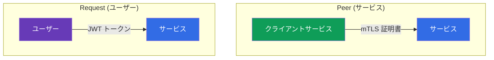
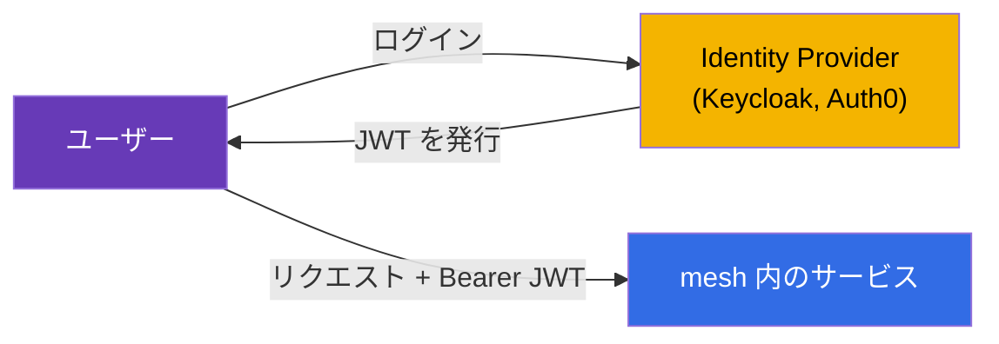
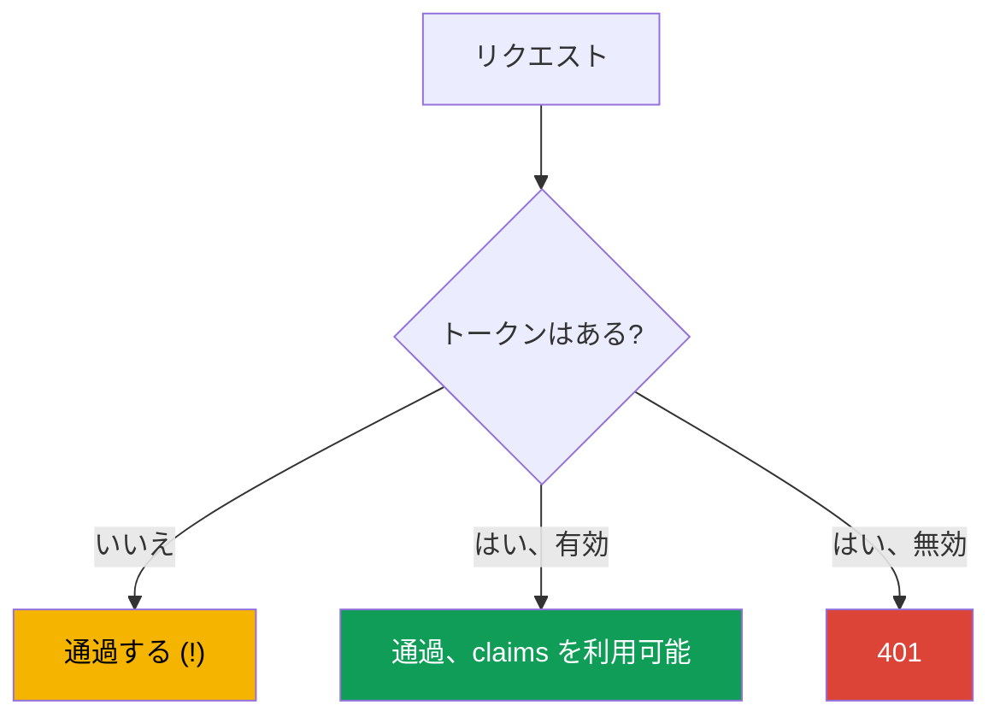
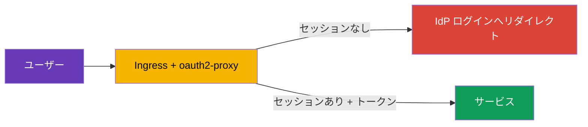
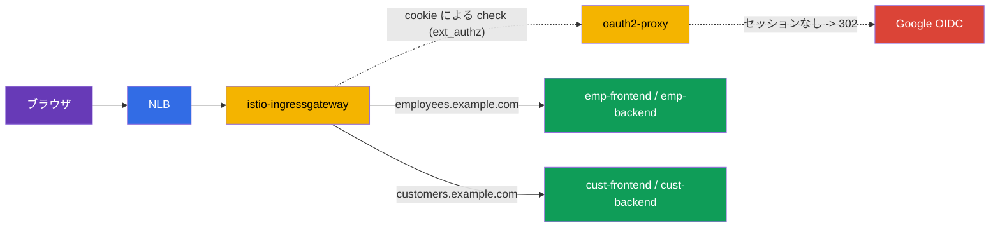

[Русская версия](ru.md) · [Eng version](en.md) · [Versión en español](es.md) · [Version française](fr.md) · [Deutsche Version](de.md) · [ქართული ვერსია](ge.md) · [繁體中文版](tw.md)

# 第15章。エンドユーザー認証: RequestAuthentication と JWT

> **この先の内容。** 第13章と第14章では、サービス同士の**サービス**認証と認可
> （mTLS、PeerAuthentication、AuthorizationPolicy）を扱いました。しかし、もう一つの
> 認証の種類、すなわち**エンドユーザー**の認証があります。リクエストが Identity Provider
> により発行されたトークン（JWT）を携帯し、サービスがそのトークンを検証しなければならない場合です。
> これは RequestAuthentication の役割です。

## 15.1. 二種類の認証

Istio では「これは誰か」という二つの問いを区別することが重要です。

- **Peer authentication** - この**送信元サービス**は誰か。mTLS 証明書で検証し、
  `PeerAuthentication`（第13章）で設定します。
- **Request authentication** - リクエストが代理している**エンドユーザー**は誰か。
  トークン（JWT）で検証し、`RequestAuthentication` で設定します。



これらは独立しています。リクエストには、サービスの mTLS アイデンティティとユーザーの
JWT トークンを同時に含められます。たとえば、`frontend`（サービス）が、ログイン済み
ユーザーのトークンを携帯して `backend` にアクセスします。

## 15.2. JWT とは

**JWT**（JSON Web Token）は、署名されたユーザー情報を渡すための標準的な手段です。
トークンはドットで区切られた三つの部分、`header.payload.signature` からなります。

- **header** - 署名アルゴリズムです。
- **payload** - ペイロード、いわゆる claims です。発行者（`iss`）、対象者（`aud`）、
  ユーザー（`sub`）、有効期限（`exp`）、任意のカスタムフィールド（ロール、email など）を含みます。
- **signature** - Identity Provider（Auth0、Keycloak、Google など）がトークンを
  保証するための署名です。

プロバイダーの公開鍵を使用して、署名からトークンの真正性を検証できます。これらの鍵は
標準的なアドレスで **JWKS**（JSON Web Key Set）形式として公開されます。Istio は JWKS を
自動で取得して署名を検証するため、手作業で復号する必要はありません。

## 15.3. JWT が必要な理由と利用方法

理論は分かりましたが、実務ではなぜ必要なのでしょうか。実際のシナリオで見てみましょう。

**アプリケーションでの仕組み。** ユーザーは OIDC/OAuth2 プロトコルを通じて Identity Provider
（Keycloak、Auth0、Google、Okta など）にログインします。応答として JWT トークンを受け取ります。
以降、クライアント（ブラウザ、モバイルアプリケーション）は、各リクエストの
`Authorization: Bearer <token>` ヘッダーにこのトークンを付けます。サービスはトークンを
検証し、ユーザーが誰で何を許可されているかを把握します。



**セッションではなく JWT を使う理由。** 従来のサーバーセッションでは、サーバーがセッション状態を
保存し、すべてのレプリカがそれにアクセスできる必要があります。マイクロサービスではこれは不便です。
JWT はこれを別の方法で解決します。

- **トークンが自己完結している。** ユーザーに関するすべての情報はすでにトークン内にあり、
  署名で保証されています。サーバーはセッションを保存したり、リクエストごとにデータベースへ
  問い合わせたりする必要がありません。
- **サービスチェーン全体で機能する。** `frontend` がトークンを受け取り、それを
  `orders`、`payments` などへ渡します。各サービスは発行者の公開鍵だけを知っていれば
  トークンを自ら検証でき、リクエストごとに認可サーバーへ問い合わせる必要がありません。
- **標準である。** JWT は OAuth2/OIDC エコシステムの一部であり、すべての IdP とライブラリが
  理解します。

**実際の利用例: **

- **Single Sign-On (SSO)。** ユーザーは企業の Keycloak に一度ログインし、一つのトークンで
  すべての内部サービスにアクセスします。
- **ロールによる API アクセス。** トークンの claims にロールまたは scopes（`role: admin`、
  `scope: orders.write`）があります。異なるエンドポイントに異なるロールを要求します。
- **マルチテナンシー。** トークンにテナント識別子（`tenant: acme`）があり、サービスは
  そのテナントのデータだけを返します。

**各アプリケーションではなく Istio で実施する理由。** もちろん各サービスのコードで JWT を
検証することもできます。しかしその場合、検証ロジック（鍵の取得、署名と有効期限の検証）を、
すべての言語・すべてのサービスで繰り返すことになります。Istio はこれをインフラストラクチャに
切り出します。

- アプリケーションはトークン検証コードを**書きません**。Envoy が実施します。
- 無効なトークンは、アプリケーションより**手前の入口**で除外されます。
- 発行者と鍵は各サービスではなく**一箇所**で設定します。
- 「どのロールがどのエンドポイントへアクセスできるか」の規則を、
  `AuthorizationPolicy` を通じて宣言的に記述します。

### 例: 権限の異なるユーザー

典型的な問題を詳しく見てみましょう。ある会社には二つのポータルがあります。

- **customer-portal** - 外部顧客向け（カタログと自分の注文を見る）。
- **internal-portal** - 従業員向け（管理画面、商品管理、レポート）。

どちらも一つのクラスタと一つの Istio から提供されますが、それぞれに異なるユーザーだけを
通す必要があります。全員が一つの Keycloak を通じてログインしますが、そのトークンには異なる
claims があります。たとえば、顧客のトークンには `role: customer`、従業員には
`role: employee`、管理者には `role: admin` があります。

これは次のように解決します。Istio がトークンを一度検証し、`AuthorizationPolicy` が各ポータルへ
必要なロールだけを通します。

顧客ポータルは `customer` だけを通します。

```yaml
apiVersion: security.istio.io/v1
kind: AuthorizationPolicy
metadata:
  name: customer-portal-access
  namespace: app
spec:
  selector:
    matchLabels:
      app: customer-portal
  action: ALLOW
  rules:
  - from:
    - source:
        requestPrincipals: ["*"]        # 有効なトークンが必要
    when:
    - key: request.auth.claims[role]
      values: ["customer"]              # かつロールが customer である必要がある
```

内部ポータルは従業員と管理者だけを通します。

```yaml
apiVersion: security.istio.io/v1
kind: AuthorizationPolicy
metadata:
  name: internal-portal-access
  namespace: app
spec:
  selector:
    matchLabels:
      app: internal-portal
  action: ALLOW
  rules:
  - from:
    - source:
        requestPrincipals: ["*"]
    when:
    - key: request.auth.claims[role]
      values: ["employee", "admin"]     # 従業員と管理者のみ
```

得られる結果:

- 自分のトークン（`role: customer`）を持つ顧客は customer-portal に入れますが、
  internal-portal では `403` を受け取ります。自分のロールが一覧にないためです。
- 従業員（`role: employee`）は反対に、内部ポータルを通過しますが、顧客ポータルでは
  `403` になります。
- トークンのないユーザーはどこにも入れません。

注意してください。`customer-portal` と `internal-portal` のアプリケーション自身には、
**ロール検証コードがありません**。アプリケーションはすでにフィルタリングされたトラフィックを
受け取るだけです。「誰がどこへ行けるか」というすべてのロジックは二つの `AuthorizationPolicy` に
宣言的に記述され、トークン検証は Istio が行います。`partner` ロールを持つパートナー向けポータルを
追加したければ、もう一つポリシーを書くだけで、アプリケーションに触れる必要はありません。

### アプリケーション自身は、どのユーザーが来たかを理解できるか?

自然な疑問です。検証を Istio が行うなら、アプリケーションは実際に誰がアクセスしたかを
知れるのでしょうか。はい。ただし重要な注意点があります。デフォルトでは Istio はトークンを
**検証**しますが、アプリケーションへ**転送しません**（`forwardOriginalToken: false` がデフォルトです）。
これはよくある落とし穴です。アプリケーションが `Authorization` ヘッダーを待っていても、
存在しません。アプリケーションにユーザーのアイデンティティを渡す方法は二つあります。

- `jwtRules` の **`forwardOriginalToken: true`** - 元のトークンを upstream 用に保存し、
  アプリケーションが自ら `Authorization: Bearer <token>` を解析します。
- **`outputClaimToHeaders`** - 必要な claims を単純なヘッダーに取り出します（下記参照）。
  その場合、アプリケーション自体にはトークンは不要です。

ここでは責任を分けることが重要です。

- **Istio は粗いアクセス制御を担います。** トークンは有効か。このロールはこのサービスまたは
  エンドポイントへ通れるか。これはビジネスロジックに依存しない部分です。
- **アプリケーションはデータレベルのロジックを担います。** まさに*自分の*注文を表示する、
  結果をパーソナライズする、誰が操作をしたかを監査へ記録する、といったことです。このために
  アプリケーションはユーザー識別子を必要とし、トークンから取得します。

例: `AuthorizationPolicy` は `role: customer` を持つユーザーを customer-portal に通しました
（粗いアクセス制御）。しかし、実際にどの顧客が来てどの注文を表示するかは、トークンの claim
`sub`（ユーザー識別子）に基づきアプリケーションが決めます。

アプリケーションが JWT を自分で解析しなくて済むよう、Istio は `RequestAuthentication` の
`outputClaimToHeaders` を通じて、必要な claims を**単純なヘッダーに取り出す**ことができます。

```yaml
apiVersion: security.istio.io/v1
kind: RequestAuthentication
metadata:
  name: jwt-auth
  namespace: app
spec:
  selector:
    matchLabels:
      app: backend                 # どの Pod に適用されるか
  jwtRules:
  - issuer: "https://my-idp.example.com"              # トークンの発行者
    jwksUri: "https://my-idp.example.com/jwks.json"   # 検証用の鍵の取得元
    outputClaimToHeaders:
    - header: x-user-id
      claim: sub          # アプリケーションは完成した x-user-id ヘッダーを読み取る
    - header: x-user-email
      claim: email
```

これでアプリケーションは JWT について何も知らずに、単に `x-user-id` ヘッダーを読みます。
真正性の検証はすでに Istio が行っているため、これらのヘッダーを信頼できます（外部クライアントは
偽装できません。Istio が検証済みトークンの値で上書きするためです）。

まとめると、Istio はアプリケーションから認証と粗い認可を取り除きますが、アプリケーションだけが
知り得るロジックのために、ユーザーのアイデンティティは引き続き利用可能です。

## 15.4. RequestAuthentication: JWT の検証

`RequestAuthentication` リソースは、どのトークンを有効と見なすか、すなわち発行者と、
署名検証のための鍵の取得先を Istio に伝えます。

```yaml
apiVersion: security.istio.io/v1
kind: RequestAuthentication
metadata:
  name: jwt-auth
  namespace: app
spec:
  selector:
    matchLabels:
      app: backend
  jwtRules:
  - issuer: "https://my-idp.example.com"          # トークンの発行者
    jwksUri: "https://my-idp.example.com/jwks.json"  # 検証用の鍵の取得元
```

Istio がこのポリシーで行うこと:

- リクエストにトークンが**あり**有効（正しい発行者、有効な署名、期限内）なら、トークンの claims は
  認可規則で利用可能になります。
- トークンが**あるが無効**（署名不正、別の発行者、期限切れ）なら、リクエストは `401` で拒否されます。

デフォルトでは、トークンは `Authorization: Bearer <token>` ヘッダーから取得します。クライアントが
トークンを非標準の場所（独自ヘッダーまたは query パラメータ）に置く場合は、`fromHeaders` /
`fromParams` で明示的に指定します。

```yaml
  jwtRules:
  - issuer: "https://my-idp.example.com"
    jwksUri: "https://my-idp.example.com/jwks.json"
    fromHeaders:
    - name: x-jwt-token       # 独自ヘッダー内のトークン
    fromParams:
    - token                   # または query パラメーター ?token=... 内
```

複数のソースを列挙でき、Istio は順番に検証します。

## 15.5. 最重要の注意点: トークンなしのリクエストは通過する

ここが誰もがつまずく最大の落とし穴です。`RequestAuthentication` はトークンの存在を**要求しません**。
トークンが**ある場合だけ**検証します。トークンがまったくないリクエストは
`RequestAuthentication` を問題なく通過します。



つまり、`RequestAuthentication` 単体ではサービスを保護しません。トークンを**要求する**には、
`AuthorizationPolicy` との組み合わせが必要です。以前と同じ原則です。一方のポリシーが検証し、
もう一方が要求します。

## 15.6. AuthorizationPolicy との組み合わせ

実際にサービスを閉じるには、検証済みのユーザーアイデンティティを要求する
`AuthorizationPolicy` を追加します。これは `requestPrincipals` で指定します。

```yaml
apiVersion: security.istio.io/v1
kind: AuthorizationPolicy
metadata:
  name: require-jwt
  namespace: app
spec:
  selector:
    matchLabels:
      app: backend
  action: ALLOW
  rules:
  - from:
    - source:
        requestPrincipals: ["*"]   # 任意の有効なトークンが必要
```

- **`requestPrincipals: ["*"]`** - リクエストに検証済みの request アイデンティティ
  （つまり有効な JWT）があることを要求します。アイデンティティの形式は
  `<issuer>/<subject>` です。アスタリスクは「任意の有効なトークン」を意味します。
- これでトークンのないリクエストは認可により `403` を受け取ります（無効なトークンなら
  RequestAuthentication の段階で先に `401` になります）。

単にトークンの存在だけでなく、`when` ブロックを通じて、特定のロールや発行者などの
具体的な claims を要求することもできます。

```yaml
apiVersion: security.istio.io/v1
kind: AuthorizationPolicy
metadata:
  name: require-jwt-admin
  namespace: app
spec:
  selector:
    matchLabels:
      app: backend
  action: ALLOW
  rules:
  - from:
    - source:
        requestPrincipals: ["*"]        # 有効なトークンが必要
    when:
    - key: request.auth.claims[role]    # かつ claim role が...
      values: ["admin"]                 # ...admin である必要がある
```

サービス `backend` の最終的なロジック:

- トークンなし -> `403`（AuthorizationPolicy）。
- 無効なトークン -> `401`（RequestAuthentication）。
- 必要な claim を持つ有効なトークン -> 通過。

## 15.7. 期限切れトークン: refresh と redirect

トークンの有効期間は短く（多くは5～15分）、これはセキュリティの一部です。トークンが期限切れに
なると何が起こるでしょうか。

**Istio 側では単純です。** 期限切れトークンは claim `exp` の検証に失敗するため、
`RequestAuthentication` があらゆる無効トークンと同じく `401` でリクエストを拒否します。
Istio にとって「署名が不正」と「トークンが期限切れ」の間に違いはありません。どちらも `401` です。

**そして、はっきり理解すべき重要な境界があります。** Istio はトークンを**検証するだけ**です。
ユーザーを**ログイン**させず、IdP のログインページへ**リダイレクト**せず、トークンを**更新**もしません。
Istio は OAuth2 クライアントではありません。そのため、Istio だけで「新しいトークンへの redirect」を
実現することはできません。新しいトークンの取得は一段上の層の仕事です。主な方法は二つあります。

**方法1: クライアント側で refresh（SPA、モバイルアプリケーション）。** クライアントはログイン時に
短命の access トークンだけでなく refresh トークンも受け取ります。アプリケーションが `401` を
受け取ったら、次を行います。

- refresh トークンを IdP で新しい access トークンに交換し、リクエストを再試行する。
- または refresh も期限切れなら、ユーザーを IdP のログインページへリダイレクトする。

このロジックはすべてクライアントコードにあり、Istio は関与しません。Istio は単に `401` を返し、
その後はクライアントが対処します。

**方法2: 境界の auth プロキシ（セッションを持つブラウザアプリケーション）。** 従来の Web アプリケーション
では、ログインへの redirect を入口の専用プロキシ、たとえば **oauth2-proxy** または同等品に
切り出すのが便利です。このプロキシが完全な OIDC フローを行います。未認証ユーザーを IdP に
リダイレクトし、セッションを cookie に保持し、リクエストにトークンを挿入します。Istio はこのような
プロキシを外部認可（第14章で扱った `AuthorizationPolicy` の `action: CUSTOM`）で接続します。



**方法3: クラウドエッジでログイン（ALB、Cloudflare、CloudFront）。** ログインはロードバランサー/CDN
そのものへさらに外出しでき、その場合は独立した oauth2-proxy は不要です。これはエッジが L7 と OIDC を
理解する場合にだけ機能します。

- **AWS ALB - はい、標準で対応。** listener ルールには `authenticate-oidc`（および
  `authenticate-cognito`）アクションがあります。ALB 自身が未認証者を IdP へリダイレクトし、
  セッションを cookie に保持し、署名済み JWT を `x-amzn-oidc-data` ヘッダー（および
  `x-amzn-oidc-identity` / `x-amzn-oidc-accesstoken`）に追加します。以降 Istio は
  `RequestAuthentication` でこの JWT を**検証するだけ**です。代償は、mesh の前に「純粋な」
  NLB ではなく ALB（L7）が置かれることです。
- **Cloudflare - はい、Cloudflare Access（Zero Trust）。** エッジで完全な SSO/OIDC を行います。
  署名済み JWT `Cf-Access-Jwt-Assertion` が出力され、Istio は Cloudflare の JWKS
  （`https://<team>.cloudflareaccess.com/cdn-cgi/access/certs`）でこれを検証します。
- **CloudFront - そのままでは不可。** 組み込みの OIDC ログインはなく、
  **Lambda@Edge / CloudFront Functions**（独自の OIDC コード）または Cognito で実装します。
  つまりプロキシロジックは依然として書く必要があり、edge 関数という形式になるだけです。
- **NLB - 不可。** これは L4 であり HTTP/OIDC ロジックを持たないため、原理的にログインはできません。

すべての「はい」の選択肢で Istio の役割は変わりません。対話的ログインはエッジが行い、Istio は
署名済み JWT を**検証**（`RequestAuthentication`）してアクセスを強制します
（`AuthorizationPolicy`）。`RequestAuthentication` の発行者と `jwksUri` は、元の IdP ではなく
対応するエッジ（ALB/Cloudflare）を指します。

> **重要 - エッジの迂回経路を閉じる。** ingress gateway に ALB/Cloudflare を**経由せずに**
> 到達できると、攻撃者はヘッダー（`x-amzn-oidc-*`、`Cf-Access-*`）を偽装して通過できます。
> したがって必須事項は、(1) Istio が edge-JWT の署名を JWKS により**検証**し、ヘッダーを
> うのみにしないこと、(2) gateway へのアクセスをエッジからだけに制限することです。CDN/ALB IP 用の
> security group、private NLB、エッジからの mTLS などを使用します。

**何を選ぶか:** SPA とモバイルアプリケーションではクライアント自身が refresh を行います。セッションを
持つサーバーサイドのブラウザアプリケーションでは auth プロキシ（`oauth2-proxy`）またはクラウドエッジの
ログイン（ALB `authenticate-oidc`、Cloudflare Access）を使います。どの場合も Istio は JWT の検証と
`401` の返却だけを担い、redirect とトークン更新はクライアント、auth プロキシ、またはエッジの役割です。

> **では、ヘッダーがないことを VirtualService で見るだけではだめか?**
> `VirtualService` で `withoutHeaders`（`Authorization` がない）をマッチし、そのようなリクエストを
> 「redirect サービス」へ送る考えは自然です。技術的には VirtualService には match と静的な `redirect`
> さえありますが、auth プロキシの代わりにはなりません。(1) VirtualService が見るのは「ヘッダーが
> ある/ない」だけで**有効性を検証しない**ため、`Authorization: Bearer garbage` は match を通過します。
> (2) ブラウザはナビゲーション時に `Authorization` をそもそも送信しません（セッションは cookie にある）ので、
> シグナルが誤っています。(3) 完全な OIDC フロー（`/callback`、`code` の交換、cookie、PKCE）は、
> 依然として受け側サービスが実装しなければならず、それが oauth2-proxy です。「未認証者の redirect」には、
> `ext_authz`（`action: CUSTOM`）があり、ヘッダーの有無で match するのではなく、**検証できる**
> コンポーネントが判断します。

> **コスト: データパス対検証のみ。** よくある懸念は「すべてのトラフィックがプロキシを通るので高い」です。
> これは、`oauth2-proxy` がアプリケーションの**手前の reverse-proxy**として置かれるモード
> （本文と応答がそこを流れる）でだけ正しいものです。推奨モードの **`ext_authz`（`action: CUSTOM`）では
> プロキシはデータパスにありません**。Envoy はリクエストに対し軽量な check サブリクエスト
> （本文なし、ヘッダー/cookie のみ）を送り、「許可/`302`」を受け、成功ならリクエストを**直接アプリケーションへ**
> 送ります。ペイロードはプロキシを通りません。さらに次の方法で低コスト化します。ingress gateway だけで
> 検証する、`CUSTOM` ポリシーを必要なホスト/パス（管理画面）にスコープし公開部分には適用しない、ログイン後に
> リクエストが有効な JWT を持つなら `RequestAuthentication` へ移行する。Envoy は**外部呼び出しなしに
> ローカルで**署名を検証します。クラウドエッジ（ALB/Cloudflare）のログインでは、mesh 内にデータパス上の
> プロキシはまったくなく、JWT のローカル検証だけです。

## 15.8. 完全な例: 二つのポータル、Google と oauth2-proxy によるログイン

実際のシナリオですべてを組み合わせます。前提:

- クラスタへの入口は **NLB → istio-ingressgateway**（L4 ロードバランサーであり、ログインはできません、
  15.7）。
- ユーザーは **Google**（OIDC）でログインします。
- 異なるホスト上の二つのポータル: **`employees.example.com`**（従業員向け）と
  **`customers.example.com`**（顧客向け）。
- 各ポータルには独自の **frontend および backend** サービスがあります。
- 分離: 従業員ポータルには企業アカウント（`*@company.com`）だけを通し、顧客ポータルには
  認証済みの任意の Google アカウントを通します。

ログインロジックは **oauth2-proxy** が担います（Google 自体は redirect できず、これはプロキシが行います）。
これは Istio に外部認可（`ext_authz`、`action: CUSTOM`）として接続されます。プロキシは**データパス上に
ありません**。Envoy は cookie に基づき「通してよいか」だけを問い合わせます（15.7）。



**1. oauth2-proxy: Deployment、Service、Secret**（namespace `auth`）。cookie は `.example.com` に
設定し、一つのセッションが両方のポータルで機能するようにします。`--email-domain=*` は任意の
Google アカウントのログインを許可します（ポータルごとの分離は後で Istio により行います）。

```yaml
apiVersion: v1
kind: Secret
metadata:
  name: oauth2-proxy
  namespace: auth
type: Opaque
stringData:
  client-id: "<google-client-id>"
  client-secret: "<google-client-secret>"
  cookie-secret: "<32バイトのランダムなシークレット>"   # openssl rand -base64 32
---
apiVersion: apps/v1
kind: Deployment
metadata:
  name: oauth2-proxy
  namespace: auth
spec:
  replicas: 2
  selector:
    matchLabels: { app: oauth2-proxy }
  template:
    metadata:
      labels: { app: oauth2-proxy }
    spec:
      containers:
      - name: oauth2-proxy
        image: quay.io/oauth2-proxy/oauth2-proxy:v7.6.0
        args:
        - --provider=google
        - --email-domain=*                       # 任意の Google アカウントでログインを許可
        - --http-address=0.0.0.0:4180
        - --reverse-proxy=true                   # ingress からの X-Forwarded-* を信頼する
        - --set-xauthrequest=true                # auth の応答に X-Auth-Request-* を返す
        - --cookie-domain=.example.com           # *.example.com 共通のセッション
        - --whitelist-domain=.example.com
        - --redirect-url=https://auth.example.com/oauth2/callback
        - --upstream=static://200
        env:
        - name: OAUTH2_PROXY_CLIENT_ID
          valueFrom: { secretKeyRef: { name: oauth2-proxy, key: client-id } }
        - name: OAUTH2_PROXY_CLIENT_SECRET
          valueFrom: { secretKeyRef: { name: oauth2-proxy, key: client-secret } }
        - name: OAUTH2_PROXY_COOKIE_SECRET
          valueFrom: { secretKeyRef: { name: oauth2-proxy, key: cookie-secret } }
        ports:
        - containerPort: 4180
---
apiVersion: v1
kind: Service
metadata:
  name: oauth2-proxy
  namespace: auth
spec:
  selector: { app: oauth2-proxy }
  ports:
  - name: http
    port: 4180
    targetPort: 4180
```

**2. oauth2-proxy を外部認可プロバイダーとして MeshConfig に登録します。** `action: CUSTOM` は
これを参照します。

```yaml
apiVersion: install.istio.io/v1alpha1
kind: IstioOperator
spec:
  meshConfig:
    extensionProviders:
    - name: oauth2-proxy
      envoyExtAuthzHttp:
        service: oauth2-proxy.auth.svc.cluster.local
        port: 4180
        includeRequestHeadersInCheck: ["authorization", "cookie"]   # 検証に送る内容
        headersToUpstreamOnAllow:                                   # allow 時にリクエストへ追加する内容
        - "authorization"
        - "x-auth-request-email"
        - "x-auth-request-user"
        headersToDownstreamOnDeny: ["content-type", "set-cookie"]   # ログインへの 302 用
```

**3. Gateway** は三つのホスト用です。ログインポータル自体（`auth.example.com` → oauth2-proxy）と
二つのポータルです。TLS は `SIMPLE`（第9章）で、証明書は cert-manager のものなどを使えます。

```yaml
apiVersion: networking.istio.io/v1
kind: Gateway
metadata:
  name: portals-gw
  namespace: istio-system
spec:
  selector:
    istio: ingressgateway
  servers:
  - port: { number: 443, name: https, protocol: HTTPS }
    tls: { mode: SIMPLE, credentialName: portals-cert }
    hosts:
    - auth.example.com
    - employees.example.com
    - customers.example.com
```

**4. VirtualService 群。** ホスト `auth.example.com` は完全に oauth2-proxy へ送られます
（ここには `/oauth2/start`、`/oauth2/callback` があります）。各ポータルでは `/api` → backend、
それ以外すべて → frontend です。

```yaml
apiVersion: networking.istio.io/v1
kind: VirtualService
metadata:
  name: auth-vs
  namespace: istio-system
spec:
  hosts: ["auth.example.com"]
  gateways: ["portals-gw"]
  http:
  - route:
    - destination:
        host: oauth2-proxy.auth.svc.cluster.local
        port: { number: 4180 }
---
apiVersion: networking.istio.io/v1
kind: VirtualService
metadata:
  name: employees-vs
  namespace: istio-system
spec:
  hosts: ["employees.example.com"]
  gateways: ["portals-gw"]
  http:
  - match: [{ uri: { prefix: /api } }]
    route:
    - destination: { host: emp-backend.portals.svc.cluster.local, port: { number: 8080 } }
  - route:
    - destination: { host: emp-frontend.portals.svc.cluster.local, port: { number: 8080 } }
---
apiVersion: networking.istio.io/v1
kind: VirtualService
metadata:
  name: customers-vs
  namespace: istio-system
spec:
  hosts: ["customers.example.com"]
  gateways: ["portals-gw"]
  http:
  - match: [{ uri: { prefix: /api } }]
    route:
    - destination: { host: cust-backend.portals.svc.cluster.local, port: { number: 8080 } }
  - route:
    - destination: { host: cust-frontend.portals.svc.cluster.local, port: { number: 8080 } }
```

**5. 入口でログインを要求します**。ingress gateway 上の `action: CUSTOM` を持つ
`AuthorizationPolicy` です。これはポータルのすべてのホストで oauth2-proxy を呼びますが、
`/oauth2/*` パス（そうしないと callback がログインできない）と `auth.example.com` には**適用しません**。

```yaml
apiVersion: security.istio.io/v1
kind: AuthorizationPolicy
metadata:
  name: require-login
  namespace: istio-system
spec:
  selector:
    matchLabels:
      istio: ingressgateway
  action: CUSTOM
  provider:
    name: oauth2-proxy          # extensionProviders の名前 (手順2)
  rules:
  - to:
    - operation:
        hosts: ["employees.example.com", "customers.example.com"]
        notPaths: ["/oauth2/*"]   # callback/ログインのエンドポイントはゲートしない
```

この後、未認証ユーザーはどちらのポータルでも Google ログインへの `302` を受け取り、ログイン後に
oauth2-proxy はリクエストへ `X-Auth-Request-Email` ヘッダーを渡します（信頼できる値です。クライアントでなく
認可応答が設定します）。

**6. ポータルを分離します**。サービス自体（namespace `portals`）上の通常の `ALLOW` ポリシーです。
顧客ポータルはログイン済みなら誰でも、従業員ポータルは `*@company.com` だけです。`values` では wildcard が
サポートされます。

```yaml
# 従業員ポータル: 企業アドレスのみ
apiVersion: security.istio.io/v1
kind: AuthorizationPolicy
metadata:
  name: employees-only-corp
  namespace: portals
spec:
  selector:
    matchLabels: { portal: employees }   # emp-frontend と emp-backend のラベル
  action: ALLOW
  rules:
  - when:
    - key: request.headers[x-auth-request-email]
      values: ["*@company.com"]           # 接尾辞の wildcard
---
# クライアントポータル: ログイン済みであれば十分 (ヘッダーが存在する)
apiVersion: security.istio.io/v1
kind: AuthorizationPolicy
metadata:
  name: customers-any-authenticated
  namespace: portals
spec:
  selector:
    matchLabels: { portal: customers }
  action: ALLOW
  rules:
  - when:
    - key: request.headers[x-auth-request-email]
      values: ["*"]                        # 空でない email = ログイン済み
```

**得られる結果:**

- 個人の Gmail を持つ顧客は `customers.example.com` に入れますが、`employees.example.com` では
  `403` を受け取ります（email が `*@company.com` ではないためです）。
- 従業員（`ivan@company.com`）は両方を通過します（意図した場合）。または顧客ポータルを別途制限してください。
- 匿名ユーザーは、入口ですでに Google ログインへの `302` になります。

**7. ヘッダー偽装を防ぎます。** `X-Auth-Request-Email` は、クライアントが自分で送れない場合にだけ
信頼できます。そうでなければ誰かが `X-Auth-Request-Email: boss@company.com` を送って、手順6の規則を
迂回できます。ingress gateway では受信する `x-auth-request-*` を**除去**する必要があります。

注意点は、**いつ**除去するかです。VirtualService の通常の `headers.request.remove` はここでは
使えません。これは `ext_authz` の**後**にルーターで実行され、oauth2-proxy がすでに設定した信頼できる
ヘッダーまで消してしまいます。検証の**前**に除去する必要があるため、`ext_authz` フィルターの**前**に
挿入した EnvoyFilter を使用します。

```yaml
apiVersion: networking.istio.io/v1alpha3
kind: EnvoyFilter
metadata:
  name: strip-auth-headers
  namespace: istio-system
spec:
  selector:
    matchLabels:
      istio: ingressgateway
  configPatches:
  - applyTo: HTTP_FILTER
    match:
      context: GATEWAY
      listener:
        filterChain:
          filter:
            name: envoy.filters.network.http_connection_manager
            subFilter:
              name: envoy.filters.http.ext_authz
    patch:
      operation: INSERT_BEFORE          # ext_authz より前に実行する
      value:
        name: envoy.filters.http.lua
        typed_config:
          "@type": type.googleapis.com/envoy.extensions.filters.http.lua.v3.Lua
          inlineCode: |
            function envoy_on_request(handle)
              -- クライアントが偽装し得るものをすべて除去する。信頼できる値は
              -- headersToUpstreamOnAllow を通じて oauth2-proxy が設定する (手順2)
              handle:headers():remove("x-auth-request-email")
              handle:headers():remove("x-auth-request-user")
              handle:headers():remove("x-auth-request-preferred-username")
              handle:headers():remove("x-auth-request-groups")
            end
```

フィルター順序は次のようになります。最初に Lua がクライアントの `x-auth-request-*` を**削除**し、
次に `ext_authz`（oauth2-proxy）が検証に成功すると、それらを検証済みの値として再び**設定**します。
これでポータルに届くヘッダーを信頼できます。

**アプリケーションへのアイデンティティ伝達（ビジネスロジック向け）。** ポータルには「許可/拒否」だけでは
不十分です。誰がログインしたか、すなわちどの注文を見せるか、監査に何を記録するか、結果をどう
パーソナライズするかを知る必要があります。同じ仕組みがそのアイデンティティを伝えます。手順2で、
検証成功時に Envoy がリクエストへ追加するヘッダーを `headersToUpstreamOnAllow` にすでに列挙しました。
アプリケーションが読むのはまさにこれらです。

- `X-Auth-Request-Email` - ユーザーの email。
- `X-Auth-Request-User` - 識別子（`sub`）。
- 必要ならさらに `X-Auth-Request-Preferred-Username`、`X-Auth-Request-Groups`、
  `X-Auth-Request-Access-Token`（最後のものは oauth2-proxy で `--pass-access-token` を有効にした場合）。

つまり `emp-frontend`/`emp-backend` は JWT を解析せず Google にも問い合わせず、リクエストから
完成した `X-Auth-Request-Email` ヘッダーを読むだけです。新しい属性を追加するには、oauth2-proxy で
対応するフラグを有効にして `headersToUpstreamOnAllow`（手順2）にヘッダーを書き足します。
アプリケーションに触れる必要はありません。

```yaml
# 手順2の extensionProviders の一部 - ヘッダーのリストを拡張する
        headersToUpstreamOnAllow:
        - "authorization"
        - "x-auth-request-email"
        - "x-auth-request-user"
        - "x-auth-request-preferred-username"
        - "x-auth-request-groups"
```

アプリケーションがこれらのヘッダーを信頼できるのは、クライアントが自分で送れないから**だけ**です。
受信する `x-auth-request-*` は ingress gateway で除去されます（上記の偽装に関する注記を参照）。
これは 15.3 の `outputClaimToHeaders` と同じ原則です。認証と粗いアクセスは mesh が行い、
アプリケーションへのアイデンティティは単純なヘッダーで渡されます。

**より厳格な選択肢。** ヘッダーを信頼する代わりに、oauth2-proxy に**Google ID トークンそのもの**
（`Authorization: Bearer`）を転送させ、mesh で `RequestAuthentication` を通じて検証できます
（issuer `https://accounts.google.com`、JWKS `https://www.googleapis.com/oauth2/v3/certs`）。その後、
ポータルはヘッダーではなく claim `request.auth.claims[hd]`（Google Workspace の hosted domain）で
分離します。こうするとアイデンティティは信頼済みヘッダーではなく暗号署名で保証されます。アプリケーションも
検証済みトークンの全 claims を得られます（`forwardOriginalToken: true` または
`outputClaimToHeaders`、15.3 を使用）。

## 15.9. 適用場所: ingress gateway またはサービス

`RequestAuthentication` は特定サービスにも ingress gateway にも適用できます。

- **ingress gateway 上** - トークンはクラスタへの入口で、トラフィックがサービスに到達する前に
  検証されます。境界でユーザーを一度だけ検証するのに便利です。
- **特定サービス上** - サービスごとに異なる発行者のトークンを受け入れる場合や、一部のサービスが
  完全に公開されている場合に、より細かな制御ができます。

実務では、ingress gateway で検証することが多くあります（単一の入口）。内部サービスは境界を通過した
トラフィックを信頼し（加えて mTLS とサービス間の AuthorizationPolicy で保護されます）。

## 15.10. 検証とデバッグ

JWT 設定の失敗方は予測可能で、応答コードがどこを探すべきかをすぐに示します。

- **`401`** は `RequestAuthentication` が返します。トークンはあるが無効です。`issuer` が違う、
  期限切れ（`exp`）、署名不正、または `jwksUri` に到達できません。
- **`403 RBAC: access denied`** は `AuthorizationPolicy` が返します。トークンがまったくない
  （`requestPrincipals` が要求している）か、`when` の必要な claim が一致しません。

よくある原因と確認事項:

- **`issuer` が一致しない** - トークンの claim `iss` と一文字単位で一致しなければなりません
  （余分な/不足したスラッシュがよくある誤りです）。
- **`jwksUri` に到達できない** - クラスタ外の IdP で egress が閉じている（`REGISTRY_ONLY`、第12章）場合、
  Istio は鍵をダウンロードできません。IdP ホスト用の `ServiceEntry` が必要です。
- **アプリケーションがトークンを見られない** - デフォルトでは転送されません（`forwardOriginalToken`、15.3）。
- **claim が match しない** - たとえば `jwt.io` または `cut -d. -f2 | base64 -d` を使い、payload
  （base64url）をデコードして実際のトークン内容を確認してください。

対象 sidecar のログも第14章と同様に、拒否理由を示します（`grep -i jwt` / `rbac`）。

## 15.11. Best practices

- **`RequestAuthentication` は常に `AuthorizationPolicy` と組み合わせる。** それ自体では
  トークンを要求しません（15.5）。`requestPrincipals` がなければ、トークンなしのリクエストに対して
  サービスは開いたままです。
- **正確な `issuer` と HTTPS の `jwksUri`。** 発行者は `iss` と正確に一致する必要があります。
  鍵は HTTPS 経由だけで取得してください。`jwksUri` があるなら鍵をハードコードしないでください。
  Istio が自動更新します。
- **必要がなければトークンを転送しない。** `forwardOriginalToken: false`（デフォルト）のままとし、
  必要な claims だけを `outputClaimToHeaders` でアプリケーションに渡します。チェーンの先で
  トークンが漏洩するリスクを減らせます。
- **トークンの存在だけでなく claims も検証する。** `requestPrincipals: ["*"]` は任意の有効トークンを
  通します。実際のアクセスでは `when` によりロール/対象者で制限してください。
- **JWT は mTLS を置き換えない。** request 認証（ユーザー）と peer 認証（サービス）は互いを補います。
  サービスは STRICT mTLS と JWT の両方で閉じてください。
- **検証は境界で行う。** 発行者が一つなら、すべてのサービスにばらまくのではなく ingress gateway
  （単一の入口）でトークンを検証します。

## 15.12. この章のまとめ

- Istio はサービス認証（peer、mTLS、`PeerAuthentication`）とユーザー認証（request、JWT、
  `RequestAuthentication`）を区別します。これらは独立した仕組みです。
- JWT は claims（iss、sub、aud、exp、カスタム）を持つ署名済みトークンです。署名は発行者の公開鍵
  （JWKS）で検証されます。
- JWT はマイクロサービスに便利です。自己完結しており（サーバーセッション不要）、サービスチェーンを
  通って渡せ、認可サーバーへアクセスせずに検証できます。SSO、ロールベースアクセス、マルチテナンシーに
  使用されます。
- JWT 検証は Istio に切り出せるため、アプリケーションはコードに重複して実装せず、無効トークンは入口で
  除外されます。
- 期限切れトークンは Istio が `401` で拒否します。ログインへの redirect とトークン更新は Istio の
  役割ではありません。クライアント（refresh トークン）、auth プロキシ（`action: CUSTOM` を通じた
  oauth2-proxy）、または署名済み JWT を発行し Istio が検証するクラウドエッジ（ALB `authenticate-oidc`、
  Cloudflare Access）が実施します。NLB（L4）はログインできません。
- Auth プロキシはデータパス上にある必要はありません。`ext_authz` モードでは Envoy はヘッダーによる
  軽量な check だけを送り、ペイロードは直接アプリケーションへ行きます。ログイン後は
  `RequestAuthentication` によるローカル検証が最も低コストです。VirtualService の `withoutHeaders`
  による match は auth プロキシの代わりになりません（有無を検証し、有効性を検証しないためです）。
- `RequestAuthentication` は、どのトークンが有効か（`issuer`、`jwksUri`）を指定し、検証します。
- **重要な注意点:** `RequestAuthentication` 自体はトークンを要求しません。トークンのないリクエストは
  通過します。存在するトークンだけが検証されます（無効なら -> 401）。
- トークンを**要求する**には `requestPrincipals` を持つ `AuthorizationPolicy` が必要です。
  具体的な claims は `when` で検証します。
- デフォルトでは Istio はトークンをアプリケーションへ**転送しません**（`forwardOriginalToken: false`）。
  アプリケーションにアイデンティティを渡すには `forwardOriginalToken: true` または
  `outputClaimToHeaders` を使用します。
- トークンはデフォルトで `Authorization: Bearer` から取得します。非標準の場所は
  `fromHeaders`/`fromParams` で指定します。
- 診断: `401` = 無効トークン（`RequestAuthentication`）、`403` = トークンなしまたは claim 不一致
  （`AuthorizationPolicy`）。よくある原因は `issuer` 不一致、到達不能な `jwksUri`（egress/ServiceEntry が必要）です。
- 検証は ingress gateway（単一の入口）で行うか、特定のサービスで個別に行えます。

## 15.13. 自己確認の質問

1. request authentication（ユーザー）は peer authentication（サービス）とどう異なりますか?
2. JWT は何から構成され、Istio はどのようにその真正性を検証しますか?
3. `RequestAuthentication` 単体ではなぜサービスを保護しないのですか?
4. トークンの存在を要求するにはどうし、特定の claim はどう検証しますか?
5. 完全な設定時、トークンなしのリクエストと無効なトークンを持つリクエストにサービスはどのコードを返しますか?
6. JWT がマイクロサービスでサーバーセッションより便利なのはなぜですか。また、なぜ検証を各アプリケーションの
   コードではなく Istio に切り出すのですか?
7. 期限切れトークンに Istio は何を返し、ログインへの redirect とトークン更新は誰が担いますか?
8. デフォルトでアプリケーションは JWT を受け取りますか? ユーザーのアイデンティティをアプリケーションへ
   渡すにはどうしますか?
9. JWT 設定で `401` と `403` はどう異なり、それぞれのよくある原因は何ですか?
10. oauth2-proxy の代わりに OIDC ログインを ALB / Cloudflare / CloudFront / NLB に切り出せますか?
    その場合 Istio は何を行い、エッジの迂回をどう防ぎますか?
11. VirtualService の `withoutHeaders` による match が auth プロキシの代わりにならないのはなぜですか?
12. 必ずすべてのトラフィックが auth プロキシを通りますか? `ext_authz` は reverse-proxy よりなぜ安く、
    検証コストをさらにどう下げられますか?
13. 二つのポータルのエンドツーエンド例では、Google によるログインはどう実装され、ポータルはどう分離され、
    なぜ受信 `x-auth-request-*` ヘッダーを除去する必要がありますか?

## 演習

JWT 検証を練習してください: RequestAuthentication + AuthorizationPolicy、トークンなし、無効な
トークン、有効なトークンでの動作です。

🧪 ラボ 11: [tasks/ica/labs/11](../../labs/11/README_JP.MD)

---
[目次](../README_JP.md) · [第14章](../14/jp.md) · [第16章](../16/jp.md)
