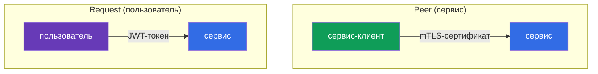
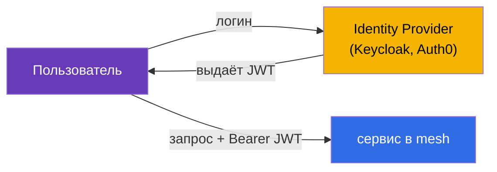
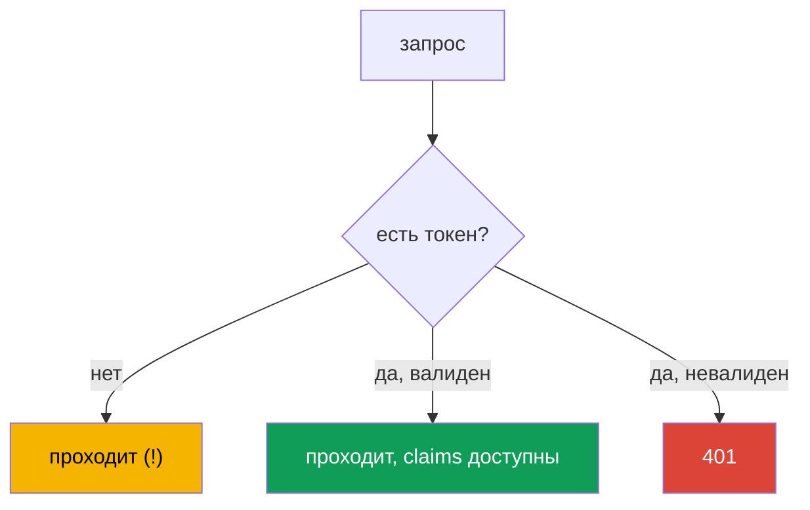
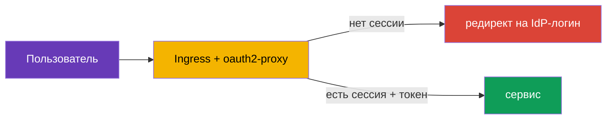
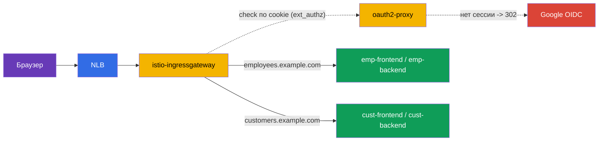

[Eng version](en.md) · [Versión en español](es.md) · [Version française](fr.md) · [Deutsche Version](de.md)

# Глава 15. Аутентификация пользователей: RequestAuthentication и JWT

> **Что дальше.** В главах 13 и 14 мы разбирались с аутентификацией и авторизацией
> **сервисов** между собой (mTLS, PeerAuthentication, AuthorizationPolicy). Но есть и
> второй тип аутентификации - **конечного пользователя**: когда запрос несёт токен
> (JWT), выданный вашим Identity Provider, и сервис должен проверить этот токен. Этим
> занимается RequestAuthentication.

## 15.1. Два типа аутентификации

В Istio важно различать два вопроса «кто это»:

- **Peer authentication** - кто этот **сервис-отправитель**. Проверяется по
  mTLS-сертификату, настраивается через `PeerAuthentication` (глава 13).
- **Request authentication** - кто этот **конечный пользователь**, от имени которого
  идёт запрос. Проверяется по токену (JWT), настраивается через `RequestAuthentication`.



Это независимые вещи: запрос может одновременно иметь и mTLS-личность сервиса, и
JWT-токен пользователя. Например, `frontend` (сервис) обращается к `backend`, неся токен
пользователя, который вошёл в систему.

## 15.2. Что такое JWT

**JWT** (JSON Web Token) - это стандартный способ передать подписанную информацию о
пользователе. Токен состоит из трёх частей через точку: `header.payload.signature`.

- **header** - алгоритм подписи.
- **payload** - полезные данные, так называемые claims: кто выдал (`iss`), кому
  (`aud`), кто пользователь (`sub`), когда истекает (`exp`) и любые кастомные поля
  (роли, email и т.д.).
- **signature** - подпись, которой Identity Provider (Auth0, Keycloak, Google и т.п.)
  заверяет токен.

Проверить подлинность токена можно по подписи, используя публичные ключи провайдера.
Эти ключи публикуются по стандартному адресу в формате **JWKS** (JSON Web Key Set).
Istio сам скачивает JWKS и проверяет подпись - вручную ничего расшифровывать не нужно.

## 15.3. Зачем нужен JWT и как его применяют

Теория понятна, но зачем это всё на практике? Разберём на реальном сценарии.

**Как это работает в приложении.** Пользователь входит в систему через Identity Provider
(Keycloak, Auth0, Google, Okta и т.п.) по протоколу OIDC/OAuth2. В ответ он получает
JWT-токен. Дальше клиент (браузер, мобильное приложение) прикладывает этот токен к
каждому запросу в заголовке `Authorization: Bearer <token>`. Сервисы проверяют токен и
понимают, кто пользователь и что ему можно.



**Почему именно JWT, а не сессии.** Классические серверные сессии требуют, чтобы сервер
хранил состояние сессий и все реплики имели к нему доступ. В микросервисах это неудобно.
JWT решает это иначе:

- **Токен самодостаточен.** Вся информация о пользователе уже внутри токена и заверена
  подписью. Серверу не нужно хранить сессии и ходить в базу на каждый запрос.
- **Работает через всю цепочку сервисов.** `frontend` получил токен и передаёт его
  дальше в `orders`, `payments` и т.д. Каждый сервис может проверить токен сам, зная
  только публичные ключи издателя - не нужно на каждый запрос дёргать сервер авторизации.
- **Стандарт.** JWT это часть экосистемы OAuth2/OIDC, его понимают все IdP и библиотеки.

**Где это реально применяют:**

- **Single Sign-On (SSO).** Пользователь один раз логинится в корпоративный Keycloak и
  ходит по всем внутренним сервисам с одним токеном.
- **Доступ к API по ролям.** В claims токена лежат роли или scopes (`role: admin`,
  `scope: orders.write`). Разные эндпоинты требуют разных ролей.
- **Мультитенантность.** В токене лежит идентификатор арендатора (`tenant: acme`), и
  сервис отдаёт данные только этого арендатора.

**Зачем это делать в Istio, а не в каждом приложении.** Можно, конечно, проверять JWT в
коде каждого сервиса. Но тогда логику проверки (скачивание ключей, валидация подписи,
срока годности) придётся повторять на каждом языке и в каждом сервисе. Istio выносит это
в инфраструктуру:

- приложения **не пишут** код проверки токенов - это делает Envoy;
- невалидные токены отсекаются **на входе**, ещё до приложения;
- издатель и ключи настраиваются **в одном месте**, а не в каждом сервисе;
- правила «какая роль к какому эндпоинту» описываются декларативно через
  `AuthorizationPolicy`.

### Пример: разные пользователи с разными правами

Разберём типичную задачу подробно. В компании два портала:

- **customer-portal** - для внешних клиентов (смотрят каталог, свои заказы);
- **internal-portal** - для сотрудников (админка, управление товарами, отчёты).

Оба доступны через один кластер и один Istio, но пускать в них надо разных людей. Все
входят через один Keycloak, но в их токенах разные claims. Например, у клиента в токене
`role: customer`, у сотрудника - `role: employee`, у администратора - `role: admin`.

Задача решается так: Istio проверяет токен один раз, а `AuthorizationPolicy` пускает к
каждому порталу только нужные роли.

Клиентский портал - пускаем только `customer`:

```yaml
apiVersion: security.istio.io/v1
kind: AuthorizationPolicy
metadata:
  name: customer-portal-access
  namespace: app
spec:
  selector:
    matchLabels:
      app: customer-portal
  action: ALLOW
  rules:
  - from:
    - source:
        requestPrincipals: ["*"]        # нужен валидный токен
    when:
    - key: request.auth.claims[role]
      values: ["customer"]              # и роль должна быть customer
```

Внутренний портал - пускаем только сотрудников и админов:

```yaml
apiVersion: security.istio.io/v1
kind: AuthorizationPolicy
metadata:
  name: internal-portal-access
  namespace: app
spec:
  selector:
    matchLabels:
      app: internal-portal
  action: ALLOW
  rules:
  - from:
    - source:
        requestPrincipals: ["*"]
    when:
    - key: request.auth.claims[role]
      values: ["employee", "admin"]     # только сотрудники и админы
```

Что получаем:

- Клиент со своим токеном (`role: customer`) попадёт в customer-portal, но на
  internal-portal получит `403` - его роли нет в списке.
- Сотрудник (`role: employee`) наоборот: пройдёт во внутренний портал, а на клиентский -
  `403`.
- Пользователь без токена не пройдёт никуда.

Обратите внимание: сами приложения `customer-portal` и `internal-portal` **не содержат
кода проверки ролей**. Они просто получают уже отфильтрованный трафик. Вся логика «кто
куда может» описана декларативно в двух `AuthorizationPolicy`, а проверку токена сделал
Istio. Захотели добавить портал для партнёров с ролью `partner` - просто пишете ещё одну
политику, приложения трогать не нужно.

### А само приложение понимает, что за пользователь пришёл?

Резонный вопрос: если проверку делает Istio, знает ли приложение, кто именно к нему
обратился? Да, но с важной оговоркой. По умолчанию Istio **валидирует** токен и **не
пробрасывает** его дальше в приложение (поле `forwardOriginalToken: false` по умолчанию) —
это частая ловушка: приложение ждёт `Authorization`-заголовок, а его нет. Есть два способа
дать приложению личность пользователя:

- **`forwardOriginalToken: true`** в `jwtRules` — сохранить оригинальный токен для upstream,
  и приложение само разберёт `Authorization: Bearer <token>`;
- **`outputClaimToHeaders`** — вытащить нужные claims в простые заголовки (см. ниже), тогда
  сам токен приложению не нужен.

Тут важно разделить ответственность:

- **Istio отвечает за грубый доступ**: токен валиден? роль пускает к этому сервису или
  эндпоинту? Это то, что не зависит от бизнес-логики.
- **Приложение отвечает за логику на уровне данных**: показать именно *мои* заказы,
  персонализировать выдачу, записать в аудит, кто сделал действие. Для этого приложению
  нужен идентификатор пользователя, и оно берёт его из токена.

Пример: `AuthorizationPolicy` пустила пользователя с `role: customer` в customer-portal
(грубый доступ). Но какой именно клиент пришёл и какие заказы ему показать - решает уже
приложение по claim `sub` (идентификатор пользователя) из токена.

Чтобы приложению не пришлось самому разбирать JWT, Istio может **вытащить нужные claims
в простые заголовки** через `outputClaimToHeaders` в `RequestAuthentication`:

```yaml
apiVersion: security.istio.io/v1
kind: RequestAuthentication
metadata:
  name: jwt-auth
  namespace: app
spec:
  selector:
    matchLabels:
      app: backend                 # к каким подам применяется
  jwtRules:
  - issuer: "https://my-idp.example.com"              # кто выдал токен
    jwksUri: "https://my-idp.example.com/jwks.json"   # где взять ключи для проверки
    outputClaimToHeaders:
    - header: x-user-id
      claim: sub          # приложение прочитает готовый заголовок x-user-id
    - header: x-user-email
      claim: email
```

Теперь приложение просто читает заголовок `x-user-id`, не зная ничего про JWT. Проверку
подлинности уже сделал Istio, поэтому этим заголовкам можно доверять (внешний клиент не
может их подделать - Istio перезапишет их значениями из проверенного токена).

Итого: Istio снимает с приложения аутентификацию и грубую авторизацию, но личность
пользователя приложению по-прежнему доступна - для той логики, которую может знать
только само приложение.

## 15.4. RequestAuthentication: проверка JWT

Ресурс `RequestAuthentication` говорит Istio, какие токены считать валидными: от какого
издателя и где брать ключи для проверки подписи.

```yaml
apiVersion: security.istio.io/v1
kind: RequestAuthentication
metadata:
  name: jwt-auth
  namespace: app
spec:
  selector:
    matchLabels:
      app: backend
  jwtRules:
  - issuer: "https://my-idp.example.com"          # кто выдал токен
    jwksUri: "https://my-idp.example.com/jwks.json"  # где взять ключи для проверки
```

Что делает Istio с этой политикой:

- если в запросе **есть** токен и он валиден (правильный издатель, живая подпись, не
  истёк) - claims из токена становятся доступны для правил авторизации;
- если токен **есть, но невалиден** (плохая подпись, чужой издатель, просрочен) -
  запрос отклоняется с `401`.

По умолчанию токен берётся из заголовка `Authorization: Bearer <token>`. Если ваш клиент
кладёт токен в нестандартное место (свой заголовок или query-параметр), укажите это явно
через `fromHeaders` / `fromParams`:

```yaml
  jwtRules:
  - issuer: "https://my-idp.example.com"
    jwksUri: "https://my-idp.example.com/jwks.json"
    fromHeaders:
    - name: x-jwt-token       # токен в своём заголовке
    fromParams:
    - token                   # или в query-параметре ?token=...
```

Можно перечислить несколько источников - Istio проверит их по порядку.

## 15.5. Важнейшая тонкость: без токена запрос проходит

Вот главная ловушка, на которой все спотыкаются. `RequestAuthentication` **не требует**
наличия токена. Она лишь проверяет токен, **если он есть**. Запрос вообще без токена
спокойно проходит `RequestAuthentication`.



То есть сама по себе `RequestAuthentication` не защищает сервис - она только валидирует
токены. Чтобы **потребовать** токен, нужна связка с `AuthorizationPolicy`. Это тот же
принцип, что и раньше: одна политика проверяет, другая требует.

## 15.6. Связка с AuthorizationPolicy

Чтобы реально закрыть сервис, добавляем `AuthorizationPolicy`, которая требует
проверенную личность пользователя. Она задаётся через `requestPrincipals`:

```yaml
apiVersion: security.istio.io/v1
kind: AuthorizationPolicy
metadata:
  name: require-jwt
  namespace: app
spec:
  selector:
    matchLabels:
      app: backend
  action: ALLOW
  rules:
  - from:
    - source:
        requestPrincipals: ["*"]   # требуется любой валидный токен
```

- **`requestPrincipals: ["*"]`** - требует, чтобы у запроса была проверенная
  request-личность (то есть валидный JWT). Формат личности:
  `<issuer>/<subject>`. Звёздочка значит «любой валидный токен».
- Теперь запрос без токена получит `403` от авторизации (а с невалидным токеном - `401`
  ещё на этапе RequestAuthentication).

Можно требовать не просто наличие токена, а конкретные claims - например, определённую
роль или издателя - через блок `when`:

```yaml
apiVersion: security.istio.io/v1
kind: AuthorizationPolicy
metadata:
  name: require-jwt-admin
  namespace: app
spec:
  selector:
    matchLabels:
      app: backend
  action: ALLOW
  rules:
  - from:
    - source:
        requestPrincipals: ["*"]        # нужен валидный токен
    when:
    - key: request.auth.claims[role]    # и claim role...
      values: ["admin"]                 # ...должен быть admin
```

Итоговая логика для сервиса `backend`:

- нет токена -> `403` (AuthorizationPolicy);
- невалидный токен -> `401` (RequestAuthentication);
- валидный токен с нужным claim -> проходит.

## 15.7. Истёкший токен: refresh и redirect

Токены живут недолго (часто 5-15 минут) - это часть безопасности. Что происходит, когда
токен истёк?

**Со стороны Istio всё просто:** у истёкшего токена не проходит проверка claim `exp`,
поэтому `RequestAuthentication` отвергает запрос с `401` - ровно как любой невалидный
токен. Никакой разницы между «подпись плохая» и «токен просрочен» для Istio нет: оба
случая это `401`.

**И вот важная граница, которую надо чётко понимать.** Istio **только проверяет**
токены. Он **не** логинит пользователей, **не** перенаправляет на страницу входа IdP и
**не** обновляет токены. Istio - это не OAuth2-клиент. Поэтому «сделать redirect за
новым токеном» силами одного Istio нельзя. Получение нового токена - задача уровнем
выше. Есть два основных подхода.

**Подход 1: refresh на стороне клиента (SPA, мобильные приложения).** Клиент при логине
получает не только короткоживущий access-токен, но и refresh-токен. Когда приложение
получает `401`, оно:

- либо меняет refresh-токен на новый access-токен у IdP и повторяет запрос;
- либо, если refresh тоже истёк, перенаправляет пользователя на страницу входа IdP.

Вся эта логика живёт в клиентском коде, Istio в ней не участвует - он просто отдаёт
`401`, а дальше клиент разбирается сам.

**Подход 2: auth-прокси на границе (браузерные приложения с сессиями).** Для классических
веб-приложений redirect на логин удобно вынести в специальный прокси на входе -
например, **oauth2-proxy** или аналог. Он проводит полный OIDC-флоу: перенаправляет
неавторизованного пользователя на IdP, держит сессию в cookie и подставляет токен в
запросы. Istio подключает такой прокси через внешнюю авторизацию (`action: CUSTOM` в
`AuthorizationPolicy`, помните из главы 14).



**Подход 3: логин на облачном крае (ALB, Cloudflare, CloudFront).** Логин можно вынести
ещё дальше - на сам балансировщик/CDN, тогда отдельный oauth2-proxy не нужен. Работает это
только там, где край понимает L7 и OIDC:

- **AWS ALB - да, штатно.** У listener-правила есть действие `authenticate-oidc` (и
  `authenticate-cognito`): ALB сам редиректит неавторизованного на IdP, держит сессию в
  cookie и добавляет к запросу подписанный JWT в заголовке `x-amzn-oidc-data` (плюс
  `x-amzn-oidc-identity` / `x-amzn-oidc-accesstoken`). Istio дальше просто **валидирует этот
  JWT** через `RequestAuthentication`. Цена - перед mesh появляется ALB (L7), а не «чистый»
  NLB.
- **Cloudflare - да, Cloudflare Access (Zero Trust).** Полный SSO/OIDC на крае; наружу
  выдаётся подписанный JWT `Cf-Access-Jwt-Assertion`, а Istio валидирует его по JWKS
  Cloudflare (`https://<team>.cloudflareaccess.com/cdn-cgi/access/certs`).
- **CloudFront - не из коробки.** Встроенного OIDC-логина нет; его делают через
  **Lambda@Edge / CloudFront Functions** (свой OIDC-код) или Cognito - то есть прокси-логику
  вы всё равно пишете, просто в виде edge-функции.
- **NLB - нет.** Это L4, никакой HTTP/OIDC-логики; логин на нём невозможен в принципе.

Во всех «да»-вариантах роль Istio не меняется: интерактивный логин делает край, а Istio
**проверяет подписанный JWT** (`RequestAuthentication`) и энфорсит доступ
(`AuthorizationPolicy`). Издатель и `jwksUri` в `RequestAuthentication` указывают на
соответствующий край (ALB/Cloudflare), а не на исходный IdP.

> **Критично - закрыть обход края.** Если к ingress gateway можно прийти **мимо** ALB/
> Cloudflare, злоумышленник подделает заголовки (`x-amzn-oidc-*`, `Cf-Access-*`) и пройдёт.
> Поэтому обязательно: (1) Istio **проверяет подпись** edge-JWT по JWKS, а не доверяет
> заголовку на слово; (2) доступ к шлюзу ограничен только с края - security group на IP
> CDN/ALB, приватный NLB, mTLS от края и т.п.

**Что выбрать:** для SPA и мобильных приложений refresh делает сам клиент; для серверных
браузерных приложений с сессиями - auth-прокси (`oauth2-proxy`) или логин на облачном крае
(ALB `authenticate-oidc`, Cloudflare Access). Во всех случаях Istio отвечает только за
проверку JWT и выдачу `401`, а redirect и обновление токена - за клиентом, auth-прокси или
краем.

> **А почему не сделать это просто через VirtualService по отсутствию заголовка?**
> Идея напрашивается: в `VirtualService` матчить `withoutHeaders` (нет `Authorization`) и
> слать такие запросы на «сервис-редиректор». Технически матч и даже статический `redirect`
> в VirtualService есть, но как замена auth-прокси это не работает: (1) VirtualService видит
> только «есть/нет заголовок», но **не проверяет валидность** - `Authorization: Bearer мусор`
> пройдёт матч; (2) браузер при навигации `Authorization` вообще не шлёт (сессия в cookie),
> так что сигнал неверный; (3) полный OIDC-флоу (`/callback`, обмен `code`, cookie, PKCE) всё
> равно должен реализовать сервис-приёмник - а это и есть oauth2-proxy. Для «редиректа
> неавторизованных» существует `ext_authz` (`action: CUSTOM`), где решение принимает
> компонент, который **умеет** проверять, а не матч по наличию заголовка.

> **Стоимость: тракт данных vs только проверка.** Частое опасение - «через прокси пойдёт
> весь трафик, это дорого». Это верно только для режима, когда `oauth2-proxy` стоит
> **reverse-proxy перед приложением** (через него текут тела и ответы). В рекомендуемом
> режиме **`ext_authz` (`action: CUSTOM`) прокси не в тракте данных**: Envoy на запрос шлёт
> лёгкий check-подзапрос (только заголовки/cookie, без тела), получает «пустить/`302`» и при
> успехе отправляет запрос **напрямую в приложение**. Полезная нагрузка через прокси не идёт.
> Дальше удешевляют так: проверять только на ingress gateway; скоупить `CUSTOM`-политику на
> нужные хосты/пути (админка), не трогая публичные; а после логина, когда запросы несут
> валидный JWT, перейти на `RequestAuthentication` - Envoy валидирует подпись **локально, без
> внешних вызовов**. При логине на облачном крае (ALB/Cloudflare) внутри mesh прокси в тракте
> нет вовсе - только локальная валидация JWT.

## 15.8. Полный пример: два портала, логин через Google и oauth2-proxy

Соберём всё вместе на реальном сценарии. Дано:

- Вход в кластер - **NLB → istio-ingressgateway** (L4-балансировщик, логин делать не умеет,
  15.7).
- Пользователи логинятся через **Google** (OIDC).
- Два портала на разных хостах: **`employees.example.com`** (для сотрудников) и
  **`customers.example.com`** (для клиентов).
- У каждого портала свои **frontend и backend** сервисы.
- Разграничение: в портал сотрудников пускаем только корпоративные аккаунты
  (`*@company.com`), в клиентский - любой авторизованный Google-аккаунт.

Логику логина берёт на себя **oauth2-proxy** (Google он сам не умеет редиректить - это делает
прокси), подключённый к Istio как внешняя авторизация (`ext_authz`, `action: CUSTOM`). Прокси
стоит **не в тракте данных**: Envoy лишь спрашивает у него «пускать?» по cookie (15.7).



**1. oauth2-proxy: Deployment, Service и Secret** (namespace `auth`). Cookie ставится на
`.example.com`, чтобы одна сессия работала на обоих порталах; `--email-domain=*` разрешает
логин любому Google-аккаунту (разграничение по порталам сделаем ниже в Istio).

```yaml
apiVersion: v1
kind: Secret
metadata:
  name: oauth2-proxy
  namespace: auth
type: Opaque
stringData:
  client-id: "<google-client-id>"
  client-secret: "<google-client-secret>"
  cookie-secret: "<32-байтный-случайный-секрет>"   # openssl rand -base64 32
---
apiVersion: apps/v1
kind: Deployment
metadata:
  name: oauth2-proxy
  namespace: auth
spec:
  replicas: 2
  selector:
    matchLabels: { app: oauth2-proxy }
  template:
    metadata:
      labels: { app: oauth2-proxy }
    spec:
      containers:
      - name: oauth2-proxy
        image: quay.io/oauth2-proxy/oauth2-proxy:v7.6.0
        args:
        - --provider=google
        - --email-domain=*                       # логин разрешён любому Google-аккаунту
        - --http-address=0.0.0.0:4180
        - --reverse-proxy=true                   # доверять X-Forwarded-* от ingress
        - --set-xauthrequest=true                # отдавать X-Auth-Request-* в ответе auth
        - --cookie-domain=.example.com           # общая сессия для *.example.com
        - --whitelist-domain=.example.com
        - --redirect-url=https://auth.example.com/oauth2/callback
        - --upstream=static://200
        env:
        - name: OAUTH2_PROXY_CLIENT_ID
          valueFrom: { secretKeyRef: { name: oauth2-proxy, key: client-id } }
        - name: OAUTH2_PROXY_CLIENT_SECRET
          valueFrom: { secretKeyRef: { name: oauth2-proxy, key: client-secret } }
        - name: OAUTH2_PROXY_COOKIE_SECRET
          valueFrom: { secretKeyRef: { name: oauth2-proxy, key: cookie-secret } }
        ports:
        - containerPort: 4180
---
apiVersion: v1
kind: Service
metadata:
  name: oauth2-proxy
  namespace: auth
spec:
  selector: { app: oauth2-proxy }
  ports:
  - name: http
    port: 4180
    targetPort: 4180
```

**2. Регистрируем oauth2-proxy как провайдер внешней авторизации** в MeshConfig. Именно на
него будет ссылаться `action: CUSTOM`:

```yaml
apiVersion: install.istio.io/v1alpha1
kind: IstioOperator
spec:
  meshConfig:
    extensionProviders:
    - name: oauth2-proxy
      envoyExtAuthzHttp:
        service: oauth2-proxy.auth.svc.cluster.local
        port: 4180
        includeRequestHeadersInCheck: ["authorization", "cookie"]   # что слать на проверку
        headersToUpstreamOnAllow:                                   # что добавить в запрос при allow
        - "authorization"
        - "x-auth-request-email"
        - "x-auth-request-user"
        headersToDownstreamOnDeny: ["content-type", "set-cookie"]   # для 302 на логин
```

**3. Gateway** на три хоста: сам портал-логин (`auth.example.com` → oauth2-proxy) и два
портала. TLS по `SIMPLE` (глава 9), сертификаты - хоть от cert-manager:

```yaml
apiVersion: networking.istio.io/v1
kind: Gateway
metadata:
  name: portals-gw
  namespace: istio-system
spec:
  selector:
    istio: ingressgateway
  servers:
  - port: { number: 443, name: https, protocol: HTTPS }
    tls: { mode: SIMPLE, credentialName: portals-cert }
    hosts:
    - auth.example.com
    - employees.example.com
    - customers.example.com
```

**4. VirtualService'ы.** Хост `auth.example.com` целиком уходит на oauth2-proxy (там живут
`/oauth2/start`, `/oauth2/callback`). Каждый портал: `/api` → backend, всё остальное →
frontend.

```yaml
apiVersion: networking.istio.io/v1
kind: VirtualService
metadata:
  name: auth-vs
  namespace: istio-system
spec:
  hosts: ["auth.example.com"]
  gateways: ["portals-gw"]
  http:
  - route:
    - destination:
        host: oauth2-proxy.auth.svc.cluster.local
        port: { number: 4180 }
---
apiVersion: networking.istio.io/v1
kind: VirtualService
metadata:
  name: employees-vs
  namespace: istio-system
spec:
  hosts: ["employees.example.com"]
  gateways: ["portals-gw"]
  http:
  - match: [{ uri: { prefix: /api } }]
    route:
    - destination: { host: emp-backend.portals.svc.cluster.local, port: { number: 8080 } }
  - route:
    - destination: { host: emp-frontend.portals.svc.cluster.local, port: { number: 8080 } }
---
apiVersion: networking.istio.io/v1
kind: VirtualService
metadata:
  name: customers-vs
  namespace: istio-system
spec:
  hosts: ["customers.example.com"]
  gateways: ["portals-gw"]
  http:
  - match: [{ uri: { prefix: /api } }]
    route:
    - destination: { host: cust-backend.portals.svc.cluster.local, port: { number: 8080 } }
  - route:
    - destination: { host: cust-frontend.portals.svc.cluster.local, port: { number: 8080 } }
```

**5. Требуем логин на входе** - `AuthorizationPolicy` с `action: CUSTOM` на ingress gateway.
Она вызывает oauth2-proxy для всех хостов порталов, но **не** для путей `/oauth2/*` (иначе
callback залогинить не сможет) и не для `auth.example.com`:

```yaml
apiVersion: security.istio.io/v1
kind: AuthorizationPolicy
metadata:
  name: require-login
  namespace: istio-system
spec:
  selector:
    matchLabels:
      istio: ingressgateway
  action: CUSTOM
  provider:
    name: oauth2-proxy          # имя из extensionProviders (шаг 2)
  rules:
  - to:
    - operation:
        hosts: ["employees.example.com", "customers.example.com"]
        notPaths: ["/oauth2/*"]   # callback/логин-эндпоинты не гейтим
```

После этого неавторизованный пользователь на любом портале получает `302` на Google-логин,
а после входа oauth2-proxy отдаёт в запрос заголовок `X-Auth-Request-Email` (доверенный - его
ставит ответ авторизации, не клиент).

**6. Разграничиваем порталы** обычными `ALLOW`-политиками на самих сервисах (namespace
`portals`). Клиентский портал - любой залогиненный, портал сотрудников - только
`*@company.com`. Wildcard в `values` поддерживается:

```yaml
# портал сотрудников: только корпоративные адреса
apiVersion: security.istio.io/v1
kind: AuthorizationPolicy
metadata:
  name: employees-only-corp
  namespace: portals
spec:
  selector:
    matchLabels: { portal: employees }   # метка на emp-frontend и emp-backend
  action: ALLOW
  rules:
  - when:
    - key: request.headers[x-auth-request-email]
      values: ["*@company.com"]           # суффиксный wildcard
---
# клиентский портал: достаточно быть залогиненным (заголовок присутствует)
apiVersion: security.istio.io/v1
kind: AuthorizationPolicy
metadata:
  name: customers-any-authenticated
  namespace: portals
spec:
  selector:
    matchLabels: { portal: customers }
  action: ALLOW
  rules:
  - when:
    - key: request.headers[x-auth-request-email]
      values: ["*"]                        # любой непустой email = залогинен
```

**Что получаем:**

- Клиент с личным Gmail войдёт в `customers.example.com`, но на `employees.example.com`
  получит `403` (его email не `*@company.com`).
- Сотрудник (`ivan@company.com`) пройдёт в оба (если так задумано) или ограничьте клиентский
  портал отдельно.
- Аноним - `302` на Google-логин ещё на входе.

**7. Закрываем подделку заголовков.** `X-Auth-Request-Email` доверенный, только если клиент
не может прислать его сам. Иначе кто-то отправит `X-Auth-Request-Email: boss@company.com` и
обойдёт правило из шага 6. На ingress gateway входящие `x-auth-request-*` надо **вырезать**.

Тонкость: важно, **когда** вырезать. Обычный `headers.request.remove` в VirtualService тут не
годится - он отрабатывает в роутере **после** `ext_authz` и снёс бы уже проставленный
oauth2-proxy доверенный заголовок. Резать надо **до** проверки, поэтому используем EnvoyFilter,
вставленный **перед** фильтром `ext_authz`:

```yaml
apiVersion: networking.istio.io/v1alpha3
kind: EnvoyFilter
metadata:
  name: strip-auth-headers
  namespace: istio-system
spec:
  selector:
    matchLabels:
      istio: ingressgateway
  configPatches:
  - applyTo: HTTP_FILTER
    match:
      context: GATEWAY
      listener:
        filterChain:
          filter:
            name: envoy.filters.network.http_connection_manager
            subFilter:
              name: envoy.filters.http.ext_authz
    patch:
      operation: INSERT_BEFORE          # выполнить ДО ext_authz
      value:
        name: envoy.filters.http.lua
        typed_config:
          "@type": type.googleapis.com/envoy.extensions.filters.http.lua.v3.Lua
          inlineCode: |
            function envoy_on_request(handle)
              -- срезаем всё, что клиент мог подделать; доверенные значения
              -- проставит oauth2-proxy через headersToUpstreamOnAllow (шаг 2)
              handle:headers():remove("x-auth-request-email")
              handle:headers():remove("x-auth-request-user")
              handle:headers():remove("x-auth-request-preferred-username")
              handle:headers():remove("x-auth-request-groups")
            end
```

Порядок фильтров получается такой: сначала Lua **удаляет** клиентские `x-auth-request-*`,
затем `ext_authz` (oauth2-proxy) на успешной проверке **подставляет** их заново - уже с
проверенными значениями. Теперь заголовку, который дойдёт до порталов, можно доверять.

**Проброс личности в приложение (для бизнес-логики).** Порталам мало «пустить/не пустить» -
им нужно знать, **кто именно** вошёл: чьи заказы показать, что записать в аудит, как
персонализировать выдачу. Эту личность доносит тот же механизм. В шаге 2 мы уже перечислили
в `headersToUpstreamOnAllow` заголовки, которые Envoy добавляет к запросу при успешной
проверке - именно их читает приложение:

- `X-Auth-Request-Email` - email пользователя;
- `X-Auth-Request-User` - идентификатор (`sub`);
- при желании больше: `X-Auth-Request-Preferred-Username`, `X-Auth-Request-Groups`,
  `X-Auth-Request-Access-Token` (последний - если у oauth2-proxy включён `--pass-access-token`).

То есть `emp-frontend`/`emp-backend` не разбирают JWT и не ходят в Google - они просто читают
готовый заголовок `X-Auth-Request-Email` из запроса. Чтобы добавить новый атрибут, включаете
соответствующий флаг у oauth2-proxy и дописываете заголовок в `headersToUpstreamOnAllow`
(шаг 2) - приложения трогать не нужно.

```yaml
# фрагмент extensionProviders из шага 2 - расширяем список заголовков
        headersToUpstreamOnAllow:
        - "authorization"
        - "x-auth-request-email"
        - "x-auth-request-user"
        - "x-auth-request-preferred-username"
        - "x-auth-request-groups"
```

Доверять этим заголовкам приложение может **только потому**, что клиент не может прислать их
сам - входящие `x-auth-request-*` вырезаются на ingress gateway (см. врезку выше про подделку).
Это тот же принцип, что и `outputClaimToHeaders` в 15.3: аутентификацию и грубый доступ сделал
mesh, а личность приложению отдана в простом заголовке.

**Более строгий вариант.** Вместо доверия заголовку можно заставить oauth2-proxy пробрасывать
**сам Google ID-токен** (`Authorization: Bearer`), проверять его в mesh через
`RequestAuthentication` (issuer `https://accounts.google.com`, JWKS
`https://www.googleapis.com/oauth2/v3/certs`), а порталы разграничивать по claim
`request.auth.claims[hd]` (hosted domain Google Workspace) вместо заголовка. Так личность
подтверждается криптоподписью, а не доверенным заголовком. Тогда и приложение получит все
claims из проверенного токена (при `forwardOriginalToken: true` или через
`outputClaimToHeaders`, 15.3).

## 15.9. Где применять: ingress gateway или сервис

`RequestAuthentication` можно навесить и на конкретный сервис, и на ingress gateway.

- **На ingress gateway** - токен проверяется на входе в кластер, ещё до того, как трафик
  попадёт к сервисам. Удобно проверять пользователя один раз на границе.
- **На конкретном сервисе** - более тонкий контроль, когда разные сервисы принимают
  токены от разных издателей или часть сервисов вообще публичная.

На практике часто делают проверку на ingress gateway (единая точка входа), а внутренние
сервисы уже доверяют трафику, прошедшему границу (плюс защищены mTLS и
AuthorizationPolicy между собой).

## 15.10. Проверка и отладка

JWT-настройка ломается предсказуемым образом, и коды ответа сразу подсказывают, где искать:

- **`401`** вернула `RequestAuthentication` - токен есть, но невалиден: не тот `issuer`,
  просрочен (`exp`), плохая подпись, недоступен `jwksUri`.
- **`403 RBAC: access denied`** вернула `AuthorizationPolicy` - токена нет вовсе (а
  `requestPrincipals` его требует) либо не совпал нужный claim в `when`.

Частые причины и что проверить:

- **`issuer` не совпадает** с claim `iss` в токене - должны совпадать посимвольно (частая
  ошибка - лишний/недостающий слэш).
- **`jwksUri` недоступен** из кластера. Если IdP снаружи, а egress закрыт (`REGISTRY_ONLY`,
  глава 12), Istio не скачает ключи - нужен `ServiceEntry` на хост IdP.
- **Приложение не видит токен** - по умолчанию он не форвардится (`forwardOriginalToken`,
  15.3).
- **Claim не матчится** - проверьте реальное содержимое токена, декодировав payload (это
  base64url), например `jwt.io` или `cut -d. -f2 | base64 -d`.

Логи sidecar цели, как и в главе 14, показывают причину отказа (`grep -i jwt` / `rbac`).

## 15.11. Best practices

- **`RequestAuthentication` всегда в паре с `AuthorizationPolicy`.** Сама по себе она не
  требует токен (15.5); без `requestPrincipals` сервис остаётся открытым для запросов без
  токена.
- **Точный `issuer` и HTTPS-`jwksUri`.** Издатель должен точно совпадать с `iss`; ключи
  тяните только по HTTPS. Не хардкодьте ключи, если есть `jwksUri` - Istio сам их обновит.
- **Не форвардите токен без нужды.** Оставляйте `forwardOriginalToken: false` (дефолт), а
  приложению отдавайте только нужные claims через `outputClaimToHeaders` - меньше риск утечки
  токена дальше по цепочке.
- **Проверяйте не только наличие токена, но и claims.** `requestPrincipals: ["*"]` пускает
  любой валидный токен; для реального доступа ограничивайте по роли/аудитории через `when`.
- **JWT не отменяет mTLS.** Request-аутентификация (пользователь) и peer-аутентификация
  (сервис) дополняют друг друга: закрывайте сервисы и STRICT mTLS, и JWT.
- **Проверку - на границе.** Валидируйте токен на ingress gateway (единая точка), а не
  размазывайте по всем сервисам, если издатель один.

## 15.12. Итоги главы

- Istio различает аутентификацию сервиса (peer, mTLS, `PeerAuthentication`) и
  пользователя (request, JWT, `RequestAuthentication`); это независимые механизмы.
- JWT - подписанный токен с claims (iss, sub, aud, exp и кастомные); подпись
  проверяется по публичным ключам издателя (JWKS).
- JWT удобен в микросервисах: самодостаточен (не нужны серверные сессии), передаётся по
  цепочке сервисов, проверяется без обращения к серверу авторизации. Применяют для SSO,
  доступа по ролям, мультитенантности.
- Проверку JWT выносят в Istio, чтобы приложения не дублировали её в коде, а невалидные
  токены отсекались на входе.
- Истёкший токен Istio отвергает с `401`. Redirect на логин и обновление токена - не
  задача Istio: это делает клиент (refresh-токен), auth-прокси (oauth2-proxy через
  `action: CUSTOM`) или облачный край (ALB `authenticate-oidc`, Cloudflare Access), который
  выдаёт подписанный JWT, а Istio его валидирует. NLB (L4) логин делать не умеет.
- Auth-прокси не обязан быть в тракте данных: в режиме `ext_authz` Envoy шлёт лишь лёгкий
  check по заголовкам, а полезная нагрузка идёт в приложение напрямую; после логина доступ
  дешевле всего проверять локально через `RequestAuthentication`. Матч по `withoutHeaders`
  в VirtualService auth-прокси не заменяет (проверяет наличие, а не валидность).
- `RequestAuthentication` задаёт, какие токены валидны (`issuer`, `jwksUri`), и
  проверяет их.
- **Ключевая тонкость:** сама по себе `RequestAuthentication` не требует токен - запрос
  без токена проходит. Валидируется только присутствующий токен (невалидный -> 401).
- Чтобы **потребовать** токен, нужна `AuthorizationPolicy` с `requestPrincipals`;
  конкретные claims проверяются через `when`.
- По умолчанию Istio **не форвардит** токен в приложение (`forwardOriginalToken: false`);
  чтобы отдать личность приложению - `forwardOriginalToken: true` или `outputClaimToHeaders`.
- Токен по умолчанию берётся из `Authorization: Bearer`; нестандартное место задаётся через
  `fromHeaders`/`fromParams`.
- Диагностика: `401` = невалидный токен (`RequestAuthentication`), `403` = нет токена или не
  тот claim (`AuthorizationPolicy`); частые причины - несовпадение `issuer`, недоступный
  `jwksUri` (нужен egress/ServiceEntry).
- Проверку удобно делать на ingress gateway (единая точка входа) или точечно на сервисе.

## 15.13. Вопросы для самопроверки

1. Чем request authentication (пользователь) отличается от peer authentication (сервис)?
2. Из чего состоит JWT и как Istio проверяет его подлинность?
3. Почему `RequestAuthentication` сама по себе не защищает сервис?
4. Как потребовать наличие токена и как проверить конкретный claim?
5. Какие коды вернёт сервис на запрос без токена и с невалидным токеном (при полной
   настройке)?
6. Почему JWT удобнее серверных сессий в микросервисах и зачем выносить его проверку в
   Istio, а не в код каждого приложения?
7. Что вернёт Istio на истёкший токен и кто отвечает за redirect на логин и обновление
   токена?
8. Получит ли приложение JWT по умолчанию? Как передать приложению личность пользователя?
9. Чем отличаются коды `401` и `403` при JWT-настройке и какие частые причины у каждого?
10. Можно ли вынести OIDC-логин на ALB / Cloudflare / CloudFront / NLB вместо oauth2-proxy?
    Что при этом делает Istio и как защититься от обхода края?
11. Почему матч по `withoutHeaders` в VirtualService не заменяет auth-прокси?
12. Обязательно ли весь трафик идёт через auth-прокси? Чем `ext_authz` дешевле
    reverse-proxy и как ещё снизить стоимость проверки?
13. В сквозном примере с двумя порталами: как реализован логин через Google, как порталы
    разграничены и почему нужно вырезать входящие заголовки `x-auth-request-*`?

## Практика

Отработайте проверку JWT: RequestAuthentication + AuthorizationPolicy, поведение без
токена, с невалидным и с валидным токеном:

🧪 Лаба 11: [tasks/ica/labs/11](../../labs/11/README_RU.MD)

---
[Оглавление](../README.md) · [Глава 14](../14/ru.md) · [Глава 16](../16/ru.md)
