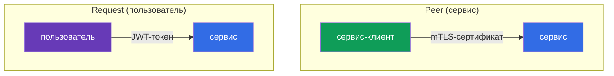
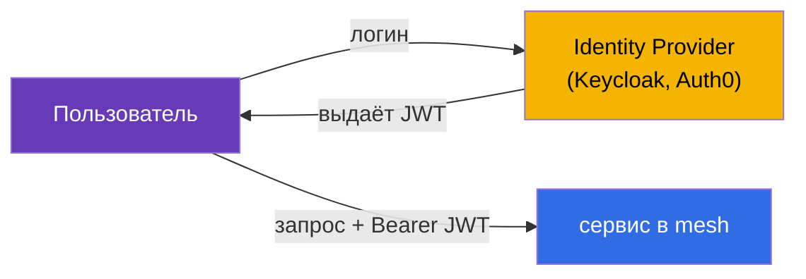
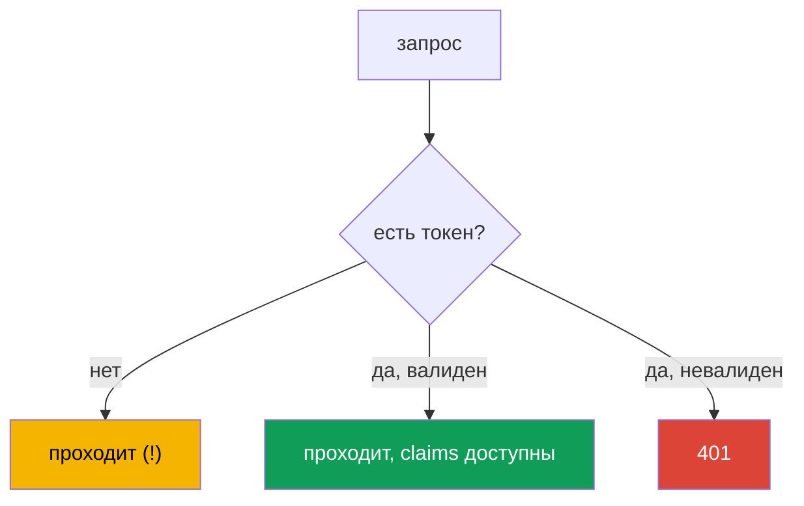
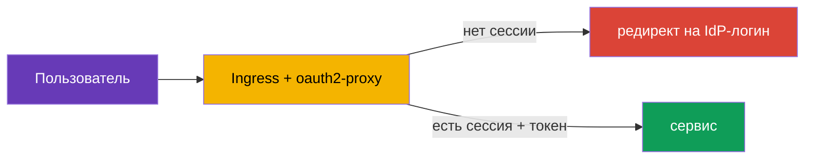

# Глава 15. Аутентификация пользователей: RequestAuthentication и JWT

> **Что дальше.** В главах 13 и 14 мы разбирались с аутентификацией и авторизацией
> **сервисов** между собой (mTLS, PeerAuthentication, AuthorizationPolicy). Но есть и
> второй тип аутентификации - **конечного пользователя**: когда запрос несёт токен
> (JWT), выданный вашим Identity Provider, и сервис должен проверить этот токен. Этим
> занимается RequestAuthentication.

## 15.1. Два типа аутентификации

В Istio важно различать два вопроса «кто это»:

- **Peer authentication** - кто этот **сервис-отправитель**. Проверяется по
  mTLS-сертификату, настраивается через `PeerAuthentication` (глава 13).
- **Request authentication** - кто этот **конечный пользователь**, от имени которого
  идёт запрос. Проверяется по токену (JWT), настраивается через `RequestAuthentication`.



Это независимые вещи: запрос может одновременно иметь и mTLS-личность сервиса, и
JWT-токен пользователя. Например, `frontend` (сервис) обращается к `backend`, неся токен
пользователя, который вошёл в систему.

## 15.2. Что такое JWT

**JWT** (JSON Web Token) - это стандартный способ передать подписанную информацию о
пользователе. Токен состоит из трёх частей через точку: `header.payload.signature`.

- **header** - алгоритм подписи.
- **payload** - полезные данные, так называемые claims: кто выдал (`iss`), кому
  (`aud`), кто пользователь (`sub`), когда истекает (`exp`) и любые кастомные поля
  (роли, email и т.д.).
- **signature** - подпись, которой Identity Provider (Auth0, Keycloak, Google и т.п.)
  заверяет токен.

Проверить подлинность токена можно по подписи, используя публичные ключи провайдера.
Эти ключи публикуются по стандартному адресу в формате **JWKS** (JSON Web Key Set).
Istio сам скачивает JWKS и проверяет подпись - вручную ничего расшифровывать не нужно.

## 15.3. Зачем нужен JWT и как его применяют

Теория понятна, но зачем это всё на практике? Разберём на реальном сценарии.

**Как это работает в приложении.** Пользователь входит в систему через Identity Provider
(Keycloak, Auth0, Google, Okta и т.п.) по протоколу OIDC/OAuth2. В ответ он получает
JWT-токен. Дальше клиент (браузер, мобильное приложение) прикладывает этот токен к
каждому запросу в заголовке `Authorization: Bearer <token>`. Сервисы проверяют токен и
понимают, кто пользователь и что ему можно.



**Почему именно JWT, а не сессии.** Классические серверные сессии требуют, чтобы сервер
хранил состояние сессий и все реплики имели к нему доступ. В микросервисах это неудобно.
JWT решает это иначе:

- **Токен самодостаточен.** Вся информация о пользователе уже внутри токена и заверена
  подписью. Серверу не нужно хранить сессии и ходить в базу на каждый запрос.
- **Работает через всю цепочку сервисов.** `frontend` получил токен и передаёт его
  дальше в `orders`, `payments` и т.д. Каждый сервис может проверить токен сам, зная
  только публичные ключи издателя - не нужно на каждый запрос дёргать сервер авторизации.
- **Стандарт.** JWT это часть экосистемы OAuth2/OIDC, его понимают все IdP и библиотеки.

**Где это реально применяют:**

- **Single Sign-On (SSO).** Пользователь один раз логинится в корпоративный Keycloak и
  ходит по всем внутренним сервисам с одним токеном.
- **Доступ к API по ролям.** В claims токена лежат роли или scopes (`role: admin`,
  `scope: orders.write`). Разные эндпоинты требуют разных ролей.
- **Мультитенантность.** В токене лежит идентификатор арендатора (`tenant: acme`), и
  сервис отдаёт данные только этого арендатора.

**Зачем это делать в Istio, а не в каждом приложении.** Можно, конечно, проверять JWT в
коде каждого сервиса. Но тогда логику проверки (скачивание ключей, валидация подписи,
срока годности) придётся повторять на каждом языке и в каждом сервисе. Istio выносит это
в инфраструктуру:

- приложения **не пишут** код проверки токенов - это делает Envoy;
- невалидные токены отсекаются **на входе**, ещё до приложения;
- издатель и ключи настраиваются **в одном месте**, а не в каждом сервисе;
- правила «какая роль к какому эндпоинту» описываются декларативно через
  `AuthorizationPolicy`.

### Пример: разные пользователи с разными правами

Разберём типичную задачу подробно. В компании два портала:

- **customer-portal** - для внешних клиентов (смотрят каталог, свои заказы);
- **internal-portal** - для сотрудников (админка, управление товарами, отчёты).

Оба доступны через один кластер и один Istio, но пускать в них надо разных людей. Все
входят через один Keycloak, но в их токенах разные claims. Например, у клиента в токене
`role: customer`, у сотрудника - `role: employee`, у администратора - `role: admin`.

Задача решается так: Istio проверяет токен один раз, а `AuthorizationPolicy` пускает к
каждому порталу только нужные роли.

Клиентский портал - пускаем только `customer`:

```yaml
apiVersion: security.istio.io/v1
kind: AuthorizationPolicy
metadata:
  name: customer-portal-access
  namespace: app
spec:
  selector:
    matchLabels:
      app: customer-portal
  action: ALLOW
  rules:
  - from:
    - source:
        requestPrincipals: ["*"]        # нужен валидный токен
    when:
    - key: request.auth.claims[role]
      values: ["customer"]              # и роль должна быть customer
```

Внутренний портал - пускаем только сотрудников и админов:

```yaml
apiVersion: security.istio.io/v1
kind: AuthorizationPolicy
metadata:
  name: internal-portal-access
  namespace: app
spec:
  selector:
    matchLabels:
      app: internal-portal
  action: ALLOW
  rules:
  - from:
    - source:
        requestPrincipals: ["*"]
    when:
    - key: request.auth.claims[role]
      values: ["employee", "admin"]     # только сотрудники и админы
```

Что получаем:

- Клиент со своим токеном (`role: customer`) попадёт в customer-portal, но на
  internal-portal получит `403` - его роли нет в списке.
- Сотрудник (`role: employee`) наоборот: пройдёт во внутренний портал, а на клиентский -
  `403`.
- Пользователь без токена не пройдёт никуда.

Обратите внимание: сами приложения `customer-portal` и `internal-portal` **не содержат
кода проверки ролей**. Они просто получают уже отфильтрованный трафик. Вся логика «кто
куда может» описана декларативно в двух `AuthorizationPolicy`, а проверку токена сделал
Istio. Захотели добавить портал для партнёров с ролью `partner` - просто пишете ещё одну
политику, приложения трогать не нужно.

### А само приложение понимает, что за пользователь пришёл?

Резонный вопрос: если проверку делает Istio, знает ли приложение, кто именно к нему
обратился? Да, знает. Istio **валидирует** токен, но по умолчанию **пробрасывает его
дальше** в приложение (в том же заголовке `Authorization`). Приложение может прочитать
claims и понять, кто пользователь.

Тут важно разделить ответственность:

- **Istio отвечает за грубый доступ**: токен валиден? роль пускает к этому сервису или
  эндпоинту? Это то, что не зависит от бизнес-логики.
- **Приложение отвечает за логику на уровне данных**: показать именно *мои* заказы,
  персонализировать выдачу, записать в аудит, кто сделал действие. Для этого приложению
  нужен идентификатор пользователя, и оно берёт его из токена.

Пример: `AuthorizationPolicy` пустила пользователя с `role: customer` в customer-portal
(грубый доступ). Но какой именно клиент пришёл и какие заказы ему показать - решает уже
приложение по claim `sub` (идентификатор пользователя) из токена.

Чтобы приложению не пришлось самому разбирать JWT, Istio может **вытащить нужные claims
в простые заголовки** через `outputClaimToHeaders` в `RequestAuthentication`:

```yaml
  jwtRules:
  - issuer: "https://my-idp.example.com"
    jwksUri: "https://my-idp.example.com/jwks.json"
    outputClaimToHeaders:
    - header: x-user-id
      claim: sub          # приложение прочитает готовый заголовок x-user-id
    - header: x-user-email
      claim: email
```

Теперь приложение просто читает заголовок `x-user-id`, не зная ничего про JWT. Проверку
подлинности уже сделал Istio, поэтому этим заголовкам можно доверять (внешний клиент не
может их подделать - Istio перезапишет их значениями из проверенного токена).

Итого: Istio снимает с приложения аутентификацию и грубую авторизацию, но личность
пользователя приложению по-прежнему доступна - для той логики, которую может знать
только само приложение.

## 15.4. RequestAuthentication: проверка JWT

Ресурс `RequestAuthentication` говорит Istio, какие токены считать валидными: от какого
издателя и где брать ключи для проверки подписи.

```yaml
apiVersion: security.istio.io/v1
kind: RequestAuthentication
metadata:
  name: jwt-auth
  namespace: app
spec:
  selector:
    matchLabels:
      app: backend
  jwtRules:
  - issuer: "https://my-idp.example.com"          # кто выдал токен
    jwksUri: "https://my-idp.example.com/jwks.json"  # где взять ключи для проверки
```

Что делает Istio с этой политикой:

- если в запросе **есть** токен и он валиден (правильный издатель, живая подпись, не
  истёк) - claims из токена становятся доступны для правил авторизации;
- если токен **есть, но невалиден** (плохая подпись, чужой издатель, просрочен) -
  запрос отклоняется с `401`.

## 15.5. Важнейшая тонкость: без токена запрос проходит

Вот главная ловушка, на которой все спотыкаются. `RequestAuthentication` **не требует**
наличия токена. Она лишь проверяет токен, **если он есть**. Запрос вообще без токена
спокойно проходит `RequestAuthentication`.



То есть сама по себе `RequestAuthentication` не защищает сервис - она только валидирует
токены. Чтобы **потребовать** токен, нужна связка с `AuthorizationPolicy`. Это тот же
принцип, что и раньше: одна политика проверяет, другая требует.

## 15.6. Связка с AuthorizationPolicy

Чтобы реально закрыть сервис, добавляем `AuthorizationPolicy`, которая требует
проверенную личность пользователя. Она задаётся через `requestPrincipals`:

```yaml
apiVersion: security.istio.io/v1
kind: AuthorizationPolicy
metadata:
  name: require-jwt
  namespace: app
spec:
  selector:
    matchLabels:
      app: backend
  action: ALLOW
  rules:
  - from:
    - source:
        requestPrincipals: ["*"]   # требуется любой валидный токен
```

- **`requestPrincipals: ["*"]`** - требует, чтобы у запроса была проверенная
  request-личность (то есть валидный JWT). Формат личности:
  `<issuer>/<subject>`. Звёздочка значит «любой валидный токен».
- Теперь запрос без токена получит `403` от авторизации (а с невалидным токеном - `401`
  ещё на этапе RequestAuthentication).

Можно требовать не просто наличие токена, а конкретные claims - например, определённую
роль или издателя - через блок `when`:

```yaml
    when:
    - key: request.auth.claims[role]
      values: ["admin"]
```

Итоговая логика для сервиса `backend`:

- нет токена -> `403` (AuthorizationPolicy);
- невалидный токен -> `401` (RequestAuthentication);
- валидный токен с нужным claim -> проходит.

## 15.7. Истёкший токен: refresh и redirect

Токены живут недолго (часто 5-15 минут) - это часть безопасности. Что происходит, когда
токен истёк?

**Со стороны Istio всё просто:** у истёкшего токена не проходит проверка claim `exp`,
поэтому `RequestAuthentication` отвергает запрос с `401` - ровно как любой невалидный
токен. Никакой разницы между «подпись плохая» и «токен просрочен» для Istio нет: оба
случая это `401`.

**И вот важная граница, которую надо чётко понимать.** Istio **только проверяет**
токены. Он **не** логинит пользователей, **не** перенаправляет на страницу входа IdP и
**не** обновляет токены. Istio - это не OAuth2-клиент. Поэтому «сделать redirect за
новым токеном» силами одного Istio нельзя. Получение нового токена - задача уровнем
выше. Есть два основных подхода.

**Подход 1: refresh на стороне клиента (SPA, мобильные приложения).** Клиент при логине
получает не только короткоживущий access-токен, но и refresh-токен. Когда приложение
получает `401`, оно:

- либо меняет refresh-токен на новый access-токен у IdP и повторяет запрос;
- либо, если refresh тоже истёк, перенаправляет пользователя на страницу входа IdP.

Вся эта логика живёт в клиентском коде, Istio в ней не участвует - он просто отдаёт
`401`, а дальше клиент разбирается сам.

**Подход 2: auth-прокси на границе (браузерные приложения с сессиями).** Для классических
веб-приложений redirect на логин удобно вынести в специальный прокси на входе -
например, **oauth2-proxy** или аналог. Он проводит полный OIDC-флоу: перенаправляет
неавторизованного пользователя на IdP, держит сессию в cookie и подставляет токен в
запросы. Istio подключает такой прокси через внешнюю авторизацию (`action: CUSTOM` в
`AuthorizationPolicy`, помните из главы 14).



**Что выбрать:** для SPA и мобильных приложений refresh делает сам клиент; для
серверных браузерных приложений с сессиями удобнее auth-прокси на границе. В обоих
случаях Istio отвечает только за проверку и выдачу `401`, а redirect и обновление токена
- за клиентом или auth-прокси.

## 15.8. Где применять: ingress gateway или сервис

`RequestAuthentication` можно навесить и на конкретный сервис, и на ingress gateway.

- **На ingress gateway** - токен проверяется на входе в кластер, ещё до того, как трафик
  попадёт к сервисам. Удобно проверять пользователя один раз на границе.
- **На конкретном сервисе** - более тонкий контроль, когда разные сервисы принимают
  токены от разных издателей или часть сервисов вообще публичная.

На практике часто делают проверку на ingress gateway (единая точка входа), а внутренние
сервисы уже доверяют трафику, прошедшему границу (плюс защищены mTLS и
AuthorizationPolicy между собой).

## 15.9. Итоги главы

- Istio различает аутентификацию сервиса (peer, mTLS, `PeerAuthentication`) и
  пользователя (request, JWT, `RequestAuthentication`); это независимые механизмы.
- JWT - подписанный токен с claims (iss, sub, aud, exp и кастомные); подпись
  проверяется по публичным ключам издателя (JWKS).
- JWT удобен в микросервисах: самодостаточен (не нужны серверные сессии), передаётся по
  цепочке сервисов, проверяется без обращения к серверу авторизации. Применяют для SSO,
  доступа по ролям, мультитенантности.
- Проверку JWT выносят в Istio, чтобы приложения не дублировали её в коде, а невалидные
  токены отсекались на входе.
- Истёкший токен Istio отвергает с `401`. Redirect на логин и обновление токена - не
  задача Istio: это делает клиент (refresh-токен) или auth-прокси на границе
  (oauth2-proxy через `action: CUSTOM`).
- `RequestAuthentication` задаёт, какие токены валидны (`issuer`, `jwksUri`), и
  проверяет их.
- **Ключевая тонкость:** сама по себе `RequestAuthentication` не требует токен - запрос
  без токена проходит. Валидируется только присутствующий токен (невалидный -> 401).
- Чтобы **потребовать** токен, нужна `AuthorizationPolicy` с `requestPrincipals`;
  конкретные claims проверяются через `when`.
- Проверку удобно делать на ingress gateway (единая точка входа) или точечно на сервисе.

## 15.10. Вопросы для самопроверки

1. Чем request authentication (пользователь) отличается от peer authentication (сервис)?
2. Из чего состоит JWT и как Istio проверяет его подлинность?
3. Почему `RequestAuthentication` сама по себе не защищает сервис?
4. Как потребовать наличие токена и как проверить конкретный claim?
5. Какие коды вернёт сервис на запрос без токена и с невалидным токеном (при полной
   настройке)?
6. Почему JWT удобнее серверных сессий в микросервисах и зачем выносить его проверку в
   Istio, а не в код каждого приложения?
7. Что вернёт Istio на истёкший токен и кто отвечает за redirect на логин и обновление
   токена?

## Практика

Отработайте проверку JWT: RequestAuthentication + AuthorizationPolicy, поведение без
токена, с невалидным и с валидным токеном:

🧪 Лаба 11: [tasks/ica/labs/11](../../labs/11/README_RU.MD)

---
[Оглавление](../README.md) · [Глава 14](../14/ru.md) · [Глава 16](../16/ru.md)
