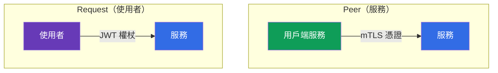
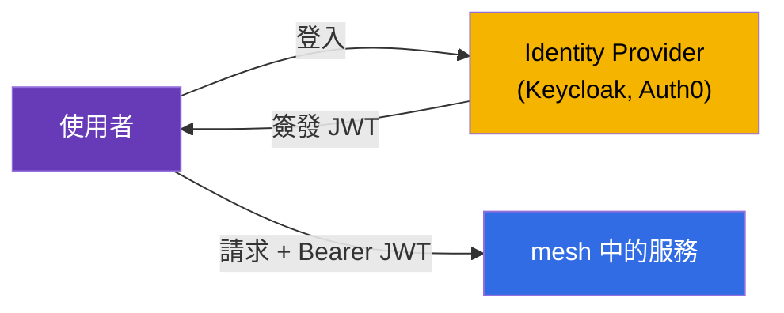
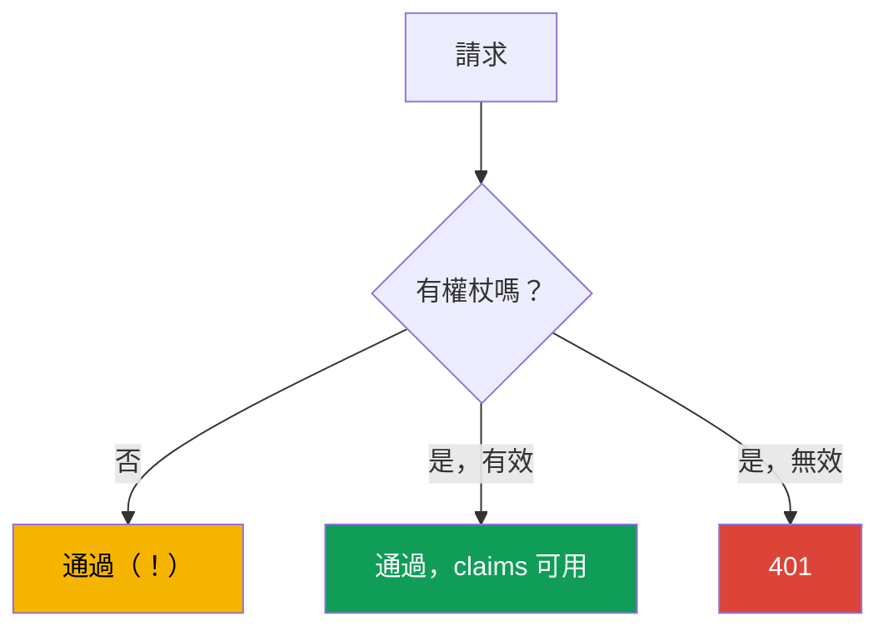
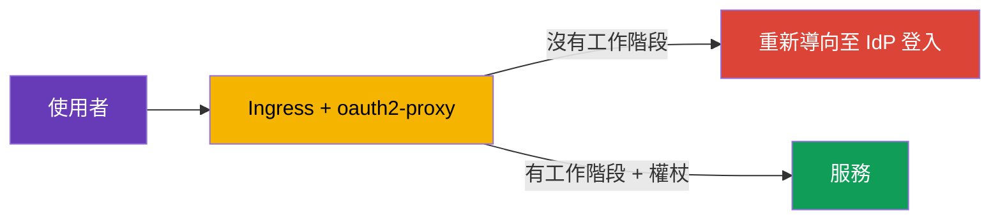
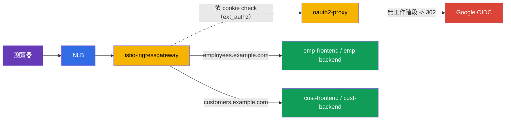

[Русская версия](ru.md) · [Eng version](en.md) · [Versión en español](es.md) · [Version française](fr.md) · [Deutsche Version](de.md) · [ქართული ვერსია](ge.md) · [日本語版](jp.md)

# 第 15 章。使用者驗證：RequestAuthentication 與 JWT

> **接下來。** 在第 13 與第 14 章中，我們研究了服務彼此之間的驗證與授權（mTLS、PeerAuthentication、AuthorizationPolicy）。但還有第二種驗證：**終端使用者**的驗證--當請求攜帶由您的 Identity Provider 簽發的權杖（JWT），且服務必須驗證這個權杖時。這正是 RequestAuthentication 的工作。

## 15.1. 兩種驗證

在 Istio 中，必須區分「這是誰」的兩個問題：

- **Peer authentication**--這個**發送服務**是誰。透過 mTLS 憑證驗證，使用 `PeerAuthentication` 設定（第 13 章）。
- **Request authentication**--代表其發出請求的這個**終端使用者**是誰。透過權杖（JWT）驗證，使用 `RequestAuthentication` 設定。



這是彼此獨立的：一個請求可以同時具有服務的 mTLS 身分與使用者的 JWT 權杖。例如，`frontend`（服務）向 `backend` 發出請求時，會攜帶登入系統的使用者權杖。

## 15.2. JWT 是什麼

**JWT**（JSON Web Token）是傳遞使用者已簽署資訊的標準方式。權杖由三個以點分隔的部分組成：`header.payload.signature`。

- **header**--簽章演算法。
- **payload**--資料負載，亦即所謂的 claims：誰簽發（`iss`）、給誰（`aud`）、使用者是誰（`sub`）、何時到期（`exp`），以及任意自訂欄位（角色、email 等）。
- **signature**--Identity Provider（Auth0、Keycloak、Google 等）用以保證權杖真實性的簽章。

可使用提供者的公開金鑰，透過簽章驗證權杖的真實性。這些金鑰會依標準網址以 **JWKS**（JSON Web Key Set）格式發布。Istio 會自行下載 JWKS 並驗證簽章--無須手動解密任何內容。

## 15.3. 為何需要 JWT，以及如何使用它

理論已經清楚，但實務上為什麼需要這一切？讓我們看一個真實案例。

**它在應用程式中的運作方式。** 使用者透過 OIDC/OAuth2 協定，經由 Identity Provider（Keycloak、Auth0、Google、Okta 等）登入系統。使用者會收到 JWT 權杖。之後用戶端（瀏覽器、行動應用程式）在每個請求的 `Authorization: Bearer <token>` 標頭中附上此權杖。服務驗證權杖，並了解使用者是誰及其權限。



**為何是 JWT 而非工作階段。** 傳統伺服器工作階段要求伺服器儲存工作階段狀態，且所有副本都必須能存取它。在微服務中這並不方便。JWT 的解法不同：

- **權杖自包含。** 所有使用者資訊都已在權杖內，並由簽章保證。伺服器無須儲存工作階段，也不必在每個請求查詢資料庫。
- **可貫穿整條服務鏈。** `frontend` 取得權杖後，將其傳給 `orders`、`payments` 等。每個服務只要知道簽發者的公開金鑰便能自行驗證權杖--不必在每個請求呼叫授權伺服器。
- **標準。** JWT 是 OAuth2/OIDC 生態系的一部分，所有 IdP 與程式庫都能理解它。

**實際套用的位置：**

- **Single Sign-On (SSO)。** 使用者只需登入一次企業 Keycloak，便能以同一個權杖使用所有內部服務。
- **依角色存取 API。** 權杖 claims 中存有角色或 scopes（`role: admin`、`scope: orders.write`）。不同端點要求不同角色。
- **多租戶。** 權杖中有租戶識別碼（`tenant: acme`），服務只提供該租戶的資料。

**為何在 Istio 中做，而不是在每個應用程式中做。** 當然可以在每個服務的程式碼中驗證 JWT。但這樣必須在每種語言、每個服務中重複驗證邏輯（下載金鑰、驗證簽章與有效期）。Istio 將其移至基礎設施：

- 應用程式**不需編寫**權杖驗證程式碼--由 Envoy 負責；
- 無效權杖會在**入口處**、尚未到達應用程式前被擋下；
- 簽發者與金鑰在**一處**設定，而不是每個服務各自設定；
- 「哪個角色能使用哪個端點」的規則，透過 `AuthorizationPolicy` 宣告式描述。

### 範例：不同使用者具有不同權限

仔細看看一個典型任務。公司有兩個入口網站：

- **customer-portal**--供外部客戶使用（查看目錄與自己的訂單）；
- **internal-portal**--供員工使用（管理後台、商品管理、報表）。

兩者透過同一叢集與同一 Istio 提供服務，但必須讓不同的人進入。所有人均透過同一個 Keycloak 登入，但權杖中的 claims 不同。例如，客戶權杖中有 `role: customer`，員工為 `role: employee`，管理員為 `role: admin`。

解法如下：Istio 驗證一次權杖，而 `AuthorizationPolicy` 僅允許所需角色進入各入口網站。

客戶入口網站--只允許 `customer`：

```yaml
apiVersion: security.istio.io/v1
kind: AuthorizationPolicy
metadata:
  name: customer-portal-access
  namespace: app
spec:
  selector:
    matchLabels:
      app: customer-portal
  action: ALLOW
  rules:
  - from:
    - source:
        requestPrincipals: ["*"]        # 需要有效的 token
    when:
    - key: request.auth.claims[role]
      values: ["customer"]              # 且角色必須是 customer
```

內部入口網站--只允許員工與管理員：

```yaml
apiVersion: security.istio.io/v1
kind: AuthorizationPolicy
metadata:
  name: internal-portal-access
  namespace: app
spec:
  selector:
    matchLabels:
      app: internal-portal
  action: ALLOW
  rules:
  - from:
    - source:
        requestPrincipals: ["*"]
    when:
    - key: request.auth.claims[role]
      values: ["employee", "admin"]     # 僅限員工與管理員
```

結果如下：

- 使用自己權杖（`role: customer`）的客戶可以進入 customer-portal，但存取 internal-portal 時會收到 `403`--其角色不在清單中。
- 員工（`role: employee`）則相反：可進入內部入口網站，客戶入口網站會回應 `403`。
- 沒有權杖的使用者無法進入任何地方。

請注意：應用程式 `customer-portal` 與 `internal-portal` 本身**不包含角色驗證程式碼**。它們只接收已篩選的流量。「誰可前往何處」的所有邏輯，都在兩個 `AuthorizationPolicy` 中以宣告式方式描述，而權杖驗證由 Istio 完成。若想為角色 `partner` 新增合作夥伴入口網站，只需再寫一條政策，無須修改應用程式。

### 應用程式本身知道來的是哪位使用者嗎？

合理的問題：若驗證由 Istio 處理，應用程式是否知道究竟是誰向它發出請求？知道，但有重要注意事項。預設情況下，Istio **驗證**權杖並且**不會轉送**它至應用程式（`forwardOriginalToken: false` 為預設值）--這是常見陷阱：應用程式等待 `Authorization` 標頭，卻發現它不存在。有兩種方式將使用者身分提供給應用程式：

- 在 `jwtRules` 中設定 **`forwardOriginalToken: true`**--為 upstream 保留原始權杖，應用程式可自行解析 `Authorization: Bearer <token>`；
- **`outputClaimToHeaders`**--將所需 claims 擷取為簡單標頭（見下文），如此應用程式不需要權杖本身。

這裡必須劃分責任：

- **Istio 負責粗粒度存取**：權杖是否有效？角色是否可存取此服務或端點？這些不依賴業務邏輯。
- **應用程式負責資料層級邏輯**：顯示確實屬於*我的*訂單、個人化結果、記錄是哪位使用者執行動作。為此應用程式需要使用者識別碼，並從權杖取得。

例如，`AuthorizationPolicy` 已讓具有 `role: customer` 的使用者進入 customer-portal（粗粒度存取）。但究竟是哪位客戶，以及要顯示哪些訂單，則由應用程式依權杖中的 `sub` claim（使用者識別碼）決定。

為了讓應用程式無須自行解析 JWT，Istio 可透過 `RequestAuthentication` 中的 `outputClaimToHeaders` **把所需 claims 擷取到簡單標頭**：

```yaml
apiVersion: security.istio.io/v1
kind: RequestAuthentication
metadata:
  name: jwt-auth
  namespace: app
spec:
  selector:
    matchLabels:
      app: backend                 # 套用至哪些 pod
  jwtRules:
  - issuer: "https://my-idp.example.com"              # 誰簽發 token
    jwksUri: "https://my-idp.example.com/jwks.json"   # 從何處取得驗證用的金鑰
    outputClaimToHeaders:
    - header: x-user-id
      claim: sub          # 應用程式會讀取現成的標頭 x-user-id
    - header: x-user-email
      claim: email
```

現在應用程式只要讀取 `x-user-id` 標頭，完全不需要了解 JWT。Istio 已完成真實性驗證，因此可信任這些標頭（外部用戶端不能偽造--Istio 會將它們覆寫為已驗證權杖的值）。

總結而言，Istio 將驗證與粗粒度授權從應用程式卸下，但使用者身分仍可供應用程式使用--以處理只有應用程式本身知道的邏輯。

## 15.4. RequestAuthentication：JWT 驗證

資源 `RequestAuthentication` 告訴 Istio 哪些權杖應視為有效：來自哪個簽發者，以及從何處取得簽章驗證金鑰。

```yaml
apiVersion: security.istio.io/v1
kind: RequestAuthentication
metadata:
  name: jwt-auth
  namespace: app
spec:
  selector:
    matchLabels:
      app: backend
  jwtRules:
  - issuer: "https://my-idp.example.com"          # 誰簽發 token
    jwksUri: "https://my-idp.example.com/jwks.json"  # 從何處取得驗證用的金鑰
```

Istio 對此政策所做的事：

- 若請求中**有**權杖且它有效（簽發者正確、簽章有效、未過期），權杖 claims 可供授權規則使用；
- 若**有權杖但無效**（簽章不正確、簽發者不同、已過期），請求會被以 `401` 拒絕。

預設從 `Authorization: Bearer <token>` 標頭取得權杖。若用戶端將權杖放在非標準位置（自訂標頭或 query 參數），請透過 `fromHeaders` / `fromParams` 明確指定：

```yaml
  jwtRules:
  - issuer: "https://my-idp.example.com"
    jwksUri: "https://my-idp.example.com/jwks.json"
    fromHeaders:
    - name: x-jwt-token       # token 放在自己的標頭中
    fromParams:
    - token                   # 或放在 query 參數 ?token=...
```

可列出多個來源--Istio 會依序檢查。

## 15.5. 最重要的細節：沒有權杖的請求會通過

這是所有人都會踩到的主要陷阱。`RequestAuthentication` **不要求**必須有權杖。它只在**權杖存在時**驗證它。完全沒有權杖的請求會順利通過 `RequestAuthentication`。



亦即，`RequestAuthentication` 本身不會保護服務--它只驗證權杖。若要**要求**權杖，必須搭配 `AuthorizationPolicy`。這與之前的原則相同：一個政策驗證，另一個政策要求。

## 15.6. 與 AuthorizationPolicy 的搭配

要真正關閉服務存取，我們新增一個要求已驗證使用者身分的 `AuthorizationPolicy`。透過 `requestPrincipals` 指定：

```yaml
apiVersion: security.istio.io/v1
kind: AuthorizationPolicy
metadata:
  name: require-jwt
  namespace: app
spec:
  selector:
    matchLabels:
      app: backend
  action: ALLOW
  rules:
  - from:
    - source:
        requestPrincipals: ["*"]   # 需要任何有效的 token
```

- **`requestPrincipals: ["*"]`**--要求請求具有已驗證的 request 身分（亦即有效 JWT）。身分格式為 `<issuer>/<subject>`。星號表示「任意有效權杖」。
- 現在沒有權杖的請求會收到授權層的 `403`（而無效權杖在 RequestAuthentication 階段就會收到 `401`）。

除了要求權杖存在，還可透過 `when` 區塊要求特定 claims--例如特定角色或簽發者：

```yaml
apiVersion: security.istio.io/v1
kind: AuthorizationPolicy
metadata:
  name: require-jwt-admin
  namespace: app
spec:
  selector:
    matchLabels:
      app: backend
  action: ALLOW
  rules:
  - from:
    - source:
        requestPrincipals: ["*"]        # 需要有效的 token
    when:
    - key: request.auth.claims[role]    # 且 claim role...
      values: ["admin"]                 # ...必須是 admin
```

服務 `backend` 的最終邏輯：

- 沒有權杖 -> `403`（AuthorizationPolicy）；
- 無效權杖 -> `401`（RequestAuthentication）；
- 含有所需 claim 的有效權杖 -> 通過。

## 15.7. 過期權杖：refresh 與 redirect

權杖的存活時間很短（通常 5–15 分鐘）--這是安全性的一部分。權杖過期時會怎樣？

**從 Istio 的角度很簡單：** 過期權杖無法通過 `exp` claim 驗證，因此 `RequestAuthentication` 會以 `401` 拒絕請求--和任何無效權杖完全相同。對 Istio 而言，「簽章不正確」與「權杖已過期」沒有差異：兩種情況都是 `401`。

**這裡有一條必須清楚理解的重要界線。** Istio **只驗證**權杖。它**不會**讓使用者登入、**不會**重新導向到 IdP 登入頁，也**不會**更新權杖。Istio 不是 OAuth2 用戶端。因此，不能只靠 Istio「重新導向以取得新權杖」。取得新權杖是上層的任務，主要有兩種方式。

**方式 1：用戶端 refresh（SPA、行動應用程式）。** 用戶端登入時不只取得短期 access token，也取得 refresh token。當應用程式收到 `401` 時，它：

- 以 refresh token 向 IdP 換取新的 access token，並重試請求；
- 或者 refresh token 也過期時，將使用者重新導向至 IdP 登入頁。

所有這些邏輯都在用戶端程式碼中，Istio 不參與--它只回傳 `401`，其後由用戶端自行處理。

**方式 2：邊界的 auth proxy（具有工作階段的瀏覽器應用程式）。** 對傳統 Web 應用程式而言，適合將登入重新導向移至入口處的特殊 proxy，例如 **oauth2-proxy** 或同類工具。它執行完整 OIDC flow：將未驗證使用者重新導向到 IdP、在 cookie 中維持工作階段，並在請求中加入權杖。Istio 透過外部授權連接此類 proxy（`AuthorizationPolicy` 中的 `action: CUSTOM`，請回想第 14 章）。



**方式 3：雲端邊緣登入（ALB、Cloudflare、CloudFront）。** 登入可再向外移至負載平衡器/CDN，如此便不需要獨立 oauth2-proxy。不過只在邊緣支援 L7 與 OIDC 時才可行：

- **AWS ALB--可以，原生支援。** listener 規則具有 `authenticate-oidc`（及 `authenticate-cognito`）動作：ALB 會自行將未驗證使用者重新導向至 IdP、在 cookie 中維持工作階段，並在請求中加上已簽署 JWT 至 `x-amzn-oidc-data` 標頭（另有 `x-amzn-oidc-identity` / `x-amzn-oidc-accesstoken`）。之後 Istio 只要透過 `RequestAuthentication` **驗證此 JWT**。代價是 mesh 前方是 ALB（L7），而非「純」NLB。
- **Cloudflare--可以，Cloudflare Access（Zero Trust）。** 在邊緣提供完整 SSO/OIDC；對外發出已簽署 JWT `Cf-Access-Jwt-Assertion`，Istio 依 Cloudflare JWKS（`https://<team>.cloudflareaccess.com/cdn-cgi/access/certs`）驗證它。
- **CloudFront--非開箱即用。** 沒有內建 OIDC 登入；必須藉由 **Lambda@Edge / CloudFront Functions**（自訂 OIDC 程式碼）或 Cognito 實作--換言之，仍得寫 proxy 邏輯，只是改為 edge function。
- **NLB--不行。** 它是 L4，不含任何 HTTP/OIDC 邏輯；原理上無法在其上登入。

在所有「可以」的方案中，Istio 的角色不變：互動式登入由邊緣完成，而 Istio **驗證已簽署 JWT**（`RequestAuthentication`）並強制執行存取（`AuthorizationPolicy`）。`RequestAuthentication` 的簽發者與 `jwksUri` 指向對應邊緣（ALB/Cloudflare），而不是原始 IdP。

> **關鍵--封鎖繞過邊緣的路徑。** 若能**繞過** ALB/Cloudflare 到達 ingress gateway，攻擊者可偽造標頭（`x-amzn-oidc-*`、`Cf-Access-*`）並通過。因此務必做到：(1) Istio 使用 JWKS **驗證簽章**，而非直接相信標頭；(2) 僅允許從邊緣存取 gateway--以 CDN/ALB IP 的 security group、私有 NLB、來自邊緣的 mTLS 等方式限制。

**選擇方式：** SPA 與行動應用程式由用戶端 refresh；具工作階段的伺服器端瀏覽器應用程式使用 auth proxy（`oauth2-proxy`）或雲端邊緣登入（ALB `authenticate-oidc`、Cloudflare Access）。無論何種情況，Istio 僅負責 JWT 驗證與回傳 `401`，而 redirect 和更新權杖由用戶端、auth proxy 或邊緣負責。

> **為什麼不直接用 VirtualService 依缺少標頭處理？** 這個想法很自然：在 `VirtualService` 中以 `withoutHeaders` match（沒有 `Authorization`）並將這些請求送往「redirector service」。技術上 VirtualService 有 match，甚至有靜態 `redirect`，但它無法替代 auth proxy：(1) VirtualService 只能看到「有/沒有標頭」，**不驗證有效性**--`Authorization: Bearer 垃圾` 仍會通過 match；(2) 瀏覽器導覽根本不會傳送 `Authorization`（工作階段在 cookie 中），所以訊號不正確；(3) 完整 OIDC flow（`/callback`、交換 `code`、cookie、PKCE）仍必須由接收服務實作--而那正是 oauth2-proxy。對於「重新導向未驗證者」，應使用 `ext_authz`（`action: CUSTOM`），由**能夠**驗證的元件作決定，而非只依標頭是否存在的 match。

> **成本：資料路徑與僅驗證。** 常見顧慮是「全部流量都經過 proxy，成本很高」。這只在 `oauth2-proxy` 作為應用程式前方的 **reverse-proxy** 時為真（它承載 request body 與 responses）。在建議的 **`ext_authz`（`action: CUSTOM`）模式中，proxy 不在資料路徑**：Envoy 只在每個請求向它發送輕量 check 子請求（僅標頭/cookie，沒有 body）、接收「允許/`302`」，成功時便將請求**直接送往應用程式**。payload 不會經過 proxy。還可藉由下列方式降低成本：只在 ingress gateway 驗證；將 `CUSTOM` 政策限於所需 host/path（管理後台），不影響公開項目；登入後，當請求攜帶有效 JWT 時，改用 `RequestAuthentication`--Envoy **本機驗證簽章，沒有外部呼叫**。雲端邊緣登入（ALB/Cloudflare）時，mesh 中完全沒有位於資料路徑的 proxy--僅有本機 JWT 驗證。

## 15.8. 完整範例：兩個入口網站，透過 Google 與 oauth2-proxy 登入

讓我們在真實情境中整合一切。條件如下：

- 叢集入口為 **NLB → istio-ingressgateway**（L4 負載平衡器，不能執行登入，15.7）。
- 使用者透過 **Google**（OIDC）登入。
- 兩個入口網站位於不同主機：**`employees.example.com`**（員工）與 **`customers.example.com`**（客戶）。
- 每個入口網站各有自己的 **frontend 與 backend** 服務。
- 區隔：只有公司帳號（`*@company.com`）可進入員工入口網站；任何已授權 Google 帳號均可進入客戶入口網站。

登入邏輯由 **oauth2-proxy** 處理（Google 本身不能自行 redirect--由 proxy 完成），它以外部授權（`ext_authz`、`action: CUSTOM`）連接至 Istio。proxy **不在資料路徑**：Envoy 只依 cookie 向它詢問「允許嗎？」（15.7）。



**1. oauth2-proxy：Deployment、Service 與 Secret**（namespace `auth`）。cookie 設於 `.example.com`，讓一個工作階段適用兩個入口網站；`--email-domain=*` 允許任意 Google 帳號登入（下方將在 Istio 中進行入口網站區隔）。

```yaml
apiVersion: v1
kind: Secret
metadata:
  name: oauth2-proxy
  namespace: auth
type: Opaque
stringData:
  client-id: "<google-client-id>"
  client-secret: "<google-client-secret>"
  cookie-secret: "<32-位元組隨機祕密>"   # openssl rand -base64 32
---
apiVersion: apps/v1
kind: Deployment
metadata:
  name: oauth2-proxy
  namespace: auth
spec:
  replicas: 2
  selector:
    matchLabels: { app: oauth2-proxy }
  template:
    metadata:
      labels: { app: oauth2-proxy }
    spec:
      containers:
      - name: oauth2-proxy
        image: quay.io/oauth2-proxy/oauth2-proxy:v7.6.0
        args:
        - --provider=google
        - --email-domain=*                       # 允許任何 Google 帳號登入
        - --http-address=0.0.0.0:4180
        - --reverse-proxy=true                   # 信任來自 ingress 的 X-Forwarded-*
        - --set-xauthrequest=true                # 在 auth 回應中提供 X-Auth-Request-*
        - --cookie-domain=.example.com           # *.example.com 共用工作階段
        - --whitelist-domain=.example.com
        - --redirect-url=https://auth.example.com/oauth2/callback
        - --upstream=static://200
        env:
        - name: OAUTH2_PROXY_CLIENT_ID
          valueFrom: { secretKeyRef: { name: oauth2-proxy, key: client-id } }
        - name: OAUTH2_PROXY_CLIENT_SECRET
          valueFrom: { secretKeyRef: { name: oauth2-proxy, key: client-secret } }
        - name: OAUTH2_PROXY_COOKIE_SECRET
          valueFrom: { secretKeyRef: { name: oauth2-proxy, key: cookie-secret } }
        ports:
        - containerPort: 4180
---
apiVersion: v1
kind: Service
metadata:
  name: oauth2-proxy
  namespace: auth
spec:
  selector: { app: oauth2-proxy }
  ports:
  - name: http
    port: 4180
    targetPort: 4180
```

**2. 在 MeshConfig 中將 oauth2-proxy 註冊為外部授權提供者。** `action: CUSTOM` 正會參照此提供者：

```yaml
apiVersion: install.istio.io/v1alpha1
kind: IstioOperator
spec:
  meshConfig:
    extensionProviders:
    - name: oauth2-proxy
      envoyExtAuthzHttp:
        service: oauth2-proxy.auth.svc.cluster.local
        port: 4180
        includeRequestHeadersInCheck: ["authorization", "cookie"]   # 要送出驗證的內容
        headersToUpstreamOnAllow:                                   # allow 時要加入請求的內容
        - "authorization"
        - "x-auth-request-email"
        - "x-auth-request-user"
        headersToDownstreamOnDeny: ["content-type", "set-cookie"]   # 用於登入的 302
```

**3. Gateway** 處理三個主機：登入入口本身（`auth.example.com` → oauth2-proxy）與兩個入口網站。TLS 使用 `SIMPLE`（第 9 章），憑證可由 cert-manager 簽發：

```yaml
apiVersion: networking.istio.io/v1
kind: Gateway
metadata:
  name: portals-gw
  namespace: istio-system
spec:
  selector:
    istio: ingressgateway
  servers:
  - port: { number: 443, name: https, protocol: HTTPS }
    tls: { mode: SIMPLE, credentialName: portals-cert }
    hosts:
    - auth.example.com
    - employees.example.com
    - customers.example.com
```

**4. VirtualService。** 主機 `auth.example.com` 全部轉至 oauth2-proxy（其中包含 `/oauth2/start`、`/oauth2/callback`）。每個入口網站：`/api` → backend，其餘一切 → frontend。

```yaml
apiVersion: networking.istio.io/v1
kind: VirtualService
metadata:
  name: auth-vs
  namespace: istio-system
spec:
  hosts: ["auth.example.com"]
  gateways: ["portals-gw"]
  http:
  - route:
    - destination:
        host: oauth2-proxy.auth.svc.cluster.local
        port: { number: 4180 }
---
apiVersion: networking.istio.io/v1
kind: VirtualService
metadata:
  name: employees-vs
  namespace: istio-system
spec:
  hosts: ["employees.example.com"]
  gateways: ["portals-gw"]
  http:
  - match: [{ uri: { prefix: /api } }]
    route:
    - destination: { host: emp-backend.portals.svc.cluster.local, port: { number: 8080 } }
  - route:
    - destination: { host: emp-frontend.portals.svc.cluster.local, port: { number: 8080 } }
---
apiVersion: networking.istio.io/v1
kind: VirtualService
metadata:
  name: customers-vs
  namespace: istio-system
spec:
  hosts: ["customers.example.com"]
  gateways: ["portals-gw"]
  http:
  - match: [{ uri: { prefix: /api } }]
    route:
    - destination: { host: cust-backend.portals.svc.cluster.local, port: { number: 8080 } }
  - route:
    - destination: { host: cust-frontend.portals.svc.cluster.local, port: { number: 8080 } }
```

**5. 在入口要求登入**--於 ingress gateway 使用 `action: CUSTOM` 的 `AuthorizationPolicy`。它會為所有入口網站主機呼叫 oauth2-proxy，但**不會**處理 `/oauth2/*` 路徑（否則無法登入 callback），也不會處理 `auth.example.com`：

```yaml
apiVersion: security.istio.io/v1
kind: AuthorizationPolicy
metadata:
  name: require-login
  namespace: istio-system
spec:
  selector:
    matchLabels:
      istio: ingressgateway
  action: CUSTOM
  provider:
    name: oauth2-proxy          # 來自 extensionProviders 的名稱（步驟 2）
  rules:
  - to:
    - operation:
        hosts: ["employees.example.com", "customers.example.com"]
        notPaths: ["/oauth2/*"]   # 不攔截 callback/登入 endpoint
```

之後，未驗證使用者在任一入口網站都會收到前往 Google 登入的 `302`；登入後 oauth2-proxy 會將 `X-Auth-Request-Email` 標頭放入請求（受信任--由授權回應而非用戶端設定）。

**6. 在服務本身以一般 `ALLOW` 政策區隔入口網站**（namespace `portals`）。客戶入口網站--任何已登入者均可；員工入口網站--僅 `*@company.com`。`values` 支援 wildcard：

```yaml
# 員工入口網站：僅限公司位址
apiVersion: security.istio.io/v1
kind: AuthorizationPolicy
metadata:
  name: employees-only-corp
  namespace: portals
spec:
  selector:
    matchLabels: { portal: employees }   # emp-frontend 與 emp-backend 上的 label
  action: ALLOW
  rules:
  - when:
    - key: request.headers[x-auth-request-email]
      values: ["*@company.com"]           # 後綴 wildcard
---
# 用戶端入口網站：只需已登入即可（標頭存在）
apiVersion: security.istio.io/v1
kind: AuthorizationPolicy
metadata:
  name: customers-any-authenticated
  namespace: portals
spec:
  selector:
    matchLabels: { portal: customers }
  action: ALLOW
  rules:
  - when:
    - key: request.headers[x-auth-request-email]
      values: ["*"]                        # 任何非空 email = 已登入
```

**結果：**

- 使用個人 Gmail 的客戶可登入 `customers.example.com`，但在 `employees.example.com` 會收到 `403`（其 email 不符合 `*@company.com`）。
- 員工（`ivan@company.com`）可進入兩者（若設計如此），或可另行限制客戶入口網站。
- 匿名使用者會在入口處收到前往 Google 登入的 `302`。

**7. 防止標頭偽造。** 只有當用戶端無法自行傳送 `X-Auth-Request-Email` 時，它才是受信任的。否則有人可傳送 `X-Auth-Request-Email: boss@company.com` 並繞過步驟 6 的規則。在 ingress gateway 必須**移除**傳入的 `x-auth-request-*`。

細節在於**何時**移除。一般 VirtualService 中的 `headers.request.remove` 不適合--它會在 `ext_authz` **之後**的 router 執行，因而刪除 oauth2-proxy 剛設定的受信任標頭。必須在驗證**之前**刪除，因此使用插在 `ext_authz` filter **之前**的 EnvoyFilter：

```yaml
apiVersion: networking.istio.io/v1alpha3
kind: EnvoyFilter
metadata:
  name: strip-auth-headers
  namespace: istio-system
spec:
  selector:
    matchLabels:
      istio: ingressgateway
  configPatches:
  - applyTo: HTTP_FILTER
    match:
      context: GATEWAY
      listener:
        filterChain:
          filter:
            name: envoy.filters.network.http_connection_manager
            subFilter:
              name: envoy.filters.http.ext_authz
    patch:
      operation: INSERT_BEFORE          # 在 ext_authz 之前執行
      value:
        name: envoy.filters.http.lua
        typed_config:
          "@type": type.googleapis.com/envoy.extensions.filters.http.lua.v3.Lua
          inlineCode: |
            function envoy_on_request(handle)
              -- 移除用戶端可能偽造的所有內容；受信任的值
              -- 由 oauth2-proxy 透過 headersToUpstreamOnAllow 設定（步驟 2）
              handle:headers():remove("x-auth-request-email")
              handle:headers():remove("x-auth-request-user")
              handle:headers():remove("x-auth-request-preferred-username")
              handle:headers():remove("x-auth-request-groups")
            end
```

所得 filter 順序如下：首先 Lua **刪除**用戶端的 `x-auth-request-*`，接著 `ext_authz`（oauth2-proxy）在驗證成功時以已驗證的值**再次加入**它們。現在可信任到達入口網站的標頭。

**將身分傳給應用程式（用於業務邏輯）。** 入口網站不只需要「允許/拒絕」--還須知道究竟**誰**已登入：要顯示誰的訂單、在稽核中記錄誰執行動作、如何個人化結果。同一個機制會傳遞此身分。在步驟 2 中，我們已在 `headersToUpstreamOnAllow` 列出 Envoy 在成功驗證時加入請求的標頭--正是應用程式所讀取的標頭：

- `X-Auth-Request-Email`--使用者 email；
- `X-Auth-Request-User`--識別碼（`sub`）；
- 如有需要可更多：`X-Auth-Request-Preferred-Username`、`X-Auth-Request-Groups`、`X-Auth-Request-Access-Token`（最後一項需 oauth2-proxy 啟用 `--pass-access-token`）。

也就是說，`emp-frontend`/`emp-backend` 不會解析 JWT，也不呼叫 Google--它們只讀取請求中現成的 `X-Auth-Request-Email` 標頭。若要新增屬性，請在 oauth2-proxy 啟用對應旗標，並將標頭加入 `headersToUpstreamOnAllow`（步驟 2）--無須修改應用程式。

```yaml
# 步驟 2 的 extensionProviders 片段 - 擴充標頭清單
        headersToUpstreamOnAllow:
        - "authorization"
        - "x-auth-request-email"
        - "x-auth-request-user"
        - "x-auth-request-preferred-username"
        - "x-auth-request-groups"
```

應用程式只能因為用戶端無法自行傳送這些標頭而信任它們--傳入的 `x-auth-request-*` 已在 ingress gateway 移除（見上述關於偽造的說明）。這與 15.3 中 `outputClaimToHeaders` 的原則相同：mesh 完成驗證與粗粒度存取，而使用者身分以簡單標頭交給應用程式。

**更嚴格的方案。** 不信任標頭，而是讓 oauth2-proxy 轉送**Google ID token 本身**（`Authorization: Bearer`），在 mesh 中透過 `RequestAuthentication` 驗證它（issuer `https://accounts.google.com`、JWKS `https://www.googleapis.com/oauth2/v3/certs`），並以 claim `request.auth.claims[hd]`（Google Workspace hosted domain）而非標頭區隔入口網站。如此身分由加密簽章而非受信任標頭證實。應用程式也將取得已驗證權杖的所有 claims（使用 `forwardOriginalToken: true` 或 `outputClaimToHeaders`，15.3）。

## 15.9. 套用位置：ingress gateway 或服務

`RequestAuthentication` 可套用到特定服務或 ingress gateway。

- **在 ingress gateway**--權杖在進入叢集時、流量尚未到達服務之前驗證。適合在邊界一次驗證使用者。
- **在特定服務**--更精細的控制，適用於不同服務接受不同簽發者的權杖，或部分服務完全公開的情況。

實務上常在 ingress gateway 驗證（單一入口點），內部服務則信任已通過邊界的流量（並以 mTLS 與服務間 AuthorizationPolicy 保護）。

## 15.10. 驗證與除錯

JWT 設定的故障模式可預測，回應碼會立即提示應到何處尋找：

- **`401`** 由 `RequestAuthentication` 回傳--有權杖但無效：`issuer` 不對、已過期（`exp`）、簽章不正確、`jwksUri` 無法存取。
- **`403 RBAC: access denied`** 由 `AuthorizationPolicy` 回傳--完全沒有權杖（但 `requestPrincipals` 要求它），或者 `when` 中所需 claim 不相符。

常見原因與檢查項目：

- **`issuer` 不相符**於權杖中的 claim `iss`--必須逐字相同（常見錯誤是多一個或少一個斜線）。
- **叢集無法存取 `jwksUri`。** 若 IdP 位於外部且 egress 已關閉（`REGISTRY_ONLY`，第 12 章），Istio 無法下載金鑰--需要為 IdP 主機設定 `ServiceEntry`。
- **應用程式看不到權杖**--預設不會轉送（`forwardOriginalToken`，15.3）。
- **Claim 不 match**--解碼 payload（base64url）以檢查權杖真實內容，例如使用 `jwt.io` 或 `cut -d. -f2 | base64 -d`。

目標 sidecar 的日誌與第 14 章相同，會顯示拒絕原因（`grep -i jwt` / `rbac`）。

## 15.11. Best practices

- **`RequestAuthentication` 一律搭配 `AuthorizationPolicy`。** 它本身不要求權杖（15.5）；若沒有 `requestPrincipals`，服務對無權杖請求仍然開放。
- **精確的 `issuer` 與 HTTPS-`jwksUri`。** 簽發者必須精確符合 `iss`；只能透過 HTTPS 取得金鑰。若有 `jwksUri`，不要硬編碼金鑰--Istio 會自行更新。
- **非必要不要轉送權杖。** 保持 `forwardOriginalToken: false`（預設），只透過 `outputClaimToHeaders` 將所需 claims 提供給應用程式--可降低權杖在鏈路後續洩漏的風險。
- **不只檢查權杖存在，也檢查 claims。** `requestPrincipals: ["*"]` 允許任何有效權杖；實際存取應透過 `when` 依角色/受眾限制。
- **JWT 不會取代 mTLS。** Request 驗證（使用者）與 peer 驗證（服務）互為補充：服務同時應以 STRICT mTLS 與 JWT 保護。
- **在邊界驗證。** 若簽發者相同，應在 ingress gateway（單一點）驗證權杖，而不要分散到所有服務。

## 15.12. 本章總結

- Istio 區分服務驗證（peer、mTLS、`PeerAuthentication`）與使用者驗證（request、JWT、`RequestAuthentication`）；兩者是獨立機制。
- JWT 是具有 claims（iss、sub、aud、exp 與自訂項目）的已簽署權杖；簽章依簽發者的公開金鑰（JWKS）驗證。
- JWT 適合微服務：自包含（不需伺服器工作階段）、可沿服務鏈傳遞、可不呼叫授權伺服器即驗證。可用於 SSO、角色存取與多租戶。
- 將 JWT 驗證移至 Istio，可避免應用程式在程式碼中重複驗證，且無效權杖能在入口被擋下。
- 過期權杖會被 Istio 以 `401` 拒絕。登入 redirect 與權杖更新不是 Istio 的工作：由用戶端（refresh token）、auth proxy（透過 `action: CUSTOM` 的 oauth2-proxy）或雲端邊緣（ALB `authenticate-oidc`、Cloudflare Access）完成；它們簽發 JWT，再由 Istio 驗證。NLB（L4）不能登入。
- Auth proxy 不必在資料路徑：在 `ext_authz` 模式，Envoy 僅發送輕量標頭 check，而 payload 直接前往應用程式；登入後，最便宜的存取驗證方式是透過 `RequestAuthentication` 在本機完成。VirtualService 中依 `withoutHeaders` match 無法替代 auth proxy（它檢查存在與否，而非有效性）。
- `RequestAuthentication` 指定哪些權杖有效（`issuer`、`jwksUri`）並驗證它們。
- **關鍵細節：** `RequestAuthentication` 本身不要求權杖--無權杖請求會通過。只有存在的權杖才會驗證（無效 -> 401）。
- 若要**要求**權杖，需要具有 `requestPrincipals` 的 `AuthorizationPolicy`；特定 claims 透過 `when` 檢查。
- 預設 Istio **不會將權杖轉送**給應用程式（`forwardOriginalToken: false`）；若要提供使用者身分，請用 `forwardOriginalToken: true` 或 `outputClaimToHeaders`。
- 預設從 `Authorization: Bearer` 取得權杖；非標準位置以 `fromHeaders`/`fromParams` 指定。
- 診斷：`401` = 無效權杖（`RequestAuthentication`），`403` = 沒有權杖或 claim 不對（`AuthorizationPolicy`）；常見原因包括 `issuer` 不符、`jwksUri` 無法存取（需要 egress/ServiceEntry）。
- 驗證適合在 ingress gateway（單一入口點）進行，或在服務上精確套用。

## 15.13. 自我檢查問題

1. request authentication（使用者）與 peer authentication（服務）有何不同？
2. JWT 由哪些部分組成，Istio 如何驗證其真實性？
3. 為何 `RequestAuthentication` 本身不會保護服務？
4. 如何要求權杖存在，以及如何檢查特定 claim？
5. 在完整設定下，無權杖與有無效權杖的請求，服務會回傳哪些代碼？
6. 為何 JWT 比伺服器工作階段更適合微服務，為何要將其驗證移至 Istio 而非每個服務的程式碼？
7. Istio 對過期權杖回傳什麼，誰負責登入 redirect 與權杖更新？
8. 應用程式預設會取得 JWT 嗎？如何將使用者身分傳給應用程式？
9. JWT 設定中的 `401` 與 `403` 有何不同，各自常見原因為何？
10. 是否可將 OIDC 登入移至 ALB / Cloudflare / CloudFront / NLB 以取代 oauth2-proxy？此時 Istio 做什麼，又如何防止繞過邊緣？
11. 為何 VirtualService 中依 `withoutHeaders` 的 match 無法取代 auth proxy？
12. 所有流量都一定要經過 auth proxy 嗎？`ext_authz` 為何比 reverse-proxy 便宜，又如何降低驗證成本？
13. 在兩個入口網站的端到端範例中：如何實作 Google 登入、如何區隔入口網站，以及為何需要移除傳入的 `x-auth-request-*` 標頭？

## 實作練習

練習 JWT 驗證：RequestAuthentication + AuthorizationPolicy，以及沒有權杖、無效權杖與有效權杖時的行為：

🧪 Lab 11：[tasks/ica/labs/11](../../labs/11/README_TW.MD)

---
[目錄](../README_TW.md) · [第 14 章](../14/tw.md) · [第 16 章](../16/tw.md)
