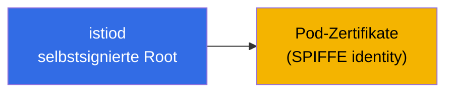
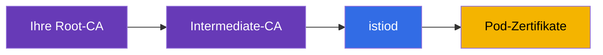
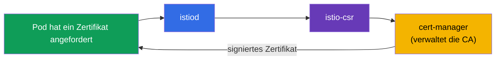
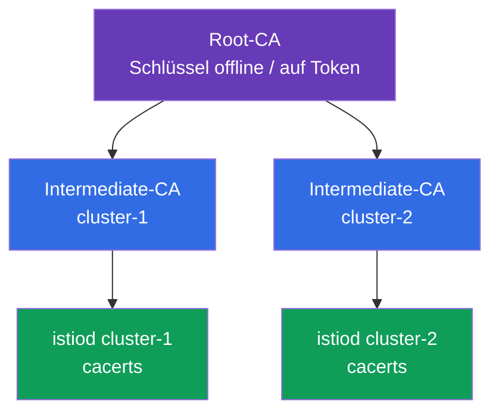
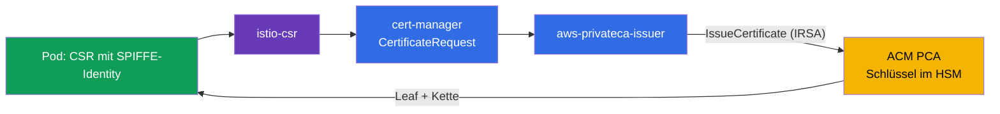
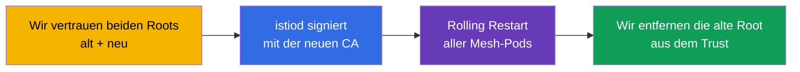

[RU version](ru.md) · [Eng version](en.md) · [Versión en español](es.md) · [Version française](fr.md)

# Kapitel 16. Zertifikatsverwaltung: eigene CA, cert-manager und istio-csr

> **Was kommt als Nächstes.** In Kapitel 13 haben wir mTLS eingeschaltet und gesagt, dass istiod selbst
> Zertifikate ausstellt und rotiert – das funktioniert out of the box. Aber in einem realen Produktivbetrieb muss man oft
> eine eigene PKI anbinden: eine unternehmensweite Root-CA, ein einheitliches Trust für mehrere Cluster,
> die Integration mit externen Systemen. In diesem Kapitel klären wir, wie man die Standard-CA durch eine
> eigene ersetzt – statisch und dynamisch (über cert-manager).

## 16.1. Wie istiod standardmäßig Zertifikate ausstellt

Erinnern wir uns, was ohne jegliche Konfiguration passiert. istiod arbeitet als Zertifizierungsstelle
(CA): beim Start generiert es ein **selbstsigniertes Root-Zertifikat** und signiert mit dieser Root die
Zertifikate aller Workloads (Pods) im Mesh.



Das ist praktisch für den Start: man muss nichts konfigurieren, mTLS funktioniert einfach. Aber ein solcher
Ansatz hat Einschränkungen, wegen derer man im Produktivbetrieb oft auf eine eigene CA umsteigt.

### Lebensdauern der Zertifikate und das Risiko des Root-Ablaufs

Hier gibt es zwei verschiedene Lebensdauern, und es ist wichtig, sie nicht zu verwechseln.

- **Die Pod-Zertifikate (Leaf, SVID)** leben sehr kurz – standardmäßig **etwa 24
  Stunden**. istiod rotiert sie automatisch lange vor dem Ablauf (etwa auf der Hälfte
  der Laufzeit). Über sie muss man nicht nachdenken, die Rotation ist vollständig automatisch.
- **Das Root-Zertifikat** des selbstsignierten istiod wird standardmäßig auf **10
  Jahre** ausgestellt. Die Laufzeit ist riesig, deshalb vergisst man es leicht – und das ist eine Falle.

Der Schlüsselaspekt: **das Root-Zertifikat wird standardmäßig NICHT automatisch rotiert.**
Die Leaf – ja, die Root – nein. Das heißt, nach 10 Jahren (oder früher, wenn Sie eine eigene
CA mit kürzerer Laufzeit festgelegt haben) läuft es einfach ab, wenn man sich nicht vorher darum kümmert.

**Was passiert, wenn die Root abläuft.** Das ist eine Katastrophe im Ausmaß des ganzen Mesh. Alle Leaf-
Zertifikate bauen eine Vertrauenskette bis zur Root auf. Sobald die Root abgelaufen ist, besteht die
mTLS-Prüfung **überall** nicht mehr: die Services vertrauen einander nicht mehr, und der Verkehr
zwischen ihnen fällt aus. Die Wiederherstellung ist nicht ein „ein Zertifikat neu ausstellen", sondern faktisch ein
Notfallaustausch der Root und die Neuerstellung des Vertrauens im ganzen Mesh (im Grunde dieselbe Prozedur
wie die CA-Migration in Abschnitt 16.7, nur bereits im Incident-Modus).

**Best Practices:**

- Halten Sie das Ablaufdatum der Root fest und **rotieren Sie sie vorab**, nicht am letzten Tag.
  Istio hat eine Prozedur zur Root-Rotation (über ein gemeinsames Trust Bundle, wie bei der Migration).
- Richten Sie **Monitoring und Alerts** auf das Näherrücken des Ablaufdatums des Root- und
  Intermediate-Zertifikats ein.
- Wenn Sie die CA dem **cert-manager** anvertrauen (Abschnitt 16.4), lässt sich die Rotation automatisieren – das ist
  ein weiteres Argument für den dynamischen Ansatz für langlebigen Produktivbetrieb.
- Für ein eigenes `cacerts` legen Sie die Laufzeit selbst fest – wählen Sie sie bewusst und planen Sie trotzdem
  die Rotation.

## 16.2. Wozu eine eigene CA nötig ist

Gründe, die selbstsignierte Standard-Root zu ersetzen:

- **Einheitliches Trust für mehrere Cluster.** Wenn Sie ein Multi-Cluster-Mesh haben (Kapitel
  28), müssen Services aus verschiedenen Clustern einander vertrauen. Dafür müssen ihre Zertifikate
  aus einer **gemeinsamen Root** stammen. Jeder Cluster hat sein eigenes selbstsigniertes istiod –
  ein gemeinsames Trust wird es nicht geben.
- **Integration mit der unternehmensweiten PKI.** Im Unternehmen gibt es bereits eine eigene Root-CA und
  Richtlinien zur Zertifikatsausstellung. Es ist logisch, dass sich die Mesh-Zertifikate in diese Hierarchie einfügen.
- **Externes Trust und Compliance.** Manchmal müssen externe Systeme den Zertifikaten der
  Mesh-Services vertrauen, und die Sicherheitsanforderungen – dass die Root unter Kontrolle steht und richtig
  aufbewahrt wird (zum Beispiel in einem HSM).

Es gibt zwei Wege, eine eigene CA anzubinden: statisch (Sie geben istiod fertige Schlüssel) und
dynamisch (istiod delegiert die Signatur an ein externes System – cert-manager).

## 16.3. Statische eigene CA

Der direkteste Weg: Sie generieren selbst eine Root- und eine Intermediate-CA, und istiod
signiert die Pod-Zertifikate mit Ihrer **Intermediate**-CA (die Root wird an einem sicheren
Ort aufbewahrt und nicht direkt verwendet).



istiod sucht Ihre CA in einem speziellen Secret `cacerts` im Namespace `istio-system`. Darin
legt man vier Dateien ab:

```bash
kubectl create secret generic cacerts -n istio-system \
  --from-file=ca-cert.pem \      # Intermediate-Zertifikat der CA
  --from-file=ca-key.pem \       # dessen privater Schlüssel (damit signiert istiod)
  --from-file=root-cert.pem \    # Root-Zertifikat
  --from-file=cert-chain.pem     # Kette: Intermediate + Root
```

Nach dem Erstellen des Secret muss istiod neu gestartet werden – beim Start greift es `cacerts` auf und
beginnt, die Pod-Zertifikate mit Ihrer Intermediate-CA statt der selbstsignierten zu signieren.
Ein wichtiges Detail: Istio erwartet gerade die **Kette** (`cert-chain.pem` = Intermediate +
Root), damit der Empfänger den Vertrauenspfad bis zur Root aufbauen kann.

Der Nachteil dieses Wegs: der CA-Schlüssel liegt in einem Kubernetes Secret, und Sie sind selbst für seine
Rotation und sichere Aufbewahrung verantwortlich.

## 16.4. Dynamische CA: cert-manager + istio-csr

Der fortgeschrittenere und „Produktions"-Weg – istiod gar keinen CA-Schlüssel zu geben, sondern die
Signatur der Zertifikate an ein externes System zu delegieren. Hier helfen zwei Komponenten:

- **cert-manager** – ein beliebter Operator für die Zertifikatsverwaltung in Kubernetes. Er
  kann mit verschiedenen CA-Quellen arbeiten (eigene, Vault, ACME usw.).
- **istio-csr** – die Brücke zwischen Istio und cert-manager. istiod schickt Signaturanfragen
  (CSR) nicht selbst, sondern über istio-csr, das cert-manager bittet, das Zertifikat zu signieren.



Was das im Vergleich zur statischen CA bringt:

- **Der CA-Schlüssel liegt nicht in einem Istio-Secret.** Er wird von cert-manager verwaltet, und man kann ihn
  sicherer aufbewahren (zum Beispiel in Vault oder HSM), ohne istiod direkten Zugriff zu geben.
- **Automatisierung.** cert-manager übernimmt Ausstellung und Rotation, und sein Ökosystem
  erlaubt es, unternehmensweite CA-Quellen leicht anzubinden.
- **Ein einheitliches System für alle Zertifikate.** Mit demselben cert-manager stellen Sie höchstwahrscheinlich bereits
  TLS-Zertifikate für ingress (Kapitel 9) aus – nun laufen auch die Mesh-Zertifikate
  über ihn.

Der Nachteil – mehr bewegliche Teile: man muss cert-manager, den Issuer und
istio-csr installieren und konfigurieren. Für kleine Installationen ist das übertrieben, für großen Produktivbetrieb – gerechtfertigt.

In der Praxis braucht man drei Dinge. Erstens einen **Issuer** von cert-manager, der die
Mesh-Zertifikate signieren wird. Die einfachste Variante – ein `Issuer` auf Basis eines Secret mit Ihrer CA (im Produktivbetrieb ist das
häufiger Vault oder ACM PCA, siehe unten):

```yaml
apiVersion: cert-manager.io/v1
kind: Issuer
metadata:
  name: istio-ca
  namespace: istio-system
spec:
  ca:
    secretName: istio-ca-key-pair    # Secret mit ca.crt/tls.crt/tls.key Ihrer CA
```

Zweitens wird **istio-csr** über Helm installiert und auf diesen Issuer konfiguriert – genau es
wird die CSR von istiod annehmen und cert-manager bitten, sie zu signieren:

```bash
helm install cert-manager-istio-csr jetstack/cert-manager-istio-csr \
  -n cert-manager \
  --set "app.certmanager.issuer.name=istio-ca" \
  --set "app.certmanager.issuer.kind=Issuer" \
  --set "app.istio.namespace=istio-system"
```

Drittens schaltet man **istiod** auf die Zertifikatsausstellung über istio-csr um (im IstioOperator
gibt man es als CA-Adresse an und deaktiviert die eigene CA von istiod):

```yaml
apiVersion: install.istio.io/v1alpha1
kind: IstioOperator
spec:
  values:
    global:
      caAddress: cert-manager-istio-csr.cert-manager.svc:443   # istiod schickt die CSR hierher
```

Danach signiert cert-manager über den Issuer `istio-ca` die Pod-Zertifikate, nicht istiod
selbst.

### AWS: unternehmensweite PKI über AWS Private CA (ACM PCA)

Ein häufiges Produktionsmuster auf EKS: die Root nicht im Cluster halten, sondern in der **AWS Private CA (ACM
PCA)** – der verwalteten Zertifizierungsstelle von AWS, wo der CA-Schlüssel auf AWS-Seite aufbewahrt und geschützt wird
(bis hin zu FIPS/HSM). cert-manager bindet sich an sie über einen separaten Issuer
[aws-privateca-issuer](https://github.com/cert-manager/aws-privateca-issuer) an:

```yaml
apiVersion: awspca.cert-manager.io/v1beta1
kind: AWSPCAClusterIssuer
metadata:
  name: acm-pca
spec:
  arn: arn:aws:acm-pca:eu-central-1:123456789012:certificate-authority/xxxxxxxx
  region: eu-central-1
```

Weiter konfiguriert man istio-csr auf diesen Issuer (`kind: AWSPCAClusterIssuer`,
`group: awspca.cert-manager.io`). Fazit: die Root und der CA-Schlüssel leben in ACM PCA (nicht im Cluster),
cert-manager fordert von ihr die Signatur an, und die Mesh-Pods erhalten Zertifikate aus Ihrer
unternehmensweiten AWS-Hierarchie. Den Zugriff von istio-csr auf ACM PCA gibt man über IAM (IRSA – eine Rolle am
ServiceAccount).

Zu den Kosten: ACM PCA wird monatlich **für die bloße Existenz der CA** berechnet plus eine Gebühr
für jedes ausgestellte Zertifikat. Es gibt zwei Modi: general-purpose (**~$400/Monat pro CA**) und
**short-lived mode für kurzlebige Zertifikate (~$50/Monat pro CA)**. Die Workload-Zertifikate des
Mesh sind kurzlebig und werden oft rotiert, deshalb nimmt man für Istio gerade den **short-lived mode**;
kalkulieren Sie trotzdem die Per-Certificate-Kosten für die Massenrotation ein. Die Preise hängen von der Region ab und
ändern sich – gleichen Sie mit dem AWS-Rechner ab. Für Labs und Schulungen ist ACM PCA etwas zu teuer (es wird abgebucht,
solange die CA existiert) – dort ist ein self-signed istiod oder `cacerts` billiger.

### Beispiel für eine kleine Organisation: 2 Cluster, gemeinsame Root

Eine typische Situation: zwei Cluster mit Istio, es braucht ein gemeinsames Trust (Multi-Cluster, Kapitel 28), aber
das Budget für eine teure PKI ist nicht da. Die Extreme passen nicht: Zertifikate „auf dem Küchentisch"
jedes Mal zu generieren ist unsicher, eine vollwertige CA (Vault/HSM) – teuer und aufwendig, ACM PCA – kostenpflichtig für
jede CA. Ein guter goldener Mittelweg – **offline-Root + Intermediate-CA pro Cluster**.

Die Idee: unsicher ist nicht, dass der Schlüssel über die CLI erstellt wurde, sondern dass der **Root-Schlüssel im
Cluster liegt**. Also generieren wir die Root **einmal offline** (auf einer geschützten Maschine; den Schlüssel
verschlüsseln wir oder halten ihn auf einem Hardware-Token), in die Cluster **gelangt sie nicht**. Mit ihr signieren wir zwei
Intermediate-CAs, und in jeden Cluster legen wir nur seine Intermediate als `cacerts` (16.3).



Die Hierarchie zu generieren geht am einfachsten mit fertigen Istio-Skripten (`samples/certs`, dort gibt es ein
Makefile) – wir erstellen eine Root und je eine Intermediate pro Cluster:

```bash
# einmal, auf einer geschützten Offline-Maschine
make -f Makefile.selfsigned.mk root-ca                 # Root-CA (Schlüssel offline aufbewahren!)
make -f Makefile.selfsigned.mk cluster-1-cacerts        # Intermediate für cluster-1
make -f Makefile.selfsigned.mk cluster-2-cacerts        # Intermediate für cluster-2
```

Danach erstellen wir in **jedem** Cluster `cacerts` aus seinem Intermediate-Satz (der Root-Schlüssel
`root-key.pem` bleibt dabei offline und wird nicht ins Secret gelegt):

```bash
# in cluster-1
kubectl create secret generic cacerts -n istio-system \
  --from-file=cluster-1/ca-cert.pem \
  --from-file=cluster-1/ca-key.pem \
  --from-file=cluster-1/root-cert.pem \
  --from-file=cluster-1/cert-chain.pem
# in cluster-2 - dasselbe aus dem Verzeichnis cluster-2/
```

Da beide Intermediate von einer **gemeinsamen Root** signiert sind, vertrauen die Services aus verschiedenen Clustern
einander – die Grundlage eines Multi-Cluster-Mesh. Die Kosten – **$0**, der Root-Schlüssel wird in den Clustern nicht
aufbewahrt, und die Rotation macht man auf der Ebene der Intermediate (das Neuausstellen der Root ist eine seltene Operation).

Wann sollte man auf ACM PCA umsteigen: wenn die manuelle Aufbewahrung der offline-Root und ihr Neuausstellen – zu
fragil für Sie ist, nehmen Sie **eine gemeinsame ACM PCA (short-lived mode, ~$50/Monat)** und binden Sie an
sie `aws-privateca-issuer` + istio-csr in **beiden** Clustern an – Sie erhalten dieselbe gemeinsame Root,
aber mit dem Schlüssel im HSM von AWS und mit Automatisierung, ohne offline-Aufwand.

#### Wie das im Detail funktioniert (2 Cluster an einer gemeinsamen ACM PCA)

**Was einmalig in AWS erstellt wird.** In ACM PCA wird eine CA aufgesetzt (zur Kostenersparnis – eine gemeinsame; bei
Bedarf Root + Subordinate, aber das sind bereits zwei CAs). Ihr privater Schlüssel lebt **innerhalb der ACM PCA im
HSM von AWS** und wird niemals nach außen herausgegeben; das Zertifikat dieser CA wird zur gemeinsamen Vertrauens-Root für
beide Cluster. Die CA lebt in einem Account/einer Region – wenn die Cluster in verschiedenen Accounts sind, teilt man die CA
über **AWS RAM** oder eine Resource-Policy.

**Was in jedem Cluster installiert wird** (gleich, aber mit Verweis auf ein und dieselbe CA):

- **cert-manager** – der Zertifikats-Operator;
- **aws-privateca-issuer** – das Plugin, das zu ACM PCA geht; darin ein `AWSPCAClusterIssuer` mit
  **gleichem ARN** der CA in beiden Clustern – das ist die „gemeinsame Root";
- **istio-csr** – nimmt die CSR von Istio an und formuliert sie als cert-manager-Anfragen an diesen Issuer;
- **istiod** ist auf istio-csr umgeschaltet (`global.caAddress`), verwendet seine eigene CA nicht;
- **IRSA** – der ServiceAccount von aws-privateca-issuer erhält eine IAM-Rolle mit den Rechten
  `acm-pca:IssueCertificate`/`GetCertificate` auf diesen ARN (Zugriff ohne Schlüssel im Cluster).

**Der Ablauf der Zertifikatsausstellung an einen Pod:**



1. Der Pod startet, istio-agent generiert ein Schlüsselpaar und eine CSR mit seiner SPIFFE-Identity; der private
   Schlüssel des Pod verlässt den Pod nicht.
2. istio-agent schickt die CSR an **istio-csr** (es ist nun der CA-Endpunkt statt istiod).
3. istio-csr erstellt eine `CertificateRequest` in cert-manager.
4. cert-manager gibt die Anfrage an **aws-privateca-issuer**, dieser ruft über IRSA ACM PCA
   `IssueCertificate` auf.
5. ACM PCA signiert die Leaf mit ihrem Schlüssel (im HSM) und gibt das Zertifikat + die Kette zurück.
6. Zurück: ACM PCA → aws-privateca-issuer → cert-manager → istio-csr → istio-agent → Envoy
   (per SDS). Der Pod hat eine Leaf, die sich bis zur Root von ACM PCA verkettet.
7. **Rotation**: die Leaf ist kurzlebig, istio-agent fordert sie vor dem Ablauf über denselben
   Ablauf neu an. Jede Ausstellung berechnet ACM PCA – daher die Wichtigkeit des short-lived mode und der Berücksichtigung des
   Volumens.

**Warum die Cluster einander vertrauen.** Beide istio-csr schauen auf **ein und dieselbe** CA, also
verketten sich alle Leaf-Zertifikate in beiden Clustern zu einer Root. Die Root wird in jedem
Cluster als Trust Bundle verteilt (`istio-ca-root-cert`, 16.5). Beim mTLS-Handshake prüfen ein Pod aus cluster-1 und
ein Pod aus cluster-2 die Zertifikate gegen die gemeinsame Root – die Prüfung besteht. Das ist eben die Basis eines
Multi-Cluster-Mesh.

**Was das gegenüber der offline-Root bringt:** der Root-Schlüssel im HSM von AWS (nicht auf einem Token und nicht in einem
Secret), Ausstellung und Rotation automatisch, eine gemeinsame Root für N Cluster – das ist einfach der gleiche ARN des
Issuer. Die Nachteile – kostenpflichtig (CA + per-certificate) und Abhängigkeit von AWS. Das Neuausstellen der CA selbst
wird nach wie vor in ACM PCA verwaltet, und der Root-Wechsel im Mesh – über ein Trust Bundle (16.7).

##### Ein wichtiger Kostenaspekt: stellen Sie nicht jede Leaf aus ACM PCA aus

ACM PCA berechnet **jedes ausgestellte Zertifikat**, und Istio rotiert die Leaf-Zertifikate
oft (eine Leaf lebt ~24h und wird etwa auf der Hälfte der Laufzeit erneuert – etwa 2-mal pro Tag und Pod).
Bei einer großen Zahl von Pods sprengt das Schema „istio-csr → ACM PCA pro Leaf" die Rechnung. Eine Schätzung im
short-lived mode (~$0.058 pro Zertifikat): 1000 Pods × ~2 Ausstellungen/Tag × 30 ≈ **60 000
Ausstellungen/Monat ≈ ~$3,5k**, und das nur für die Leaf. Es gibt zwei Modi mit riesigem Geldunterschied:

- **Variante 1 – ACM PCA signiert jede Leaf** (istio-csr → ACM PCA, wie im Ablauf oben).
  Der CA-Schlüssel liegt komplett im HSM, aber Sie zahlen für **jedes** Workload-Zertifikat → teuer im Maßstab.
  Gerechtfertigt nur bei einer kleinen Zahl von Pods.
- **Variante 2 – ACM PCA gibt nur eine Intermediate-CA, die Leaf signiert istiod selbst** (billig).
  ACM PCA (die Root, im HSM) stellt ein **Intermediate**-CA-Zertifikat für den Cluster aus; die Intermediate
  wird in `cacerts` gelegt (16.3), und weiter signiert istiod die häufigen kurzlebigen Leaf lokal,
  **ohne** sich an ACM PCA zu wenden. ACM PCA berechnet nur die Ausstellung/Neuausstellung der Intermediate
  (selten) → faktisch $50 pro CA plus Peanuts.

Der Kompromiss von Variante 2: der private Schlüssel der **Intermediate**-CA landet im Cluster (in
`cacerts`), im HSM verbleibt nur die **Root**. Für ein großes Mesh nimmt man fast immer gerade
Variante 2 (istiod signiert die Leaf, ACM PCA – nur Root/Intermediate). Ein zusätzlicher
Hebel – die **TTL der Leaf erhöhen** (seltenere Rotation – weniger Ausstellungen), aber das schwächt die
Sicherheit, deshalb ist der Hauptkniff – „istiod signiert die Leaf selbst".

## 16.5. Zertifikate überprüfen

In beiden Fällen ist es nützlich, sich zu vergewissern, dass die Pods Zertifikate von der richtigen CA erhalten. Das
macht man über `istioctl proxy-config secret` – es zeigt die Zertifikate eines konkreten
Pod. Weiter kann man sie über openssl parsen und den Aussteller ansehen:

```bash
POD=$(kubectl get pod -n app -l app=ping-pong -o jsonpath='{.items[0].metadata.name}')

istioctl proxy-config secret "$POD" -n app -o json \
  | jq -r '.dynamicActiveSecrets[] | select(.name=="default") | .secret.tlsCertificate.certificateChain.inlineBytes' \
  | base64 -d | openssl x509 -noout -issuer
```

In der Ausgabe `issuer` sehen Sie Ihre CA (zum Beispiel `O=CKS-Lab, CN=CKS-Lab Intermediate CA`
für die statische oder `O=cert-manager` für die dynamische). So bestätigen Sie, dass die
eigene CA wirklich angewendet wurde und nicht der Standard-istiod übrig blieb. Man kann noch die SPIFFE
Identity im Feld Subject Alternative Name prüfen – dort wird der bekannte `spiffe://.../ns/.../sa/...` stehen.

Das Root-Zertifikat, dem die Proxys vertrauen, verteilt Istio in der ConfigMap
`istio-ca-root-cert` (sie ist in jedem Namespace vorhanden). Die aktuelle Vertrauens-Root schnell ansehen:

```bash
kubectl get configmap istio-ca-root-cert -n app \
  -o jsonpath='{.data.root-cert\.pem}' | openssl x509 -noout -issuer -enddate
```

Das ist praktisch bei der CA-Migration (16.7): an dieser ConfigMap sieht man, ob das Mesh bereits der neuen
Root vertraut und wann die aktuelle abläuft.

## 16.6. Welchen Ansatz wählen

Fassen wir alles in einer praktischen Entscheidungstabelle zusammen.

| Situation | Empfehlung |
|----------|--------------|
| Schulung, Demo, ein Cluster | Standard-istiod-CA – nichts konfigurieren |
| Produktiv, ein Cluster, keine PKI-Anforderungen | der Standard funktioniert, aber denken Sie gleich an die Zukunft (siehe unten) |
| Multi-Cluster geplant | zwingend eine gemeinsame eigene CA von Anfang an |
| Es gibt eine unternehmensweite PKI oder Compliance | eigene CA (statisch oder dynamisch) |
| Kleines Team, einmalige Konfiguration | statische CA (`cacerts`) |
| Automatisierung nötig, CA-Schlüssel nicht in Istio halten | dynamisch: cert-manager + istio-csr |

Die Hauptwasserscheide – **ob Sie einen Multi-Cluster oder PKI-Anforderungen haben**. Wenn ja,
ist eine eigene CA zwingend nötig. Und hier stellt sich eine wichtige Frage: sie gleich konfigurieren oder
kann man später migrieren? Klären wir das, denn „später" kommt teuer zu stehen.

## 16.7. Migration von der Standard-CA auf eine eigene PKI

Stellen Sie sich vor: das Mesh läuft bereits im Produktivbetrieb auf der selbstsignierten Root von istiod, und nun braucht man
den Umstieg auf eine unternehmensweite CA. Das Problem ist, dass wir die **Vertrauens-Root** wechseln, und an der
alten Root hängen die Zertifikate aller laufenden Pods.

Der naive Weg „einfach ein neues `cacerts` unterlegen und istiod neu starten" ist gefährlich: Pods mit
alten Zertifikaten (signiert von der alten Root) und Pods mit neuen vertrauen einander nicht mehr,
und der mTLS-Verkehr zwischen ihnen bricht zusammen. Das ist der direkte Weg zum Downtime des ganzen Mesh.

Die richtige Migration macht man über ein **gemeinsames Trust Bundle** – eine Phase, in der das Mesh
gleichzeitig sowohl der alten als auch der neuen Root vertraut:



Die Logik Schritt für Schritt:

1. Wir fügen die neue Root dem Trust Bundle hinzu – nun vertrauen alle Proxys den Zertifikaten,
   die sowohl von der alten als auch von der neuen Root signiert sind. Niemand verliert vorerst etwas.
2. Wir schalten istiod auf die Signatur mit der neuen (Intermediate-)CA um.
3. Wir starten die Pods schrittweise neu – bei der Neuerstellung erhalten sie Zertifikate von der neuen
   CA. Vorerst koexistieren im Mesh alte und neue Zertifikate, aber es besteht Trust zu beiden.
4. Wenn **alle** Pods neue Zertifikate erhalten haben, entfernen wir die alte Root aus dem Trust.

### Risiken der Migration

- **Downtime bei einem Fehler.** Wenn man die Phase des gemeinsamen Trust Bundle überspringt, bricht ein Teil des Verkehrs
  – alte und neue Zertifikate werden einander nicht vertrauen.
- **Rolling Restart des ganzen Mesh.** Man muss alle Pods in allen Namespaces neu erstellen. Für einen
  großen Cluster ist das eine große und riskante Operation, und manche Workloads (stateful)
  sind schmerzhaft neu zu starten.
- **Fehler in der Zertifikatskette.** Eine falsche Reihenfolge in `cert-chain.pem` oder nicht abgestimmte
  Roots brechen das Trust komplett.
- **Multi-Cluster erschwert alles.** Die Migration muss zwischen den Clustern synchronisiert werden, sonst
  fällt der Cross-Cluster-Verkehr aus.
- **istiod-Neustart und Instabilitätsfenster.** Während der Migration stehen die control plane und die Zertifikatsausstellung
  unter erhöhter Aufmerksamkeit.

### Best Practices für Organisationen

Daraus folgt der Hauptratschlag: **es ist billiger, gleich Zeit in die PKI-Konfiguration zu investieren, als
später ein laufendes Mesh zu migrieren.**

- **Entscheiden Sie über die CA am ersten Tag.** In einem leeren Cluster eine eigene CA anzubinden – das sind
  ein paar Befehle und keinerlei Risiko. In einem laufenden Mesh mit Hunderten von Services – das ist ein Trust Bundle,
  ein vollständiger Rolling Restart und ein Risikofenster.
- **Gibt es auch nur die geringste Wahrscheinlichkeit eines Multi-Cluster oder von PKI-Anforderungen – installieren Sie die eigene
  CA sofort.** Das ist eine billige Versicherung. Ein Multi-Cluster lässt sich ohne gemeinsame Root überhaupt nicht
  „nachrüsten".
- **Automatisieren Sie von Anfang an.** Wenn die Organisation PKI-Anforderungen hat, installieren Sie
  cert-manager + istio-csr sofort – dann müssen Sie später nicht von manuellen `cacerts` umsteigen.
- **Bewahren Sie die Root-CA sicher auf** (offline oder HSM), im Mesh verwenden Sie nur die
  Intermediate.
- **Wenn die Migration doch unvermeidlich ist** – proben Sie sie unbedingt in Staging, machen Sie sie
  über ein Trust Bundle und planen Sie ein Fenster für den Rolling Restart.

Eine kurze Regel: CA und Trust sind das, was man ins Fundament legt. Ein Fundament unter einem
laufenden Gebäude umzubauen ist immer teurer und riskanter, als gleich das richtige zu legen.

## 16.8. SPIRE als alternative Identity-Quelle

Der Vollständigkeit halber: die Signatur der Zertifikate kann man nicht nur an cert-manager delegieren, sondern auch an **SPIRE**
– die Referenzimplementierung des SPIFFE-Standards (Kapitel 13). Istio kann sich mit SPIRE
über SDS integrieren, und dann stellt SPIRE die Identity und Zertifikate der Pods aus, nicht istiod. Das nimmt man, wenn
eine strengere **Attestierung der Workloads** nötig ist (SPIRE prüft, dass ein Pod wirklich der ist, für den er
sich ausgibt, anhand von Node-/Prozess-Attributen), ein einheitliches SPIFFE-Trust außerhalb von Kubernetes
(VM, andere Plattformen) oder wenn es bereits SPIRE in der Infrastruktur gibt. Für die meisten Installationen ist das
übertrieben – istiod oder cert-manager reichen –, aber von einer solchen Option zu wissen ist nützlich.

## 16.9. Best Practices

- **Entscheiden Sie über die CA am ersten Tag.** Eine eigene CA in einem leeren Cluster – ein paar Befehle; in einem laufenden
  Mesh – Trust Bundle + vollständiger Rolling Restart + Risikofenster (16.7).
- **Planen Sie die Root-Rotation und überwachen Sie die Laufzeit.** Die Root rotiert nicht von selbst; setzen Sie einen Alert
  auf das Näherrücken des `enddate` des Root- und Intermediate-Zertifikats (Prüfung – über
  `istio-ca-root-cert`, 16.5).
- **Die Root – offline oder im HSM/ACM PCA**, im Mesh verwenden Sie nur die Intermediate-CA. So legt die
  Kompromittierung des Clusters den Root-Schlüssel nicht offen.
- **Automatisieren Sie die Ausstellung.** Für langlebigen Produktivbetrieb – cert-manager + istio-csr (oder ACM PCA
  auf EKS): der CA-Schlüssel nicht in Istio, die Rotation automatisch.
- **Eine gemeinsame Root für den Multi-Cluster** (Kapitel 28) – legen Sie sie gleich an, ein gemeinsames
  Trust lässt sich später nicht ohne Migration „nachrüsten".
- **Halten Sie die Kette korrekt.** `cert-chain.pem` = Intermediate + Root, in der richtigen
  Reihenfolge; ein Fehler in der Kette bricht das Trust komplett.
- **Proben Sie die Migration in Staging.** Wenn der Umstieg auf eine eigene CA doch unvermeidlich ist – nur über ein
  gemeinsames Trust Bundle und mit einem geplanten Fenster für den Rolling Restart.

## 16.10. Zusammenfassung des Kapitels

- Standardmäßig generiert istiod selbst eine selbstsignierte Root und signiert mit ihr die
  Pod-Zertifikate; funktioniert out of the box, aber mit Einschränkungen.
- Die Leaf-Zertifikate der Pods leben ~24 Stunden und werden automatisch rotiert; die Root wird standardmäßig
  auf 10 Jahre ausgestellt und **wird nicht automatisch rotiert**. Wenn die Root abläuft –
  fällt mTLS im ganzen Mesh aus; die Root-Rotation muss man vorab planen (oder dem
  cert-manager anvertrauen) und die Laufzeit überwachen.
- Eine eigene CA ist nötig für ein einheitliches Trust zwischen Clustern, die Integration mit einer unternehmensweiten PKI
  und für Sicherheits-/Compliance-Anforderungen.
- **Statische CA:** Sie legen die Root, die Intermediate-CA und die Kette in das Secret `cacerts` in
  `istio-system`; istiod signiert die Pod-Zertifikate mit Ihrer Intermediate-CA.
- Istio erwartet gerade die Kette (`cert-chain.pem` = Intermediate + Root).
- **Dynamische CA (cert-manager + istio-csr):** istiod delegiert die Signatur über
  istio-csr an cert-manager; der CA-Schlüssel wird nicht in Istio aufbewahrt, alles ist automatisiert.
- Zu prüfen, mit welcher CA die Zertifikate signiert sind, hilft `istioctl proxy-config secret` +
  openssl; die Vertrauens-Root des Mesh liegt in der ConfigMap `istio-ca-root-cert` (in jedem Namespace).
- Auf EKS baut man eine unternehmensweite PKI bequem auf der **AWS Private CA (ACM PCA)** über cert-manager
  (`aws-privateca-issuer`) + istio-csr auf – der CA-Schlüssel bleibt in AWS, nicht im Cluster. ACM PCA ist kostenpflichtig:
  general-purpose ~$400/Monat pro CA, short-lived mode ~$50/Monat (für das Mesh nimmt man short-lived) + Gebühr
  für die Ausstellung.
- Die budgetschonende Variante für eine kleine Organisation mit 2 Clustern – **offline-Root + Intermediate
  pro Cluster** (`cacerts`): $0, der Root-Schlüssel außerhalb der Cluster, die gemeinsame Root gibt ein Multi-Cluster-
  Trust.
- ACM PCA berechnet **jede** Ausstellung, und die Leaf von Istio werden oft rotiert: stellen Sie nicht jede
  Leaf aus ACM PCA aus. Billig – wenn ACM PCA nur die **Intermediate**-CA gibt (in `cacerts`) und die Leaf
  **istiod selbst** signiert; die Per-Leaf-Ausstellung aus ACM PCA ist teuer im Maßstab.
- Die Signatur der Zertifikate kann man auch an **SPIRE** delegieren (strenge Attestierung der Workloads, Trust
  außerhalb von Kubernetes) – eine Option für komplexe Szenarien.
- Die Migration von der Standard-CA auf eine eigene macht man über ein gemeinsames Trust Bundle (wir vertrauen beiden
  Roots), einen vollständigen Rolling Restart und das anschließende Entfernen der alten Root; das Risiko eines Downtime ist
  hoch.
- Best Practice: eine eigene CA gleich anlegen (besonders bei möglichem Multi-Cluster
  oder PKI-Anforderungen) – das ist billiger und sicherer, als ein laufendes Mesh zu migrieren.

## 16.11. Fragen zur Selbstüberprüfung

1. Wie stellt istiod standardmäßig Zertifikate aus und worin besteht die Einschränkung dieses Ansatzes?
2. Nennen Sie die Gründe, eine eigene CA anzubinden.
3. Was legt man in das Secret `cacerts` und mit welchem Zertifikat signiert istiod die Pods?
4. Warum erfordert Istio gerade die Kette (`cert-chain.pem`)?
5. Wodurch ist die dynamische CA (cert-manager + istio-csr) besser als die statische und worin besteht ihr Nachteil?
6. Wie prüft man, mit welcher CA das Zertifikat eines konkreten Pod signiert ist?
7. Warum kann man nicht einfach ein neues `cacerts` unterlegen und istiod auf einem laufenden Mesh neu starten?
   Wie sieht eine sichere Migration aus?
8. Warum legt man eine eigene CA besser gleich an, statt später zu migrieren?
9. Auf welche Laufzeit ist das Root-Zertifikat standardmäßig ausgestellt, rotiert es von selbst und was
   passiert bei seinem Ablauf?
10. Welche drei Dinge muss man für die dynamische CA (cert-manager + istio-csr) konfigurieren und wie erfährt
    istiod, wohin die CSR zu senden ist?
11. Wie baut man auf EKS eine unternehmensweite PKI, ohne den CA-Schlüssel im Cluster zu halten?
12. Wo sieht man die aktuelle Vertrauens-Root des Mesh und wozu ist das bei der CA-Migration nötig?
13. Wie viel kostet ACM PCA und welchen Modus wählt man für Istio? Warum?
14. Wie gibt eine kleine Organisation zwei Clustern ein gemeinsames Trust ohne teure PKI und ohne den
    Root-Schlüssel im Cluster zu halten?
15. Warum ist es teuer, jedes Leaf-Zertifikat aus ACM PCA auszustellen, und wie verbilligt man das (was signiert dann
    die Leaf und wo landet der Schlüssel der Intermediate-CA)?

## Praxis

Üben Sie die Anbindung einer statischen eigenen CA (Root + Intermediate) in istiod:

🧪 Lab 19: [tasks/ica/labs/19](../../labs/19/README_DE.MD)

Üben Sie die dynamische Zertifikatsausstellung über cert-manager und istio-csr:

🧪 Lab 26: [tasks/ica/labs/26](../../labs/26/README_DE.MD)

---
[Inhaltsverzeichnis](../README_DE.md) · [Kapitel 15](../15/de.md) · [Kapitel 17](../17/de.md)
