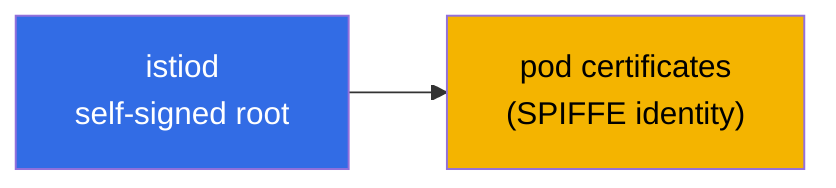
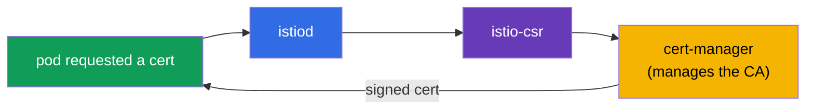
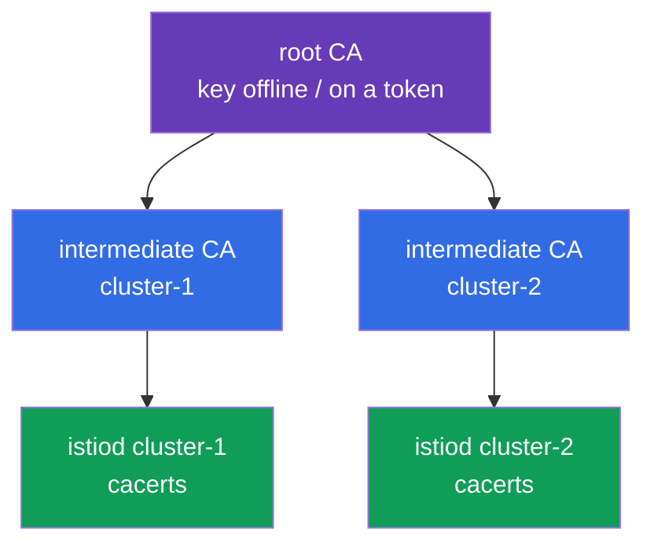
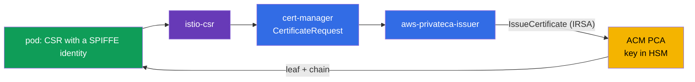
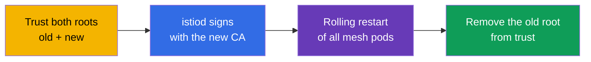

[RU version](ru.md)

# Chapter 16. Certificate management: a custom CA, cert-manager and istio-csr

> **What's next.** In chapter 13 we enabled mTLS and said that istiod issues and rotates
> certificates itself - it works out of the box. But in real production you often need to plug
> in your own PKI: a corporate root CA, a single trust for several clusters, integration with
> external systems. In this chapter we look at how to replace the default CA with your own -
> statically and dynamically (via cert-manager).

## 16.1. How istiod issues certificates by default

Recall what happens with no configuration at all. istiod acts as a certificate authority (CA):
at startup it generates a **self-signed root certificate** and with this root signs the
certificates of all workloads (pods) in the mesh.



This is convenient to start with: nothing to configure, mTLS just works. But this approach has
limitations that often lead to switching to your own CA in production.

### Certificate lifetimes and the risk of root expiry

There are two different lifetimes here, and it is important not to confuse them.

- **Pod certificates (leaf, SVID)** live very briefly - by default **about 24 hours**. istiod
  automatically rotates them well before expiry (roughly at half the lifetime). You do not need
  to think about them, the rotation is fully automatic.
- **The root certificate** of a self-signed istiod is by default issued for **10 years**. The
  lifetime is huge, so it is easy to forget about it - and that is a trap.

The key nuance: **the root certificate is NOT rotated automatically by default.** Leaf ones -
yes, the root - no. That is, after 10 years (or sooner, if you set a custom CA with a shorter
lifetime) it simply expires unless you take care of it in advance.

**What happens if the root expires.** This is a mesh-wide catastrophe. All leaf certificates
build a trust chain up to the root. As soon as the root is expired, mTLS verification stops
passing **everywhere**: services stop trusting each other, and the traffic between them falls
over. Recovery is not "re-issue a single certificate" but effectively an emergency replacement
of the root and re-establishing trust across the whole mesh (essentially the same procedure as
the CA migration in section 16.7, only in incident mode).

**Best practices:**

- Record the root's expiry date and **rotate it in advance**, not on the last day. Istio has a
  root rotation procedure (via a shared trust bundle, as in migration).
- Set up **monitoring and alerts** for the approaching expiry of the root and intermediate
  certificates.
- If you entrust the CA to **cert-manager** (section 16.4), the rotation can be automated - one
  more argument for the dynamic approach for long-lived production.
- For a custom `cacerts` you set the lifetime yourself - choose it deliberately and still plan
  the rotation.

## 16.2. Why a custom CA is needed

Reasons to replace the default self-signed root:

- **A single trust for several clusters.** If you have a multicluster mesh (chapter 28),
  services from different clusters must trust each other. For that their certificates must
  originate from a **common root**. Each cluster has its own self-signed istiod - there will be
  no common trust.
- **Integration with the corporate PKI.** The company already has its own root CA and
  certificate-issuance policies. It is logical for the mesh certificates to fit into this
  hierarchy.
- **External trust and compliance.** Sometimes external systems must trust the mesh services'
  certificates, and security requirements demand that the root be under control and stored
  properly (for example, in an HSM).

There are two ways to plug in your own CA: static (you give istiod ready keys) and dynamic
(istiod delegates signing to an external system - cert-manager).

## 16.3. A static custom CA

The most direct way: you generate the root and intermediate CA yourself, and istiod signs the
pod certificates with your **intermediate** CA (the root is kept in a safe place and not used
directly).


istiod looks for your CA in a special secret `cacerts` in the `istio-system` namespace. Four
files are put into it:

```bash
kubectl create secret generic cacerts -n istio-system \
  --from-file=ca-cert.pem \      # the intermediate CA certificate
  --from-file=ca-key.pem \       # its private key (istiod signs with it)
  --from-file=root-cert.pem \    # the root certificate
  --from-file=cert-chain.pem     # the chain: intermediate + root
```

After the secret is created, istiod has to be restarted - at startup it picks up `cacerts` and
starts signing pod certificates with your intermediate CA instead of the self-signed one. An
important detail: Istio expects exactly a **chain** (`cert-chain.pem` = intermediate + root), so
the recipient can build the trust path up to the root.

The downside of this approach: the CA key lives in a Kubernetes Secret, and you are responsible
for its rotation and secure storage yourself.

## 16.4. A dynamic CA: cert-manager + istio-csr

A more advanced, "production" way is to not give istiod the CA key at all, but delegate the
signing of certificates to an external system. Two components help here:

- **cert-manager** - a popular operator for managing certificates in Kubernetes. It can work
  with various CA sources (its own, Vault, ACME, etc.).
- **istio-csr** - a bridge between Istio and cert-manager. istiod sends signing requests (CSRs)
  not itself, but through istio-csr, which asks cert-manager to sign the certificate.



What this gives compared with a static CA:

- **The CA key does not live in an Istio secret.** cert-manager manages it, and it can be stored
  more securely (for example, in Vault or an HSM), without giving istiod direct access.
- **Automation.** cert-manager takes on issuance and rotation, and its ecosystem makes it easy
  to plug in corporate CA sources.
- **A single system for all certificates.** With the same cert-manager you probably already
  issue TLS certificates for ingress (chapter 9) - now the mesh certificates go through it too.

The downside is more moving parts: you need to install and configure cert-manager, an issuer and
istio-csr. For small installations this is overkill, for large production it is justified.

In practice three things are needed. First, a cert-manager **issuer** that will sign the mesh
certificates. The simplest option is a `Issuer` based on a secret with your CA (in production
this is more often Vault or ACM PCA, see below):

```yaml
apiVersion: cert-manager.io/v1
kind: Issuer
metadata:
  name: istio-ca
  namespace: istio-system
spec:
  ca:
    secretName: istio-ca-key-pair    # a Secret with ca.crt/tls.crt/tls.key of your CA
```

Second, **istio-csr** is installed via Helm and configured to use this issuer - it is exactly
what will accept CSRs from istiod and ask cert-manager to sign them:

```bash
helm install cert-manager-istio-csr jetstack/cert-manager-istio-csr \
  -n cert-manager \
  --set "app.certmanager.issuer.name=istio-ca" \
  --set "app.certmanager.issuer.kind=Issuer" \
  --set "app.istio.namespace=istio-system"
```

Third, **istiod** is switched to issuing certificates through istio-csr (in the IstioOperator you
point it at as the CA address and disable istiod's own CA):

```yaml
apiVersion: install.istio.io/v1alpha1
kind: IstioOperator
spec:
  values:
    global:
      caAddress: cert-manager-istio-csr.cert-manager.svc:443   # istiod sends CSRs here
```

After this the pod certificates are signed by cert-manager via the `istio-ca` issuer, not by
istiod itself.

### AWS: a corporate PKI via AWS Private CA (ACM PCA)

A common production pattern on EKS: keep the root not in the cluster but in **AWS Private CA
(ACM PCA)** - a managed certificate authority in AWS, where the CA key is stored and protected on
the AWS side (up to FIPS/HSM). cert-manager connects to it via a separate issuer,
[aws-privateca-issuer](https://github.com/cert-manager/aws-privateca-issuer):

```yaml
apiVersion: awspca.cert-manager.io/v1beta1
kind: AWSPCAClusterIssuer
metadata:
  name: acm-pca
spec:
  arn: arn:aws:acm-pca:eu-central-1:123456789012:certificate-authority/xxxxxxxx
  region: eu-central-1
```

Then istio-csr is configured to use this issuer (`kind: AWSPCAClusterIssuer`, `group:
awspca.cert-manager.io`). The result: the root and the CA key live in ACM PCA (not in the
cluster), cert-manager requests signing from it, and the mesh pods get certificates from your
corporate AWS hierarchy. istio-csr's access to ACM PCA is granted via IAM (IRSA - a role on the
ServiceAccount).

On cost: ACM PCA is billed monthly **for the CA's very existence** plus a charge for each issued
certificate. There are two modes: general-purpose (**~$400/month per CA**) and **short-lived mode
for short-lived certificates (~$50/month per CA)**. The mesh workload certificates are short-lived
and rotate often, so for Istio you take exactly the **short-lived mode**; still budget for the
per-certificate cost of mass rotation. Prices depend on the region and change - check the AWS
calculator. For labs and learning ACM PCA is a bit pricey (it is billed while the CA exists) -
there a self-signed istiod or `cacerts` is cheaper.

### An example for a small organization: two clusters, a shared root

A typical situation: two clusters with Istio, a shared trust is needed (multicluster, chapter
28), but there is no budget for an expensive PKI. The extremes do not fit: generating
certificates "on the knee" every time is insecure, a full-fledged CA (Vault/HSM) is expensive and
troublesome, ACM PCA is paid per CA. A good middle ground is an **offline root + an intermediate
CA per cluster**.

The idea: what is insecure is not that the key was created via the CLI, but that the **root key
lives in the cluster**. So we generate the root **once, offline** (on a secured machine; the key
is encrypted or kept on a hardware token), and it **does not enter** the clusters. With it we sign
two intermediate CAs, and into each cluster we put only its intermediate as `cacerts` (16.3).



The hierarchy is easiest to generate with Istio's ready scripts (`samples/certs`, there is a
Makefile there) - we create one root and an intermediate per cluster:

```bash
# once, on a secured offline machine
make -f Makefile.selfsigned.mk root-ca                 # the root CA (keep the key offline!)
make -f Makefile.selfsigned.mk cluster-1-cacerts        # the intermediate for cluster-1
make -f Makefile.selfsigned.mk cluster-2-cacerts        # the intermediate for cluster-2
```

Then in **each** cluster we create `cacerts` from its intermediate set (the root key
`root-key.pem` stays offline and is not put into the secret):

```bash
# in cluster-1
kubectl create secret generic cacerts -n istio-system \
  --from-file=cluster-1/ca-cert.pem \
  --from-file=cluster-1/ca-key.pem \
  --from-file=cluster-1/root-cert.pem \
  --from-file=cluster-1/cert-chain.pem
# in cluster-2 - the same from the cluster-2/ directory
```

Since both intermediates are signed by the **common root**, services from different clusters
trust each other - the basis of a multicluster mesh. The cost is **$0**, the root key is not
stored in the clusters, and rotation is done at the intermediate level (re-issuing the root is a
rare operation).

When it is worth moving to ACM PCA: if the manual storage of the offline root and its re-issuance
is too fragile for you, take **one shared ACM PCA (short-lived mode, ~$50/month)** and connect
`aws-privateca-issuer` + istio-csr to it in **both** clusters - you get the same shared root, but
with the key in an AWS HSM and with automation, without the offline fuss.

#### How it works in detail (two clusters on a shared ACM PCA)

**What is created once in AWS.** In ACM PCA a CA is set up (for economy - one shared; optionally
Root + Subordinate, but that is already two CAs). Its private key lives **inside ACM PCA in an AWS
HSM** and is never handed out; the certificate of this CA becomes the common trust root for both
clusters. The CA lives in one account/region - if the clusters are in different accounts, the CA
is shared via **AWS RAM** or a resource policy.

**What is installed in each cluster** (identically, but referencing the same CA):

- **cert-manager** - the certificate operator;
- **aws-privateca-issuer** - the plugin that talks to ACM PCA; in it an `AWSPCAClusterIssuer`
  with the **same ARN** of the CA in both clusters - this is the "shared root";
- **istio-csr** - accepts CSRs from Istio and formalizes them as cert-manager requests to this
  issuer;
- **istiod** is switched to istio-csr (`global.caAddress`), does not use its own CA;
- **IRSA** - the aws-privateca-issuer ServiceAccount gets an IAM role with
  `acm-pca:IssueCertificate`/`GetCertificate` rights on this ARN (access without keys in the
  cluster).

**The certificate issuance flow for a pod:**



1. A pod starts, istio-agent generates a keypair and a CSR with its SPIFFE identity; the pod's
   private key never leaves the pod.
2. istio-agent sends the CSR to **istio-csr** (it is now the CA endpoint instead of istiod).
3. istio-csr creates a `CertificateRequest` in cert-manager.
4. cert-manager hands the request to **aws-privateca-issuer**, which via IRSA calls ACM PCA
   `IssueCertificate`.
5. ACM PCA signs the leaf with its key (in the HSM) and returns the certificate + chain.
6. Back it goes: ACM PCA → aws-privateca-issuer → cert-manager → istio-csr → istio-agent → Envoy
   (over SDS). The pod has a leaf chaining to the ACM PCA root.
7. **Rotation**: the leaf is short-lived, istio-agent re-requests it before expiry via the same
   flow. Each issuance is billed by ACM PCA - hence the importance of short-lived mode and
   watching the volume.

**Why the clusters trust each other.** Both istio-csr instances point to the **same** CA, so all
leaf certificates in both clusters chain to a single root. The root is distributed in each cluster
as a trust bundle (`istio-ca-root-cert`, 16.5). At the mTLS handshake a pod from cluster-1 and a
pod from cluster-2 verify the certificates against the common root - the check passes. This is the
basis of a multicluster mesh.

**What this gives over an offline root:** the root key is in an AWS HSM (not on a token and not in
a Secret), issuance and rotation are automatic, a shared root for N clusters is just the same
issuer ARN. The downsides are that it is paid (CA + per-certificate) and there is a dependency on
AWS. Re-issuing the CA itself is still managed in ACM PCA, and changing the root across the mesh
is via a trust bundle (16.7).

##### An important cost nuance: do not issue every leaf from ACM PCA

ACM PCA bills **every issued certificate**, while Istio rotates leaf certificates often (a leaf
lives ~24h and is renewed roughly at half its lifetime - about twice a day per pod). With a large
number of pods the "istio-csr → ACM PCA per leaf" scheme blows up the bill. An estimate in
short-lived mode (~$0.058 per certificate): 1000 pods × ~2 issuances/day × 30 ≈ **60,000
issuances/month ≈ ~$3.5k**, and that is only for the leaves. There are two modes with a huge
difference in money:

- **Option 1 - ACM PCA signs every leaf** (istio-csr → ACM PCA, as in the flow above). The CA key
  is entirely in the HSM, but you pay for **every** workload certificate → expensive at scale.
  Justified only with a small number of pods.
- **Option 2 - ACM PCA provides only the intermediate CA, and istiod signs the leaves itself**
  (cheap). ACM PCA (the root, in the HSM) issues an **intermediate** CA certificate for the
  cluster; the intermediate is placed into `cacerts` (16.3), and then istiod signs the frequent
  short-lived leaves locally, **without contacting ACM PCA**. ACM PCA bills only for issuing/
  re-issuing the intermediate (rarely) → effectively $50 per CA plus pennies.

The trade-off of option 2: the private key of the **intermediate** CA ends up in the cluster (in
`cacerts`), and only the **root** stays in the HSM. For a large mesh option 2 is almost always
chosen (istiod signs the leaves, ACM PCA - only the root/intermediate). An additional lever is to
**increase the leaf TTL** (less frequent rotation - fewer issuances), but that weakens security,
so the main technique is "istiod signs the leaves itself".

## 16.5. Verifying certificates

In both cases it is useful to make sure the pods get certificates from the right CA. This is done
with `istioctl proxy-config secret` - it shows a specific pod's certificates. They can then be
parsed with openssl and the issuer inspected:

```bash
POD=$(kubectl get pod -n app -l app=ping-pong -o jsonpath='{.items[0].metadata.name}')

istioctl proxy-config secret "$POD" -n app -o json \
  | jq -r '.dynamicActiveSecrets[] | select(.name=="default") | .secret.tlsCertificate.certificateChain.inlineBytes' \
  | base64 -d | openssl x509 -noout -issuer
```

In the `issuer` output you will see your CA (for example, `O=CKS-Lab, CN=CKS-Lab Intermediate CA`
for the static one or `O=cert-manager` for the dynamic one). This confirms that the custom CA
actually took effect and did not remain the default istiod. You can also check the SPIFFE identity
in the Subject Alternative Name field - there will be the familiar
`spiffe://.../ns/.../sa/...`.

The root certificate that the proxies trust is distributed by Istio in the ConfigMap
`istio-ca-root-cert` (it is present in every namespace). To quickly see the current trust root:

```bash
kubectl get configmap istio-ca-root-cert -n app \
  -o jsonpath='{.data.root-cert\.pem}' | openssl x509 -noout -issuer -enddate
```

This is handy during a CA migration (16.7): from this ConfigMap you can see whether the mesh
already trusts the new root, and when the current one expires.

## 16.6. Which approach to choose

Let us sum it all up in a practical decision table.

| Situation | Recommendation |
|-----------|----------------|
| Learning, demo, a single cluster | the default istiod CA - configure nothing |
| Production, a single cluster, no PKI requirements | the default works, but think about the future right away (see below) |
| Multicluster planned | a shared custom CA is mandatory from the very start |
| There is a corporate PKI or compliance | a custom CA (static or dynamic) |
| A small team, a one-off setup | a static CA (`cacerts`) |
| Automation needed, do not store the CA key in Istio | dynamic: cert-manager + istio-csr |

The main watershed is **whether you will have multicluster or PKI requirements**. If yes, a custom
CA is mandatory. And here an important question arises: configure it right away or migrate later?
Let us go through it, because "later" is costly.

## 16.7. Migrating from the default CA to your own PKI

Imagine: the mesh is already running in production on istiod's self-signed root, and now you need
to move to a corporate CA. The problem is that we are changing the **root of trust**, and the
certificates of all running pods are tied to the old root.

The naive path "just drop in a new `cacerts` and restart istiod" is dangerous: pods with old
certificates (signed by the old root) and pods with new ones will stop trusting each other, and
the mTLS traffic between them will fall over. This is a direct path to a mesh-wide outage.

A correct migration is done via a **shared trust bundle** - a period when the mesh trusts both the
old and the new root at the same time:



The logic step by step:

1. Add the new root to the trust bundle - now all proxies trust certificates signed by both the
   old and the new root. Nobody loses anything yet.
2. Switch istiod to signing with the new (intermediate) CA.
3. Gradually restart the pods - on recreation they get certificates from the new CA. For now old
   and new certificates coexist in the mesh, but trust exists for both.
4. When **all** pods have received the new certificates, remove the old root from trust.

### Migration risks

- **Downtime on a mistake.** If you skip the shared trust bundle phase, part of the traffic will
  break - old and new certificates will not trust each other.
- **A rolling restart of the whole mesh.** You need to recreate all pods in all namespaces. For a
  large cluster this is a big and risky operation, and some workloads (stateful) are painful to
  restart.
- **Errors in the certificate chain.** The wrong order in `cert-chain.pem` or mismatched roots
  break trust entirely.
- **Multicluster complicates everything.** The migration must be synchronized across clusters,
  otherwise cross-cluster traffic falls off.
- **The istiod restart and a window of instability.** During the migration the control plane and
  certificate issuance are under heightened attention.

### Best practices for organizations

From this follows the main advice: **it is cheaper to spend time configuring the PKI right away
than to migrate a live mesh later.**

- **Decide about the CA on day one.** On an empty cluster, plugging in a custom CA is a couple of
  commands and no risk. On a live mesh with hundreds of services it is a trust bundle, a full
  rolling restart and a window of risk.
- **If there is even the slightest chance of multicluster or PKI requirements - set up a custom CA
  right away.** It is cheap insurance. Multicluster cannot be "finished later" at all without a
  common root.
- **Automate from the very start.** If the organization has PKI requirements, set up cert-manager
  + istio-csr right away - then you will not have to move off manual `cacerts`.
- **Store the root CA securely** (offline or in an HSM), and use only the intermediate in the
  mesh.
- **If the migration is nonetheless unavoidable** - be sure to rehearse it in staging, do it via a
  trust bundle and plan a window for the rolling restart.

A short rule: the CA and trust are what you lay into the foundation. Redoing the foundation under
a working building is always more expensive and riskier than laying the right one at once.

## 16.8. SPIRE as an alternative identity source

For completeness: certificate signing can be delegated not only to cert-manager but also to
**SPIRE** - the reference implementation of the SPIFFE standard (chapter 13). Istio can integrate
with SPIRE via SDS, and then the identity and pod certificates are issued by SPIRE, not istiod.
This is taken when you need stricter **workload attestation** (SPIRE verifies that the pod really
is who it claims to be, by node/process attributes), a single SPIFFE trust beyond Kubernetes (VMs,
other platforms) or when SPIRE already exists in the infrastructure. For most installations this
is overkill - istiod or cert-manager is enough - but it is useful to know about this option.

## 16.9. Best practices

- **Decide about the CA on day one.** A custom CA on an empty cluster is a couple of commands; on
  a live mesh it is a trust bundle + a full rolling restart + a window of risk (16.7).
- **Plan the root rotation and monitor the lifetime.** The root does not rotate itself; set an
  alert for the approaching `enddate` of the root and intermediate certificates (checked via
  `istio-ca-root-cert`, 16.5).
- **The root - offline or in an HSM/ACM PCA**, and use only the intermediate CA in the mesh. This
  way a cluster compromise does not expose the root key.
- **Automate issuance.** For long-lived production - cert-manager + istio-csr (or ACM PCA on EKS):
  the CA key is not in Istio, the rotation is automatic.
- **A single common root for multicluster** (chapter 28) - lay it right away, you cannot "finish"
  a common trust later without a migration.
- **Keep the chain correct.** `cert-chain.pem` = intermediate + root, in the right order; an error
  in the chain breaks trust entirely.
- **Rehearse the migration in staging.** If the move to your own CA is nonetheless unavoidable -
  only via a shared trust bundle and with a planned window for the rolling restart.

## 16.10. Chapter summary

- By default istiod generates a self-signed root itself and signs pod certificates with it; it
  works out of the box, but with limitations.
- Leaf pod certificates live ~24 hours and rotate automatically; the root is by default issued for
  10 years and is **not rotated automatically**. If the root expires - mTLS falls over across the
  whole mesh; the root rotation must be planned in advance (or entrusted to cert-manager) and the
  lifetime monitored.
- A custom CA is needed for a single trust between clusters, integration with the corporate PKI
  and security/compliance requirements.
- **A static CA:** you put the root, the intermediate CA and the chain into the `cacerts` secret
  in `istio-system`; istiod signs pod certificates with your intermediate CA.
- Istio expects exactly a chain (`cert-chain.pem` = intermediate + root).
- **A dynamic CA (cert-manager + istio-csr):** istiod delegates signing through istio-csr to
  cert-manager; the CA key is not stored in Istio, everything is automated.
- To check which CA the certificates are signed by, `istioctl proxy-config secret` + openssl help;
  the mesh trust root lives in the ConfigMap `istio-ca-root-cert` (in every namespace).
- On EKS a corporate PKI is conveniently built on **AWS Private CA (ACM PCA)** via cert-manager
  (`aws-privateca-issuer`) + istio-csr - the CA key stays in AWS, not in the cluster. ACM PCA is
  paid: general-purpose ~$400/month per CA, short-lived mode ~$50/month (for the mesh you take
  short-lived) + a per-issuance charge.
- A budget option for a small organization with two clusters is an **offline root + an intermediate
  per cluster** (`cacerts`): $0, the root key is outside the clusters, and a common root gives
  multicluster trust.
- ACM PCA bills **every** issuance, and Istio's leaves rotate often: do not issue every leaf from
  ACM PCA. It is cheap when ACM PCA provides only the **intermediate** CA (in `cacerts`), and the
  leaves are signed by **istiod itself**; per-leaf issuance from ACM PCA is expensive at scale.
- Certificate signing can also be delegated to **SPIRE** (strict workload attestation, trust
  beyond Kubernetes) - an option for complex scenarios.
- Migration from the default CA to your own is done via a shared trust bundle (trust both roots),
  a full rolling restart and then removing the old root; the risk of downtime is high.
- Best practice: lay a custom CA right away (especially with possible multicluster or PKI
  requirements) - it is cheaper and safer than migrating a live mesh.

## 16.11. Self-check questions

1. How does istiod issue certificates by default and what is the limitation of this approach?
2. Name the reasons to plug in a custom CA.
3. What is put into the `cacerts` secret and with which certificate does istiod sign the pods?
4. Why does Istio require exactly a chain (`cert-chain.pem`)?
5. How is a dynamic CA (cert-manager + istio-csr) better than a static one and what is its
   downside?
6. How do you check which CA a specific pod's certificate is signed by?
7. Why can you not just drop in a new `cacerts` and restart istiod on a live mesh? What does a safe
   migration look like?
8. Why is a custom CA better laid in right away rather than migrated later?
9. For how long is the root certificate issued by default, does it rotate by itself and what
   happens on its expiry?
10. What three things need to be configured for a dynamic CA (cert-manager + istio-csr) and how
    does istiod learn where to send CSRs?
11. How do you build a corporate PKI on EKS without storing the CA key in the cluster?
12. Where do you look at the current mesh trust root and why is this needed during a CA migration?
13. How much does ACM PCA cost and which mode is chosen for Istio? Why?
14. How does a small organization give a common trust to two clusters without an expensive PKI and
    without storing the root key in the cluster?
15. Why is issuing every leaf certificate from ACM PCA expensive and how do you make it cheaper
    (what then signs the leaves and where does the intermediate CA key end up)?

## Practice

Practice plugging in a static custom CA (root + intermediate) into istiod:

🧪 Lab 19: [tasks/ica/labs/19](../../labs/19/README.MD)

Practice dynamic certificate issuance via cert-manager and istio-csr:

🧪 Lab 26: [tasks/ica/labs/26](../../labs/26/README.MD)

---
[Contents](../README.md) · [Chapter 15](../15/en.md) · [Chapter 17](../17/en.md)
