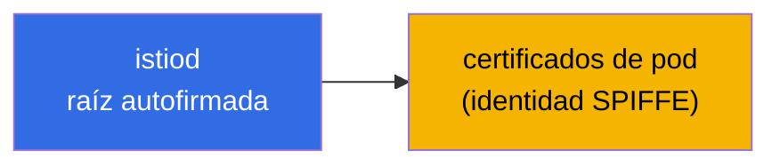
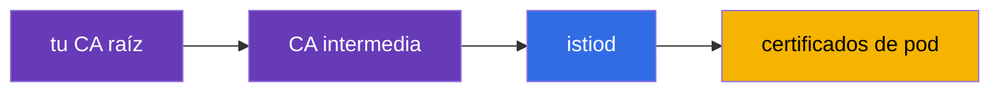
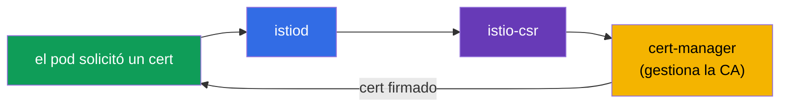
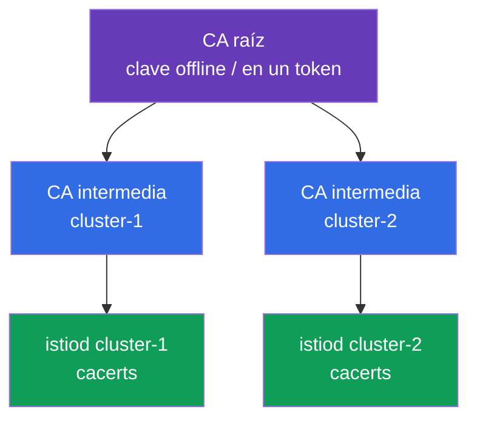
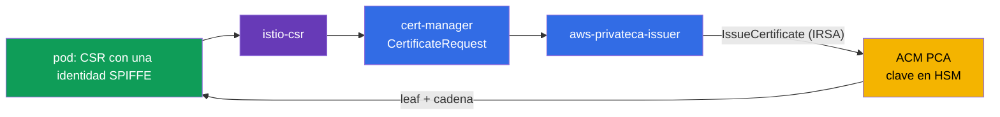
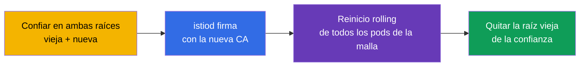

[RU version](ru.md) · [Eng version](en.md)

# Capítulo 16. Gestión de certificados: una CA propia, cert-manager e istio-csr

> **Qué sigue.** En el capítulo 13 habilitamos mTLS y dijimos que istiod emite y rota los
> certificados por sí mismo: funciona de fábrica. Pero en producción real a menudo necesitas
> conectar tu propia PKI: una CA raíz corporativa, una confianza única para varios clústeres,
> integración con sistemas externos. En este capítulo vemos cómo reemplazar la CA por defecto por
> la tuya, de forma estática y dinámica (vía cert-manager).

## 16.1. Cómo emite istiod los certificados por defecto

Recuerda qué pasa sin configuración alguna. istiod actúa como una autoridad de certificación (CA):
al arrancar genera un **certificado raíz autofirmado** y con esta raíz firma los certificados de
todas las cargas de trabajo (pods) de la malla.



Esto es cómodo para empezar: nada que configurar, mTLS simplemente funciona. Pero este enfoque
tiene limitaciones que a menudo llevan a cambiar a una CA propia en producción.

### Vidas de los certificados y el riesgo de expiración de la raíz

Aquí hay dos vidas distintas, y es importante no confundirlas.

- **Los certificados de pod (leaf, SVID)** viven muy poco: por defecto **unas 24 horas**. istiod
  los rota automáticamente bastante antes de la expiración (aproximadamente a la mitad de la vida).
  No necesitas pensar en ellos, la rotación es totalmente automática.
- **El certificado raíz** de un istiod autofirmado se emite por defecto para **10 años**. La vida
  es enorme, así que es fácil olvidarse de él, y esa es una trampa.

El matiz clave: **el certificado raíz NO se rota automáticamente por defecto.** Los leaf sí, la
raíz no. Es decir, tras 10 años (o antes, si fijas una CA propia con una vida más corta)
simplemente expira a menos que te ocupes de él con antelación.

**Qué pasa si la raíz expira.** Esto es una catástrofe para toda la malla. Todos los certificados
leaf construyen una cadena de confianza hasta la raíz. En cuanto la raíz está expirada, la
verificación de mTLS deja de pasar **en todas partes**: los servicios dejan de confiar entre sí, y
el tráfico entre ellos se cae. La recuperación no es "reemitir un solo certificado" sino, en la
práctica, un reemplazo de emergencia de la raíz y restablecer la confianza en toda la malla (en
esencia, el mismo procedimiento que la migración de CA de la sección 16.7, solo que en modo
incidente).

**Buenas prácticas:**

- Anota la fecha de expiración de la raíz y **rótala con antelación**, no el último día. Istio
  tiene un procedimiento de rotación de la raíz (vía un trust bundle compartido, como en la
  migración).
- Configura **monitorización y alertas** para la expiración cercana de los certificados raíz e
  intermedios.
- Si confías la CA a **cert-manager** (sección 16.4), la rotación se puede automatizar: un argumento
  más a favor del enfoque dinámico para producción de larga vida.
- Para un `cacerts` propio fijas tú la vida: elígela deliberadamente y planifica igualmente la
  rotación.

## 16.2. Por qué se necesita una CA propia

Razones para reemplazar la raíz autofirmada por defecto:

- **Una confianza única para varios clústeres.** Si tienes una malla multicluster (capítulo 28),
  los servicios de distintos clústeres deben confiar entre sí. Para eso sus certificados deben
  originarse de una **raíz común**. Cada clúster tiene su propio istiod autofirmado: no habrá
  confianza común.
- **Integración con la PKI corporativa.** La empresa ya tiene su propia CA raíz y políticas de
  emisión de certificados. Es lógico que los certificados de la malla encajen en esta jerarquía.
- **Confianza externa y compliance.** A veces los sistemas externos deben confiar en los
  certificados de los servicios de la malla, y los requisitos de seguridad exigen que la raíz esté
  bajo control y almacenada correctamente (por ejemplo, en un HSM).

Hay dos formas de conectar tu propia CA: estática (le das a istiod las claves ya listas) y dinámica
(istiod delega la firma a un sistema externo: cert-manager).

## 16.3. Una CA propia estática

La forma más directa: generas tú mismo la CA raíz e intermedia, e istiod firma los certificados de
pod con tu CA **intermedia** (la raíz se guarda en un lugar seguro y no se usa directamente).



istiod busca tu CA en un secret especial `cacerts` en el namespace `istio-system`. En él se ponen
cuatro archivos:

```bash
kubectl create secret generic cacerts -n istio-system \
  --from-file=ca-cert.pem \      # el certificado de la CA intermedia
  --from-file=ca-key.pem \       # su clave privada (istiod firma con ella)
  --from-file=root-cert.pem \    # el certificado raíz
  --from-file=cert-chain.pem     # la cadena: intermedia + raíz
```

Después de crear el secret, hay que reiniciar istiod: al arrancar recoge `cacerts` y empieza a
firmar los certificados de pod con tu CA intermedia en lugar de la autofirmada. Un detalle
importante: Istio espera exactamente una **cadena** (`cert-chain.pem` = intermedia + raíz), para que
el receptor pueda construir la ruta de confianza hasta la raíz.

La desventaja de este enfoque: la clave de la CA vive en un Secret de Kubernetes, y eres
responsable tú mismo de su rotación y almacenamiento seguro.

## 16.4. Una CA dinámica: cert-manager + istio-csr

Una forma más avanzada, "de producción", es no darle a istiod la clave de la CA en absoluto, sino
delegar la firma de los certificados a un sistema externo. Aquí ayudan dos componentes:

- **cert-manager**: un operador popular para gestionar certificados en Kubernetes. Puede trabajar
  con diversas fuentes de CA (la suya, Vault, ACME, etc.).
- **istio-csr**: un puente entre Istio y cert-manager. istiod envía las solicitudes de firma (CSR)
  no por sí mismo, sino a través de istio-csr, que pide a cert-manager que firme el certificado.



Qué aporta esto comparado con una CA estática:

- **La clave de la CA no vive en un secret de Istio.** cert-manager la gestiona, y se puede
  almacenar de forma más segura (por ejemplo, en Vault o un HSM), sin dar a istiod acceso directo.
- **Automatización.** cert-manager asume la emisión y la rotación, y su ecosistema facilita conectar
  fuentes de CA corporativas.
- **Un único sistema para todos los certificados.** Con el mismo cert-manager probablemente ya
  emitas certificados TLS para el ingress (capítulo 9); ahora los certificados de la malla también
  pasan por él.

La desventaja son más piezas móviles: necesitas instalar y configurar cert-manager, un issuer e
istio-csr. Para instalaciones pequeñas esto es excesivo, para producción grande está justificado.

En la práctica hacen falta tres cosas. Primero, un **issuer** de cert-manager que firme los
certificados de la malla. La opción más simple es un `Issuer` basado en un secret con tu CA (en
producción esto es más a menudo Vault o ACM PCA, ver abajo):

```yaml
apiVersion: cert-manager.io/v1
kind: Issuer
metadata:
  name: istio-ca
  namespace: istio-system
spec:
  ca:
    secretName: istio-ca-key-pair    # un Secret con ca.crt/tls.crt/tls.key de tu CA
```

Segundo, **istio-csr** se instala vía Helm y se configura para usar este issuer: es exactamente lo
que aceptará las CSR de istiod y pedirá a cert-manager que las firme:

```bash
helm install cert-manager-istio-csr jetstack/cert-manager-istio-csr \
  -n cert-manager \
  --set "app.certmanager.issuer.name=istio-ca" \
  --set "app.certmanager.issuer.kind=Issuer" \
  --set "app.istio.namespace=istio-system"
```

Tercero, **istiod** se cambia a emitir certificados a través de istio-csr (en el IstioOperator lo
apuntas como la dirección de la CA y deshabilitas la propia CA de istiod):

```yaml
apiVersion: install.istio.io/v1alpha1
kind: IstioOperator
spec:
  values:
    global:
      caAddress: cert-manager-istio-csr.cert-manager.svc:443   # istiod envía aquí las CSR
```

Tras esto los certificados de pod los firma cert-manager vía el issuer `istio-ca`, no istiod mismo.

### AWS: una PKI corporativa vía AWS Private CA (ACM PCA)

Un patrón de producción común en EKS: mantener la raíz no en el clúster sino en **AWS Private CA
(ACM PCA)**, una autoridad de certificación gestionada en AWS, donde la clave de la CA se almacena y
protege del lado de AWS (hasta FIPS/HSM). cert-manager se conecta a ella vía un issuer aparte,
[aws-privateca-issuer](https://github.com/cert-manager/aws-privateca-issuer):

```yaml
apiVersion: awspca.cert-manager.io/v1beta1
kind: AWSPCAClusterIssuer
metadata:
  name: acm-pca
spec:
  arn: arn:aws:acm-pca:eu-central-1:123456789012:certificate-authority/xxxxxxxx
  region: eu-central-1
```

Luego istio-csr se configura para usar este issuer (`kind: AWSPCAClusterIssuer`, `group:
awspca.cert-manager.io`). El resultado: la raíz y la clave de la CA viven en ACM PCA (no en el
clúster), cert-manager le solicita la firma, y los pods de la malla obtienen certificados de tu
jerarquía corporativa de AWS. El acceso de istio-csr a ACM PCA se concede vía IAM (IRSA: un rol en
el ServiceAccount).

Sobre el coste: ACM PCA se factura mensualmente **por la mera existencia de la CA** más un cargo por
cada certificado emitido. Hay dos modos: de propósito general (**~$400/mes por CA**) y **modo
short-lived para certificados de vida corta (~$50/mes por CA)**. Los certificados de las cargas de
trabajo de la malla son de vida corta y rotan a menudo, así que para Istio tomas exactamente el
**modo short-lived**; presupuesta igualmente el coste por certificado de la rotación masiva. Los
precios dependen de la región y cambian: consulta la calculadora de AWS. Para laboratorios y
aprendizaje ACM PCA sale un poco caro (se factura mientras la CA existe): ahí un istiod autofirmado
o `cacerts` sale más barato.

### Un ejemplo para una organización pequeña: dos clústeres, una raíz compartida

Una situación típica: dos clústeres con Istio, se necesita una confianza compartida (multicluster,
capítulo 28), pero no hay presupuesto para una PKI cara. Los extremos no encajan: generar
certificados "sobre la rodilla" cada vez es inseguro, una CA en toda regla (Vault/HSM) es cara y
engorrosa, ACM PCA es de pago por CA. Un buen término medio es una **raíz offline + una CA
intermedia por clúster**.

La idea: lo inseguro no es que la clave se creara vía la CLI, sino que la **clave raíz viva en el
clúster**. Así que generamos la raíz **una vez, offline** (en una máquina segura; la clave se cifra
o se guarda en un token de hardware), y **no entra** en los clústeres. Con ella firmamos dos CA
intermedias, y en cada clúster ponemos solo su intermedia como `cacerts` (16.3).



La jerarquía es más fácil de generar con los scripts listos de Istio (`samples/certs`, ahí hay un
Makefile): creamos una raíz y una intermedia por clúster:

```bash
# una vez, en una máquina offline segura
make -f Makefile.selfsigned.mk root-ca                 # la CA raíz (¡guarda la clave offline!)
make -f Makefile.selfsigned.mk cluster-1-cacerts        # la intermedia para cluster-1
make -f Makefile.selfsigned.mk cluster-2-cacerts        # la intermedia para cluster-2
```

Luego en **cada** clúster creamos `cacerts` a partir de su conjunto intermedio (la clave raíz
`root-key.pem` se queda offline y no se pone en el secret):

```bash
# en cluster-1
kubectl create secret generic cacerts -n istio-system \
  --from-file=cluster-1/ca-cert.pem \
  --from-file=cluster-1/ca-key.pem \
  --from-file=cluster-1/root-cert.pem \
  --from-file=cluster-1/cert-chain.pem
# en cluster-2 - lo mismo desde el directorio cluster-2/
```

Como ambas intermedias están firmadas por la **raíz común**, los servicios de distintos clústeres
confían entre sí: la base de una malla multicluster. El coste es **$0**, la clave raíz no se
almacena en los clústeres, y la rotación se hace a nivel de la intermedia (reemitir la raíz es una
operación rara).

Cuándo vale la pena pasar a ACM PCA: si el almacenamiento manual de la raíz offline y su reemisión
te resulta demasiado frágil, toma **una única ACM PCA compartida (modo short-lived, ~$50/mes)** y
conéctale `aws-privateca-issuer` + istio-csr en **ambos** clústeres: obtienes la misma raíz
compartida, pero con la clave en un HSM de AWS y con automatización, sin el ajetreo del offline.

#### Cómo funciona en detalle (dos clústeres sobre una ACM PCA compartida)

**Qué se crea una vez en AWS.** En ACM PCA se configura una CA (por economía, una compartida;
opcionalmente Root + Subordinate, pero eso ya son dos CA). Su clave privada vive **dentro de ACM PCA
en un HSM de AWS** y nunca se entrega; el certificado de esta CA se convierte en la raíz de
confianza común para ambos clústeres. La CA vive en una cuenta/región: si los clústeres están en
cuentas distintas, la CA se comparte vía **AWS RAM** o una resource policy.

**Qué se instala en cada clúster** (de forma idéntica, pero referenciando la misma CA):

- **cert-manager**: el operador de certificados;
- **aws-privateca-issuer**: el plugin que habla con ACM PCA; en él un `AWSPCAClusterIssuer` con el
  **mismo ARN** de la CA en ambos clústeres: esta es la "raíz compartida";
- **istio-csr**: acepta las CSR de Istio y las formaliza como solicitudes de cert-manager a este
  issuer;
- **istiod** se cambia a istio-csr (`global.caAddress`), no usa su propia CA;
- **IRSA**: el ServiceAccount de aws-privateca-issuer obtiene un rol IAM con los permisos
  `acm-pca:IssueCertificate`/`GetCertificate` sobre este ARN (acceso sin claves en el clúster).

**El flujo de emisión de certificados para un pod:**



1. Un pod arranca, istio-agent genera un par de claves y una CSR con su identidad SPIFFE; la clave
   privada del pod nunca sale del pod.
2. istio-agent envía la CSR a **istio-csr** (ahora es el endpoint de la CA en lugar de istiod).
3. istio-csr crea un `CertificateRequest` en cert-manager.
4. cert-manager entrega la solicitud a **aws-privateca-issuer**, que vía IRSA llama a ACM PCA
   `IssueCertificate`.
5. ACM PCA firma el leaf con su clave (en el HSM) y devuelve el certificado + la cadena.
6. De vuelta: ACM PCA → aws-privateca-issuer → cert-manager → istio-csr → istio-agent → Envoy (por
   SDS). El pod tiene un leaf que encadena hasta la raíz de ACM PCA.
7. **Rotación**: el leaf es de vida corta, istio-agent lo vuelve a solicitar antes de la expiración
   vía el mismo flujo. Cada emisión la factura ACM PCA: de ahí la importancia del modo short-lived y
   de vigilar el volumen.

**Por qué los clústeres confían entre sí.** Ambas instancias de istio-csr apuntan a la **misma** CA,
así que todos los certificados leaf de ambos clústeres encadenan hasta una única raíz. La raíz se
distribuye en cada clúster como un trust bundle (`istio-ca-root-cert`, 16.5). En el handshake de
mTLS un pod de cluster-1 y un pod de cluster-2 verifican los certificados contra la raíz común: la
comprobación pasa. Esta es la base de una malla multicluster.

**Qué aporta esto sobre una raíz offline:** la clave raíz está en un HSM de AWS (no en un token ni
en un Secret), la emisión y la rotación son automáticas, una raíz compartida para N clústeres es
solo el mismo ARN de issuer. Las desventajas son que es de pago (CA + por certificado) y que hay una
dependencia de AWS. Reemitir la propia CA se sigue gestionando en ACM PCA, y cambiar la raíz en toda
la malla se hace vía un trust bundle (16.7).

##### Un matiz de coste importante: no emitas cada leaf desde ACM PCA

ACM PCA factura **cada certificado emitido**, mientras que Istio rota los certificados leaf a menudo
(un leaf vive ~24h y se renueva aproximadamente a la mitad de su vida, unas dos veces al día por
pod). Con un gran número de pods el esquema "istio-csr → ACM PCA por leaf" dispara la factura. Una
estimación en modo short-lived (~$0.058 por certificado): 1000 pods × ~2 emisiones/día × 30 ≈
**60.000 emisiones/mes ≈ ~$3.5k**, y eso es solo para los leaf. Hay dos modos con una diferencia
enorme en dinero:

- **Opción 1: ACM PCA firma cada leaf** (istio-csr → ACM PCA, como en el flujo de arriba). La clave
  de la CA está enteramente en el HSM, pero pagas por **cada** certificado de carga de trabajo →
  caro a escala. Justificado solo con un número pequeño de pods.
- **Opción 2: ACM PCA proporciona solo la CA intermedia, e istiod firma los leaf por sí mismo**
  (barato). ACM PCA (la raíz, en el HSM) emite un certificado de CA **intermedia** para el clúster;
  la intermedia se coloca en `cacerts` (16.3), y luego istiod firma los frecuentes leaf de vida
  corta localmente, **sin contactar con ACM PCA**. ACM PCA factura solo por emitir/reemitir la
  intermedia (rara vez) → efectivamente $50 por CA más céntimos.

El compromiso de la opción 2: la clave privada de la CA **intermedia** acaba en el clúster (en
`cacerts`), y solo la **raíz** se queda en el HSM. Para una malla grande la opción 2 casi siempre se
elige (istiod firma los leaf, ACM PCA solo la raíz/intermedia). Una palanca adicional es **aumentar
el TTL del leaf** (rotación menos frecuente, menos emisiones), pero eso debilita la seguridad, así
que la técnica principal es "istiod firma los leaf por sí mismo".

## 16.5. Verificar los certificados

En ambos casos es útil asegurarse de que los pods obtienen certificados de la CA correcta. Esto se
hace con `istioctl proxy-config secret`: muestra los certificados de un pod concreto. Luego se
pueden parsear con openssl e inspeccionar el issuer:

```bash
POD=$(kubectl get pod -n app -l app=ping-pong -o jsonpath='{.items[0].metadata.name}')

istioctl proxy-config secret "$POD" -n app -o json \
  | jq -r '.dynamicActiveSecrets[] | select(.name=="default") | .secret.tlsCertificate.certificateChain.inlineBytes' \
  | base64 -d | openssl x509 -noout -issuer
```

En la salida de `issuer` verás tu CA (por ejemplo, `O=CKS-Lab, CN=CKS-Lab Intermediate CA` para la
estática o `O=cert-manager` para la dinámica). Esto confirma que la CA propia realmente entró en
vigor y no quedó el istiod por defecto. También puedes comprobar la identidad SPIFFE en el campo
Subject Alternative Name: ahí estará el familiar `spiffe://.../ns/.../sa/...`.

El certificado raíz en el que confían los proxies lo distribuye Istio en el ConfigMap
`istio-ca-root-cert` (está presente en cada namespace). Para ver rápido la raíz de confianza actual:

```bash
kubectl get configmap istio-ca-root-cert -n app \
  -o jsonpath='{.data.root-cert\.pem}' | openssl x509 -noout -issuer -enddate
```

Esto es útil durante una migración de CA (16.7): desde este ConfigMap puedes ver si la malla ya
confía en la nueva raíz, y cuándo expira la actual.

## 16.6. Qué enfoque elegir

Resumámoslo todo en una tabla de decisión práctica.

| Situación | Recomendación |
|-----------|---------------|
| Aprendizaje, demo, un único clúster | la CA por defecto de istiod: no configures nada |
| Producción, un único clúster, sin requisitos de PKI | la de por defecto funciona, pero piensa en el futuro desde ya (ver abajo) |
| Multicluster planeado | una CA propia compartida es obligatoria desde el mismísimo principio |
| Hay una PKI corporativa o compliance | una CA propia (estática o dinámica) |
| Un equipo pequeño, una configuración puntual | una CA estática (`cacerts`) |
| Se necesita automatización, no almacenar la clave de la CA en Istio | dinámica: cert-manager + istio-csr |

El principal punto de inflexión es **si tendrás multicluster o requisitos de PKI**. Si sí, una CA
propia es obligatoria. Y aquí surge una pregunta importante: ¿configurarla desde ya o migrar más
tarde? Repasémoslo, porque "más tarde" es costoso.

## 16.7. Migrar de la CA por defecto a tu propia PKI

Imagina: la malla ya está corriendo en producción sobre la raíz autofirmada de istiod, y ahora
necesitas pasar a una CA corporativa. El problema es que estamos cambiando la **raíz de
confianza**, y los certificados de todos los pods en marcha están atados a la raíz vieja.

El camino ingenuo "solo mete un nuevo `cacerts` y reinicia istiod" es peligroso: los pods con
certificados viejos (firmados por la raíz vieja) y los pods con los nuevos dejarán de confiar entre
sí, y el tráfico mTLS entre ellos se caerá. Este es un camino directo a una caída de toda la malla.

Una migración correcta se hace vía un **trust bundle compartido**: un periodo en el que la malla
confía en la raíz vieja y en la nueva al mismo tiempo:



La lógica paso a paso:

1. Añade la nueva raíz al trust bundle: ahora todos los proxies confían en los certificados firmados
   tanto por la raíz vieja como por la nueva. Nadie pierde nada todavía.
2. Cambia istiod a firmar con la nueva CA (intermedia).
3. Reinicia gradualmente los pods: al recrearse obtienen certificados de la nueva CA. Por ahora
   coexisten certificados viejos y nuevos en la malla, pero la confianza existe para ambos.
4. Cuando **todos** los pods han recibido los nuevos certificados, quita la raíz vieja de la
   confianza.

### Riesgos de la migración

- **Downtime ante un error.** Si te saltas la fase del trust bundle compartido, parte del tráfico se
  romperá: los certificados viejos y nuevos no confiarán entre sí.
- **Un reinicio rolling de toda la malla.** Necesitas recrear todos los pods en todos los
  namespaces. Para un clúster grande esta es una operación grande y arriesgada, y algunas cargas de
  trabajo (stateful) son dolorosas de reiniciar.
- **Errores en la cadena de certificados.** El orden equivocado en `cert-chain.pem` o raíces que no
  coinciden rompen la confianza por completo.
- **Multicluster lo complica todo.** La migración debe sincronizarse entre clústeres, de lo
  contrario el tráfico entre clústeres se cae.
- **El reinicio de istiod y una ventana de inestabilidad.** Durante la migración el control plane y
  la emisión de certificados están bajo mayor atención.

### Buenas prácticas para las organizaciones

De esto se deriva el consejo principal: **sale más barato dedicar tiempo a configurar la PKI desde
ya que migrar una malla viva después.**

- **Decide sobre la CA el primer día.** En un clúster vacío, conectar una CA propia son un par de
  comandos y ningún riesgo. En una malla viva con cientos de servicios es un trust bundle, un
  reinicio rolling completo y una ventana de riesgo.
- **Si hay la más mínima posibilidad de multicluster o requisitos de PKI, configura una CA propia
  desde ya.** Es un seguro barato. Multicluster no se puede "terminar más tarde" en absoluto sin
  una raíz común.
- **Automatiza desde el mismísimo principio.** Si la organización tiene requisitos de PKI, configura
  cert-manager + istio-csr desde ya: así no tendrás que abandonar el `cacerts` manual.
- **Almacena la CA raíz de forma segura** (offline o en un HSM), y usa solo la intermedia en la
  malla.
- **Si la migración es de todos modos inevitable**, asegúrate de ensayarla en staging, hazla vía un
  trust bundle y planifica una ventana para el reinicio rolling.

Una regla corta: la CA y la confianza son lo que pones en los cimientos. Rehacer los cimientos bajo
un edificio en funcionamiento siempre es más caro y arriesgado que poner los correctos de una vez.

## 16.8. SPIRE como fuente de identidad alternativa

Para completar: la firma de certificados se puede delegar no solo a cert-manager sino también a
**SPIRE**, la implementación de referencia del estándar SPIFFE (capítulo 13). Istio puede
integrarse con SPIRE vía SDS, y entonces la identidad y los certificados de pod los emite SPIRE, no
istiod. Esto se toma cuando necesitas una **workload attestation** más estricta (SPIRE verifica que
el pod realmente es quien dice ser, por atributos de nodo/proceso), una confianza SPIFFE única más
allá de Kubernetes (VMs, otras plataformas) o cuando SPIRE ya existe en la infraestructura. Para la
mayoría de instalaciones esto es excesivo (istiod o cert-manager bastan), pero es útil conocer esta
opción.

## 16.9. Buenas prácticas

- **Decide sobre la CA el primer día.** Una CA propia en un clúster vacío son un par de comandos; en
  una malla viva es un trust bundle + un reinicio rolling completo + una ventana de riesgo (16.7).
- **Planifica la rotación de la raíz y monitoriza la vida.** La raíz no se rota sola; pon una alerta
  para el `enddate` cercano de los certificados raíz e intermedios (se comprueba vía
  `istio-ca-root-cert`, 16.5).
- **La raíz: offline o en un HSM/ACM PCA**, y usa solo la CA intermedia en la malla. Así un
  compromiso del clúster no expone la clave raíz.
- **Automatiza la emisión.** Para producción de larga vida: cert-manager + istio-csr (o ACM PCA en
  EKS): la clave de la CA no está en Istio, la rotación es automática.
- **Una única raíz común para multicluster** (capítulo 28): ponla desde ya, no puedes "terminar" una
  confianza común más tarde sin una migración.
- **Mantén la cadena correcta.** `cert-chain.pem` = intermedia + raíz, en el orden correcto; un
  error en la cadena rompe la confianza por completo.
- **Ensaya la migración en staging.** Si el paso a tu propia CA es de todos modos inevitable: solo
  vía un trust bundle compartido y con una ventana planificada para el reinicio rolling.

## 16.10. Resumen del capítulo

- Por defecto istiod genera él mismo una raíz autofirmada y firma con ella los certificados de pod;
  funciona de fábrica, pero con limitaciones.
- Los certificados leaf de pod viven ~24 horas y rotan automáticamente; la raíz se emite por defecto
  para 10 años y **no se rota automáticamente**. Si la raíz expira, mTLS se cae en toda la malla; la
  rotación de la raíz debe planificarse con antelación (o confiarse a cert-manager) y la vida
  monitorizarse.
- Una CA propia se necesita para una confianza única entre clústeres, integración con la PKI
  corporativa y requisitos de seguridad/compliance.
- **Una CA estática:** pones la raíz, la CA intermedia y la cadena en el secret `cacerts` en
  `istio-system`; istiod firma los certificados de pod con tu CA intermedia.
- Istio espera exactamente una cadena (`cert-chain.pem` = intermedia + raíz).
- **Una CA dinámica (cert-manager + istio-csr):** istiod delega la firma a través de istio-csr a
  cert-manager; la clave de la CA no se almacena en Istio, todo está automatizado.
- Para comprobar con qué CA están firmados los certificados, ayudan `istioctl proxy-config secret` +
  openssl; la raíz de confianza de la malla vive en el ConfigMap `istio-ca-root-cert` (en cada
  namespace).
- En EKS una PKI corporativa se construye cómodamente sobre **AWS Private CA (ACM PCA)** vía
  cert-manager (`aws-privateca-issuer`) + istio-csr: la clave de la CA se queda en AWS, no en el
  clúster. ACM PCA es de pago: propósito general ~$400/mes por CA, modo short-lived ~$50/mes (para
  la malla tomas short-lived) + un cargo por emisión.
- Una opción económica para una organización pequeña con dos clústeres es una **raíz offline + una
  intermedia por clúster** (`cacerts`): $0, la clave raíz está fuera de los clústeres, y una raíz
  común da confianza multicluster.
- ACM PCA factura **cada** emisión, y los leaf de Istio rotan a menudo: no emitas cada leaf desde ACM
  PCA. Sale barato cuando ACM PCA proporciona solo la CA **intermedia** (en `cacerts`), y los leaf
  los firma **istiod mismo**; emitir cada leaf desde ACM PCA es caro a escala.
- La firma de certificados también se puede delegar a **SPIRE** (workload attestation estricta,
  confianza más allá de Kubernetes): una opción para escenarios complejos.
- La migración de la CA por defecto a la tuya se hace vía un trust bundle compartido (confiar en
  ambas raíces), un reinicio rolling completo y luego quitar la raíz vieja; el riesgo de downtime es
  alto.
- Buena práctica: pon una CA propia desde ya (especialmente con posible multicluster o requisitos de
  PKI): es más barato y seguro que migrar una malla viva.

## 16.11. Preguntas de autoevaluación

1. ¿Cómo emite istiod los certificados por defecto y cuál es la limitación de este enfoque?
2. Nombra las razones para conectar una CA propia.
3. ¿Qué se pone en el secret `cacerts` y con qué certificado firma istiod los pods?
4. ¿Por qué Istio requiere exactamente una cadena (`cert-chain.pem`)?
5. ¿En qué es mejor una CA dinámica (cert-manager + istio-csr) que una estática y cuál es su
   desventaja?
6. ¿Cómo compruebas con qué CA está firmado el certificado de un pod concreto?
7. ¿Por qué no puedes simplemente meter un nuevo `cacerts` y reiniciar istiod en una malla viva? ¿Qué
   aspecto tiene una migración segura?
8. ¿Por qué es mejor poner una CA propia desde ya en lugar de migrar más tarde?
9. ¿Por cuánto tiempo se emite el certificado raíz por defecto, se rota por sí mismo y qué pasa al
   expirar?
10. ¿Qué tres cosas hay que configurar para una CA dinámica (cert-manager + istio-csr) y cómo se
    entera istiod de a dónde enviar las CSR?
11. ¿Cómo construyes una PKI corporativa en EKS sin almacenar la clave de la CA en el clúster?
12. ¿Dónde miras la raíz de confianza actual de la malla y por qué se necesita esto durante una
    migración de CA?
13. ¿Cuánto cuesta ACM PCA y qué modo se elige para Istio? ¿Por qué?
14. ¿Cómo da una organización pequeña una confianza común a dos clústeres sin una PKI cara y sin
    almacenar la clave raíz en el clúster?
15. ¿Por qué es caro emitir cada certificado leaf desde ACM PCA y cómo lo abaratas (qué firma
    entonces los leaf y dónde acaba la clave de la CA intermedia)?

## Práctica

Practica conectar una CA propia estática (raíz + intermedia) en istiod:

🧪 Laboratorio 19: [tasks/ica/labs/19](../../labs/19/README_ES.MD)

Practica la emisión dinámica de certificados vía cert-manager e istio-csr:

🧪 Laboratorio 26: [tasks/ica/labs/26](../../labs/26/README_ES.MD)

---
[Índice](../README_ES.md) · [Capítulo 15](../15/es.md) · [Capítulo 17](../17/es.md)
