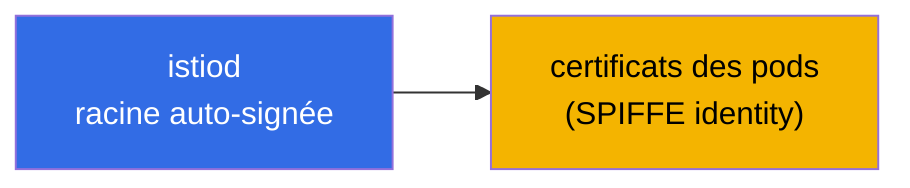
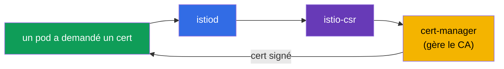
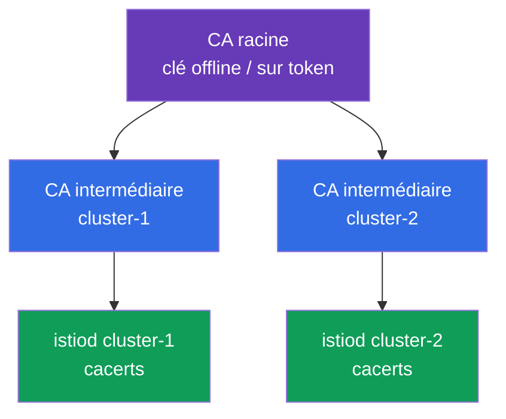
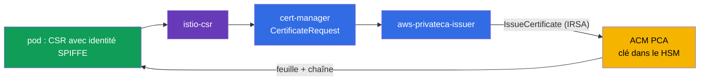
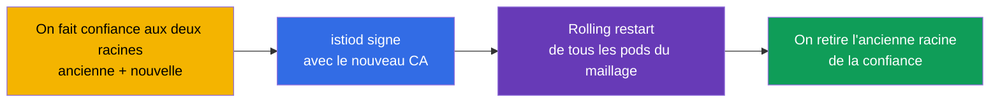

[RU version](ru.md) · [Eng version](en.md) · [Versión en español](es.md) · [Deutsche Version](de.md)

# Chapitre 16. Gestion des certificats : CA personnalisé, cert-manager et istio-csr

> **La suite.** Au chapitre 13, nous avons activé le mTLS et dit qu'istiod délivre et fait
> tourner lui-même les certificats - cela fonctionne d'emblée. Mais en production réelle,
> il faut souvent brancher sa propre PKI : un CA racine d'entreprise, un trust unique pour
> plusieurs clusters, une intégration avec des systèmes externes. Dans ce chapitre, nous
> verrons comment remplacer le CA par défaut par le sien - de façon statique et dynamique
> (via cert-manager).

## 16.1. Comment istiod délivre les certificats par défaut

Rappelons ce qui se passe sans aucune configuration. istiod fonctionne comme autorité de
certification (CA) : au démarrage, il génère un **certificat racine auto-signé** et signe
avec cette racine les certificats de toutes les charges de travail (pods) du maillage.



C'est pratique pour démarrer : rien à configurer, le mTLS fonctionne tout simplement. Mais
cette approche a des limites, qui font qu'en prod on passe souvent à son propre CA.

### Durées de vie des certificats et risque d'expiration de la racine

Il y a ici deux durées différentes, et il est important de ne pas les confondre.

- **Les certificats des pods (feuilles, SVID)** vivent très peu - par défaut **environ 24
  heures**. istiod les fait tourner automatiquement bien avant l'expiration (environ à la
  moitié de la durée). Il n'y a pas à y penser, la rotation est entièrement automatique.
- **Le certificat racine** d'un istiod auto-signé est par défaut émis pour **10 ans**. La
  durée est énorme, donc on l'oublie facilement - et c'est un piège.

Nuance clé : **le certificat racine par défaut n'est PAS renouvelé automatiquement.** Les
feuilles, oui, la racine, non. Autrement dit, au bout de 10 ans (ou plus tôt, si vous avez
défini un CA personnalisé avec une durée moindre), il expirera tout simplement, si l'on ne
s'en occupe pas à l'avance.

**Ce qui arrive si la racine expire.** C'est une catastrophe à l'échelle de tout le
maillage. Tous les certificats feuilles construisent une chaîne de confiance jusqu'à la
racine. Dès que la racine est expirée, la vérification mTLS cesse de passer **partout** :
les services cessent de se faire confiance, et le trafic entre eux tombe. La récupération
n'est pas « réémettre un certificat », mais en réalité un remplacement d'urgence de la
racine et une reconstruction de la confiance sur tout le maillage (essentiellement la même
procédure que la migration de CA de la section 16.7, mais déjà en mode incident).

**Best practices :**

- Fixez la date d'expiration de la racine et **faites-la tourner à l'avance**, pas le
  dernier jour. Istio a une procédure de rotation de la racine (via un trust bundle
  commun, comme lors de la migration).
- Configurez du **monitoring et des alertes** sur l'approche de la date d'expiration des
  certificats racine et intermédiaire.
- Si l'on confie le CA à **cert-manager** (section 16.4), la rotation peut être automatisée
  - c'est un argument de plus en faveur de l'approche dynamique pour une prod à longue durée
  de vie.
- Pour un `cacerts` personnalisé, vous fixez vous-même la durée - choisissez-la
  consciemment et planifiez tout de même la rotation.

## 16.2. Pourquoi un CA personnalisé est nécessaire

Raisons de remplacer la racine auto-signée par défaut :

- **Trust unique pour plusieurs clusters.** Si vous avez un maillage multicluster (chapitre
  28), les services de différents clusters doivent se faire confiance. Pour cela, leurs
  certificats doivent provenir d'une **racine commune**. Chaque cluster a son propre istiod
  auto-signé - il n'y aura pas de confiance commune.
- **Intégration avec la PKI d'entreprise.** L'entreprise a déjà son propre CA racine et ses
  politiques d'émission de certificats. Il est logique que les certificats du maillage
  s'intègrent dans cette hiérarchie.
- **Confiance externe et conformité.** Parfois, des systèmes externes doivent faire
  confiance aux certificats des services du maillage, et les exigences de sécurité - que la
  racine soit sous contrôle et correctement stockée (par exemple, dans un HSM).

Il y a deux façons de brancher son propre CA : statique (vous donnez à istiod des clés
prêtes) et dynamique (istiod délègue la signature à un système externe - cert-manager).

## 16.3. CA personnalisé statique

La façon la plus directe : vous générez vous-même le CA racine et intermédiaire, et istiod
signe les certificats des pods avec votre CA **intermédiaire** (la racine est conservée en
lieu sûr et n'est pas utilisée directement).


istiod cherche votre CA dans un secret spécial `cacerts` dans le namespace `istio-system`.
On y place quatre fichiers :

```bash
kubectl create secret generic cacerts -n istio-system \
  --from-file=ca-cert.pem \      # certificat du CA intermédiaire
  --from-file=ca-key.pem \       # sa clé privée (avec laquelle istiod signe)
  --from-file=root-cert.pem \    # certificat racine
  --from-file=cert-chain.pem     # chaîne : intermédiaire + racine
```

Après création du secret, il faut redémarrer istiod - au démarrage, il récupérera `cacerts`
et commencera à signer les certificats des pods avec votre CA intermédiaire au lieu de
l'auto-signé. Détail important : Istio attend justement une **chaîne** (`cert-chain.pem` =
intermédiaire + racine), pour que le destinataire puisse construire le chemin de confiance
jusqu'à la racine.

Inconvénient de cette méthode : la clé du CA est dans un Kubernetes Secret, et vous êtes
vous-même responsable de sa rotation et de son stockage sécurisé.

## 16.4. CA dynamique : cert-manager + istio-csr

La façon plus avancée et « production » - ne pas donner du tout à istiod la clé du CA, mais
déléguer la signature des certificats à un système externe. Deux composants aident ici :

- **cert-manager** - un opérateur populaire pour la gestion des certificats dans Kubernetes.
  Il sait travailler avec différentes sources de CA (propre, Vault, ACME, etc.).
- **istio-csr** - un pont entre Istio et cert-manager. istiod n'envoie pas lui-même les
  demandes de signature (CSR), mais via istio-csr, qui demande à cert-manager de signer le
  certificat.



Ce que cela apporte par rapport au CA statique :

- **La clé du CA n'est pas dans un secret Istio.** Elle est gérée par cert-manager, et on
  peut la stocker de façon plus sûre (par exemple, dans Vault ou un HSM), sans donner à
  istiod un accès direct.
- **Automatisation.** cert-manager prend en charge l'émission et la rotation, et son
  écosystème permet de brancher facilement des sources de CA d'entreprise.
- **Un système unique pour tous les certificats.** Avec ce même cert-manager, vous émettez
  probablement déjà les certificats TLS pour l'ingress (chapitre 9) - désormais, les
  certificats du maillage passent aussi par lui.

Inconvénient - plus de pièces mobiles : il faut installer et configurer cert-manager,
l'issuer et istio-csr. Pour de petites installations, c'est superflu ; pour une grande prod,
c'est justifié.

En pratique, il faut trois choses. Premièrement, un **issuer** cert-manager qui signera les
certificats du maillage. La variante la plus simple - un `Issuer` basé sur un secret avec
votre CA (en prod, c'est plus souvent Vault ou ACM PCA, voir ci-dessous) :

```yaml
apiVersion: cert-manager.io/v1
kind: Issuer
metadata:
  name: istio-ca
  namespace: istio-system
spec:
  ca:
    secretName: istio-ca-key-pair    # Secret avec ca.crt/tls.crt/tls.key de votre CA
```

Deuxièmement, **istio-csr** s'installe via Helm et se configure sur cet issuer - c'est lui
qui recevra les CSR d'istiod et demandera à cert-manager de les signer :

```bash
helm install cert-manager-istio-csr jetstack/cert-manager-istio-csr \
  -n cert-manager \
  --set "app.certmanager.issuer.name=istio-ca" \
  --set "app.certmanager.issuer.kind=Issuer" \
  --set "app.istio.namespace=istio-system"
```

Troisièmement, on bascule **istiod** vers l'émission des certificats via istio-csr (dans
l'IstioOperator, on l'indique comme adresse de CA et on désactive le propre CA d'istiod) :

```yaml
apiVersion: install.istio.io/v1alpha1
kind: IstioOperator
spec:
  values:
    global:
      caAddress: cert-manager-istio-csr.cert-manager.svc:443   # istiod envoie les CSR ici
```

Après cela, les certificats des pods sont signés par cert-manager via l'issuer `istio-ca`,
et non par istiod lui-même.

### AWS : PKI d'entreprise via AWS Private CA (ACM PCA)

Un pattern de production fréquent sur EKS : garder la racine non pas dans le cluster, mais
dans **AWS Private CA (ACM PCA)** - une autorité de certification gérée d'AWS, où la clé du
CA est stockée et protégée côté AWS (jusqu'à FIPS/HSM). cert-manager s'y connecte via un
issuer séparé
[aws-privateca-issuer](https://github.com/cert-manager/aws-privateca-issuer) :

```yaml
apiVersion: awspca.cert-manager.io/v1beta1
kind: AWSPCAClusterIssuer
metadata:
  name: acm-pca
spec:
  arn: arn:aws:acm-pca:eu-central-1:123456789012:certificate-authority/xxxxxxxx
  region: eu-central-1
```

Ensuite, on configure istio-csr sur cet issuer (`kind: AWSPCAClusterIssuer`,
`group: awspca.cert-manager.io`). Bilan : la racine et la clé du CA vivent dans ACM PCA (pas
dans le cluster), cert-manager lui demande la signature, et les pods du maillage reçoivent
des certificats issus de votre hiérarchie AWS d'entreprise. L'accès d'istio-csr à ACM PCA
est accordé via IAM (IRSA - un rôle sur le ServiceAccount).

À propos du coût : ACM PCA est facturé mensuellement **pour l'existence même du CA** plus des
frais pour chaque certificat émis. Il y a deux modes : general-purpose (**~400 $/mois par
CA**) et **short-lived mode pour les certificats à courte durée de vie (~50 $/mois par CA)**.
Les certificats de travail du maillage sont à courte durée de vie et font souvent l'objet
d'une rotation, c'est pourquoi pour Istio on prend justement le **short-lived mode** ; prévoyez
tout de même des dépenses per-certificate pour la rotation massive. Les prix dépendent de la
région et changent - référez-vous au calculateur AWS. Pour les labs et la formation, ACM PCA
est un peu cher (facturé tant que le CA existe) - là, un istiod self-signed ou `cacerts` est
moins cher.

### Exemple pour une petite organisation : 2 clusters, racine commune

Situation typique : deux clusters avec Istio, on a besoin d'un trust commun (multicluster,
chapitre 28), mais pas de budget pour une PKI coûteuse. Les extrêmes ne conviennent pas :
générer des certificats « à la va-vite » à chaque fois n'est pas sûr, un CA complet
(Vault/HSM) est cher et laborieux, ACM PCA est payant pour chaque CA. Un bon juste milieu -
**racine offline + CA intermédiaire par cluster**.

L'idée : ce qui n'est pas sûr, ce n'est pas que la clé soit créée via la CLI, mais que la
**clé racine soit dans le cluster**. Donc, on génère la racine **une seule fois offline**
(sur une machine sécurisée ; on chiffre la clé ou on la garde sur un token matériel), elle
**n'entre pas** dans les clusters. On signe avec elle deux CA intermédiaires, et on place
dans chaque cluster uniquement son intermédiaire comme `cacerts` (16.3).



Le plus simple pour générer la hiérarchie est d'utiliser les scripts prêts d'Istio
(`samples/certs`, il y a un Makefile) - on crée une racine et un intermédiaire par cluster :

```bash
# une seule fois, sur une machine offline sécurisée
make -f Makefile.selfsigned.mk root-ca                 # CA racine (on garde la clé offline !)
make -f Makefile.selfsigned.mk cluster-1-cacerts        # intermédiaire pour cluster-1
make -f Makefile.selfsigned.mk cluster-2-cacerts        # intermédiaire pour cluster-2
```

Ensuite, dans **chaque** cluster, on crée `cacerts` à partir de son jeu intermédiaire (la
clé racine `root-key.pem` reste alors offline, on ne la met pas dans le secret) :

```bash
# dans cluster-1
kubectl create secret generic cacerts -n istio-system \
  --from-file=cluster-1/ca-cert.pem \
  --from-file=cluster-1/ca-key.pem \
  --from-file=cluster-1/root-cert.pem \
  --from-file=cluster-1/cert-chain.pem
# dans cluster-2 - la même chose depuis le répertoire cluster-2/
```

Comme les deux intermédiaires sont signés par une **racine commune**, les services de
différents clusters se font confiance - la base d'un maillage multicluster. Le coût -
**0 $**, la clé racine n'est pas stockée dans les clusters, et la rotation se fait au niveau
des intermédiaires (la réémission de la racine est une opération rare).

Quand faut-il passer à ACM PCA : si le stockage manuel de la racine offline et sa réémission
sont trop fragiles pour vous, prenez **un seul ACM PCA commun (short-lived mode, ~50 $/mois)**
et branchez-y `aws-privateca-issuer` + istio-csr dans les **deux** clusters - vous obtiendrez
la même racine commune, mais avec la clé dans le HSM d'AWS et de l'automatisation, sans le
tracas de l'offline.

#### Comment cela fonctionne en détail (2 clusters sur un ACM PCA commun)

**Ce qui est créé une seule fois dans AWS.** Dans ACM PCA, on monte un CA (par économie - un
seul commun ; si on le souhaite, Root + Subordinate, mais cela fait déjà deux CA). Sa clé
privée vit **à l'intérieur d'ACM PCA dans le HSM d'AWS** et n'est jamais délivrée vers
l'extérieur ; le certificat de ce CA deviendra la racine de confiance commune pour les deux
clusters. Le CA vit dans un seul compte/région - si les clusters sont dans des comptes
différents, on partage le CA via **AWS RAM** ou une politique de ressource.

**Ce qui est installé dans chaque cluster** (à l'identique, mais avec une référence au même
CA) :

- **cert-manager** - l'opérateur de certificats ;
- **aws-privateca-issuer** - le plugin qui va dans ACM PCA ; il contient un
  `AWSPCAClusterIssuer` avec le **même ARN** de CA dans les deux clusters - c'est cela, la
  « racine commune » ;
- **istio-csr** - reçoit les CSR d'Istio et les formalise comme des demandes cert-manager
  vers cet issuer ;
- **istiod** est basculé sur istio-csr (`global.caAddress`), n'utilise pas son propre CA ;
- **IRSA** - le ServiceAccount d'aws-privateca-issuer reçoit un rôle IAM avec les droits
  `acm-pca:IssueCertificate`/`GetCertificate` sur cet ARN (accès sans clés dans le cluster).

**Flux d'émission d'un certificat pour un pod :**



1. Le pod démarre, istio-agent génère une paire de clés et un CSR avec son identité SPIFFE ;
   la clé privée du pod ne quitte pas le pod.
2. istio-agent envoie le CSR à **istio-csr** (c'est lui désormais l'endpoint CA au lieu
   d'istiod).
3. istio-csr crée un `CertificateRequest` dans cert-manager.
4. cert-manager remet la demande à **aws-privateca-issuer**, qui, via IRSA, appelle ACM PCA
   `IssueCertificate`.
5. ACM PCA signe la feuille avec sa clé (dans le HSM) et renvoie le certificat + la chaîne.
6. Retour : ACM PCA → aws-privateca-issuer → cert-manager → istio-csr → istio-agent → Envoy
   (par SDS). Le pod a une feuille se chaînant jusqu'à la racine ACM PCA.
7. **Rotation** : la feuille est à courte durée de vie, istio-agent la redemande avant
   l'expiration par le même flux. Chaque émission est facturée par ACM PCA - d'où
   l'importance du short-lived mode et de la prise en compte du volume.

**Pourquoi les clusters se font confiance.** Les deux istio-csr regardent **le même** CA,
donc tous les certificats feuilles des deux clusters se chaînent à une racine unique. La
racine est distribuée dans chaque cluster comme trust bundle (`istio-ca-root-cert`, 16.5).
Lors du handshake mTLS, un pod de cluster-1 et un pod de cluster-2 vérifient les certificats
contre la racine commune - la vérification passe. C'est cela, la base d'un maillage
multicluster.

**Ce que cela apporte face à une racine offline :** la clé racine est dans le HSM d'AWS (pas
sur un token ni dans un Secret), l'émission et la rotation sont automatiques, une racine
commune pour N clusters - c'est simplement le même ARN d'issuer. Inconvénients - payant (CA +
per-certificate) et dépendance à AWS. La réémission du CA lui-même reste gérée dans ACM PCA,
et le changement de racine sur le maillage - via le trust bundle (16.7).

##### Nuance importante de coût : n'émettez pas chaque feuille depuis ACM PCA

ACM PCA facture **chaque certificat émis**, et Istio fait tourner les certificats feuilles
souvent (une feuille vit ~24 h et se renouvelle environ à la moitié de la durée - environ 2
fois par jour et par pod). Avec un grand nombre de pods, le schéma « istio-csr → ACM PCA pour
chaque feuille » fait exploser la facture. Estimation en short-lived mode (~0,058 $ par
certificat) : 1000 pods × ~2 émissions/jour × 30 ≈ **60 000 émissions/mois ≈ ~3,5 k$**, et
c'est seulement pour les feuilles. Il y a deux modes avec une énorme différence en argent :

- **Variante 1 - ACM PCA signe chaque feuille** (istio-csr → ACM PCA, comme dans le flux
  ci-dessus). La clé du CA est entièrement dans le HSM, mais vous payez pour **chaque**
  certificat de workload → cher à l'échelle. Justifié seulement avec un petit nombre de pods.
- **Variante 2 - ACM PCA ne donne qu'un CA intermédiaire, les feuilles sont signées par
  istiod lui-même** (bon marché). ACM PCA (racine, dans le HSM) émet un certificat de CA
  **intermédiaire** pour le cluster ; l'intermédiaire est placé dans `cacerts` (16.3), et
  ensuite istiod signe localement les feuilles fréquentes à courte durée de vie, **sans
  s'adresser à ACM PCA**. ACM PCA ne facture que l'émission/réémission de l'intermédiaire
  (rarement) → en fait 50 $ par CA plus des broutilles.

Compromis de la variante 2 : la clé privée du CA **intermédiaire** se retrouve dans le
cluster (dans `cacerts`), et seule la **racine** reste dans le HSM. Pour un grand maillage,
on prend presque toujours justement la variante 2 (istiod signe les feuilles, ACM PCA -
seulement la racine/l'intermédiaire). Un levier supplémentaire - **augmenter le TTL de la
feuille** (rotation moins fréquente - moins d'émissions), mais cela affaiblit la sécurité,
donc le procédé principal reste « istiod signe les feuilles lui-même ».

## 16.5. Vérification des certificats

Dans les deux cas, il est utile de s'assurer que les pods reçoivent bien les certificats du
bon CA. Cela se fait via `istioctl proxy-config secret` - il montre les certificats d'un pod
précis. Ensuite, on peut les parser avec openssl et regarder l'émetteur :

```bash
POD=$(kubectl get pod -n app -l app=ping-pong -o jsonpath='{.items[0].metadata.name}')

istioctl proxy-config secret "$POD" -n app -o json \
  | jq -r '.dynamicActiveSecrets[] | select(.name=="default") | .secret.tlsCertificate.certificateChain.inlineBytes' \
  | base64 -d | openssl x509 -noout -issuer
```

Dans la sortie `issuer`, vous verrez votre CA (par exemple, `O=CKS-Lab, CN=CKS-Lab
Intermediate CA` pour le statique ou `O=cert-manager` pour le dynamique). Vous confirmez
ainsi que le CA personnalisé s'est réellement appliqué, et qu'il ne reste pas l'istiod par
défaut. On peut aussi vérifier l'identity SPIFFE dans le champ Subject Alternative Name - on
y trouvera le familier `spiffe://.../ns/.../sa/...`.

Le certificat racine auquel les proxys font confiance, Istio le distribue dans le ConfigMap
`istio-ca-root-cert` (il est présent dans chaque namespace). Pour voir rapidement la racine
de confiance actuelle :

```bash
kubectl get configmap istio-ca-root-cert -n app \
  -o jsonpath='{.data.root-cert\.pem}' | openssl x509 -noout -issuer -enddate
```

C'est pratique lors de la migration de CA (16.7) : ce ConfigMap montre si le maillage fait
déjà confiance à la nouvelle racine, et quand expire l'actuelle.

## 16.6. Quelle approche choisir

Résumons le tout dans un tableau de décision pratique.

| Situation | Recommandation |
|----------|--------------|
| Formation, démo, un cluster | CA istiod par défaut - on ne configure rien |
| Prod, un cluster, pas d'exigences PKI | le défaut fonctionne, mais pensez tout de suite à l'avenir (voir ci-dessous) |
| Multicluster prévu | obligatoirement un CA personnalisé commun dès le début |
| PKI d'entreprise ou conformité | CA personnalisé (statique ou dynamique) |
| Petite équipe, configuration ponctuelle | CA statique (`cacerts`) |
| Besoin d'automatisation, ne pas stocker la clé du CA dans Istio | dynamique : cert-manager + istio-csr |

La principale ligne de partage - **aurez-vous du multicluster ou des exigences de PKI**. Si
oui, un CA personnalisé est obligatoire. Et là surgit une question importante : le configurer
tout de suite ou peut-on migrer plus tard ? Voyons cela, car « plus tard » revient cher.

## 16.7. Migration du CA par défaut vers sa propre PKI

Imaginez : le maillage fonctionne déjà en prod sur la racine auto-signée d'istiod, et il
faut maintenant passer à un CA d'entreprise. Le problème est qu'on change la **racine de
confiance**, alors que les certificats de tous les pods en cours de fonctionnement en
dépendent.

La voie naïve « simplement glisser un nouveau `cacerts` et redémarrer istiod » est
dangereuse : les pods avec d'anciens certificats (signés par l'ancienne racine) et les pods
avec de nouveaux cesseront de se faire confiance, et le trafic mTLS entre eux tombera. C'est
la voie directe vers un downtime de tout le maillage.

Une migration correcte se fait via un **trust bundle commun** - une période où le maillage
fait confiance simultanément à l'ancienne et à la nouvelle racine :



Logique par étapes :

1. On ajoute la nouvelle racine au trust bundle - désormais, tous les proxys font confiance
   aux certificats signés par l'ancienne et par la nouvelle racine. Personne ne perd rien pour
   l'instant.
2. On bascule istiod sur la signature avec le nouveau CA (intermédiaire).
3. On redémarre progressivement les pods - à leur recréation, ils reçoivent des certificats
   du nouveau CA. Pendant ce temps, anciens et nouveaux certificats coexistent dans le
   maillage, mais la confiance existe pour les deux.
4. Quand **tous** les pods ont reçu de nouveaux certificats, on retire l'ancienne racine de la
   confiance.

### Risques de la migration

- **Downtime en cas d'erreur.** Si l'on saute la phase du trust bundle commun, une partie du
  trafic cassera - anciens et nouveaux certificats ne se feront pas confiance.
- **Rolling restart de tout le maillage.** Il faut recréer tous les pods dans tous les
  namespaces. Pour un grand cluster, c'est une opération importante et risquée, et certaines
  charges (stateful) sont pénibles à redémarrer.
- **Erreurs dans la chaîne de certificats.** Un mauvais ordre dans `cert-chain.pem` ou des
  racines non concordantes cassent la confiance entièrement.
- **Le multicluster complique tout.** Il faut synchroniser la migration entre les clusters,
  sinon le trafic cross-cluster tombera.
- **Redémarrage d'istiod et fenêtre d'instabilité.** Pendant la migration, le control plane
  et l'émission des certificats sont sous vigilance accrue.

### Best practices pour les organisations

D'où le conseil principal : **il est moins cher de consacrer du temps à configurer la PKI
tout de suite que de migrer un maillage vivant ensuite.**

- **Décidez du CA le premier jour.** Sur un cluster vide, brancher un CA personnalisé - c'est
  quelques commandes et aucun risque. Sur un maillage vivant avec des centaines de services -
  c'est un trust-bundle, un rolling restart complet et une fenêtre de risque.
- **La moindre probabilité de multicluster ou d'exigences PKI - installez un CA personnalisé
  tout de suite.** C'est une assurance bon marché. Le multicluster est de toute façon
  impossible à « rajouter après coup » sans racine commune.
- **Automatisez dès le début.** Si l'organisation a des exigences PKI, installez cert-manager
  + istio-csr tout de suite - vous n'aurez pas ensuite à passer d'un `cacerts` manuel.
- **Stockez le CA racine en sécurité** (offline ou HSM), et n'utilisez dans le maillage que
  l'intermédiaire.
- **Si la migration est tout de même inévitable** - répétez-la impérativement en staging,
  faites-la via un trust bundle et planifiez une fenêtre pour le rolling restart.

Règle courte : le CA et le trust sont ce qu'on pose dans les fondations. Refaire les
fondations sous un bâtiment en fonctionnement est toujours plus cher et plus risqué que de
poser les bonnes tout de suite.

## 16.8. SPIRE comme source d'identity alternative

Pour être complet : la signature des certificats peut être déléguée non seulement à
cert-manager, mais aussi à **SPIRE** - l'implémentation de référence du standard SPIFFE
(chapitre 13). Istio sait s'intégrer avec SPIRE via SDS, et alors ce sont SPIRE, et non
istiod, qui délivre l'identity et les certificats des pods. On le prend quand on a besoin
d'une **attestation des charges** plus stricte (SPIRE vérifie qu'un pod est réellement celui
qu'il prétend être, d'après les attributs du nœud/processus), d'un trust SPIFFE unique
au-delà de Kubernetes (VM, autres plateformes) ou qu'on a déjà SPIRE dans l'infrastructure.
Pour la plupart des installations, c'est superflu - istiod ou cert-manager suffisent - mais
il est utile de connaître cette option.

## 16.9. Best practices

- **Décidez du CA le premier jour.** Un CA personnalisé sur un cluster vide - quelques
  commandes ; sur un maillage vivant - trust bundle + rolling restart complet + fenêtre de
  risque (16.7).
- **Planifiez la rotation de la racine et surveillez la durée.** La racine ne tourne pas
  toute seule ; posez une alerte sur l'approche de l'`enddate` des certificats racine et
  intermédiaire (vérification - via `istio-ca-root-cert`, 16.5).
- **La racine - offline ou dans un HSM/ACM PCA**, et n'utilisez dans le maillage que le CA
  intermédiaire. Ainsi, une compromission du cluster ne révèle pas la clé racine.
- **Automatisez l'émission.** Pour une prod à longue durée de vie - cert-manager + istio-csr
  (ou ACM PCA sur EKS) : la clé du CA n'est pas dans Istio, la rotation est automatique.
- **Une seule racine commune pour le multicluster** (chapitre 28) - posez-la tout de suite,
  on ne peut pas « rajouter après coup » un trust commun sans migration.
- **Gardez la chaîne correcte.** `cert-chain.pem` = intermédiaire + racine, dans le bon
  ordre ; une erreur dans la chaîne casse la confiance entièrement.
- **Répétez la migration en staging.** Si le passage à votre propre CA est tout de même
  inévitable - uniquement via un trust bundle commun et avec une fenêtre planifiée pour le
  rolling restart.

## 16.10. Résumé du chapitre

- Par défaut, istiod génère lui-même une racine auto-signée et signe avec elle les
  certificats des pods ; fonctionne d'emblée, mais avec des limites.
- Les certificats feuilles des pods vivent ~24 heures et tournent automatiquement ; la racine
  est par défaut émise pour 10 ans et **ne tourne pas automatiquement**. Si la racine expire -
  le mTLS tombe sur tout le maillage ; la rotation de la racine doit être planifiée à l'avance
  (ou confiée à cert-manager) et sa durée surveillée.
- Un CA personnalisé est nécessaire pour un trust unique entre clusters, l'intégration avec
  la PKI d'entreprise et les exigences de sécurité/conformité.
- **CA statique :** vous placez la racine, le CA intermédiaire et la chaîne dans le secret
  `cacerts` dans `istio-system` ; istiod signe les certificats des pods avec votre CA
  intermédiaire.
- Istio attend justement une chaîne (`cert-chain.pem` = intermédiaire + racine).
- **CA dynamique (cert-manager + istio-csr) :** istiod délègue la signature via istio-csr à
  cert-manager ; la clé du CA n'est pas stockée dans Istio, tout est automatisé.
- Pour vérifier par quel CA les certificats sont signés, `istioctl proxy-config secret` +
  openssl aident ; la racine de confiance du maillage est dans le ConfigMap
  `istio-ca-root-cert` (dans chaque namespace).
- Sur EKS, il est commode de construire la PKI d'entreprise sur **AWS Private CA (ACM PCA)**
  via cert-manager (`aws-privateca-issuer`) + istio-csr - la clé du CA reste dans AWS, pas
  dans le cluster. ACM PCA est payant : general-purpose ~400 $/mois par CA, short-lived mode
  ~50 $/mois (pour le maillage on prend short-lived) + des frais d'émission.
- Variante économique pour une petite organisation avec 2 clusters - **racine offline +
  intermédiaire par cluster** (`cacerts`) : 0 $, la clé racine hors des clusters, la racine
  commune donne un trust multicluster.
- ACM PCA facture **chaque** émission, et les feuilles d'Istio tournent souvent : n'émettez pas
  chaque feuille depuis ACM PCA. Économique - quand ACM PCA ne donne que le CA **intermédiaire**
  (dans `cacerts`), et que les feuilles sont signées par **istiod lui-même** ; une émission
  per-leaf depuis ACM PCA est chère à l'échelle.
- La signature des certificats peut aussi être déléguée à **SPIRE** (attestation stricte des
  charges, trust au-delà de Kubernetes) - une option pour les scénarios complexes.
- La migration du CA par défaut vers le sien se fait via un trust bundle commun (on fait
  confiance aux deux racines), un rolling restart complet et la suppression ensuite de
  l'ancienne racine ; le risque de downtime est élevé.
- Best practice : poser un CA personnalisé tout de suite (surtout en cas de multicluster
  possible ou d'exigences PKI) - c'est moins cher et plus sûr que de migrer un maillage vivant.

## 16.11. Questions d'auto-évaluation

1. Comment istiod délivre-t-il les certificats par défaut et quelle est la limite de cette
   approche ?
2. Citez les raisons de brancher un CA personnalisé.
3. Que place-t-on dans le secret `cacerts` et avec quel certificat istiod signe-t-il les
   pods ?
4. Pourquoi Istio exige-t-il justement une chaîne (`cert-chain.pem`) ?
5. En quoi le CA dynamique (cert-manager + istio-csr) est-il meilleur que le statique et quel
   est son inconvénient ?
6. Comment vérifier par quel CA est signé le certificat d'un pod précis ?
7. Pourquoi ne peut-on pas simplement glisser un nouveau `cacerts` et redémarrer istiod sur un
   maillage vivant ? À quoi ressemble une migration sûre ?
8. Pourquoi vaut-il mieux poser un CA personnalisé tout de suite plutôt que de migrer ensuite ?
9. Pour quelle durée le certificat racine est-il émis par défaut, tourne-t-il tout seul et que
   se passe-t-il à son expiration ?
10. Quelles trois choses faut-il configurer pour un CA dynamique (cert-manager + istio-csr) et
    comment istiod sait-il où envoyer les CSR ?
11. Comment construire sur EKS une PKI d'entreprise sans stocker la clé du CA dans le cluster ?
12. Où voir la racine de confiance actuelle du maillage et pourquoi est-ce utile lors de la
    migration de CA ?
13. Combien coûte ACM PCA et quel mode choisit-on pour Istio ? Pourquoi ?
14. Comment une petite organisation peut-elle donner un trust commun à deux clusters sans PKI
    coûteuse et sans stocker la clé racine dans le cluster ?
15. Pourquoi émettre chaque certificat feuille depuis ACM PCA est-il cher et comment réduire
    le coût (qu'est-ce qui signe alors les feuilles et où se retrouve la clé du CA
    intermédiaire) ?

## Pratique

Entraînez-vous au branchement d'un CA personnalisé statique (racine + intermédiaire) dans
istiod :

🧪 Lab 19 : [tasks/ica/labs/19](../../labs/19/README_FR.MD)

Entraînez-vous à l'émission dynamique de certificats via cert-manager et istio-csr :

🧪 Lab 26 : [tasks/ica/labs/26](../../labs/26/README_FR.MD)

---
[Table des matières](../README_FR.md) · [Chapitre 15](../15/fr.md) · [Chapitre 17](../17/fr.md)
