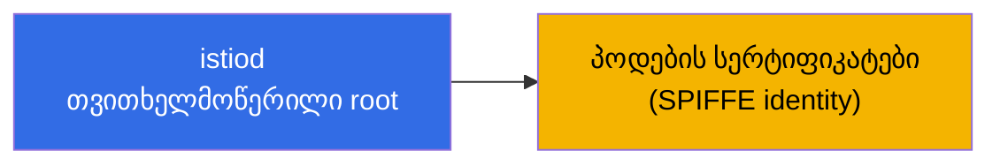
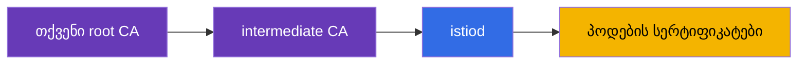
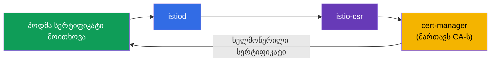
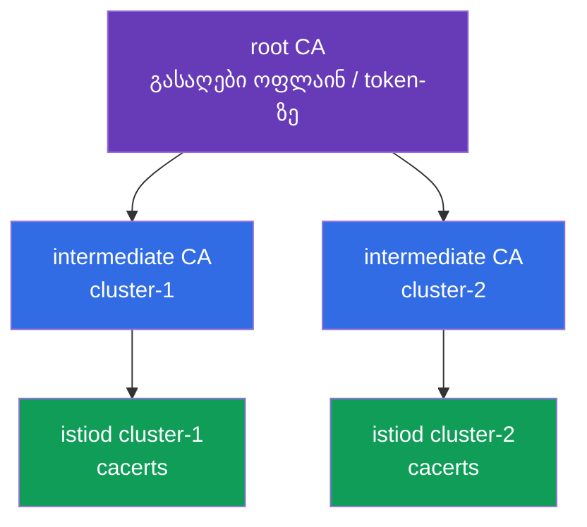
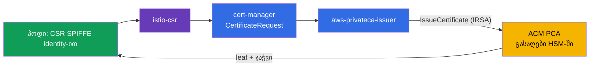
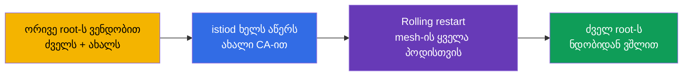

[Русская версия](ru.md) · [Eng version](en.md) · [Versión en español](es.md) · [Version française](fr.md) · [Deutsche Version](de.md) · [繁體中文版](tw.md) · [日本語版](jp.md)

# თავი 16. სერტიფიკატების მართვა: მორგებული CA, cert-manager და istio-csr

> **რა არის შემდეგ.** მე-13 თავში ჩავრთეთ mTLS და ვთქვით, რომ istiod თავად გასცემს და
> როტაციას უკეთებს სერტიფიკატებს - ეს პირდაპირ მზა სახით მუშაობს. თუმცა რეალურ production-ში ხშირად საჭიროა
> საკუთარი PKI-ის მიერთება: კორპორაციული root CA, ერთიანი trust რამდენიმე კლასტერისთვის,
> გარე სისტემებთან ინტეგრაცია. ამ თავში განვიხილავთ, როგორ შევცვალოთ ნაგულისხმევი CA
> საკუთარით - სტატიკურად და დინამიკურად (cert-manager-ის მეშვეობით).

## 16.1. როგორ გასცემს istiod სერტიფიკატებს ნაგულისხმევად

გავიხსენოთ, რა ხდება ყოველგვარი კონფიგურაციის გარეშე. istiod მუშაობს როგორც სერტიფიკაციის ცენტრი
(CA): გაშვებისას ის ქმნის **თვითხელმოწერილ root სერტიფიკატს** და ამ root-ით
ხელს აწერს mesh-ში ყველა workload-ის (პოდის) სერტიფიკატს.



ეს მოსახერხებელია დასაწყებად: არაფრის კონფიგურაცია არ არის საჭირო, mTLS უბრალოდ მუშაობს. თუმცა ამ
მიდგომას აქვს შეზღუდვები, რომელთა გამოც production-ში ხშირად საკუთარ CA-ზე გადადიან.

### სერტიფიკატების მოქმედების ვადები და root-ის ვადის გასვლის რისკი

აქ ორი განსხვავებული ვადაა და მნიშვნელოვანია, ისინი ერთმანეთში არ აგვერიოს.

- **პოდების სერტიფიკატები (leaf, SVID)** ძალიან მოკლე ხანს მოქმედებს - ნაგულისხმევად **დაახლოებით 24
  საათი**. istiod ავტომატურად უკეთებს მათ როტაციას ვადის გასვლამდე დიდი ხნით ადრე (დაახლოებით ვადის
  ნახევარზე). მათზე ფიქრი საჭირო არ არის, როტაცია სრულად ავტომატურია.
- თვითხელმოწერილი istiod-ის **root სერტიფიკატი** ნაგულისხმევად გაიცემა **10
  წლით**. ვადა უზარმაზარია, ამიტომ მისი დავიწყება ადვილია - და სწორედ ეს არის ხაფანგი.

მთავარი ნიუანსი: **root სერტიფიკატს ნაგულისხმევად ავტომატური როტაცია არ უტარდება.**
Leaf სერტიფიკატებს - კი, root-ს - არა. ეს ნიშნავს, რომ 10 წლის შემდეგ (ან უფრო ადრე, თუ მორგებულ
CA-ს ნაკლები ვადა მიუთითეთ) მისი მოქმედება უბრალოდ დასრულდება, თუ წინასწარ არ იზრუნებთ.

**რა მოხდება, თუ root-ის ვადა გავა.** ეს მთელი mesh-ის მასშტაბის კატასტროფაა. ყველა leaf
სერტიფიკატი ნდობის ჯაჭვს root-მდე აგებს. როგორც კი root ვადაგასულია, mTLS-ის
შემოწმება **ყველგან** წყდება: სერვისები ერთმანეთს აღარ ენდობიან და მათ შორის ტრაფიკი
ჩერდება. აღდგენა არ ნიშნავს „ერთი სერტიფიკატის ხელახლა გაცემას“ - ფაქტობრივად,
საჭიროა root-ის ავარიული შეცვლა და მთელ mesh-ში ნდობის ხელახლა შექმნა (არსებითად იგივე
პროცედურა, რაც CA-ის მიგრაცია 16.7 განყოფილებაში, ოღონდ უკვე ინციდენტის რეჟიმში).

**საუკეთესო პრაქტიკები:**

- ჩაინიშნეთ root-ის ვადის გასვლის თარიღი და **წინასწარ ჩაუტარეთ როტაცია**, არა ბოლო დღეს.
  Istio-ს აქვს root-ის როტაციის პროცედურა (საერთო trust bundle-ის მეშვეობით, როგორც მიგრაციისას).
- დააყენეთ **მონიტორინგი და ალერტები** root და intermediate სერტიფიკატების ვადის
  მოახლოებაზე.
- თუ CA-ს **cert-manager**-ს ანდობთ (განყოფილება 16.4), როტაციის ავტომატიზაცია შესაძლებელია - ეს
  კიდევ ერთი არგუმენტია ხანგრძლივად მოქმედ production-ში დინამიკური მიდგომის სასარგებლოდ.
- მორგებული `cacerts`-ისთვის ვადას თავად ადგენთ - გააზრებულად შეარჩიეთ ის და მაინც
  დაგეგმეთ როტაცია.

## 16.2. რატომ არის საჭირო მორგებული CA

ნაგულისხმევი თვითხელმოწერილი root-ის შეცვლის მიზეზები:

- **ერთიანი trust რამდენიმე კლასტერისთვის.** თუ გაქვთ მულტიკლასტერული mesh (თავი
  28), სხვადასხვა კლასტერის სერვისები ერთმანეთს უნდა ენდობოდნენ. ამისათვის მათი სერტიფიკატები
  **საერთო root-იდან** უნდა მოდიოდეს. თითოეულ კლასტერს თავისი თვითხელმოწერილი istiod აქვს -
  საერთო ნდობა არ იქნება.
- **კორპორაციულ PKI-სთან ინტეგრაცია.** კომპანიას უკვე აქვს საკუთარი root CA და
  სერტიფიკატების გაცემის პოლიტიკები. ლოგიკურია, mesh-ის სერტიფიკატები ამ იერარქიაში
  ჩაჯდეს.
- **გარე ნდობა და compliance.** ზოგჯერ გარე სისტემები mesh-ის სერვისების სერტიფიკატებს
  უნდა ენდობოდნენ, უსაფრთხოების მოთხოვნა კი არის, რომ root კონტროლქვეშ იყოს და სწორად
  ინახებოდეს (მაგალითად, HSM-ში).

საკუთარი CA-ის მისაერთებლად ორი გზა არსებობს: სტატიკური (istiod-ს მზა გასაღებებს აძლევთ) და
დინამიკური (istiod ხელმოწერას გარე სისტემას - cert-manager-ს - გადასცემს).

## 16.3. სტატიკური მორგებული CA

ყველაზე პირდაპირი გზა: თავად ქმნით root და intermediate CA-ს, ხოლო istiod
პოდების სერტიფიკატებს თქვენი **intermediate** CA-ით აწერს ხელს (root უსაფრთხო
ადგილას ინახება და პირდაპირ არ გამოიყენება).



istiod თქვენს CA-ს ეძებს სპეციალურ `cacerts` Secret-ში, namespace `istio-system`-ში. მასში
ოთხ ფაილს ათავსებენ:

```bash
kubectl create secret generic cacerts -n istio-system \
  --from-file=ca-cert.pem \      # შუალედური CA სერტიფიკატი
  --from-file=ca-key.pem \       # მისი პრივატული გასაღები (ამით ხელს აწერს istiod)
  --from-file=root-cert.pem \    # ძირეული სერტიფიკატი
  --from-file=cert-chain.pem     # ჯაჭვი: შუალედური + ძირეული
```

Secret-ის შექმნის შემდეგ istiod უნდა გადაიტვირთოს - გაშვებისას ის აიღებს `cacerts`-ს და
პოდების სერტიფიკატებს თვითხელმოწერილის ნაცვლად თქვენი intermediate CA-ით მოაწერს ხელს.
მნიშვნელოვანი დეტალი: Istio სწორედ **ჯაჭვს** ელოდება (`cert-chain.pem` = intermediate +
root), რათა მიმღებმა root-მდე ნდობის გზის აგება შეძლოს.

ამ მეთოდის ნაკლი: CA-ის გასაღები Kubernetes Secret-ში ინახება და მის როტაციასა და
უსაფრთხო შენახვაზე თავად აგებთ პასუხს.

## 16.4. დინამიკური CA: cert-manager + istio-csr

უფრო განვითარებული და „production“ გზა არის, საერთოდ არ მივცეთ istiod-ს CA-ის გასაღები და
სერტიფიკატების ხელმოწერა გარე სისტემას გადავცეთ. აქ ორი კომპონენტი გვეხმარება:

- **cert-manager** - Kubernetes-ში სერტიფიკატების მართვის პოპულარული ოპერატორი. მას
  შეუძლია CA-ის სხვადასხვა წყაროსთან მუშაობა (საკუთარი, Vault, ACME და ა.შ.).
- **istio-csr** - ხიდი Istio-სა და cert-manager-ს შორის. istiod ხელმოწერის მოთხოვნებს
  (CSR) თავად კი არ ამუშავებს, არამედ istio-csr-ის მეშვეობით აგზავნის, რომელიც cert-manager-ს
  სერტიფიკატის ხელმოწერას სთხოვს.



რას გვაძლევს ეს სტატიკურ CA-სთან შედარებით:

- **CA-ის გასაღები Istio-ს Secret-ში არ ინახება.** მას cert-manager მართავს და მისი უფრო
  საიმედოდ შენახვაა შესაძლებელი (მაგალითად, Vault-ში ან HSM-ში), istiod-ისთვის პირდაპირი წვდომის
  მიცემის გარეშე.
- **ავტომატიზაცია.** cert-manager საკუთარ თავზე იღებს გაცემასა და როტაციას, ხოლო მისი ეკოსისტემა
  კორპორაციული CA წყაროების მარტივად მიერთების საშუალებას იძლევა.
- **ერთიანი სისტემა ყველა სერტიფიკატისთვის.** დიდი ალბათობით, იმავე cert-manager-ით უკვე
  გასცემთ TLS სერტიფიკატებს ingress-ისთვის (თავი 9) - ახლა mesh-ის სერტიფიკატებიც
  მისი გავლით გაიცემა.

ნაკლი - მეტი მოძრავი ნაწილი: საჭიროა cert-manager-ის, issuer-ისა და istio-csr-ის
დაყენება და კონფიგურაცია. მცირე ინსტალაციებისთვის ეს ზედმეტია, დიდი production-ისთვის - გამართლებული.

პრაქტიკაში სამი რამ არის საჭირო. პირველი, cert-manager-ის **issuer**, რომელიც mesh-ის
სერტიფიკატებს მოაწერს ხელს. უმარტივესი ვარიანტია `Issuer`, რომელიც თქვენს CA-ს შემცველ Secret-ს
ეყრდნობა (production-ში ეს უფრო ხშირად Vault ან ACM PCA არის, იხ. ქვემოთ):

```yaml
apiVersion: cert-manager.io/v1
kind: Issuer
metadata:
  name: istio-ca
  namespace: istio-system
spec:
  ca:
    secretName: istio-ca-key-pair    # Secret თქვენი CA-ს ca.crt/tls.crt/tls.key-ით
```

მეორე, **istio-csr** Helm-ის მეშვეობით ყენდება და ამ issuer-ზე კონფიგურირდება - სწორედ ის
მიიღებს CSR-ებს istiod-ისგან და cert-manager-ს მათ ხელმოწერას სთხოვს:

```bash
helm install cert-manager-istio-csr jetstack/cert-manager-istio-csr \
  -n cert-manager \
  --set "app.certmanager.issuer.name=istio-ca" \
  --set "app.certmanager.issuer.kind=Issuer" \
  --set "app.istio.namespace=istio-system"
```

მესამე, **istiod** გადაჰყავთ სერტიფიკატების istio-csr-ის მეშვეობით გაცემაზე (IstioOperator-ში
მას CA-ის მისამართად უთითებენ და istiod-ის საკუთარ CA-ს თიშავენ):

```yaml
apiVersion: install.istio.io/v1alpha1
kind: IstioOperator
spec:
  values:
    global:
      caAddress: cert-manager-istio-csr.cert-manager.svc:443   # istiod აქ აგზავნის CSR-ს
```

ამის შემდეგ პოდების სერტიფიკატებს issuer `istio-ca`-ის მეშვეობით cert-manager აწერს ხელს და არა
თავად istiod.

### AWS: კორპორაციული PKI AWS Private CA-ის (ACM PCA) მეშვეობით

EKS-ზე გავრცელებული production პატერნია root-ის არა კლასტერში, არამედ **AWS Private CA-ში (ACM
PCA)** შენახვა - ეს AWS-ის მართული სერტიფიკაციის ცენტრია, სადაც CA-ის გასაღები AWS-ის მხარეს
ინახება და დაცულია (FIPS/HSM-ის ჩათვლით). cert-manager მას ცალკე issuer-ის,
[aws-privateca-issuer](https://github.com/cert-manager/aws-privateca-issuer)-ის, მეშვეობით უერთდება:

```yaml
apiVersion: awspca.cert-manager.io/v1beta1
kind: AWSPCAClusterIssuer
metadata:
  name: acm-pca
spec:
  arn: arn:aws:acm-pca:eu-central-1:123456789012:certificate-authority/xxxxxxxx
  region: eu-central-1
```

შემდეგ istio-csr ამ issuer-ზე კონფიგურირდება (`kind: AWSPCAClusterIssuer`,
`group: awspca.cert-manager.io`). შედეგი: root და CA-ის გასაღები ACM PCA-შია (არა კლასტერში),
cert-manager მისგან ხელმოწერას ითხოვს, ხოლო mesh-ის პოდები სერტიფიკატებს თქვენი
კორპორაციული AWS იერარქიიდან იღებენ. istio-csr-ს ACM PCA-ზე წვდომა IAM-ის მეშვეობით ეძლევა (IRSA -
ServiceAccount-ის როლი).

ღირებულების შესახებ: ACM PCA ყოველთვიურად ანგარიშდება **CA-ის არსებობის ფაქტისთვის** და ამას
ემატება თითოეული გაცემული სერტიფიკატის საფასური. ორი რეჟიმი არსებობს: general-purpose
(**~$400/თვე თითო CA-ზე**) და **short-lived mode მოკლევადიანი სერტიფიკატებისთვის
(~$50/თვე თითო CA-ზე)**. Mesh-ის workload სერტიფიკატები მოკლევადიანია და ხშირად როტირდება,
ამიტომ Istio-სთვის სწორედ **short-lived mode**-ს ირჩევენ; მიუხედავად ამისა, მასობრივი როტაციისას
per-certificate ხარჯებიც გაითვალისწინეთ. ფასები რეგიონზეა დამოკიდებული და იცვლება - გადაამოწმეთ
AWS-ის კალკულატორში. ლაბებისა და სწავლებისთვის ACM PCA ძვირია (თანხა ჩამოიჭრება, სანამ CA
არსებობს) - იქ self-signed istiod ან `cacerts` უფრო იაფია.

### მაგალითი მცირე ორგანიზაციისთვის: 2 კლასტერი, საერთო root

ტიპური სიტუაცია: Istio-ს მქონე ორ კლასტერს საერთო trust სჭირდება (მულტიკლასტერი, თავი 28), მაგრამ
ძვირი PKI-ის ბიუჯეტი არ არის. უკიდურესი ვარიანტები არ გამოდგება: სერტიფიკატების ყოველ ჯერზე
„მუხლზე“ გენერირება უსაფრთხო არ არის, სრულფასოვანი CA (Vault/HSM) - ძვირი და რთულია, ACM PCA -
ფასიანია თითოეული CA-ისთვის. კარგი შუალედური ვარიანტია **offline root + თითოეული კლასტერისთვის
ცალკე intermediate CA**.

იდეა: საფრთხე ის კი არ არის, რომ გასაღები CLI-ით შეიქმნა, არამედ ის, რომ **root გასაღები
კლასტერში ინახება**. ამიტომ root-ს **ერთხელ, ოფლაინ** ვქმნით (დაცულ მანქანაზე; გასაღებს
ვშიფრავთ ან hardware token-ზე ვინახავთ) და კლასტერებში ის **არ ხვდება**. მისით ხელს ვაწერთ ორ
intermediate CA-ს და თითოეულ კლასტერში მხოლოდ მის intermediate-ს ვათავსებთ `cacerts`-ის სახით (16.3).



იერარქიის გენერირება ყველაზე მარტივია Istio-ს მზა სკრიპტებით (`samples/certs`, სადაც
Makefile არის) - ვქმნით ერთ root-ს და თითო intermediate-ს თითო კლასტერისთვის:

```bash
# ერთხელ, დაცულ ოფლაინ-მანქანაზე
make -f Makefile.selfsigned.mk root-ca                 # ძირეული CA (გასაღებს ვინახავთ ოფლაინ!)
make -f Makefile.selfsigned.mk cluster-1-cacerts        # შუალედური cluster-1-ისთვის
make -f Makefile.selfsigned.mk cluster-2-cacerts        # შუალედური cluster-2-ისთვის
```

შემდეგ **თითოეულ** კლასტერში მისი intermediate ნაკრებიდან ვქმნით `cacerts`-ს (ამ დროს root გასაღები
`root-key.pem` ოფლაინ რჩება და Secret-ში არ თავსდება):

```bash
# cluster-1-ში
kubectl create secret generic cacerts -n istio-system \
  --from-file=cluster-1/ca-cert.pem \
  --from-file=cluster-1/ca-key.pem \
  --from-file=cluster-1/root-cert.pem \
  --from-file=cluster-1/cert-chain.pem
# cluster-2-ში - იგივე cluster-2/ კატალოგიდან
```

რადგან ორივე intermediate **საერთო root-ით** არის ხელმოწერილი, სხვადასხვა კლასტერის სერვისები
ერთმანეთს ენდობიან - ეს მულტიკლასტერული mesh-ის საფუძველია. ღირებულება - **$0**, root გასაღები
კლასტერებში არ ინახება, ხოლო როტაცია intermediate-ების დონეზე ხდება (root-ის ხელახლა გაცემა
იშვიათი ოპერაციაა).

როდის ღირს ACM PCA-ზე გადასვლა: თუ offline root-ის ხელით შენახვა და ხელახლა გაცემა თქვენთვის
ზედმეტად მყიფეა, აიღეთ **ერთი საერთო ACM PCA (short-lived mode, ~$50/თვე)** და მას
`aws-privateca-issuer` + istio-csr **ორივე** კლასტერში მიუერთეთ - მიიღებთ იმავე საერთო root-ს,
ოღონდ AWS HSM-ში შენახული გასაღებითა და ავტომატიზაციით, ოფლაინ პროცედურების გარეშე.

#### როგორ მუშაობს ეს დეტალურად (2 კლასტერი საერთო ACM PCA-ზე)

**რა იქმნება AWS-ში ერთხელ.** ACM PCA-ში იქმნება CA (ეკონომიისთვის - ერთი საერთო; სურვილის
შემთხვევაში Root + Subordinate, მაგრამ ეს უკვე ორი CA იქნება). მისი პირადი გასაღები **ACM PCA-ის
შიგნით, AWS HSM-ში** ინახება და გარეთ არასოდეს გაიცემა; ამ CA-ის სერტიფიკატი ორივე კლასტერისთვის
საერთო ნდობის root გახდება. CA ერთ account/region-ში მუშაობს - თუ კლასტერები სხვადასხვა account-შია,
CA-ს **AWS RAM**-ის ან resource policy-ის მეშვეობით აზიარებენ.

**რა ყენდება თითოეულ კლასტერში** (ერთნაირად, თუმცა ერთი და იმავე CA-ის მითითებით):

- **cert-manager** - სერტიფიკატების ოპერატორი;
- **aws-privateca-issuer** - ACM PCA-სთან დაკავშირებული plugin; მასში `AWSPCAClusterIssuer`
  ორივე კლასტერში CA-ის **ერთნაირი ARN-ით** - სწორედ ეს არის „საერთო root“;
- **istio-csr** - Istio-სგან იღებს CSR-ს და მათ cert-manager-ის ამ issuer-ზე მოთხოვნებად აფორმებს;
- **istiod** გადართულია istio-csr-ზე (`global.caAddress`) და საკუთარ CA-ს არ იყენებს;
- **IRSA** - aws-privateca-issuer-ის ServiceAccount იღებს IAM როლს ამ ARN-ზე
  `acm-pca:IssueCertificate`/`GetCertificate` უფლებებით (კლასტერში გასაღებების გარეშე წვდომა).

**პოდისთვის სერტიფიკატის გაცემის ნაკადი:**



1. პოდი ეშვება, istio-agent ქმნის გასაღებების წყვილსა და CSR-ს თავისი SPIFFE identity-ით; პოდის პირადი
   გასაღები პოდს არ ტოვებს.
2. istio-agent CSR-ს **istio-csr**-ში აგზავნის (ახლა ის არის CA endpoint, istiod-ის ნაცვლად).
3. istio-csr cert-manager-ში ქმნის `CertificateRequest`-ს.
4. cert-manager მოთხოვნას გადასცემს **aws-privateca-issuer**-ს, რომელიც IRSA-ის მეშვეობით ACM PCA-ის
   `IssueCertificate`-ს იძახებს.
5. ACM PCA leaf-ს თავისი გასაღებით (HSM-ში) აწერს ხელს და სერტიფიკატს + ჯაჭვს აბრუნებს.
6. უკან: ACM PCA → aws-privateca-issuer → cert-manager → istio-csr → istio-agent → Envoy
   (SDS-ის მეშვეობით). პოდს აქვს leaf, რომლის ჯაჭვიც ACM PCA root-მდე მიდის.
7. **როტაცია**: leaf მოკლევადიანია, istio-agent ვადის გასვლამდე მას იმავე ნაკადით თავიდან
   ითხოვს. ACM PCA თითოეულ გაცემას ანგარიშობს - აქედან გამომდინარეობს short-lived mode-ისა და
   მოცულობის გათვალისწინების მნიშვნელობა.

**რატომ ენდობიან კლასტერები ერთმანეთს.** ორივე istio-csr **ერთსა და იმავე** CA-ს იყენებს, ამიტომ
ორივე კლასტერში ყველა leaf სერტიფიკატის ჯაჭვი საერთო root-მდე მიდის. Root თითოეულ კლასტერში
trust bundle-ის სახით ნაწილდება (`istio-ca-root-cert`, 16.5). mTLS handshake-ისას cluster-1-ის
პოდი და cluster-2-ის პოდი სერტიფიკატებს საერთო root-ის მიმართ ამოწმებენ - შემოწმება წარმატებულია.
სწორედ ეს არის მულტიკლასტერული mesh-ის საფუძველი.

**რას გვაძლევს ეს offline root-თან შედარებით:** root გასაღები AWS HSM-შია (არა token-ზე და არა Secret-ში),
გაცემა და როტაცია ავტომატურია, N კლასტერისთვის საერთო root კი უბრალოდ issuer-ის ერთნაირი ARN-ია.
ნაკლოვანებები - ფასიანია (CA + per-certificate) და AWS-ზეა დამოკიდებული. თავად CA-ის ხელახლა გაცემა
კვლავ ACM PCA-ში იმართება, ხოლო mesh-ში root-ის შეცვლა - trust bundle-ის მეშვეობით (16.7).

##### ღირებულების მნიშვნელოვანი ნიუანსი: ნუ გასცემთ თითოეულ leaf-ს ACM PCA-დან

ACM PCA **თითოეულ გაცემულ სერტიფიკატს** ანგარიშობს, Istio კი leaf სერტიფიკატებს ხშირად
უკეთებს როტაციას (leaf ~24 საათს მოქმედებს და დაახლოებით ვადის ნახევარზე ახლდება - თითო პოდზე
დღეში დაახლოებით 2-ჯერ). ბევრი პოდის შემთხვევაში სქემა „istio-csr → ACM PCA თითოეულ leaf-ზე“
ანგარიშს კოლოსალურად ზრდის. მიახლოებითი გამოთვლა short-lived mode-ში (~$0.058 თითო სერტიფიკატზე):
1000 პოდი × ~2 გაცემა/დღე × 30 ≈ **60 000 გაცემა/თვე ≈ ~$3.5k**, და ეს მხოლოდ leaf-ებისთვის.
არსებობს ორი რეჟიმი, რომელთა ფასებს შორის უზარმაზარი სხვაობაა:

- **ვარიანტი 1 - ACM PCA ხელს აწერს თითოეულ leaf-ს** (istio-csr → ACM PCA, როგორც ზემოთ აღწერილ
  ნაკადში). CA-ის გასაღები მთლიანად HSM-შია, მაგრამ იხდით **ყოველი** workload სერტიფიკატისთვის →
  დიდ მასშტაბზე ძვირია. გამართლებულია მხოლოდ მცირე რაოდენობის პოდების შემთხვევაში.
- **ვარიანტი 2 - ACM PCA მხოლოდ intermediate CA-ს გასცემს, leaf-ებს თავად istiod აწერს ხელს**
  (იაფია). ACM PCA (root, HSM-ში) კლასტერისთვის **intermediate** CA სერტიფიკატს გასცემს;
  intermediate თავსდება `cacerts`-ში (16.3), შემდეგ კი istiod ხშირ მოკლევადიან leaf-ებს ლოკალურად
  აწერს ხელს, **ACM PCA-სთვის მიმართვის გარეშე**. ACM PCA მხოლოდ intermediate-ის გაცემას/ხელახლა
  გაცემას ანგარიშობს (იშვიათად) → ფაქტობრივად $50 CA-ისთვის და უმნიშვნელო დამატებითი თანხა.

მე-2 ვარიანტის კომპრომისი: **intermediate** CA-ის პირადი გასაღები კლასტერში (`cacerts`-ში)
ხვდება, HSM-ში კი მხოლოდ **root** რჩება. დიდი mesh-ისთვის თითქმის ყოველთვის სწორედ მე-2
ვარიანტს ირჩევენ (istiod ხელს აწერს leaf-ებს, ACM PCA - მხოლოდ root/intermediate-ს). დამატებითი
ბერკეტია **leaf-ის TTL-ის გაზრდა** (იშვიათი როტაცია - ნაკლები გაცემა), მაგრამ ეს უსაფრთხოებას
ასუსტებს, ამიტომ ძირითადი მიდგომაა „istiod თავად აწერს ხელს leaf-ებს“.

## 16.5. სერტიფიკატების შემოწმება

ორივე შემთხვევაში სასარგებლოა დავრწმუნდეთ, რომ პოდები სერტიფიკატებს საჭირო CA-დან იღებენ. ეს
`istioctl proxy-config secret`-ის მეშვეობით კეთდება - ის კონკრეტული პოდის სერტიფიკატებს აჩვენებს.
შემდეგ ისინი openssl-ით შეიძლება გავაანალიზოთ და issuer ვნახოთ:

```bash
POD=$(kubectl get pod -n app -l app=ping-pong -o jsonpath='{.items[0].metadata.name}')

istioctl proxy-config secret "$POD" -n app -o json \
  | jq -r '.dynamicActiveSecrets[] | select(.name=="default") | .secret.tlsCertificate.certificateChain.inlineBytes' \
  | base64 -d | openssl x509 -noout -issuer
```

`issuer`-ის output-ში თქვენს CA-ს დაინახავთ (მაგალითად, `O=CKS-Lab, CN=CKS-Lab Intermediate CA`
სტატიკურისთვის ან `O=cert-manager` დინამიკურისთვის). ასე ადასტურებთ, რომ მორგებული CA ნამდვილად
გამოიყენება და ნაგულისხმევი istiod არ დარჩა. ასევე შეგიძლიათ SPIFFE identity შეამოწმოთ Subject
Alternative Name ველში - იქ ნაცნობი `spiffe://.../ns/.../sa/...` იქნება.

Root სერტიფიკატს, რომელსაც proxy-ები ენდობიან, Istio ConfigMap `istio-ca-root-cert`-ით
ავრცელებს (ის ყველა namespace-ში არის). მიმდინარე ნდობის root-ის სწრაფად სანახავად:

```bash
kubectl get configmap istio-ca-root-cert -n app \
  -o jsonpath='{.data.root-cert\.pem}' | openssl x509 -noout -issuer -enddate
```

ეს მოსახერხებელია CA-ის მიგრაციისას (16.7): ამ ConfigMap-ით ჩანს, ენდობა თუ არა mesh უკვე ახალ
root-ს და როდის ეწურება მიმდინარე root-ს ვადა.

## 16.6. რომელი მიდგომა ავირჩიოთ

ყველაფერი გადაწყვეტილებების პრაქტიკულ ცხრილში შევაჯამოთ.

| სიტუაცია | რეკომენდაცია |
|----------|--------------|
| სწავლება, დემო, ერთი კლასტერი | ნაგულისხმევი istiod CA - არაფერს ვაკონფიგურირებთ |
| Production, ერთი კლასტერი, PKI-ის მოთხოვნების გარეშე | ნაგულისხმევი ვარიანტი მუშაობს, მაგრამ მომავალზე თავიდანვე იფიქრეთ (იხ. ქვემოთ) |
| იგეგმება მულტიკლასტერი | თავიდანვე აუცილებელია საერთო მორგებული CA |
| არსებობს კორპორაციული PKI ან compliance | მორგებული CA (სტატიკური ან დინამიკური) |
| მცირე გუნდი, ერთჯერადი კონფიგურაცია | სტატიკური CA (`cacerts`) |
| საჭიროა ავტომატიზაცია და CA-ის გასაღების Istio-ში არშენახვა | დინამიკური: cert-manager + istio-csr |

მთავარი გამყოფი ხაზი არის - **გექნებათ თუ არა მულტიკლასტერი ან PKI-ის მოთხოვნები**. თუ კი,
მორგებული CA აუცილებლად გჭირდებათ. აქ მნიშვნელოვანი კითხვა ჩნდება: თავიდანვე დავაკონფიგურიროთ ის
თუ მოგვიანებით მიგრაციაც შესაძლებელია? განვიხილოთ, რადგან „მოგვიანებით“ ძვირი ჯდება.

## 16.7. მიგრაცია ნაგულისხმევი CA-დან საკუთარ PKI-ზე

წარმოიდგინეთ: mesh უკვე production-ში მუშაობს istiod-ის თვითხელმოწერილ root-ზე და ახლა
კორპორაციულ CA-ზე გადასვლაა საჭირო. პრობლემა ისაა, რომ ვცვლით **ნდობის root-ს**, ხოლო ძველ
root-ზე ყველა მოქმედი პოდის სერტიფიკატია დამოკიდებული.

გულუბრყვილო გზა - „უბრალოდ დავამატოთ ახალი `cacerts` და გადავტვირთოთ istiod“ - სახიფათოა:
ძველი სერტიფიკატების მქონე პოდები (ძველი root-ით ხელმოწერილი) და ახალი სერტიფიკატების მქონე
პოდები ერთმანეთს აღარ ენდობიან და მათ შორის mTLS ტრაფიკი შეწყდება. ეს მთელი mesh-ის
downtime-მდე პირდაპირი გზაა.

სწორი მიგრაცია **საერთო trust bundle**-ის მეშვეობით ხდება - პერიოდი, როდესაც mesh ერთდროულად
ძველ და ახალ root-ს ენდობა:



ლოგიკა ნაბიჯების მიხედვით:

1. ახალ root-ს trust bundle-ში ვამატებთ - ახლა ყველა proxy ენდობა როგორც ძველი, ისე ახალი
   root-ით ხელმოწერილ სერტიფიკატებს. ჯერჯერობით არავინ არაფერს კარგავს.
2. istiod-ს ახალი (intermediate) CA-ით ხელმოწერაზე გადავრთავთ.
3. პოდებს თანდათან ვტვირთავთ თავიდან - ხელახლა შექმნისას ისინი ახალი CA-ის სერტიფიკატებს
   იღებენ. გარკვეული დროის განმავლობაში mesh-ში ძველი და ახალი სერტიფიკატები თანაარსებობს,
   მაგრამ ნდობა ორივეს მიმართ არის.
4. როდესაც **ყველა** პოდმა ახალი სერტიფიკატი მიიღო, ძველ root-ს ნდობიდან ვშლით.

### მიგრაციის რისკები

- **Downtime შეცდომის შემთხვევაში.** თუ საერთო trust bundle-ის ფაზას გამოტოვებთ, ტრაფიკის
  ნაწილი გაწყდება - ძველი და ახალი სერტიფიკატები ერთმანეთს არ ენდობიან.
- **მთელი mesh-ის Rolling restart.** ყველა namespace-ში ყველა პოდის ხელახლა შექმნაა საჭირო.
  დიდი კლასტერისთვის ეს მასშტაბური და სარისკო ოპერაციაა, ზოგი workload-ის (stateful) გადატვირთვა
  კი მტკივნეულია.
- **შეცდომები სერტიფიკატების ჯაჭვში.** `cert-chain.pem`-ში არასწორი თანმიმდევრობა ან
  შეუთავსებელი root-ები მთლიან ნდობას არღვევს.
- **მულტიკლასტერი ყველაფერს ართულებს.** მიგრაცია კლასტერებს შორის უნდა დასინქრონდეს,
  წინააღმდეგ შემთხვევაში cross-cluster ტრაფიკი შეწყდება.
- **istiod-ის restart და არასტაბილურობის ფანჯარა.** მიგრაციის დროს control plane-სა და
  სერტიფიკატების გაცემას განსაკუთრებული ყურადღება სჭირდება.

### საუკეთესო პრაქტიკები ორგანიზაციებისთვის

აქედან გამომდინარეობს მთავარი რჩევა: **PKI-ის თავიდანვე გამართვაზე დროის დახარჯვა უფრო იაფია,
ვიდრე მოგვიანებით მოქმედი mesh-ის მიგრაცია.**

- **CA-ის შესახებ გადაწყვეტილება პირველივე დღეს მიიღეთ.** ცარიელ კლასტერში მორგებული CA-ის
  მიერთება რამდენიმე ბრძანება და ნულოვანი რისკია. ასობით სერვისის მქონე მოქმედ mesh-ში კი ეს
  trust bundle, სრული rolling restart და რისკის ფანჯარაა.
- **თუ მულტიკლასტერის ან PKI-ის მოთხოვნების მცირედი ალბათობაც კი არსებობს - მორგებული CA
  თავიდანვე დააყენეთ.** ეს იაფი დაზღვევაა. მულტიკლასტერის „დასრულება“ საერთო root-ის გარეშე
  საერთოდ შეუძლებელია.
- **ავტომატიზაცია თავიდანვე გააკეთეთ.** თუ ორგანიზაციას PKI-ის მოთხოვნები აქვს, cert-manager +
  istio-csr თავიდანვე დააყენეთ - შემდეგ ხელით მართული `cacerts`-იდან გადასვლა აღარ დაგჭირდებათ.
- **Root CA უსაფრთხოდ შეინახეთ** (offline ან HSM-ში), mesh-ში მხოლოდ intermediate გამოიყენეთ.
- **თუ მიგრაცია მაინც გარდაუვალია** - აუცილებლად გაიარეთ რეპეტიცია staging-ში, გამოიყენეთ
  trust bundle და დაგეგმეთ rolling restart-ის ფანჯარა.

მოკლე წესი: CA და trust საფუძველში თავსდება. მოქმედი შენობის ქვეშ საძირკვლის გადაკეთება
ყოველთვის უფრო ძვირი და სარისკოა, ვიდრე თავიდანვე სწორი საფუძვლის მოწყობა.

## 16.8. SPIRE, როგორც identity-ის ალტერნატიული წყარო

სისრულისთვის: სერტიფიკატების ხელმოწერა შეიძლება არა მხოლოდ cert-manager-ს, არამედ **SPIRE**-საც
გადაეცეს - SPIFFE სტანდარტის ეტალონურ იმპლემენტაციას (თავი 13). Istio-ს შეუძლია SPIRE-თან SDS-ის
მეშვეობით ინტეგრაცია და ამ შემთხვევაში პოდების identity-სა და სერტიფიკატებს SPIRE გასცემს და არა
istiod. ამას ირჩევენ, როდესაც საჭიროა workload-ების უფრო მკაცრი **ატესტაცია** (SPIRE ამოწმებს,
რომ პოდი ნამდვილად ის არის, ვისადაც თავს ასაღებს, node/process ატრიბუტების მიხედვით), ერთიანი
SPIFFE trust Kubernetes-ის ფარგლებს გარეთ (VM, სხვა პლატფორმები), ან ინფრასტრუქტურაში SPIRE უკვე
არსებობს. ინსტალაციების უმეტესობისთვის ეს ზედმეტია - istiod ან cert-manager საკმარისია - თუმცა
ასეთი შესაძლებლობის ცოდნა სასარგებლოა.

## 16.9. საუკეთესო პრაქტიკები

- **CA-ის შესახებ გადაწყვეტილება პირველივე დღეს მიიღეთ.** მორგებული CA ცარიელ კლასტერში რამდენიმე
  ბრძანებაა; მოქმედ mesh-ში - trust bundle + სრული rolling restart + რისკის ფანჯარა (16.7).
- **დაგეგმეთ root-ის როტაცია და აკონტროლეთ ვადა.** Root თავად არ როტირდება; დააყენეთ ალერტი
  root და intermediate სერტიფიკატების `enddate`-ის მოახლოებაზე (შემოწმება -
  `istio-ca-root-cert`-ის მეშვეობით, 16.5).
- **Root - offline ან HSM/ACM PCA-ში**, mesh-ში კი მხოლოდ intermediate CA გამოიყენეთ. ასე
  კლასტერის კომპრომეტაცია root გასაღებს არ გაამჟღავნებს.
- **გაცემის ავტომატიზაცია.** ხანგრძლივი production-ისთვის - cert-manager + istio-csr (ან ACM PCA
  EKS-ზე): CA-ის გასაღები Istio-ში არ არის, როტაცია ავტომატურია.
- **ერთი საერთო root მულტიკლასტერისთვის** (თავი 28) - თავიდანვე გაითვალისწინეთ, საერთო
  trust-ის მოგვიანებით მიგრაციის გარეშე „დამატება“ შეუძლებელია.
- **შეინარჩუნეთ ჯაჭვი სწორად.** `cert-chain.pem` = intermediate + root, სწორი
  თანმიმდევრობით; ჯაჭვში შეცდომა მთელ ნდობას არღვევს.
- **მიგრაცია staging-ში გაიარეთ.** თუ საკუთარ CA-ზე გადასვლა მაინც გარდაუვალია - მხოლოდ საერთო
  trust bundle-ის მეშვეობით და rolling restart-ისთვის დაგეგმილი ფანჯრით.

## 16.10. თავის შეჯამება

- ნაგულისხმევად istiod თავად ქმნის თვითხელმოწერილ root-ს და მისით პოდების სერტიფიკატებს
  აწერს ხელს; ეს პირდაპირ მზა სახით მუშაობს, თუმცა შეზღუდვები აქვს.
- პოდების leaf სერტიფიკატები ~24 საათს მოქმედებს და ავტომატურად როტირდება; root ნაგულისხმევად
  10 წლით გაიცემა და **ავტომატურად არ როტირდება**. თუ root-ის ვადა გავა - mTLS მთელ mesh-ში
  შეწყდება; root-ის როტაცია წინასწარ უნდა დაგეგმოთ (ან cert-manager-ს მიანდოთ) და ვადა აკონტროლოთ.
- მორგებული CA საჭიროა კლასტერებს შორის ერთიანი trust-ისთვის, კორპორაციულ PKI-სთან
  ინტეგრაციისა და უსაფრთხოების/compliance მოთხოვნებისთვის.
- **სტატიკური CA:** root-ს, intermediate CA-სა და ჯაჭვს Secret `cacerts`-ში, `istio-system`-ში,
  ათავსებთ; istiod პოდების სერტიფიკატებს თქვენი intermediate CA-ით აწერს ხელს.
- Istio სწორედ ჯაჭვს ელოდება (`cert-chain.pem` = intermediate + root).
- **დინამიკური CA (cert-manager + istio-csr):** istiod ხელმოწერას istio-csr-ის მეშვეობით
  cert-manager-ს გადასცემს; CA-ის გასაღები Istio-ში არ ინახება, ყველაფერი ავტომატიზებულია.
- რომელი CA-ით არის სერტიფიკატები ხელმოწერილი, `istioctl proxy-config secret` + openssl-ით
  მოწმდება; mesh-ის ნდობის root ConfigMap `istio-ca-root-cert`-შია (ყველა namespace-ში).
- EKS-ზე კორპორაციული PKI მოსახერხებელია **AWS Private CA (ACM PCA)**-ზე cert-manager-ის
  (`aws-privateca-issuer`) + istio-csr-ის მეშვეობით აშენდეს - CA-ის გასაღები AWS-ში რჩება და არა
  კლასტერში. ACM PCA ფასიანია: general-purpose ~$400/თვე თითო CA-ზე, short-lived mode ~$50/თვე
  (mesh-ისთვის short-lived-ს ირჩევენ) + გაცემის საფასური.
- მცირე ორგანიზაციისთვის 2 კლასტერის მქონე ბიუჯეტური ვარიანტია **offline root + თითო
  კლასტერისთვის intermediate** (`cacerts`): $0, root გასაღები კლასტერებს გარეთაა, საერთო root კი
  მულტიკლასტერულ trust-ს უზრუნველყოფს.
- ACM PCA **თითოეულ** გაცემას ანგარიშობს, Istio-ს leaf-ები კი ხშირად როტირდება: ნუ გასცემთ ყოველ
  leaf-ს ACM PCA-დან. იაფი ვარიანტია, როდესაც ACM PCA მხოლოდ **intermediate** CA-ს გასცემს
  (`cacerts`-ში), leaf-ებს კი **თავად istiod** აწერს ხელს; ACM PCA-დან per-leaf გაცემა დიდ
  მასშტაბზე ძვირია.
- სერტიფიკატების ხელმოწერა **SPIRE**-საც შეიძლება გადაეცეს (workload-ების მკაცრი ატესტაცია,
  trust Kubernetes-ის ფარგლებს გარეთ) - რთული სცენარებისთვის განკუთვნილი შესაძლებლობა.
- ნაგულისხმევი CA-დან საკუთარ CA-ზე მიგრაცია საერთო trust bundle-ის მეშვეობით ხდება (ორივე
  root-ს ვენდობით), შემდეგ სრული rolling restart და ძველი root-ის ამოღებაა საჭირო; downtime-ის
  რისკი მაღალია.
- საუკეთესო პრაქტიკაა მორგებული CA თავიდანვე გაითვალისწინოთ (განსაკუთრებით შესაძლო
  მულტიკლასტერის ან PKI მოთხოვნებისას) - ეს მოქმედი mesh-ის მიგრაციაზე იაფი და უსაფრთხოა.

## 16.11. თვითშემოწმების კითხვები

1. როგორ გასცემს istiod სერტიფიკატებს ნაგულისხმევად და რა შეზღუდვა აქვს ამ მიდგომას?
2. დაასახელეთ მორგებული CA-ის მიერთების მიზეზები.
3. რას ათავსებენ Secret `cacerts`-ში და რომელი სერტიფიკატით აწერს istiod ხელს პოდებს?
4. რატომ მოითხოვს Istio სწორედ ჯაჭვს (`cert-chain.pem`)?
5. რით სჯობს დინამიკური CA (cert-manager + istio-csr) სტატიკურს და რა არის მისი ნაკლი?
6. როგორ შევამოწმოთ, რომელი CA-ით არის ხელმოწერილი კონკრეტული პოდის სერტიფიკატი?
7. რატომ არ შეიძლება მოქმედ mesh-ში უბრალოდ ახალი `cacerts`-ის დამატება და istiod-ის
   გადატვირთვა? როგორ გამოიყურება უსაფრთხო მიგრაცია?
8. რატომ სჯობს მორგებული CA თავიდანვე გავითვალისწინოთ და არა მოგვიანებით გადავიდეთ მასზე?
9. რა ვადით გაიცემა root სერტიფიკატი ნაგულისხმევად, როტირდება თუ არა თავად და რა მოხდება
   მისი ვადის გასვლისას?
10. რომელი სამი რამ უნდა დაკონფიგურირდეს დინამიკური CA-ისთვის (cert-manager + istio-csr) და
    როგორ იგებს istiod, სად გაგზავნოს CSR?
11. როგორ ავაშენოთ EKS-ზე კორპორაციული PKI ისე, რომ CA-ის გასაღები კლასტერში არ შევინახოთ?
12. სად შეიძლება mesh-ის მიმდინარე ნდობის root-ის ნახვა და რატომ არის ეს საჭირო CA-ის მიგრაციისას?
13. რა ღირს ACM PCA და რომელ რეჟიმს ირჩევენ Istio-სთვის? რატომ?
14. როგორ შეუძლია მცირე ორგანიზაციას ძვირი PKI-ის გარეშე მისცეს ორ კლასტერს საერთო trust ისე,
    რომ root გასაღები კლასტერში არ შეინახოს?
15. რატომ არის ACM PCA-დან თითოეული leaf სერტიფიკატის გაცემა ძვირი და როგორ შევამციროთ ხარჯი
    (მაშინ ვინ აწერს ხელს leaf-ებს და სად ხვდება intermediate CA-ის გასაღები)?

## პრაქტიკა

ივარჯიშეთ istiod-ში სტატიკური მორგებული CA-ის (root + intermediate) მიერთებაზე:

🧪 ლაბა 19: [tasks/ica/labs/19](../../labs/19/README_GE.MD)

ივარჯიშეთ cert-manager-ისა და istio-csr-ის მეშვეობით სერტიფიკატების დინამიკურ გაცემაზე:

🧪 ლაბა 26: [tasks/ica/labs/26](../../labs/26/README_GE.MD)

---
[სარჩევი](../README_GE.md) · [თავი 15](../15/ge.md) · [თავი 17](../17/ge.md)
