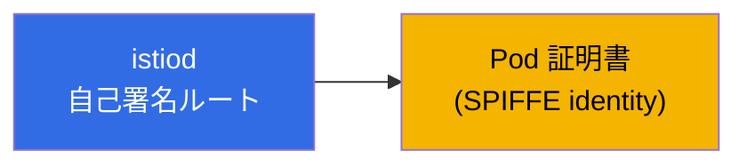
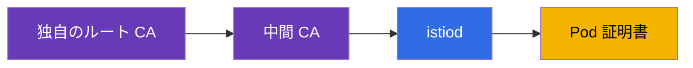
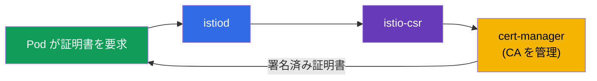
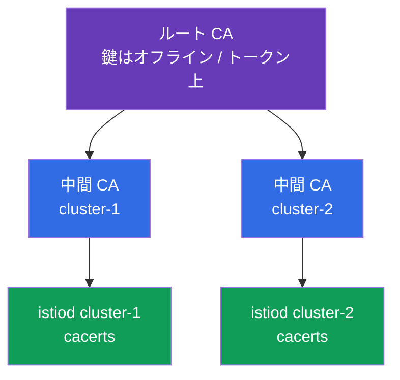
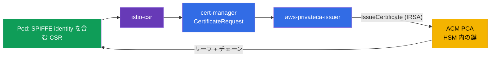

[Русская версия](ru.md) · [Eng version](en.md) · [Versión en español](es.md) · [Version française](fr.md) · [Deutsche Version](de.md) · [ქართული ვერსია](ge.md) · [繁體中文版](tw.md)

# 第16章。証明書管理: カスタム CA、cert-manager、istio-csr

> **この次に。** 第13章では mTLS を有効にし、istiod が証明書を自動的に発行・
> ローテーションすると説明しました。これはすぐに動作します。しかし実際の本番環境では、
> 多くの場合、独自の PKI、すなわち企業のルート CA、複数クラスター向けの共通 trust、
> 外部システムとの統合が必要です。この章では、デフォルト CA を独自のものに置き換える
> 方法を、静的・動的（cert-manager 経由）の両方で説明します。

## 16.1. istiod がデフォルトで証明書を発行する方法

何の設定もない場合に何が起こるかを思い出しましょう。istiod は認証局（CA）として動作し、
起動時に**自己署名ルート証明書**を生成し、このルートで mesh 内のすべてのワークロード
（Pod）の証明書に署名します。



これは開始には便利です。設定は不要で、mTLS はそのまま動作します。ただし、この方式には
制約があり、本番環境では独自の CA へ移行することがよくあります。

### 証明書の有効期間とルート失効のリスク

ここには異なる二つの有効期間があり、混同しないことが重要です。

- **Pod 証明書（リーフ、SVID）**の寿命は非常に短く、デフォルトでは**約24時間**です。
  istiod は失効のかなり前（およそ有効期間の半分）に自動ローテーションします。これを
  意識する必要はなく、ローテーションは完全に自動です。
- 自己署名された istiod の**ルート証明書**は、デフォルトで **10年**の有効期間で発行されます。
  非常に長いため忘れがちですが、そこに落とし穴があります。

重要な注意点は、**デフォルトのルート証明書は自動ローテーションされない**ことです。
リーフはローテーションされますが、ルートはされません。つまり、10年後（あるいは、より
短い有効期間のカスタム CA を設定した場合はそれ以前）に、事前に対処していなければ単に
失効します。

**ルートが失効するとどうなるか。** これは mesh 全体規模の障害です。すべてのリーフ
証明書はルートまでの信頼チェーンを構築しています。ルートが失効した時点で、mTLS の検証は
**あらゆる場所で**通らなくなります。サービス同士は信頼できなくなり、それらの間の
トラフィックは停止します。復旧は「一枚の証明書を再発行する」ことではなく、実質的には
緊急のルート置換と mesh 全体の信頼の再構築です（本質的には 16.7 節の CA 移行と同じ手順を、
インシデントとして行うことになります）。

**ベストプラクティス:**

- ルートの失効日を記録し、最終日ではなく**事前にローテーション**してください。Istio には
  ルートのローテーション手順があります（移行時と同様、共通の trust bundle を使用）。
- ルート証明書と中間証明書の失効日が近づいたことを検知する**監視とアラート**を設定します。
- CA を **cert-manager** に任せれば（16.4 節）、ローテーションを自動化できます。これは
  長期稼働する本番環境で動的アプローチを選ぶもう一つの理由です。
- カスタム `cacerts` では有効期間を自分で設定します。意識的に選び、引き続きローテーションを
  計画してください。

## 16.2. カスタム CA が必要な理由

デフォルトの自己署名ルートを置き換える理由は次のとおりです。

- **複数クラスターでの共通 trust。** マルチクラスター mesh（第28章）がある場合、異なる
  クラスターのサービスは相互に信頼する必要があります。そのため、証明書は**共通ルート**
  から発行されなければなりません。クラスターごとに自己署名 istiod があれば、共通の信頼は
  得られません。
- **企業 PKI との統合。** 企業にはすでに独自のルート CA と証明書発行ポリシーが存在します。
  mesh の証明書もこの階層に組み込むのが自然です。
- **外部からの信頼とコンプライアンス。** 外部システムが mesh サービスの証明書を信頼する必要が
  ある場合や、セキュリティ要件でルートが適切に管理・保管されること（たとえば HSM 内）が
  求められる場合があります。

独自の CA を接続する方法は二つあります。静的（istiod に完成済みの鍵を渡す）と、動的
（istiod が署名を外部システムである cert-manager に委任する）です。

## 16.3. 静的カスタム CA

最も直接的な方法は、自分でルート CA と中間 CA を生成し、istiod に独自の**中間** CA で
Pod 証明書へ署名させることです（ルートは安全な場所に保管し、直接は使用しません）。



istiod は `istio-system` namespace の特別な `cacerts` Secret に CA を探します。ここには
四つのファイルを置きます。

```bash
kubectl create secret generic cacerts -n istio-system \
  --from-file=ca-cert.pem \      # 中間 CA 証明書
  --from-file=ca-key.pem \       # その秘密鍵 (istiod がこれで署名する)
  --from-file=root-cert.pem \    # ルート証明書
  --from-file=cert-chain.pem     # チェーン: 中間 + ルート
```

Secret の作成後は istiod を再起動する必要があります。起動時に `cacerts` を読み込み、自己署名
証明書の代わりに独自の中間 CA で Pod 証明書への署名を開始します。重要な詳細として、Istio は
受信者がルートまでの信頼パスを構築できるよう、**チェーン**（`cert-chain.pem` = 中間 + ルート）
を期待します。

この方式の欠点は、CA 鍵が Kubernetes Secret に置かれ、ローテーションと安全な保管に自分で
責任を負うことです。

## 16.4. 動的 CA: cert-manager + istio-csr

より高度で「本番向け」の方法は、istiod に CA 鍵を一切渡さず、証明書の署名を外部システムに
委任することです。ここでは二つのコンポーネントが役立ちます。

- **cert-manager** は Kubernetes の証明書管理で人気のオペレーターです。さまざまな CA ソース
  >（独自のもの、Vault、ACME など）と連携できます。
- **istio-csr** は Istio と cert-manager の橋渡しです。istiod は署名要求（CSR）を自ら処理せず、
  istio-csr 経由で送信し、istio-csr が cert-manager に証明書への署名を依頼します。



静的 CA と比べて得られるものは次のとおりです。

- **CA 鍵が Istio の Secret に存在しません。** 鍵は cert-manager が管理し、istiod に直接アクセスを
  与えることなく、より安全に（たとえば Vault や HSM に）保管できます。
- **自動化。** cert-manager が発行とローテーションを引き受け、そのエコシステムにより企業の
  CA ソースも容易に接続できます。
- **すべての証明書に対する単一のシステム。** 同じ cert-manager で、おそらく既に ingress 用の
  TLS 証明書を発行しています（第9章）。これからは mesh 証明書もそれを経由します。

欠点は可動部分が増えることです。cert-manager、issuer、istio-csr をインストールして設定する
必要があります。小規模なインストールには過剰ですが、大規模な本番環境では妥当です。

実際には三つのものが必要です。第一に、mesh 証明書に署名する cert-manager の **issuer** です。
最も簡単な選択肢は、独自の CA を含む Secret を基にした `Issuer` です（本番では Vault または
ACM PCA がより一般的です。後述します）。

```yaml
apiVersion: cert-manager.io/v1
kind: Issuer
metadata:
  name: istio-ca
  namespace: istio-system
spec:
  ca:
    secretName: istio-ca-key-pair    # あなたの CA の ca.crt/tls.crt/tls.key を含む Secret
```

第二に、**istio-csr** は Helm でインストールし、この issuer を使用するよう設定します。これが
istiod から CSR を受け取り、cert-manager に署名を依頼します。

```bash
helm install cert-manager-istio-csr jetstack/cert-manager-istio-csr \
  -n cert-manager \
  --set "app.certmanager.issuer.name=istio-ca" \
  --set "app.certmanager.issuer.kind=Issuer" \
  --set "app.istio.namespace=istio-system"
```

第三に、**istiod** を istio-csr 経由での証明書発行に切り替えます（IstioOperator で CA アドレス
として指定し、istiod 自身の CA を無効にします）。

```yaml
apiVersion: install.istio.io/v1alpha1
kind: IstioOperator
spec:
  values:
    global:
      caAddress: cert-manager-istio-csr.cert-manager.svc:443   # istiod はここに CSR を送る
```

これ以降、Pod 証明書には istiod 自身ではなく、issuer `istio-ca` を通じて cert-manager が署名します。

### AWS: AWS Private CA (ACM PCA) を使用する企業 PKI

EKS でよく使われる本番パターンは、ルートをクラスター内ではなく **AWS Private CA (ACM PCA)** に
保持することです。これは CA 鍵が AWS 側（FIPS/HSM を含む）で保管・保護される AWS のマネージド
認証局です。cert-manager は専用 issuer
[aws-privateca-issuer](https://github.com/cert-manager/aws-privateca-issuer) を通じてこれに接続します。

```yaml
apiVersion: awspca.cert-manager.io/v1beta1
kind: AWSPCAClusterIssuer
metadata:
  name: acm-pca
spec:
  arn: arn:aws:acm-pca:eu-central-1:123456789012:certificate-authority/xxxxxxxx
  region: eu-central-1
```

続いて istio-csr をこの issuer（`kind: AWSPCAClusterIssuer`、
`group: awspca.cert-manager.io`）に設定します。その結果、ルートと CA 鍵は ACM PCA（クラスター外）
に存在し、cert-manager が署名を要求、mesh の Pod は企業 AWS 階層から証明書を受け取ります。
istio-csr から ACM PCA へのアクセスは IAM（IRSA、ServiceAccount のロール）で付与します。

コストについては、ACM PCA は **CA の存在自体**に対する月額料金に加え、発行した各証明書の料金が
かかります。二つのモードがあります。general-purpose（**CA あたり約 $400/月**）と、
**短命証明書向け short-lived mode（CA あたり約 $50/月）**です。mesh のワークロード証明書は短命で
頻繁にローテーションされるため、Istio には **short-lived mode** を選びます。それでも大規模な
ローテーションに対する証明書単位の費用は予算に入れてください。価格はリージョンにより異なり
変更されるため、AWS の計算ツールで確認してください。ラボや学習用途では ACM PCA は高価です
（CA が存在する間は課金されます）。その場合は自己署名 istiod または `cacerts` の方が安価です。

### 小規模組織の例: 2 クラスター、共通ルート

典型的な状況です。Istio を持つ二つのクラスターがあり、共通 trust（第28章のマルチクラスター）が
必要ですが、高価な PKI の予算はありません。極端な選択肢は適しません。毎回その場しのぎで証明書を
生成するのは安全でなく、本格的な CA（Vault/HSM）は高価で運用負荷があり、ACM PCA は CA ごとに
有料です。適切な中間策は、**オフラインルート + クラスターごとの中間 CA** です。

重要なのは、CLI 経由で鍵を作成することが危険なのではなく、**ルート鍵をクラスターに置くこと**が
危険だという点です。そこでルートは**一度だけオフライン**で（保護されたマシンで生成し、鍵は
暗号化するかハードウェアトークンに保持）生成し、クラスターには入れません。このルートで二つの
中間 CA に署名し、各クラスターにはその中間 CA だけを `cacerts` として配置します（16.3）。



階層を生成する最も簡単な方法は、用意されている Istio スクリプト（`samples/certs`、そこに
Makefile があります）を使うことです。一つのルートとクラスターごとの中間 CA を作成します。

```bash
# 一度だけ、保護されたオフラインマシンで
make -f Makefile.selfsigned.mk root-ca                 # ルート CA (鍵はオフラインで保管!)
make -f Makefile.selfsigned.mk cluster-1-cacerts        # cluster-1 用の中間
make -f Makefile.selfsigned.mk cluster-2-cacerts        # cluster-2 用の中間
```

次に、**各**クラスターで、そのクラスターの中間セットから `cacerts` を作成します（ルート鍵
`root-key.pem` はオフラインのままで、Secret には格納しません）。

```bash
# cluster-1 で
kubectl create secret generic cacerts -n istio-system \
  --from-file=cluster-1/ca-cert.pem \
  --from-file=cluster-1/ca-key.pem \
  --from-file=cluster-1/root-cert.pem \
  --from-file=cluster-1/cert-chain.pem
# cluster-2 で - cluster-2/ ディレクトリから同じことを行う
```

両方の中間証明書は**共通ルート**で署名されているため、異なるクラスターのサービスは相互に
信頼できます。これがマルチクラスター mesh の基盤です。費用は **$0**、ルート鍵はクラスターに
保管されず、ローテーションは中間レベルで行えます（ルートの再発行はまれな操作です）。

ACM PCA へ移行すべき時は、オフラインルートの手動保管と再発行が自組織にとって脆弱すぎる場合です。
**共通の ACM PCA 一つ（short-lived mode、約 $50/月）**を使い、両方のクラスターで
`aws-privateca-issuer` + istio-csr に接続します。これにより同じ共通ルートを、AWS HSM 内の鍵と
自動化付きで、オフライン運用なしに得られます。

#### 詳細な仕組み（共通 ACM PCA 上の 2 クラスター）

**AWS で一度だけ作成するもの。** ACM PCA で CA を起動します（節約のため一つを共用します。必要なら
Root + Subordinate も可能ですが、その場合は CA が二つになります）。その秘密鍵は**AWS HSM 内の
ACM PCA**に存在し、外部へ払い出されることはありません。この CA の証明書が両クラスター共通の
信頼ルートになります。CA は一つのアカウント/リージョンに存在します。クラスターが別アカウントの
場合は、**AWS RAM** またはリソースポリシーで CA を共有します。

**各クラスターにインストールするもの**（同じですが、同一 CA への参照を使用します）:

- **cert-manager** - 証明書オペレーター。
- **aws-privateca-issuer** - ACM PCA にアクセスするプラグイン。両クラスターの
  `AWSPCAClusterIssuer` に**同一の ARN** CA を指定します。これが「共通ルート」です。
- **istio-csr** - Istio から CSR を受け取り、これをこの issuer に対する cert-manager の要求として
  処理します。
- **istiod** は istio-csr（`global.caAddress`）に切り替え済みで、自身の CA は使用しません。
- **IRSA** - aws-privateca-issuer の ServiceAccount に、この ARN に対する
  `acm-pca:IssueCertificate`/`GetCertificate` 権限を持つ IAM ロールを与えます
  >（クラスターに鍵を置かないアクセス）。

**Pod への証明書発行フロー:**



1. Pod が起動すると、istio-agent が鍵ペアと自身の SPIFFE identity を持つ CSR を生成します。Pod の
   秘密鍵は Pod の外へ出ません。
2. istio-agent は CSR を **istio-csr** に送ります（現在は istiod の代わりにこれが CA エンドポイントです）。
3. istio-csr は cert-manager に `CertificateRequest` を作成します。
4. cert-manager は要求を **aws-privateca-issuer** に渡し、issuer は IRSA 経由で ACM PCA の
   `IssueCertificate` を呼び出します。
5. ACM PCA は HSM 内の鍵でリーフに署名し、証明書 + チェーンを返します。
6. 戻りの経路は、ACM PCA → aws-privateca-issuer → cert-manager → istio-csr → istio-agent → Envoy
   （SDS 経由）です。Pod は ACM PCA ルートへ連なるリーフを受け取ります。
7. **ローテーション**: リーフは短命であり、istio-agent は失効前に同じフローで再要求します。ACM PCA
   は発行ごとに課金するため、short-lived mode とボリューム把握が重要です。

**クラスターが相互に信頼する理由。** 両方の istio-csr が**同一の** CA を参照しているため、両方の
クラスターのすべてのリーフ証明書が一つのルートに連なります。ルートは各クラスターで trust bundle
（`istio-ca-root-cert`、16.5）として配布されます。mTLS ハンドシェイク時、cluster-1 の Pod と
cluster-2 の Pod は共通ルートに対して証明書を検証し、検証は成功します。これがマルチクラスター
mesh の基礎です。

**offline ルートに対する利点:** ルート鍵は AWS HSM 内にあり（トークンや Secret 内ではない）、発行と
ローテーションは自動で、N クラスターの共通ルートは単に issuer の ARN を同じにするだけです。欠点は
有料（CA + 証明書単位）で、AWS に依存することです。CA 自体の再発行は引き続き ACM PCA で管理し、
mesh 内のルート変更は trust bundle（16.7）を通じて行います。

##### コストに関する重要な注意点: すべてのリーフを ACM PCA から発行しない

ACM PCA は**発行される証明書ごと**に課金し、Istio はリーフ証明書を頻繁にローテーションします
（リーフの寿命は約24時間、約半分の時点で更新されるため、Pod あたり一日約2回）。Pod 数が多い場合、
「istio-csr → ACM PCA で各リーフ」という方式は請求額を爆発させます。short-lived mode
（証明書あたり約 $0.058）での概算は、1000 Pod × 約2発行/日 × 30 ≈ **60 000 発行/月 ≈ 約 $3.5k**
で、リーフだけの費用です。金額に大きな差がある二つの方式があります。

- **方式 1 - ACM PCA が各リーフに署名する**（上のフローどおり istio-csr → ACM PCA）。CA 鍵全体は
  HSM にありますが、**ワークロード証明書ごと**に支払うため、大規模では高価です。Pod 数が少ない
  場合にのみ妥当です。
- **方式 2 - ACM PCA は中間 CA のみを発行し、リーフは istiod 自身が署名する**（安価）。ACM PCA
  >（HSM 内のルート）がクラスターの**中間** CA 証明書を発行します。この中間証明書を `cacerts`
  >（16.3）に配置し、その後 istiod が頻繁に発生する短命リーフへローカルで署名するため、**ACM PCA
  にアクセスしません**。ACM PCA は中間の発行/再発行（低頻度）だけに課金するため、実質的に CA あたり
  $50 とわずかな費用です。

方式 2 のトレードオフは、**中間** CA の秘密鍵がクラスター内の `cacerts` に存在することです。HSM に
残るのは**ルート**だけです。大規模な mesh では、ほぼ常に方式 2（istiod がリーフに署名し、ACM PCA
はルート/中間のみ）を選択します。別の手段として**リーフ TTL を長くする**こともできます（ローテーション
が減り、発行数が減少）が、これはセキュリティを弱めます。そのため主な対策は「istiod がリーフに
自ら署名する」ことです。

## 16.5. 証明書の検証

どちらの場合も、Pod が期待する CA から証明書を受け取っていることを確認するのが有用です。これは
特定の Pod の証明書を表示する `istioctl proxy-config secret` で行います。さらに openssl で解析し、
発行者を確認できます。

```bash
POD=$(kubectl get pod -n app -l app=ping-pong -o jsonpath='{.items[0].metadata.name}')

istioctl proxy-config secret "$POD" -n app -o json \
  | jq -r '.dynamicActiveSecrets[] | select(.name=="default") | .secret.tlsCertificate.certificateChain.inlineBytes' \
  | base64 -d | openssl x509 -noout -issuer
```

`issuer` の出力には独自の CA が表示されます（たとえば静的の場合は
`O=CKS-Lab, CN=CKS-Lab Intermediate CA`、動的の場合は `O=cert-manager`）。これにより、
カスタム CA が実際に適用され、デフォルト istiod のままではないことを確認できます。Subject
Alternative Name フィールドの SPIFFE identity も確認でき、そこにはおなじみの
`spiffe://.../ns/.../sa/...` が入っています。

プロキシが信頼するルート証明書は、Istio が `istio-ca-root-cert` ConfigMap として配布します
（各 namespace にあります）。現在の信頼ルートをすばやく確認するには次のようにします。

```bash
kubectl get configmap istio-ca-root-cert -n app \
  -o jsonpath='{.data.root-cert\.pem}' | openssl x509 -noout -issuer -enddate
```

これは CA 移行（16.7）時に便利です。この ConfigMap により、mesh がすでに新しいルートを信頼するか、
現在のルートがいつ失効するかを確認できます。

## 16.6. どのアプローチを選ぶか

実用的な判断表にまとめます。

| 状況 | 推奨 |
|----------|--------------|
| 学習、デモ、単一クラスター | デフォルト istiod CA - 何も設定しない |
| 本番、単一クラスター、PKI 要件なし | デフォルトでも動くが、将来についてすぐ考える（下記参照） |
| マルチクラスターを計画している | 最初から共通のカスタム CA が必須 |
| 企業 PKI またはコンプライアンス要件がある | カスタム CA（静的または動的） |
| 小規模チーム、一度限りの設定 | 静的 CA（`cacerts`） |
| 自動化が必要、CA 鍵を Istio に保管したくない | 動的: cert-manager + istio-csr |

主な分岐点は、**マルチクラスターまたは PKI 要件があるか**です。ある場合、カスタム CA は必須です。
ここで重要な問いが生じます。最初に設定すべきか、後から移行できるのか。後回しは高くつくため、
これを説明します。

## 16.7. デフォルト CA から独自 PKI への移行

mesh が自己署名 istiod ルートで既に本番稼働しており、企業 CA へ移行する必要があるとします。
問題は、**信頼ルート**を変更することであり、現在稼働するすべての Pod の証明書は古いルートに
依存している点です。

「新しい `cacerts` を置いて istiod を再起動するだけ」という素朴な方法は危険です。古い証明書
（古いルートで署名済み）の Pod と新しい Pod は相互に信頼できなくなり、それらの間の mTLS
トラフィックは停止します。これは mesh 全体のダウンタイムへ直結します。

正しい移行は、**共通の trust bundle**、つまり mesh が古いルートと新しいルートの両方を同時に
信頼する期間を通じて行います。


手順の考え方は次のとおりです。

1. 新しいルートを trust bundle に追加します。これで全プロキシは古いルートと新しいルートの両方で
   署名された証明書を信頼します。まだ何も失われません。
2. istiod を新しい（中間）CA による署名へ切り替えます。
3. Pod を段階的に再起動します。再作成時に新しい CA の証明書を受け取ります。mesh には古い証明書と
   新しい証明書が共存しますが、両方への信頼があります。
4. **すべての** Pod が新しい証明書を受け取ったら、古いルートを信頼から削除します。

### 移行のリスク

- **エラー時のダウンタイム。** 共通 trust bundle の段階を省略すると、一部のトラフィックが壊れます。
  古い証明書と新しい証明書は相互に信頼できません。
- **mesh 全体の Rolling restart。** すべての namespace のすべての Pod を再作成する必要があります。
  大規模なクラスターでは大きく危険な操作であり、一部のワークロード（stateful）は再起動が困難です。
- **証明書チェーンのエラー。** `cert-chain.pem` の順序が誤っていたり、ルート間に不整合があったりすると、
  信頼全体が壊れます。
- **マルチクラスターはすべてを複雑にします。** クラスター間の移行を同期しなければ、cross-cluster
  トラフィックは停止します。
- **istiod 再起動と不安定な時間帯。** 移行中は control plane と証明書発行に特別な注意が必要です。

### 組織向けのベストプラクティス

ここから得られる主要な助言は、**後から稼働中の mesh を移行するより、最初に PKI の設定へ時間を
使う方が安い**ということです。

- **初日に CA を決定してください。** 空のクラスターでカスタム CA を接続するのは数コマンドで、
  リスクはありません。数百のサービスを持つ稼働中の mesh では、trust bundle、完全な rolling restart、
  リスクの時間帯が必要です。
- **マルチクラスターまたは PKI 要件の可能性が少しでもあるなら、すぐカスタム CA を導入してください。**
  これは安価な保険です。マルチクラスターは共通ルートなしに「後付け」することはまったくできません。
- **最初から自動化してください。** 組織に PKI 要件があるなら、cert-manager + istio-csr をすぐに導入
  します。後から手動の `cacerts` から移行する必要がなくなります。
- **ルート CA を安全に保管します**（offline または HSM）。mesh では中間 CA のみを使用します。
- **それでも移行が不可避なら**、必ず staging でリハーサルし、trust bundle 経由で実施し、rolling
  restart のための時間帯を計画してください。

短い原則として、CA と trust は基礎に組み込むものです。稼働中の建物の下で基礎を作り直すのは、
最初から正しく据えるより常に高コストで危険です。

## 16.8. identity の代替ソースとしての SPIRE

補足として、証明書への署名は cert-manager だけでなく、SPIFFE 標準のリファレンス実装である
**SPIRE**（第13章）にも委任できます。Istio は SDS 経由で SPIRE と統合でき、その場合 Pod の
identity と証明書を istiod ではなく SPIRE が発行します。これはより厳格な**ワークロード
アテステーション**（SPIRE がノード/プロセス属性を基に、Pod が本当に主張する本人かを検証）や、
Kubernetes 外（VM、他のプラットフォーム）にまたがる統一 SPIFFE trust が必要な場合、あるいは
インフラにすでに SPIRE がある場合に選ばれます。大半のインストールには過剰で、istiod または
cert-manager で十分ですが、このような選択肢を知っておくことは有用です。

## 16.9. ベストプラクティス

- **初日に CA を決定してください。** 空のクラスターでのカスタム CA は数コマンドですが、稼働中の
  mesh では trust bundle + 完全な rolling restart + リスクの時間帯が必要です（16.7）。
- **ルートのローテーションを計画し、有効期限を監視してください。** ルートは自動ローテーション
  されません。ルートおよび中間証明書の `enddate` が近づくことにアラートを設定します（確認は
  `istio-ca-root-cert`、16.5）。
- **ルートは offline または HSM/ACM PCA に置き**、mesh では中間 CA のみを使用します。これにより
  クラスターが侵害されてもルート鍵は漏えいしません。
- **発行を自動化してください。** 長期稼働する本番環境では cert-manager + istio-csr（または EKS の
  ACM PCA）を使います。CA 鍵は Istio 内になく、ローテーションは自動です。
- **マルチクラスターには一つの共通ルート**（第28章）を最初から組み込みます。移行なしに共通 trust を
  後付けすることはできません。
- **チェーンを正しく維持してください。** `cert-chain.pem` = 中間 + ルートで、順序が正しいこと。
  チェーンの誤りは信頼全体を壊します。
- **staging で移行をリハーサルしてください。** 独自 CA への移行が不可避なら、共通 trust bundle を
  経由し、rolling restart の時間帯を計画したうえでのみ実施します。

## 16.10. この章のまとめ

- デフォルトでは istiod が自己署名ルートを生成し、それで Pod 証明書に署名します。すぐに動作しますが、
  制約があります。
- Pod のリーフ証明書は約24時間で、自動ローテーションされます。デフォルトのルートは10年で発行され、
  **自動ローテーションされません**。ルートが失効すると mesh 全体の mTLS が停止します。ルートの
  ローテーションを事前に計画し（または cert-manager に委任し）、期限を監視する必要があります。
- カスタム CA は、クラスター間の共通 trust、企業 PKI との統合、セキュリティ/コンプライアンス要件に
  必要です。
- **静的 CA:** ルート、中間 CA、チェーンを `istio-system` の `cacerts` Secret に置き、istiod は
  独自の中間 CA で Pod 証明書に署名します。
- Istio は正確なチェーン（`cert-chain.pem` = 中間 + ルート）を必要とします。
- **動的 CA（cert-manager + istio-csr）:** istiod は istio-csr を介して cert-manager に署名を委任します。
  CA 鍵は Istio に保管されず、すべてが自動化されます。
- どの CA が証明書に署名したかは `istioctl proxy-config secret` + openssl で確認できます。mesh の
  信頼ルートは各 namespace の `istio-ca-root-cert` ConfigMap にあります。
- EKS では、**AWS Private CA (ACM PCA)** を cert-manager（`aws-privateca-issuer`）+ istio-csr 経由で
  使用すると企業 PKI を便利に構築できます。CA 鍵はクラスターではなく AWS に残ります。ACM PCA は有料で、
  general-purpose は CA あたり約 $400/月、short-lived mode は約 $50/月（mesh では short-lived を使用）+
  発行料金です。
- 2 クラスターを持つ小規模組織向けの予算重視の方式は、**offline ルート + クラスターごとの中間**
  （`cacerts`）です。$0 で、ルート鍵はクラスターの外にあり、共通ルートによりマルチクラスター trust を
  提供します。
- ACM PCA は**発行ごと**に課金し、Istio のリーフは頻繁にローテーションされます。各リーフを ACM PCA
  から発行してはいけません。安価なのは ACM PCA が**中間** CA のみを（`cacerts` 用に）発行し、リーフは
  **istiod 自身**が署名する方法です。ACM PCA でリーフを発行すると大規模では高価です。
- 証明書の署名は **SPIRE**（厳格なワークロードアテステーション、Kubernetes 外の trust）に委任することも
  できます。複雑なシナリオ向けの選択肢です。
- デフォルト CA から独自 CA への移行は、共通 trust bundle（両方のルートを信頼）、完全な rolling restart、
  古いルートの後続削除を通じて行います。ダウンタイムのリスクは高くなります。
- ベストプラクティスは、カスタム CA を最初から組み込むことです（特にマルチクラスターの可能性または
  PKI 要件がある場合）。これは稼働中の mesh を移行するより安価で安全です。

## 16.11. 自己確認問題

1. istiod はデフォルトでどのように証明書を発行し、この方式の制約は何ですか？
2. カスタム CA を接続する理由を挙げてください。
3. `cacerts` Secret には何を入れ、istiod はどの証明書で Pod に署名しますか？
4. なぜ Istio はチェーン（`cert-chain.pem`）そのものを要求するのですか？
5. 動的 CA（cert-manager + istio-csr）は静的 CA より何が優れ、欠点は何ですか？
6. 特定 Pod の証明書にどの CA が署名したかをどう確認しますか？
7. 稼働中の mesh で新しい `cacerts` を置いて istiod を再起動するだけではなぜいけませんか？
   安全な移行はどのようなものですか？
8. カスタム CA はなぜ後から移行するのではなく最初から組み込む方がよいのですか？
9. デフォルトのルート証明書はどのくらいの期間で発行され、自動ローテーションされますか？
   失効すると何が起こりますか？
10. 動的 CA（cert-manager + istio-csr）にはどの三つのものを設定する必要があり、istiod は CSR の
    送信先をどのように知りますか？
11. EKS 上で、CA 鍵をクラスターに保管せずに企業 PKI を構築するにはどうしますか？
12. 現在の mesh の信頼ルートはどこで確認でき、CA 移行時にそれがなぜ役立ちますか？
13. ACM PCA の料金はいくらで、Istio にはどのモードを選びますか？ なぜですか？
14. 小規模組織が高価な PKI を使わず、ルート鍵をクラスターに保管せずに二つのクラスターに共通 trust を
    与えるにはどうしますか？
15. ACM PCA から各リーフ証明書を発行すると高価なのはなぜで、どう安価にしますか（その場合、リーフに
    誰が署名し、中間 CA の鍵はどこにありますか）？

## 実習

istiod への静的カスタム CA（ルート + 中間）の接続を練習してください。

🧪 ラボ 19: [tasks/ica/labs/19](../../labs/19/README_JP.MD)

cert-manager と istio-csr による動的な証明書発行を練習してください。

🧪 ラボ 26: [tasks/ica/labs/26](../../labs/26/README_JP.MD)

---
[目次](../README_JP.md) · [第15章](../15/jp.md) · [第17章](../17/jp.md)