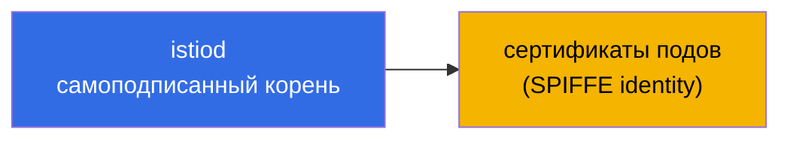
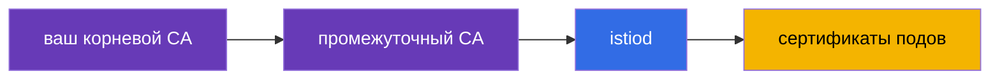
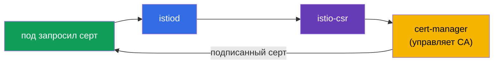
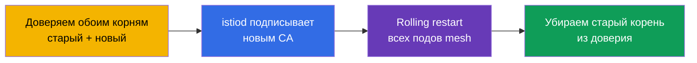

# Глава 16. Управление сертификатами: кастомный CA, cert-manager и istio-csr

> **Что дальше.** В главе 13 мы включили mTLS и сказали, что istiod сам выдаёт и
> ротирует сертификаты - это работает из коробки. Но в реальном продакшене часто нужно
> подключить свою PKI: корпоративный корневой CA, единый trust для нескольких кластеров,
> интеграцию с внешними системами. В этой главе разберём, как заменить дефолтный CA на
> свой - статически и динамически (через cert-manager).

## 16.1. Как istiod выдаёт сертификаты по умолчанию

Вспомним, что происходит без всякой настройки. istiod работает как центр сертификации
(CA): при старте он генерирует **самоподписанный корневой сертификат** и этим корнем
подписывает сертификаты всех рабочих нагрузок (подов) в mesh.



Это удобно для старта: ничего настраивать не надо, mTLS просто работает. Но у такого
подхода есть ограничения, из-за которых в проде часто переходят на свой CA.

### Сроки жизни сертификатов и риск истечения корня

Здесь два разных срока, и их важно не путать.

- **Сертификаты подов (листовые, SVID)** живут очень недолго - по умолчанию **около 24
  часов**. istiod автоматически ротирует их задолго до истечения (примерно на половине
  срока). Про них думать не надо, ротация полностью автоматическая.
- **Корневой сертификат** самоподписанного istiod по умолчанию выписывается на **10
  лет**. Срок огромный, поэтому про него легко забыть - и это ловушка.

Ключевой нюанс: **корневой сертификат по умолчанию НЕ ротируется автоматически.**
Листовые - да, корень - нет. То есть через 10 лет (или раньше, если вы задали кастомный
CA с меньшим сроком) он просто истечёт, если о нём заранее не позаботиться.

**Что будет, если корень истечёт.** Это катастрофа масштаба всего mesh. Все листовые
сертификаты выстраивают цепочку доверия до корня. Как только корень просрочен, проверка
mTLS перестаёт проходить **везде**: сервисы перестают доверять друг другу, и трафик
между ними падает. Восстановление это не «перевыпустить один сертификат», а фактически
аварийная замена корня и пересоздание доверия по всему mesh (по сути та же процедура,
что миграция CA в разделе 16.7, только уже в режиме инцидента).

**Best practices:**

- Зафиксируйте дату истечения корня и **ротируйте его заранее**, а не в последний день.
  У Istio есть процедура ротации корня (через общий trust bundle, как при миграции).
- Настройте **мониторинг и алерты** на приближение даты истечения корневого и
  промежуточного сертификатов.
- Если доверить CA **cert-manager** (раздел 16.4), ротацию можно автоматизировать - это
  ещё один аргумент в пользу динамического подхода для долгоживущего прода.
- Для кастомного `cacerts` вы сами задаёте срок - осознанно выбирайте его и всё равно
  планируйте ротацию.

## 16.2. Зачем нужен кастомный CA

Причины заменить дефолтный самоподписанный корень:

- **Единый trust для нескольких кластеров.** Если у вас мультикластерный mesh (глава
  28), сервисы из разных кластеров должны доверять друг другу. Для этого их сертификаты
  должны исходить из **общего корня**. У каждого кластера свой самоподписанный istiod -
  общего доверия не будет.
- **Интеграция с корпоративной PKI.** В компании уже есть свой корневой CA и политики
  выпуска сертификатов. Логично, чтобы сертификаты mesh встраивались в эту иерархию.
- **Внешнее доверие и комплаенс.** Иногда внешние системы должны доверять сертификатам
  сервисов mesh, а требования безопасности - чтобы корень был под контролем и правильно
  хранился (например, в HSM).

Есть два способа подключить свой CA: статический (даёте istiod готовые ключи) и
динамический (istiod делегирует подпись внешней системе - cert-manager).

## 16.3. Статический кастомный CA

Самый прямой способ: вы сами генерируете корневой и промежуточный CA, а istiod
подписывает сертификаты подов вашим **промежуточным** CA (корневой держится в надёжном
месте и напрямую не используется).



istiod ищет ваш CA в специальном секрете `cacerts` в namespace `istio-system`. В него
кладут четыре файла:

```bash
kubectl create secret generic cacerts -n istio-system \
  --from-file=ca-cert.pem \      # промежуточный сертификат CA
  --from-file=ca-key.pem \       # его приватный ключ (им istiod подписывает)
  --from-file=root-cert.pem \    # корневой сертификат
  --from-file=cert-chain.pem     # цепочка: промежуточный + корневой
```

После создания секрета istiod надо перезапустить - при старте он подхватит `cacerts` и
начнёт подписывать сертификаты подов вашим промежуточным CA вместо самоподписанного.
Важная деталь: Istio ожидает именно **цепочку** (`cert-chain.pem` = промежуточный +
корневой), чтобы получатель мог выстроить путь доверия до корня.

Минус этого способа: ключ CA лежит в Kubernetes Secret, и вы сами отвечаете за его
ротацию и безопасное хранение.

## 16.4. Динамический CA: cert-manager + istio-csr

Более продвинутый и «продакшн» способ - не давать istiod ключ CA вовсе, а делегировать
подпись сертификатов внешней системе. Здесь помогают два компонента:

- **cert-manager** - популярный оператор для управления сертификатами в Kubernetes. Он
  умеет работать с разными источниками CA (собственный, Vault, ACME и т.д.).
- **istio-csr** - мост между Istio и cert-manager. istiod отправляет запросы на подпись
  (CSR) не сам, а через istio-csr, который просит cert-manager подписать сертификат.



Что это даёт по сравнению со статическим CA:

- **Ключ CA не лежит в секрете Istio.** Им управляет cert-manager, и его можно хранить
  надёжнее (например, в Vault или HSM), не давая istiod прямого доступа.
- **Автоматизация.** cert-manager берёт на себя выпуск и ротацию, а его экосистема
  позволяет легко подключить корпоративные источники CA.
- **Единая система для всех сертификатов.** Тем же cert-manager вы, скорее всего, уже
  выпускаете TLS-сертификаты для ingress (глава 9) - теперь и mesh-сертификаты идут
  через него.

Минус - больше движущихся частей: нужно поставить и настроить cert-manager, issuer и
istio-csr. Для небольших установок это избыточно, для крупного прода - оправдано.

## 16.5. Проверка сертификатов

В обоих случаях полезно убедиться, что поды получают сертификаты от нужного CA. Это
делается через `istioctl proxy-config secret` - он показывает сертификаты конкретного
пода. Дальше их можно распарсить через openssl и посмотреть издателя:

```bash
POD=$(kubectl get pod -n app -l app=ping-pong -o jsonpath='{.items[0].metadata.name}')

istioctl proxy-config secret "$POD" -n app -o json \
  | jq -r '.dynamicActiveSecrets[] | select(.name=="default") | .secret.tlsCertificate.certificateChain.inlineBytes' \
  | base64 -d | openssl x509 -noout -issuer
```

В выводе `issuer` вы увидите свой CA (например, `O=CKS-Lab, CN=CKS-Lab Intermediate CA`
для статического или `O=cert-manager` для динамического). Так вы подтверждаете, что
кастомный CA реально применился, а не остался дефолтный istiod. Ещё можно проверить SPIFFE
identity в поле Subject Alternative Name - там будет знакомый `spiffe://.../ns/.../sa/...`.

## 16.6. Какой подход выбрать

Сведём всё в практическую таблицу решений.

| Ситуация | Рекомендация |
|----------|--------------|
| Обучение, демо, один кластер | дефолтный istiod CA - ничего не настраиваем |
| Прод, один кластер, нет требований к PKI | дефолтный работает, но сразу подумайте про будущее (см. ниже) |
| Планируется мультикластер | обязательно общий кастомный CA с самого начала |
| Есть корпоративная PKI или комплаенс | кастомный CA (статический или динамический) |
| Небольшая команда, разовая настройка | статический CA (`cacerts`) |
| Нужна автоматизация, не хранить ключ CA в Istio | динамический: cert-manager + istio-csr |

Главный водораздел - **будет ли у вас мультикластер или требования к PKI**. Если да,
кастомный CA нужен обязательно. И тут возникает важный вопрос: настраивать его сразу или
можно потом мигрировать? Разберём, потому что «потом» обходится дорого.

## 16.7. Миграция с дефолтного CA на свой PKI

Представьте: mesh уже работает в проде на самоподписанном корне istiod, и теперь нужно
перейти на корпоративный CA. Проблема в том, что мы меняем **корень доверия**, а на
старом корне завязаны сертификаты всех работающих подов.

Наивный путь «просто подложить новый `cacerts` и перезапустить istiod» опасен: поды со
старыми сертификатами (подписанными старым корнем) и поды с новыми перестанут доверять
друг другу, и mTLS-трафик между ними ляжет. Это прямой путь к даунтайму всего mesh.

Правильная миграция делается через **общий trust bundle** - период, когда mesh доверяет
одновременно и старому, и новому корню:



Логика по шагам:

1. Добавляем новый корень в trust bundle - теперь все прокси доверяют сертификатам,
   подписанным и старым, и новым корнем. Никто пока ничего не теряет.
2. Переключаем istiod на подпись новым (промежуточным) CA.
3. Постепенно перезапускаем поды - при пересоздании они получают сертификаты от нового
   CA. Пока в mesh сосуществуют старые и новые сертификаты, но доверие есть к обоим.
4. Когда **все** поды получили новые сертификаты, убираем старый корень из доверия.

### Риски миграции

- **Даунтайм при ошибке.** Если пропустить фазу общего trust bundle, часть трафика
  сломается - старые и новые сертификаты не будут доверять друг другу.
- **Rolling restart всего mesh.** Нужно пересоздать все поды во всех namespace. Для
  крупного кластера это большая и рискованная операция, а некоторые нагрузки (stateful)
  перезапускать больно.
- **Ошибки в цепочке сертификатов.** Неверный порядок в `cert-chain.pem` или несогласованные
  корни ломают доверие целиком.
- **Мультикластер усложняет всё.** Миграцию нужно синхронизировать между кластерами, иначе
  cross-cluster трафик отвалится.
- **istiod-рестарт и окно нестабильности.** На время миграции control plane и выпуск
  сертификатов под повышенным вниманием.

### Best practices для организаций

Отсюда следует главный совет: **дешевле потратить время на настройку PKI сразу, чем
мигрировать живой mesh потом.**

- **Решайте про CA на день первый.** На пустом кластере подключить кастомный CA - это
  пара команд и никакого риска. На живом mesh с сотнями сервисов - это trust-bundle,
  полный rolling restart и окно риска.
- **Есть хоть малейшая вероятность мультикластера или требований PKI - ставьте кастомный
  CA сразу.** Это дешёвая страховка. Мультикластер вообще невозможно «доделать» без
  общего корня.
- **Автоматизируйте с самого начала.** Если у организации есть требования к PKI, ставьте
  cert-manager + istio-csr сразу - потом не придётся переходить с ручных `cacerts`.
- **Храните корневой CA безопасно** (offline или HSM), в mesh используйте только
  промежуточный.
- **Если миграция всё же неизбежна** - обязательно репетируйте её в staging, делайте
  через trust bundle и планируйте окно для rolling restart.

Короткое правило: CA и trust - это то, что закладывают в фундамент. Переделывать
фундамент под работающим зданием всегда дороже и рискованнее, чем заложить правильный
сразу.

## 16.8. Итоги главы

- По умолчанию istiod сам генерирует самоподписанный корень и подписывает им
  сертификаты подов; работает из коробки, но с ограничениями.
- Листовые сертификаты подов живут ~24 часа и ротируются автоматически; корневой по
  умолчанию выписан на 10 лет и **автоматически не ротируется**. Если корень истечёт -
  падает mTLS по всему mesh; ротацию корня надо планировать заранее (или доверить
  cert-manager) и мониторить срок.
- Кастомный CA нужен для единого trust между кластерами, интеграции с корпоративной PKI
  и требований безопасности/комплаенса.
- **Статический CA:** кладёте корень, промежуточный CA и цепочку в секрет `cacerts` в
  `istio-system`; istiod подписывает сертификаты подов вашим промежуточным CA.
- Istio ждёт именно цепочку (`cert-chain.pem` = промежуточный + корневой).
- **Динамический CA (cert-manager + istio-csr):** istiod делегирует подпись через
  istio-csr в cert-manager; ключ CA не хранится в Istio, всё автоматизировано.
- Проверить, каким CA подписаны сертификаты, помогает `istioctl proxy-config secret` +
  openssl.
- Миграция с дефолтного CA на свой делается через общий trust bundle (доверяем обоим
  корням), полный rolling restart и последующее удаление старого корня; риск даунтайма
  высок.
- Best practice: закладывать кастомный CA сразу (особенно при возможном мультикластере
  или требованиях PKI) - это дешевле и безопаснее, чем мигрировать живой mesh.

## 16.9. Вопросы для самопроверки

1. Как istiod выдаёт сертификаты по умолчанию и в чём ограничение этого подхода?
2. Назовите причины подключить кастомный CA.
3. Что кладут в секрет `cacerts` и каким сертификатом istiod подписывает поды?
4. Почему Istio требует именно цепочку (`cert-chain.pem`)?
5. Чем динамический CA (cert-manager + istio-csr) лучше статического и в чём его минус?
6. Как проверить, каким CA подписан сертификат конкретного пода?
7. Почему нельзя просто подложить новый `cacerts` и перезапустить istiod на живом mesh?
   Как выглядит безопасная миграция?
8. Почему кастомный CA лучше закладывать сразу, а не мигрировать потом?
9. На какой срок по умолчанию выписан корневой сертификат, ротируется ли он сам и что
   произойдёт при его истечении?

## Практика

Отработайте подключение статического кастомного CA (корень + промежуточный) в istiod:

🧪 Лаба 19: [tasks/ica/labs/19](../../labs/19/README_RU.MD)

Отработайте динамическую выдачу сертификатов через cert-manager и istio-csr:

🧪 Лаба 26: [tasks/ica/labs/26](../../labs/26/README_RU.MD)

---
[Оглавление](../README.md) · [Глава 15](../15/ru.md) · [Глава 17](../17/ru.md)
