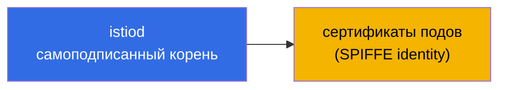
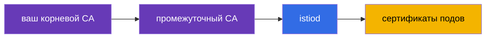
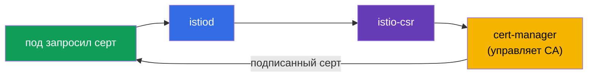
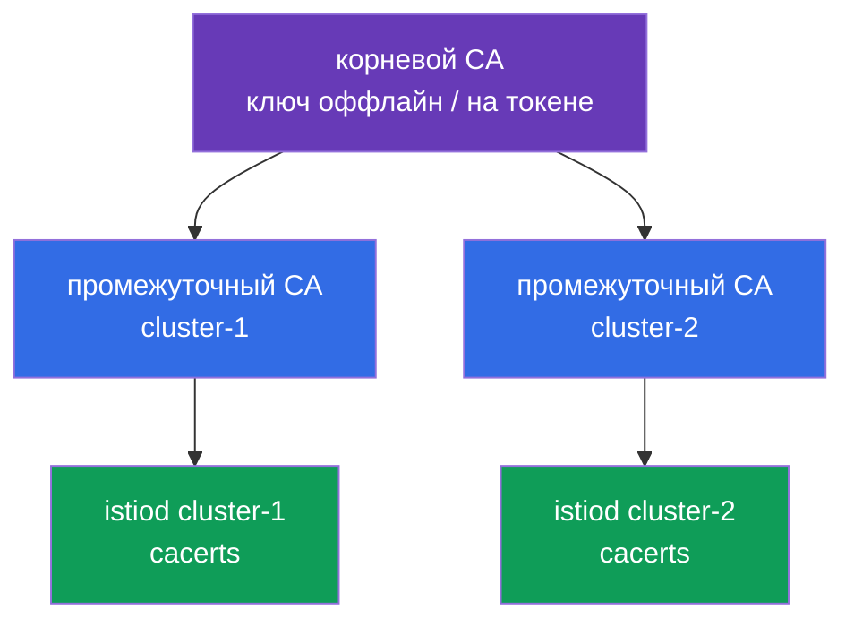
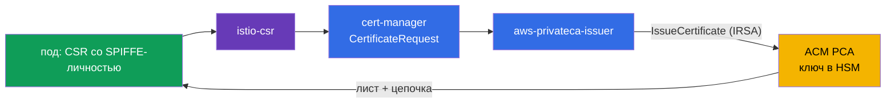
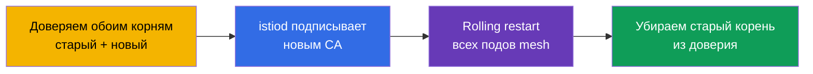

[Eng version](en.md) · [Versión en español](es.md) · [Version française](fr.md) · [Deutsche Version](de.md)

# Глава 16. Управление сертификатами: кастомный CA, cert-manager и istio-csr

> **Что дальше.** В главе 13 мы включили mTLS и сказали, что istiod сам выдаёт и
> ротирует сертификаты - это работает из коробки. Но в реальном продакшене часто нужно
> подключить свою PKI: корпоративный корневой CA, единый trust для нескольких кластеров,
> интеграцию с внешними системами. В этой главе разберём, как заменить дефолтный CA на
> свой - статически и динамически (через cert-manager).

## 16.1. Как istiod выдаёт сертификаты по умолчанию

Вспомним, что происходит без всякой настройки. istiod работает как центр сертификации
(CA): при старте он генерирует **самоподписанный корневой сертификат** и этим корнем
подписывает сертификаты всех рабочих нагрузок (подов) в mesh.



Это удобно для старта: ничего настраивать не надо, mTLS просто работает. Но у такого
подхода есть ограничения, из-за которых в проде часто переходят на свой CA.

### Сроки жизни сертификатов и риск истечения корня

Здесь два разных срока, и их важно не путать.

- **Сертификаты подов (листовые, SVID)** живут очень недолго - по умолчанию **около 24
  часов**. istiod автоматически ротирует их задолго до истечения (примерно на половине
  срока). Про них думать не надо, ротация полностью автоматическая.
- **Корневой сертификат** самоподписанного istiod по умолчанию выписывается на **10
  лет**. Срок огромный, поэтому про него легко забыть - и это ловушка.

Ключевой нюанс: **корневой сертификат по умолчанию НЕ ротируется автоматически.**
Листовые - да, корень - нет. То есть через 10 лет (или раньше, если вы задали кастомный
CA с меньшим сроком) он просто истечёт, если о нём заранее не позаботиться.

**Что будет, если корень истечёт.** Это катастрофа масштаба всего mesh. Все листовые
сертификаты выстраивают цепочку доверия до корня. Как только корень просрочен, проверка
mTLS перестаёт проходить **везде**: сервисы перестают доверять друг другу, и трафик
между ними падает. Восстановление это не «перевыпустить один сертификат», а фактически
аварийная замена корня и пересоздание доверия по всему mesh (по сути та же процедура,
что миграция CA в разделе 16.7, только уже в режиме инцидента).

**Best practices:**

- Зафиксируйте дату истечения корня и **ротируйте его заранее**, а не в последний день.
  У Istio есть процедура ротации корня (через общий trust bundle, как при миграции).
- Настройте **мониторинг и алерты** на приближение даты истечения корневого и
  промежуточного сертификатов.
- Если доверить CA **cert-manager** (раздел 16.4), ротацию можно автоматизировать - это
  ещё один аргумент в пользу динамического подхода для долгоживущего прода.
- Для кастомного `cacerts` вы сами задаёте срок - осознанно выбирайте его и всё равно
  планируйте ротацию.

## 16.2. Зачем нужен кастомный CA

Причины заменить дефолтный самоподписанный корень:

- **Единый trust для нескольких кластеров.** Если у вас мультикластерный mesh (глава
  28), сервисы из разных кластеров должны доверять друг другу. Для этого их сертификаты
  должны исходить из **общего корня**. У каждого кластера свой самоподписанный istiod -
  общего доверия не будет.
- **Интеграция с корпоративной PKI.** В компании уже есть свой корневой CA и политики
  выпуска сертификатов. Логично, чтобы сертификаты mesh встраивались в эту иерархию.
- **Внешнее доверие и комплаенс.** Иногда внешние системы должны доверять сертификатам
  сервисов mesh, а требования безопасности - чтобы корень был под контролем и правильно
  хранился (например, в HSM).

Есть два способа подключить свой CA: статический (даёте istiod готовые ключи) и
динамический (istiod делегирует подпись внешней системе - cert-manager).

## 16.3. Статический кастомный CA

Самый прямой способ: вы сами генерируете корневой и промежуточный CA, а istiod
подписывает сертификаты подов вашим **промежуточным** CA (корневой держится в надёжном
месте и напрямую не используется).



istiod ищет ваш CA в специальном секрете `cacerts` в namespace `istio-system`. В него
кладут четыре файла:

```bash
kubectl create secret generic cacerts -n istio-system \
  --from-file=ca-cert.pem \      # промежуточный сертификат CA
  --from-file=ca-key.pem \       # его приватный ключ (им istiod подписывает)
  --from-file=root-cert.pem \    # корневой сертификат
  --from-file=cert-chain.pem     # цепочка: промежуточный + корневой
```

После создания секрета istiod надо перезапустить - при старте он подхватит `cacerts` и
начнёт подписывать сертификаты подов вашим промежуточным CA вместо самоподписанного.
Важная деталь: Istio ожидает именно **цепочку** (`cert-chain.pem` = промежуточный +
корневой), чтобы получатель мог выстроить путь доверия до корня.

Минус этого способа: ключ CA лежит в Kubernetes Secret, и вы сами отвечаете за его
ротацию и безопасное хранение.

## 16.4. Динамический CA: cert-manager + istio-csr

Более продвинутый и «продакшн» способ - не давать istiod ключ CA вовсе, а делегировать
подпись сертификатов внешней системе. Здесь помогают два компонента:

- **cert-manager** - популярный оператор для управления сертификатами в Kubernetes. Он
  умеет работать с разными источниками CA (собственный, Vault, ACME и т.д.).
- **istio-csr** - мост между Istio и cert-manager. istiod отправляет запросы на подпись
  (CSR) не сам, а через istio-csr, который просит cert-manager подписать сертификат.



Что это даёт по сравнению со статическим CA:

- **Ключ CA не лежит в секрете Istio.** Им управляет cert-manager, и его можно хранить
  надёжнее (например, в Vault или HSM), не давая istiod прямого доступа.
- **Автоматизация.** cert-manager берёт на себя выпуск и ротацию, а его экосистема
  позволяет легко подключить корпоративные источники CA.
- **Единая система для всех сертификатов.** Тем же cert-manager вы, скорее всего, уже
  выпускаете TLS-сертификаты для ingress (глава 9) - теперь и mesh-сертификаты идут
  через него.

Минус - больше движущихся частей: нужно поставить и настроить cert-manager, issuer и
istio-csr. Для небольших установок это избыточно, для крупного прода - оправдано.

На практике нужны три вещи. Во-первых, **issuer** cert-manager, который будет подписывать
сертификаты mesh. Простейший вариант - `Issuer` на основе секрета с вашим CA (в проде это
чаще Vault или ACM PCA, см. ниже):

```yaml
apiVersion: cert-manager.io/v1
kind: Issuer
metadata:
  name: istio-ca
  namespace: istio-system
spec:
  ca:
    secretName: istio-ca-key-pair    # Secret с ca.crt/tls.crt/tls.key вашего CA
```

Во-вторых, **istio-csr** ставится через Helm и настраивается на этот issuer - именно он
будет принимать CSR от istiod и просить cert-manager их подписать:

```bash
helm install cert-manager-istio-csr jetstack/cert-manager-istio-csr \
  -n cert-manager \
  --set "app.certmanager.issuer.name=istio-ca" \
  --set "app.certmanager.issuer.kind=Issuer" \
  --set "app.istio.namespace=istio-system"
```

В-третьих, **istiod** переключают на выдачу сертификатов через istio-csr (в IstioOperator
указывают его как CA-адрес и отключают собственный CA istiod):

```yaml
apiVersion: install.istio.io/v1alpha1
kind: IstioOperator
spec:
  values:
    global:
      caAddress: cert-manager-istio-csr.cert-manager.svc:443   # istiod шлёт CSR сюда
```

После этого сертификаты подов подписывает cert-manager через issuer `istio-ca`, а не сам
istiod.

### AWS: корпоративная PKI через AWS Private CA (ACM PCA)

Частый продакшн-паттерн на EKS: корень держать не в кластере, а в **AWS Private CA (ACM
PCA)** - управляемом центре сертификации AWS, где ключ CA хранится и защищён на стороне AWS
(вплоть до FIPS/HSM). cert-manager подключается к нему через отдельный issuer
[aws-privateca-issuer](https://github.com/cert-manager/aws-privateca-issuer):

```yaml
apiVersion: awspca.cert-manager.io/v1beta1
kind: AWSPCAClusterIssuer
metadata:
  name: acm-pca
spec:
  arn: arn:aws:acm-pca:eu-central-1:123456789012:certificate-authority/xxxxxxxx
  region: eu-central-1
```

Дальше istio-csr настраивают на этот issuer (`kind: AWSPCAClusterIssuer`,
`group: awspca.cert-manager.io`). Итог: корень и ключ CA живут в ACM PCA (не в кластере),
cert-manager запрашивает у него подпись, а поды mesh получают сертификаты из вашей
корпоративной иерархии AWS. Доступ istio-csr к ACM PCA выдают через IAM (IRSA - роль на
ServiceAccount).

Про стоимость: ACM PCA тарифицируется помесячно **за сам факт существования CA** плюс плата
за каждый выпущенный сертификат. Есть два режима: general-purpose (**~$400/мес за CA**) и
**short-lived mode для короткоживущих сертификатов (~$50/мес за CA)**. Рабочие сертификаты
mesh короткоживущие и часто ротируются, поэтому для Istio берут именно **short-lived mode**;
всё равно закладывайте per-certificate расходы на массовую ротацию. Цены зависят от региона и
меняются - сверяйтесь с калькулятором AWS. Для лаб и обучения ACM PCA дороговат (списывается,
пока CA существует) - там дешевле self-signed istiod или `cacerts`.

### Пример для небольшой организации: 2 кластера, общий корень

Типичная ситуация: два кластера с Istio, нужен общий trust (мультикластер, глава 28), но
бюджета на дорогую PKI нет. Крайности не подходят: генерировать сертификаты «на коленке»
каждый раз небезопасно, полноценный CA (Vault/HSM) - дорого и хлопотно, ACM PCA - платно за
каждый CA. Хорошая золотая середина - **offline-корень + промежуточный CA на каждый кластер**.

Идея: небезопасно не то, что ключ создан через CLI, а то, что **корневой ключ лежит в
кластере**. Значит, корень генерируем **один раз оффлайн** (на защищённой машине; ключ
шифруем или держим на аппаратном токене), в кластеры он **не попадает**. Им подписываем два
промежуточных CA, и в каждый кластер кладём только его промежуточный как `cacerts` (16.3).



Сгенерировать иерархию проще всего готовыми скриптами Istio (`samples/certs`, там есть
Makefile) - создаём один корень и по промежуточному на кластер:

```bash
# один раз, на защищённой оффлайн-машине
make -f Makefile.selfsigned.mk root-ca                 # корневой CA (ключ храним оффлайн!)
make -f Makefile.selfsigned.mk cluster-1-cacerts        # промежуточный для cluster-1
make -f Makefile.selfsigned.mk cluster-2-cacerts        # промежуточный для cluster-2
```

Затем в **каждом** кластере создаём `cacerts` из его промежуточного набора (корневой ключ
`root-key.pem` при этом остаётся оффлайн, в секрет не кладётся):

```bash
# в cluster-1
kubectl create secret generic cacerts -n istio-system \
  --from-file=cluster-1/ca-cert.pem \
  --from-file=cluster-1/ca-key.pem \
  --from-file=cluster-1/root-cert.pem \
  --from-file=cluster-1/cert-chain.pem
# в cluster-2 - то же самое из каталога cluster-2/
```

Так как оба промежуточных подписаны **общим корнем**, сервисы из разных кластеров доверяют
друг другу - основа мультикластерного mesh. Стоимость - **$0**, корневой ключ в кластерах не
хранится, а ротация делается на уровне промежуточных (перевыпуск корня - редкая операция).

Когда стоит перейти на ACM PCA: если ручное хранение оффлайн-корня и его перевыпуск - слишком
хрупко для вас, возьмите **один общий ACM PCA (short-lived mode, ~$50/мес)** и подключите к
нему `aws-privateca-issuer` + istio-csr в **обоих** кластерах - получите тот же общий корень,
но с ключом в HSM AWS и автоматизацией, без оффлайн-возни.

#### Как это работает подробно (2 кластера на общем ACM PCA)

**Что создаётся один раз в AWS.** В ACM PCA поднимается CA (для экономии - один общий; при
желании Root + Subordinate, но это уже два CA). Его приватный ключ живёт **внутри ACM PCA в
HSM AWS** и наружу не выдаётся никогда; сертификат этого CA станет общим корнем доверия для
обоих кластеров. CA живёт в одном аккаунте/регионе - если кластеры в разных аккаунтах, CA
шарят через **AWS RAM** или resource-политику.

**Что ставится в каждом кластере** (одинаково, но со ссылкой на один и тот же CA):

- **cert-manager** - оператор сертификатов;
- **aws-privateca-issuer** - плагин, ходящий в ACM PCA; в нём `AWSPCAClusterIssuer` с
  **одинаковым ARN** CA в обоих кластерах - это и есть «общий корень»;
- **istio-csr** - принимает CSR от Istio и оформляет их как запросы cert-manager на этот issuer;
- **istiod** переключён на istio-csr (`global.caAddress`), свой CA не использует;
- **IRSA** - ServiceAccount у aws-privateca-issuer получает IAM-роль с правами
  `acm-pca:IssueCertificate`/`GetCertificate` на этот ARN (доступ без ключей в кластере).

**Поток выдачи сертификата поду:**



1. Под стартует, istio-agent генерирует пару ключей и CSR со своей SPIFFE-личностью; приватный
   ключ пода под не покидает.
2. istio-agent шлёт CSR в **istio-csr** (он теперь CA-эндпоинт вместо istiod).
3. istio-csr создаёт `CertificateRequest` в cert-manager.
4. cert-manager отдаёт запрос **aws-privateca-issuer**, тот через IRSA вызывает ACM PCA
   `IssueCertificate`.
5. ACM PCA подписывает лист своим ключом (в HSM) и возвращает сертификат + цепочку.
6. Обратно: ACM PCA → aws-privateca-issuer → cert-manager → istio-csr → istio-agent → Envoy
   (по SDS). У пода лист, цепочащийся до корня ACM PCA.
7. **Ротация**: лист короткоживущий, istio-agent перезапрашивает его до истечения тем же
   потоком. Каждый выпуск ACM PCA тарифицирует - отсюда важность short-lived mode и учёта
   объёма.

**Почему кластеры доверяют друг другу.** Оба istio-csr смотрят на **один и тот же** CA, значит
все листовые сертификаты в обоих кластерах цепочатся к одному корню. Корень раздаётся в каждом
кластере как trust bundle (`istio-ca-root-cert`, 16.5). При mTLS-рукопожатии под из cluster-1 и
под из cluster-2 проверяют сертификаты против общего корня - проверка проходит. Это и есть база
мультикластерного mesh.

**Что это даёт против offline-корня:** корневой ключ в HSM AWS (не на токене и не в Secret),
выпуск и ротация автоматические, общий корень для N кластеров - это просто одинаковый ARN
issuer. Минусы - платно (CA + per-certificate) и зависимость от AWS. Перевыпуск самого CA
по-прежнему управляется в ACM PCA, а смена корня по mesh - через trust bundle (16.7).

##### Важный нюанс стоимости: не выпускайте каждый лист из ACM PCA

ACM PCA тарифицирует **каждый выпущенный сертификат**, а Istio ротирует листовые сертификаты
часто (лист живёт ~24ч и обновляется примерно на половине срока - около 2 раз в сутки на под).
При большом числе подов схема «istio-csr → ACM PCA на каждый лист» взрывает счёт. Прикидка в
short-lived mode (~$0.058 за сертификат): 1000 подов × ~2 выпуска/день × 30 ≈ **60 000
выпусков/мес ≈ ~$3.5к**, и это только за листы. Есть два режима с огромной разницей в деньгах:

- **Вариант 1 - ACM PCA подписывает каждый лист** (istio-csr → ACM PCA, как в потоке выше).
  Ключ CA целиком в HSM, но платите за **каждый** workload-сертификат → дорого на масштабе.
  Оправдано лишь при небольшом числе подов.
- **Вариант 2 - ACM PCA даёт только промежуточный CA, листы подписывает istiod сам** (дёшево).
  ACM PCA (корень, в HSM) выпускает **промежуточный** CA-сертификат для кластера; промежуточный
  кладётся в `cacerts` (16.3), и дальше istiod подписывает частые короткоживущие листы локально,
  **не обращаясь к ACM PCA**. ACM PCA тарифицирует только выпуск/перевыпуск промежуточного
  (редко) → фактически $50 за CA плюс копейки.

Компромисс варианта 2: приватный ключ **промежуточного** CA оказывается в кластере (в
`cacerts`), в HSM остаётся только **корень**. Для большого mesh почти всегда берут именно
вариант 2 (istiod подписывает листы, ACM PCA - только корень/промежуточный). Дополнительный
рычаг - **увеличить TTL листа** (реже ротация - меньше выпусков), но это ослабляет
безопасность, поэтому основной приём - «istiod подписывает листы сам».

## 16.5. Проверка сертификатов

В обоих случаях полезно убедиться, что поды получают сертификаты от нужного CA. Это
делается через `istioctl proxy-config secret` - он показывает сертификаты конкретного
пода. Дальше их можно распарсить через openssl и посмотреть издателя:

```bash
POD=$(kubectl get pod -n app -l app=ping-pong -o jsonpath='{.items[0].metadata.name}')

istioctl proxy-config secret "$POD" -n app -o json \
  | jq -r '.dynamicActiveSecrets[] | select(.name=="default") | .secret.tlsCertificate.certificateChain.inlineBytes' \
  | base64 -d | openssl x509 -noout -issuer
```

В выводе `issuer` вы увидите свой CA (например, `O=CKS-Lab, CN=CKS-Lab Intermediate CA`
для статического или `O=cert-manager` для динамического). Так вы подтверждаете, что
кастомный CA реально применился, а не остался дефолтный istiod. Ещё можно проверить SPIFFE
identity в поле Subject Alternative Name - там будет знакомый `spiffe://.../ns/.../sa/...`.

Корневой сертификат, которому доверяют прокси, Istio раздаёт в ConfigMap
`istio-ca-root-cert` (он есть в каждом namespace). Быстро посмотреть текущий корень доверия:

```bash
kubectl get configmap istio-ca-root-cert -n app \
  -o jsonpath='{.data.root-cert\.pem}' | openssl x509 -noout -issuer -enddate
```

Это удобно при миграции CA (16.7): по этому ConfigMap видно, доверяет ли mesh уже новому
корню, и когда истекает текущий.

## 16.6. Какой подход выбрать

Сведём всё в практическую таблицу решений.

| Ситуация | Рекомендация |
|----------|--------------|
| Обучение, демо, один кластер | дефолтный istiod CA - ничего не настраиваем |
| Прод, один кластер, нет требований к PKI | дефолтный работает, но сразу подумайте про будущее (см. ниже) |
| Планируется мультикластер | обязательно общий кастомный CA с самого начала |
| Есть корпоративная PKI или комплаенс | кастомный CA (статический или динамический) |
| Небольшая команда, разовая настройка | статический CA (`cacerts`) |
| Нужна автоматизация, не хранить ключ CA в Istio | динамический: cert-manager + istio-csr |

Главный водораздел - **будет ли у вас мультикластер или требования к PKI**. Если да,
кастомный CA нужен обязательно. И тут возникает важный вопрос: настраивать его сразу или
можно потом мигрировать? Разберём, потому что «потом» обходится дорого.

## 16.7. Миграция с дефолтного CA на свой PKI

Представьте: mesh уже работает в проде на самоподписанном корне istiod, и теперь нужно
перейти на корпоративный CA. Проблема в том, что мы меняем **корень доверия**, а на
старом корне завязаны сертификаты всех работающих подов.

Наивный путь «просто подложить новый `cacerts` и перезапустить istiod» опасен: поды со
старыми сертификатами (подписанными старым корнем) и поды с новыми перестанут доверять
друг другу, и mTLS-трафик между ними ляжет. Это прямой путь к даунтайму всего mesh.

Правильная миграция делается через **общий trust bundle** - период, когда mesh доверяет
одновременно и старому, и новому корню:



Логика по шагам:

1. Добавляем новый корень в trust bundle - теперь все прокси доверяют сертификатам,
   подписанным и старым, и новым корнем. Никто пока ничего не теряет.
2. Переключаем istiod на подпись новым (промежуточным) CA.
3. Постепенно перезапускаем поды - при пересоздании они получают сертификаты от нового
   CA. Пока в mesh сосуществуют старые и новые сертификаты, но доверие есть к обоим.
4. Когда **все** поды получили новые сертификаты, убираем старый корень из доверия.

### Риски миграции

- **Даунтайм при ошибке.** Если пропустить фазу общего trust bundle, часть трафика
  сломается - старые и новые сертификаты не будут доверять друг другу.
- **Rolling restart всего mesh.** Нужно пересоздать все поды во всех namespace. Для
  крупного кластера это большая и рискованная операция, а некоторые нагрузки (stateful)
  перезапускать больно.
- **Ошибки в цепочке сертификатов.** Неверный порядок в `cert-chain.pem` или несогласованные
  корни ломают доверие целиком.
- **Мультикластер усложняет всё.** Миграцию нужно синхронизировать между кластерами, иначе
  cross-cluster трафик отвалится.
- **istiod-рестарт и окно нестабильности.** На время миграции control plane и выпуск
  сертификатов под повышенным вниманием.

### Best practices для организаций

Отсюда следует главный совет: **дешевле потратить время на настройку PKI сразу, чем
мигрировать живой mesh потом.**

- **Решайте про CA на день первый.** На пустом кластере подключить кастомный CA - это
  пара команд и никакого риска. На живом mesh с сотнями сервисов - это trust-bundle,
  полный rolling restart и окно риска.
- **Есть хоть малейшая вероятность мультикластера или требований PKI - ставьте кастомный
  CA сразу.** Это дешёвая страховка. Мультикластер вообще невозможно «доделать» без
  общего корня.
- **Автоматизируйте с самого начала.** Если у организации есть требования к PKI, ставьте
  cert-manager + istio-csr сразу - потом не придётся переходить с ручных `cacerts`.
- **Храните корневой CA безопасно** (offline или HSM), в mesh используйте только
  промежуточный.
- **Если миграция всё же неизбежна** - обязательно репетируйте её в staging, делайте
  через trust bundle и планируйте окно для rolling restart.

Короткое правило: CA и trust - это то, что закладывают в фундамент. Переделывать
фундамент под работающим зданием всегда дороже и рискованнее, чем заложить правильный
сразу.

## 16.8. SPIRE как альтернативный источник identity

Для полноты: подпись сертификатов можно делегировать не только cert-manager, но и **SPIRE**
- эталонной реализации стандарта SPIFFE (глава 13). Istio умеет интегрироваться со SPIRE
через SDS, и тогда identity и сертификаты подов выдаёт SPIRE, а не istiod. Это берут, когда
нужна более строгая **аттестация нагрузок** (SPIRE проверяет, что под действительно тот, за
кого себя выдаёт, по атрибутам ноды/процесса), единый SPIFFE-trust за пределами Kubernetes
(VM, другие платформы) или уже есть SPIRE в инфраструктуре. Для большинства установок это
избыточно - хватает istiod или cert-manager, - но знать про такую опцию полезно.

## 16.9. Best practices

- **Решайте про CA на день первый.** Кастомный CA на пустом кластере - пара команд; на живом
  mesh - trust bundle + полный rolling restart + окно риска (16.7).
- **Планируйте ротацию корня и мониторьте срок.** Корень не ротируется сам; поставьте алерт
  на приближение `enddate` корневого и промежуточного сертификатов (проверка - через
  `istio-ca-root-cert`, 16.5).
- **Корень - offline или в HSM/ACM PCA**, в mesh используйте только промежуточный CA. Так
  компрометация кластера не раскрывает корневой ключ.
- **Автоматизируйте выдачу.** Для долгоживущего прода - cert-manager + istio-csr (или ACM PCA
  на EKS): ключ CA не в Istio, ротация автоматическая.
- **Один общий корень для мультикластера** (глава 28) - закладывайте сразу, «доделать» общий
  trust потом без миграции нельзя.
- **Держите цепочку правильной.** `cert-chain.pem` = промежуточный + корневой, в верном
  порядке; ошибка в цепочке ломает доверие целиком.
- **Репетируйте миграцию в staging.** Если переход на свой CA всё же неизбежен - только через
  общий trust bundle и с запланированным окном для rolling restart.

## 16.10. Итоги главы

- По умолчанию istiod сам генерирует самоподписанный корень и подписывает им
  сертификаты подов; работает из коробки, но с ограничениями.
- Листовые сертификаты подов живут ~24 часа и ротируются автоматически; корневой по
  умолчанию выписан на 10 лет и **автоматически не ротируется**. Если корень истечёт -
  падает mTLS по всему mesh; ротацию корня надо планировать заранее (или доверить
  cert-manager) и мониторить срок.
- Кастомный CA нужен для единого trust между кластерами, интеграции с корпоративной PKI
  и требований безопасности/комплаенса.
- **Статический CA:** кладёте корень, промежуточный CA и цепочку в секрет `cacerts` в
  `istio-system`; istiod подписывает сертификаты подов вашим промежуточным CA.
- Istio ждёт именно цепочку (`cert-chain.pem` = промежуточный + корневой).
- **Динамический CA (cert-manager + istio-csr):** istiod делегирует подпись через
  istio-csr в cert-manager; ключ CA не хранится в Istio, всё автоматизировано.
- Проверить, каким CA подписаны сертификаты, помогает `istioctl proxy-config secret` +
  openssl; корень доверия mesh лежит в ConfigMap `istio-ca-root-cert` (в каждом namespace).
- На EKS корпоративную PKI удобно строить на **AWS Private CA (ACM PCA)** через cert-manager
  (`aws-privateca-issuer`) + istio-csr - ключ CA остаётся в AWS, не в кластере. ACM PCA платно:
  general-purpose ~$400/мес за CA, short-lived mode ~$50/мес (для mesh берут short-lived) + плата
  за выпуск.
- Бюджетный вариант для небольшой организации с 2 кластерами - **offline-корень + промежуточный
  на кластер** (`cacerts`): $0, корневой ключ вне кластеров, общий корень даёт мультикластерный
  trust.
- ACM PCA тарифицирует **каждый** выпуск, а листы Istio ротируются часто: не выпускайте каждый
  лист из ACM PCA. Дёшево - когда ACM PCA даёт только **промежуточный** CA (в `cacerts`), а листы
  подписывает **istiod сам**; per-leaf-выпуск из ACM PCA дорог на масштабе.
- Подпись сертификатов можно делегировать и **SPIRE** (строгая аттестация нагрузок, trust за
  пределами Kubernetes) - опция для сложных сценариев.
- Миграция с дефолтного CA на свой делается через общий trust bundle (доверяем обоим
  корням), полный rolling restart и последующее удаление старого корня; риск даунтайма
  высок.
- Best practice: закладывать кастомный CA сразу (особенно при возможном мультикластере
  или требованиях PKI) - это дешевле и безопаснее, чем мигрировать живой mesh.

## 16.11. Вопросы для самопроверки

1. Как istiod выдаёт сертификаты по умолчанию и в чём ограничение этого подхода?
2. Назовите причины подключить кастомный CA.
3. Что кладут в секрет `cacerts` и каким сертификатом istiod подписывает поды?
4. Почему Istio требует именно цепочку (`cert-chain.pem`)?
5. Чем динамический CA (cert-manager + istio-csr) лучше статического и в чём его минус?
6. Как проверить, каким CA подписан сертификат конкретного пода?
7. Почему нельзя просто подложить новый `cacerts` и перезапустить istiod на живом mesh?
   Как выглядит безопасная миграция?
8. Почему кастомный CA лучше закладывать сразу, а не мигрировать потом?
9. На какой срок по умолчанию выписан корневой сертификат, ротируется ли он сам и что
   произойдёт при его истечении?
10. Какие три вещи нужно настроить для динамического CA (cert-manager + istio-csr) и как
    istiod узнаёт, куда слать CSR?
11. Как на EKS построить корпоративную PKI, не храня ключ CA в кластере?
12. Где посмотреть текущий корень доверия mesh и зачем это при миграции CA?
13. Сколько стоит ACM PCA и какой режим выбирают для Istio? Почему?
14. Как небольшой организации дать общий trust двум кластерам без дорогой PKI и не храня
    корневой ключ в кластере?
15. Почему выпускать каждый листовой сертификат из ACM PCA дорого и как удешевить (что тогда
    подписывает листы и где оказывается ключ промежуточного CA)?

## Практика

Отработайте подключение статического кастомного CA (корень + промежуточный) в istiod:

🧪 Лаба 19: [tasks/ica/labs/19](../../labs/19/README_RU.MD)

Отработайте динамическую выдачу сертификатов через cert-manager и istio-csr:

🧪 Лаба 26: [tasks/ica/labs/26](../../labs/26/README_RU.MD)

---
[Оглавление](../README.md) · [Глава 15](../15/ru.md) · [Глава 17](../17/ru.md)
