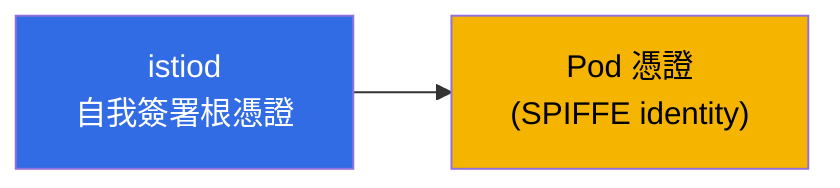
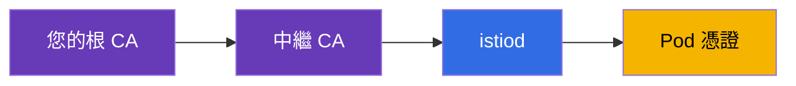
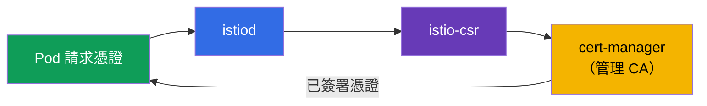
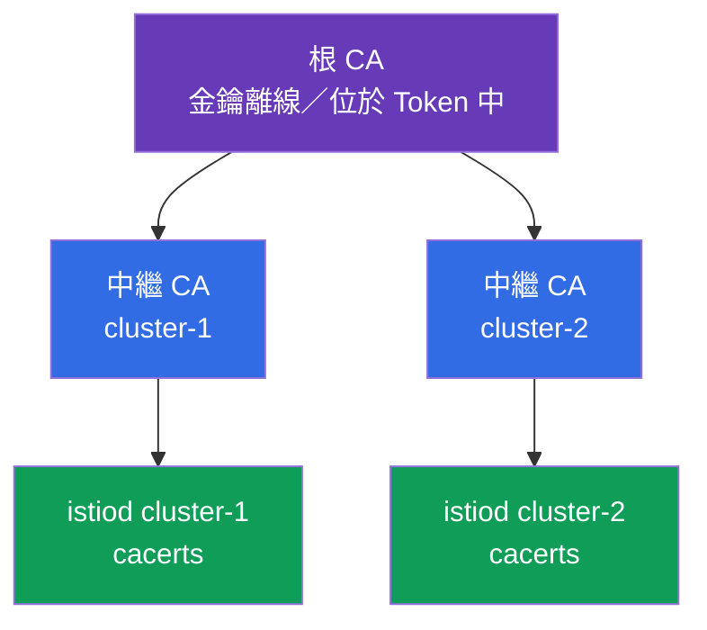
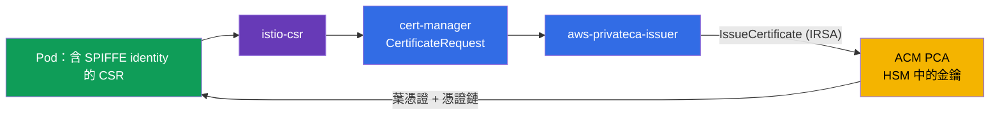
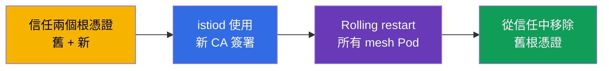

[Русская версия](ru.md) · [Eng version](en.md) · [Versión en español](es.md) · [Version française](fr.md) · [Deutsche Version](de.md) · [ქართული ვერსია](ge.md) · [日本語版](jp.md)

# 第 16 章。憑證管理：自訂 CA、cert-manager 與 istio-csr

> **接下來。** 在第 13 章中，我們啟用了 mTLS，並說明 istiod 會自行簽發及輪換憑證--開箱即用。但在實際正式環境中，您通常需要接入自己的 PKI：企業根 CA、多個叢集的統一信任，以及與外部系統的整合。本章將探討如何以靜態及動態方式（透過 cert-manager）將預設 CA 替換為自己的 CA。

## 16.1. istiod 預設如何簽發憑證

先回顧完全未設定時會發生什麼。istiod 充當憑證授權中心（CA）：啟動時會產生**自我簽署根憑證**，並以此根憑證簽署 mesh 中所有工作負載（Pod）的憑證。



這對起步很方便：無須設定，mTLS 就能運作。但此方式有其限制，因此正式環境經常改用自己的 CA。

### 憑證有效期與根憑證過期風險

這裡有兩種不同的有效期，切勿混淆。

- **Pod 憑證（葉憑證、SVID）**的有效期很短--預設約為 **24 小時**。istiod 會在到期前很早（大約在有效期過半時）自動輪換。您無須操心，輪換完全自動化。
- 自我簽署 istiod 的**根憑證**預設簽發 **10 年**。有效期很長，因此容易被遺忘--這正是陷阱。

關鍵細節：**預設根憑證不會自動輪換。** 葉憑證會，根憑證不會。也就是說，10 年後（若您設定了有效期更短的自訂 CA，則會更早），除非預先處理，憑證就會直接過期。

**根憑證過期時會怎樣。** 這是整個 mesh 規模的災難。所有葉憑證都會建立到根憑證的信任鏈。一旦根憑證過期，mTLS 驗證便會在**所有地方**失敗：服務不再互相信任，其間的流量中斷。復原不是「重新簽發一張憑證」，而是實際上緊急替換根憑證，並在整個 mesh 重建信任（本質上與 16.7 節的 CA 遷移程序相同，只是以事件處理模式進行）。

**最佳實務：**

- 記錄根憑證到期日，並**提前輪換**，不要等到最後一天。Istio 有根憑證輪換程序（透過共用 trust bundle，如同遷移時）。
- 為根憑證與中繼憑證即將到期設定**監控與告警**。
- 若將 CA 交由 **cert-manager** 管理（16.4 節），即可自動化輪換--這也是長期正式環境採用動態方式的另一項理由。
- 自訂 `cacerts` 的有效期由您自行設定--請有意識地選擇，且仍須規劃輪換。

## 16.2. 為何需要自訂 CA

替換預設自我簽署根憑證的理由：

- **多個叢集的統一信任。** 若您使用多叢集 mesh（第 28 章），不同叢集的服務必須互相信任。為此，它們的憑證必須來自**共同根憑證**。每個叢集各有自己的自我簽署 istiod--不會有共同信任。
- **整合企業 PKI。** 公司已有自己的根 CA 與憑證簽發政策。讓 mesh 憑證納入此階層是合理的做法。
- **外部信任與合規性。** 有時外部系統必須信任 mesh 服務的憑證，而安全要求則要求根憑證受到控制並妥善保存（例如在 HSM 中）。

接入自己 CA 有兩種方式：靜態方式（為 istiod 提供準備好的金鑰）與動態方式（istiod 將簽署委派給外部系統--cert-manager）。

## 16.3. 靜態自訂 CA

最直接的方式：您自行產生根 CA 與中繼 CA，而 istiod 使用您的**中繼** CA 簽署 Pod 憑證（根憑證保存在安全位置，不直接使用）。



istiod 會在 `istio-system` namespace 中名為 `cacerts` 的特殊 Secret 尋找您的 CA。其中放入四個檔案：

```bash
kubectl create secret generic cacerts -n istio-system \
  --from-file=ca-cert.pem \      # 中介 CA 憑證
  --from-file=ca-key.pem \       # 其私鑰（istiod 用它簽署）
  --from-file=root-cert.pem \    # 根憑證
  --from-file=cert-chain.pem     # 憑證鏈：中介 + 根
```

建立 Secret 後必須重新啟動 istiod--它在啟動時會讀取 `cacerts`，並開始使用您的中繼 CA 而非自我簽署 CA 簽署 Pod 憑證。重要細節：Istio 預期的正是**憑證鏈**（`cert-chain.pem` = 中繼 + 根），讓接收方可以建立通往根憑證的信任路徑。

此方式的缺點是：CA 金鑰位於 Kubernetes Secret 中，而您必須自行負責其輪換與安全保存。

## 16.4. 動態 CA：cert-manager + istio-csr

更進階且適合「正式環境」的方式，是完全不把 CA 金鑰交給 istiod，而是將憑證簽署委派給外部系統。這裡有兩個元件：

- **cert-manager**--Kubernetes 中熱門的憑證管理 Operator。它能使用各種 CA 來源（自有、Vault、ACME 等）。
- **istio-csr**--Istio 與 cert-manager 間的橋樑。istiod 不自行傳送簽署請求（CSR），而是經由 istio-csr，由其請 cert-manager 簽署憑證。



與靜態 CA 相比，這帶來：

- **CA 金鑰不在 Istio Secret 中。** cert-manager 管理它，並可將其更安全地保存（例如在 Vault 或 HSM），不必讓 istiod 直接存取。
- **自動化。** cert-manager 負責簽發與輪換，其生態系可輕易接入企業 CA 來源。
- **所有憑證共用同一系統。** 您很可能已透過同一個 cert-manager 為 ingress 簽發 TLS 憑證（第 9 章）--現在 mesh 憑證也經由它簽發。

缺點是更多可動元件：必須安裝並設定 cert-manager、issuer 與 istio-csr。對小型安裝而言這是過度配置，對大型正式環境則合理。

實務上需要三項設定。第一項是會簽署 mesh 憑證的 cert-manager **issuer**。最簡單選項是基於含有您 CA 的 Secret 的 `Issuer`（正式環境較常使用 Vault 或 ACM PCA，見下文）：

```yaml
apiVersion: cert-manager.io/v1
kind: Issuer
metadata:
  name: istio-ca
  namespace: istio-system
spec:
  ca:
    secretName: istio-ca-key-pair    # 含您 CA 的 ca.crt/tls.crt/tls.key 的 Secret
```

第二項，透過 Helm 安裝 **istio-csr** 並設定為使用此 issuer--它會接收來自 istiod 的 CSR，並請 cert-manager 進行簽署：

```bash
helm install cert-manager-istio-csr jetstack/cert-manager-istio-csr \
  -n cert-manager \
  --set "app.certmanager.issuer.name=istio-ca" \
  --set "app.certmanager.issuer.kind=Issuer" \
  --set "app.istio.namespace=istio-system"
```

第三項，將 **istiod** 切換為透過 istio-csr 簽發憑證（在 IstioOperator 中將其指定為 CA 位址，並停用 istiod 自有 CA）：

```yaml
apiVersion: install.istio.io/v1alpha1
kind: IstioOperator
spec:
  values:
    global:
      caAddress: cert-manager-istio-csr.cert-manager.svc:443   # istiod 將 CSR 送往此處
```

之後 Pod 憑證將由 cert-manager 經由 `istio-ca` issuer 簽署，而非 istiod 本身。

### AWS：透過 AWS Private CA（ACM PCA）使用企業 PKI

EKS 上常見的正式環境模式：不將根憑證保留在叢集中，而是置於 **AWS Private CA（ACM PCA）**--AWS 代管的憑證授權中心，CA 金鑰存放並受 AWS 端保護（可達 FIPS/HSM 等級）。cert-manager 透過獨立 issuer [aws-privateca-issuer](https://github.com/cert-manager/aws-privateca-issuer) 連接它：

```yaml
apiVersion: awspca.cert-manager.io/v1beta1
kind: AWSPCAClusterIssuer
metadata:
  name: acm-pca
spec:
  arn: arn:aws:acm-pca:eu-central-1:123456789012:certificate-authority/xxxxxxxx
  region: eu-central-1
```

接著將 istio-csr 設定為使用此 issuer（`kind: AWSPCAClusterIssuer`、`group: awspca.cert-manager.io`）。結果是：根憑證與 CA 金鑰位於 ACM PCA（而非叢集），cert-manager 向其請求簽署，而 mesh Pod 從您的企業 AWS 階層取得憑證。istio-csr 對 ACM PCA 的存取透過 IAM 授予（IRSA--ServiceAccount 的角色）。

費用方面：ACM PCA 每月會針對**CA 本身的存在**收費，另加每張已簽發憑證的費用。有兩種模式：通用型（**每個 CA 約 $400/月**）與**短期憑證的 short-lived mode（每個 CA 約 $50/月）**。mesh 工作負載憑證生命週期短且經常輪換，因此 Istio 應選用**short-lived mode**；仍應編列大規模輪換的每張憑證費用。價格依區域而異且會變動--請參閱 AWS 計算器。對實驗與學習來說 ACM PCA 偏貴（CA 存在期間持續計費）--自我簽署 istiod 或 `cacerts` 較便宜。

### 小型組織範例：2 個叢集，共用根憑證

典型情況：有兩個使用 Istio 的叢集，需要共用信任（多叢集，第 28 章），但沒有昂貴 PKI 的預算。極端做法都不適合：每次「土法煉鋼」產生憑證不安全，完整 CA（Vault/HSM）昂貴又麻煩，ACM PCA 則按每個 CA 收費。理想的折衷方案是**離線根憑證 + 每個叢集一個中繼 CA**。

概念是：不安全的並非透過 CLI 建立金鑰，而是**根金鑰位於叢集內**。因此，根憑證只**離線產生一次**（在受保護機器上；金鑰加密或保存在硬體 Token 中），且**不會進入**叢集。用它簽署兩個中繼 CA，並在每個叢集中僅將各自的中繼 CA 作為 `cacerts` 放入（16.3）。



使用 Istio 提供的現成指令碼（`samples/certs`，其中有 Makefile）最容易產生此階層--建立一個根憑證及每個叢集一個中繼憑證：

```bash
# 一次性，在安全的離線機器上
make -f Makefile.selfsigned.mk root-ca                 # 根 CA（金鑰離線保存！）
make -f Makefile.selfsigned.mk cluster-1-cacerts        # cluster-1 的中介憑證
make -f Makefile.selfsigned.mk cluster-2-cacerts        # cluster-2 的中介憑證
```

接著在**每個**叢集中，從各自的中繼組合建立 `cacerts`（根金鑰 `root-key.pem` 保持離線，不放入 Secret）：

```bash
# 於 cluster-1
kubectl create secret generic cacerts -n istio-system \
  --from-file=cluster-1/ca-cert.pem \
  --from-file=cluster-1/ca-key.pem \
  --from-file=cluster-1/root-cert.pem \
  --from-file=cluster-1/cert-chain.pem
# 於 cluster-2 - 從 cluster-2/ 目錄執行相同操作
```

由於兩個中繼憑證均由**共同根憑證**簽署，不同叢集的服務會互相信任--這是多叢集 mesh 的基礎。成本為 **$0**，根金鑰不存於叢集中，且在中繼層級進行輪換（重新簽發根憑證是罕見操作）。

何時值得改用 ACM PCA：若手動保存離線根憑證及重新簽發對您而言過於脆弱，請採用**一個共用 ACM PCA（short-lived mode，約 $50/月）**，並在**兩個**叢集中將 `aws-privateca-issuer` + istio-csr 連接至它--您會得到同樣的共用根憑證，但金鑰位於 AWS HSM 且具備自動化，無須處理離線繁瑣作業。

#### 詳細運作方式（2 個叢集使用同一個 ACM PCA）

**在 AWS 中僅建立一次的內容。** 在 ACM PCA 中建立 CA（為節省成本，使用一個共用 CA；也可使用 Root + Subordinate，但那已是兩個 CA）。其私密金鑰**位於 AWS HSM 中的 ACM PCA 內部**，永不外洩；該 CA 的憑證會成為兩個叢集的共同信任根。CA 位於一個帳戶/區域--若叢集在不同帳戶中，可透過 **AWS RAM** 或資源政策共用 CA。

**在每個叢集安裝的內容**（設定相同，但引用同一 CA）：

- **cert-manager**--憑證 Operator；
- **aws-privateca-issuer**--連線 ACM PCA 的外掛；其中 `AWSPCAClusterIssuer` 在兩個叢集使用 CA 的**相同 ARN**--這就是「共同根憑證」；
- **istio-csr**--接收 Istio 的 CSR，並將其組織為向該 issuer 提出的 cert-manager 請求；
- **istiod** 切換至 istio-csr（`global.caAddress`），不使用自有 CA；
- **IRSA**--aws-privateca-issuer 的 ServiceAccount 取得 IAM 角色，具備此 ARN 的 `acm-pca:IssueCertificate`/`GetCertificate` 權限（不在叢集中使用金鑰的存取）。

**Pod 憑證簽發流程：**



1. Pod 啟動，istio-agent 產生金鑰組與帶有自身 SPIFFE identity 的 CSR；Pod 私密金鑰不會離開 Pod。
2. istio-agent 將 CSR 傳送至 **istio-csr**（它現在是取代 istiod 的 CA endpoint）。
3. istio-csr 在 cert-manager 中建立 `CertificateRequest`。
4. cert-manager 將請求交給 **aws-privateca-issuer**，後者透過 IRSA 呼叫 ACM PCA `IssueCertificate`。
5. ACM PCA 使用其金鑰（在 HSM 中）簽署葉憑證，並回傳憑證 + 憑證鏈。
6. 回傳路徑：ACM PCA → aws-privateca-issuer → cert-manager → istio-csr → istio-agent → Envoy（透過 SDS）。Pod 持有鏈結至 ACM PCA 根憑證的葉憑證。
7. **輪換**：葉憑證生命週期短，istio-agent 在到期前透過同一流程重新請求。ACM PCA 對每次簽發計費--因此 short-lived mode 與用量控管很重要。

**為何叢集互相信任。** 兩個 istio-csr 都指向**同一個** CA，因此兩個叢集中所有葉憑證均鏈結至一個根憑證。根憑證在各叢集以 trust bundle（`istio-ca-root-cert`，16.5）發佈。在 mTLS 握手時，cluster-1 的 Pod 與 cluster-2 的 Pod 針對共同根憑證驗證憑證--驗證通過。這就是多叢集 mesh 的基礎。

**相較於離線根憑證的優點：**根金鑰位於 AWS HSM（不在 Token 也不在 Secret 中），簽發與輪換自動化，N 個叢集的共用根憑證只需使用同一 issuer ARN。缺點是付費（CA + 每張憑證）及依賴 AWS。CA 本身的重新簽發仍由 ACM PCA 管理，而跨 mesh 的根憑證更換透過 trust bundle 進行（16.7）。

##### 一項重要的成本細節：不要讓 ACM PCA 簽發每個葉憑證

ACM PCA 對**每張已簽發憑證**計費，而 Istio 經常輪換葉憑證（葉憑證約存活 24 小時，並大約在有效期過半時更新--每個 Pod 每日約 2 次）。若 Pod 數量很大，「istio-csr → ACM PCA 為每個葉憑證簽發」的方案會使帳單暴增。在 short-lived mode（每張憑證約 $0.058）下估算：1000 個 Pod × 每日約 2 次簽發 × 30 ≈ **60,000 次簽發/月 ≈ 約 $3.5k**，而且這僅是葉憑證。有兩種成本差異極大的模式：

- **選項 1--ACM PCA 簽署每個葉憑證**（istio-csr → ACM PCA，如上述流程）。整個 CA 金鑰位於 HSM，但您為**每張**工作負載憑證付費 → 大規模時昂貴。僅在 Pod 數量少時合理。
- **選項 2--ACM PCA 僅提供中繼 CA，葉憑證由 istiod 自行簽署**（便宜）。ACM PCA（根憑證位於 HSM）為叢集簽發**中繼** CA 憑證；中繼憑證放入 `cacerts`（16.3），之後 istiod 在本機簽署頻繁且短期的葉憑證，**不聯絡 ACM PCA**。ACM PCA 僅對中繼憑證的簽發/重新簽發（罕見）計費 → 實際上每個 CA $50 加上少量費用。

選項 2 的折衷是：**中繼** CA 的私密金鑰會進入叢集（位於 `cacerts`），HSM 中只保留**根憑證**。對大型 mesh 幾乎總是選擇選項 2（istiod 簽署葉憑證，ACM PCA 僅負責根憑證/中繼）。另一個手段是**提高葉憑證 TTL**（較少輪換、較少簽發），但這會削弱安全性，因此主要做法是「istiod 自行簽署葉憑證」。

## 16.5. 驗證憑證

兩種情況下，都應確認 Pod 從正確的 CA 取得憑證。這可透過 `istioctl proxy-config secret` 完成--它會顯示特定 Pod 的憑證。接著可使用 openssl 剖析並查看簽發者：

```bash
POD=$(kubectl get pod -n app -l app=ping-pong -o jsonpath='{.items[0].metadata.name}')

istioctl proxy-config secret "$POD" -n app -o json \
  | jq -r '.dynamicActiveSecrets[] | select(.name=="default") | .secret.tlsCertificate.certificateChain.inlineBytes' \
  | base64 -d | openssl x509 -noout -issuer
```

在 `issuer` 輸出中，您會看到自己的 CA（例如靜態方式為 `O=CKS-Lab, CN=CKS-Lab Intermediate CA`，動態方式為 `O=cert-manager`）。這可確認自訂 CA 確實已生效，而未繼續使用預設 istiod。您也可查看 Subject Alternative Name 欄位中的 SPIFFE identity--其中會有熟悉的 `spiffe://.../ns/.../sa/...`。

Proxy 信任的根憑證由 Istio 在 ConfigMap `istio-ca-root-cert` 中發佈（每個 namespace 都有）。快速查看目前信任根憑證：

```bash
kubectl get configmap istio-ca-root-cert -n app \
  -o jsonpath='{.data.root-cert\.pem}' | openssl x509 -noout -issuer -enddate
```

這在 CA 遷移（16.7）期間很有用：透過此 ConfigMap 可看出 mesh 是否已信任新根憑證，以及目前根憑證何時到期。

## 16.6. 應選擇哪種方式

用實用的決策表總結。

| 情境 | 建議 |
|----------|--------------|
| 學習、示範、單一叢集 | 預設 istiod CA--無須設定 |
| 正式環境、單一叢集、沒有 PKI 要求 | 預設方式可用，但應立即思考未來（見下文） |
| 計畫使用多叢集 | 從一開始就必須使用共用自訂 CA |
| 有企業 PKI 或合規要求 | 自訂 CA（靜態或動態） |
| 小型團隊、一次性設定 | 靜態 CA（`cacerts`） |
| 需要自動化，不將 CA 金鑰存於 Istio | 動態：cert-manager + istio-csr |

主要分水嶺是**您是否會有多叢集或 PKI 要求**。若有，自訂 CA 必不可少。此時會出現重要問題：立即設定，還是日後遷移？我們來看看，因為「日後」代價高昂。

## 16.7. 從預設 CA 遷移至自有 PKI

想像一下：mesh 已在正式環境使用 istiod 自我簽署根憑證運作，現在需要改用企業 CA。問題在於我們正在變更**信任根憑證**，而所有執行中 Pod 的憑證都與舊根憑證繫結。

天真的做法「只要放入新的 `cacerts` 並重新啟動 istiod」很危險：使用舊憑證（由舊根簽署）的 Pod 與使用新憑證的 Pod 將不再互相信任，彼此的 mTLS 流量會中斷。這是通往整個 mesh 停機的直接路徑。

正確遷移應透過**共用 trust bundle**完成--也就是 mesh 同時信任舊根與新根的一段期間：



逐步邏輯：

1. 將新根憑證加入 trust bundle--現在所有 Proxy 都信任由舊根及新根簽署的憑證。尚未有任何一方失去信任。
2. 切換 istiod，使其使用新的（中繼）CA 簽署。
3. 逐步重新啟動 Pod--重新建立時，它們會取得新 CA 的憑證。目前 mesh 中新舊憑證並存，但兩者都受信任。
4. 當**所有** Pod 都取得新憑證後，從信任中移除舊根憑證。

### 遷移風險

- **出錯時停機。** 若略過共用 trust bundle 階段，部分流量將中斷--舊憑證與新憑證不會互相信任。
- **整個 mesh 的 rolling restart。** 必須重新建立所有 namespace 的全部 Pod。對大型叢集而言，這是重大且高風險的操作，某些工作負載（stateful）也很難重啟。
- **憑證鏈錯誤。** `cert-chain.pem` 順序錯誤或根憑證不相符，會完全破壞信任。
- **多叢集使一切更複雜。** 必須在各叢集之間同步遷移，否則跨叢集流量會中斷。
- **istiod 重啟與不穩定窗口。** 遷移期間必須格外關注 control plane 與憑證簽發。

### 組織的最佳實務

由此得出的首要建議是：**立即投入時間設定 PKI，比日後遷移運作中的 mesh 更便宜。**

- **第一天就決定 CA。** 在空叢集接入自訂 CA 只需幾個指令且沒有風險。在有數百個服務的運作中 mesh，則需要 trust bundle、完整 rolling restart 與風險窗口。
- **只要有一點可能會需要多叢集或 PKI 要求--立即設定自訂 CA。** 這是廉價保險。多叢集根本無法在沒有共同根憑證下「日後補做」。
- **從一開始自動化。** 若組織有 PKI 要求，立即設定 cert-manager + istio-csr--之後無須從手動 `cacerts` 遷移。
- **安全保存根 CA**（離線或在 HSM），mesh 中僅使用中繼憑證。
- **若遷移仍不可避免**--務必先在 staging 演練，透過 trust bundle 進行，並規劃 rolling restart 窗口。

簡短規則：CA 與信任是建築地基的一部分。在一棟仍在運作的建築下重做地基，總是比一開始就正確鋪設更昂貴且更有風險。

## 16.8. SPIRE 作為替代 identity 來源

完整起見：憑證簽署不僅可委派給 cert-manager，也可委派給 **SPIRE**--SPIFFE 標準的參考實作（第 13 章）。Istio 可經由 SDS 與 SPIRE 整合，此時 Pod identity 與憑證由 SPIRE 而非 istiod 簽發。當您需要更嚴格的**工作負載驗證**（SPIRE 透過節點/程序屬性驗證 Pod 是否確實為其所聲稱的身分）、Kubernetes 以外（VM、其他平台）的統一 SPIFFE 信任，或基礎設施中已存在 SPIRE 時，便會採用此方式。對大多數安裝而言這是過度配置--istiod 或 cert-manager 已足夠--但了解這個選項很有用。

## 16.9. 最佳實務

- **第一天就決定 CA。** 空叢集中的自訂 CA 只需幾個指令；運作中的 mesh 則是 trust bundle + 完整 rolling restart + 風險窗口（16.7）。
- **規劃根憑證輪換並監控有效期。** 根憑證不會自行輪換；為根憑證與中繼憑證即將到達的 `enddate` 設定告警（透過 `istio-ca-root-cert` 檢查，16.5）。
- **根憑證應離線或置於 HSM/ACM PCA**，mesh 中只使用中繼 CA。如此叢集遭入侵時不會洩漏根金鑰。
- **自動化簽發。** 對長期正式環境使用 cert-manager + istio-csr（或 EKS 上的 ACM PCA）：CA 金鑰不在 Istio 中，輪換自動化。
- **多叢集使用一個共同根憑證**（第 28 章）--立即建置，否則無法在不遷移的情況下「日後補齊」共同信任。
- **維持正確憑證鏈。** `cert-chain.pem` = 中繼 + 根，且順序正確；憑證鏈錯誤將完全破壞信任。
- **在 staging 演練遷移。** 若遷移至自有 CA 不可避免--只能經由共用 trust bundle，並在已規劃的 rolling restart 窗口進行。

## 16.10. 本章總結

- 預設情況下 istiod 自行產生自我簽署根憑證，並用它簽署 Pod 憑證；開箱即用，但有其限制。
- Pod 葉憑證約存活 24 小時並自動輪換；根憑證預設簽發 10 年，且**不會自動輪換**。根憑證過期時--整個 mesh 的 mTLS 會中斷；必須預先規劃根憑證輪換（或交由 cert-manager），並監控有效期。
- 自訂 CA 是多叢集統一信任、整合企業 PKI 與安全/合規要求所必需。
- **靜態 CA：**將根憑證、中繼 CA 與憑證鏈放入 `istio-system` 的 `cacerts` Secret；istiod 使用您的中繼 CA 簽署 Pod 憑證。
- Istio 預期的正是憑證鏈（`cert-chain.pem` = 中繼 + 根）。
- **動態 CA（cert-manager + istio-csr）：**istiod 經 istio-csr 將簽署委派給 cert-manager；CA 金鑰不存於 Istio，且一切自動化。
- `istioctl proxy-config secret` + openssl 可協助檢查憑證由哪個 CA 簽署；mesh 信任根憑證位於 ConfigMap `istio-ca-root-cert`（每個 namespace 中）。
- 在 EKS 上可透過 cert-manager（`aws-privateca-issuer`）+ istio-csr，使用 **AWS Private CA（ACM PCA）**方便地建立企業 PKI--CA 金鑰留在 AWS 而非叢集。ACM PCA 需付費：通用型每個 CA 約 $400/月，short-lived mode 約 $50/月（mesh 選用 short-lived）+ 每次簽發費用。
- 小型組織使用兩個叢集的經濟選項是**離線根憑證 + 每個叢集一個中繼憑證**（`cacerts`）：$0，根金鑰在叢集外，共同根憑證提供多叢集信任。
- ACM PCA 對**每次**簽發計費，而 Istio 葉憑證經常輪換：不要讓 ACM PCA 簽發每個葉憑證。廉價方式是 ACM PCA 只提供**中繼** CA（置於 `cacerts`），葉憑證由 **istiod 本身**簽署；ACM PCA 逐葉簽發在大規模下昂貴。
- 也可將憑證簽署委派給 **SPIRE**（嚴格工作負載驗證、Kubernetes 以外的信任）--這是複雜情境的選項。
- 從預設 CA 遷移到自有 CA 透過共用 trust bundle（信任兩個根憑證）、完整 rolling restart，然後移除舊根憑證來完成；停機風險高。
- 最佳實務：立即建置自訂 CA（特別是可能使用多叢集或有 PKI 要求時）--比遷移運作中的 mesh 更便宜且安全。

## 16.11. 自我檢查問題

1. istiod 預設如何簽發憑證？此方式的限制是什麼？
2. 請列出接入自訂 CA 的理由。
3. `cacerts` Secret 中放入什麼？istiod 用哪張憑證簽署 Pod？
4. 為何 Istio 要求的正是憑證鏈（`cert-chain.pem`）？
5. 動態 CA（cert-manager + istio-csr）比靜態 CA 好在哪裡？缺點是什麼？
6. 如何檢查特定 Pod 的憑證由哪個 CA 簽署？
7. 為何不能只放入新的 `cacerts` 並在運作中的 mesh 重新啟動 istiod？安全遷移應如何進行？
8. 為何最好一開始就建置自訂 CA，而非日後遷移？
9. 根憑證預設簽發多久？它會自行輪換嗎？過期時會發生什麼？
10. 動態 CA（cert-manager + istio-csr）需要設定哪三項內容？istiod 如何得知要將 CSR 傳至何處？
11. 如何在 EKS 上建立企業 PKI，且不將 CA 金鑰存於叢集中？
12. 在哪裡查看目前 mesh 信任根憑證？這在 CA 遷移中為何必要？
13. ACM PCA 的費用是多少？Istio 選用哪種模式？為什麼？
14. 小型組織如何不使用昂貴 PKI、也不將根金鑰存於叢集，為兩個叢集提供共同信任？
15. 為何從 ACM PCA 簽發每張葉憑證成本高？如何降低成本（此時誰簽署葉憑證，中繼 CA 金鑰又在哪裡）？

## 實作練習

練習將靜態自訂 CA（根憑證 + 中繼憑證）接入 istiod：

🧪 實驗 19：[tasks/ica/labs/19](../../labs/19/README_TW.MD)

練習透過 cert-manager 與 istio-csr 動態簽發憑證：

🧪 實驗 26：[tasks/ica/labs/26](../../labs/26/README_TW.MD)

---
[目錄](../README_TW.md) · [第 15 章](../15/tw.md) · [第 17 章](../17/tw.md)
