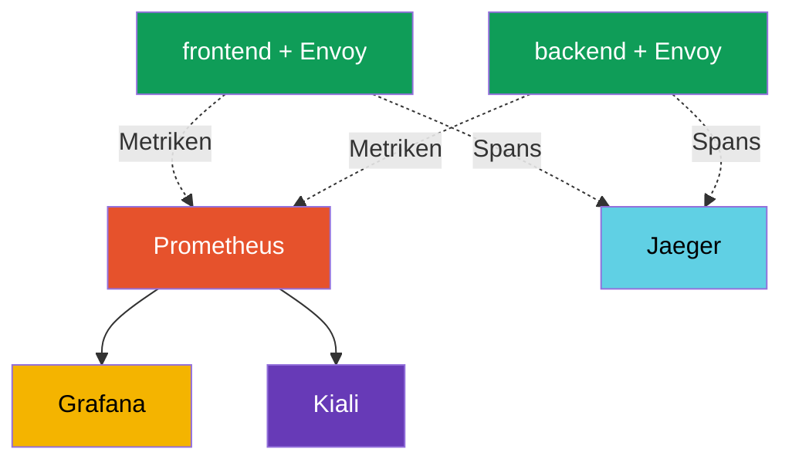

[RU version](ru.md) · [Eng version](en.md) · [Versión en español](es.md) · [Version française](fr.md)

# Kapitel 17. Observability: Prometheus, Grafana, Jaeger, Kiali

> **Was kommt als Nächstes.** Wir haben gelernt, Traffic zu steuern und abzusichern. Jetzt
> lernen wir, zu **sehen**, was im Mesh passiert. Wenn es viele Services gibt und etwas
> langsam wird, muss man schnell verstehen: wo, wie viele Fehler, welche Latenz, wer wen
> aufruft. Istio sammelt diese gesamte Telemetrie automatisch. In diesem Kapitel betrachten
> wir die Werkzeuge, die sie anzeigen: Prometheus, Grafana, Jaeger und Kiali.

## 17.1. Die drei Säulen der Observability

Observability (Beobachtbarkeit) ist die Fähigkeit, anhand externer Signale zu verstehen, was
innerhalb eines Systems passiert. Üblicherweise unterteilt man sie in drei Säulen:

- **Metriken (metrics)** - Zahlen über die Zeit: wie viele Anfragen pro Sekunde, Fehleranteil,
  Latenz. Sie beantworten die Frage „stimmt etwas nicht und wie stark".
- **Traces (traces)** - der Weg einer einzelnen Anfrage durch alle Services. Sie beantworten die
  Frage „wo genau klemmt es".
- **Logs (logs)** - Aufzeichnungen über konkrete Ereignisse. Sie beantworten die Frage „was genau
  passiert ist".

Der zentrale Vorteil von Istio: Der Sidecar-Proxy sieht jede Anfrage, deshalb werden Metriken und
Traces **automatisch, ohne Änderung des Anwendungscodes** gesammelt.

## 17.2. Werkzeuge und wie sie zusammenhängen

Istio erzeugt die Telemetrie selbst, aber gespeichert und angezeigt wird sie von separaten
Werkzeugen (Addons). Jedes hat seine eigene Aufgabe:

- **Prometheus** - sammelt und speichert Metriken.
- **Grafana** - zeichnet Dashboards auf Basis der Prometheus-Metriken.
- **Jaeger** - speichert und zeigt verteilte Traces.
- **Kiali** - baut den Service-Graph des Mesh auf Basis der Metriken.



Wichtig: Istio zwingt diese Werkzeuge nicht auf. Es **exportiert** lediglich Metriken und Spans,
und welches Prometheus/Jaeger Sie verwenden, ist Ihre Entscheidung. Für einen schnellen Einstieg
liefert Istio fertige Addon-Manifeste mit (Abschnitt 17.6).

## 17.3. Metriken und Prometheus

Envoy zählt in jedem Pod die Metriken jeder Anfrage und gibt sie an Prometheus. Die wichtigsten
(sie werden „goldene Signale" genannt):

- **`istio_requests_total`** - Anfragenzähler. Damit berechnet man RPS und Fehleranteil.
- **`istio_request_duration_milliseconds`** - Latenz der Anfragen.

Jede Metrik verfügt über einen reichen Satz an Labels: `source_workload`, `destination_workload`,
`response_code`, `destination_service` und weitere. Dank ihnen kann man zum Beispiel betrachten,
„wie viele 5xx-Antworten der Service payments an Anfragen von frontend zurückgegeben hat".

Für Nicht-HTTP-Traffic (TCP, Datenbanken, Broker - Kapitel 10) gibt es keine HTTP-Metriken, aber
eigene: `istio_tcp_connections_opened_total`, `istio_tcp_connections_closed_total`,
`istio_tcp_sent_bytes_total` / `istio_tcp_received_bytes_total` - damit betrachtet man Verbindungen
und Traffic-Volumen.

Eine Metrik kann man direkt über die Prometheus-API abfragen:

```bash
kubectl exec -n default deploy/curl-client -c curl -- \
  curl -s 'http://prometheus.istio-system:9090/api/v1/query?query=istio_requests_total{destination_service_name="ping-pong"}'
```

Ein Ergebnis ungleich null bedeutet, dass Prometheus die Istio-Metriken sammelt. Genau diese
Metriken bilden die Grundlage der Grafana-Dashboards, des Kiali-Graphen und zum Beispiel des
automatischen Canary in Flagger (Kapitel 25).

## 17.4. Grafana: Dashboards

Prometheus speichert Metriken, aber auf rohe Zahlen zu schauen ist unbequem. **Grafana** zeichnet
daraus Diagramme. Istio liefert fertige Dashboards mit: eine allgemeine Mesh-Übersicht, ein
Dashboard nach Services, nach Workloads und über die control plane (istiod) selbst.

In den Dashboards sehen Sie sofort RPS, Fehleranteil und Latenzperzentile (p50, p90, p99) pro
Service - ohne manuelle Konfiguration der Abfragen. Für den Zugriff auf die UI verwendet man
üblicherweise port-forward:

```bash
kubectl -n istio-system port-forward svc/grafana 3000:3000
```

## 17.5. Distributed Tracing und Jaeger

Metriken sagen „der Service payments ist langsam", aber eine Anfrage durchläuft üblicherweise
mehrere Services, und man muss verstehen, **auf welchem Abschnitt** Zeit verloren geht. Das ist die
Aufgabe des verteilten Tracings. Eine Anfrage erzeugt eine Kette von **Spans** - ein Span pro
Service - und zusammen bilden sie einen **Trace**. **Jaeger** speichert und zeigt diese Traces.


In Jaeger sieht eine solche Anfrage aus wie eine Kette von Spans `gateway -> frontend -> backend ->
database` mit der Latenz auf jedem Abschnitt, und man sieht sofort, wo der Engpass liegt.

**Die wichtigste Feinheit des Tracings.** Istio erzeugt Spans automatisch, aber es gibt eine
Bedingung, die oft übersehen wird: Die Anwendung **muss die Tracing-Header** aus der eingehenden
Anfrage in die ausgehenden weitergeben. Envoy fügt Header hinzu (`x-request-id`, `traceparent`,
`b3` u. a.), aber eine eingehende Anfrage mit einer ausgehenden verknüpfen kann nur die Anwendung
selbst - sie muss diese Header kopieren, wenn sie den nächsten Service aufruft.

Wenn die Anwendung das nicht tut, zerfällt der Trace in einzelne unverbundene Stücke: Sie sehen
Spans, können sie aber nicht zu einer Kette zusammensetzen. Das ist das Einzige, was vom
Anwendungscode für das Tracing verlangt wird - einige Header weiterzureichen.

Ein weiterer Parameter ist das **Sampling**. Standardmäßig sendet Istio nur einen kleinen Anteil
der Anfragen in die Traces (etwa 1 %), um keine überflüssige Last zu erzeugen. Zum Debuggen kann
der Anteil über die Telemetry API auf 100 % erhöht werden (ausführlich in Kapitel 18).

**OpenTelemetry - der aktuelle Standard.** Jaeger ist hier eher ein „Backend zur Anzeige von
Traces", und die Art ihrer Zustellung hat die Branche selbst um **OpenTelemetry (OTel)** vereinheitlicht:
Die eigenen Client-SDKs von Jaeger gelten zugunsten von OTel bereits als veraltet. Istio kann Traces
über das Protokoll **OTLP** über den Provider `opentelemetry` senden (konfiguriert in MeshConfig und
Telemetry API, Kapitel 18), und auf der Empfangsseite kann alles stehen, was OTLP unterstützt -
Jaeger, Grafana Tempo, ein Cloud-Service. Oft steht in der Mitte ein **OpenTelemetry Collector**: ein
Proxy-Aggregator, an den Envoy Spans schickt und der sie dann an ein oder mehrere Backends leitet.
Praktische Schlussfolgerung: „Jaeger" in diesem Kapitel steht für UI/Speicher, und als Transport der
Traces wählt man heute OTLP.

## 17.6. Kiali: Service-Graph

**Kiali** beantwortet die Frage „wie ist mein Mesh überhaupt aufgebaut und was passiert darin
gerade". Es baut einen anschaulichen Graphen: welche Services es gibt, wer wen aufruft, wie viel
Traffic über jede Verbindung läuft, wo Fehler auftreten. Der Graph wird auf Basis der
Prometheus-Metriken aufgebaut.

Kiali ist praktisch, um das Gesamtbild zu sehen, Services ohne Traffic zu finden, einen
Fehleranstieg auf einer konkreten Verbindung zu bemerken und sogar die Istio-Konfiguration zu
prüfen (es hebt häufige Probleme hervor). Wenn man an Kiali ein Tracing-Backend (Jaeger/Tempo)
anbindet, kann es auch **Traces direkt aus dem Graphen** anzeigen - mit einem Klick auf einen
Service kann man in das Tracing einer konkreten Anfrage eintauchen, ohne in eine separate
Jaeger-UI zu wechseln. Zugriff auf die UI:

```bash
kubectl -n istio-system port-forward svc/kiali 20001:20001
```

## 17.7. Installation der Addons

Alle vier Werkzeuge liefert Istio als fertige Manifeste im Verzeichnis `samples/addons` der
heruntergeladenen Distribution:

```bash
REL=release-1.29
kubectl apply -f https://raw.githubusercontent.com/istio/istio/$REL/samples/addons/prometheus.yaml
kubectl apply -f https://raw.githubusercontent.com/istio/istio/$REL/samples/addons/grafana.yaml
kubectl apply -f https://raw.githubusercontent.com/istio/istio/$REL/samples/addons/jaeger.yaml
kubectl apply -f https://raw.githubusercontent.com/istio/istio/$REL/samples/addons/kiali.yaml
```

Wichtig: Diese Manifeste sind für Demo und Lernen. In der Produktion verwendet man üblicherweise
eigene, bereits ausgerollte Prometheus und Grafana (zum Beispiel aus kube-prometheus-stack), und
Istio wird so konfiguriert, dass es Metriken und Traces an diese sendet.

## 17.8. Best Practices für die Produktion

Die Addons aus `samples/addons` sind für die Demo. Im realen Betrieb ist der Ansatz ein anderer.

**Metriken und Prometheus:**

- Verwenden Sie kein Demo-Prometheus. Rollen Sie einen vollwertigen Stack aus (kube-prometheus-stack
  / Prometheus Operator) mit Retention, HA und remote-write in einen Langzeitspeicher (Thanos,
  Mimir, VictoriaMetrics). Demo-Prometheus hält die Daten im Speicher und verliert sie beim Neustart.
- Achten Sie auf die **Kardinalität der Metriken**. Istio-Metriken haben viele Labels (source,
  destination, response_code usw.), und in einem großen Mesh kann das Prometheus über den
  Speicher „sprengen". Überflüssige Labels und Metriken entfernen Sie über die Telemetry API
  (Kapitel 18).
- Überwachen Sie unbedingt die **control plane selbst** (istiod) und nicht nur die Anwendungen:
  Ihre Metriken zeigen den Zustand der Konfigurationsausbringung und der Zertifikate.

**Tracing:**

- Setzen Sie in der Produktion das **Sampling nicht auf 100 %** - das ist überflüssige Last und
  Volumen. Üblich sind 1-5 %, und für punktuelles Debugging erhöht man es temporär oder verwendet
  force-trace.
- Verwenden Sie in der Produktion kein Jaeger all-in-one (Speicher). Man braucht ein Backend mit
  persistentem Speicher (Elasticsearch, Cassandra) oder eine Managed-Lösung (Grafana Tempo,
  Cloud-Services).
- Denken Sie daran: Damit Traces nicht abreißen, müssen die Anwendungen die Tracing-Header
  weitergeben (Abschnitt 17.5).

**Logs:**

- Die Access-Logs von Envoy sind umfangreich. Aktivieren Sie kein Full Access Log für das gesamte
  Mesh - aktivieren Sie es selektiv (nach namespace/Service) über die Telemetry API (Kapitel 18)
  oder begrenzen Sie das Format.

**Dashboards, Alerts und Zugriff:**

- Richten Sie **Alerts auf die goldenen Signale** ein: Fehleranteil (5xx), Latenz p99, Sättigung.
  Das bloße Vorhandensein von Dashboards ersetzt keine Alerts.
- Halten Sie Kiali in der Produktion im read-only-Modus und beschränken Sie den Zugriff - durch es
  ist die gesamte Topologie des Mesh sichtbar.
- Stellen Sie Grafana, Kiali und Jaeger nicht ohne Authentifizierung nach außen. Verstecken Sie sie
  hinter einem ingress mit Autorisierung (oder Zugriff nur über port-forward/VPN).

**Observability auf EKS/AWS.** Wenn man Prometheus/Grafana/Jaeger nicht selbst betreiben möchte,
gibt es auf AWS Managed Services, und Istio lässt sich damit standardmäßig verbinden:

- **Amazon Managed Service for Prometheus (AMP)** - ein verwalteter Metrik-Speicher. Ein eigenes
  Prometheus (Agent-Modus) oder ein ADOT-Collector macht `remote_write` in AMP; Speicherung und
  Skalierung liegen auf der AWS-Seite.
- **Amazon Managed Grafana (AMG)** - ein verwaltetes Grafana mit fertiger Integration von AMP und
  X-Ray; hierhin stellt man auch die Istio-Dashboards.
- **AWS Distro for OpenTelemetry (ADOT)** - ein OpenTelemetry-Collector-Build von AWS. Envoy schickt
  Metriken/Traces per OTLP an ADOT, und dieser verteilt sie an AMP (Metriken), **AWS X-Ray** oder
  Tempo (Traces), CloudWatch (Logs).
- **Tracing - in AWS X-Ray** über OTLP/ADOT (statt eines eigenständigen Jaeger).
- **Logs** von Envoy - in **CloudWatch Logs** (über Fluent Bit / CloudWatch agent auf den Nodes).

Den Zugriff auf AMP/AMG/X-Ray gewährt man über IAM (IRSA am ServiceAccount des Collectors), Secrets
und Skalierung sind Sache von AWS. Es ist dasselbe Prinzip wie mit ACM PCA in Kapitel 16: den
Betrieb einem Managed Service überlassen und im cluster nur den Exporter/Collector halten.

Kurze Regel: Der Demo-Stack ist gut, um „mal anzufassen", aber die Produktion baut man auf einem
dedizierten, skalierbaren und abgesicherten Observability-Stack mit Alerts und vernünftigem Sampling.

## 17.9. Zusammenfassung des Kapitels

- Observability ruht auf drei Säulen: Metriken, Traces, Logs.
- Istio sammelt Metriken und Traces automatisch - der Sidecar sieht jede Anfrage, der
  Anwendungscode muss nicht geändert werden.
- **Prometheus** speichert Metriken (`istio_requests_total`,
  `istio_request_duration_milliseconds`) mit reichen Labels; das sind die goldenen Signale des Mesh.
- **Grafana** zeichnet fertige Istio-Dashboards auf Basis der Metriken.
- **Jaeger** zeigt verteilte Traces - den Weg einer Anfrage durch die Services und wo es klemmt.
- **Kiali** baut den Service-Graph des Mesh auf Basis der Prometheus-Metriken.
- Für das Tracing muss die Anwendung die **Tracing-Header** aus den eingehenden Anfragen in die
  ausgehenden **weitergeben**, sonst zerfällt der Trace.
- Der Transport der Traces ist heute **OpenTelemetry/OTLP** (die Jaeger-Clients sind veraltet);
  Istio schickt Spans per OTLP über den Provider `opentelemetry`, oft über einen OpenTelemetry
  Collector, und Jaeger fungiert als UI/Speicher.
- Für Nicht-HTTP-Traffic gibt es eigene Metriken `istio_tcp_*` (Verbindungen, Bytes).
- Die Addons aus `samples/addons` sind gut für die Demo; in der Produktion bindet man eigene
  Prometheus/Grafana an.
- Produktionspraktiken: ein dediziertes, skalierbares Prometheus mit Retention und remote-write,
  Kontrolle der Metrik-Kardinalität, Trace-Sampling von 1-5 %, ein persistentes Trace-Backend,
  selektive Access-Logs, Alerts auf die goldenen Signale, abgesicherter Zugriff auf die UI,
  Überwachung von istiod selbst.
- Auf EKS kann man Observability an Managed Services übergeben: **AMP** (Metriken), **AMG**
  (Grafana), **ADOT** (OpenTelemetry Collector), **X-Ray** (Traces), CloudWatch (Logs); Zugriff über
  IRSA.

## 17.10. Fragen zur Selbstüberprüfung

1. Nennen Sie die drei Säulen der Observability und welche Fragen jede beantwortet.
2. Warum sammelt Istio Metriken und Traces ohne Änderung des Anwendungscodes?
3. Welche Istio-Metriken gelten als goldene Signale und welche nützlichen Labels haben sie?
4. Wofür sind Grafana, Jaeger und Kiali zuständig?
5. Was muss die Anwendung tun, damit Traces nicht in Stücke zerfallen?
6. Warum sollte man die Addons aus `samples/addons` nicht so wie sie sind in der Produktion einsetzen?
7. Nennen Sie die zentralen Produktionspraktiken der Observability: Was tut man mit dem
   Trace-Sampling, der Metrik-Kardinalität, der Speicherung von Metriken/Traces und dem Zugriff auf
   die UI?
8. Was ist OpenTelemetry/OTLP und welche Rolle hat Jaeger bei einem solchen Transport der Traces?
9. Welche Managed Services von AWS nutzt man für die Observability von Istio auf EKS und was macht
   ADOT?
10. Mit welchen Metriken betrachtet man Nicht-HTTP-Traffic (TCP)?

## Praxis

Rollen Sie den Observability-Stack aus (Prometheus, Grafana, Jaeger, Kiali), erzeugen Sie Traffic
und prüfen Sie Metriken, Traces und den Service-Graph:

🧪 Lab 08: [tasks/ica/labs/08](../../labs/08/README_DE.MD)

---
[Inhaltsverzeichnis](../README_DE.md) · [Kapitel 16](../16/de.md) · [Kapitel 18](../18/de.md)
