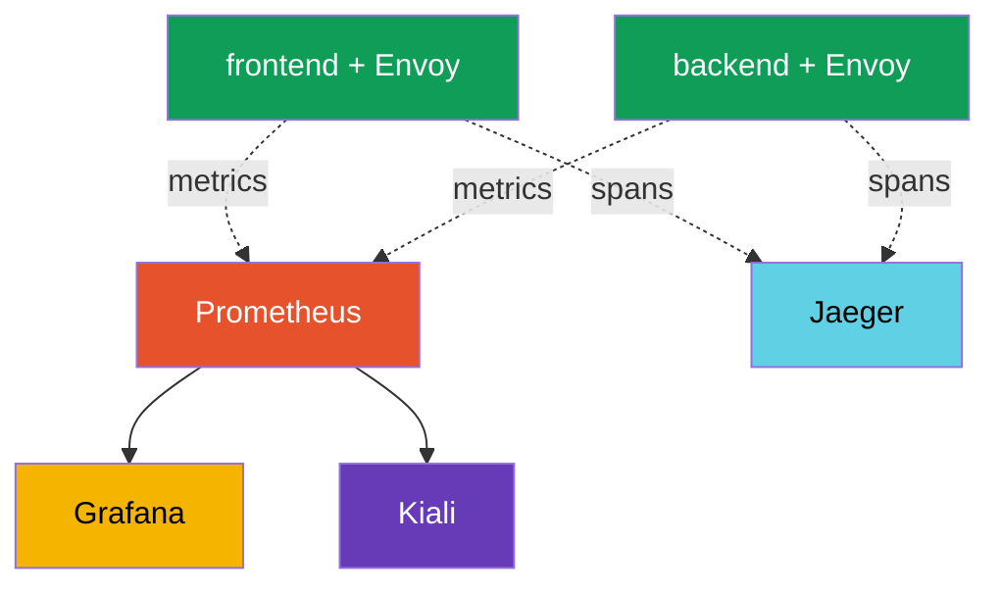

[RU version](ru.md) · [Versión en español](es.md)

# Chapter 17. Observability: Prometheus, Grafana, Jaeger, Kiali

> **What's next.** We have learned to manage traffic and protect it. Now we will learn to
> **see** what happens in the mesh. When there are many services and something is slow, you need
> to quickly understand: where, how many errors, what latency, who calls whom. Istio collects all
> this telemetry automatically. In this chapter we look at the tools that display it: Prometheus,
> Grafana, Jaeger and Kiali.

## 17.1. The three pillars of observability

Observability is the ability to understand what is happening inside a system from its external
signals. It is usually split into three pillars:

- **Metrics** - numbers over time: how many requests per second, the error rate, latency. They
  answer the question "is something wrong and by how much".
- **Traces** - the path of a single request through all services. They answer the question "where
  exactly is the bottleneck".
- **Logs** - records of specific events. They answer the question "what exactly happened".

Istio's key advantage: the sidecar proxy sees every request, so metrics and traces are collected
**automatically, without changing the application code**.

## 17.2. The tools and how they relate

Istio itself generates telemetry, but separate tools (addons) store and display it. Each for its
own task:

- **Prometheus** - collects and stores metrics.
- **Grafana** - draws dashboards on top of the Prometheus metrics.
- **Jaeger** - stores and displays distributed traces.
- **Kiali** - builds a service graph of the mesh on top of the metrics.



Important: Istio does not force these tools on you. It only **exports** metrics and spans, and
which Prometheus/Jaeger to use is your choice. For a quick start Istio ships ready addon
manifests (section 17.6).

## 17.3. Metrics and Prometheus

Envoy in each pod counts metrics per request and hands them to Prometheus. The most important
ones (called the "golden signals"):

- **`istio_requests_total`** - the request counter. RPS and the error rate are computed from it.
- **`istio_request_duration_milliseconds`** - the request latency.

Every metric has a rich set of labels: `source_workload`, `destination_workload`,
`response_code`, `destination_service` and others. Thanks to them you can look at, for example,
"how many 5xx responses the payments service returned to requests from frontend".

For non-HTTP traffic (TCP, databases, brokers - chapter 10) there are no HTTP metrics, but there
are their own: `istio_tcp_connections_opened_total`, `istio_tcp_connections_closed_total`,
`istio_tcp_sent_bytes_total` / `istio_tcp_received_bytes_total` - used to watch connections and
traffic volume.

You can query a metric directly through the Prometheus API:

```bash
kubectl exec -n default deploy/curl-client -c curl -- \
  curl -s 'http://prometheus.istio-system:9090/api/v1/query?query=istio_requests_total{destination_service_name="ping-pong"}'
```

A non-zero result means Prometheus is collecting Istio metrics. It is exactly these metrics that
underlie the Grafana dashboards, the Kiali graph and, for example, automatic canary in Flagger
(chapter 25).

## 17.4. Grafana: dashboards

Prometheus stores metrics, but looking at raw numbers is inconvenient. **Grafana** draws graphs
from them. Istio ships ready dashboards: a general mesh overview, a per-service dashboard, a
per-workload one and one for the control plane itself (istiod).

On the dashboards you immediately see RPS, the error rate and the latency percentiles (p50, p90,
p99) per service - without manually configuring queries. For access to the UI, port-forward is
usually used:

```bash
kubectl -n istio-system port-forward svc/grafana 3000:3000
```

## 17.5. Distributed tracing and Jaeger

Metrics say "the payments service is slow", but a request usually passes through several services,
and you need to understand **on which segment** the time is lost. This is the task of distributed
tracing. One request produces a chain of **spans** - one span per service - and together they form
a **trace**. **Jaeger** stores and displays these traces.


In Jaeger such a request looks like a chain of spans `gateway -> frontend -> backend -> database`
with the latency on each segment, and you immediately see where the bottleneck is.

**The most important subtlety of tracing.** Istio generates spans automatically, but there is one
condition that is often missed: the application **must propagate the tracing headers** from the
incoming request into the outgoing ones. Envoy adds the headers (`x-request-id`, `traceparent`,
`b3` and others), but only the application itself can link an incoming request with an outgoing
one - it must copy these headers when it calls the next service.

If the application does not do this, the trace falls apart into separate unconnected pieces: you
will see spans but will not be able to assemble them into a single chain. This is the only thing
required from the application code for tracing - to propagate a few headers.

Another parameter is **sampling**. By default Istio sends only a small fraction of requests to
traces (about 1%), so as not to create extra load. For debugging the fraction can be raised to
100% via the Telemetry API (in detail in chapter 18).

**OpenTelemetry is the current standard.** Jaeger here is more of a "backend for displaying
traces", while the industry has unified the way they are delivered around **OpenTelemetry (OTel)**:
Jaeger's own client SDKs have already been deprecated in favor of OTel. Istio can send traces over
the **OTLP** protocol via the `opentelemetry` provider (configured in MeshConfig and the Telemetry
API, chapter 18), and on the receiving side anything with OTLP support can stand - Jaeger, Grafana
Tempo, a cloud service. Often an **OpenTelemetry Collector** is put in the middle: a proxy
aggregator to which Envoy sends spans, and which then routes them to one or several backends. The
practical takeaway: "Jaeger" in this chapter is about the UI/storage, while the transport of
traces today is chosen to be OTLP.

## 17.6. Kiali: the service graph

**Kiali** answers the question "how is my mesh actually built and what is happening in it right
now". It builds a visual graph: which services there are, who calls whom, how much traffic goes
over each connection, where the errors are. The graph is built on top of the Prometheus metrics.

Kiali is convenient for seeing the overall picture, finding services with no traffic, spotting a
spike of errors on a specific connection and even checking the Istio configuration (it highlights
common problems). If you connect a tracing backend to Kiali (Jaeger/Tempo), it can also show
**traces right from the graph** - by clicking on a service you can drill into the trace of a
specific request without switching to a separate Jaeger UI. Access to the UI:

```bash
kubectl -n istio-system port-forward svc/kiali 20001:20001
```

## 17.7. Installing the addons

Istio ships all four tools as ready manifests in the `samples/addons` directory of the downloaded
distribution:

```bash
REL=release-1.29
kubectl apply -f https://raw.githubusercontent.com/istio/istio/$REL/samples/addons/prometheus.yaml
kubectl apply -f https://raw.githubusercontent.com/istio/istio/$REL/samples/addons/grafana.yaml
kubectl apply -f https://raw.githubusercontent.com/istio/istio/$REL/samples/addons/jaeger.yaml
kubectl apply -f https://raw.githubusercontent.com/istio/istio/$REL/samples/addons/kiali.yaml
```

Important: these manifests are for demo and learning. In production you usually use your own,
already-deployed Prometheus and Grafana (for example, from kube-prometheus-stack), and configure
Istio to send metrics and traces to them.

## 17.8. Best practices for production

The addons from `samples/addons` are for demo. In real operation the approach is different.

**Metrics and Prometheus:**

- Do not use the demo Prometheus. Deploy a full stack (kube-prometheus-stack / Prometheus
  Operator) with retention, HA and remote-write to long-term storage (Thanos, Mimir,
  VictoriaMetrics). The demo Prometheus keeps data in memory and loses it on restart.
- Watch the **metric cardinality**. Istio metrics have many labels (source, destination,
  response_code, etc.), and on a large mesh this can "blow up" Prometheus on memory. Remove
  unnecessary labels and metrics via the Telemetry API (chapter 18).
- Be sure to monitor the **control plane itself** (istiod), not only the applications: its metrics
  show the health of config and certificate distribution.

**Tracing:**

- In production **do not set sampling to 100%** - it is extra load and volume. Usually 1-5%, and
  for pointed debugging raise it temporarily or use force-trace.
- Do not use the Jaeger all-in-one (memory) in production. You need a backend with persistent
  storage (Elasticsearch, Cassandra) or a managed solution (Grafana Tempo, cloud services).
- Remember: so that traces do not break, the applications must propagate the tracing headers
  (section 17.5).

**Logs:**

- Envoy access logs are voluminous. Do not enable the full access log for the whole mesh - enable
  it selectively (per namespace/service) via the Telemetry API (chapter 18) or limit the format.

**Dashboards, alerts and access:**

- Set up **alerts on the golden signals**: the error rate (5xx), the p99 latency, saturation. The
  mere presence of dashboards does not replace alerts.
- Keep Kiali in read-only mode in production and restrict access - the whole mesh topology is
  visible through it.
- Do not expose Grafana, Kiali and Jaeger to the outside without authentication. Hide them behind
  an ingress with authorization (or access only via port-forward/VPN).

**Observability on EKS/AWS.** If you do not want to run Prometheus/Grafana/Jaeger yourself, AWS
has managed services, and Istio integrates with them out of the box:

- **Amazon Managed Service for Prometheus (AMP)** - a managed metric store. Your own Prometheus
  (agent mode) or an ADOT collector `remote_write` into AMP; storage and scaling are on the AWS
  side.
- **Amazon Managed Grafana (AMG)** - a managed Grafana with ready integration with AMP and X-Ray;
  the Istio dashboards go here too.
- **AWS Distro for OpenTelemetry (ADOT)** - AWS's build of the OpenTelemetry Collector. Envoy sends
  metrics/traces over OTLP to ADOT, and it distributes them to AMP (metrics), **AWS X-Ray** or
  Tempo (traces), CloudWatch (logs).
- **Tracing - into AWS X-Ray** via OTLP/ADOT (instead of a self-run Jaeger).
- **Logs** from Envoy - into **CloudWatch Logs** (via Fluent Bit / the CloudWatch agent on the
  nodes).

Access to AMP/AMG/X-Ray is granted via IAM (IRSA on the collector's ServiceAccount); secrets and
scaling are AWS's concern. This is the same principle as with ACM PCA in chapter 16: hand
operations to a managed service, and keep only the exporter/collector in the cluster.

A short rule: the demo stack is good for "getting a feel", but production is built on a dedicated,
scalable and protected observability stack with alerts and reasonable sampling.

## 17.9. Chapter summary

- Observability rests on three pillars: metrics, traces, logs.
- Istio collects metrics and traces automatically - the sidecar sees every request, no need to
  change the application code.
- **Prometheus** stores metrics (`istio_requests_total`, `istio_request_duration_milliseconds`)
  with rich labels; these are the mesh's golden signals.
- **Grafana** draws Istio's ready dashboards on top of the metrics.
- **Jaeger** displays distributed traces - the path of a request through the services and where the
  bottleneck is.
- **Kiali** builds a service graph of the mesh on top of the Prometheus metrics.
- For tracing, the application must **propagate the tracing headers** from incoming requests into
  outgoing ones, otherwise the trace falls apart.
- The transport of traces today is **OpenTelemetry/OTLP** (the Jaeger clients are deprecated);
  Istio sends spans over OTLP via the `opentelemetry` provider, often through an OpenTelemetry
  Collector, while Jaeger acts as the UI/storage.
- For non-HTTP traffic there are its own `istio_tcp_*` metrics (connections, bytes).
- The addons from `samples/addons` are good for demo; in production you plug in your own
  Prometheus/Grafana.
- Production practices: a dedicated scalable Prometheus with retention and remote-write, control of
  metric cardinality, trace sampling of 1-5%, a persistent trace backend, selective access logs,
  alerts on the golden signals, protected UI access, monitoring istiod itself.
- On EKS, observability can be handed to managed services: **AMP** (metrics), **AMG** (Grafana),
  **ADOT** (OpenTelemetry Collector), **X-Ray** (traces), CloudWatch (logs); access via IRSA.

## 17.10. Self-check questions

1. Name the three pillars of observability and which questions each answers.
2. Why does Istio collect metrics and traces without changing the application code?
3. Which Istio metrics are considered golden signals and what useful labels do they have?
4. What are Grafana, Jaeger and Kiali responsible for?
5. What must the application do so that traces do not fall apart into pieces?
6. Why should the addons from `samples/addons` not be used in production as they are?
7. Name the key production practices of observability: what to do with trace sampling, metric
   cardinality, metric/trace storage and UI access?
8. What is OpenTelemetry/OTLP and what is Jaeger's role with such a trace transport?
9. Which AWS managed services are used for Istio observability on EKS and what does ADOT do?
10. Which metrics are used to watch non-HTTP (TCP) traffic?

## Practice

Deploy the observability stack (Prometheus, Grafana, Jaeger, Kiali), generate traffic and check
the metrics, traces and the service graph:

🧪 Lab 08: [tasks/ica/labs/08](../../labs/08/README.MD)

---
[Contents](../README.md) · [Chapter 16](../16/en.md) · [Chapter 18](../18/en.md)
