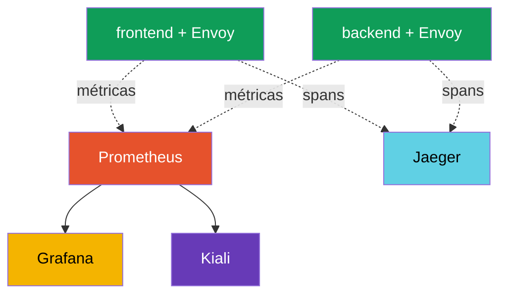
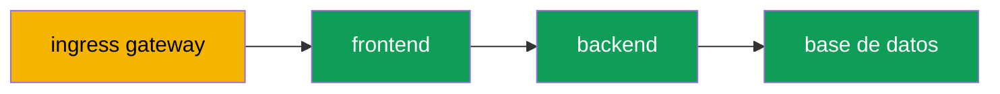

[RU version](ru.md) · [Eng version](en.md) · [Version française](fr.md) · [Deutsche Version](de.md)

# Capítulo 17. Observabilidad: Prometheus, Grafana, Jaeger, Kiali

> **Qué sigue.** Hemos aprendido a gestionar el tráfico y a protegerlo. Ahora aprenderemos a
> **ver** qué pasa en la malla. Cuando hay muchos servicios y algo va lento, necesitas entender
> rápido: dónde, cuántos errores, qué latencia, quién llama a quién. Istio recoge toda esta
> telemetría automáticamente. En este capítulo vemos las herramientas que la muestran: Prometheus,
> Grafana, Jaeger y Kiali.

## 17.1. Los tres pilares de la observabilidad

La observabilidad es la capacidad de entender qué está pasando dentro de un sistema a partir de sus
señales externas. Suele dividirse en tres pilares:

- **Métricas**: números a lo largo del tiempo: cuántas peticiones por segundo, la tasa de error, la
  latencia. Responden a la pregunta "¿va algo mal y en qué medida?".
- **Trazas**: el camino de una única petición a través de todos los servicios. Responden a la
  pregunta "¿dónde exactamente está el cuello de botella?".
- **Logs**: registros de eventos concretos. Responden a la pregunta "¿qué pasó exactamente?".

La ventaja clave de Istio: el proxy sidecar ve cada petición, así que las métricas y las trazas se
recogen **automáticamente, sin cambiar el código de la aplicación**.

## 17.2. Las herramientas y cómo se relacionan

Istio en sí genera telemetría, pero herramientas aparte (addons) la almacenan y la muestran. Cada
una para su propia tarea:

- **Prometheus**: recoge y almacena métricas.
- **Grafana**: dibuja dashboards sobre las métricas de Prometheus.
- **Jaeger**: almacena y muestra trazas distribuidas.
- **Kiali**: construye un grafo de servicios de la malla sobre las métricas.



Importante: Istio no te impone estas herramientas. Solo **exporta** métricas y spans, y qué
Prometheus/Jaeger usar es tu elección. Para un inicio rápido Istio incluye manifiestos de addon
listos (sección 17.6).

## 17.3. Métricas y Prometheus

Envoy en cada pod cuenta métricas por petición y se las entrega a Prometheus. Las más importantes
(llamadas las "golden signals"):

- **`istio_requests_total`**: el contador de peticiones. De él se calculan las RPS y la tasa de
  error.
- **`istio_request_duration_milliseconds`**: la latencia de la petición.

Cada métrica tiene un rico conjunto de etiquetas: `source_workload`, `destination_workload`,
`response_code`, `destination_service` y otras. Gracias a ellas puedes mirar, por ejemplo, "cuántas
respuestas 5xx devolvió el servicio payments a las peticiones desde frontend".

Para el tráfico no HTTP (TCP, bases de datos, brokers, capítulo 10) no hay métricas HTTP, pero hay
las suyas propias: `istio_tcp_connections_opened_total`, `istio_tcp_connections_closed_total`,
`istio_tcp_sent_bytes_total` / `istio_tcp_received_bytes_total`, usadas para vigilar las conexiones
y el volumen de tráfico.

Puedes consultar una métrica directamente a través de la API de Prometheus:

```bash
kubectl exec -n default deploy/curl-client -c curl -- \
  curl -s 'http://prometheus.istio-system:9090/api/v1/query?query=istio_requests_total{destination_service_name="ping-pong"}'
```

Un resultado distinto de cero significa que Prometheus está recogiendo las métricas de Istio. Son
exactamente estas métricas las que sustentan los dashboards de Grafana, el grafo de Kiali y, por
ejemplo, el canary automático en Flagger (capítulo 25).

## 17.4. Grafana: dashboards

Prometheus almacena métricas, pero mirar números en crudo es incómodo. **Grafana** dibuja gráficos
a partir de ellos. Istio incluye dashboards listos: un resumen general de la malla, uno por
servicio, uno por carga de trabajo y uno para el propio control plane (istiod).

En los dashboards ves de inmediato las RPS, la tasa de error y los percentiles de latencia (p50,
p90, p99) por servicio, sin configurar consultas a mano. Para acceder a la UI suele usarse
port-forward:

```bash
kubectl -n istio-system port-forward svc/grafana 3000:3000
```

## 17.5. Trazado distribuido y Jaeger

Las métricas dicen "el servicio payments va lento", pero una petición normalmente pasa a través de
varios servicios, y necesitas entender **en qué tramo** se pierde el tiempo. Esta es la tarea del
trazado distribuido. Una petición produce una cadena de **spans** (un span por servicio) y juntos
forman una **traza**. **Jaeger** almacena y muestra estas trazas.



En Jaeger tal petición se ve como una cadena de spans `gateway -> frontend -> backend -> database`
con la latencia en cada tramo, y ves de inmediato dónde está el cuello de botella.

**La sutileza más importante del trazado.** Istio genera spans automáticamente, pero hay una
condición que a menudo se pasa por alto: la aplicación **debe propagar las cabeceras de trazado**
de la petición entrante a las salientes. Envoy añade las cabeceras (`x-request-id`, `traceparent`,
`b3` y otras), pero solo la propia aplicación puede vincular una petición entrante con una saliente:
debe copiar estas cabeceras cuando llama al siguiente servicio.

Si la aplicación no hace esto, la traza se desmorona en piezas separadas sin conexión: verás spans
pero no podrás ensamblarlos en una única cadena. Esto es lo único que se requiere del código de la
aplicación para el trazado: propagar unas cuantas cabeceras.

Otro parámetro es el **sampling**. Por defecto Istio envía a las trazas solo una pequeña fracción de
las peticiones (alrededor del 1%), para no crear carga extra. Para depurar, la fracción se puede
subir al 100% vía la Telemetry API (en detalle en el capítulo 18).

**OpenTelemetry es el estándar actual.** Aquí Jaeger es más bien un "backend para mostrar trazas",
mientras que la industria ha unificado la forma de entregarlas en torno a **OpenTelemetry (OTel)**:
los propios SDK cliente de Jaeger ya han quedado obsoletos en favor de OTel. Istio puede enviar
trazas por el protocolo **OTLP** vía el proveedor `opentelemetry` (configurado en MeshConfig y la
Telemetry API, capítulo 18), y en el lado receptor puede estar cualquier cosa con soporte de OTLP:
Jaeger, Grafana Tempo, un servicio en la nube. A menudo se pone en medio un **OpenTelemetry
Collector**: un agregador proxy al que Envoy envía los spans, y que luego los enruta a uno o varios
backends. La conclusión práctica: "Jaeger" en este capítulo es la UI/almacenamiento, mientras que el
transporte de las trazas hoy se elige que sea OTLP.

## 17.6. Kiali: el grafo de servicios

**Kiali** responde a la pregunta "¿cómo está construida realmente mi malla y qué está pasando en
ella ahora mismo?". Construye un grafo visual: qué servicios hay, quién llama a quién, cuánto
tráfico va por cada conexión, dónde están los errores. El grafo se construye sobre las métricas de
Prometheus.

Kiali es cómodo para ver el panorama general, encontrar servicios sin tráfico, detectar un pico de
errores en una conexión concreta e incluso comprobar la configuración de Istio (resalta problemas
comunes). Si conectas un backend de trazado a Kiali (Jaeger/Tempo), también puede mostrar **trazas
directamente desde el grafo**: al hacer clic en un servicio puedes profundizar en la traza de una
petición concreta sin cambiar a una UI de Jaeger aparte. Acceso a la UI:

```bash
kubectl -n istio-system port-forward svc/kiali 20001:20001
```

## 17.7. Instalar los addons

Istio incluye las cuatro herramientas como manifiestos listos en el directorio `samples/addons` de
la distribución descargada:

```bash
REL=release-1.29
kubectl apply -f https://raw.githubusercontent.com/istio/istio/$REL/samples/addons/prometheus.yaml
kubectl apply -f https://raw.githubusercontent.com/istio/istio/$REL/samples/addons/grafana.yaml
kubectl apply -f https://raw.githubusercontent.com/istio/istio/$REL/samples/addons/jaeger.yaml
kubectl apply -f https://raw.githubusercontent.com/istio/istio/$REL/samples/addons/kiali.yaml
```

Importante: estos manifiestos son para demo y aprendizaje. En producción normalmente usas tu propio
Prometheus y Grafana ya desplegados (por ejemplo, de kube-prometheus-stack), y configuras Istio para
enviarles métricas y trazas.

## 17.8. Buenas prácticas para producción

Los addons de `samples/addons` son para demo. En operación real el enfoque es distinto.

**Métricas y Prometheus:**

- No uses el Prometheus de demo. Despliega un stack completo (kube-prometheus-stack / Prometheus
  Operator) con retención, HA y remote-write a almacenamiento a largo plazo (Thanos, Mimir,
  VictoriaMetrics). El Prometheus de demo mantiene los datos en memoria y los pierde al reiniciar.
- Vigila la **cardinalidad de las métricas**. Las métricas de Istio tienen muchas etiquetas
  (source, destination, response_code, etc.), y en una malla grande esto puede "reventar"
  Prometheus por memoria. Elimina las etiquetas y métricas innecesarias vía la Telemetry API
  (capítulo 18).
- Asegúrate de monitorizar el **propio control plane** (istiod), no solo las aplicaciones: sus
  métricas muestran la salud de la distribución de config y certificados.

**Trazado:**

- En producción **no pongas el sampling al 100%**: es carga y volumen extra. Normalmente 1-5%, y
  para depuración puntual súbelo temporalmente o usa force-trace.
- No uses el Jaeger all-in-one (memory) en producción. Necesitas un backend con almacenamiento
  persistente (Elasticsearch, Cassandra) o una solución gestionada (Grafana Tempo, servicios en la
  nube).
- Recuerda: para que las trazas no se rompan, las aplicaciones deben propagar las cabeceras de
  trazado (sección 17.5).

**Logs:**

- Los access logs de Envoy son voluminosos. No habilites el access log completo para toda la malla:
  habilítalo selectivamente (por namespace/servicio) vía la Telemetry API (capítulo 18) o limita el
  formato.

**Dashboards, alertas y acceso:**

- Configura **alertas sobre las golden signals**: la tasa de error (5xx), la latencia p99, la
  saturación. La mera presencia de dashboards no reemplaza a las alertas.
- Mantén Kiali en modo solo lectura en producción y restringe el acceso: a través de él se ve toda
  la topología de la malla.
- No expongas Grafana, Kiali y Jaeger al exterior sin autenticación. Escóndelos detrás de un ingress
  con autorización (o acceso solo vía port-forward/VPN).

**Observabilidad en EKS/AWS.** Si no quieres ejecutar Prometheus/Grafana/Jaeger tú mismo, AWS tiene
servicios gestionados, e Istio se integra con ellos de fábrica:

- **Amazon Managed Service for Prometheus (AMP)**: un almacén de métricas gestionado. Tu propio
  Prometheus (modo agente) o un collector ADOT hacen `remote_write` a AMP; el almacenamiento y el
  escalado están del lado de AWS.
- **Amazon Managed Grafana (AMG)**: un Grafana gestionado con integración lista con AMP y X-Ray; los
  dashboards de Istio van aquí también.
- **AWS Distro for OpenTelemetry (ADOT)**: la build de AWS del OpenTelemetry Collector. Envoy envía
  métricas/trazas por OTLP a ADOT, y este las distribuye a AMP (métricas), **AWS X-Ray** o Tempo
  (trazas), CloudWatch (logs).
- **Trazado: a AWS X-Ray** vía OTLP/ADOT (en lugar de un Jaeger autogestionado).
- **Logs** de Envoy: a **CloudWatch Logs** (vía Fluent Bit / el agente de CloudWatch en los nodos).

El acceso a AMP/AMG/X-Ray se concede vía IAM (IRSA en el ServiceAccount del collector); los secretos
y el escalado son cosa de AWS. Este es el mismo principio que con ACM PCA en el capítulo 16: entrega
las operaciones a un servicio gestionado, y mantén solo el exporter/collector en el clúster.

Una regla corta: el stack de demo es bueno para "hacerse una idea", pero producción se construye
sobre un stack de observabilidad dedicado, escalable y protegido, con alertas y un sampling
razonable.

## 17.9. Resumen del capítulo

- La observabilidad descansa en tres pilares: métricas, trazas, logs.
- Istio recoge métricas y trazas automáticamente: el sidecar ve cada petición, sin necesidad de
  cambiar el código de la aplicación.
- **Prometheus** almacena métricas (`istio_requests_total`, `istio_request_duration_milliseconds`)
  con etiquetas ricas; son las golden signals de la malla.
- **Grafana** dibuja los dashboards listos de Istio sobre las métricas.
- **Jaeger** muestra trazas distribuidas: el camino de una petición a través de los servicios y
  dónde está el cuello de botella.
- **Kiali** construye un grafo de servicios de la malla sobre las métricas de Prometheus.
- Para el trazado, la aplicación debe **propagar las cabeceras de trazado** de las peticiones
  entrantes a las salientes, de lo contrario la traza se desmorona.
- El transporte de las trazas hoy es **OpenTelemetry/OTLP** (los clientes de Jaeger están
  obsoletos); Istio envía spans por OTLP vía el proveedor `opentelemetry`, a menudo a través de un
  OpenTelemetry Collector, mientras que Jaeger actúa como UI/almacenamiento.
- Para el tráfico no HTTP hay sus propias métricas `istio_tcp_*` (conexiones, bytes).
- Los addons de `samples/addons` son buenos para demo; en producción conectas tu propio
  Prometheus/Grafana.
- Prácticas de producción: un Prometheus escalable dedicado con retención y remote-write, control de
  la cardinalidad de las métricas, sampling de trazas del 1-5%, un backend de trazas persistente,
  access logs selectivos, alertas sobre las golden signals, acceso protegido a la UI, monitorizar el
  propio istiod.
- En EKS, la observabilidad se puede entregar a servicios gestionados: **AMP** (métricas), **AMG**
  (Grafana), **ADOT** (OpenTelemetry Collector), **X-Ray** (trazas), CloudWatch (logs); el acceso
  vía IRSA.

## 17.10. Preguntas de autoevaluación

1. Nombra los tres pilares de la observabilidad y a qué preguntas responde cada uno.
2. ¿Por qué Istio recoge métricas y trazas sin cambiar el código de la aplicación?
3. ¿Qué métricas de Istio se consideran golden signals y qué etiquetas útiles tienen?
4. ¿De qué son responsables Grafana, Jaeger y Kiali?
5. ¿Qué debe hacer la aplicación para que las trazas no se desmoronen en piezas?
6. ¿Por qué no deberían usarse los addons de `samples/addons` en producción tal cual?
7. Nombra las prácticas clave de observabilidad en producción: ¿qué hacer con el sampling de trazas,
   la cardinalidad de las métricas, el almacenamiento de métricas/trazas y el acceso a la UI?
8. ¿Qué es OpenTelemetry/OTLP y cuál es el papel de Jaeger con tal transporte de trazas?
9. ¿Qué servicios gestionados de AWS se usan para la observabilidad de Istio en EKS y qué hace ADOT?
10. ¿Qué métricas se usan para vigilar el tráfico no HTTP (TCP)?

## Práctica

Despliega el stack de observabilidad (Prometheus, Grafana, Jaeger, Kiali), genera tráfico y
comprueba las métricas, las trazas y el grafo de servicios:

🧪 Laboratorio 08: [tasks/ica/labs/08](../../labs/08/README_ES.MD)

---
[Índice](../README_ES.md) · [Capítulo 16](../16/es.md) · [Capítulo 18](../18/es.md)
