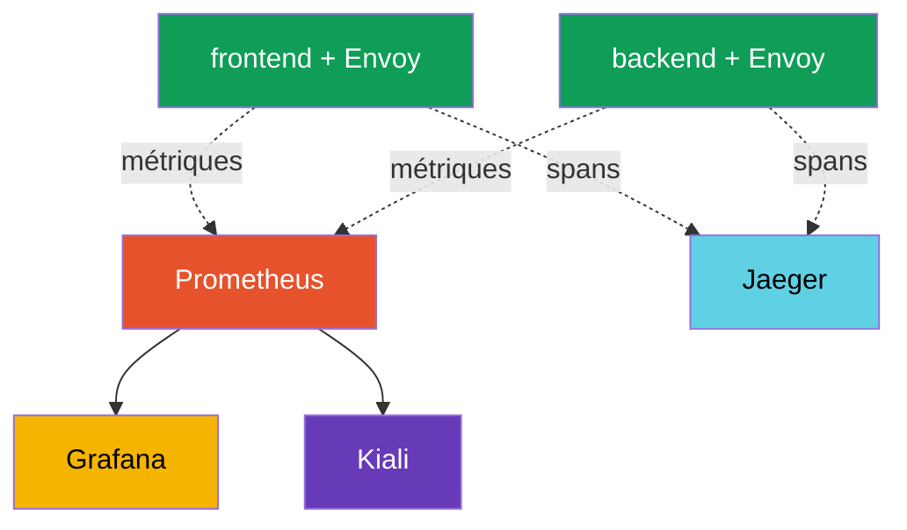

[RU version](ru.md) · [Eng version](en.md) · [Versión en español](es.md) · [Deutsche Version](de.md)

# Chapitre 17. Observabilité : Prometheus, Grafana, Jaeger, Kiali

> **La suite.** Nous avons appris à gérer le trafic et à le protéger. Maintenant, nous allons
> apprendre à **voir** ce qui se passe dans le maillage. Quand les services sont nombreux et que
> quelque chose ralentit, il faut vite comprendre : où, combien d'erreurs, quelle latence, qui
> appelle qui. Istio collecte toute cette télémétrie automatiquement. Dans ce chapitre, nous
> passerons en revue les outils qui l'affichent : Prometheus, Grafana, Jaeger et Kiali.

## 17.1. Les trois piliers de l'observabilité

L'observabilité, c'est la capacité de comprendre ce qui se passe à l'intérieur d'un système à
partir de ses signaux externes. On la découpe généralement en trois piliers :

- **Métriques (metrics)** - des nombres dans le temps : combien de requêtes par seconde, taux
  d'erreurs, latence. Elles répondent à la question « quelque chose ne va pas et dans quelle
  mesure ».
- **Traces (traces)** - le chemin d'une seule requête à travers tous les services. Elles répondent
  à la question « où exactement est le goulot d'étranglement ».
- **Logs (logs)** - des enregistrements sur des événements concrets. Ils répondent à la question
  « qu'est-il précisément arrivé ».

L'avantage clé d'Istio : le proxy sidecar voit chaque requête, donc les métriques et les traces
sont collectées **automatiquement, sans modifier le code de l'application**.

## 17.2. Les outils et comment ils sont reliés

Istio génère lui-même la télémétrie, mais ce sont des outils séparés (des addons) qui la stockent
et l'affichent. Chacun a sa mission :

- **Prometheus** - collecte et stocke les métriques.
- **Grafana** - dessine des tableaux de bord au-dessus des métriques de Prometheus.
- **Jaeger** - stocke et affiche les traces distribuées.
- **Kiali** - construit le graphe des services du maillage au-dessus des métriques.



Important : Istio n'impose pas ces outils de force. Il se contente d'**exporter** les métriques et
les spans, et le choix du Prometheus/Jaeger à utiliser vous revient. Pour un démarrage rapide,
Istio fournit des manifestes d'addons prêts à l'emploi (section 17.6).

## 17.3. Métriques et Prometheus

Envoy, dans chaque pod, compte les métriques de chaque requête et les expose à Prometheus. Les
plus importantes (on les appelle les « signaux d'or ») :

- **`istio_requests_total`** - le compteur de requêtes. Il sert à calculer le RPS et le taux
  d'erreurs.
- **`istio_request_duration_milliseconds`** - la latence des requêtes.

Chaque métrique dispose d'un riche jeu de labels : `source_workload`, `destination_workload`,
`response_code`, `destination_service` et d'autres. Grâce à eux, on peut regarder, par exemple,
« combien de réponses 5xx le service payments a-t-il renvoyées aux requêtes du frontend ».

Pour le trafic non-HTTP (TCP, BDD, brokers - chapitre 10), il n'y a pas de métriques HTTP, mais
il y en a d'autres : `istio_tcp_connections_opened_total`, `istio_tcp_connections_closed_total`,
`istio_tcp_sent_bytes_total` / `istio_tcp_received_bytes_total` - elles permettent de suivre les
connexions et le volume de trafic.

On peut interroger une métrique directement via l'API de Prometheus :

```bash
kubectl exec -n default deploy/curl-client -c curl -- \
  curl -s 'http://prometheus.istio-system:9090/api/v1/query?query=istio_requests_total{destination_service_name="ping-pong"}'
```

Un résultat non nul signifie que Prometheus collecte les métriques d'Istio. Ce sont précisément
ces métriques qui sont à la base des tableaux de bord Grafana, du graphe Kiali et, par exemple,
du canary automatique dans Flagger (chapitre 25).

## 17.4. Grafana : tableaux de bord

Prometheus stocke les métriques, mais regarder des nombres bruts est peu pratique. **Grafana**
dessine des graphiques à partir d'eux. Istio fournit des tableaux de bord prêts à l'emploi : une
vue d'ensemble du maillage, un tableau de bord par service, par charge de travail et par control
plane lui-même (istiod).

Sur les tableaux de bord, vous voyez immédiatement le RPS, le taux d'erreurs et les centiles de
latence (p50, p90, p99) pour chaque service - sans configurer manuellement de requêtes. Pour
accéder à l'UI, on utilise généralement le port-forward :

```bash
kubectl -n istio-system port-forward svc/grafana 3000:3000
```

## 17.5. Distributed tracing et Jaeger

Les métriques disent « le service payments est lent », mais une requête traverse généralement
plusieurs services, et il faut comprendre **à quel endroit** le temps est perdu. C'est la tâche
du traçage distribué. Une requête engendre une chaîne de **spans** - un span par service, - et
ensemble ils forment une **trace**. **Jaeger** stocke et affiche ces traces.


Dans Jaeger, une telle requête apparaît comme une chaîne de spans `gateway -> frontend -> backend
-> database` avec la latence à chaque étape, et l'on voit tout de suite où se trouve le goulot
d'étranglement.

**La subtilité essentielle du traçage.** Istio génère les spans automatiquement, mais il y a une
condition, souvent oubliée : l'application **doit propager les en-têtes de traçage** de la requête
entrante vers les requêtes sortantes. Envoy ajoute des en-têtes (`x-request-id`, `traceparent`,
`b3`, etc.), mais seule l'application elle-même peut relier la requête entrante à la sortante -
elle doit copier ces en-têtes quand elle appelle le service suivant.

Si l'application ne le fait pas, la trace se fragmente en morceaux séparés et non reliés : vous
verrez des spans, mais vous ne pourrez pas les assembler en une seule chaîne. C'est la seule chose
que le traçage exige du code de l'application - propager quelques en-têtes.

Un autre paramètre : l'**échantillonnage** (sampling). Par défaut, Istio n'envoie dans les traces
qu'une petite fraction des requêtes (de l'ordre de 1 %), afin de ne pas créer de charge inutile.
Pour le débogage, on peut monter cette part jusqu'à 100 % via la Telemetry API (en détail au
chapitre 18).

**OpenTelemetry - le standard actuel.** Jaeger est ici plutôt un « backend pour afficher les
traces », et le mode d'acheminement de ces dernières a été unifié par l'industrie autour
d'**OpenTelemetry (OTel)** : les SDK clients propres à Jaeger sont désormais considérés comme
obsolètes au profit d'OTel. Istio sait envoyer les traces via le protocole **OTLP** grâce au
provider `opentelemetry` (configuré dans MeshConfig et la Telemetry API, chapitre 18), et à la
réception on peut placer n'importe quoi qui prend en charge OTLP - Jaeger, Grafana Tempo, un
service cloud. Souvent, on place au milieu un **OpenTelemetry Collector** : un proxy-agrégateur
vers lequel Envoy envoie les spans, et qui les route ensuite vers un ou plusieurs backends.
Conclusion pratique : « Jaeger » dans ce chapitre désigne l'UI/le stockage, tandis que le
transport des traces se choisit aujourd'hui avec OTLP.

## 17.6. Kiali : le graphe des services

**Kiali** répond à la question « comment mon maillage est-il structuré et qu'y passe-t-il en ce
moment ». Il construit un graphe visuel : quels services existent, qui appelle qui, combien de
trafic passe par chaque lien, où sont les erreurs. Le graphe est construit au-dessus des
métriques de Prometheus.

Kiali est pratique pour voir la vue d'ensemble, repérer les services sans trafic, remarquer une
poussée d'erreurs sur un lien précis et même vérifier la configuration d'Istio (il met en évidence
les problèmes courants). Si l'on connecte à Kiali un backend de traçage (Jaeger/Tempo), il sait
aussi afficher des **traces directement depuis le graphe** - en cliquant sur un service, on peut
plonger dans le traçage d'une requête précise sans basculer vers une UI Jaeger séparée. Accès à
l'UI :

```bash
kubectl -n istio-system port-forward svc/kiali 20001:20001
```

## 17.7. Installation des addons

Istio fournit les quatre outils sous forme de manifestes prêts à l'emploi dans le répertoire
`samples/addons` de la distribution téléchargée :

```bash
REL=release-1.29
kubectl apply -f https://raw.githubusercontent.com/istio/istio/$REL/samples/addons/prometheus.yaml
kubectl apply -f https://raw.githubusercontent.com/istio/istio/$REL/samples/addons/grafana.yaml
kubectl apply -f https://raw.githubusercontent.com/istio/istio/$REL/samples/addons/jaeger.yaml
kubectl apply -f https://raw.githubusercontent.com/istio/istio/$REL/samples/addons/kiali.yaml
```

Important : ces manifestes sont destinés à la démo et à l'apprentissage. En production, on utilise
généralement ses propres Prometheus et Grafana déjà déployés (par exemple, issus de
kube-prometheus-stack), et l'on configure Istio pour leur envoyer métriques et traces.

## 17.8. Best practices pour la production

Les addons de `samples/addons` sont pour la démo. En exploitation réelle, l'approche est
différente.

**Métriques et Prometheus :**

- N'utilisez pas le Prometheus de démo. Déployez une stack complète (kube-prometheus-stack /
  Prometheus Operator) avec rétention, HA et remote-write vers un stockage à long terme (Thanos,
  Mimir, VictoriaMetrics). Le Prometheus de démo garde les données en mémoire et les perd au
  redémarrage.
- Surveillez la **cardinalité des métriques**. Les métriques d'Istio ont beaucoup de labels
  (source, destination, response_code, etc.), et sur un grand maillage cela peut « faire exploser »
  Prometheus en mémoire. Retirez les labels et métriques superflus via la Telemetry API
  (chapitre 18).
- Surveillez impérativement le **control plane lui-même** (istiod), et pas seulement les
  applications : ses métriques montrent la santé de la diffusion de la configuration et des
  certificats.

**Traçage :**

- En production, **ne mettez pas l'échantillonnage à 100 %** - c'est une charge et un volume
  inutiles. Généralement 1-5 %, et pour un débogage ciblé on le monte temporairement ou on utilise
  le force-trace.
- N'utilisez pas Jaeger all-in-one (mémoire) en production. Il faut un backend avec stockage
  persistant (Elasticsearch, Cassandra) ou une solution managée (Grafana Tempo, services cloud).
- Rappelez-vous : pour que les traces ne se fragmentent pas, les applications doivent propager les
  en-têtes de traçage (section 17.5).

**Logs :**

- Les access logs d'Envoy sont volumineux. N'activez pas le full access log sur tout le maillage -
  activez-le de façon sélective (par namespace/service) via la Telemetry API (chapitre 18) ou
  limitez le format.

**Tableaux de bord, alertes et accès :**

- Configurez des **alertes sur les signaux d'or** : taux d'erreurs (5xx), latence p99, saturation.
  La simple présence de tableaux de bord ne remplace pas les alertes.
- Gardez Kiali en mode read-only en production et restreignez l'accès - toute la topologie du
  maillage est visible à travers lui.
- N'exposez pas Grafana, Kiali et Jaeger vers l'extérieur sans authentification. Cachez-les
  derrière un ingress avec autorisation (ou accès uniquement via port-forward/VPN).

**Observabilité sur EKS/AWS.** Si vous ne voulez pas héberger vous-même Prometheus/Grafana/Jaeger,
il existe sur AWS des services managés, et Istio s'y intègre nativement :

- **Amazon Managed Service for Prometheus (AMP)** - stockage de métriques managé. Votre propre
  Prometheus (mode agent) ou un collecteur ADOT fait un `remote_write` vers AMP ; le stockage et
  la mise à l'échelle sont côté AWS.
- **Amazon Managed Grafana (AMG)** - une Grafana managée avec intégration prête pour AMP et X-Ray ;
  on y installe aussi les tableaux de bord Istio.
- **AWS Distro for OpenTelemetry (ADOT)** - la version d'OpenTelemetry Collector par AWS. Envoy
  envoie métriques/traces via OTLP vers ADOT, qui les répartit ensuite vers AMP (métriques),
  **AWS X-Ray** ou Tempo (traces), CloudWatch (logs).
- **Le traçage - vers AWS X-Ray** via OTLP/ADOT (au lieu d'un Jaeger autonome).
- **Les logs** d'Envoy - vers **CloudWatch Logs** (via Fluent Bit / l'agent CloudWatch sur les
  nœuds).

L'accès à AMP/AMG/X-Ray est accordé via IAM (IRSA sur le ServiceAccount du collecteur), les
secrets et la mise à l'échelle sont l'affaire d'AWS. C'est le même principe qu'avec ACM PCA au
chapitre 16 : confier l'exploitation à un service managé et ne garder dans le cluster que
l'exportateur/collecteur.

Règle courte : la stack de démo est parfaite pour « tester du bout des doigts », mais la
production se construit sur une stack d'observabilité dédiée, scalable et sécurisée, avec des
alertes et un échantillonnage raisonnable.

## 17.9. Résumé du chapitre

- L'observabilité repose sur trois piliers : métriques, traces, logs.
- Istio collecte les métriques et les traces automatiquement - le sidecar voit chaque requête, il
  n'y a pas à modifier le code de l'application.
- **Prometheus** stocke les métriques (`istio_requests_total`,
  `istio_request_duration_milliseconds`) avec de riches labels ; ce sont les signaux d'or du
  maillage.
- **Grafana** dessine les tableaux de bord Istio prêts à l'emploi au-dessus des métriques.
- **Jaeger** affiche les traces distribuées - le chemin d'une requête à travers les services et où
  est le goulot d'étranglement.
- **Kiali** construit le graphe des services du maillage au-dessus des métriques de Prometheus.
- Pour le traçage, l'application doit **propager les en-têtes de traçage** des requêtes entrantes
  vers les sortantes, sinon la trace se fragmente.
- Le transport des traces aujourd'hui, c'est **OpenTelemetry/OTLP** (les clients Jaeger sont
  obsolètes) ; Istio envoie les spans via OTLP grâce au provider `opentelemetry`, souvent via un
  OpenTelemetry Collector, et Jaeger sert d'UI/de stockage.
- Pour le trafic non-HTTP, il existe des métriques propres `istio_tcp_*` (connexions, octets).
- Les addons de `samples/addons` sont bons pour la démo ; en production, on connecte ses propres
  Prometheus/Grafana.
- Pratiques de production : Prometheus dédié et scalable avec rétention et remote-write, contrôle
  de la cardinalité des métriques, échantillonnage des traces à 1-5 %, backend de traces
  persistant, access logs sélectifs, alertes sur les signaux d'or, accès sécurisé à l'UI,
  surveillance d'istiod lui-même.
- Sur EKS, l'observabilité peut être confiée à des services managés : **AMP** (métriques), **AMG**
  (Grafana), **ADOT** (OpenTelemetry Collector), **X-Ray** (traces), CloudWatch (logs) ; accès via
  IRSA.

## 17.10. Questions d'auto-évaluation

1. Nommez les trois piliers de l'observabilité et les questions auxquelles répond chacun.
2. Pourquoi Istio collecte-t-il les métriques et les traces sans modifier le code de
   l'application ?
3. Quelles métriques Istio sont considérées comme des signaux d'or et quels sont leurs labels
   utiles ?
4. De quoi sont responsables Grafana, Jaeger et Kiali ?
5. Que doit faire l'application pour que les traces ne se fragmentent pas ?
6. Pourquoi ne faut-il pas utiliser les addons de `samples/addons` tels quels en production ?
7. Nommez les pratiques de production clés de l'observabilité : que faire pour l'échantillonnage
   des traces, la cardinalité des métriques, le stockage des métriques/traces et l'accès à l'UI ?
8. Qu'est-ce qu'OpenTelemetry/OTLP et quel est le rôle de Jaeger dans un tel transport des traces ?
9. Quels services managés d'AWS utilise-t-on pour l'observabilité d'Istio sur EKS et que fait ADOT ?
10. Avec quelles métriques observe-t-on le trafic non-HTTP (TCP) ?

## Pratique

Déployez la stack d'observabilité (Prometheus, Grafana, Jaeger, Kiali), générez du trafic et
vérifiez les métriques, les traces et le graphe des services :

🧪 Lab 08 : [tasks/ica/labs/08](../../labs/08/README_FR.MD)

---
[Table des matières](../README_FR.md) · [Chapitre 16](../16/fr.md) · [Chapitre 18](../18/fr.md)
