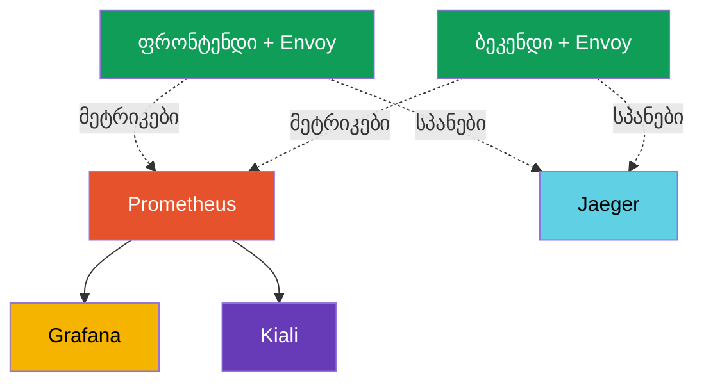
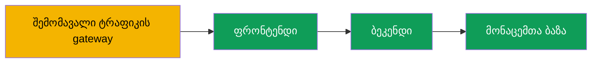

[Русская версия](ru.md) · [Eng version](en.md) · [Versión en español](es.md) · [Version française](fr.md) · [Deutsche Version](de.md) · [繁體中文版](tw.md) · [日本語版](jp.md)

# თავი 17. Observability: Prometheus, Grafana, Jaeger, Kiali

> **რა იქნება შემდეგ.** ჩვენ ვისწავლეთ ტრაფიკის მართვა და მისი დაცვა. ახლა ვისწავლით,
> **დავინახოთ**, რა ხდება mesh-ში. როდესაც სერვისი ბევრია და რაღაც ნელდება, სწრაფად უნდა
> გავარკვიოთ: სად არის პრობლემა, რამდენია შეცდომა, როგორია დაყოვნება, ვინ ვის იძახებს. Istio
> მთელ ამ ტელემეტრიას ავტომატურად აგროვებს. ამ თავში განვიხილავთ ინსტრუმენტებს, რომლებიც
> მას გვიჩვენებენ: Prometheus, Grafana, Jaeger და Kiali.

## 17.1. Observability-ის სამი საყრდენი

Observability (დაკვირვებადობა) - სისტემის გარე სიგნალების მიხედვით იმის გაგების უნარია,
თუ რა ხდება მის შიგნით. ჩვეულებრივ, მას სამ საყრდენად ყოფენ:

- **მეტრიკები (metrics)** - დროში ცვალებადი რიცხვები: რამდენი მოთხოვნაა წამში,
  შეცდომების წილი, დაყოვნება. პასუხობენ კითხვას: „არის თუ არა რაღაც წესრიგში და რამდენად“.
- **ტრეისები (traces)** - ერთი მოთხოვნის გზა ყველა სერვისის გავლით. პასუხობენ კითხვას:
  „კონკრეტულად სად არის შეფერხება“.
- **ლოგები (logs)** - კონკრეტული მოვლენების ჩანაწერები. პასუხობენ კითხვას: „კონკრეტულად
  რა მოხდა“.

Istio-ს მთავარი უპირატესობა: sidecar-პროქსი თითოეულ მოთხოვნას ხედავს, ამიტომ მეტრიკები და
ტრეისები **ავტომატურად, აპლიკაციის კოდის შეცვლის გარეშე** გროვდება.

## 17.2. ინსტრუმენტები და მათი კავშირი

Istio ტელემეტრიას თავად ქმნის, მაგრამ მას ცალკეული ინსტრუმენტები (ადონები) ინახავს და
აჩვენებს. თითოეულ მათგანს თავისი ამოცანა აქვს:

- **Prometheus** - აგროვებს და ინახავს მეტრიკებს.
- **Grafana** - Prometheus-ის მეტრიკების საფუძველზე დეშბორდებს აგებს.
- **Jaeger** - ინახავს და აჩვენებს განაწილებულ ტრეისებს.
- **Kiali** - მეტრიკების საფუძველზე mesh-ის სერვისების გრაფს აგებს.



მნიშვნელოვანია: Istio ამ ინსტრუმენტების გამოყენებას თავს არ გახვევთ. ის მხოლოდ
**ექსპორტს უკეთებს** მეტრიკებსა და სპანებს, ხოლო რომელი Prometheus/Jaeger გამოიყენოთ -
თქვენი არჩევანია. სწრაფი დასაწყისისთვის Istio ადონების მზა მანიფესტებს გვთავაზობს
(განყოფილება 17.6).

## 17.3. მეტრიკები და Prometheus

თითოეულ პოდში Envoy ყოველი მოთხოვნის მეტრიკებს ითვლის და Prometheus-ს გადასცემს.
ყველაზე მნიშვნელოვანი მეტრიკებია (მათ „ოქროს სიგნალებს“ უწოდებენ):

- **`istio_requests_total`** - მოთხოვნების მრიცხველი. მისი საშუალებით ითვლიან RPS-სა და
  შეცდომების წილს.
- **`istio_request_duration_milliseconds`** - მოთხოვნების დაყოვნება (ლატენტურობა).

თითოეულ მეტრიკას ჭდეების მდიდარი ნაკრები აქვს: `source_workload`, `destination_workload`,
`response_code`, `destination_service` და სხვა. მათი საშუალებით შეიძლება ვნახოთ,
მაგალითად, „რამდენი 5xx პასუხი დაუბრუნა payments სერვისმა frontend-ის მოთხოვნებს“.

არა-HTTP ტრაფიკისთვის (TCP, მონაცემთა ბაზები, ბროკერები - თავი 10) HTTP-მეტრიკები არ
არსებობს, მაგრამ არის შესაბამისი მეტრიკები: `istio_tcp_connections_opened_total`,
`istio_tcp_connections_closed_total`, `istio_tcp_sent_bytes_total` /
`istio_tcp_received_bytes_total` - მათი საშუალებით აკვირდებიან კავშირებსა და ტრაფიკის
მოცულობას.

მეტრიკის მოთხოვნა პირდაპირ Prometheus API-ს საშუალებით შეიძლება:

```bash
kubectl exec -n default deploy/curl-client -c curl -- \
  curl -s 'http://prometheus.istio-system:9090/api/v1/query?query=istio_requests_total{destination_service_name="ping-pong"}'
```

ნულზე მეტი შედეგი ნიშნავს, რომ Prometheus Istio-ს მეტრიკებს აგროვებს. სწორედ ეს
მეტრიკები უდევს საფუძვლად Grafana-ს დეშბორდებს, Kiali-ს გრაფს და, მაგალითად, Flagger-ში
ავტომატურ canary-ს (თავი 25).

## 17.4. Grafana: დეშბორდები

Prometheus მეტრიკებს ინახავს, მაგრამ დაუმუშავებელი რიცხვების ნახვა მოუხერხებელია.
**Grafana** მათ საფუძველზე გრაფიკებს აგებს. Istio მზა დეშბორდებს გვთავაზობს: mesh-ის
ზოგადი მიმოხილვა, სერვისების, სამუშაო დატვირთვებისა და თავად control plane-ის (istiod)
დეშბორდები.

დეშბორდებზე დაუყოვნებლივ ხედავთ RPS-ს, შეცდომების წილსა და დაყოვნების პროცენტილებს
(p50, p90, p99) თითოეული სერვისისთვის - მოთხოვნების ხელით გამართვის გარეშე. UI-ზე
წვდომისთვის ჩვეულებრივ port-forward-ს იყენებენ:

```bash
kubectl -n istio-system port-forward svc/grafana 3000:3000
```

## 17.5. Distributed tracing და Jaeger

მეტრიკები გვატყობინებს, რომ „payments სერვისი ნელია“, მაგრამ მოთხოვნა ჩვეულებრივ რამდენიმე
სერვისს გაივლის და უნდა გავარკვიოთ, **რომელ მონაკვეთზე** იკარგება დრო. ეს განაწილებული
ტრეისინგის ამოცანაა. ერთი მოთხოვნა **სპანების** ჯაჭვს წარმოქმნის - თითო სპანს ყოველ
სერვისზე - და ისინი ერთად **ტრეისს** ქმნის. **Jaeger** ამ ტრეისებს ინახავს და აჩვენებს.



Jaeger-ში ასეთი მოთხოვნა ჩანს, როგორც სპანების ჯაჭვი `gateway -> frontend -> backend ->
database`, თითოეულ მონაკვეთზე დაყოვნების მითითებით, ამიტომ მაშინვე ჩანს, სად არის ვიწრო
ადგილი.

**ტრეისინგის უმნიშვნელოვანესი ნიუანსი.** Istio სპანებს ავტომატურად ქმნის, მაგრამ არსებობს
ერთი პირობა, რომელიც ხშირად გამორჩებათ: აპლიკაციამ შემომავალი მოთხოვნიდან გამავალ
მოთხოვნებში **ტრეისინგის სათაურები უნდა გადასცეს**. Envoy ამატებს სათაურებს
(`x-request-id`, `traceparent`, `b3` და სხვ.), მაგრამ შემომავალი მოთხოვნის გამავალთან
დაკავშირება მხოლოდ თავად აპლიკაციას შეუძლია - შემდეგი სერვისის გამოძახებისას მან ეს
სათაურები უნდა დააკოპიროს.

თუ აპლიკაცია ამას არ აკეთებს, ტრეისი ცალკეულ, ერთმანეთთან დაუკავშირებელ ნაწილებად დაიშლება:
სპანებს დაინახავთ, მაგრამ მათ ერთ ჯაჭვად ვერ შეკრავთ. ტრეისინგისთვის აპლიკაციის კოდისგან
მხოლოდ ეს მოითხოვება - რამდენიმე სათაურის გადაცემა.

კიდევ ერთი პარამეტრია **სემპლირება**. ნაგულისხმევად Istio ტრეისებში მოთხოვნების მხოლოდ
მცირე ნაწილს (დაახლოებით 1%-ს) აგზავნის, რათა ზედმეტი დატვირთვა არ შექმნას. გამართვისთვის
ეს წილი Telemetry API-ის საშუალებით 100%-მდე შეიძლება გაიზარდოს (დაწვრილებით თავში 18).

**OpenTelemetry - თანამედროვე სტანდარტი.** აქ Jaeger უფრო „ტრეისების საჩვენებელი ბეკენდია“,
ხოლო მათი მიწოდების მეთოდი ინდუსტრიამ **OpenTelemetry-ის (OTel)** გარშემო გააერთიანა:
Jaeger-ის საკუთარი კლიენტური SDK-ები უკვე მოძველებულად ითვლება და მათ ნაცვლად OTel არის
რეკომენდებული. Istio-ს შეუძლია ტრეისების **OTLP** პროტოკოლით გაგზავნა `opentelemetry`
პროვაიდერის საშუალებით (იმართება MeshConfig-სა და Telemetry API-ში, თავი 18), მიმღებად კი
შეიძლება OTLP-ის მხარდამჭერი ნებისმიერი სისტემა იყოს - Jaeger, Grafana Tempo ან ღრუბლოვანი
სერვისი. მათ შორის ხშირად ათავსებენ **OpenTelemetry Collector**-ს: პროქსი-აგრეგატორს,
რომელსაც Envoy სპანებს უგზავნის, ის კი მათ ერთ ან რამდენიმე ბეკენდში მარშრუტიზაციას უკეთებს.
პრაქტიკული დასკვნა: ამ თავში „Jaeger“ UI-ს/საცავს გულისხმობს, ხოლო დღეს ტრეისების
ტრანსპორტად OTLP-ს ირჩევენ.

## 17.6. Kiali: სერვისების გრაფი

**Kiali** პასუხობს კითხვას: „როგორ არის მოწყობილი ჩემი mesh და რა ხდება მასში ახლა?“ ის
აგებს თვალსაჩინო გრაფს: რომელი სერვისები არსებობს, ვინ ვის იძახებს, რამდენი ტრაფიკი გადის
თითოეულ კავშირზე და სად ჩნდება შეცდომები. გრაფი Prometheus-ის მეტრიკების საფუძველზე იგება.

Kiali მოსახერხებელია საერთო სურათის სანახავად, ტრაფიკის არმქონე სერვისების საპოვნელად,
კონკრეტულ კავშირზე შეცდომების უეცარი ზრდის შესამჩნევად და Istio-ს კონფიგურაციის
შესამოწმებლადაც კი (ის გავრცელებულ პრობლემებს გამოყოფს). თუ Kiali-ს ტრეისინგის ბეკენდს
(Jaeger/Tempo) დაუკავშირებთ, მას **ტრეისების პირდაპირ გრაფიდან ჩვენებაც** შეუძლია -
სერვისზე დაწკაპუნებით კონკრეტული მოთხოვნის ტრეისინგში გადახვალთ ისე, რომ ცალკე Jaeger
UI-ზე გადართვა არ დაგჭირდებათ. UI-ზე წვდომა:

```bash
kubectl -n istio-system port-forward svc/kiali 20001:20001
```

## 17.7. ადონების დაყენება

Istio ოთხივე ინსტრუმენტს ჩამოტვირთული დისტრიბუტივის `samples/addons` კატალოგში მზა
მანიფესტების სახით გვთავაზობს:

```bash
REL=release-1.29
kubectl apply -f https://raw.githubusercontent.com/istio/istio/$REL/samples/addons/prometheus.yaml
kubectl apply -f https://raw.githubusercontent.com/istio/istio/$REL/samples/addons/grafana.yaml
kubectl apply -f https://raw.githubusercontent.com/istio/istio/$REL/samples/addons/jaeger.yaml
kubectl apply -f https://raw.githubusercontent.com/istio/istio/$REL/samples/addons/kiali.yaml
```

მნიშვნელოვანია: ეს მანიფესტები დემოსა და სწავლებისთვისაა განკუთვნილი. production-ში
ჩვეულებრივ საკუთარ, უკვე გაშლილ Prometheus-სა და Grafana-ს იყენებენ (მაგალითად,
kube-prometheus-stack-იდან), ხოლო Istio-ს მათში მეტრიკებისა და ტრეისების გასაგზავნად
მართავენ.

## 17.8. Best practices production-ისთვის

`samples/addons`-ის ადონები დემოსთვისაა. რეალურ ექსპლუატაციაში მიდგომა განსხვავებულია.

**მეტრიკები და Prometheus:**

- არ გამოიყენოთ demo-Prometheus. გაშალეთ სრულფასოვანი სტეკი (kube-prometheus-stack /
  Prometheus Operator) retention-ით, HA-ითა და გრძელვადიან საცავში remote-write-ით
  (Thanos, Mimir, VictoriaMetrics). Demo-Prometheus მონაცემებს მეხსიერებაში ინახავს და
  გადატვირთვისას კარგავს.
- აკონტროლეთ **მეტრიკების კარდინალურობა**. Istio-ს მეტრიკებს ბევრი ჭდე აქვს (source,
  destination, response_code და ა.შ.), დიდ mesh-ში კი ამან შეიძლება Prometheus-ის
  მეხსიერების მოხმარება „ააფეთქოს“. ზედმეტი ჭდეები და მეტრიკები Telemetry API-ის
  საშუალებით წაშალეთ (თავი 18).
- აუცილებლად აკონტროლეთ **თავად control plane** (istiod) და არა მხოლოდ აპლიკაციები: მისი
  მეტრიკები კონფიგურაციისა და სერტიფიკატების გაცემის მდგომარეობას აჩვენებს.

**ტრეისინგი:**

- production-ში **სემპლირება 100%-ზე არ დააყენოთ** - ეს ზედმეტი დატვირთვა და მოცულობაა.
  ჩვეულებრივ იყენებენ 1-5%-ს, წერტილოვანი გამართვისთვის კი დროებით ზრდიან ან force-trace-ს
  იყენებენ.
- production-ში არ გამოიყენოთ Jaeger all-in-one (მეხსიერება). საჭიროა მუდმივი საცავის
  მქონე ბეკენდი (Elasticsearch, Cassandra) ან managed-გადაწყვეტილება (Grafana Tempo,
  ღრუბლოვანი სერვისები).
- გახსოვდეთ: ტრეისები რომ არ გაწყდეს, აპლიკაციებმა ტრეისინგის სათაურები უნდა გადასცეს
  (განყოფილება 17.5).

**ლოგები:**

- Envoy-ის access-ლოგები მოცულობითია. ნუ ჩართავთ full access log-ს მთელ mesh-ზე - ჩართეთ
  შერჩევითად (namespace-ის/სერვისის მიხედვით) Telemetry API-ის საშუალებით (თავი 18), ან
  შეზღუდეთ ფორმატი.

**დეშბორდები, შეტყობინებები და წვდომა:**

- გამართეთ **შეტყობინებები ოქროს სიგნალებზე**: შეცდომების წილი (5xx), p99 დაყოვნება,
  გაჯერება. მხოლოდ დეშბორდების არსებობა შეტყობინებებს ვერ ჩაანაცვლებს.
- production-ში Kiali read-only რეჟიმში ამუშავეთ და წვდომა შეზღუდეთ - მისი საშუალებით
  mesh-ის მთელი ტოპოლოგია ჩანს.
- ნუ გახდით Grafana-ს, Kiali-სა და Jaeger-ს გარედან ხელმისაწვდომს ავთენტიფიკაციის გარეშე.
  განათავსეთ ისინი ავტორიზაციის მქონე ingress-ის უკან (ან დაუშვით წვდომა მხოლოდ
  port-forward/VPN-ით).

**Observability EKS/AWS-ზე.** თუ არ გსურთ Prometheus/Grafana/Jaeger-ის დამოუკიდებლად
მართვა, AWS-ზე managed-სერვისები არსებობს და Istio მათთან სტანდარტული გზით ინტეგრირდება:

- **Amazon Managed Service for Prometheus (AMP)** - მეტრიკების managed-საცავი. საკუთარი
  Prometheus (agent-რეჟიმში) ან ADOT-კოლექტორი AMP-ში `remote_write`-ს ასრულებს; შენახვასა
  და მასშტაბირებაზე AWS ზრუნავს.
- **Amazon Managed Grafana (AMG)** - managed Grafana, AMP-სა და X-Ray-სთან მზა
  ინტეგრაციით; Istio-ს დეშბორდებსაც აქ ათავსებენ.
- **AWS Distro for OpenTelemetry (ADOT)** - AWS-ის OpenTelemetry Collector-ის დისტრიბუტივი.
  Envoy მეტრიკებს/ტრეისებს OTLP-ით ADOT-ს უგზავნის, ის კი მათ AMP-ში (მეტრიკები), **AWS
  X-Ray**-ში ან Tempo-ში (ტრეისები), CloudWatch-ში (ლოგები) ანაწილებს.
- **ტრეისინგი - AWS X-Ray-ში** OTLP/ADOT-ის საშუალებით (დამოუკიდებელი Jaeger-ის ნაცვლად).
- Envoy-ის **ლოგები** - **CloudWatch Logs**-ში (ნოდებზე Fluent Bit / CloudWatch agent-ის
  საშუალებით).

AMP/AMG/X-Ray-ზე წვდომა IAM-ის საშუალებით გაიცემა (კოლექტორის ServiceAccount-ზე IRSA),
საიდუმლოებებსა და მასშტაბირებაზე კი AWS ზრუნავს. ეს იგივე პრინციპია, რაც ACM PCA-ს
შემთხვევაში მე-16 თავში: ექსპლუატაცია managed-სერვისს გადავაბაროთ, კლასტერში კი მხოლოდ
ექსპორტიორი/კოლექტორი დავტოვოთ.

მოკლე წესი: demo-სტეკი კარგია „მოსასინჯად“, მაგრამ production იქმნება გამოყოფილ,
მასშტაბირებად და დაცულ observability-სტეკზე, შეტყობინებებითა და გონივრული სემპლირებით.

## 17.9. თავის შეჯამება

- Observability სამ საყრდენზე დგას: მეტრიკები, ტრეისები, ლოგები.
- Istio მეტრიკებსა და ტრეისებს ავტომატურად აგროვებს - sidecar თითოეულ მოთხოვნას ხედავს,
  ამიტომ აპლიკაციის კოდის შეცვლა საჭირო არ არის.
- **Prometheus** ინახავს მდიდარი ჭდეების მქონე მეტრიკებს (`istio_requests_total`,
  `istio_request_duration_milliseconds`); ეს mesh-ის ოქროს სიგნალებია.
- **Grafana** მეტრიკების საფუძველზე Istio-ს მზა დეშბორდებს აგებს.
- **Jaeger** განაწილებულ ტრეისებს აჩვენებს - მოთხოვნის გზას სერვისების გავლით და
  შეფერხების ადგილს.
- **Kiali** Prometheus-ის მეტრიკების საფუძველზე mesh-ის სერვისების გრაფს აგებს.
- ტრეისინგისთვის აპლიკაციამ შემომავალი მოთხოვნებიდან გამავალ მოთხოვნებში **ტრეისინგის
  სათაურები უნდა გადასცეს**, წინააღმდეგ შემთხვევაში ტრეისი დაიშლება.
- დღეს ტრეისების ტრანსპორტია **OpenTelemetry/OTLP** (Jaeger-ის კლიენტები მოძველებულია);
  Istio სპანებს OTLP-ით `opentelemetry` პროვაიდერის საშუალებით, ხშირად OpenTelemetry
  Collector-ის გავლით აგზავნის, ხოლო Jaeger UI-ს/საცავის როლს ასრულებს.
- არა-HTTP ტრაფიკისთვის არსებობს შესაბამისი `istio_tcp_*` მეტრიკები (კავშირები, ბაიტები).
- `samples/addons`-ის ადონები კარგია დემოსთვის; production-ში საკუთარ
  Prometheus/Grafana-ს უკავშირებენ.
- production-ის პრაქტიკები: გამოყოფილი, მასშტაბირებადი Prometheus retention-ითა და
  remote-write-ით, მეტრიკების კარდინალურობის კონტროლი, ტრეისების 1-5%-იანი სემპლირება,
  ტრეისების მუდმივი ბეკენდი, შერჩევითი access-ლოგები, შეტყობინებები ოქროს სიგნალებზე,
  UI-ზე დაცული წვდომა და თავად istiod-ის მონიტორინგი.
- EKS-ზე observability შეიძლება managed-სერვისებს გადაეცეს: **AMP** (მეტრიკები), **AMG**
  (Grafana), **ADOT** (OpenTelemetry Collector), **X-Ray** (ტრეისები), CloudWatch (ლოგები);
  წვდომა ხორციელდება IRSA-ს საშუალებით.

## 17.10. თვითშემოწმების კითხვები

1. დაასახელეთ observability-ის სამი საყრდენი და კითხვები, რომლებსაც თითოეული პასუხობს.
2. რატომ აგროვებს Istio მეტრიკებსა და ტრეისებს აპლიკაციის კოდის შეცვლის გარეშე?
3. Istio-ს რომელი მეტრიკები ითვლება ოქროს სიგნალებად და რა სასარგებლო ჭდეები აქვთ მათ?
4. რა ფუნქციებს ასრულებს Grafana, Jaeger და Kiali?
5. რა უნდა გააკეთოს აპლიკაციამ, რომ ტრეისები ნაწილებად არ დაიშალოს?
6. რატომ არ უნდა გამოვიყენოთ `samples/addons`-ის ადონები production-ში უცვლელი სახით?
7. დაასახელეთ observability-ის ძირითადი production-პრაქტიკები: როგორ უნდა მოვექცეთ
   ტრეისების სემპლირებას, მეტრიკების კარდინალურობას, მეტრიკების/ტრეისების შენახვასა და
   UI-ზე წვდომას?
8. რა არის OpenTelemetry/OTLP და რა როლს ასრულებს Jaeger ტრეისების ამგვარი ტრანსპორტისას?
9. AWS-ის რომელ managed-სერვისებს იყენებენ EKS-ზე Istio-ს observability-ისთვის და რას
   აკეთებს ADOT?
10. რომელი მეტრიკებით აკვირდებიან არა-HTTP (TCP) ტრაფიკს?

## პრაქტიკა

გაშალეთ observability-სტეკი (Prometheus, Grafana, Jaeger, Kiali), შექმენით ტრაფიკი და
შეამოწმეთ მეტრიკები, ტრეისები და სერვისების გრაფი:

🧪 ლაბორატორია 08: [tasks/ica/labs/08](../../labs/08/README_GE.MD)

---
[სარჩევი](../README_GE.md) · [თავი 16](../16/ge.md) · [თავი 18](../18/ge.md)
