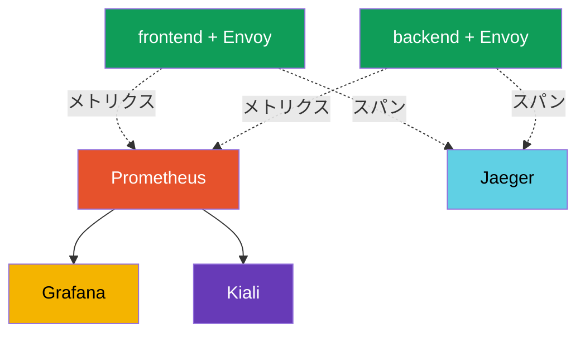

[Русская версия](ru.md) · [Eng version](en.md) · [Versión en español](es.md) · [Version française](fr.md) · [Deutsche Version](de.md) · [ქართული ვერსია](ge.md) · [繁體中文版](tw.md)

# 第17章。Observability: Prometheus、Grafana、Jaeger、Kiali

> **この次に。** トラフィックの管理と保護について学びました。次は、mesh 内で何が起きて
> いるかを**可視化**する方法を学びます。サービスが多く、何かが遅い場合、どこで、どれだけ
> エラーが発生しているか、どの程度の遅延か、誰が誰を呼び出しているかを素早く把握する必要が
> あります。Istio はこのテレメトリーをすべて自動で収集します。この章では、それを表示する
> ツール、Prometheus、Grafana、Jaeger、Kiali を扱います。

## 17.1. Observability の三本柱

Observability（可観測性）とは、外部シグナルからシステム内部で何が起きているかを理解する
能力です。通常、次の三本柱に分けられます。

- **メトリクス（metrics）** - 時系列の数値: 1 秒あたりのリクエスト数、エラー率、
  遅延。「何かがおかしいか、どの程度か」という問いに答えます。
- **トレース（traces）** - 1 つのリクエストがすべてのサービスを通る経路。「正確にどこが
  ボトルネックか」という問いに答えます。
- **ログ（logs）** - 個別のイベントに関する記録。「何が起きたか」という問いに答えます。

Istio の重要な利点は、sidecar プロキシがすべてのリクエストを確認するため、メトリクスと
トレースを**アプリケーションコードを変更せずに自動収集できる**ことです。

## 17.2. ツールとその連携

Istio 自体がテレメトリーを生成しますが、それを保存・表示するのは別のツール
（アドオン）です。それぞれの役割は異なります。

- **Prometheus** - メトリクスを収集・保存します。
- **Grafana** - Prometheus のメトリクスに基づいてダッシュボードを描画します。
- **Jaeger** - 分散トレースを保存・表示します。
- **Kiali** - メトリクスに基づいて mesh のサービスグラフを構築します。



重要: Istio がこれらのツールを強制的に導入するわけではありません。Istio は単にメトリクスと
スパンを**エクスポート**するだけであり、どの Prometheus/Jaeger を使うかは選択できます。
すぐに始めるために、Istio はアドオン用の完成済みマニフェストを提供しています（17.6 節）。

## 17.3. メトリクスと Prometheus

各 Pod の Envoy はすべてのリクエストについてメトリクスを計算し、Prometheus に提供します。
最も重要なもの（「ゴールデンシグナル」と呼ばれます）は次のとおりです。

- **`istio_requests_total`** - リクエストカウンター。これにより RPS とエラー率を計算します。
- **`istio_request_duration_milliseconds`** - リクエストの遅延（レイテンシ）。

各メトリクスには `source_workload`、`destination_workload`、`response_code`、
`destination_service` などの豊富なラベルセットがあります。これにより、たとえば
「frontend からのリクエストに対して payments サービスが返した 5xx 応答数」を確認できます。

非 HTTP トラフィック（TCP、DB、ブローカー - 第10章）には HTTP メトリクスはありませんが、
専用のものがあります。`istio_tcp_connections_opened_total`、
`istio_tcp_connections_closed_total`、`istio_tcp_sent_bytes_total` /
`istio_tcp_received_bytes_total` で、接続数とトラフィック量を確認します。

Prometheus API を通じて直接メトリクスをクエリできます。

```bash
kubectl exec -n default deploy/curl-client -c curl -- \
  curl -s 'http://prometheus.istio-system:9090/api/v1/query?query=istio_requests_total{destination_service_name="ping-pong"}'
```

ゼロ以外の結果は、Prometheus が Istio のメトリクスを収集していることを意味します。これらの
メトリクスは Grafana のダッシュボード、Kiali のグラフ、そしてたとえば Flagger の自動 canary
（第25章）の基盤です。

## 17.4. Grafana: ダッシュボード

Prometheus はメトリクスを保存しますが、生の数値を見るのは不便です。**Grafana** はそれらを
グラフとして描画します。Istio は完成済みのダッシュボードを提供します。mesh の全体概要、
サービス別、ワークロード別、control plane（istiod）自体のダッシュボードです。

ダッシュボードでは、各サービスの RPS、エラー率、遅延パーセンタイル（p50、p90、p99）を、
手動でクエリを設定せずにすぐ確認できます。UI へのアクセスには通常 port-forward を使います。

```bash
kubectl -n istio-system port-forward svc/grafana 3000:3000
```

## 17.5. 分散トレーシングと Jaeger

メトリクスは「payments サービスが遅い」と教えてくれますが、リクエストは通常複数の
サービスを通過するため、**どの区間で**時間が失われているのかを理解する必要があります。
これが分散トレーシングの役割です。1 つのリクエストは**スパン**の連鎖、つまりサービスごとに
1 スパンを生成し、それらがまとまって**トレース**を形成します。**Jaeger** はこれらのトレースを
保存・表示します。


Jaeger では、このリクエストは `gateway -> frontend -> backend ->
database` というスパンの連鎖として、各区間の遅延とともに表示されるため、ボトルネックがすぐに
分かります。

**トレーシングで最も重要な注意点。** Istio はスパンを自動生成しますが、見落とされがちな
条件が一つあります。アプリケーションは、受信リクエストから送信リクエストへ**トレーシング
ヘッダーを伝播させる必要があります**。Envoy はヘッダー（`x-request-id`、`traceparent`、
`b3` など）を追加しますが、受信リクエストと送信リクエストを関連付けられるのは
アプリケーション自身だけです。次のサービスを呼び出す際に、これらのヘッダーをコピー
しなければなりません。

アプリケーションがこれを行わない場合、トレースは相互に関連しない断片に分かれます。スパンは
見えますが、1 つの連鎖として組み立てられません。トレーシングのためにアプリケーションコードに
必要なのは、複数のヘッダーを伝播することだけです。

もう一つのパラメータは**サンプリング**です。デフォルトでは、余分な負荷を発生させないため、
Istio はごく一部のリクエスト（約 1%）だけをトレースに送ります。デバッグ時には、Telemetry API
を通じて割合を 100% に上げられます（詳細は第18章）。

**OpenTelemetry は現在の標準です。** ここでの Jaeger はむしろ「トレースを表示するバックエンド」
であり、その配信方法は業界で **OpenTelemetry (OTel)** を中心に統一されました。Jaeger 独自の
クライアント SDK はすでに OTel を優先して非推奨とされています。Istio は `opentelemetry`
プロバイダーを通じて **OTLP** プロトコルでトレースを送信でき（MeshConfig と Telemetry API、
第18章で設定）、受信側には Jaeger、Grafana Tempo、クラウドサービスなど、OTLP をサポートする
任意のものを置けます。しばしば中間に **OpenTelemetry Collector** を置きます。これは Envoy が
スパンを送信し、そこから一つ以上のバックエンドへルーティングするプロキシ兼アグリゲーターです。
実務上の結論: この章の「Jaeger」は UI/ストレージを指し、現在のトレース転送には OTLP を選びます。

## 17.6. Kiali: サービスグラフ

**Kiali** は「自分の mesh が全体としてどのように構成され、現在そこで何が起きているか」という
問いに答えます。サービスの存在、呼び出し元と呼び出し先、各接続のトラフィック量、エラーを
視覚的なグラフとして構築します。グラフは Prometheus のメトリクスに基づいています。

Kiali は全体像の把握、トラフィックのないサービスの発見、特定の接続でのエラー急増の検知、
さらに Istio 設定の検証（頻出の問題を強調表示します）にも便利です。Kiali にトレーシング
バックエンド（Jaeger/Tempo）を接続すると、**グラフから直接トレースを表示**することもできます。
サービスをクリックすると、別の Jaeger UI に切り替えずに特定リクエストのトレースへ進めます。
UI へのアクセス:

```bash
kubectl -n istio-system port-forward svc/kiali 20001:20001
```

## 17.7. アドオンのインストール

Istio は、ダウンロードしたディストリビューションの `samples/addons` ディレクトリにある完成済み
マニフェストとして、4 つすべてのツールを提供します。

```bash
REL=release-1.29
kubectl apply -f https://raw.githubusercontent.com/istio/istio/$REL/samples/addons/prometheus.yaml
kubectl apply -f https://raw.githubusercontent.com/istio/istio/$REL/samples/addons/grafana.yaml
kubectl apply -f https://raw.githubusercontent.com/istio/istio/$REL/samples/addons/jaeger.yaml
kubectl apply -f https://raw.githubusercontent.com/istio/istio/$REL/samples/addons/kiali.yaml
```

重要: これらのマニフェストはデモと学習用です。本番環境では通常、独自にすでにデプロイされた
Prometheus と Grafana（たとえば kube-prometheus-stack 由来）を使用し、Istio をそれらに
メトリクスとトレースを送信するよう設定します。

## 17.8. 本番向けのベストプラクティス

`samples/addons` のアドオンはデモ用です。実運用ではアプローチが異なります。

**メトリクスと Prometheus:**

- demo-Prometheus は使わないでください。retention、HA、長期ストレージへの remote-write
  （Thanos、Mimir、VictoriaMetrics）を備えた完全なスタック（kube-prometheus-stack /
  Prometheus Operator）をデプロイします。demo-Prometheus はデータをメモリに保存し、再起動時に
  失います。
- **メトリクスのカーディナリティ**を監視してください。Istio のメトリクスには多くのラベル
  （source、destination、response_code など）があり、大規模な mesh では Prometheus のメモリを
  「爆発」させる可能性があります。不要なラベルとメトリクスは Telemetry API（第18章）で削除します。
- アプリケーションだけでなく、**control plane**（istiod）自体を必ず監視してください。その
  メトリクスは設定配信と証明書の健全性を示します。

**トレーシング:**

- 本番で**サンプリングを 100% に設定しないでください**。余計な負荷とデータ量になります。
  通常は 1-5% とし、限定的なデバッグでは一時的に上げるか force-trace を使用します。
- 本番でメモリベースの Jaeger all-in-one を使わないでください。永続ストレージを持つバックエンド
  （Elasticsearch、Cassandra）またはマネージドソリューション（Grafana Tempo、クラウドサービス）が
  必要です。
- トレースが途切れないよう、アプリケーションはトレーシングヘッダーを伝播する必要があることを
  忘れないでください（17.5 節）。

**ログ:**

- Envoy の access log は大容量です。mesh 全体で full access log を有効にしないでください。
  Telemetry API（第18章）を通じて選択的に（namespace/サービス単位で）有効にするか、形式を
  制限します。

**ダッシュボード、アラート、アクセス:**

- **ゴールデンシグナルに対するアラート**を設定します。エラー率（5xx）、p99 遅延、飽和度です。
  ダッシュボードがあるだけではアラートの代わりにはなりません。
- 本番の Kiali は read-only モードにし、アクセスを制限してください。そこから mesh 全体の
  トポロジーが見えてしまいます。
- Grafana、Kiali、Jaeger を認証なしで外部公開しないでください。認可を備えた ingress の背後に
  隠すか、port-forward/VPN 経由のアクセスだけにします。

**EKS/AWS 上の Observability。** Prometheus/Grafana/Jaeger を自分で運用したくない場合、AWS には
マネージドサービスがあり、Istio は標準的に統合できます。

- **Amazon Managed Service for Prometheus (AMP)** - マネージドのメトリクスストレージです。
  独自の Prometheus（agent モード）または ADOT コレクターが AMP へ `remote_write` を行い、
  ストレージとスケーリングは AWS 側が担当します。
- **Amazon Managed Grafana (AMG)** - AMP と X-Ray にすぐ統合できるマネージド Grafana です。
  Istio のダッシュボードもここに配置します。
- **AWS Distro for OpenTelemetry (ADOT)** - AWS による OpenTelemetry Collector のディストリビューションです。
  Envoy は OTLP 経由でメトリクス/トレースを ADOT に送信し、ADOT はそれらを AMP（メトリクス）、
  **AWS X-Ray** または Tempo（トレース）、CloudWatch（ログ）へ配信します。
- **トレーシング** - 自前の Jaeger の代わりに、OTLP/ADOT を通じて **AWS X-Ray** へ送ります。
- Envoy の**ログ** - ノード上の Fluent Bit / CloudWatch agent を通じて **CloudWatch Logs** へ送ります。

AMP/AMG/X-Ray へのアクセスは IAM（コレクターの ServiceAccount に対する IRSA）経由で付与され、
シークレットとスケーリングは AWS が担います。これは第16章の ACM PCA と同じ原則です。運用は
マネージドサービスに任せ、クラスター内にはエクスポーター/コレクターだけを置きます。

短い原則: demo スタックは試すには良いものですが、本番はアラートと適切なサンプリングを備えた、
専用でスケーラブルかつ保護された observability スタックで構築します。

## 17.9. 章のまとめ

- Observability はメトリクス、トレース、ログの三本柱に基づいています。
- Istio はメトリクスとトレースを自動収集します。sidecar が各リクエストを見るため、
  アプリケーションコードを変更する必要はありません。
- **Prometheus** は豊富なラベルを持つメトリクス（`istio_requests_total`、
  `istio_request_duration_milliseconds`）を保存します。これらは mesh のゴールデンシグナルです。
- **Grafana** はメトリクスに基づいて完成済みの Istio ダッシュボードを描画します。
- **Jaeger** は分散トレース、すなわちサービスを通るリクエストの経路とボトルネックを表示します。
- **Kiali** は Prometheus のメトリクスに基づいて mesh のサービスグラフを構築します。
- トレーシングでは、トレースが分断されないよう、アプリケーションは受信リクエストから送信
  リクエストへ**トレーシングヘッダーを伝播しなければなりません**。
- 現在のトレース転送は **OpenTelemetry/OTLP** です（Jaeger クライアントは非推奨）。Istio は
  `opentelemetry` プロバイダーを通じて、しばしば OpenTelemetry Collector 経由で OTLP により
  スパンを送信し、Jaeger は UI/ストレージとして機能します。
- 非 HTTP トラフィックには専用の `istio_tcp_*` メトリクス（接続、バイト数）があります。
- `samples/addons` のアドオンはデモに適しています。本番では独自の Prometheus/Grafana を接続します。
- 本番プラクティス: retention と remote-write を備えた専用でスケーラブルな Prometheus、
  メトリクスのカーディナリティ制御、1-5% のトレースサンプリング、永続的なトレースバックエンド、
  選択的な access log、ゴールデンシグナルへのアラート、保護された UI アクセス、istiod 自体の監視。
- EKS では observability をマネージドサービスに任せられます。**AMP**（メトリクス）、**AMG**
  （Grafana）、**ADOT**（OpenTelemetry Collector）、**X-Ray**（トレース）、CloudWatch（ログ）で、
  アクセスは IRSA 経由です。

## 17.10. 自己確認のための質問

1. Observability の三本柱と、それぞれが答える問いを挙げてください。
2. なぜ Istio はアプリケーションコードを変更せずにメトリクスとトレースを収集できるのですか？
3. どの Istio メトリクスがゴールデンシグナルとされ、どのラベルが有用ですか？
4. Grafana、Jaeger、Kiali はそれぞれ何を担当しますか？
5. トレースが断片化しないために、アプリケーションは何をすべきですか？
6. なぜ `samples/addons` のアドオンをそのまま本番環境で使用すべきではないのですか？
7. observability の主要な本番プラクティスを挙げてください。トレースサンプリング、メトリクスの
   カーディナリティ、メトリクス/トレースの保存、UI へのアクセスについて何をすべきですか？
8. OpenTelemetry/OTLP とは何であり、このトレース転送における Jaeger の役割は何ですか？
9. EKS で Istio の observability に使用する AWS のマネージドサービスと、ADOT の役割を説明してください。
10. 非 HTTP（TCP）トラフィックはどのメトリクスで確認しますか？

## 演習

Observability スタック（Prometheus、Grafana、Jaeger、Kiali）をデプロイし、トラフィックを生成して、
メトリクス、トレース、サービスグラフを確認してください。

🧪 ラボ 08: [tasks/ica/labs/08](../../labs/08/README_JP.MD)

---
[目次](../README_JP.md) · [第16章](../16/jp.md) · [第18章](../18/jp.md)
