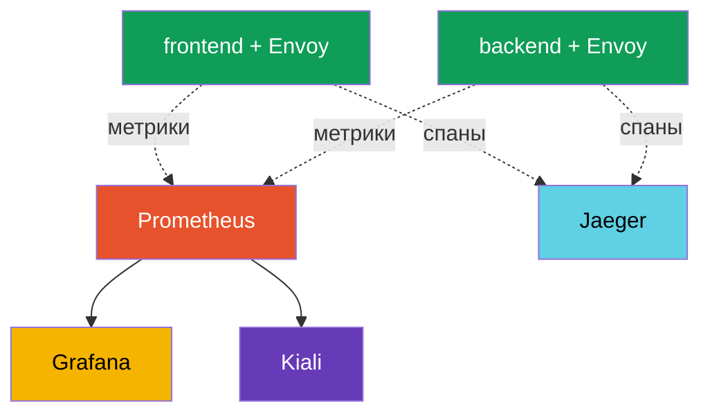

# Глава 17. Observability: Prometheus, Grafana, Jaeger, Kiali

> **Что дальше.** Мы научились управлять трафиком и защищать его. Теперь научимся
> **видеть**, что происходит в mesh. Когда сервисов много и что-то тормозит, надо
> быстро понять: где, сколько ошибок, какая задержка, кто кого зовёт. Istio собирает
> всю эту телеметрию автоматически. В этой главе разберём инструменты, которые её
> показывают: Prometheus, Grafana, Jaeger и Kiali.

## 17.1. Три столпа observability

Observability (наблюдаемость) - это способность понять, что происходит внутри системы,
по её внешним сигналам. Обычно её делят на три столпа:

- **Метрики (metrics)** - числа во времени: сколько запросов в секунду, доля ошибок,
  задержка. Отвечают на вопрос «что-то не так и насколько».
- **Трейсы (traces)** - путь одного запроса через все сервисы. Отвечают на вопрос «где
  именно затык».
- **Логи (logs)** - записи о конкретных событиях. Отвечают на вопрос «что именно
  случилось».

Ключевое преимущество Istio: sidecar-прокси видит каждый запрос, поэтому метрики и
трейсы собираются **автоматически, без изменения кода приложения**.

## 17.2. Инструменты и как они связаны

Istio сам генерирует телеметрию, но хранят и показывают её отдельные инструменты
(аддоны). Каждый под своей задаче:

- **Prometheus** - собирает и хранит метрики.
- **Grafana** - рисует дашборды поверх метрик Prometheus.
- **Jaeger** - хранит и показывает распределённые трейсы.
- **Kiali** - строит граф сервисов mesh поверх метрик.



Важно: Istio не тянет за собой эти инструменты насильно. Он лишь **экспортирует**
метрики и спаны, а какой Prometheus/Jaeger использовать - ваш выбор. Для быстрого старта
Istio поставляет готовые манифесты аддонов (раздел 17.6).

## 17.3. Метрики и Prometheus

Envoy в каждом поде считает метрики по каждому запросу и отдаёт их Prometheus. Самые
важные (их называют «золотые сигналы»):

- **`istio_requests_total`** - счётчик запросов. По нему считают RPS и долю ошибок.
- **`istio_request_duration_milliseconds`** - задержка запросов (латентность).

У каждой метрики есть богатый набор меток: `source_workload`, `destination_workload`,
`response_code`, `destination_service` и другие. Благодаря им можно посмотреть, например,
«сколько 5xx-ответов отдал сервис payments запросам от frontend».

Запросить метрику можно прямо через API Prometheus:

```bash
kubectl exec -n default deploy/curl-client -c curl -- \
  curl -s 'http://prometheus.istio-system:9090/api/v1/query?query=istio_requests_total{destination_service_name="ping-pong"}'
```

Ненулевой результат означает, что Prometheus собирает метрики Istio. Именно эти метрики
лежат в основе дашбордов Grafana, графа Kiali и, например, автоматического canary во
Flagger (глава 25).

## 17.4. Grafana: дашборды

Prometheus хранит метрики, но смотреть на сырые числа неудобно. **Grafana** рисует по
ним графики. Istio поставляет готовые дашборды: общий обзор mesh, дашборд по сервисам,
по рабочим нагрузкам и по самому control plane (istiod).

На дашбордах вы сразу видите RPS, долю ошибок и перцентили задержки (p50, p90, p99) по
каждому сервису - без ручной настройки запросов. Для доступа к UI обычно используют
port-forward:

```bash
kubectl -n istio-system port-forward svc/grafana 3000:3000
```

## 17.5. Distributed tracing и Jaeger

Метрики говорят «сервис payments медленный», но запрос обычно проходит через несколько
сервисов, и надо понять, **на каком участке** теряется время. Это задача распределённой
трассировки. Один запрос порождает цепочку **спанов** - по спану на каждый сервис, - и
вместе они образуют **трейс**. **Jaeger** хранит и показывает эти трейсы.


В Jaeger такой запрос выглядит как цепочка спанов `gateway -> frontend -> backend ->
database` с задержкой на каждом участке, и сразу видно, где узкое место.

**Важнейшая тонкость трассировки.** Istio генерирует спаны автоматически, но есть одно
условие, которое часто упускают: приложение **должно пробрасывать заголовки
трассировки** из входящего запроса в исходящие. Envoy добавляет заголовки (`x-request-id`,
`traceparent`, `b3` и др.), но связать входящий запрос с исходящим может только само
приложение - оно должно скопировать эти заголовки, когда зовёт следующий сервис.

Если приложение этого не делает, трейс распадётся на отдельные несвязанные кусочки: вы
увидите спаны, но не сможете собрать их в одну цепочку. Это единственное, что требуется
от кода приложения для трассировки - пробросить несколько заголовков.

Ещё один параметр - **сэмплирование**. По умолчанию Istio отправляет в трейсы лишь малую
долю запросов (порядка 1%), чтобы не создавать лишнюю нагрузку. Для отладки долю можно
поднять до 100% через Telemetry API (подробно в главе 18).

## 17.6. Kiali: граф сервисов

**Kiali** отвечает на вопрос «как вообще устроен мой mesh и что в нём сейчас
происходит». Он строит наглядный граф: какие сервисы есть, кто кого зовёт, сколько
трафика идёт по каждой связи, где ошибки. Граф строится поверх метрик Prometheus.

Kiali удобен, чтобы увидеть общую картину, найти сервисы без трафика, заметить всплеск
ошибок на конкретной связи и даже проверить конфигурацию Istio (он подсвечивает частые
проблемы). Доступ к UI:

```bash
kubectl -n istio-system port-forward svc/kiali 20001:20001
```

## 17.7. Установка аддонов

Все четыре инструмента Istio поставляет как готовые манифесты в каталоге `samples/addons`
скачанного дистрибутива:

```bash
REL=release-1.29
kubectl apply -f https://raw.githubusercontent.com/istio/istio/$REL/samples/addons/prometheus.yaml
kubectl apply -f https://raw.githubusercontent.com/istio/istio/$REL/samples/addons/grafana.yaml
kubectl apply -f https://raw.githubusercontent.com/istio/istio/$REL/samples/addons/jaeger.yaml
kubectl apply -f https://raw.githubusercontent.com/istio/istio/$REL/samples/addons/kiali.yaml
```

Важно: эти манифесты - для демо и обучения. В продакшене обычно используют собственные,
уже развёрнутые Prometheus и Grafana (например, из kube-prometheus-stack), а Istio
настраивают на отправку метрик и трейсов в них.

## 17.8. Best practices для прода

Аддоны из `samples/addons` - для демо. В реальной эксплуатации подход другой.

**Метрики и Prometheus:**

- Не используйте demo-Prometheus. Разворачивайте полноценный стек (kube-prometheus-stack
  / Prometheus Operator) с retention, HA и remote-write в долговременное хранилище
  (Thanos, Mimir, VictoriaMetrics). Demo-Prometheus хранит данные в памяти и теряет их
  при перезапуске.
- Следите за **кардинальностью метрик**. У метрик Istio много меток (source, destination,
  response_code и т.д.), и на большом mesh это может «взорвать» Prometheus по памяти.
  Лишние метки и метрики убирайте через Telemetry API (глава 18).
- Обязательно мониторьте **сам control plane** (istiod), а не только приложения: его
  метрики показывают здоровье выпуска конфигурации и сертификатов.

**Трейсинг:**

- В проде **не ставьте сэмплирование на 100%** - это лишняя нагрузка и объём. Обычно
  1-5%, а для точечной отладки поднимают временно или используют force-trace.
- Не используйте Jaeger all-in-one (память) в проде. Нужен бэкенд с постоянным хранилищем
  (Elasticsearch, Cassandra) или managed-решение (Grafana Tempo, облачные сервисы).
- Помните: чтобы трейсы не рвались, приложения должны пробрасывать заголовки трассировки
  (раздел 17.5).

**Логи:**

- Access-логи Envoy объёмны. Не включайте full access log на весь mesh - включайте
  выборочно (по namespace/сервису) через Telemetry API (глава 18) или ограничивайте формат.

**Дашборды, алерты и доступ:**

- Настройте **алерты на золотые сигналы**: доля ошибок (5xx), задержка p99, насыщение.
  Само наличие дашбордов не заменяет алерты.
- Kiali в проде держите в режиме read-only и ограничивайте доступ - через него видна вся
  топология mesh.
- Не выставляйте Grafana, Kiali и Jaeger наружу без аутентификации. Прячьте их за ingress
  с авторизацией (или доступ только через port-forward/VPN).

Короткое правило: demo-стек хорош, чтобы «пощупать», но прод строится на выделенном,
масштабируемом и защищённом стеке observability с алертами и разумным сэмплированием.

## 17.9. Итоги главы

- Observability стоит на трёх столпах: метрики, трейсы, логи.
- Istio собирает метрики и трейсы автоматически - sidecar видит каждый запрос, код
  приложения менять не надо.
- **Prometheus** хранит метрики (`istio_requests_total`,
  `istio_request_duration_milliseconds`) с богатыми метками; это золотые сигналы mesh.
- **Grafana** рисует готовые дашборды Istio поверх метрик.
- **Jaeger** показывает распределённые трейсы - путь запроса через сервисы и где затык.
- **Kiali** строит граф сервисов mesh поверх метрик Prometheus.
- Для трассировки приложение обязано **пробрасывать заголовки трассировки** из входящих
  запросов в исходящие, иначе трейс распадётся.
- Аддоны из `samples/addons` хороши для демо; в проде подключают свои Prometheus/Grafana.
- Прод-практики: выделенный масштабируемый Prometheus с retention и remote-write,
  контроль кардинальности метрик, сэмплирование трейсов 1-5%, персистентный бэкенд
  трейсов, выборочные access-логи, алерты на золотые сигналы, защищённый доступ к UI,
  мониторинг самого istiod.

## 17.10. Вопросы для самопроверки

1. Назовите три столпа observability и на какие вопросы отвечает каждый.
2. Почему Istio собирает метрики и трейсы без изменения кода приложения?
3. Какие метрики Istio считаются золотыми сигналами и какие у них полезные метки?
4. За что отвечают Grafana, Jaeger и Kiali?
5. Что должно делать приложение, чтобы трейсы не распадались на куски?
6. Почему аддоны из `samples/addons` не стоит использовать в продакшене как есть?
7. Назовите ключевые прод-практики observability: что делать с сэмплированием трейсов,
   кардинальностью метрик, хранением метрик/трейсов и доступом к UI?

## Практика

Разверните стек observability (Prometheus, Grafana, Jaeger, Kiali), сгенерируйте трафик
и проверьте метрики, трейсы и граф сервисов:

🧪 Лаба 08: [tasks/ica/labs/08](../../labs/08/README_RU.MD)

---
[Оглавление](../README.md) · [Глава 16](../16/ru.md) · [Глава 18](../18/ru.md)
