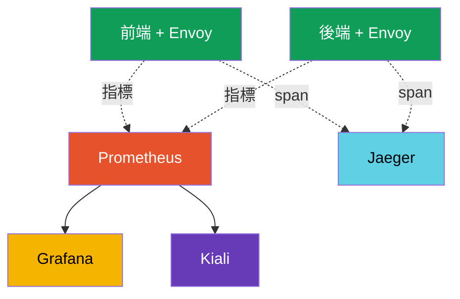

[Русская версия](ru.md) · [Eng version](en.md) · [Versión en español](es.md) · [Version française](fr.md) · [Deutsche Version](de.md) · [ქართული ვერსია](ge.md) · [日本語版](jp.md)

# 第 17 章。Observability：Prometheus、Grafana、Jaeger、Kiali

> **接下來。** 我們已學會管理流量並加以保護。現在要學會**看見** mesh 中正在發生的事。當服務很多且某些部分變慢時，您必須快速了解：問題在哪裡、有多少錯誤、延遲多少、誰呼叫誰。Istio 會自動收集所有這些遙測資料。本章將介紹用來呈現它們的工具：Prometheus、Grafana、Jaeger 與 Kiali。

## 17.1. Observability 的三大支柱

Observability（可觀測性）是指根據系統的外部訊號，了解其內部正在發生什麼的能力。通常分為三大支柱：

- **指標（metrics）**--隨時間變化的數值：每秒多少請求、錯誤比例、延遲。回答「是否有問題，以及問題有多嚴重」。
- **追蹤（traces）**--單一請求經過所有服務的路徑。回答「瓶頸究竟在哪裡」。
- **日誌（logs）**--特定事件的紀錄。回答「究竟發生了什麼」。

Istio 的關鍵優勢是：sidecar Proxy 能看見每個請求，因此指標與追蹤會**自動收集，無須變更應用程式碼**。

## 17.2. 工具及其關聯方式

Istio 本身產生遙測資料，但由獨立工具（addon）儲存並呈現。每個工具都有自己的用途：

- **Prometheus**--收集並儲存指標。
- **Grafana**--根據 Prometheus 指標繪製儀表板。
- **Jaeger**--儲存並呈現分散式追蹤。
- **Kiali**--根據指標建立 mesh 的服務圖。



重要的是：Istio 不會強制附帶這些工具。它只會**匯出**指標與 span，而使用哪個 Prometheus/Jaeger 由您選擇。若要快速開始，Istio 提供現成的 addon manifest（17.6 節）。

## 17.3. 指標與 Prometheus

每個 Pod 中的 Envoy 都會計算每個請求的指標，並將其提供給 Prometheus。最重要的指標（稱為「黃金訊號」）如下：

- **`istio_requests_total`**--請求計數器。用它計算 RPS 與錯誤比例。
- **`istio_request_duration_milliseconds`**--請求延遲（latency）。

每個指標都有豐富的 label 集合：`source_workload`、`destination_workload`、`response_code`、`destination_service` 等。因此，例如可以查看「payments 服務針對來自 frontend 的請求回傳了多少 5xx 回應」。

對於非 HTTP 流量（TCP、資料庫、訊息代理--第 10 章），沒有 HTTP 指標，但有其專屬指標：
`istio_tcp_connections_opened_total`、`istio_tcp_connections_closed_total`、
`istio_tcp_sent_bytes_total` / `istio_tcp_received_bytes_total`--用來檢視連線與流量大小。

您可以直接透過 Prometheus API 查詢指標：

```bash
kubectl exec -n default deploy/curl-client -c curl -- \
  curl -s 'http://prometheus.istio-system:9090/api/v1/query?query=istio_requests_total{destination_service_name="ping-pong"}'
```

非零結果表示 Prometheus 正在收集 Istio 指標。正是這些指標構成 Grafana 儀表板、Kiali 圖表，以及例如 Flagger 自動 canary（第 25 章）的基礎。

## 17.4. Grafana：儀表板

Prometheus 儲存指標，但直接查看原始數字並不方便。**Grafana** 會根據它們繪製圖表。Istio 提供現成儀表板：整體 mesh 概覽、服務儀表板、工作負載儀表板，以及 control plane（istiod）本身的儀表板。

您會立即在儀表板上看到每項服務的 RPS、錯誤比例與延遲百分位數（p50、p90、p99），無須手動設定查詢。通常透過 port-forward 存取 UI：

```bash
kubectl -n istio-system port-forward svc/grafana 3000:3000
```

## 17.5. 分散式追蹤與 Jaeger

指標會告訴您「payments 服務很慢」，但請求通常會經過多個服務，您必須了解時間**耗費在哪一段**。這正是分散式追蹤的任務。一個請求會產生一串 **span**--每個服務一個 span--它們共同構成一個 **trace**。**Jaeger** 儲存並呈現這些 trace。


在 Jaeger 中，此請求呈現為 span 鏈 `gateway -> frontend -> backend ->
database`，各區段都有延遲，瓶頸位置一目了然。

**追蹤最重要的細節。** Istio 會自動產生 span，但有一項經常被忽略的條件：應用程式**必須將追蹤標頭傳遞**，從傳入請求傳至傳出請求。Envoy 會新增標頭（`x-request-id`、`traceparent`、`b3` 等），但只有應用程式本身可以關聯傳入與傳出的請求--它在呼叫下一個服務時必須複製這些標頭。

若應用程式未這樣做，trace 將分解為彼此無關的片段：您仍會看到 span，但無法將它們組成單一鏈路。這是追蹤對應用程式碼唯一的要求--傳遞幾個標頭。

另一個參數是**取樣（sampling）**。預設 Istio 只會將少量請求（約 1%）傳送至 trace，以免產生額外負載。若要偵錯，可透過 Telemetry API 將比例提高至 100%（第 18 章詳述）。

**OpenTelemetry 是目前的標準。** Jaeger 在此更像是「呈現 trace 的後端」，而業界已將 trace 傳輸方式統一為 **OpenTelemetry (OTel)**：Jaeger 自有用戶端 SDK 已被視為過時，改用 OTel。Istio 能透過提供者 `opentelemetry` 依 **OTLP** 協定傳送 trace（在 MeshConfig 與 Telemetry API 中設定，第 18 章），接收端可以是任何支援 OTLP 的工具--Jaeger、Grafana Tempo 或雲端服務。通常中間會部署 **OpenTelemetry Collector**：一個 Proxy 聚合器，Envoy 將 span 傳給它，再由它將資料路由至一個或多個後端。實務結論是：本章中的「Jaeger」指的是 UI/儲存，而如今的 trace 傳輸選擇 OTLP。

## 17.6. Kiali：服務圖

**Kiali** 回答「我的 mesh 整體架構是什麼，目前正在發生什麼」。它建立直觀的圖表：有哪些服務、誰呼叫誰、每條連線的流量有多少、哪裡有錯誤。圖表建構於 Prometheus 指標之上。

Kiali 很適合用來查看全貌、找出沒有流量的服務、發現特定連線的錯誤激增，甚至檢查 Istio 設定（它會標示常見問題）。若為 Kiali 接上追蹤後端（Jaeger/Tempo），它也能**直接從圖表顯示 trace**--點選服務即可深入查看特定請求的追蹤，不必切換至獨立的 Jaeger UI。UI 存取方式：

```bash
kubectl -n istio-system port-forward svc/kiali 20001:20001
```

## 17.7. 安裝 addon

Istio 將全部四項工具作為現成 manifest，放在下載發行版的 `samples/addons` 目錄中：

```bash
REL=release-1.29
kubectl apply -f https://raw.githubusercontent.com/istio/istio/$REL/samples/addons/prometheus.yaml
kubectl apply -f https://raw.githubusercontent.com/istio/istio/$REL/samples/addons/grafana.yaml
kubectl apply -f https://raw.githubusercontent.com/istio/istio/$REL/samples/addons/jaeger.yaml
kubectl apply -f https://raw.githubusercontent.com/istio/istio/$REL/samples/addons/kiali.yaml
```

重要的是：這些 manifest 是供示範與學習使用。在正式環境，通常使用自行部署、已經運行的 Prometheus 與 Grafana（例如來自 kube-prometheus-stack），並設定 Istio 將指標與 trace 傳送到其中。

## 17.8. 正式環境的最佳實務

`samples/addons` 中的 addon 僅供示範。實際操作中應採用不同的方法。

**指標與 Prometheus：**

- 不要使用 demo-Prometheus。請部署具備 retention、HA 及 remote-write 至長期儲存空間（Thanos、Mimir、VictoriaMetrics）的完整堆疊（kube-prometheus-stack / Prometheus Operator）。Demo-Prometheus 將資料保存在記憶體中，重新啟動後資料就會遺失。
- 注意**指標基數（cardinality）**。Istio 指標有很多 label（source、destination、response_code 等），在大型 mesh 中可能使 Prometheus 的記憶體用量「爆炸」。透過 Telemetry API 移除不必要的 label 與指標（第 18 章）。
- 務必監控**control plane 本身**（istiod），而不只監控應用程式：其指標顯示設定與憑證發布的健康狀態。

**追蹤：**

- 正式環境**不要將取樣設定為 100%**--這會造成不必要的負載與資料量。通常設定 1–5%，而針對性偵錯時才暫時提高或使用 force-trace。
- 不要在正式環境使用 Jaeger all-in-one（記憶體）。您需要有持久化儲存的後端（Elasticsearch、Cassandra）或受管解決方案（Grafana Tempo、雲端服務）。
- 請記住：為避免 trace 中斷，應用程式必須傳遞追蹤標頭（17.5 節）。

**日誌：**

- Envoy access log 的資料量很大。請勿在整個 mesh 啟用完整 access log--透過 Telemetry API（第 18 章）選擇性啟用（依 namespace/服務），或限制格式。

**儀表板、告警與存取：**

- 設定**黃金訊號告警**：錯誤比例（5xx）、p99 延遲、飽和度。光有儀表板不能取代告警。
- 正式環境中的 Kiali 應保持 read-only 模式並限制存取--它可看見整個 mesh 拓撲。
- 請勿在未驗證身分的情況下將 Grafana、Kiali 和 Jaeger 對外公開。將它們放在具有授權機制的 ingress 後方（或只允許經由 port-forward/VPN 存取）。

**EKS/AWS 上的 Observability。** 若不想自行維護 Prometheus/Grafana/Jaeger，AWS 提供受管服務，且 Istio 可原生整合：

- **Amazon Managed Service for Prometheus (AMP)**--受管指標儲存空間。自行部署的 Prometheus（agent 模式）或 ADOT Collector 會將 `remote_write` 寫入 AMP；儲存與擴展由 AWS 負責。
- **Amazon Managed Grafana (AMG)**--受管 Grafana，可直接整合 AMP 與 X-Ray；Istio 儀表板也部署於此。
- **AWS Distro for OpenTelemetry (ADOT)**--AWS 提供的 OpenTelemetry Collector 發行版。Envoy 經由 OTLP 將指標/trace 傳給 ADOT，而 ADOT 會將資料分送至 AMP（指標）、**AWS X-Ray** 或 Tempo（trace）、CloudWatch（日誌）。
- **追蹤**--透過 OTLP/ADOT 傳送至 **AWS X-Ray**（取代自行維護 Jaeger）。
- **Envoy 日誌**--傳送至 **CloudWatch Logs**（透過節點上的 Fluent Bit / CloudWatch agent）。

透過 IAM 為 AMP/AMG/X-Ray 提供存取權（給 Collector ServiceAccount 的 IRSA）；秘密管理與擴展則由 AWS 負責。這與第 16 章的 ACM PCA 採用相同原則：將營運工作交給受管服務，而在叢集中只保留 exporter/collector。

簡短的規則是：demo 堆疊適合「實際摸索」，但正式環境應建立在具備告警與合理取樣的專用、可擴展且受保護的 observability 堆疊之上。

## 17.9. 本章總結

- Observability 有三大支柱：指標、追蹤、日誌。
- Istio 自動收集指標與追蹤--sidecar 能看見每個請求，無須變更應用程式碼。
- **Prometheus** 儲存具有豐富 label 的指標（`istio_requests_total`、
  `istio_request_duration_milliseconds`）；這些是 mesh 的黃金訊號。
- **Grafana** 根據指標繪製現成的 Istio 儀表板。
- **Jaeger** 顯示分散式追蹤--請求經過服務的路徑與瓶頸位置。
- **Kiali** 根據 Prometheus 指標建立 mesh 的服務圖。
- 對於追蹤，應用程式必須將追蹤標頭從傳入請求**傳遞**至傳出請求，否則 trace 會分解。
- 現今 trace 傳輸使用 **OpenTelemetry/OTLP**（Jaeger 用戶端已過時）；Istio 透過提供者 `opentelemetry` 依 OTLP 傳送 span，通常經由 OpenTelemetry Collector，而 Jaeger 則作為 UI/儲存空間。
- 非 HTTP 流量有專屬的 `istio_tcp_*` 指標（連線、位元組）。
- `samples/addons` 中的 addon 適合示範；正式環境應接入自己的 Prometheus/Grafana。
- 正式環境實務：具備 retention 與 remote-write 的專用、可擴展 Prometheus、控制指標基數、trace 取樣 1–5%、持久化 trace 後端、選擇性 access log、黃金訊號告警、受保護的 UI 存取，以及監控 istiod 本身。
- 在 EKS 上，可將 observability 交給受管服務：**AMP**（指標）、**AMG**（Grafana）、**ADOT**（OpenTelemetry Collector）、**X-Ray**（trace）、CloudWatch（日誌）；經由 IRSA 存取。

## 17.10. 自我檢查問題

1. 請說出 observability 的三大支柱，以及每個支柱回答什麼問題。
2. 為何 Istio 無須變更應用程式碼就能收集指標與追蹤？
3. 哪些 Istio 指標被視為黃金訊號，它們有哪些實用的 label？
4. Grafana、Jaeger 與 Kiali 分別負責什麼？
5. 應用程式必須做什麼，才能避免 trace 分解為片段？
6. 為何不應直接在正式環境使用 `samples/addons` 中的 addon？
7. 請列出 observability 的關鍵正式環境實務：對 trace 取樣、指標基數、指標/trace 儲存及 UI 存取應如何處理？
8. 什麼是 OpenTelemetry/OTLP，在這種 trace 傳輸中 Jaeger 的角色是什麼？
9. 在 EKS 上，Istio observability 使用哪些 AWS 受管服務，ADOT 又做什麼？
10. 使用哪些指標檢視非 HTTP（TCP）流量？

## 實作練習

部署 observability 堆疊（Prometheus、Grafana、Jaeger、Kiali），產生流量，並檢查指標、追蹤與服務圖：

🧪 實驗 08：[tasks/ica/labs/08](../../labs/08/README_TW.MD)

---
[目錄](../README_TW.md) · [第 16 章](../16/tw.md) · [第 18 章](../18/tw.md)
