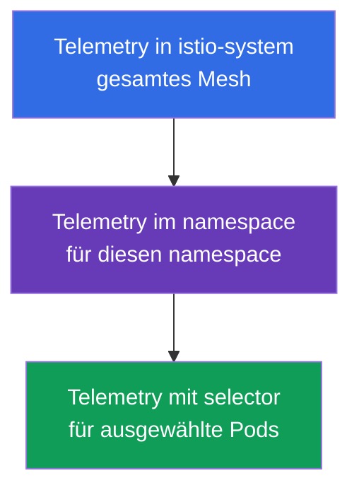
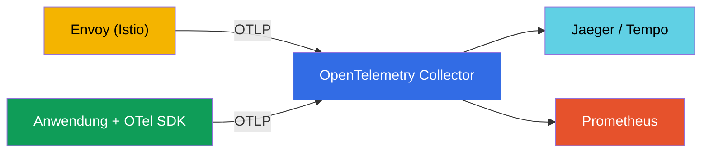
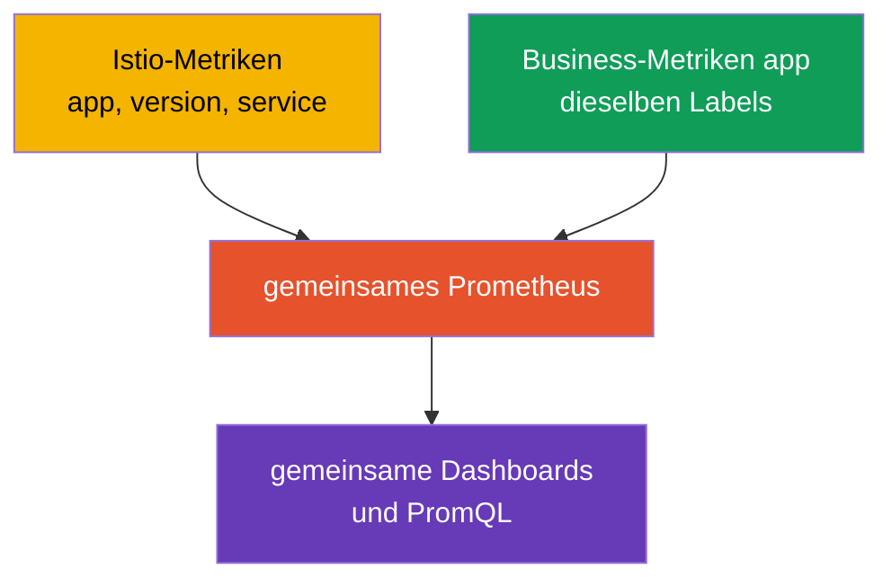

[RU version](ru.md) · [Eng version](en.md) · [Versión en español](es.md) · [Version française](fr.md)

# Kapitel 18. Telemetry API: Access Logs und verteiltes Tracing

> **Was kommt als Nächstes.** In Kapitel 17 haben wir den Observability-Stack ausgerollt und
> gesehen, dass Istio die Telemetrie automatisch sammelt. Aber man muss sie fein konfigurieren
> können: wo man Logs aktiviert, welchen Prozentsatz der Traces man sampelt, welche Metrik-Labels
> man behält. Früher tat man das auf verschiedene Weisen (meshConfig, EnvoyFilter), und jetzt gibt
> es ein einheitliches deklaratives Werkzeug - die **Telemetry API**.

## 18.1. Wozu die Telemetry API dient

Die Telemetry API (`telemetry.istio.io`) ist die moderne Art, die gesamte Telemetrie des Mesh aus
einem einzigen Ressourcentyp zu steuern: Access-Logs, Metriken und Traces. Sie ist an die Stelle
der zersplitterten Ansätze getreten (Einstellungen in `meshConfig`, manuelle `EnvoyFilter`) und
liefert zwei wichtige Dinge:

- **ein einheitliches deklaratives Format** für Logs, Metriken und Traces;
- **eine Hierarchie von Wirkungsbereichen** - man kann das Verhalten für das gesamte Mesh festlegen
  und es dann für einen einzelnen namespace oder sogar konkrete Pods überschreiben.

## 18.2. Hierarchie der Wirkungsbereiche

**Wozu das überhaupt nötig ist.** Verschiedene Services brauchen unterschiedliche Telemetrie. Logs
und Traces kosten Ressourcen und Geld, deshalb ist es unklug, alles von allen im Maximum zu
sammeln. Aber jeden Service einzeln zu konfigurieren ist unbequem. Das ideale Modell: **vernünftige
Standardeinstellungen für das gesamte Mesh** festlegen und dann punktuell **Ausnahmen machen**, wo
es anders sein soll. Genau das ermöglicht die Bereichshierarchie der Telemetry API.

Typische Situationen, in denen das hilft:

- **Kosten.** Für das gesamte Mesh halten wir das Trace-Sampling bei 1 % (günstig), aber für den
  Zahlungs-Service, bei dem das Audit wichtig ist, erhöhen wir es auf 100 %.
- **Rauschen.** Ein geschwätziger Service (zum Beispiel ein health-check) verstopft die Logs - wir
  deaktivieren die Logs genau für ihn, ohne die übrigen anzurühren.
- **Debugging.** Ein Service wird gerade repariert - wir aktivieren temporär detaillierte Logs und
  vollständiges Tracing nur für ihn und entfernen es nach dem Debugging.
- **Einheitlichkeit.** Die Standardeinstellungen sind an einer Stelle festgelegt (`istio-system`)
  und nicht in jeden namespace kopiert - weniger Duplizierung und Uneinheitlichkeit.

Nun wie das technisch aufgebaut ist. Die Ressource `Telemetry` wirkt auf unterschiedlicher Ebene,
je nachdem, wo sie erstellt wurde und ob sie einen `selector` hat:



- **Gesamtes Mesh** - `Telemetry` im Root-namespace (`istio-system`) ohne selector.
- **Namespace** - `Telemetry` im gewünschten namespace ohne selector.
- **Konkrete Pods** - `Telemetry` mit `selector.matchLabels`.

Eine engere Policy überschreibt eine breitere. Zum Beispiel: Basis-Logs für das gesamte Mesh
aktivieren und für einen „lauten" Service deaktivieren, oder umgekehrt für einen kritischen Service
das Trace-Sampling auf 100 % erhöhen.

## 18.3. Access Logs

Access-Logs sind Aufzeichnungen von Envoy über jede Anfrage (wer, wohin, Antwortcode, Latenz). Sie
für das gesamte Mesh aktivieren:

```yaml
apiVersion: telemetry.istio.io/v1
kind: Telemetry
metadata:
  name: mesh-default
  namespace: istio-system    # Root-namespace = gesamtes Mesh
spec:
  accessLogging:
  - providers:
    - name: envoy             # in stdout von Envoy schreiben
```

Und nun ein Beispiel für die Hierarchie: Für einen „lauten" Service können die Logs deaktiviert
werden, ohne das übrige Mesh anzurühren:

```yaml
apiVersion: telemetry.istio.io/v1
kind: Telemetry
metadata:
  name: disable-noisy
  namespace: app
spec:
  selector:
    matchLabels:
      app: noisy-service
  accessLogging:
  - providers:
    - name: envoy
    disabled: true            # überschreiben: hier gibt es keine Logs
```

Oft braucht man eine mittlere Variante: nicht „alles" und nicht „nichts", sondern **nur das
Interessante** - zum Beispiel nur Fehler. Dafür hat `accessLogging` ein `filter.expression` - eine
Bedingung in der Sprache **CEL**, die entscheidet, ob eine Aufzeichnung geschrieben wird oder nicht.
Nur `5xx`-Antworten loggen:

```yaml
apiVersion: telemetry.istio.io/v1
kind: Telemetry
metadata:
  name: log-errors-only
  namespace: app
spec:
  accessLogging:
  - providers:
    - name: envoy
    filter:
      expression: "response.code >= 400"   # nur Fehler schreiben (4xx/5xx)
```

Im Ausdruck stehen die Attribute der Anfrage zur Verfügung (`response.code`, `request.method`,
`request.path`, `connection.mtls` u. a.). So sinkt das Log-Volumen um eine Größenordnung, und das
Wichtigste - die Fehler - ist nach wie vor sichtbar. Genau das ist der typische Produktionskniff
anstelle von „alles aktivieren" oder „alles deaktivieren".

Wie wir in Kapitel 17 besprochen haben, sind Access-Logs umfangreich, deshalb aktiviert man sie in
der Produktion selektiv - und die Telemetry API ist genau das Werkzeug, mit dem man das tut.

## 18.4. Tracing

Die Telemetry API steuert auch das verteilte Tracing: mit welchem Provider Spans gesendet werden und
welcher Prozentsatz der Anfragen gesampelt wird. Der Provider (zum Beispiel `zipkin`,
`opentelemetry`) wird **einmal bei der Installation von Istio** in der MeshConfig
(`extensionProviders`) deklariert, und die Ressource `Telemetry` verweist über den Namen auf ihn.

Zuerst deklarieren wir den Provider im IstioOperator (das macht man bei der Installation/dem Upgrade):

```yaml
apiVersion: install.istio.io/v1alpha1
kind: IstioOperator
spec:
  meshConfig:
    extensionProviders:
    - name: otel-tracing                 # Name, auf den Telemetry verweist
      opentelemetry:
        service: otel-collector.observability.svc.cluster.local
        port: 4317                       # OTLP gRPC
```

Anschließend verweisen wir aus `Telemetry` auf ihn und legen das Sampling fest:

```yaml
apiVersion: telemetry.istio.io/v1
kind: Telemetry
metadata:
  name: mesh-tracing
  namespace: istio-system
spec:
  tracing:
  - providers:
    - name: otel-tracing                 # Provider-Name aus extensionProviders
    randomSamplingPercentage: 10.0       # 10 % der Anfragen in die Traces
```

- **`providers.name`** - an welches Tracing-Backend die Spans gesendet werden.
- **`randomSamplingPercentage`** - der Anteil der Anfragen, die in die Traces gelangen.

Für die Demo setzt man `100.0` (jede Anfrage sichtbar), für die Produktion `1.0`-`5.0`. Und erneut
greift die Hierarchie: Für das gesamte Mesh kann man 1 % belassen und für einen Service, der gerade
gedebuggt wird, mit einer separaten `Telemetry` mit selector auf 100 % erhöhen.

Auf EKS gibt man als Provider üblicherweise den **ADOT Collector** an (AWS-Build des OpenTelemetry
Collector, Kapitel 17): derselbe `opentelemetry`-Provider, nur zeigt `service` auf ADOT, und dieser
sendet die Traces dann an **AWS X-Ray** (oder Tempo). Das Sampling wird hier festgelegt, in der
Telemetry API, und nicht in X-Ray.

## 18.5. Metriken: Anpassung und Reduzierung der Kardinalität

Die Telemetry API kann auch Metriken konfigurieren: Labels (tags) hinzufügen oder entfernen,
unnötige Metriken deaktivieren. Das ist ein direktes Werkzeug gegen das Kardinalitätsproblem, über
das wir in Kapitel 17 gesprochen haben.

Beispiel: ein „schweres" Label aus der Anfragenmetrik entfernen, um die Last auf Prometheus zu
senken:

```yaml
apiVersion: telemetry.istio.io/v1
kind: Telemetry
metadata:
  name: metrics-tuning
  namespace: istio-system
spec:
  metrics:
  - providers:
    - name: prometheus
    overrides:
    - match:
        metric: REQUEST_COUNT
      tagOverrides:
        request_host:
          operation: REMOVE       # Label request_host entfernen
```

- **`match.metric`** - welche Metrik wir konfigurieren (zum Beispiel ist `REQUEST_COUNT`
  `istio_requests_total`).
- **`tagOverrides`** - was mit den Labels geschehen soll: `REMOVE` (entfernen) oder einen eigenen
  Wert festlegen.

Ebenso kann man ein eigenes Label hinzufügen (zum Beispiel aus einem Anfrage-Header) oder eine
Metrik, die man nicht braucht, vollständig deaktivieren. Der Sinn in der Produktion ist meist einer:
nur die Labels behalten, die tatsächlich in Dashboards und Alerts verwendet werden, und die
hochkardinalen (Hosts, Pfade mit ID usw.), die Prometheus aufblähen, entfernen.

## 18.6. Telemetry API und OpenTelemetry

Hier entsteht oft Verwirrung: „Telemetry API" und „OpenTelemetry" klingen ähnlich, aber es sind
**unterschiedliche Dinge auf unterschiedlichen Ebenen**, und sie sind keine Konkurrenten, sondern
ergänzen einander.

- **Istio Telemetry API** - das ist eine Kubernetes-Ressource, mit der Sie **konfigurieren**, welche
  Telemetrie Istio erzeugt und wohin sie gesendet wird (Logs aktivieren, Sampling festlegen, Provider
  auswählen, Labels anpassen). Das betrifft die Konfiguration des Mesh.
- **OpenTelemetry (OTel)** - das ist ein offener Standard (CNCF-Projekt): ein einheitliches
  Datenformat (OTLP), API und SDK für Anwendungen sowie der **OTel Collector** - ein Service zum
  Sammeln, Verarbeiten und Senden von Telemetrie an beliebige Backends. Das betrifft das Sammeln und
  die Datenpipeline selbst, herstellerneutral.

Einfacher gesagt: Die Telemetry API beantwortet die Frage „was und wie in Istio zu sammeln",
OpenTelemetry - „in welchem Standardformat das zu übertragen und wohin zu liefern".

**Wie sie zusammenarbeiten.** Istio kann Telemetrie über das Protokoll OTLP an einen
**OpenTelemetry Collector** senden. Sie deklarieren OTel als Provider bei der Installation von Istio
und geben dann über die Telemetry API an, diesen Provider für Logs oder Traces zu verwenden. Envoy
schickt die Daten an den Collector, und dieser verteilt sie dann an die Backends (Jaeger, Tempo,
Prometheus usw.).



| | Istio Telemetry API | OpenTelemetry |
|---|---------------------|---------------|
| Was es ist | Kubernetes CRD von Istio | offener Standard + Collector + SDK |
| Aufgabe | Mesh-Telemetrie konfigurieren | Telemetrie sammeln, verarbeiten, liefern |
| Ebene | Infrastruktur (Envoy) | Anwendung + Infrastruktur |
| Format | Istio-Konfig | OTLP (herstellerneutral) |
| Rolle | „was und wie sammeln" | „in welchem Format und wohin liefern" |

**Best Practice.** In einem reifen Observability-System macht man oft genau den OTel Collector zum
Zentrum der Pipeline: Anwendungen instrumentiert man mit dem OTel SDK (Spans, Metriken auf
Business-Ebene), Istio schickt über die Telemetry API die Mesh-Telemetrie per OTLP an denselben
Collector, und der Collector liefert alles einheitlich an die Backends. Mesh-Spans und
Anwendungs-Spans verbindet ein gemeinsamer Tracing-Kontext (der Header `traceparent` aus dem
W3C-Standard) - deshalb ist es so wichtig, dass die Anwendung die Header weitergibt (Kapitel 17).

## 18.7. Business-Metriken zusammen mit Istio-Metriken

Istio liefert **Infrastruktur**-Metriken: RPS, Latenzen, Antwortcodes. Aber es weiß nichts über das
Business: wie viele Bestellungen aufgegeben wurden, welcher Umsatz, welche Warenkorbgröße. Diese
**Business-Metriken** liefert die Anwendung selbst. Eine häufige Aufgabe ist, sie zusammen zu
analysieren: zum Beispiel zu sehen, dass ein Latenzanstieg aus Istio mit einem Rückgang der Anzahl
der Bestellungen aus der Anwendung zusammenfiel. Damit das bequem ist, muss man vorab alles richtig
zusammenführen.

**1. Gemeinsames Metrik-Backend.** Exportieren Sie die Business-Metriken der Anwendung in dasselbe
Prometheus, in das die Istio-Metriken gehen - über den Endpoint `/metrics` (ServiceMonitor/
PodMonitor) oder über das OTel SDK und den Collector (Abschnitt 18.6). Wenn alles in einem Speicher
liegt, kann man gemeinsame Dashboards bauen und gemeinsame PromQL-Abfragen machen.

**2. Einheitliche Labels für die Korrelation - das ist das Wichtigste.** Damit man Metriken einander
zuordnen kann, müssen sie **gemeinsame Dimensionen** haben: `app`, `version`, `namespace`,
`service`, `env`. Istio verwendet Standard-Labels (`destination_workload`, `destination_version`
usw.). Wenn man die Business-Metriken mit denselben Service- und Versionsnamen kennzeichnet, kann man
zum Beispiel die Latenz aus Istio und `orders_total` aus der Anwendung nach demselben Service und
derselben Version korrelieren.



**3. Eine Business-Dimension in die Istio-Metriken hinzufügen.** Über die Telemetry API
(`tagOverrides`) kann man in die Netzwerkmetriken ein Label aus einem Header oder JWT-Claim hinzufügen
- zum Beispiel `tenant` oder `plan`. Dann kann man selbst die Infrastruktur-Metriken von Istio nach
einer Business-Dimension schneiden. Vorsicht bei der Kardinalität: Es eignen sich nur
niedrigkardinale Werte (Plan, Region), nicht `user_id`.

**4. Verknüpfung über Traces.** Business-Kontext knüpft man bequem an das Tracing. Die Anwendung
fügt über das OTel SDK in denselben Trace ihre Spans und Attribute hinzu (`order_id`, `user_id`),
und Istio fügt Netzwerk-Spans hinzu - und alles ist über ein gemeinsames `traceparent` verbunden. In
einem Trace sieht man sowohl den Netzwerkweg als auch den Business-Sinn. Und **exemplars** in
Prometheus erlauben es, von einem Punkt auf dem Latenzdiagramm direkt in einen konkreten Trace zu
springen.

**Praktische Schlussfolgerung.** Einigen Sie sich von Anfang an auf eine **einheitliche
Label-Konvention** (gleiche `service`, `version`, `namespace`, `env` bei der Anwendung und bei
Istio). Dann fügen sich die Metriken von selbst zusammen. Und duplizieren Sie nicht:
Netzwerkmetriken (RPS, Codes, Latenz) nehmen Sie aus Istio, Business-Metriken - aus der Anwendung.
Hochkardinale Business-Daten (`user_id`, `order_id`) halten Sie in Traces und Logs, nicht in Metriken.

## 18.8. Best Practices für die Produktion

- **Ein mesh-default, danach Ausnahmen.** Legen Sie eine Basis-`Telemetry` in `istio-system` fest
  (ein vernünftiges Minimum an Logs und niedriges Sampling) und machen Sie private Einstellungen
  punktuell auf Ebene von namespace oder Workload. Kopieren Sie nicht dieselben Policies über alle
  namespaces.
- **Halten Sie die Policies in Git (GitOps).** Telemetrie ist Konfiguration - sie muss versionierbar
  sein und ein Review durchlaufen, nicht von Hand erstellt werden.
- **Niedriges Sampling standardmäßig.** Für das gesamte Mesh 1-5 %, und 100 % aktivieren Sie
  punktuell und temporär zum Debuggen eines konkreten Service. 100 % für die gesamte Produktion sind
  überflüssige Last und überflüssiges Volumen.
- **Access-Logs selektiv und strukturiert.** Aktivieren Sie keine Full-Logs für das gesamte Mesh.
  Wo Sie sie aktivieren, verwenden Sie ein strukturiertes Format (JSON), damit man sie parsen und
  indexieren kann.
- **Kontrollieren Sie die Metrik-Kardinalität.** Entfernen Sie über `tagOverrides` hochkardinale
  Labels (Pfade mit ID, Hosts) und deaktivieren Sie ungenutzte Metriken. Das spart direkt Speicher
  von Prometheus und Geld.
- **An den OTel Collector senden, nicht direkt an die Backends.** Eine zentralisierte Pipeline
  (Kapitel 18.6) erlaubt es, Backends zu ändern und hinzuzufügen, ohne die Konfiguration des Mesh
  anzurühren.
- **Trennen Sie die Verantwortung.** Das Plattform-Team besitzt den mesh-default in `istio-system`,
  die Produktteams die Policies in ihren namespaces.
- **Bevorzugen Sie die Telemetry API gegenüber EnvoyFilter.** Wenn die Telemetry API die Aufgabe
  löst, verwenden Sie keine manuellen `EnvoyFilter` - sie sind fragil und brechen bei Istio-Upgrades.
- **Vorsicht mit sensiblen Daten.** Loggen Sie keine Header und Bodies mit PII; prüfen Sie, dass ein
  benutzerdefiniertes Log-Format nichts Überflüssiges mitzieht.
- **Testen Sie Telemetrie-Änderungen in Staging.** Ein Fehler in `tagOverrides` oder im Log-Format
  kann unbemerkt Dashboards und Alerts zerstören, auf die Sie sich verlassen.

## 18.9. Zusammenfassung des Kapitels

- Die **Telemetry API** (`telemetry.istio.io`) ist eine einheitliche deklarative Art, Logs, Metriken
  und Traces zu steuern; sie ist an die Stelle der Einstellungen über meshConfig und EnvoyFilter
  getreten.
- Sie arbeitet nach einer **Bereichshierarchie**: gesamtes Mesh (istio-system), namespace, konkrete
  Pods (selector); eine enge Policy überschreibt eine breite.
- **Access Logs**: werden über den Provider `envoy` aktiviert; man kann sie selektiv für laute
  Services deaktivieren oder über `filter.expression` (CEL) nur das Nötige schreiben (zum Beispiel nur
  Fehler).
- **Tracing**: Der Provider wird in der MeshConfig (`extensionProviders`) deklariert, und `Telemetry`
  verweist über den Namen auf ihn + legt `randomSamplingPercentage` fest; in der Produktion 1-5 %, zum
  Debuggen eines Service kann man es punktuell erhöhen. Auf EKS zeigt der Provider `opentelemetry` auf
  ADOT → X-Ray.
- **Metriken**: `overrides` mit `tagOverrides` erlauben es, Labels zu entfernen/hinzuzufügen und
  Metriken zu deaktivieren - das Hauptwerkzeug gegen die Kardinalität.
- **Telemetry API und OpenTelemetry** sind unterschiedliche Ebenen: Die Telemetry API konfiguriert
  die Telemetrie des Mesh, OpenTelemetry ist ein Standard und eine Pipeline (Collector, OTLP). Istio
  kann Telemetrie an einen OTel Collector senden; in der Produktion macht man ihn oft zum Zentrum der
  Sammlung.
- Produktionspraktiken: ein mesh-default + punktuelle Ausnahmen, GitOps, niedriges Sampling,
  selektive strukturierte Logs, Kontrolle der Kardinalität, Senden an einen OTel Collector, Telemetry
  API statt EnvoyFilter, Vorsicht mit PII.
- Business-Metriken und Istio-Metriken analysiert man zusammen, wenn man sie in ein Prometheus legt
  und mit einheitlichen Labels kennzeichnet (service, version, namespace, env); hochkardinale
  Business-Daten hält man in Traces/Logs, und alles verbindet ein gemeinsamer Tracing-Kontext.

## 18.10. Fragen zur Selbstüberprüfung

1. Welches Problem löst die Telemetry API im Vergleich zu den alten Ansätzen (meshConfig,
   EnvoyFilter)?
2. Wie funktioniert die Bereichshierarchie und welche Policy gewinnt bei Überschneidung?
3. Wie aktiviert man Access-Logs für das gesamte Mesh und deaktiviert sie für einen Service?
4. Wie legt man den Prozentsatz des Trace-Samplings fest und warum sollte man ihn in der Produktion
   niedrig halten?
5. Wie bekämpft man mithilfe der Telemetry API eine hohe Metrik-Kardinalität?
6. Wodurch unterscheidet sich die Istio Telemetry API von OpenTelemetry und wie arbeiten sie zusammen?
7. Nennen Sie die zentralen Produktionspraktiken der Telemetry API: Sampling, Kardinalität, Logs,
   Struktur der Policies, wohin die Telemetrie zu senden ist.
8. Wie sorgt man dafür, dass sich die Business-Metriken der Anwendung bequem zusammen mit den
   Istio-Metriken analysieren lassen? Warum sind einheitliche Labels wichtig?
9. Wie loggt man nur Fehler und nicht den gesamten Traffic? Wo wird der Tracing-Provider deklariert,
   auf den `Telemetry` verweist?

## Praxis

Konfigurieren Sie Access-Logs und Tracing über die Telemetry API, probieren Sie die
Bereichshierarchie aus (mesh, namespace, workload):

🧪 Lab 18: [tasks/ica/labs/18](../../labs/18/README_DE.MD)

---
[Inhaltsverzeichnis](../README_DE.md) · [Kapitel 17](../17/de.md) · [Kapitel 19](../19/de.md)
