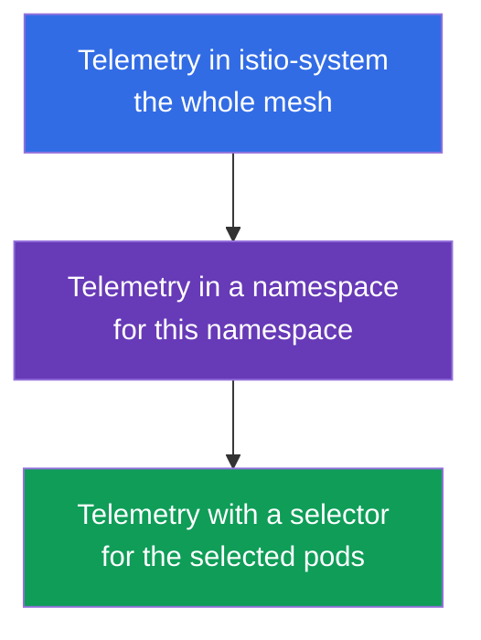
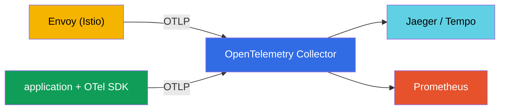
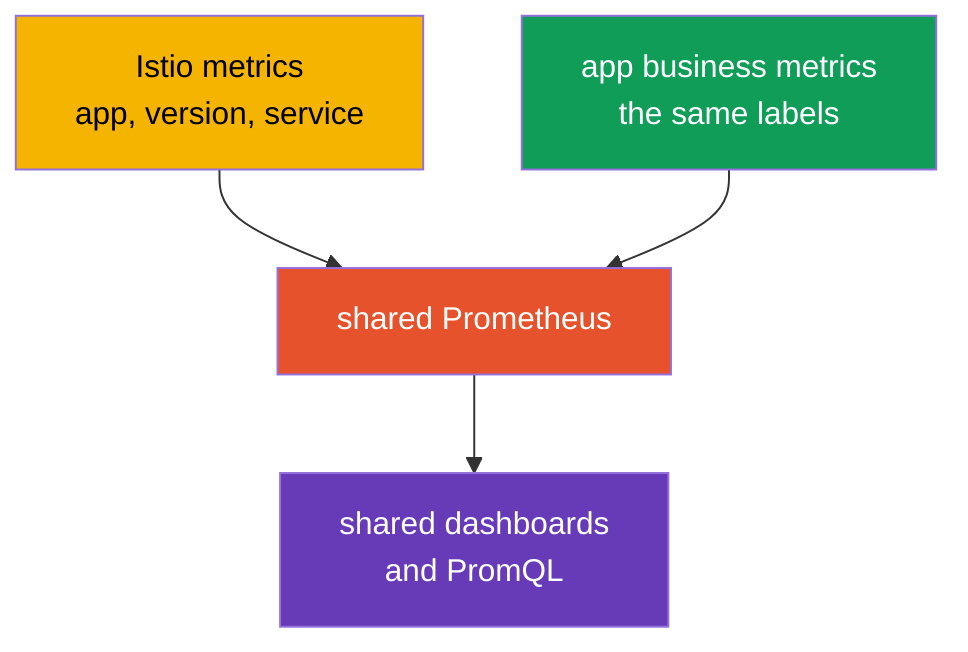

[RU version](ru.md) · [Versión en español](es.md) · [Version française](fr.md) · [Deutsche Version](de.md)

# Chapter 18. The Telemetry API: access logs and distributed tracing

> **What's next.** In chapter 17 we deployed the observability stack and saw that Istio collects
> telemetry automatically. But it needs to be finely tuned: where to enable logs, what percentage
> of traces to sample, which metric labels to keep. This used to be done in various ways
> (meshConfig, EnvoyFilter), and now there is a single declarative tool - the **Telemetry API**.

## 18.1. Why the Telemetry API is needed

The Telemetry API (`telemetry.istio.io`) is the modern way to manage all the mesh telemetry from
a single resource type: access logs, metrics and traces. It replaced the scattered approaches
(settings in `meshConfig`, manual `EnvoyFilter`s) and gives two important things:

- **a single declarative format** for logs, metrics and traces;
- **a hierarchy of scopes** - you can set the behavior for the whole mesh and then override it for
  a separate namespace or even specific pods.

## 18.2. The hierarchy of scopes

**Why this is needed at all.** Different services need different telemetry. Logs and traces cost
resources and money, so it is silly to collect everything from everyone to the maximum. But
configuring each service separately is inconvenient too. The ideal model: set **reasonable
defaults for the whole mesh**, and then **make exceptions** where things need to be different. The
scope hierarchy of the Telemetry API is exactly what allows this.

Typical situations where it helps:

- **Cost.** For the whole mesh we keep trace sampling at 1% (cheap), but for the payment service,
  where auditing matters, we raise it to 100%.
- **Noise.** A chatty service (for example, a health check) floods the logs - we disable logs for
  it specifically, without touching the rest.
- **Debugging.** A service is being fixed right now - we temporarily enable detailed logs and full
  tracing only for it, and remove them after debugging.
- **Uniformity.** The defaults are set in one place (`istio-system`), not copied into every
  namespace - less duplication and inconsistency.

Now how it is arranged technically. The `Telemetry` resource acts at a different level depending on
where it is created and whether it has a `selector`:



- **The whole mesh** - a `Telemetry` in the root namespace (`istio-system`) without a selector.
- **A namespace** - a `Telemetry` in the needed namespace without a selector.
- **Specific pods** - a `Telemetry` with `selector.matchLabels`.

A narrower policy overrides a broader one. For example: enable basic logs for the whole mesh, and
for one "noisy" service disable them, or the other way around, raise trace sampling to 100% for one
critical service.

## 18.3. Access logs

Access logs are Envoy's records about each request (who, where, the response code, the latency).
Enable them for the whole mesh:

```yaml
apiVersion: telemetry.istio.io/v1
kind: Telemetry
metadata:
  name: mesh-default
  namespace: istio-system    # the root namespace = the whole mesh
spec:
  accessLogging:
  - providers:
    - name: envoy             # write to Envoy's stdout
```

And now an example of the hierarchy: for a "noisy" service the logs can be turned off without
touching the rest of the mesh:

```yaml
apiVersion: telemetry.istio.io/v1
kind: Telemetry
metadata:
  name: disable-noisy
  namespace: app
spec:
  selector:
    matchLabels:
      app: noisy-service
  accessLogging:
  - providers:
    - name: envoy
    disabled: true            # override: there will be no logs here
```

Often a middle option is needed: not "everything" and not "nothing", but **only the interesting**
- for example, only errors. For this `accessLogging` has `filter.expression` - a condition in the
**CEL** language that decides whether to write a record or not. To log only `5xx` responses:

```yaml
apiVersion: telemetry.istio.io/v1
kind: Telemetry
metadata:
  name: log-errors-only
  namespace: app
spec:
  accessLogging:
  - providers:
    - name: envoy
    filter:
      expression: "response.code >= 400"   # write only errors (4xx/5xx)
```

Request attributes are available in the expression (`response.code`, `request.method`,
`request.path`, `connection.mtls` and others). This way the log volume drops by an order of
magnitude, while the most important thing - the errors - is still visible. This is the typical
production technique instead of "enable everything" or "disable everything".

As we discussed in chapter 17, access logs are voluminous, so in production they are enabled
selectively - and the Telemetry API is exactly the tool this is done with.

## 18.4. Tracing

The Telemetry API also manages distributed tracing: which provider to send spans to and what
percentage of requests to sample. The provider (for example, `zipkin`, `opentelemetry`) is
**declared once at Istio install time** in MeshConfig (`extensionProviders`), and the `Telemetry`
resource references it by name.

First we declare the provider in the IstioOperator (this is done at install/upgrade):

```yaml
apiVersion: install.istio.io/v1alpha1
kind: IstioOperator
spec:
  meshConfig:
    extensionProviders:
    - name: otel-tracing                 # the name that Telemetry will reference
      opentelemetry:
        service: otel-collector.observability.svc.cluster.local
        port: 4317                       # OTLP gRPC
```

Then we reference it from `Telemetry` and set the sampling:

```yaml
apiVersion: telemetry.istio.io/v1
kind: Telemetry
metadata:
  name: mesh-tracing
  namespace: istio-system
spec:
  tracing:
  - providers:
    - name: otel-tracing                 # the provider name from extensionProviders
    randomSamplingPercentage: 10.0       # 10% of requests into traces
```

- **`providers.name`** - which tracing backend to send spans to.
- **`randomSamplingPercentage`** - the fraction of requests that end up in traces.

For demo you set `100.0` (every request is visible), for production - `1.0`-`5.0`. And again the
hierarchy works: for the whole mesh you can leave 1%, and for one service that is being debugged
right now raise it to 100% with a separate `Telemetry` with a selector.

On EKS the provider usually points to the **ADOT Collector** (AWS's build of the OpenTelemetry
Collector, chapter 17): the same `opentelemetry` provider, only `service` points at ADOT, and it
then sends the traces to **AWS X-Ray** (or Tempo). The sampling is set here, in the Telemetry API,
not in X-Ray.

## 18.5. Metrics: customization and reducing cardinality

The Telemetry API can also tune metrics: add or remove labels (tags), disable unneeded metrics.
This is a direct tool against the cardinality problem we talked about in chapter 17.

Example: remove a "heavy" label from the request metric to reduce the load on Prometheus:

```yaml
apiVersion: telemetry.istio.io/v1
kind: Telemetry
metadata:
  name: metrics-tuning
  namespace: istio-system
spec:
  metrics:
  - providers:
    - name: prometheus
    overrides:
    - match:
        metric: REQUEST_COUNT
      tagOverrides:
        request_host:
          operation: REMOVE       # remove the request_host label
```

- **`match.metric`** - which metric we are tuning (for example, `REQUEST_COUNT` is
  `istio_requests_total`).
- **`tagOverrides`** - what to do with the labels: `REMOVE` (drop) or set your own value.

You can likewise add your own label (for example, from a request header) or fully disable a metric
you do not need. The point in production is usually one: keep only the labels that are actually
used in dashboards and alerts, and remove the high-cardinality ones (hosts, paths with IDs, etc.)
that bloat Prometheus.

## 18.6. The Telemetry API and OpenTelemetry

Confusion often arises here: "Telemetry API" and "OpenTelemetry" sound similar, but these are
**different things at different levels**, and they are not competitors but complement each other.

- **The Istio Telemetry API** is a Kubernetes resource with which you **configure** what telemetry
  Istio produces and where to send it (enable logs, set sampling, choose a provider, adjust
  labels). This is about mesh configuration.
- **OpenTelemetry (OTel)** is an open standard (a CNCF project): a single data format (OTLP), an
  API and SDKs for applications, as well as the **OTel Collector** - a service for collecting,
  processing and sending telemetry to any backends. This is about the collection and the data
  pipeline itself, vendor-neutral.

Put simply: the Telemetry API answers "what and how to collect in Istio", OpenTelemetry - "in which
standard format to transmit it and where to deliver it".

**How they work together.** Istio can send telemetry to an **OpenTelemetry Collector** over the
OTLP protocol. You declare OTel as a provider at Istio install time, and then via the Telemetry API
you tell it to use this provider for logs or traces. Envoy sends the data to the Collector, and it
then distributes it to the backends (Jaeger, Tempo, Prometheus, etc.).



| | Istio Telemetry API | OpenTelemetry |
|---|---------------------|---------------|
| What it is | an Istio Kubernetes CRD | an open standard + Collector + SDK |
| The task | configure the mesh telemetry | collect, process, deliver telemetry |
| The level | infrastructure (Envoy) | application + infrastructure |
| The format | Istio config | OTLP (vendor-neutral) |
| The role | "what and how to collect" | "in which format and where to deliver" |

**Best practice.** In a mature observability system the center of the pipeline is often the OTel
Collector: applications are instrumented with the OTel SDK (spans, business-level metrics), Istio
via the Telemetry API sends the mesh telemetry to the same Collector over OTLP, and the Collector
uniformly delivers everything to the backends. What links the mesh spans and the application spans
is the common tracing context (the `traceparent` header from the W3C standard) - that is why it is
so important for the application to propagate the headers (chapter 17).

## 18.7. Business metrics together with Istio metrics

Istio provides **infrastructure** metrics: RPS, latencies, response codes. But it knows nothing
about the business: how many orders were placed, what the revenue is, the cart size. These
**business metrics** are provided by the application itself. A common task is to analyze them
together: for example, to see that a rise in latency from Istio coincided with a drop in the number
of orders from the application. For this to be convenient, everything needs to be joined up
correctly in advance.

**1. A common metrics backend.** Export the application's business metrics into the same Prometheus
the Istio metrics go to - via a `/metrics` endpoint (ServiceMonitor/PodMonitor) or via the OTel SDK
and Collector (section 18.6). When everything is in one store, you can build shared dashboards and
make joint PromQL queries.

**2. Common labels for correlation - this is the main thing.** For metrics to be comparable, they
must have **common dimensions**: `app`, `version`, `namespace`, `service`, `env`. Istio uses
standard labels (`destination_workload`, `destination_version`, etc.). If you label the business
metrics with the same service and version names, you will be able to correlate, for example, the
latency from Istio and `orders_total` from the application by the same service and version.



**3. Add a business dimension to the Istio metrics.** Via the Telemetry API (`tagOverrides`) you
can add to the network metrics a label from a header or a JWT claim - for example, `tenant` or
`plan`. Then even the infrastructure Istio metrics can be sliced by a business dimension. Be
careful with cardinality: only low-cardinality values are suitable (plan, region), not `user_id`.

**4. Linking through traces.** The business context is convenient to attach to the trace. The
application via the OTel SDK adds its own spans and attributes (`order_id`, `user_id`) into the
same trace, and Istio adds the network spans - and everything is linked by the common
`traceparent`. In a single trace you see both the network path and the business meaning. And
**exemplars** in Prometheus let you jump from a point on a latency graph straight into a specific
trace.

**The practical conclusion.** Agree on a **single labeling convention** (the same `service`,
`version`, `namespace`, `env` for the application and for Istio) from the very start. Then the
metrics join up by themselves. And do not duplicate: take the network metrics (RPS, codes, latency)
from Istio, the business metrics - from the application. Keep high-cardinality business data
(`user_id`, `order_id`) in traces and logs, not in metrics.

## 18.8. Best practices for production

- **One mesh-default, then exceptions.** Set a base `Telemetry` in `istio-system` (a reasonable
  minimum of logs and low sampling), and make specific settings surgically at the namespace or
  workload level. Do not copy identical policies across all namespaces.
- **Keep the policies in Git (GitOps).** Telemetry is configuration - it should be versioned and go
  through review, not be created by hand.
- **Low sampling by default.** For the whole mesh 1-5%, and enable 100% surgically and temporarily
  to debug a specific service. 100% for the whole of production is extra load and volume.
- **Access logs selectively and structured.** Do not enable full logs for the whole mesh. Where you
  do enable them, use a structured format (JSON) so they can be parsed and indexed.
- **Control the metric cardinality.** Via `tagOverrides` remove high-cardinality labels (paths with
  IDs, hosts) and disable unused metrics. This directly saves Prometheus memory and money.
- **Send to an OTel Collector, not directly to the backends.** A centralized pipeline (section
  18.6) lets you change and add backends without touching the mesh configuration.
- **Separate responsibilities.** The platform team owns the mesh-default in `istio-system`, product
  teams own the policies in their namespaces.
- **Prefer the Telemetry API over EnvoyFilter.** If the Telemetry API solves the task, do not use
  manual `EnvoyFilter`s - they are fragile and break on Istio upgrades.
- **Be careful with sensitive data.** Do not log headers and bodies with PII; check that a custom
  log format does not drag along anything extra.
- **Test telemetry changes in staging.** An error in `tagOverrides` or the log format can silently
  break the dashboards and alerts you rely on.

## 18.9. Chapter summary

- **The Telemetry API** (`telemetry.istio.io`) is a single declarative way to manage logs, metrics
  and traces; it replaced settings via meshConfig and EnvoyFilter.
- It works by a **hierarchy of scopes**: the whole mesh (istio-system), a namespace, specific pods
  (selector); a narrower policy overrides a broader one.
- **Access logs**: enabled by the `envoy` provider; can be selectively disabled for noisy services
  or, via `filter.expression` (CEL), write only what is needed (for example, only errors).
- **Tracing**: the provider is declared in MeshConfig (`extensionProviders`), and `Telemetry`
  references it by name + sets `randomSamplingPercentage`; in production 1-5%, for debugging a
  service it can be raised surgically. On EKS the `opentelemetry` provider points to ADOT → X-Ray.
- **Metrics**: `overrides` with `tagOverrides` allow removing/adding labels and disabling metrics -
  the main tool against cardinality.
- **The Telemetry API and OpenTelemetry** are different levels: the Telemetry API configures the
  mesh telemetry, OpenTelemetry is the standard and the pipeline (Collector, OTLP). Istio can send
  telemetry to an OTel Collector; in production it is often made the collection center.
- Production practices: one mesh-default + surgical exceptions, GitOps, low sampling, selective
  structured logs, cardinality control, sending to an OTel Collector, the Telemetry API instead of
  EnvoyFilter, caution with PII.
- Business metrics and Istio metrics are analyzed together if you put them into one Prometheus and
  label them with common labels (service, version, namespace, env); high-cardinality business data
  is kept in traces/logs, and everything is linked by the common tracing context.

## 18.10. Self-check questions

1. What problem does the Telemetry API solve compared with the old approaches (meshConfig,
   EnvoyFilter)?
2. How does the scope hierarchy work and which policy wins on an overlap?
3. How do you enable access logs for the whole mesh and disable them for one service?
4. How do you set the trace sampling percentage and why keep it low in production?
5. How do you fight high metric cardinality with the Telemetry API?
6. How does the Istio Telemetry API differ from OpenTelemetry and how do they work together?
7. Name the key production practices of the Telemetry API: sampling, cardinality, logs, policy
   structure, where to send the telemetry.
8. How do you make the application's business metrics conveniently analyzable together with the
   Istio metrics? Why are common labels important?
9. How do you log only errors rather than all the traffic? Where is the tracing provider that
   `Telemetry` references declared?

## Practice

Configure access logs and tracing via the Telemetry API, try the scope hierarchy (mesh, namespace,
workload):

🧪 Lab 18: [tasks/ica/labs/18](../../labs/18/README.MD)

---
[Contents](../README.md) · [Chapter 17](../17/en.md) · [Chapter 19](../19/en.md)
