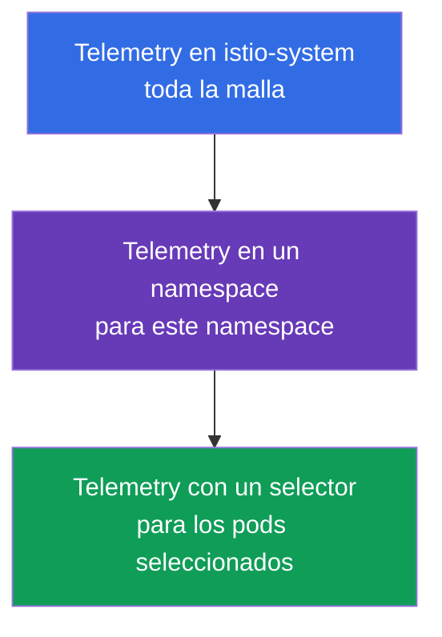
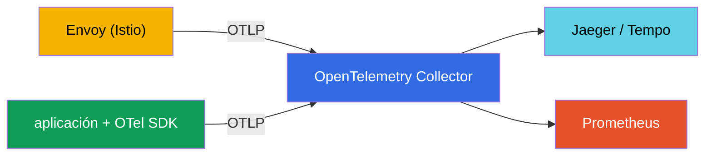
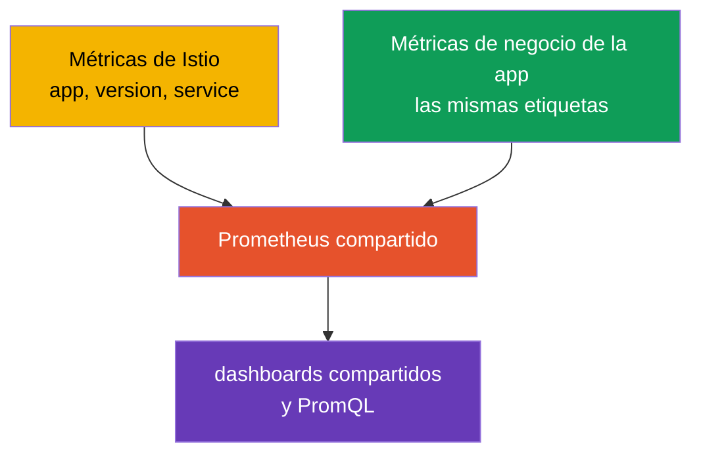

[RU version](ru.md) · [Eng version](en.md) · [Version française](fr.md) · [Deutsche Version](de.md)

# Capítulo 18. La Telemetry API: logs de acceso y trazado distribuido

> **Qué sigue.** En el capítulo 17 desplegamos el stack de observabilidad y vimos que Istio recopila
> telemetría automáticamente. Pero hay que ajustarla con precisión: dónde habilitar logs, qué
> porcentaje de trazas muestrear, qué etiquetas de métricas conservar. Antes esto se hacía de varias
> maneras (meshConfig, EnvoyFilter), y ahora hay una única herramienta declarativa: la **Telemetry API**.

## 18.1. Por qué se necesita la Telemetry API

La Telemetry API (`telemetry.istio.io`) es la forma moderna de gestionar toda la telemetría de la
malla desde un único tipo de recurso: logs de acceso, métricas y trazas. Reemplazó los enfoques
dispersos (ajustes en `meshConfig`, `EnvoyFilter`s manuales) y aporta dos cosas importantes:

- **un único formato declarativo** para logs, métricas y trazas;
- **una jerarquía de ámbitos**: puedes definir el comportamiento para toda la malla y luego
  sobrescribirlo para un namespace concreto o incluso para pods específicos.

## 18.2. La jerarquía de ámbitos

**Por qué se necesita esto en absoluto.** Distintos servicios necesitan distinta telemetría. Los logs
y las trazas cuestan recursos y dinero, así que es absurdo recopilarlo todo de todos al máximo. Pero
configurar cada servicio por separado también es incómodo. El modelo ideal: definir **valores por
defecto razonables para toda la malla**, y luego **hacer excepciones** donde las cosas tengan que ser
distintas. La jerarquía de ámbitos de la Telemetry API es exactamente lo que lo permite.

Situaciones típicas donde ayuda:

- **Coste.** Para toda la malla mantenemos el muestreo de trazas al 1% (barato), pero para el servicio
  de pagos, donde importa la auditoría, lo subimos al 100%.
- **Ruido.** Un servicio charlatán (por ejemplo, un health check) inunda los logs: le desactivamos los
  logs solo a él, sin tocar el resto.
- **Depuración.** Un servicio se está arreglando ahora mismo: habilitamos temporalmente logs
  detallados y trazado completo solo para él, y los quitamos después de depurar.
- **Uniformidad.** Los valores por defecto se definen en un solo lugar (`istio-system`), no se copian
  en cada namespace: menos duplicación e inconsistencia.

Ahora cómo se organiza técnicamente. El recurso `Telemetry` actúa a un nivel distinto según dónde se
cree y si tiene un `selector`:



- **Toda la malla**: un `Telemetry` en el namespace raíz (`istio-system`) sin selector.
- **Un namespace**: un `Telemetry` en el namespace necesario sin selector.
- **Pods específicos**: un `Telemetry` con `selector.matchLabels`.

Una política más estrecha sobrescribe a una más amplia. Por ejemplo: habilitar logs básicos para toda
la malla, y para un servicio "ruidoso" desactivarlos, o al revés, subir el muestreo de trazas al 100%
para un servicio crítico.

## 18.3. Logs de acceso

Los logs de acceso son los registros de Envoy sobre cada petición (quién, adónde, el código de
respuesta, la latencia). Habilítalos para toda la malla:

```yaml
apiVersion: telemetry.istio.io/v1
kind: Telemetry
metadata:
  name: mesh-default
  namespace: istio-system    # el namespace raíz = toda la malla
spec:
  accessLogging:
  - providers:
    - name: envoy             # escribir en el stdout de Envoy
```

Y ahora un ejemplo de la jerarquía: para un servicio "ruidoso" los logs se pueden apagar sin tocar el
resto de la malla:

```yaml
apiVersion: telemetry.istio.io/v1
kind: Telemetry
metadata:
  name: disable-noisy
  namespace: app
spec:
  selector:
    matchLabels:
      app: noisy-service
  accessLogging:
  - providers:
    - name: envoy
    disabled: true            # sobrescritura: aquí no habrá logs
```

A menudo se necesita una opción intermedia: no "todo" y no "nada", sino **solo lo interesante**, por
ejemplo, solo los errores. Para esto `accessLogging` tiene `filter.expression`: una condición en el
lenguaje **CEL** que decide si escribir un registro o no. Para registrar solo las respuestas `5xx`:

```yaml
apiVersion: telemetry.istio.io/v1
kind: Telemetry
metadata:
  name: log-errors-only
  namespace: app
spec:
  accessLogging:
  - providers:
    - name: envoy
    filter:
      expression: "response.code >= 400"   # escribir solo errores (4xx/5xx)
```

En la expresión están disponibles los atributos de la petición (`response.code`, `request.method`,
`request.path`, `connection.mtls` y otros). De este modo el volumen de logs cae un orden de magnitud,
mientras que lo más importante -los errores- sigue siendo visible. Esta es la técnica típica de
producción en lugar de "habilitar todo" o "desactivar todo".

Como comentamos en el capítulo 17, los logs de acceso son voluminosos, así que en producción se
habilitan de forma selectiva, y la Telemetry API es exactamente la herramienta con la que se hace.

## 18.4. Trazado

La Telemetry API también gestiona el trazado distribuido: a qué proveedor enviar los spans y qué
porcentaje de peticiones muestrear. El proveedor (por ejemplo, `zipkin`, `opentelemetry`) se
**declara una sola vez al instalar Istio** en MeshConfig (`extensionProviders`), y el recurso
`Telemetry` lo referencia por su nombre.

Primero declaramos el proveedor en el IstioOperator (esto se hace al instalar/actualizar):

```yaml
apiVersion: install.istio.io/v1alpha1
kind: IstioOperator
spec:
  meshConfig:
    extensionProviders:
    - name: otel-tracing                 # el nombre que Telemetry referenciará
      opentelemetry:
        service: otel-collector.observability.svc.cluster.local
        port: 4317                       # OTLP gRPC
```

Luego lo referenciamos desde `Telemetry` y fijamos el muestreo:

```yaml
apiVersion: telemetry.istio.io/v1
kind: Telemetry
metadata:
  name: mesh-tracing
  namespace: istio-system
spec:
  tracing:
  - providers:
    - name: otel-tracing                 # el nombre del proveedor de extensionProviders
    randomSamplingPercentage: 10.0       # 10% de las peticiones a trazas
```

- **`providers.name`**: a qué backend de trazado enviar los spans.
- **`randomSamplingPercentage`**: la fracción de peticiones que acaban en trazas.

Para demo pones `100.0` (cada petición es visible), para producción `1.0`-`5.0`. Y de nuevo funciona
la jerarquía: para toda la malla puedes dejar el 1%, y para un servicio que se está depurando ahora
mismo subirlo al 100% con un `Telemetry` aparte con un selector.

En EKS el proveedor normalmente apunta al **ADOT Collector** (la build de AWS del OpenTelemetry
Collector, capítulo 17): el mismo proveedor `opentelemetry`, solo que `service` apunta a ADOT, y este
luego envía las trazas a **AWS X-Ray** (o Tempo). El muestreo se define aquí, en la Telemetry API, no
en X-Ray.

## 18.5. Métricas: personalización y reducción de cardinalidad

La Telemetry API también puede ajustar las métricas: añadir o quitar etiquetas (tags), desactivar
métricas innecesarias. Esta es una herramienta directa contra el problema de cardinalidad del que
hablamos en el capítulo 17.

Ejemplo: quitar una etiqueta "pesada" de la métrica de peticiones para reducir la carga sobre
Prometheus:

```yaml
apiVersion: telemetry.istio.io/v1
kind: Telemetry
metadata:
  name: metrics-tuning
  namespace: istio-system
spec:
  metrics:
  - providers:
    - name: prometheus
    overrides:
    - match:
        metric: REQUEST_COUNT
      tagOverrides:
        request_host:
          operation: REMOVE       # quitar la etiqueta request_host
```

- **`match.metric`**: qué métrica estamos ajustando (por ejemplo, `REQUEST_COUNT` es
  `istio_requests_total`).
- **`tagOverrides`**: qué hacer con las etiquetas: `REMOVE` (eliminar) o fijar tu propio valor.

De igual modo puedes añadir tu propia etiqueta (por ejemplo, de una cabecera de la petición) o
desactivar por completo una métrica que no necesitas. El objetivo en producción suele ser uno:
conservar solo las etiquetas que realmente se usan en dashboards y alertas, y quitar las de alta
cardinalidad (hosts, rutas con IDs, etc.) que hinchan Prometheus.

## 18.6. La Telemetry API y OpenTelemetry

Aquí surge a menudo confusión: "Telemetry API" y "OpenTelemetry" suenan parecidos, pero son **cosas
distintas a niveles distintos**, y no son competidores sino que se complementan.

- **La Istio Telemetry API** es un recurso de Kubernetes con el que **configuras** qué telemetría
  produce Istio y adónde enviarla (habilitar logs, fijar el muestreo, elegir un proveedor, ajustar
  etiquetas). Esto trata sobre la configuración de la malla.
- **OpenTelemetry (OTel)** es un estándar abierto (un proyecto de la CNCF): un único formato de datos
  (OTLP), una API y SDKs para las aplicaciones, así como el **OTel Collector**, un servicio para
  recopilar, procesar y enviar telemetría a cualquier backend. Esto trata sobre la recopilación y el
  pipeline de datos en sí, agnóstico al proveedor.

En pocas palabras: la Telemetry API responde a "qué y cómo recopilar en Istio", OpenTelemetry a "en
qué formato estándar transmitirla y adónde entregarla".

**Cómo trabajan juntos.** Istio puede enviar telemetría a un **OpenTelemetry Collector** por el
protocolo OTLP. Declaras OTel como proveedor al instalar Istio, y luego, vía la Telemetry API, le
indicas usar este proveedor para logs o trazas. Envoy envía los datos al Collector, y este los
distribuye a los backends (Jaeger, Tempo, Prometheus, etc.).



| | Istio Telemetry API | OpenTelemetry |
|---|---------------------|---------------|
| Qué es | un CRD de Kubernetes de Istio | un estándar abierto + Collector + SDK |
| La tarea | configurar la telemetría de la malla | recopilar, procesar, entregar telemetría |
| El nivel | infraestructura (Envoy) | aplicación + infraestructura |
| El formato | config de Istio | OTLP (agnóstico al proveedor) |
| El rol | "qué y cómo recopilar" | "en qué formato y adónde entregar" |

**Buena práctica.** En un sistema de observabilidad maduro el centro del pipeline suele ser el OTel
Collector: las aplicaciones se instrumentan con el OTel SDK (spans, métricas de negocio), Istio vía la
Telemetry API envía la telemetría de la malla al mismo Collector por OTLP, y el Collector entrega todo
de forma uniforme a los backends. Lo que enlaza los spans de la malla y los spans de la aplicación es
el contexto de trazado común (la cabecera `traceparent` del estándar W3C); por eso es tan importante
que la aplicación propague las cabeceras (capítulo 17).

## 18.7. Métricas de negocio junto con las métricas de Istio

Istio proporciona métricas de **infraestructura**: RPS, latencias, códigos de respuesta. Pero no sabe
nada del negocio: cuántos pedidos se hicieron, cuáles son los ingresos, el tamaño del carrito. Estas
**métricas de negocio** las proporciona la propia aplicación. Una tarea común es analizarlas juntas:
por ejemplo, ver que una subida de latencia en Istio coincidió con una caída del número de pedidos en
la aplicación. Para que esto sea cómodo, hay que unirlo todo correctamente de antemano.

**1. Un backend de métricas común.** Exporta las métricas de negocio de la aplicación al mismo
Prometheus al que van las métricas de Istio: vía un endpoint `/metrics` (ServiceMonitor/PodMonitor) o
vía el OTel SDK y el Collector (sección 18.6). Cuando todo está en un único almacén, puedes construir
dashboards compartidos y hacer consultas PromQL conjuntas.

**2. Etiquetas comunes para la correlación: esto es lo principal.** Para que las métricas sean
comparables, deben tener **dimensiones comunes**: `app`, `version`, `namespace`, `service`, `env`.
Istio usa etiquetas estándar (`destination_workload`, `destination_version`, etc.). Si etiquetas las
métricas de negocio con los mismos nombres de servicio y versión, podrás correlacionar, por ejemplo,
la latencia de Istio y `orders_total` de la aplicación por el mismo servicio y versión.



**3. Añade una dimensión de negocio a las métricas de Istio.** Vía la Telemetry API (`tagOverrides`)
puedes añadir a las métricas de red una etiqueta de una cabecera o un claim de JWT, por ejemplo,
`tenant` o `plan`. Entonces incluso las métricas de infraestructura de Istio se pueden segmentar por
una dimensión de negocio. Ten cuidado con la cardinalidad: solo valen los valores de baja cardinalidad
(plan, región), no `user_id`.

**4. Enlazar a través de trazas.** El contexto de negocio es cómodo adjuntarlo a la traza. La
aplicación, vía el OTel SDK, añade sus propios spans y atributos (`order_id`, `user_id`) en la misma
traza, e Istio añade los spans de red, y todo queda enlazado por el `traceparent` común. En una única
traza ves tanto el camino de red como el significado de negocio. Y los **exemplars** en Prometheus
permiten saltar de un punto en un gráfico de latencia directamente a una traza concreta.

**La conclusión práctica.** Acuerda una **única convención de etiquetado** (el mismo `service`,
`version`, `namespace`, `env` para la aplicación y para Istio) desde el principio. Entonces las
métricas se unen solas. Y no dupliques: toma las métricas de red (RPS, códigos, latencia) de Istio,
las métricas de negocio de la aplicación. Mantén los datos de negocio de alta cardinalidad
(`user_id`, `order_id`) en trazas y logs, no en métricas.

## 18.8. Buenas prácticas para producción

- **Un mesh-default, luego excepciones.** Define un `Telemetry` base en `istio-system` (un mínimo
  razonable de logs y muestreo bajo), y haz los ajustes específicos de forma quirúrgica a nivel de
  namespace o carga de trabajo. No copies políticas idénticas por todos los namespaces.
- **Mantén las políticas en Git (GitOps).** La telemetría es configuración: debe versionarse y pasar
  por revisión, no crearse a mano.
- **Muestreo bajo por defecto.** Para toda la malla 1-5%, y habilita el 100% de forma quirúrgica y
  temporal para depurar un servicio concreto. El 100% para toda la producción es carga y volumen
  extra.
- **Logs de acceso selectivos y estructurados.** No habilites logs completos para toda la malla. Donde
  sí los habilites, usa un formato estructurado (JSON) para poder parsearlos e indexarlos.
- **Controla la cardinalidad de las métricas.** Vía `tagOverrides` quita las etiquetas de alta
  cardinalidad (rutas con IDs, hosts) y desactiva las métricas no usadas. Esto ahorra directamente
  memoria y dinero de Prometheus.
- **Envía a un OTel Collector, no directamente a los backends.** Un pipeline centralizado (sección
  18.6) te permite cambiar y añadir backends sin tocar la configuración de la malla.
- **Separa responsabilidades.** El equipo de plataforma posee el mesh-default en `istio-system`, los
  equipos de producto poseen las políticas en sus namespaces.
- **Prefiere la Telemetry API antes que EnvoyFilter.** Si la Telemetry API resuelve la tarea, no uses
  `EnvoyFilter`s manuales: son frágiles y se rompen en las actualizaciones de Istio.
- **Ten cuidado con los datos sensibles.** No registres cabeceras ni cuerpos con PII; verifica que un
  formato de log personalizado no arrastre nada de más.
- **Prueba los cambios de telemetría en staging.** Un error en `tagOverrides` o en el formato de log
  puede romper silenciosamente los dashboards y las alertas de las que dependes.

## 18.9. Resumen del capítulo

- **La Telemetry API** (`telemetry.istio.io`) es una única forma declarativa de gestionar logs,
  métricas y trazas; reemplazó los ajustes vía meshConfig y EnvoyFilter.
- Funciona por una **jerarquía de ámbitos**: toda la malla (istio-system), un namespace, pods
  específicos (selector); una política más estrecha sobrescribe a una más amplia.
- **Logs de acceso**: se habilitan con el proveedor `envoy`; se pueden desactivar selectivamente para
  servicios ruidosos o, vía `filter.expression` (CEL), escribir solo lo necesario (por ejemplo, solo
  errores).
- **Trazado**: el proveedor se declara en MeshConfig (`extensionProviders`), y `Telemetry` lo
  referencia por su nombre + fija `randomSamplingPercentage`; en producción 1-5%, para depurar un
  servicio se puede subir de forma quirúrgica. En EKS el proveedor `opentelemetry` apunta a ADOT →
  X-Ray.
- **Métricas**: `overrides` con `tagOverrides` permiten quitar/añadir etiquetas y desactivar métricas:
  la principal herramienta contra la cardinalidad.
- **La Telemetry API y OpenTelemetry** son niveles distintos: la Telemetry API configura la telemetría
  de la malla, OpenTelemetry es el estándar y el pipeline (Collector, OTLP). Istio puede enviar
  telemetría a un OTel Collector; en producción a menudo se hace el centro de recopilación.
- Prácticas de producción: un mesh-default + excepciones quirúrgicas, GitOps, muestreo bajo, logs
  estructurados selectivos, control de cardinalidad, envío a un OTel Collector, la Telemetry API en
  lugar de EnvoyFilter, cautela con la PII.
- Las métricas de negocio y las de Istio se analizan juntas si las pones en un mismo Prometheus y las
  etiquetas con etiquetas comunes (service, version, namespace, env); los datos de negocio de alta
  cardinalidad se guardan en trazas/logs, y todo queda enlazado por el contexto de trazado común.

## 18.10. Preguntas de autoevaluación

1. ¿Qué problema resuelve la Telemetry API frente a los enfoques antiguos (meshConfig, EnvoyFilter)?
2. ¿Cómo funciona la jerarquía de ámbitos y qué política gana en un solapamiento?
3. ¿Cómo habilitas logs de acceso para toda la malla y los desactivas para un servicio?
4. ¿Cómo fijas el porcentaje de muestreo de trazas y por qué mantenerlo bajo en producción?
5. ¿Cómo combates la alta cardinalidad de métricas con la Telemetry API?
6. ¿En qué se diferencia la Istio Telemetry API de OpenTelemetry y cómo trabajan juntos?
7. Nombra las prácticas clave de producción de la Telemetry API: muestreo, cardinalidad, logs,
   estructura de políticas, adónde enviar la telemetría.
8. ¿Cómo haces que las métricas de negocio de la aplicación se puedan analizar cómodamente junto con
   las métricas de Istio? ¿Por qué son importantes las etiquetas comunes?
9. ¿Cómo registras solo los errores en lugar de todo el tráfico? ¿Dónde se declara el proveedor de
   trazado que referencia `Telemetry`?

## Práctica

Configura logs de acceso y trazado vía la Telemetry API, prueba la jerarquía de ámbitos (malla,
namespace, carga de trabajo):

🧪 Laboratorio 18: [tasks/ica/labs/18](../../labs/18/README_ES.MD)

---
[Índice](../README_ES.md) · [Capítulo 17](../17/es.md) · [Capítulo 19](../19/es.md)
