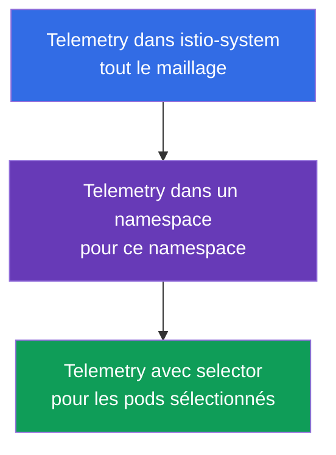
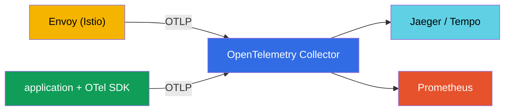
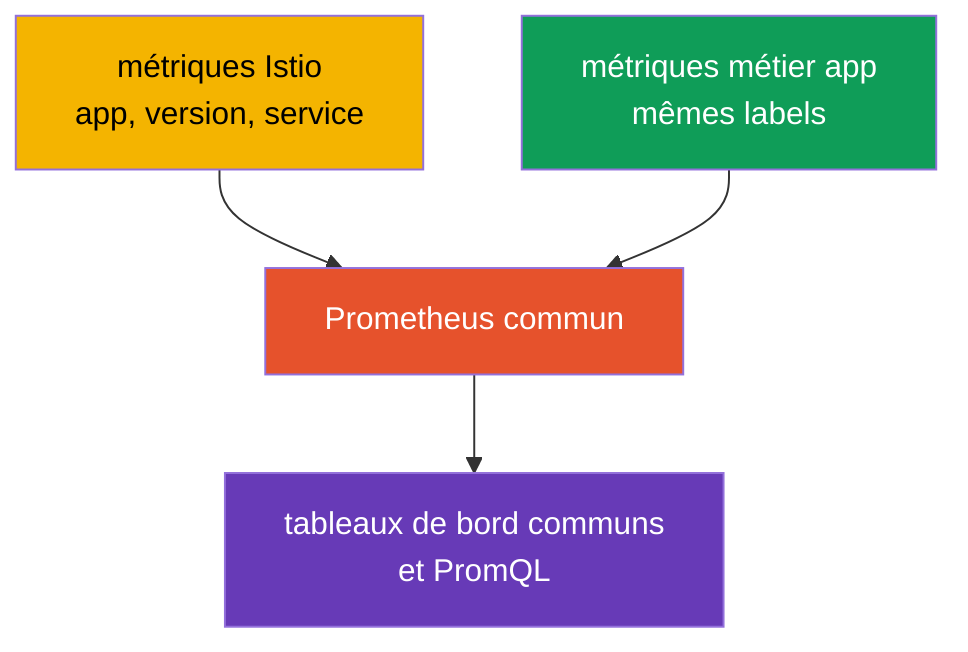

[RU version](ru.md) · [Eng version](en.md) · [Versión en español](es.md) · [Deutsche Version](de.md)

# Chapitre 18. Telemetry API : access logs et traçage distribué

> **La suite.** Au chapitre 17, nous avons déployé la stack d'observabilité et vu qu'Istio collecte
> la télémétrie automatiquement. Mais il faut savoir la configurer finement : où activer les logs,
> quel pourcentage de traces échantillonner, quels labels de métriques conserver. Auparavant, cela
> se faisait de différentes manières (meshConfig, EnvoyFilter), et il existe désormais un outil
> déclaratif unique - la **Telemetry API**.

## 18.1. À quoi sert la Telemetry API

La Telemetry API (`telemetry.istio.io`) est la manière moderne de gérer toute la télémétrie du
maillage à partir d'un seul type de ressource : access logs, métriques et traces. Elle a remplacé
les approches dispersées (réglages dans `meshConfig`, `EnvoyFilter` manuels) et apporte deux choses
importantes :

- un **format déclaratif unique** pour les logs, les métriques et les traces ;
- une **hiérarchie de portées** - on peut définir un comportement pour tout le maillage, puis le
  redéfinir pour un namespace précis ou même des pods concrets.

## 18.2. Hiérarchie des portées

**Pourquoi c'est utile.** Des services différents ont besoin de télémétries différentes. Les logs
et les traces coûtent des ressources et de l'argent, il est donc absurde de tout collecter au
maximum partout. Mais configurer chaque service séparément est peu pratique. Le modèle idéal :
définir des **réglages par défaut raisonnables sur tout le maillage**, puis **faire des exceptions
ciblées** là où c'est nécessaire. La hiérarchie des portées de la Telemetry API permet exactement
cela.

Situations typiques où cela sauve la mise :

- **Coût.** Sur tout le maillage, on garde un échantillonnage des traces à 1 % (bon marché), mais
  pour le service de paiement, où l'audit compte, on le monte à 100 %.
- **Bruit.** Un service bavard (par exemple un health-check) sature les logs - on désactive les
  logs uniquement pour lui, sans toucher aux autres.
- **Débogage.** Un service est en cours de réparation - on active temporairement des logs détaillés
  et le traçage complet uniquement pour lui, puis on les retire après le débogage.
- **Uniformité.** Les réglages par défaut sont définis à un seul endroit (`istio-system`), et non
  copiés dans chaque namespace - moins de duplication et de disparité.

Voyons maintenant comment cela fonctionne techniquement. La ressource `Telemetry` agit à différents
niveaux selon l'endroit où elle est créée et selon qu'elle possède ou non un `selector` :



- **Tout le maillage** - `Telemetry` dans le namespace racine (`istio-system`) sans selector.
- **Namespace** - `Telemetry` dans le namespace voulu sans selector.
- **Pods concrets** - `Telemetry` avec `selector.matchLabels`.

Une politique plus étroite redéfinit une politique plus large. Par exemple : activer les logs de
base sur tout le maillage, mais les désactiver pour un seul service « bruyant », ou à l'inverse,
monter l'échantillonnage des traces à 100 % pour un seul service critique.

## 18.3. Access logs

Les access logs sont les enregistrements d'Envoy sur chaque requête (qui, vers où, code de réponse,
latence). Les activer sur tout le maillage :

```yaml
apiVersion: telemetry.istio.io/v1
kind: Telemetry
metadata:
  name: mesh-default
  namespace: istio-system    # namespace racine = tout le maillage
spec:
  accessLogging:
  - providers:
    - name: envoy             # écrire dans le stdout d'Envoy
```

Et maintenant un exemple de hiérarchie : pour un service « bruyant », on peut couper les logs sans
toucher au reste du maillage :

```yaml
apiVersion: telemetry.istio.io/v1
kind: Telemetry
metadata:
  name: disable-noisy
  namespace: app
spec:
  selector:
    matchLabels:
      app: noisy-service
  accessLogging:
  - providers:
    - name: envoy
    disabled: true            # on redéfinit : ici il n'y aura pas de logs
```

Souvent, il faut une option intermédiaire : ni « tout » ni « rien », mais **seulement l'important** -
par exemple, uniquement les erreurs. Pour cela, `accessLogging` dispose de `filter.expression` - une
condition en langage **CEL** qui décide d'écrire l'enregistrement ou non. Ne journaliser que les
réponses `5xx` :

```yaml
apiVersion: telemetry.istio.io/v1
kind: Telemetry
metadata:
  name: log-errors-only
  namespace: app
spec:
  accessLogging:
  - providers:
    - name: envoy
    filter:
      expression: "response.code >= 400"   # n'écrire que les erreurs (4xx/5xx)
```

Dans l'expression, les attributs de la requête sont accessibles (`response.code`, `request.method`,
`request.path`, `connection.mtls`, etc.). Ainsi, le volume des logs chute d'un ordre de grandeur,
tandis que le plus important - les erreurs - reste visible. C'est là le procédé de production
typique, à la place d'« activer tout » ou « désactiver tout ».

Comme nous en avons discuté au chapitre 17, les access logs sont volumineux, c'est pourquoi en
production on les active de façon sélective - et la Telemetry API est exactement l'outil qui sert à
cela.

## 18.4. Traçage

La Telemetry API gère aussi le traçage distribué : quel provider utiliser pour envoyer les spans et
quel pourcentage de requêtes échantillonner. Le provider (par exemple `zipkin`, `opentelemetry`) est
**déclaré une seule fois lors de l'installation d'Istio** dans MeshConfig (`extensionProviders`), et
la ressource `Telemetry` y fait référence par son nom.

D'abord, on déclare le provider dans IstioOperator (cela se fait à l'installation/mise à niveau) :

```yaml
apiVersion: install.istio.io/v1alpha1
kind: IstioOperator
spec:
  meshConfig:
    extensionProviders:
    - name: otel-tracing                 # nom auquel Telemetry fera référence
      opentelemetry:
        service: otel-collector.observability.svc.cluster.local
        port: 4317                       # OTLP gRPC
```

Ensuite, on y fait référence depuis `Telemetry` et on définit l'échantillonnage :

```yaml
apiVersion: telemetry.istio.io/v1
kind: Telemetry
metadata:
  name: mesh-tracing
  namespace: istio-system
spec:
  tracing:
  - providers:
    - name: otel-tracing                 # nom du provider depuis extensionProviders
    randomSamplingPercentage: 10.0       # 10 % des requêtes dans les traces
```

- **`providers.name`** - vers quel backend de traçage envoyer les spans.
- **`randomSamplingPercentage`** - la part des requêtes qui entrent dans les traces.

Pour la démo, on met `100.0` (chaque requête est visible), pour la production - `1.0`-`5.0`. Et là
encore la hiérarchie fonctionne : sur tout le maillage on peut rester à 1 %, mais pour un seul
service en cours de débogage, le monter à 100 % avec une `Telemetry` distincte munie d'un selector.

Sur EKS, on indique généralement comme provider l'**ADOT Collector** (la version AWS
d'OpenTelemetry Collector, chapitre 17) : le même provider `opentelemetry`, sauf que `service`
pointe vers ADOT, qui envoie ensuite les traces vers **AWS X-Ray** (ou Tempo). L'échantillonnage se
définit ici même, dans la Telemetry API, et non dans X-Ray.

## 18.5. Métriques : personnalisation et réduction de la cardinalité

La Telemetry API sait aussi configurer les métriques : ajouter ou retirer des labels (tags),
désactiver des métriques inutiles. C'est un outil direct contre le problème de cardinalité dont nous
avons parlé au chapitre 17.

Exemple : retirer un label « lourd » de la métrique de requêtes, pour réduire la charge sur
Prometheus :

```yaml
apiVersion: telemetry.istio.io/v1
kind: Telemetry
metadata:
  name: metrics-tuning
  namespace: istio-system
spec:
  metrics:
  - providers:
    - name: prometheus
    overrides:
    - match:
        metric: REQUEST_COUNT
      tagOverrides:
        request_host:
          operation: REMOVE       # retirer le label request_host
```

- **`match.metric`** - quelle métrique on configure (par exemple, `REQUEST_COUNT` correspond à
  `istio_requests_total`).
- **`tagOverrides`** - que faire des labels : `REMOVE` (retirer) ou définir sa propre valeur.

On peut de la même manière ajouter son propre label (par exemple, issu d'un en-tête de requête) ou
désactiver complètement une métrique dont vous n'avez pas besoin. En production, le sens est
généralement unique : ne garder que les labels réellement utilisés dans les tableaux de bord et les
alertes, et retirer ceux à forte cardinalité (hôtes, chemins avec ID, etc.) qui gonflent Prometheus.

## 18.6. Telemetry API et OpenTelemetry

Ici, une confusion apparaît souvent : « Telemetry API » et « OpenTelemetry » se ressemblent, mais ce
sont **des choses différentes à des niveaux différents**, et elles ne sont pas concurrentes mais
complémentaires.

- **La Telemetry API d'Istio** est une ressource Kubernetes avec laquelle vous **configurez** quelle
  télémétrie Istio produit et où l'envoyer (activer les logs, définir l'échantillonnage, choisir un
  provider, ajuster les labels). Cela concerne la configuration du maillage.
- **OpenTelemetry (OTel)** est un standard ouvert (un projet de la CNCF) : un format de données
  unique (OTLP), une API et des SDK pour les applications, ainsi que l'**OTel Collector** - un
  service pour collecter, traiter et envoyer la télémétrie vers n'importe quels backends. Cela
  concerne la collecte elle-même et le pipeline de données, de façon neutre vis-à-vis des
  fournisseurs.

Plus simplement : la Telemetry API répond à la question « quoi et comment collecter dans Istio »,
OpenTelemetry - « dans quel format standard le transmettre et où le livrer ».

**Comment ils fonctionnent ensemble.** Istio sait envoyer la télémétrie vers un **OpenTelemetry
Collector** via le protocole OTLP. Vous déclarez OTel comme provider lors de l'installation d'Istio,
puis, via la Telemetry API, vous indiquez d'utiliser ce provider pour les logs ou les traces. Envoy
envoie les données au Collector, qui les répartit ensuite entre les backends (Jaeger, Tempo,
Prometheus, etc.).



| | Istio Telemetry API | OpenTelemetry |
|---|---------------------|---------------|
| Ce que c'est | CRD Kubernetes d'Istio | standard ouvert + Collector + SDK |
| Rôle | configurer la télémétrie du maillage | collecter, traiter, livrer la télémétrie |
| Niveau | infrastructure (Envoy) | application + infrastructure |
| Format | config Istio | OTLP (neutre vis-à-vis des fournisseurs) |
| Fonction | « quoi et comment collecter » | « dans quel format et où livrer » |

**Best practice.** Dans un système d'observabilité mature, on fait souvent de l'OTel Collector le
centre du pipeline : les applications sont instrumentées avec l'OTel SDK (spans, métriques
métier), Istio envoie via la Telemetry API la télémétrie du maillage vers le même Collector en OTLP,
et le Collector livre le tout uniformément aux backends. Ce qui relie les spans du maillage et les
spans de l'application, c'est le contexte de traçage commun (l'en-tête `traceparent` du standard
W3C) - c'est pourquoi il est si important que l'application propage les en-têtes (chapitre 17).

## 18.7. Métriques métier avec les métriques d'Istio

Istio fournit des métriques **d'infrastructure** : RPS, latences, codes de réponse. Mais il ne sait
rien du métier : combien de commandes ont été passées, quel est le chiffre d'affaires, la taille du
panier. Ces **métriques métier**, c'est l'application elle-même qui les fournit. Une tâche fréquente
consiste à les analyser ensemble : par exemple, voir qu'une hausse de latence issue d'Istio a
coïncidé avec une baisse du nombre de commandes issue de l'application. Pour que ce soit pratique,
il faut tout bien articuler à l'avance.

**1. Backend de métriques commun.** Exportez les métriques métier de l'application vers le même
Prometheus où vont les métriques d'Istio - via un endpoint `/metrics` (ServiceMonitor/PodMonitor) ou
via l'OTel SDK et le Collector (section 18.6). Quand tout est dans un seul stockage, on peut
construire des tableaux de bord communs et faire des requêtes PromQL conjointes.

**2. Des labels unifiés pour la corrélation - c'est l'essentiel.** Pour que les métriques puissent
être comparées, elles doivent avoir des **dimensions communes** : `app`, `version`, `namespace`,
`service`, `env`. Istio utilise des labels standard (`destination_workload`, `destination_version`,
etc.). Si vous étiquetez les métriques métier avec les mêmes noms de service et de version, vous
pourrez corréler, par exemple, la latency d'Istio et `orders_total` de l'application pour un même
service et une même version.



**3. Ajouter une dimension métier dans les métriques d'Istio.** Via la Telemetry API
(`tagOverrides`), on peut ajouter aux métriques réseau un label issu d'un en-tête ou d'un JWT-claim -
par exemple, `tenant` ou `plan`. Ainsi, même les métriques d'infrastructure d'Istio peuvent être
découpées par dimension métier. Attention à la cardinalité : seules conviennent les valeurs à faible
cardinalité (plan, région), pas `user_id`.

**4. Liaison via les traces.** Le contexte métier se rattache commodément au traçage. L'application,
via l'OTel SDK, ajoute à la même trace ses propres spans et attributs (`order_id`, `user_id`), tandis
qu'Istio ajoute les spans réseau - et tout est relié par le `traceparent` commun. Dans une seule
trace, on voit à la fois le chemin réseau et le sens métier. Et les **exemplars** dans Prometheus
permettent, depuis un point sur le graphique de latency, de sauter directement dans une trace
concrète.

**Conclusion pratique.** Convenez d'une **convention de labels unifiée** (mêmes `service`,
`version`, `namespace`, `env` pour l'application et pour Istio) dès le départ. Alors les métriques
s'articulent d'elles-mêmes. Et ne dupliquez pas : les métriques réseau (RPS, codes, latency)
prenez-les dans Istio, les métriques métier - dans l'application. Gardez les données métier à forte
cardinalité (`user_id`, `order_id`) dans les traces et les logs, pas dans les métriques.

## 18.8. Best practices pour la production

- **Un seul mesh-default, ensuite des exceptions.** Définissez une `Telemetry` de base dans
  `istio-system` (un minimum raisonnable de logs et un faible échantillonnage), et faites les
  réglages particuliers de façon ciblée au niveau namespace ou workload. Ne copiez pas des politiques
  identiques dans tous les namespaces.
- **Stockez les politiques dans Git (GitOps).** La télémétrie est une configuration - elle doit être
  versionnable et passer en revue, et non créée à la main.
- **Faible échantillonnage par défaut.** Sur tout le maillage 1-5 %, et activez 100 % de façon
  ciblée et temporaire pour déboguer un service précis. 100 % sur toute la production, c'est une
  charge et un volume inutiles.
- **Access logs de façon sélective et structurée.** N'activez pas les full-logs sur tout le
  maillage. Là où vous les activez, utilisez un format structuré (JSON) pour pouvoir les parser et
  les indexer.
- **Contrôlez la cardinalité des métriques.** Via `tagOverrides`, retirez les labels à forte
  cardinalité (chemins avec ID, hôtes) et désactivez les métriques inutilisées. Cela économise
  directement la mémoire de Prometheus et de l'argent.
- **Envoyez vers l'OTel Collector, pas directement vers les backends.** Un pipeline centralisé
  (section 18.6) permet de changer et d'ajouter des backends sans toucher à la configuration du
  maillage.
- **Répartissez les responsabilités.** L'équipe plateforme possède le mesh-default dans
  `istio-system`, les équipes produit - les politiques dans leurs namespaces.
- **Préférez la Telemetry API à EnvoyFilter.** Si la Telemetry API résout le problème, n'utilisez
  pas d'`EnvoyFilter` manuels - ils sont fragiles et cassent lors des mises à niveau d'Istio.
- **Attention aux données sensibles.** Ne journalisez pas les en-têtes et corps contenant des PII ;
  vérifiez qu'un format de logs personnalisé n'emporte pas d'informations superflues.
- **Testez les changements de télémétrie en staging.** Une erreur dans `tagOverrides` ou dans le
  format des logs peut discrètement casser les tableaux de bord et les alertes sur lesquels vous vous
  appuyez.

## 18.9. Résumé du chapitre

- La **Telemetry API** (`telemetry.istio.io`) est le moyen déclaratif unique de gérer les logs, les
  métriques et les traces ; elle a remplacé les réglages via meshConfig et EnvoyFilter.
- Elle fonctionne par **hiérarchie de portées** : tout le maillage (istio-system), namespace, pods
  concrets (selector) ; une politique étroite redéfinit une politique large.
- **Access logs** : activés par le provider `envoy` ; on peut les désactiver de façon sélective pour
  les services bruyants ou, via `filter.expression` (CEL), n'écrire que le nécessaire (par exemple,
  uniquement les erreurs).
- **Traçage** : le provider se déclare dans MeshConfig (`extensionProviders`), et `Telemetry` y fait
  référence par son nom + définit `randomSamplingPercentage` ; en production 1-5 %, pour déboguer un
  service on peut le monter de façon ciblée. Sur EKS, le provider `opentelemetry` pointe vers ADOT →
  X-Ray.
- **Métriques** : les `overrides` avec `tagOverrides` permettent de retirer/ajouter des labels et de
  désactiver des métriques - l'outil principal contre la cardinalité.
- **Telemetry API et OpenTelemetry** sont à des niveaux différents : la Telemetry API configure la
  télémétrie du maillage, OpenTelemetry est un standard et un pipeline (Collector, OTLP). Istio peut
  envoyer la télémétrie vers l'OTel Collector ; en production, on en fait souvent le centre de
  collecte.
- Pratiques de production : un seul mesh-default + des exceptions ciblées, GitOps, faible
  échantillonnage, logs structurés et sélectifs, contrôle de la cardinalité, envoi vers l'OTel
  Collector, Telemetry API à la place d'EnvoyFilter, prudence avec les PII.
- Les métriques métier et les métriques d'Istio s'analysent ensemble si on les place dans un même
  Prometheus et qu'on les étiquette avec des labels unifiés (service, version, namespace, env) ; les
  données métier à forte cardinalité se gardent dans les traces/logs, et un contexte de traçage
  commun relie le tout.

## 18.10. Questions d'auto-évaluation

1. Quel problème la Telemetry API résout-elle par rapport aux anciennes approches (meshConfig,
   EnvoyFilter) ?
2. Comment fonctionne la hiérarchie des portées et quelle politique l'emporte en cas de
   recoupement ?
3. Comment activer les access logs sur tout le maillage et les désactiver pour un seul service ?
4. Comment définir le pourcentage d'échantillonnage des traces et pourquoi le garder bas en
   production ?
5. Comment lutter contre la forte cardinalité des métriques à l'aide de la Telemetry API ?
6. En quoi la Telemetry API d'Istio diffère-t-elle d'OpenTelemetry et comment fonctionnent-elles
   ensemble ?
7. Nommez les pratiques de production clés de la Telemetry API : échantillonnage, cardinalité, logs,
   structure des politiques, où envoyer la télémétrie.
8. Comment faire pour que les métriques métier de l'application s'analysent commodément avec les
   métriques d'Istio ? Pourquoi les labels unifiés sont-ils importants ?
9. Comment journaliser uniquement les erreurs, et non tout le trafic ? Où est déclaré le provider de
   traçage auquel `Telemetry` fait référence ?

## Pratique

Configurez les access logs et le traçage via la Telemetry API, expérimentez la hiérarchie des
portées (mesh, namespace, workload) :

🧪 Lab 18 : [tasks/ica/labs/18](../../labs/18/README_FR.MD)

---
[Table des matières](../README_FR.md) · [Chapitre 17](../17/fr.md) · [Chapitre 19](../19/fr.md)
