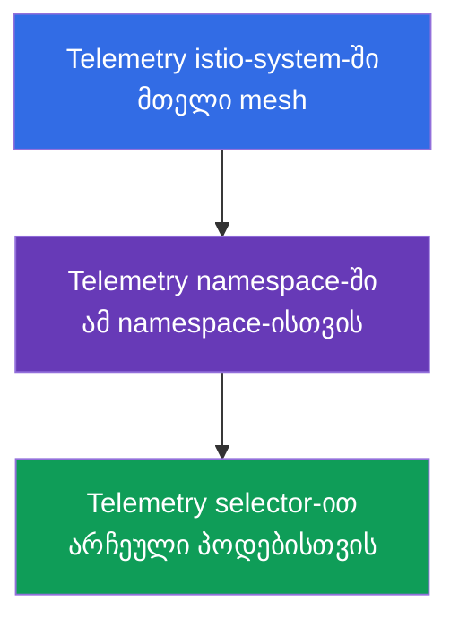
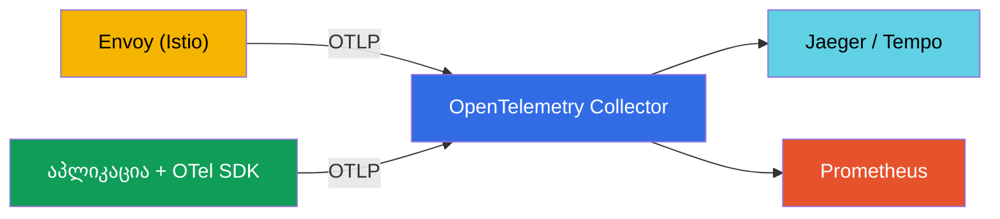
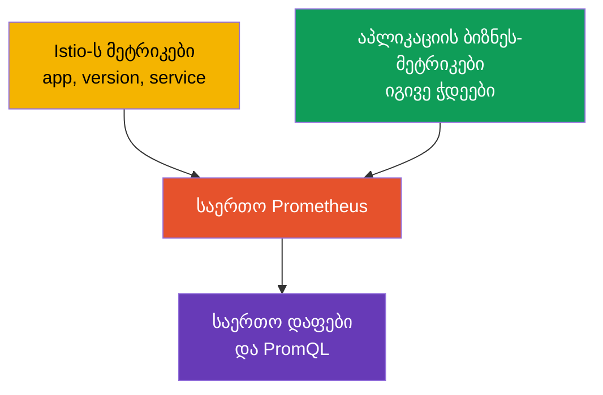

[Русская версия](ru.md) · [Eng version](en.md) · [Versión en español](es.md) · [Version française](fr.md) · [Deutsche Version](de.md) · [繁體中文版](tw.md) · [日本語版](jp.md)

# თავი 18. Telemetry API: წვდომის ჟურნალები და განაწილებული ტრეისინგი

> **რა იქნება შემდეგ.** მე-17 თავში observability-სტეკი გავშალეთ და ვნახეთ, რომ Istio
> ტელემეტრიას ავტომატურად აგროვებს. თუმცა საჭიროა მისი მოქნილად კონფიგურირების ცოდნა:
> სად ჩავრთოთ ჟურნალები, ტრეისების რამდენი პროცენტი ავიღოთ სემპლად, მეტრიკების რომელი
> ჭდეები დავტოვოთ. ადრე ამას სხვადასხვა გზით აკეთებდნენ (meshConfig, EnvoyFilter),
> ახლა კი არსებობს ერთიანი დეკლარაციული ინსტრუმენტი - **Telemetry API**.

## 18.1. რისთვის არის საჭირო Telemetry API

Telemetry API (`telemetry.istio.io`) - mesh-ის მთელი ტელემეტრიის ერთი ტიპის რესურსიდან
მართვის თანამედროვე საშუალებაა: წვდომის ჟურნალების, მეტრიკებისა და ტრეისების. მან
ჩაანაცვლა დაქსაქსული მიდგომები (`meshConfig`-ის პარამეტრები, ხელით შექმნილი
`EnvoyFilter`) და ორი მნიშვნელოვანი შესაძლებლობა მოიტანა:

- **ერთიანი დეკლარაციული ფორმატი** ჟურნალებისთვის, მეტრიკებისა და ტრეისებისთვის;
- **მოქმედების არეების იერარქია** - შეიძლება ქცევა მთელი mesh-ისთვის განისაზღვროს,
  შემდეგ კი ცალკეული namespace-ისთვის ან კონკრეტული პოდებისთვისაც გადაიფაროს.

## 18.2. მოქმედების არეების იერარქია

**საერთოდ რატომ არის ეს საჭირო.** სხვადასხვა სერვისს განსხვავებული ტელემეტრია
სჭირდება. ჟურნალები და ტრეისები რესურსებსა და ფულს მოითხოვს, ამიტომ ყველაფრის ყველა
სერვისიდან მაქსიმალური მოცულობით შეგროვება უაზრობაა. თუმცა თითოეული სერვისის ცალ-ცალკე
კონფიგურირებაც მოუხერხებელია. იდეალური მოდელია: მთელი mesh-ისთვის განვსაზღვროთ
**გონივრული ნაგულისხმევი პარამეტრები**, შემდეგ კი იქ, სადაც სხვა ქცევაა საჭირო,
წერტილოვნად **დავუშვათ გამონაკლისები**. Telemetry API-ის მოქმედების არეების იერარქია
სწორედ ამის საშუალებას იძლევა.

ტიპური შემთხვევები, რომლებშიც ეს მიდგომა გვეხმარება:

- **ღირებულება.** მთელი mesh-ისთვის ტრეისების სემპლირებას 1%-ზე ვტოვებთ (იაფია),
  ხოლო გადახდის სერვისისთვის, სადაც აუდიტი მნიშვნელოვანია, 100%-მდე ვზრდით.
- **ხმაური.** ზედმეტად აქტიური სერვისი (მაგალითად, health-check) ჟურნალებს ავსებს -
  ჟურნალებს მხოლოდ მისთვის ვთიშავთ ისე, რომ დანარჩენებს არ ვეხებით.
- **გამართვა.** სერვისს ამჟამად ასწორებენ - დეტალურ ჟურნალებსა და სრულ ტრეისინგს
  დროებით მხოლოდ მისთვის ვრთავთ, გამართვის შემდეგ კი ვაუქმებთ.
- **ერთგვაროვნება.** ნაგულისხმევი პარამეტრები ერთ ადგილას (`istio-system`) განისაზღვრება
  და ყოველ namespace-ში არ კოპირდება - ნაკლები დუბლირება და შეუსაბამობაა.

ახლა ვნახოთ, როგორაა ეს ტექნიკურად მოწყობილი. `Telemetry` რესურსი სხვადასხვა დონეზე
მოქმედებს იმის მიხედვით, სად შეიქმნა და აქვს თუ არა `selector`:



- **მთელი mesh** - `Telemetry` ძირეულ namespace-ში (`istio-system`) selector-ის გარეშე.
- **Namespace** - `Telemetry` საჭირო namespace-ში selector-ის გარეშე.
- **კონკრეტული პოდები** - `Telemetry` `selector.matchLabels`-ით.

უფრო ვიწრო პოლიტიკა უფრო ფართოს გადაფარავს. მაგალითად: მთელ mesh-ში საბაზისო
ჟურნალები ჩავრთოთ, ხოლო ერთი „ხმაურიანი“ სერვისისთვის გამოვრთოთ; ან, პირიქით, ერთი
კრიტიკული სერვისისთვის ტრეისების სემპლირება 100%-მდე გავზარდოთ.

## 18.3. წვდომის ჟურნალები

წვდომის ჟურნალები Envoy-ის ჩანაწერებია თითოეული მოთხოვნის შესახებ (ვინ, სად,
პასუხის კოდი, დაყოვნება). მათი მთელ mesh-ში ჩასართავად:

```yaml
apiVersion: telemetry.istio.io/v1
kind: Telemetry
metadata:
  name: mesh-default
  namespace: istio-system    # ძირეული namespace = მთელი mesh
spec:
  accessLogging:
  - providers:
    - name: envoy             # ჩაწერა Envoy-ს stdout-ში
```

ახლა კი იერარქიის მაგალითი: „ხმაურიანი“ სერვისისთვის ჟურნალები შეიძლება გამოვრთოთ
ისე, რომ დანარჩენ mesh-ს არ შევეხოთ:

```yaml
apiVersion: telemetry.istio.io/v1
kind: Telemetry
metadata:
  name: disable-noisy
  namespace: app
spec:
  selector:
    matchLabels:
      app: noisy-service
  accessLogging:
  - providers:
    - name: envoy
    disabled: true            # გადავფარავთ: აქ ლოგები არ იქნება
```

ხშირად შუალედური ვარიანტია საჭირო: არც „ყველაფერი“ და არც „არაფერი“, არამედ
**მხოლოდ საინტერესო** - მაგალითად, მხოლოდ შეცდომები. ამისთვის `accessLogging`-ს აქვს
`filter.expression` - **CEL** ენაზე დაწერილი პირობა, რომელიც განსაზღვრავს, ჩაიწეროს
თუ არა ჩანაწერი. მხოლოდ `5xx` პასუხების დასაჟურნალებლად:

```yaml
apiVersion: telemetry.istio.io/v1
kind: Telemetry
metadata:
  name: log-errors-only
  namespace: app
spec:
  accessLogging:
  - providers:
    - name: envoy
    filter:
      expression: "response.code >= 400"   # მხოლოდ შეცდომების ჩაწერა (4xx/5xx)
```

გამოსახულებაში ხელმისაწვდომია მოთხოვნის ატრიბუტები (`response.code`, `request.method`,
`request.path`, `connection.mtls` და სხვ.). ამგვარად ჟურნალების მოცულობა რამდენჯერმე
მცირდება, ყველაზე მნიშვნელოვანი - შეცდომები - კი კვლავ ჩანს. ეს არის ტიპური
prod-მიდგომა „ყველაფრის ჩართვისა“ და „ყველაფრის გამორთვის“ ნაცვლად.

როგორც მე-17 თავში განვიხილეთ, წვდომის ჟურნალები მოცულობითია, ამიტომ prod-ში მათ
შერჩევითად რთავენ - Telemetry API სწორედ ის ინსტრუმენტია, რომლითაც ამას აკეთებენ.

## 18.4. ტრეისინგი

Telemetry API განაწილებულ ტრეისინგსაც მართავს: რომელი პროვაიდერის საშუალებით გაიგზავნოს
სპანები და მოთხოვნების რამდენი პროცენტი მოხვდეს სემპლში. პროვაიდერი (მაგალითად,
`zipkin`, `opentelemetry`) Istio-ს დაყენებისას MeshConfig-ში (`extensionProviders`)
**ერთხელ ცხადდება**, `Telemetry` რესურსი კი მას სახელით მიმართავს.

ჯერ პროვაიდერს IstioOperator-ში ვაცხადებთ (ამას დაყენების/განახლებისას აკეთებენ):

```yaml
apiVersion: install.istio.io/v1alpha1
kind: IstioOperator
spec:
  meshConfig:
    extensionProviders:
    - name: otel-tracing                 # სახელი, რომელზეც Telemetry მიუთითებს
      opentelemetry:
        service: otel-collector.observability.svc.cluster.local
        port: 4317                       # OTLP gRPC
```

შემდეგ მას `Telemetry`-დან მივმართავთ და სემპლირებას განვსაზღვრავთ:

```yaml
apiVersion: telemetry.istio.io/v1
kind: Telemetry
metadata:
  name: mesh-tracing
  namespace: istio-system
spec:
  tracing:
  - providers:
    - name: otel-tracing                 # პროვაიდერის სახელი extensionProviders-იდან
    randomSamplingPercentage: 10.0       # მოთხოვნების 10% ტრეისებში
```

- **`providers.name`** - ტრეისინგის რომელ backend-ში გაიგზავნოს სპანები.
- **`randomSamplingPercentage`** - მოთხოვნების წილი, რომელიც ტრეისებში მოხვდება.

დემოსთვის `100.0`-ს აყენებენ (ყველა მოთხოვნა ჩანს), prod-ისთვის კი - `1.0`-`5.0`-ს.
აქაც იერარქია მოქმედებს: მთელი mesh-ისთვის შეიძლება 1% დავტოვოთ, ხოლო იმ ერთი
სერვისისთვის, რომელსაც ამჟამად ვმართავთ, selector-ის მქონე ცალკე `Telemetry`-ით
100%-მდე გავზარდოთ.

EKS-ზე პროვაიდერად ჩვეულებრივ **ADOT Collector**-ს (OpenTelemetry Collector-ის AWS-ის
ვერსია, თავი 17) უთითებენ: იგივე `opentelemetry`-პროვაიდერია, უბრალოდ `service` ADOT-ზე
მიუთითებს, ის კი ტრეისებს უკვე **AWS X-Ray**-ში (ან Tempo-ში) აგზავნის. სემპლირება
აქვე, Telemetry API-ში განისაზღვრება და არა X-Ray-ში.

## 18.5. მეტრიკები: მორგება და კარდინალურობის შემცირება

Telemetry API-ს მეტრიკების კონფიგურირებაც შეუძლია: ჭდეების (tags) დამატება ან ამოღება,
არასაჭირო მეტრიკების გამორთვა. ეს პირდაპირი ინსტრუმენტია კარდინალურობის პრობლემის
წინააღმდეგ, რომელიც მე-17 თავში განვიხილეთ.

მაგალითი: მოთხოვნების მეტრიკიდან „მძიმე“ ჭდე ამოვიღოთ, რათა Prometheus-ის დატვირთვა
შემცირდეს:

```yaml
apiVersion: telemetry.istio.io/v1
kind: Telemetry
metadata:
  name: metrics-tuning
  namespace: istio-system
spec:
  metrics:
  - providers:
    - name: prometheus
    overrides:
    - match:
        metric: REQUEST_COUNT
      tagOverrides:
        request_host:
          operation: REMOVE       # request_host ჭდის მოცილება
```

- **`match.metric`** - რომელ მეტრიკას ვაკონფიგურირებთ (მაგალითად, `REQUEST_COUNT` არის
  `istio_requests_total`).
- **`tagOverrides`** - რა ვუყოთ ჭდეებს: `REMOVE` (ამოღება) ან საკუთარი მნიშვნელობის
  განსაზღვრა.

ასევე შეიძლება საკუთარი ჭდის დამატება (მაგალითად, მოთხოვნის სათაურიდან) ან სრულიად
გამოვრთოთ მეტრიკა, რომელიც არ გვჭირდება. prod-ში აზრი, როგორც წესი, ერთია: დავტოვოთ
მხოლოდ ის ჭდეები, რომლებიც ნამდვილად გამოიყენება დაფებსა და შეტყობინებებში, და
ამოვიღოთ მაღალკარდინალური ჭდეები (ჰოსტები, ID-ის შემცველი გზები და ა.შ.), რომლებიც
Prometheus-ის მოცულობას ზრდის.

## 18.6. Telemetry API და OpenTelemetry

აქ ხშირად ჩნდება დაბნეულობა: „Telemetry API“ და „OpenTelemetry“ ერთმანეთს ჰგავს,
მაგრამ ეს **სხვადასხვა დონის სხვადასხვა ცნებებია**; ისინი კონკურენტები კი არა,
ერთმანეთის შემავსებლები არიან.

- **Istio Telemetry API** - Kubernetes-რესურსია, რომლითაც **აკონფიგურირებთ**, რა
  ტელემეტრია შექმნას Istio-მ და სად გააგზავნოს ის (ჟურნალების ჩართვა, სემპლირების
  განსაზღვრა, პროვაიდერის არჩევა, ჭდეების შესწორება). ეს mesh-ის კონფიგურაციას ეხება.
- **OpenTelemetry (OTel)** - ღია სტანდარტია (CNCF-ის პროექტი): მონაცემთა ერთიანი ფორმატი
  (OTLP), API და SDK აპლიკაციებისთვის, აგრეთვე **OTel Collector** - ტელემეტრიის ნებისმიერ
  backend-ში შეგროვების, დამუშავებისა და გაგზავნის სერვისი. ეს უშუალოდ შეგროვებასა და
  მონაცემთა კონვეიერს ეხება და მომწოდებლისგან დამოუკიდებელია.

უფრო მარტივად: Telemetry API პასუხობს კითხვას „რა და როგორ შევაგროვოთ Istio-ში“,
OpenTelemetry კი - „რა სტანდარტული ფორმატით გადავცეთ და სად მივიტანოთ“.

**როგორ მუშაობენ ისინი ერთად.** Istio-ს შეუძლია ტელემეტრია **OpenTelemetry
Collector**-ში OTLP პროტოკოლით გაგზავნოს. Istio-ს დაყენებისას OTel-ს პროვაიდერად
აცხადებთ, შემდეგ კი Telemetry API-ის საშუალებით მიუთითებთ, რომ ეს პროვაიდერი
ჟურნალებისთვის ან ტრეისებისთვის გამოიყენოს. Envoy მონაცემებს Collector-ში აგზავნის,
ის კი მათ backend-ებში (Jaeger, Tempo, Prometheus და სხვ.) ანაწილებს.



| | Istio Telemetry API | OpenTelemetry |
|---|---------------------|---------------|
| რა არის | Istio-ს Kubernetes CRD | ღია სტანდარტი + Collector + SDK |
| ამოცანა | mesh-ის ტელემეტრიის კონფიგურირება | ტელემეტრიის შეგროვება, დამუშავება, მიწოდება |
| დონე | ინფრასტრუქტურა (Envoy) | აპლიკაცია + ინფრასტრუქტურა |
| ფორმატი | Istio-ს კონფიგურაცია | OTLP (მომწოდებლისგან დამოუკიდებელი) |
| როლი | „რა და როგორ შევაგროვოთ“ | „რა ფორმატით და სად მივიტანოთ“ |

**საუკეთესო პრაქტიკა.** მომწიფებულ observability-სისტემაში კონვეიერის ცენტრად ხშირად
სწორედ OTel Collector-ს იყენებენ: აპლიკაციებს OTel SDK-ით აღჭურვავენ (სპანები,
ბიზნესდონის მეტრიკები), Istio Telemetry API-ის საშუალებით mesh-ის ტელემეტრიას იმავე
Collector-ში OTLP-ით აგზავნის, Collector კი ყველაფერს ერთგვაროვნად აწვდის backend-ებს.
mesh-ის სპანებსა და აპლიკაციის სპანებს ტრეისინგის საერთო კონტექსტი (`traceparent`
სათაური W3C სტანდარტიდან) აკავშირებს - ამიტომაა ასე მნიშვნელოვანი, რომ აპლიკაციამ
სათაურები გაატაროს (თავი 17).

## 18.7. ბიზნეს-მეტრიკები Istio-ს მეტრიკებთან ერთად

Istio **ინფრასტრუქტურულ** მეტრიკებს გვაძლევს: RPS, დაყოვნებები, პასუხის კოდები. მაგრამ
მან არაფერი იცის ბიზნესის შესახებ: რამდენი შეკვეთა გაფორმდა, რა იყო შემოსავალი,
რამდენია კალათის ზომა. ამ **ბიზნეს-მეტრიკებს** თავად აპლიკაცია გასცემს. ხშირი ამოცანაა
მათი ერთად გაანალიზება: მაგალითად, დავინახოთ, რომ Istio-ში დაყოვნების ზრდა აპლიკაციაში
შეკვეთების რაოდენობის ვარდნას დაემთხვა. ეს მოსახერხებელი რომ იყოს, ყველაფერი წინასწარ
სწორად უნდა დავაკავშიროთ.

**1. მეტრიკების საერთო backend.** აპლიკაციის ბიზნეს-მეტრიკები იმავე Prometheus-ში
გაიტანეთ, სადაც Istio-ს მეტრიკები მიდის - `/metrics` endpoint-ის (ServiceMonitor/
PodMonitor) ან OTel SDK-ისა და Collector-ის საშუალებით (განყოფილება 18.6). როდესაც
ყველაფერი ერთ საცავშია, შეიძლება საერთო დაფების აგება და ერთობლივი PromQL-მოთხოვნების
შესრულება.

**2. კორელაციის ერთიანი ჭდეები - ეს ყველაზე მნიშვნელოვანია.** მეტრიკების შესადარებლად
მათ **საერთო განზომილებები** უნდა ჰქონდეთ: `app`, `version`, `namespace`, `service`,
`env`. Istio სტანდარტულ ჭდეებს იყენებს (`destination_workload`, `destination_version`
და სხვ.). თუ ბიზნეს-მეტრიკებს სერვისისა და ვერსიის იმავე სახელებით მონიშნავთ,
შეძლებთ, მაგალითად, Istio-ს latency და აპლიკაციის `orders_total` ერთი და იმავე
სერვისისა და ვერსიის მიხედვით დააკავშიროთ.



**3. Istio-ს მეტრიკებში ბიზნეს-განზომილების დამატება.** Telemetry API-ის
(`tagOverrides`) საშუალებით ქსელურ მეტრიკებს შეიძლება სათაურიდან ან JWT claim-იდან
ჭდე დაემატოს - მაგალითად, `tenant` ან `plan`. ამ შემთხვევაში Istio-ს ინფრასტრუქტურული
მეტრიკებიც კი შეიძლება ბიზნეს-განზომილების მიხედვით დაიყოს. ფრთხილად იყავით
კარდინალურობასთან: გამოდგება მხოლოდ დაბალკარდინალური მნიშვნელობები (გეგმა, რეგიონი)
და არა `user_id`.

**4. ტრეისებით დაკავშირება.** ბიზნეს-კონტექსტის ტრეისინგთან მიბმა მოსახერხებელია.
აპლიკაცია OTel SDK-ის საშუალებით იმავე trace-ში საკუთარ სპანებსა და ატრიბუტებს
(`order_id`, `user_id`) ამატებს, Istio კი ქსელურ სპანებს ამატებს - ყველაფერს საერთო
`traceparent` აკავშირებს. ერთ ტრეისში ჩანს ქსელური გზაც და ბიზნეს-აზრიც. Prometheus-ში
არსებული **exemplars** კი latency-ს გრაფიკის წერტილიდან პირდაპირ კონკრეტულ ტრეისზე
გადასვლის საშუალებას იძლევა.

**პრაქტიკული დასკვნა.** თავიდანვე შეთანხმდით **ჭდეების ერთიან წესზე** (ერთნაირი
`service`, `version`, `namespace`, `env` აპლიკაციასა და Istio-ში). მაშინ მეტრიკები
ავტომატურად დაუკავშირდება ერთმანეთს. ნუ მოახდენთ დუბლირებასაც: ქსელური მეტრიკები
(RPS, კოდები, latency) Istio-დან აიღეთ, ბიზნეს-მეტრიკები კი - აპლიკაციიდან.
მაღალკარდინალური ბიზნეს-მონაცემები (`user_id`, `order_id`) ტრეისებსა და ჟურნალებში
შეინახეთ და არა მეტრიკებში.

## 18.8. საუკეთესო პრაქტიკები prod-ისთვის

- **ერთი mesh-default, შემდეგ - გამონაკლისები.** საბაზისო `Telemetry` `istio-system`-ში
  განსაზღვრეთ (ჟურნალების გონივრული მინიმუმი და დაბალი სემპლირება), კერძო პარამეტრები
  კი namespace-ის ან workload-ის დონეზე წერტილოვნად დააკონფიგურირეთ. ერთნაირი
  პოლიტიკები ყველა namespace-ში არ დააკოპიროთ.
- **პოლიტიკები Git-ში შეინახეთ (GitOps).** ტელემეტრია კონფიგურაციაა - ის უნდა
  ვერსიონირდებოდეს და რევიუს გადიოდეს, ნაცვლად ხელით შექმნისა.
- **დაბალი ნაგულისხმევი სემპლირება.** მთელი mesh-ისთვის 1-5%, 100% კი მხოლოდ
  წერტილოვნად და დროებით ჩართეთ კონკრეტული სერვისის გასამართად. მთელ prod-ში 100%
  ზედმეტი დატვირთვა და მოცულობაა.
- **წვდომის ჟურნალები - შერჩევითად და სტრუქტურირებულად.** full-ჟურნალები მთელ mesh-ში
  არ ჩართოთ. იქ, სადაც რთავთ, გამოიყენეთ სტრუქტურირებული ფორმატი (JSON), რათა მათი
  გარჩევა და ინდექსირება შესაძლებელი იყოს.
- **აკონტროლეთ მეტრიკების კარდინალურობა.** `tagOverrides`-ით ამოიღეთ მაღალკარდინალური
  ჭდეები (ID-ის შემცველი გზები, ჰოსტები) და გამორთეთ გამოუყენებელი მეტრიკები. ეს
  პირდაპირ ზოგავს Prometheus-ის მეხსიერებასა და ფულს.
- **გაგზავნეთ OTel Collector-ში და არა პირდაპირ backend-ებში.** ცენტრალიზებული
  კონვეიერი (თავი 18.6) backend-ების mesh-ის კონფიგურაციაზე შეხების გარეშე შეცვლისა
  და დამატების საშუალებას იძლევა.
- **გაანაწილეთ პასუხისმგებლობა.** პლატფორმის გუნდი ფლობს mesh-default-ს
  `istio-system`-ში, პროდუქტების გუნდები კი - პოლიტიკებს საკუთარ namespace-ებში.
- **უპირატესობა Telemetry API-ს მიანიჭეთ და არა EnvoyFilter-ს.** თუ ამოცანას Telemetry
  API წყვეტს, ხელით შექმნილი `EnvoyFilter` არ გამოიყენოთ - ისინი მყიფეა და Istio-ს
  განახლებისას ფუჭდება.
- **ფრთხილად იყავით მგრძნობიარე მონაცემებთან.** PII-ის შემცველი სათაურები და სხეულები
  არ დააჟურნალოთ; შეამოწმეთ, რომ ჟურნალის მორგებულ ფორმატს ზედმეტი მონაცემები არ მიაქვს.
- **ტელემეტრიის ცვლილებები staging-ში გამოცადეთ.** `tagOverrides`-ში ან ჟურნალების
  ფორმატში დაშვებულმა შეცდომამ შეიძლება შეუმჩნევლად გააფუჭოს დაფები და შეტყობინებები,
  რომლებსაც ეყრდნობით.

## 18.9. თავის შეჯამება

- **Telemetry API** (`telemetry.istio.io`) - ჟურნალების, მეტრიკებისა და ტრეისების
  მართვის ერთიანი დეკლარაციული საშუალებაა; მან meshConfig-ისა და EnvoyFilter-ის
  პარამეტრები ჩაანაცვლა.
- მუშაობს **არეების იერარქიით**: მთელი mesh (istio-system), namespace, კონკრეტული
  პოდები (selector); ვიწრო პოლიტიკა ფართოს გადაფარავს.
- **წვდომის ჟურნალები**: ირთვება `envoy` პროვაიდერით; შესაძლებელია მათი შერჩევითად
  გამორთვა ხმაურიანი სერვისებისთვის ან `filter.expression`-ით (CEL) მხოლოდ საჭირო
  ინფორმაციის (მაგალითად, მხოლოდ შეცდომების) ჩაწერა.
- **ტრეისინგი**: პროვაიდერი MeshConfig-ში (`extensionProviders`) ცხადდება, `Telemetry`
  კი მას სახელით მიმართავს და `randomSamplingPercentage`-ს განსაზღვრავს; prod-ში 1-5%,
  სერვისის გამართვისას კი შეიძლება წერტილოვნად გაიზარდოს. EKS-ზე `opentelemetry`
  პროვაიდერი ADOT → X-Ray-ზე მიუთითებს.
- **მეტრიკები**: `overrides` და `tagOverrides` ჭდეების ამოღების/დამატებისა და მეტრიკების
  გამორთვის საშუალებას იძლევა - ეს კარდინალურობასთან ბრძოლის მთავარი ინსტრუმენტია.
- **Telemetry API და OpenTelemetry** სხვადასხვა დონეა: Telemetry API mesh-ის
  ტელემეტრიას აკონფიგურირებს, OpenTelemetry კი სტანდარტი და კონვეიერია (Collector,
  OTLP). Istio-ს ტელემეტრიის OTel Collector-ში გაგზავნა შეუძლია; prod-ში მას ხშირად
  შეგროვების ცენტრად იყენებენ.
- prod-ის პრაქტიკები: ერთი mesh-default + წერტილოვანი გამონაკლისები, GitOps, დაბალი
  სემპლირება, შერჩევითი სტრუქტურირებული ჟურნალები, კარდინალურობის კონტროლი, OTel
  Collector-ში გაგზავნა, EnvoyFilter-ის ნაცვლად Telemetry API და სიფრთხილე PII-სთან.
- ბიზნეს-მეტრიკები და Istio-ს მეტრიკები ერთად გაანალიზდება, თუ მათ ერთ Prometheus-ში
  მოვათავსებთ და ერთიანი ჭდეებით (`service`, `version`, `namespace`, `env`) მოვნიშნავთ;
  მაღალკარდინალური ბიზნეს-მონაცემები ტრეისებსა და ჟურნალებში უნდა შევინახოთ,
  ყველაფერს კი ტრეისინგის საერთო კონტექსტი აკავშირებს.

## 18.10. თვითშემოწმების კითხვები

1. ძველ მიდგომებთან (meshConfig, EnvoyFilter) შედარებით, რა პრობლემას წყვეტს
   Telemetry API?
2. როგორ მუშაობს არეების იერარქია და რომელი პოლიტიკა იმარჯვებს მათი გადაკვეთისას?
3. როგორ ჩავრთოთ წვდომის ჟურნალები მთელ mesh-ში და გამოვრთოთ ერთი სერვისისთვის?
4. როგორ განვსაზღვროთ ტრეისების სემპლირების პროცენტი და რატომ უნდა იყოს ის prod-ში
   დაბალი?
5. როგორ ვებრძოლოთ Telemetry API-ის საშუალებით მეტრიკების მაღალ კარდინალურობას?
6. რით განსხვავდება Istio Telemetry API OpenTelemetry-სგან და როგორ მუშაობენ ისინი
   ერთად?
7. დაასახელეთ Telemetry API-ის ძირითადი prod-პრაქტიკები: სემპლირება, კარდინალურობა,
   ჟურნალები, პოლიტიკების სტრუქტურა და ტელემეტრიის გაგზავნის დანიშნულება.
8. როგორ მოვაწყოთ აპლიკაციის ბიზნეს-მეტრიკების Istio-ს მეტრიკებთან ერთად მოსახერხებელი
   ანალიზი? რატომაა ერთიანი ჭდეები მნიშვნელოვანი?
9. როგორ დავაჟურნალოთ მხოლოდ შეცდომები და არა მთელი ტრაფიკი? სად ცხადდება ტრეისინგის
   პროვაიდერი, რომელსაც `Telemetry` მიმართავს?

## პრაქტიკა

დააკონფიგურირეთ წვდომის ჟურნალები და ტრეისინგი Telemetry API-ის საშუალებით, გამოსცადეთ
არეების იერარქია (mesh, namespace, workload):

🧪 ლაბორატორია 18: [tasks/ica/labs/18](../../labs/18/README_GE.MD)

---
[სარჩევი](../README_GE.md) · [თავი 17](../17/ge.md) · [თავი 19](../19/ge.md)
