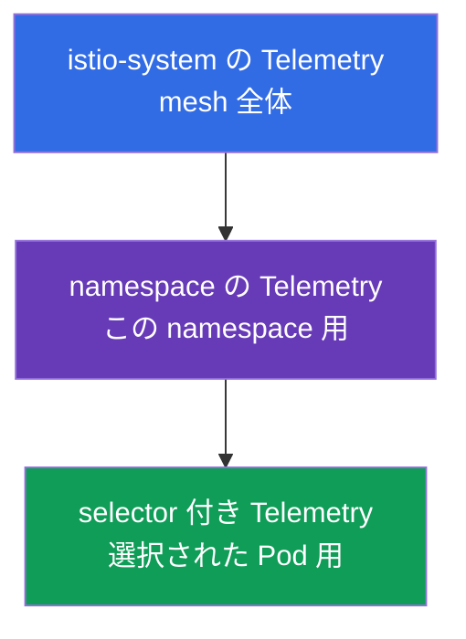
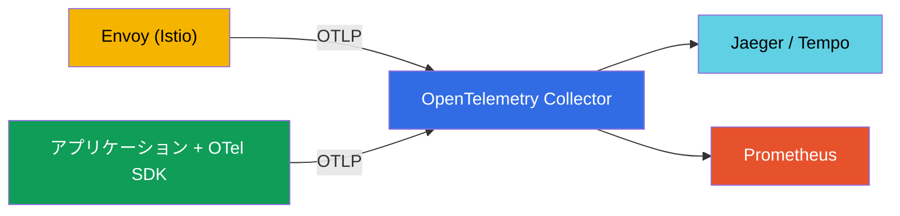
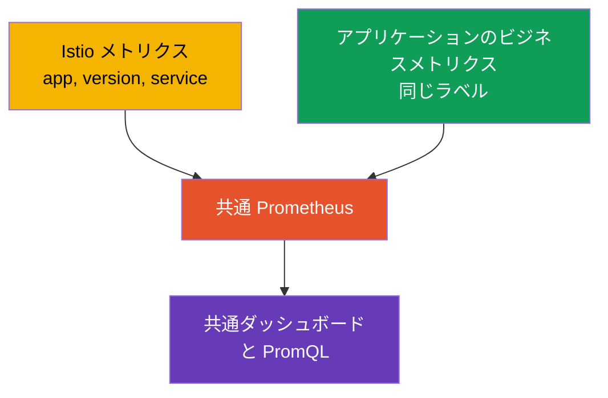

[Русская версия](ru.md) · [Eng version](en.md) · [Versión en español](es.md) · [Version française](fr.md) · [Deutsche Version](de.md) · [ქართული ვერსია](ge.md) · [繁體中文版](tw.md)

# 第18章。Telemetry API: access logs と分散トレーシング

> **この次に。** 第17章では observability スタックをデプロイし、Istio が
> テレメトリーを自動収集することを確認しました。しかし、これを細かく設定できる必要があります。
> どこでログを有効にするか、トレースを何パーセントサンプリングするか、どのメトリクスラベルを残すかです。
> 以前は異なる方法（meshConfig、EnvoyFilter）で行っていましたが、現在は統一された宣言的な
> ツール、**Telemetry API** があります。

## 18.1. Telemetry API が必要な理由

Telemetry API（`telemetry.istio.io`）は、access logs、メトリクス、トレースという mesh の
すべてのテレメトリーを、単一のリソースタイプから管理する最新の方法です。分散していた方式
（`meshConfig` の設定、手動の `EnvoyFilter`）に取って代わり、二つの重要な機能を提供します。

- ログ、メトリクス、トレースのための**統一された宣言的形式**。
- **スコープの階層**。mesh 全体の動作を設定した後、個別の namespace、さらには特定の Pod
  に対して上書きできます。

## 18.2. スコープの階層

**そもそもなぜ必要なのでしょうか。** サービスごとに必要なテレメトリーは異なります。ログと
トレースにはリソースとコストがかかるため、すべてのサービスから最大限に収集するのは賢明では
ありません。一方で、サービスごとに個別設定するのも不便です。理想的なモデルは、**mesh 全体に
適切なデフォルト設定を定め**、異なる設定が必要な箇所だけをピンポイントで**例外にする**ことです。
Telemetry API のスコープ階層は、まさにこれを可能にします。

これが役立つ典型的な状況は次のとおりです。

- **コスト。** mesh 全体ではトレースのサンプリングを 1%（低コスト）に保ち、監査が重要な
  決済サービスでは 100% に引き上げます。
- **ノイズ。** おしゃべりなサービス（たとえば health check）がログを埋め尽くす場合、他に
  影響を与えず、そのサービスだけのログを無効にします。
- **デバッグ。** 現在修正中のサービスだけで、一時的に詳細ログと完全なトレーシングを有効化し、
  デバッグ後に元へ戻します。
- **一貫性。** デフォルト設定を各 namespace にコピーするのではなく、1 か所（`istio-system`）で
  定義するため、重複とばらつきが減ります。

次に技術的な仕組みを見てみましょう。`Telemetry` リソースは、作成場所と `selector` の有無に
よって異なるレベルで作用します。



- **mesh 全体** - selector のないルート namespace（`istio-system`）の `Telemetry`。
- **Namespace** - selector のない、対象 namespace の `Telemetry`。
- **特定の Pod** - `selector.matchLabels` を持つ `Telemetry`。

より狭いポリシーが、より広いポリシーを上書きします。たとえば、基本ログを mesh 全体で有効にし、
「ノイズの多い」サービスだけ無効にできます。反対に、重要なサービスだけトレースのサンプリングを
100% に引き上げることもできます。

## 18.3. Access logs

Access logs は各リクエストに関する Envoy の記録（誰が、どこへ、応答コード、遅延）です。
mesh 全体で有効にするには、次のようにします。

```yaml
apiVersion: telemetry.istio.io/v1
kind: Telemetry
metadata:
  name: mesh-default
  namespace: istio-system    # ルート namespace = mesh 全体
spec:
  accessLogging:
  - providers:
    - name: envoy             # Envoy の stdout に書き込む
```

次に階層の例です。「ノイズの多い」サービスでは、残りの mesh に影響を与えずログを無効にできます。

```yaml
apiVersion: telemetry.istio.io/v1
kind: Telemetry
metadata:
  name: disable-noisy
  namespace: app
spec:
  selector:
    matchLabels:
      app: noisy-service
  accessLogging:
  - providers:
    - name: envoy
    disabled: true            # 上書き: ここではログを出力しない
```

多くの場合、「すべて」でも「何もなし」でもなく、**興味のあるものだけ**、たとえばエラーだけが
必要です。このため `accessLogging` には `filter.expression` があります。これは記録するか
どうかを判断する、**CEL** 言語による条件です。`5xx` 応答だけをログに記録します。

```yaml
apiVersion: telemetry.istio.io/v1
kind: Telemetry
metadata:
  name: log-errors-only
  namespace: app
spec:
  accessLogging:
  - providers:
    - name: envoy
    filter:
      expression: "response.code >= 400"   # エラー (4xx/5xx) のみ出力する
```

式ではリクエスト属性（`response.code`、`request.method`、`request.path`、
`connection.mtls` など）を利用できます。これによりログ量は桁違いに減少しますが、最も重要な
エラーは引き続き見えます。これは「すべて有効」または「すべて無効」の代わりとなる、典型的な
本番運用の手法です。

第17章で説明したとおり、access logs は大量になるため、本番環境では選択的に有効化します。
そして Telemetry API は、まさにこれを実現するツールです。

## 18.4. トレーシング

Telemetry API は分散トレーシングも管理します。スパンの送信先プロバイダーと、サンプリングする
リクエストの割合を設定します。プロバイダー（たとえば `zipkin`、`opentelemetry`）は、Istio の
インストール時に MeshConfig（`extensionProviders`）で**一度だけ宣言**し、`Telemetry` リソース
はその名前で参照します。

まず、IstioOperator でプロバイダーを宣言します（インストールまたはアップグレード時に行います）。

```yaml
apiVersion: install.istio.io/v1alpha1
kind: IstioOperator
spec:
  meshConfig:
    extensionProviders:
    - name: otel-tracing                 # 名前。Telemetry から参照される
      opentelemetry:
        service: otel-collector.observability.svc.cluster.local
        port: 4317                       # OTLP gRPC
```

次に `Telemetry` から参照し、サンプリングを設定します。

```yaml
apiVersion: telemetry.istio.io/v1
kind: Telemetry
metadata:
  name: mesh-tracing
  namespace: istio-system
spec:
  tracing:
  - providers:
    - name: otel-tracing                 # extensionProviders のプロバイダー名
    randomSamplingPercentage: 10.0       # リクエストの 10% をトレースに
```

- **`providers.name`** - スパンの送信先となるトレーシングバックエンド。
- **`randomSamplingPercentage`** - トレースに含めるリクエストの割合。

デモでは `100.0`（すべてのリクエストが見える）を使いますが、本番では `1.0`-`5.0` を使用します。
ここでも階層が機能します。mesh 全体を 1% に保ちながら、現在デバッグ中の一つのサービスだけを
selector を持つ個別の `Telemetry` で 100% に引き上げられます。

EKS ではプロバイダーとして通常 **ADOT Collector**（AWS 版 OpenTelemetry Collector、第17章）を
指定します。同じ `opentelemetry` プロバイダーですが、`service` は ADOT を指し、ADOT がトレースを
**AWS X-Ray**（または Tempo）へ送信します。サンプリングは X-Ray ではなく、ここ Telemetry API
で設定します。

## 18.5. メトリクス: カスタマイズとカーディナリティの低減

Telemetry API は、メトリクスの設定も可能です。ラベル（tags）の追加・削除や、不要なメトリクスの
無効化を行えます。これは第17章で扱ったカーディナリティ問題に対する直接的なツールです。

例として、Prometheus の負荷を下げるため、リクエストメトリクスから「重い」ラベルを削除します。

```yaml
apiVersion: telemetry.istio.io/v1
kind: Telemetry
metadata:
  name: metrics-tuning
  namespace: istio-system
spec:
  metrics:
  - providers:
    - name: prometheus
    overrides:
    - match:
        metric: REQUEST_COUNT
      tagOverrides:
        request_host:
          operation: REMOVE       # request_host ラベルを削除する
```

- **`match.metric`** - 設定対象のメトリクス（たとえば `REQUEST_COUNT` は
  `istio_requests_total`）。
- **`tagOverrides`** - ラベルに対して行う操作。`REMOVE`（削除）、または独自の値の設定です。

同様に、独自のラベル（たとえばリクエストヘッダー由来）を追加することも、不要なメトリクスを
完全に無効化することも可能です。本番での目的は通常一つです。ダッシュボードとアラートで実際に
使用するラベルだけを残し、Prometheus を肥大化させる高カーディナリティのラベル（ホスト、ID を
含むパスなど）を除去します。

## 18.6. Telemetry API と OpenTelemetry

ここでよく混乱が生じます。「Telemetry API」と「OpenTelemetry」は似た響きですが、**異なる
レイヤーの別物**であり、競合するものではなく相互補完するものです。

- **Istio Telemetry API** は、Istio がどのテレメトリーを生成しどこへ送るかを**設定する**
  Kubernetes リソースです（ログを有効化する、サンプリングを設定する、プロバイダーを選ぶ、
  ラベルを調整する）。これは mesh の設定に関するものです。
- **OpenTelemetry（OTel）** はオープンスタンダード（CNCF プロジェクト）です。統一されたデータ
  形式（OTLP）、アプリケーション向け API と SDK、そしてテレメトリーを任意のバックエンドに
  収集・処理・送信するサービス、**OTel Collector** を提供します。これはベンダー中立の、データ
  収集とパイプラインそのものに関するものです。

簡単に言えば、Telemetry API は「Istio で何をどのように収集するか」に答え、OpenTelemetry は
「どの標準形式で伝送し、どこへ届けるか」に答えます。

**連携方法。** Istio は OTLP プロトコルを通じて、テレメトリーを **OpenTelemetry Collector** へ
送信できます。Istio インストール時に OTel をプロバイダーとして宣言し、その後 Telemetry API で
ログまたはトレースにこのプロバイダーを使用するよう指定します。Envoy はデータを Collector に
送信し、Collector はバックエンド（Jaeger、Tempo、Prometheus など）へ振り分けます。



| | Istio Telemetry API | OpenTelemetry |
|---|---------------------|---------------|
| これは何か | Istio の Kubernetes CRD | オープンスタンダード + Collector + SDK |
| 目的 | mesh のテレメトリーを設定する | テレメトリーを収集、処理、配送する |
| レイヤー | インフラストラクチャ（Envoy） | アプリケーション + インフラストラクチャ |
| 形式 | Istio 設定 | OTLP（ベンダー中立） |
| 役割 | 「何をどのように収集するか」 | 「どの形式でどこへ届けるか」 |

**ベストプラクティス。** 成熟した observability システムでは、OTel Collector をパイプラインの
中心とすることがよくあります。アプリケーションは OTel SDK で計装し（スパン、ビジネスレベルの
メトリクス）、Istio は Telemetry API を通じて mesh テレメトリーを同じ Collector に OTLP で送信し、
Collector がすべてを一貫した形でバックエンドに配信します。mesh のスパンとアプリケーションの
スパンは、共通のトレーシングコンテキスト（W3C 標準の `traceparent` ヘッダー）によって結び付け
られます。そのため、アプリケーションがヘッダーを伝播させることが重要です（第17章）。

## 18.7. Istio メトリクスとビジネスメトリクス

Istio は RPS、遅延、応答コードという**インフラストラクチャメトリクス**を提供します。しかし、
注文数、売上、カートのサイズといったビジネスについては何も知りません。こうした
**ビジネスメトリクス**はアプリケーション自身が公開します。これらを一緒に分析することはよく
あります。たとえば、Istio の遅延増加がアプリケーションの注文数減少と一致したことを確認します。
これを便利に行うには、あらかじめすべてを正しく関連付ける必要があります。

**1. 共通のメトリクスバックエンド。** アプリケーションのビジネスメトリクスを、Istio の
メトリクスと同じ Prometheus へエクスポートします。endpoint `/metrics`（ServiceMonitor/
PodMonitor）経由、または OTel SDK と Collector（18.6節）経由で行います。すべてが一つの
ストレージにあれば、共通ダッシュボードを構築し、PromQL クエリを組み合わせられます。

**2. 相関のための統一ラベルが最も重要です。** メトリクスを比較するには、共通の**次元**、
`app`、`version`、`namespace`、`service`、`env` を持つ必要があります。Istio は標準ラベル
（`destination_workload`、`destination_version` など）を使用します。ビジネスメトリクスにも
同じサービス名とバージョンを付与すれば、たとえば Istio の latency とアプリケーションの
`orders_total` を、同じサービスとバージョンに基づいて相関付けできます。



**3. Istio メトリクスにビジネス次元を追加する。** Telemetry API（`tagOverrides`）を通じて、
ネットワークメトリクスへリクエストヘッダーまたは JWT claim 由来のラベル、たとえば `tenant` や
`plan` を追加できます。これにより、Istio のインフラストラクチャメトリクスもビジネス次元で
分類できます。カーディナリティには注意してください。適するのは低カーディナリティの値
（プラン、リージョン）だけであり、`user_id` ではありません。

**4. トレースによる関連付け。** ビジネスコンテキストはトレーシングに結び付けると便利です。
アプリケーションは OTel SDK を通じて、同じ trace にスパンと属性（`order_id`、`user_id`）を追加し、
Istio はネットワークスパンを追加します。これらはすべて共通の `traceparent` で結び付いています。
一つのトレース内でネットワーク経路とビジネス上の意味の両方を確認できます。また Prometheus の
**exemplars** により、latency グラフの一点から特定のトレースへ直接移動できます。

**実践的な結論。** 最初から**統一されたラベル規約**（アプリケーションと Istio で同じ
`service`、`version`、`namespace`、`env`）を決めてください。そうすればメトリクスは自然に
関連付けられます。また重複させないでください。ネットワークメトリクス（RPS、コード、latency）は
Istio から、ビジネスメトリクスはアプリケーションから取得します。高カーディナリティのビジネス
データ（`user_id`、`order_id`）はメトリクスではなくトレースとログに保持します。

## 18.8. 本番環境のベストプラクティス

- **一つの mesh-default、それから例外。** `istio-system` に基本 `Telemetry`（適切な最小限の
  ログと低いサンプリング）を設定し、個別設定は namespace または workload レベルでピンポイントに
  行います。同じポリシーをすべての namespace にコピーしないでください。
- **ポリシーを Git（GitOps）で管理する。** テレメトリーは設定です。手作業で作成するのではなく、
  バージョン管理しレビューを通すべきです。
- **デフォルトでは低いサンプリング。** mesh 全体では 1-5% とし、特定のサービスをデバッグする
  場合だけ、一時的かつピンポイントで 100% を有効にします。本番全体での 100% は余分な負荷と量を
  生みます。
- **Access logs は選択的かつ構造化して使う。** mesh 全体で完全なログを有効にしないでください。
  有効にする箇所では、解析・インデックス作成可能な構造化形式（JSON）を使用します。
- **メトリクスのカーディナリティを管理する。** `tagOverrides` を通じて高カーディナリティの
  ラベル（ID を含むパス、ホスト）を削除し、使用していないメトリクスを無効にします。これは
  Prometheus のメモリとコストを直接節約します。
- **バックエンドへ直接送らず、OTel Collector に送る。** 集中型パイプライン（18.6節）により、
  mesh 設定に手を加えずバックエンドを変更・追加できます。
- **責任を分離する。** プラットフォームチームは `istio-system` の mesh-default を所有し、
  プロダクトチームは自らの namespace のポリシーを所有します。
- **EnvoyFilter より Telemetry API を優先する。** Telemetry API で解決できる課題に、手動の
  `EnvoyFilter` を使わないでください。これは脆く、Istio のアップグレード時に壊れます。
- **機密データを慎重に扱う。** PII を含むヘッダーや本文をログに記録しないでください。
  カスタムログ形式が不要なデータまで取り込んでいないことを確認します。
- **staging でテレメトリーの変更をテストする。** `tagOverrides` やログ形式の誤りにより、頼りに
  しているダッシュボードとアラートが気付かないうちに壊れる可能性があります。

## 18.9. 章のまとめ

- **Telemetry API**（`telemetry.istio.io`）は、ログ、メトリクス、トレースを管理する統一された
  宣言的方法です。meshConfig と EnvoyFilter による設定に取って代わりました。
- **スコープの階層**に従って動作します。mesh 全体（istio-system）、namespace、特定の
  Pod（selector）があり、狭いポリシーが広いポリシーを上書きします。
- **Access logs**: `envoy` プロバイダーで有効にします。「ノイズの多い」サービスでは選択的に
  無効化でき、`filter.expression`（CEL）によって必要なものだけ（たとえばエラーだけ）記録
  することもできます。
- **トレーシング**: プロバイダーを MeshConfig（`extensionProviders`）で宣言し、`Telemetry` が
  名前で参照して `randomSamplingPercentage` を設定します。本番では 1-5% とし、サービスの
  デバッグ時にはピンポイントで引き上げられます。EKS では `opentelemetry` プロバイダーが
  ADOT → X-Ray を指します。
- **メトリクス**: `tagOverrides` を伴う `overrides` により、ラベルの削除・追加やメトリクスの
  無効化ができます。カーディナリティ対策の主要なツールです。
- **Telemetry API と OpenTelemetry** は異なるレイヤーです。Telemetry API は mesh の
  テレメトリーを設定し、OpenTelemetry は標準とパイプライン（Collector、OTLP）です。Istio は
  テレメトリーを OTel Collector へ送信でき、本番では Collector を収集の中心にすることがよく
  あります。
- 本番プラクティス: 一つの mesh-default + ピンポイントの例外、GitOps、低サンプリング、選択的な
  構造化ログ、カーディナリティ制御、OTel Collector への送信、EnvoyFilter の代わりの Telemetry API、
  PII への注意。
- ビジネスメトリクスと Istio メトリクスは、一つの Prometheus に格納し、統一されたラベル
  （service、version、namespace、env）を付ければ一緒に分析できます。高カーディナリティの
  ビジネスデータはトレース・ログに保持し、すべてを共通のトレーシングコンテキストで結び付けます。

## 18.10. 自己確認の質問

1. Telemetry API は、古い方式（meshConfig、EnvoyFilter）と比べてどの問題を解決しますか？
2. スコープの階層はどのように機能し、重なった場合にどのポリシーが優先されますか？
3. mesh 全体で access logs を有効にし、一つのサービスだけで無効にするにはどうしますか？
4. トレースのサンプリング率を設定するにはどうし、本番ではなぜ低く保つべきですか？
5. Telemetry API を使って、メトリクスの高カーディナリティにどう対処できますか？
6. Istio Telemetry API は OpenTelemetry とどう異なり、どのように連携しますか？
7. サンプリング、カーディナリティ、ログ、ポリシー構造、テレメトリーの送信先という観点から、
   Telemetry API の本番プラクティスを挙げてください。
8. アプリケーションのビジネスメトリクスを Istio メトリクスと一緒に便利に分析できるようにするには
   どうしますか？ 統一ラベルが重要なのはなぜですか？
9. すべてのトラフィックではなくエラーだけをログに記録するにはどうしますか？ `Telemetry` が参照
   するトレーシングプロバイダーはどこで宣言されますか？

## 演習

Telemetry API を通じて access logs とトレーシングを設定し、スコープの階層
（mesh、namespace、workload）を試してください。

🧪 ラボ 18: [tasks/ica/labs/18](../../labs/18/README_JP.MD)

---
[目次](../README_JP.md) · [第17章](../17/jp.md) · [第19章](../19/jp.md)
