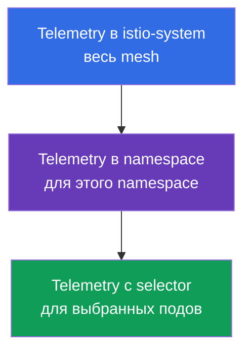
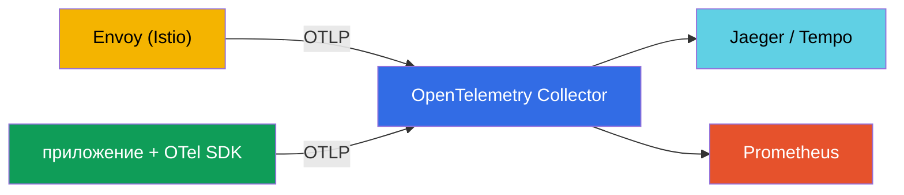
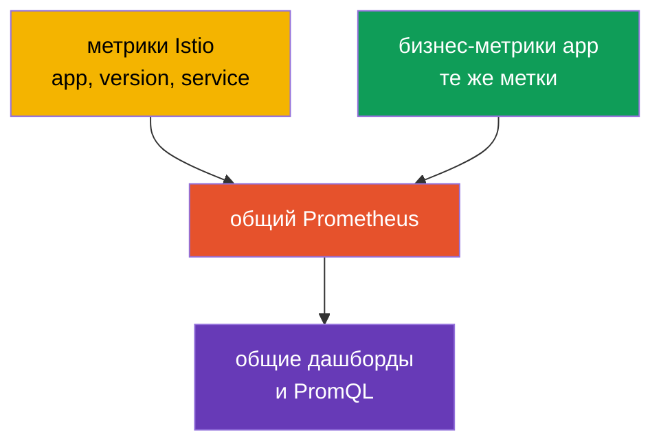

[Eng version](en.md) · [Versión en español](es.md) · [Version française](fr.md) · [Deutsche Version](de.md)

# Глава 18. Telemetry API: access logs и распределённый трейсинг

> **Что дальше.** В главе 17 мы развернули стек observability и увидели, что Istio
> собирает телеметрию автоматически. Но её нужно уметь тонко настраивать: где включить
> логи, какой процент трейсов сэмплировать, какие метки метрик оставить. Раньше это
> делали разными способами (meshConfig, EnvoyFilter), а теперь есть единый декларативный
> инструмент - **Telemetry API**.

## 18.1. Зачем нужен Telemetry API

Telemetry API (`telemetry.istio.io`) - это современный способ управлять всей
телеметрией mesh из одного типа ресурса: access-логами, метриками и трейсами. Он пришёл
на смену разрозненным подходам (настройки в `meshConfig`, ручные `EnvoyFilter`) и даёт
две важные вещи:

- **единый декларативный формат** для логов, метрик и трейсов;
- **иерархию областей действия** - можно задать поведение на весь mesh, а потом
  переопределить для отдельного namespace или даже конкретных подов.

## 18.2. Иерархия областей действия

**Зачем это вообще нужно.** Разным сервисам нужна разная телеметрия. Логи и трейсы стоят
ресурсов и денег, поэтому глупо собирать всё со всех по максимуму. Но и настраивать
каждый сервис отдельно - неудобно. Идеальная модель: задать **разумные настройки по
умолчанию на весь mesh**, а потом точечно **делать исключения** там, где надо иначе.
Иерархия областей Telemetry API это ровно и позволяет.

Типичные ситуации, где это спасает:

- **Стоимость.** На весь mesh держим сэмплирование трейсов 1% (дёшево), но для платёжного
  сервиса, где важен аудит, поднимаем до 100%.
- **Шум.** Болтливый сервис (например, health-check) забивает логи - отключаем логи
  именно для него, не трогая остальных.
- **Отладка.** Сервис сейчас чинят - временно включаем детальные логи и полный трейсинг
  только для него, а после отладки убираем.
- **Единообразие.** Настройки по умолчанию заданы в одном месте (`istio-system`), а не
  скопированы в каждый namespace - меньше дублирования и разнобоя.

Теперь как это устроено технически. Ресурс `Telemetry` действует на разном уровне в
зависимости от того, где он создан и есть ли у него `selector`:



- **Весь mesh** - `Telemetry` в корневом namespace (`istio-system`) без selector.
- **Namespace** - `Telemetry` в нужном namespace без selector.
- **Конкретные поды** - `Telemetry` с `selector.matchLabels`.

Более узкая политика переопределяет более широкую. Например: включить базовые логи на
весь mesh, а для одного «шумного» сервиса - отключить, или наоборот, для одного
критичного сервиса поднять сэмплирование трейсов до 100%.

## 18.3. Access logs

Access-логи это записи Envoy о каждом запросе (кто, куда, код ответа, задержка).
Включить их на весь mesh:

```yaml
apiVersion: telemetry.istio.io/v1
kind: Telemetry
metadata:
  name: mesh-default
  namespace: istio-system    # корневой namespace = весь mesh
spec:
  accessLogging:
  - providers:
    - name: envoy             # писать в stdout Envoy
```

А теперь пример иерархии: для «шумного» сервиса логи можно выключить, не трогая
остальной mesh:

```yaml
apiVersion: telemetry.istio.io/v1
kind: Telemetry
metadata:
  name: disable-noisy
  namespace: app
spec:
  selector:
    matchLabels:
      app: noisy-service
  accessLogging:
  - providers:
    - name: envoy
    disabled: true            # переопределяем: здесь логов не будет
```

Часто нужен средний вариант: не «всё» и не «ничего», а **только интересное** - например,
только ошибки. Для этого у `accessLogging` есть `filter.expression` - условие на языке
**CEL**, которое решает, писать запись или нет. Логировать только ответы `5xx`:

```yaml
apiVersion: telemetry.istio.io/v1
kind: Telemetry
metadata:
  name: log-errors-only
  namespace: app
spec:
  accessLogging:
  - providers:
    - name: envoy
    filter:
      expression: "response.code >= 400"   # писать только ошибки (4xx/5xx)
```

В выражении доступны атрибуты запроса (`response.code`, `request.method`, `request.path`,
`connection.mtls` и др.). Так объём логов падает на порядок, а самое важное - ошибки -
по-прежнему видно. Это и есть типичный прод-приём вместо «включить всё» или «выключить всё».

Как мы обсуждали в главе 17, access-логи объёмны, поэтому в проде их включают
выборочно - и Telemetry API это ровно тот инструмент, которым это делают.

## 18.4. Трейсинг

Telemetry API управляет и распределённой трассировкой: каким провайдером слать спаны и
какой процент запросов сэмплировать. Провайдер (например, `zipkin`, `opentelemetry`)
**объявляется один раз при установке Istio** в MeshConfig (`extensionProviders`), а ресурс
`Telemetry` ссылается на него по имени.

Сначала объявляем провайдер в IstioOperator (это делают при установке/апгрейде):

```yaml
apiVersion: install.istio.io/v1alpha1
kind: IstioOperator
spec:
  meshConfig:
    extensionProviders:
    - name: otel-tracing                 # имя, на него сошлётся Telemetry
      opentelemetry:
        service: otel-collector.observability.svc.cluster.local
        port: 4317                       # OTLP gRPC
```

Затем ссылаемся на него из `Telemetry` и задаём сэмплирование:

```yaml
apiVersion: telemetry.istio.io/v1
kind: Telemetry
metadata:
  name: mesh-tracing
  namespace: istio-system
spec:
  tracing:
  - providers:
    - name: otel-tracing                 # имя провайдера из extensionProviders
    randomSamplingPercentage: 10.0       # 10% запросов в трейсы
```

- **`providers.name`** - на какой бэкенд трассировки слать спаны.
- **`randomSamplingPercentage`** - доля запросов, попадающих в трейсы.

Для демо ставят `100.0` (видно каждый запрос), для прода - `1.0`-`5.0`. И снова
работает иерархия: на весь mesh можно оставить 1%, а для одного сервиса, который сейчас
отлаживают, поднять до 100% отдельной `Telemetry` с selector.

На EKS в качестве провайдера обычно указывают **ADOT Collector** (AWS-сборка OpenTelemetry
Collector, глава 17): тот же `opentelemetry`-провайдер, только `service` смотрит на ADOT, а
он уже отправляет трейсы в **AWS X-Ray** (или Tempo). Сэмплирование задаётся здесь же, в
Telemetry API, а не в X-Ray.

## 18.5. Метрики: кастомизация и снижение кардинальности

Telemetry API умеет и настраивать метрики: добавлять или убирать метки (tags),
отключать ненужные метрики. Это прямой инструмент против проблемы кардинальности, о
которой мы говорили в главе 17.

Пример: убрать «тяжёлую» метку из метрики запросов, чтобы снизить нагрузку на Prometheus:

```yaml
apiVersion: telemetry.istio.io/v1
kind: Telemetry
metadata:
  name: metrics-tuning
  namespace: istio-system
spec:
  metrics:
  - providers:
    - name: prometheus
    overrides:
    - match:
        metric: REQUEST_COUNT
      tagOverrides:
        request_host:
          operation: REMOVE       # убрать метку request_host
```

- **`match.metric`** - какую метрику настраиваем (например, `REQUEST_COUNT` это
  `istio_requests_total`).
- **`tagOverrides`** - что сделать с метками: `REMOVE` (убрать) или задать своё значение.

Так же можно добавить свою метку (например, из заголовка запроса) или полностью
отключить метрику, которая вам не нужна. Смысл в проде обычно один: оставить только те
метки, которые реально используются в дашбордах и алертах, и убрать высококардинальные
(хосты, пути с ID и т.п.), которые раздувают Prometheus.

## 18.6. Telemetry API и OpenTelemetry

Здесь часто возникает путаница: «Telemetry API» и «OpenTelemetry» звучат похоже, но это
**разные вещи на разных уровнях**, и они не конкуренты, а дополняют друг друга.

- **Istio Telemetry API** - это Kubernetes-ресурс, которым вы **настраиваете**, какую
  телеметрию производит Istio и куда её слать (включить логи, задать сэмплирование,
  выбрать провайдера, подправить метки). Это про конфигурацию mesh.
- **OpenTelemetry (OTel)** - это открытый стандарт (проект CNCF): единый формат данных
  (OTLP), API и SDK для приложений, а также **OTel Collector** - сервис для сбора,
  обработки и отправки телеметрии в любые бэкенды. Это про сам сбор и конвейер данных,
  вендор-нейтрально.

Проще говоря: Telemetry API отвечает на вопрос «что и как собирать в Istio»,
OpenTelemetry - «в каком стандартном формате это передавать и куда доставлять».

**Как они работают вместе.** Istio умеет отправлять телеметрию в **OpenTelemetry
Collector** по протоколу OTLP. Вы объявляете OTel как провайдера при установке Istio, а
затем через Telemetry API указываете использовать этот провайдер для логов или трейсов.
Envoy шлёт данные в Collector, а тот уже разводит их по бэкендам (Jaeger, Tempo,
Prometheus и т.д.).



| | Istio Telemetry API | OpenTelemetry |
|---|---------------------|---------------|
| Что это | Kubernetes CRD Istio | открытый стандарт + Collector + SDK |
| Задача | настроить телеметрию mesh | собрать, обработать, доставить телеметрию |
| Уровень | инфраструктура (Envoy) | приложение + инфраструктура |
| Формат | конфиг Istio | OTLP (вендор-нейтральный) |
| Роль | «что и как собирать» | «в каком формате и куда доставлять» |

**Best practice.** В зрелой системе observability центром конвейера часто делают
именно OTel Collector: приложения инструментируют OTel SDK (спаны, метрики бизнес-уровня),
Istio через Telemetry API шлёт mesh-телеметрию в тот же Collector по OTLP, а Collector
единообразно доставляет всё в бэкенды. Связывает mesh-спаны и спаны приложения общий
контекст трассировки (заголовок `traceparent` из стандарта W3C) - поэтому так важно,
чтобы приложение пробрасывало заголовки (глава 17).

## 18.7. Бизнес-метрики вместе с метриками Istio

Istio даёт **инфраструктурные** метрики: RPS, задержки, коды ответов. Но он ничего не
знает про бизнес: сколько оформлено заказов, какая выручка, размер корзины. Эти
**бизнес-метрики** отдаёт само приложение. Частая задача - анализировать их вместе:
например, увидеть, что рост задержки из Istio совпал с падением числа заказов из
приложения. Чтобы это было удобно, нужно заранее всё правильно состыковать.

**1. Общий бэкенд метрик.** Экспортируйте бизнес-метрики приложения в тот же
Prometheus, куда идут метрики Istio - через endpoint `/metrics` (ServiceMonitor/
PodMonitor) или через OTel SDK и Collector (раздел 18.6). Когда всё в одном хранилище,
можно строить общие дашборды и делать совместные PromQL-запросы.

**2. Единые метки для корреляции - это главное.** Чтобы метрики можно было сопоставлять,
у них должны быть **общие измерения**: `app`, `version`, `namespace`, `service`, `env`.
Istio использует стандартные метки (`destination_workload`, `destination_version` и
т.д.). Если бизнес-метрики размечать теми же именами сервиса и версии, вы сможете
коррелировать, например, latency из Istio и `orders_total` из приложения по одному и
тому же сервису и версии.



**3. Добавить бизнес-измерение в метрики Istio.** Через Telemetry API (`tagOverrides`)
можно добавить в сетевые метрики метку из заголовка или JWT-claim - например, `tenant`
или `plan`. Тогда даже инфраструктурные метрики Istio можно резать по бизнес-измерению.
Осторожно с кардинальностью: годятся только низкокардинальные значения (план, регион), а
не `user_id`.

**4. Связка через трейсы.** Бизнес-контекст удобно привязывать к трассировке. Приложение
через OTel SDK добавляет в тот же trace свои спаны и атрибуты (`order_id`, `user_id`), а
Istio добавляет сетевые спаны - и всё связано общим `traceparent`. В одном трейсе видно
и сетевой путь, и бизнес-смысл. А **exemplars** в Prometheus позволяют из точки на
графике latency прыгнуть прямо в конкретный трейс.

**Практический вывод.** Договоритесь о **едином соглашении по меткам** (одинаковые
`service`, `version`, `namespace`, `env` у приложения и у Istio) с самого начала. Тогда
метрики стыкуются сами собой. И не дублируйте: сетевые метрики (RPS, коды, latency)
берите из Istio, бизнес-метрики - из приложения. Высококардинальные бизнес-данные
(`user_id`, `order_id`) держите в трейсах и логах, а не в метриках.

## 18.8. Best practices для прода

- **Один mesh-default, дальше исключения.** Задайте базовую `Telemetry` в `istio-system`
  (разумный минимум логов и низкое сэмплирование), а частные настройки делайте точечно
  на уровне namespace или workload. Не копируйте одинаковые политики по всем namespace.
- **Храните политики в Git (GitOps).** Телеметрия это конфигурация - она должна быть
  версионируемой и проходить ревью, а не создаваться руками.
- **Низкое сэмплирование по умолчанию.** На весь mesh 1-5%, а 100% включайте точечно и
  временно для отладки конкретного сервиса. 100% на весь прод - лишняя нагрузка и объём.
- **Access-логи выборочно и структурированно.** Не включайте full-логи на весь mesh.
  Там, где включаете, используйте структурированный формат (JSON), чтобы их можно было
  парсить и индексировать.
- **Контролируйте кардинальность метрик.** Через `tagOverrides` убирайте
  высококардинальные метки (пути с ID, хосты) и отключайте неиспользуемые метрики. Это
  прямо экономит память Prometheus и деньги.
- **Слать в OTel Collector, а не напрямую в бэкенды.** Централизованный конвейер
  (глава 18.6) позволяет менять и добавлять бэкенды, не трогая конфигурацию mesh.
- **Разделяйте ответственность.** Платформенная команда владеет mesh-default в
  `istio-system`, продуктовые команды - политиками в своих namespace.
- **Предпочитайте Telemetry API, а не EnvoyFilter.** Если задачу решает Telemetry API,
  не используйте ручные `EnvoyFilter` - они хрупкие и ломаются при апгрейдах Istio.
- **Осторожно с чувствительными данными.** Не логируйте заголовки и тела с PII;
  проверяйте, что кастомный формат логов не утягивает лишнее.
- **Тестируйте изменения телеметрии в staging.** Ошибка в `tagOverrides` или формате
  логов может незаметно сломать дашборды и алерты, на которые вы полагаетесь.

## 18.9. Итоги главы

- **Telemetry API** (`telemetry.istio.io`) - единый декларативный способ управлять
  логами, метриками и трейсами; пришёл на смену настройкам через meshConfig и EnvoyFilter.
- Работает по **иерархии областей**: весь mesh (istio-system), namespace, конкретные
  поды (selector); узкая политика переопределяет широкую.
- **Access logs**: включаются провайдером `envoy`; можно выборочно отключать для шумных
  сервисов или через `filter.expression` (CEL) писать только нужное (например, только ошибки).
- **Трейсинг**: провайдер объявляют в MeshConfig (`extensionProviders`), а `Telemetry`
  ссылается на него по имени + задаёт `randomSamplingPercentage`; в проде 1-5%, для отладки
  сервиса можно поднять точечно. На EKS провайдер `opentelemetry` смотрит на ADOT → X-Ray.
- **Метрики**: `overrides` с `tagOverrides` позволяют убирать/добавлять метки и
  отключать метрики - главный инструмент против кардинальности.
- **Telemetry API и OpenTelemetry** - разные уровни: Telemetry API настраивает
  телеметрию mesh, OpenTelemetry это стандарт и конвейер (Collector, OTLP). Istio может
  слать телеметрию в OTel Collector; в проде его часто делают центром сбора.
- Прод-практики: один mesh-default + точечные исключения, GitOps, низкое сэмплирование,
  выборочные структурированные логи, контроль кардинальности, отправка в OTel Collector,
  Telemetry API вместо EnvoyFilter, осторожность с PII.
- Бизнес-метрики и метрики Istio анализируют вместе, если положить их в один Prometheus
  и размечать едиными метками (service, version, namespace, env); высококардинальные
  бизнес-данные держат в трейсах/логах, а связывает всё общий контекст трассировки.

## 18.10. Вопросы для самопроверки

1. Какую проблему решает Telemetry API по сравнению со старыми подходами (meshConfig,
   EnvoyFilter)?
2. Как работает иерархия областей и какая политика побеждает при пересечении?
3. Как включить access-логи на весь mesh и отключить их для одного сервиса?
4. Как задать процент сэмплирования трейсов и зачем в проде держать его низким?
5. Как с помощью Telemetry API бороться с высокой кардинальностью метрик?
6. Чем Istio Telemetry API отличается от OpenTelemetry и как они работают вместе?
7. Назовите ключевые прод-практики Telemetry API: сэмплирование, кардинальность, логи,
   структура политик, куда слать телеметрию.
8. Как сделать так, чтобы бизнес-метрики приложения удобно анализировались вместе с
   метриками Istio? Почему важны единые метки?
9. Как логировать только ошибки, а не весь трафик? Где объявляется трейсинг-провайдер, на
   который ссылается `Telemetry`?

## Практика

Настройте access-логи и трейсинг через Telemetry API, опробуйте иерархию областей
(mesh, namespace, workload):

🧪 Лаба 18: [tasks/ica/labs/18](../../labs/18/README_RU.MD)

---
[Оглавление](../README.md) · [Глава 17](../17/ru.md) · [Глава 19](../19/ru.md)
