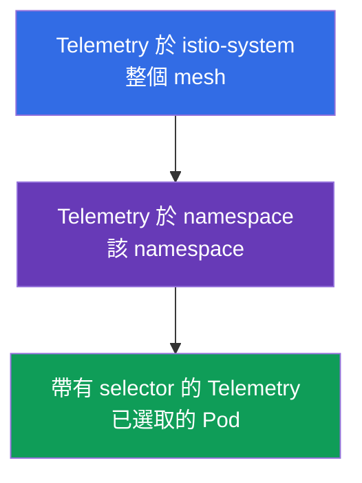
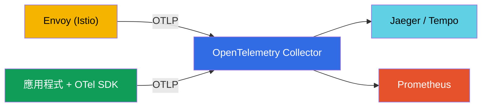
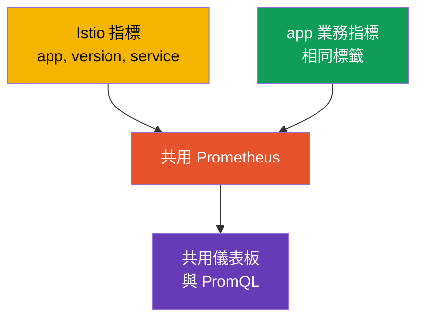

[Русская версия](ru.md) · [Eng version](en.md) · [Versión en español](es.md) · [Version française](fr.md) · [Deutsche Version](de.md) · [ქართული ვერსია](ge.md) · [日本語版](jp.md)

# 第 18 章。Telemetry API：access log 與分散式追蹤

> **接下來。** 在第 17 章中，我們部署了 observability 堆疊，並看到 Istio 會自動收集遙測資料。但您必須能精細設定：在哪裡啟用日誌、要對多少百分比的 trace 進行取樣、要保留哪些指標標籤。過去這些工作透過不同方式完成（`meshConfig`、`EnvoyFilter`），現在則有一項統一的宣告式工具：**Telemetry API**。

## 18.1. 為何需要 Telemetry API

Telemetry API（`telemetry.istio.io`）是從單一資源類型管理整個 mesh 遙測資料的現代方式：access log、指標和 trace。它取代了零散的方法（`meshConfig` 中的設定、手動 `EnvoyFilter`），並提供兩項重要能力：

- **統一的宣告式格式**，適用於日誌、指標和 trace；
- **作用範圍階層**：您可以為整個 mesh 設定行為，接著為個別 namespace，甚至是特定 Pod 覆寫它。

## 18.2. 作用範圍階層

**為什麼需要這個。** 不同服務需要不同的遙測資料。日誌與 trace 會耗用資源和金錢，因此為所有服務盡可能收集所有資料並不明智；但逐一設定每個服務也不方便。理想模型是：為**整個 mesh 設定合理的預設值**，然後在需要不同設定的地方精準地**建立例外**。Telemetry API 的作用範圍階層正好能做到這點。

這在以下常見情況特別有用：

- **成本。** 整個 mesh 的 trace 取樣維持在 1%（成本低），但對需要稽核的付款服務提高至 100%。
- **雜訊。** 喧鬧的服務（例如 health check）塞滿日誌--只對它停用日誌，不影響其他服務。
- **除錯。** 某服務正在修復--暫時只為它啟用詳細日誌與完整追蹤，除錯後再移除。
- **一致性。** 預設設定在一處（`istio-system`）定義，而不是複製到每個 namespace--較少重複與差異。

現在來看技術上的運作方式。`Telemetry` 資源會根據它建立的位置以及是否具有 `selector`，在不同層級生效：



- **整個 mesh**--根 namespace（`istio-system`）中不含 selector 的 `Telemetry`。
- **Namespace**--目標 namespace 中不含 selector 的 `Telemetry`。
- **特定 Pod**--使用 `selector.matchLabels` 的 `Telemetry`。

較窄的策略會覆寫較寬的策略。例如：為整個 mesh 啟用基本日誌，然後對某個「喧鬧」服務停用它；或者反過來，為一個關鍵服務把 trace 取樣提高到 100%。

## 18.3. Access log

Access log 是 Envoy 對每個請求的紀錄（誰、到哪裡、回應碼、延遲）。為整個 mesh 啟用它們：

```yaml
apiVersion: telemetry.istio.io/v1
kind: Telemetry
metadata:
  name: mesh-default
  namespace: istio-system    # 根 namespace = 整個 mesh
spec:
  accessLogging:
  - providers:
    - name: envoy             # 寫入 Envoy 的 stdout
```

接著是階層範例：您可以對「喧鬧」服務停用日誌，而不影響 mesh 的其餘部分：

```yaml
apiVersion: telemetry.istio.io/v1
kind: Telemetry
metadata:
  name: disable-noisy
  namespace: app
spec:
  selector:
    matchLabels:
      app: noisy-service
  accessLogging:
  - providers:
    - name: envoy
    disabled: true            # 覆寫：此處不會有日誌
```

通常需要的是折衷方案：不是「全部」也不是「完全不要」，而是**只收集重要內容**--例如只收集錯誤。為此，`accessLogging` 提供 `filter.expression`--以 **CEL** 撰寫的條件，用以決定是否寫入紀錄。只記錄 `5xx` 回應：

```yaml
apiVersion: telemetry.istio.io/v1
kind: Telemetry
metadata:
  name: log-errors-only
  namespace: app
spec:
  accessLogging:
  - providers:
    - name: envoy
    filter:
      expression: "response.code >= 400"   # 只記錄錯誤（4xx/5xx）
```

表達式可使用請求屬性（`response.code`、`request.method`、`request.path`、`connection.mtls` 等）。如此一來日誌量會大幅降低，而最重要的資訊--錯誤--仍然可見。這是典型的正式環境做法，而不是「全開」或「全關」。

如同我們在第 17 章討論過的，access log 資料量很大，因此正式環境會選擇性啟用它們；Telemetry API 正是用來完成這件事的工具。

## 18.4. 追蹤

Telemetry API 也管理分散式追蹤：應將 span 傳送給哪個 provider，以及對多少百分比的請求取樣。Provider（例如 `zipkin`、`opentelemetry`）在安裝 Istio 時於 MeshConfig（`extensionProviders`）中**宣告一次**，而 `Telemetry` 資源會依名稱參照它。

首先在 IstioOperator 中宣告 provider（這在安裝／升級時完成）：

```yaml
apiVersion: install.istio.io/v1alpha1
kind: IstioOperator
spec:
  meshConfig:
    extensionProviders:
    - name: otel-tracing                 # 名稱，Telemetry 會參照它
      opentelemetry:
        service: otel-collector.observability.svc.cluster.local
        port: 4317                       # OTLP gRPC
```

接著在 `Telemetry` 中參照它並設定取樣：

```yaml
apiVersion: telemetry.istio.io/v1
kind: Telemetry
metadata:
  name: mesh-tracing
  namespace: istio-system
spec:
  tracing:
  - providers:
    - name: otel-tracing                 # 來自 extensionProviders 的 provider 名稱
    randomSamplingPercentage: 10.0       # 10% 的請求納入 trace
```

- **`providers.name`**--要將 span 傳送到哪個追蹤後端。
- **`randomSamplingPercentage`**--納入 trace 的請求比例。

展示時設定 `100.0`（能看見每個請求），正式環境則設定 `1.0`–`5.0`。階層再次適用：整個 mesh 可維持 1%，而針對某個目前正除錯的服務，使用帶有 selector 的獨立 `Telemetry` 提高到 100%。

在 EKS 上，provider 通常指向 **ADOT Collector**（AWS 發行的 OpenTelemetry Collector，第 17 章）：同樣是 `opentelemetry` provider，只是 `service` 指向 ADOT，接著它會將 trace 傳送到 **AWS X-Ray**（或 Tempo）。取樣在 Telemetry API 中設定，而不是在 X-Ray 中。

## 18.5. 指標：自訂與降低基數

Telemetry API 還可設定指標：新增或移除標籤（tag），以及停用不需要的指標。這是直接處理我們在第 17 章提過的基數問題的工具。

範例：從請求指標中移除「沉重」的標籤，以減少 Prometheus 負載：

```yaml
apiVersion: telemetry.istio.io/v1
kind: Telemetry
metadata:
  name: metrics-tuning
  namespace: istio-system
spec:
  metrics:
  - providers:
    - name: prometheus
    overrides:
    - match:
        metric: REQUEST_COUNT
      tagOverrides:
        request_host:
          operation: REMOVE       # 移除 request_host label
```

- **`match.metric`**--要設定的指標（例如 `REQUEST_COUNT` 即 `istio_requests_total`）。
- **`tagOverrides`**--如何處理標籤：`REMOVE`（移除），或設定自訂值。

您也可以新增自訂標籤（例如來自請求標頭），或完全停用不需要的指標。正式環境中的目的通常相同：只保留確實用於儀表板和告警的標籤，移除會使 Prometheus 膨脹的高基數標籤（主機、帶有 ID 的路徑等）。

## 18.6. Telemetry API 與 OpenTelemetry

這裡常有混淆：「Telemetry API」和「OpenTelemetry」名稱相似，但它們是**不同層級的不同事物**；不是競爭對手，而是彼此互補。

- **Istio Telemetry API** 是 Kubernetes 資源，您用它來**設定** Istio 產生什麼遙測資料及其傳送位置（啟用日誌、設定取樣、選擇 provider、調整標籤）。它關乎 mesh 的設定。
- **OpenTelemetry（OTel）** 是開放標準（CNCF 專案）：統一資料格式（OTLP）、應用程式用的 API 與 SDK，以及 **OTel Collector**--收集、處理並將遙測資料傳送到任意後端的服務。它關乎資料的收集與管線，且與供應商無關。

簡單說，Telemetry API 回答「要在 Istio 中收集什麼及如何收集」，OpenTelemetry 回答「以何種標準格式傳輸，以及傳送到哪裡」。

**它們如何協作。** Istio 可透過 OTLP 協定將遙測資料傳送給 **OpenTelemetry Collector**。您在安裝 Istio 時將 OTel 宣告為 provider，然後透過 Telemetry API 指定將此 provider 用於日誌或 trace。Envoy 將資料傳給 Collector，再由它分送至後端（Jaeger、Tempo、Prometheus 等）。



| | Istio Telemetry API | OpenTelemetry |
|---|---------------------|---------------|
| 這是什麼 | Istio Kubernetes CRD | 開放標準 + Collector + SDK |
| 任務 | 設定 mesh 遙測資料 | 收集、處理、傳遞遙測資料 |
| 層級 | 基礎設施（Envoy） | 應用程式 + 基礎設施 |
| 格式 | Istio 設定 | OTLP（與供應商無關） |
| 角色 | 「收集什麼及如何收集」 | 「以什麼格式及傳送到哪裡」 |

**最佳實務。** 在成熟的 observability 系統中，通常讓 OTel Collector 作為管線中心：應用程式使用 OTel SDK 進行儀器化（span、業務層級指標），Istio 則透過 Telemetry API 以 OTLP 將 mesh 遙測資料傳送至同一 Collector，Collector 再以一致方式將所有資料交付至後端。mesh span 與應用程式 span 由共用追蹤內容關聯（W3C 標準的 `traceparent` 標頭），所以應用程式必須傳遞標頭（第 17 章）。

## 18.7. 業務指標與 Istio 指標並用

Istio 提供**基礎設施**指標：RPS、延遲、回應碼。但它不了解業務：完成了多少訂單、營收多少、購物車大小。這些**業務指標**由應用程式本身提供。常見任務是將它們一起分析：例如發現 Istio 延遲升高正好與應用程式訂單數下降相符。為了方便做到這點，必須預先正確銜接所有資料。

**1. 共用的指標後端。** 將應用程式業務指標匯出至與 Istio 指標相同的 Prometheus--透過 endpoint `/metrics`（ServiceMonitor／PodMonitor），或透過 OTel SDK 與 Collector（18.6 節）。當所有資料位於同一儲存空間，就可以建立共用儀表板並執行聯合 PromQL 查詢。

**2. 用於關聯的一致標籤--這最重要。** 若要比對指標，它們必須有**共通維度**：`app`、`version`、`namespace`、`service`、`env`。Istio 使用標準標籤（`destination_workload`、`destination_version` 等）。若您以相同的服務與版本名稱標記業務指標，便能針對同一服務與版本，關聯 Istio 的 latency 和應用程式的 `orders_total`。



**3. 在 Istio 指標新增業務維度。** 透過 Telemetry API（`tagOverrides`），可以將來自標頭或 JWT claim 的標籤新增至網路指標--例如 `tenant` 或 `plan`。如此一來，即使是 Istio 的基礎設施指標，也能依業務維度切分。請留意基數：只適合低基數值（方案、區域），不適合 `user_id`。

**4. 透過 trace 關聯。** 將業務內容附加到追蹤很方便。應用程式透過 OTel SDK 在相同 trace 中新增其 span 和屬性（`order_id`、`user_id`），而 Istio 新增網路 span--所有資料都由共用的 `traceparent` 關聯。在同一 trace 中，可以看到網路路徑和業務意義。而 Prometheus 中的 **exemplars** 可讓您從 latency 圖表上的一個點直接跳到特定 trace。

**實務結論。** 從一開始就約定**統一的標籤規範**（應用程式與 Istio 使用相同的 `service`、`version`、`namespace`、`env`）。這樣指標便能自然銜接。也不要重複：網路指標（RPS、回應碼、latency）取自 Istio，業務指標取自應用程式。高基數業務資料（`user_id`、`order_id`）應放在 trace 和日誌，而不是指標中。

## 18.8. 正式環境的最佳實務

- **一個 mesh-default，其他為例外。** 在 `istio-system` 建立基礎 `Telemetry`（合理的最低日誌量與低取樣率），並僅在 namespace 或 workload 層級建立特定設定。不要在所有 namespace 複製相同策略。
- **將策略存放於 Git（GitOps）。** 遙測資料是設定--它應該可進行版本控管和 review，而非手動建立。
- **預設低取樣率。** 整個 mesh 設為 1–5%，僅在除錯特定服務時有針對性且暫時地啟用 100%。整個正式環境設為 100% 會造成不必要的負載與資料量。
- **選擇性且結構化的 access log。** 不要為整個 mesh 啟用完整日誌。啟用的地方應使用結構化格式（JSON），使其可被剖析和建立索引。
- **控制指標基數。** 透過 `tagOverrides` 移除高基數標籤（帶有 ID 的路徑、主機），並停用未使用的指標。這能直接節省 Prometheus 記憶體和成本。
- **傳送至 OTel Collector，而非直接傳給後端。** 集中式管線（18.6 節）可讓您變更和新增後端，無須修改 mesh 設定。
- **劃分責任。** 平台團隊負責 `istio-system` 中的 mesh-default，產品團隊負責其 namespace 中的策略。
- **優先使用 Telemetry API，而非 EnvoyFilter。** 若 Telemetry API 能解決任務，就不要使用手動 `EnvoyFilter`--它們脆弱且會在 Istio 升級時失效。
- **慎防敏感資料。** 不要記錄含有 PII 的標頭與內容；確認自訂日誌格式不會帶入多餘資料。
- **在 staging 測試遙測資料變更。** `tagOverrides` 或日誌格式的錯誤可能在不易察覺的情況下破壞您依賴的儀表板和告警。

## 18.9. 本章總結

- **Telemetry API**（`telemetry.istio.io`）是管理日誌、指標和 trace 的統一宣告式方式；它取代了透過 meshConfig 和 EnvoyFilter 進行的設定。
- 它按照**作用範圍階層**運作：整個 mesh（istio-system）、namespace、特定 Pod（selector）；較窄的策略會覆寫較寬的策略。
- **Access log**：由 provider `envoy` 啟用；可選擇性地對喧鬧服務停用，或透過 `filter.expression`（CEL）只記錄需要的內容（例如僅錯誤）。
- **追蹤**：provider 於 MeshConfig（`extensionProviders`）宣告，而 `Telemetry` 會依名稱參照它並設定 `randomSamplingPercentage`；正式環境為 1–5%，除錯服務時可精準提高。在 EKS 上，`opentelemetry` provider 指向 ADOT → X-Ray。
- **指標**：帶有 `tagOverrides` 的 `overrides` 可移除／新增標籤並停用指標--這是對抗基數的主要工具。
- **Telemetry API 與 OpenTelemetry** 是不同層級：Telemetry API 設定 mesh 遙測資料，OpenTelemetry 是標準與管線（Collector、OTLP）。Istio 可將遙測資料傳送給 OTel Collector；在正式環境，它通常是收集中心。
- 正式環境實務：一個 mesh-default 加上精準例外、GitOps、低取樣率、選擇性的結構化日誌、控制基數、傳送至 OTel Collector、以 Telemetry API 取代 EnvoyFilter，以及慎防 PII。
- 若將業務指標與 Istio 指標放入同一 Prometheus，並以統一標籤（service、version、namespace、env）標記，便可一起分析；高基數業務資料應保留在 trace／日誌中，所有資料由共用追蹤內容關聯。

## 18.10. 自我檢查問題

1. 相較於舊方法（meshConfig、EnvoyFilter），Telemetry API 解決了什麼問題？
2. 作用範圍階層如何運作，發生重疊時哪個策略勝出？
3. 如何為整個 mesh 啟用 access log，並針對單一服務停用它？
4. 如何設定 trace 的取樣百分比，為何正式環境應保持低值？
5. 如何透過 Telemetry API 處理高指標基數？
6. Istio Telemetry API 與 OpenTelemetry 有何不同，它們如何協作？
7. 請列出 Telemetry API 的關鍵正式環境實務：取樣、基數、日誌、策略結構，以及遙測資料的傳送位置。
8. 如何讓應用程式業務指標能方便地與 Istio 指標一同分析？為何統一標籤很重要？
9. 如何只記錄錯誤而非所有流量？供 `Telemetry` 參照的追蹤 provider 在哪裡宣告？

## 實作練習

透過 Telemetry API 設定 access log 與追蹤，並試用作用範圍階層（mesh、namespace、workload）：

🧪 實驗 18：[tasks/ica/labs/18](../../labs/18/README_TW.MD)

---
[目錄](../README_TW.md) · [第 17 章](../17/tw.md) · [第 19 章](../19/tw.md)
