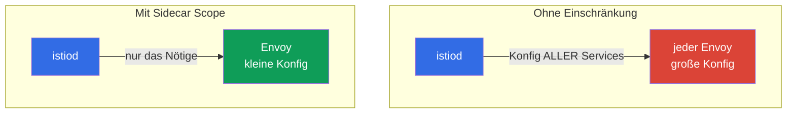

[RU version](ru.md) · [Eng version](en.md) · [Versión en español](es.md) · [Version française](fr.md)

# Kapitel 19. Sidecar Scoping und Optimierung der Proxy-Konfiguration

> **Was kommt als Nächstes.** Es beginnt der Bereich der fortgeschrittenen Szenarien. Das erste
> davon ist die Optimierung. Standardmäßig kennt jeder sidecar alle Services des Mesh, und in einem
> großen cluster ist das teuer: aufgeblähte Envoy-Konfigurationen, überflüssiger Speicher, Last auf
> istiod. In diesem Kapitel betrachten wir, wie man den Sichtbarkeitsbereich des Proxys über die
> Ressource `Sidecar` und Discovery Selectors einschränkt.

## 19.1. Das Problem: „full mesh" standardmäßig

Standardmäßig arbeitet Istio als „vollständiges Mesh": istiod verteilt an **jeden** sidecar die
Konfiguration **aller** Services des Clusters - selbst derer, mit denen dieser Pod nie
kommuniziert. In einem kleinen cluster fällt das nicht auf, aber bei Hunderten und Tausenden von
Services entstehen reale Probleme:

- **Speicher.** Jeder Envoy hält die Konfiguration aller Services - das sind zig und hunderte
  Megabyte pro Proxy, multipliziert mit Tausenden von Pods.
- **Last auf istiod.** Bei jeder Änderung (ein Pod ist erschienen, ein Service hat sich geändert)
  berechnet istiod die Konfiguration neu und verteilt sie an alle Proxys.
- **Zustellgeschwindigkeit.** Je größer die Konfiguration, desto länger fliegt sie zum Envoy und
  wird angewendet.



Die Idee der Optimierung ist einfach: Istio zu sagen, welche Services konkrete Pods wirklich
brauchen, und ihnen nicht alles Übrige zu verteilen.

## 19.2. Die Ressource Sidecar: Einschränkung der Sichtbarkeit

Die Ressource `Sidecar` (dieselbe, die wir in Kapitel 12 für egress gesehen haben) erlaubt es
einzuschränken, welche Services der Proxy „sieht", über `egress.hosts`:

```yaml
apiVersion: networking.istio.io/v1
kind: Sidecar
metadata:
  name: default            # Name default = für den gesamten namespace
  namespace: app
spec:
  egress:
  - hosts:
    - "./*"                # Services des eigenen namespace
    - "istio-system/*"     # Systemdienste (Gateways usw.)
```

- **`egress.hosts`** - die Liste dessen, was der sidecar sieht, im Format `namespace/service`.
- **`"./*"`** - alle Services des aktuellen namespace.
- **`"istio-system/*"`** - Services aus istio-system (werden für die Arbeit des Mesh benötigt).

Nun schickt istiod den Pods dieses namespace die Konfiguration nur für die aufgeführten Services
und nicht für den gesamten cluster. Wenn die Anwendung Services in noch einem anderen namespace
anspricht, fügt man ihn der Liste hinzu: zum Beispiel `"payments/*"`.

Man sollte sich merken, dass `Sidecar` nicht nur `egress.hosts` steuert. Dieselbe Ressource legt
fest:

- **`outboundTrafficPolicy`** - den Modus des Ausgangs nach außen (`REGISTRY_ONLY`/`ALLOW_ANY`,
  Kapitel 12);
- **`ingress`** - welche eingehenden Ports der Proxy abhört (Feinabstimmung der Traffic-Annahme);
- **`egress.hosts`** - was dem Proxy auf den Ausgängen sichtbar ist (unser Thema der Optimierung).

Das heißt, `Sidecar` ist der einheitliche „Regler" für Sichtbarkeitsbereich und Traffic des Proxys
im namespace.

## 19.3. Was das bringt

Die Einschränkung der Sichtbarkeit trifft direkt die drei Probleme aus 19.1:

- **Weniger Speicher pro Proxy.** Envoy hält nur den nötigen Teil der Konfiguration.
- **Weniger Last auf istiod.** Eine Änderung in einem „unsichtbaren" namespace zwingt istiod nicht
  mehr, die Konfiguration für diese Pods neu zu berechnen und zu verteilen.
- **Schnellere Zustellung und Anwendung.** Eine kleine Konfiguration fliegt und wird schneller
  angewendet.

In großen Clustern ist der Unterschied dramatisch: Die Proxy-Konfiguration kann von Hunderten
Megabyte auf einstellige Werte schrumpfen. Das ist eine der wichtigsten Optimierungen von Istio für
den Maßstab.

Ein nützlicher Nebeneffekt ist die Sicherheit: Ein Pod, dem nur die nötigen Services „sichtbar"
sind, hat eine kleinere Angriffsfläche für Missbrauch (erinnern Sie sich an `REGISTRY_ONLY` aus
Kapitel 12, das mit derselben Ressource `Sidecar` festgelegt wird).

## 19.4. Discovery Selectors: Einschränkung auf Mesh-Ebene

`Sidecar` arbeitet auf Ebene des namespace. Es gibt auch einen größeren Hebel - **Discovery
Selectors**, der global in der `MeshConfig` festgelegt wird (bei der Installation von Istio). Er
sagt istiod, **welche namespaces überhaupt zu beobachten sind**.

```yaml
meshConfig:
  discoverySelectors:
  - matchLabels:
      istio-discovery: enabled
```

Mit einer solchen Einstellung berücksichtigt istiod nur namespaces mit dem Label
`istio-discovery: enabled`, und alles, was in den übrigen namespaces passiert (zum Beispiel in rein
„kubernetes-artigen" namespaces ohne Mesh), ignoriert es vollständig - es verschwendet keine
Ressourcen und verteilt keine Informationen darüber an die Proxys.

Der Unterschied zu `Sidecar`:

- **Discovery Selectors** - ein grober Filter auf Ebene des gesamten Mesh: welche namespaces istiod
  überhaupt in Betracht zieht. Wird einmal bei der Installation konfiguriert.
- **Sidecar** - die präzise Einstellung auf Ebene von namespace/Pods: was ein konkreter Proxy sieht.

Man verwendet sie zusammen: Discovery Selectors schneiden ganze überflüssige namespaces ab, und
`Sidecar` verengt die Sichtbarkeit zusätzlich innerhalb der verbleibenden.

## 19.5. Wann und wie in der Praxis anwenden

Die Hauptfrage des Betriebs: Wie erkennt man, dass full mesh schon stört, und in welcher Reihenfolge
führt man die Einschränkungen ein, damit nichts kaputtgeht.

### Anzeichen, dass es soweit ist

Optimieren Sie nicht „für alle Fälle". Achten Sie auf Signale:

- **istiod unter Last.** CPU und Speicher von istiod steigen, es kommt mit der Verteilung der
  Konfiguration nicht hinterher.
- **Langsame Konvergenz.** Die Metrik `pilot_proxy_convergence_time` (wie lange die Zustellung der
  Konfiguration an die Proxys dauert) steigt; Proxys hängen lange im Status `STALE`
  (`istioctl proxy-status`).
- **Große Proxy-Konfigurationen.** Envoy-Container fressen viel Speicher; die Größe des Dumps
  `istioctl proxy-config all <pod>` beträgt zig Megabyte und wächst.
- **Maßstab.** Im Mesh gibt es Hunderte von Services und viele namespaces, von denen ein Teil
  überhaupt nicht miteinander verbunden ist.

Wenn es wenige Services gibt und die istiod-Metriken ruhig sind - belassen Sie full mesh, das ist
normal.

### Reihenfolge der Einführung

Gehen Sie schrittweise und messbar vor, nicht nach dem Motto „schalten wir den Scope überall auf
einmal ein":

1. **Erfassen Sie eine Baseline.** Halten Sie vor den Änderungen fest: Speicher von istiod, Speicher
   der Proxys, Größe der Konfiguration (`istioctl proxy-config all <pod> -o json | wc -c`),
   `pilot_proxy_convergence_time`. Ohne Basiszahlen verstehen Sie nicht, ob es geholfen hat.
2. **Schneiden Sie überflüssige namespaces über Discovery Selectors ab.** Der günstigste und größte
   Schritt: Entfernen Sie aus dem Blickfeld von istiod namespaces, die überhaupt nicht im Mesh sind.
3. **Erstellen Sie eine Abhängigkeitskarte.** Finden Sie heraus, wer wen tatsächlich anspricht - über
   den Kiali-Graphen (Kapitel 17), über die Metriken `istio_requests_total` (Labels
   `source_workload` / `destination_service`) oder über die Access-Logs. Das ist die Grundlage für
   `egress.hosts`.
4. **Führen Sie `Sidecar` namespace für namespace ein,** beginnend mit unkritischen und in Staging.
   Beschreiben Sie für jeden namespace `egress.hosts` = eigener namespace + istio-system + die, mit
   denen er laut Abhängigkeitskarte kommuniziert.
5. **Prüfen Sie, dass nichts kaputtgegangen ist.** `istioctl analyze`, Zugriffstests zwischen den
   Services, `istioctl proxy-config` (sind die nötigen Cluster sichtbar). Besondere Aufmerksamkeit
   gilt den Abhängigkeiten, die selten genutzt werden und leicht zu vergessen sind.
6. **Messen Sie den Effekt und rollen Sie weiter aus.** Vergleichen Sie mit der Baseline,
   überzeugen Sie sich vom Gewinn und gehen Sie zu den nächsten namespaces über.

### Wie man die Abhängigkeitskarte erstellt

Der zuverlässigste Weg führt über den tatsächlichen Traffic, nicht über die Dokumentation:

```bash
# wer den Service payments anspricht (nach Istio-Metriken)
istio_requests_total{destination_service_name="payments"}   # source_workload betrachten
```

Der Kiali-Graph zeigt genau dies visuell. Nachdem Sie die reale Karte „wer-mit-wem" gesammelt haben,
wissen Sie genau, was Sie in `egress.hosts` eintragen müssen, und schneiden nichts Nötiges ab.

## 19.6. Drei Hebel zur Einschränkung der Sichtbarkeit

Neben `Sidecar` und Discovery Selectors hat Istio einen dritten Mechanismus - `exportTo`. Es ist
nützlich, alle drei zusammen zu sehen, weil sie auf unterschiedlichen Ebenen arbeiten und einander
ergänzen:

| Mechanismus | Ebene | Was er einschränkt |
|----------|---------|------------------|
| **Discovery Selectors** (MeshConfig) | gesamtes Mesh | welche namespaces istiod überhaupt beobachtet |
| **`Sidecar`** (`egress.hosts`) | namespace / Pods | was ein konkreter Proxy sieht |
| **`exportTo`** (an der Ressource) | die Ressource selbst | in welche namespaces dieser Service/diese Konfig sichtbar ist |

`exportTo` wird **auf Seiten der Ressource** festgelegt und sagt, wem sie überhaupt zugänglich ist:
`.` - nur der eigene namespace, `*` - alle (standardmäßig), oder eine Liste von namespaces. Es gibt
es bei `Service` (über die Annotation `networking.istio.io/exportTo`) sowie bei `VirtualService`,
`DestinationRule` und `ServiceEntry` (Kapitel 12):

```yaml
apiVersion: v1
kind: Service
metadata:
  name: internal-only
  namespace: payments
  annotations:
    networking.istio.io/exportTo: "."     # nur im eigenen namespace sichtbar
```

Der Unterschied liegt in der Richtung: `Sidecar` ist „was ich sehen will" (von Seiten des
Verbrauchers), `exportTo` ist „wem ich erlaube, mich zu sehen" (von Seiten des Service-Besitzers).
Auf großen Plattformen kombiniert man sie: Discovery Selectors schneiden grob namespaces ab,
`exportTo` versteckt interne Services vor fremden Teams, und `Sidecar` verengt die Konfiguration
konkreter Proxys.

> **Der Ambient Mode ändert die Ausgangslage.** Alles bisher Gesagte betrifft den klassischen
> Sidecar-Modus, in dem jeder Pod seinen eigenen Envoy mit vollständiger Konfiguration hat. Im
> **Ambient Mode** (Kapitel 22) bedient den L4-Traffic ein gemeinsamer per-node `ztunnel`, und den
> L7 ein optionaler `waypoint`, deshalb stellt sich das Problem „aufgeblähter Envoy in jedem Pod" in
> dieser Form nicht. Discovery Selectors sind dort weiterhin nützlich, die Notwendigkeit des
> `Sidecar`-Scopings sinkt jedoch merklich.

## 19.7. Weitere Proxy-Optimierungen

Der Sichtbarkeitsbereich ist die wichtigste, aber nicht die einzige Proxy-Einstellung für den
Maßstab. Noch einige Hebel, die man kennen sollte:

- **`concurrency` (Envoy-Worker).** Wie viele Worker-Threads der sidecar hat. Standardmäßig setzt
  Istio ihn auf die Anzahl der vCPUs des Pods; bei Pods mit großem CPU-Limit, aber wenig realem
  Traffic bläht das den Verbrauch auf. Oft fixiert man `concurrency: 2` (Annotation
  `proxy.istio.io/config` oder global), damit der Proxy nicht überflüssige Threads/Speicher belegt.
- **Sidecar-Ressourcen.** Legen Sie requests/limits für den Container `istio-proxy` bewusst fest
  (Annotationen `sidecar.istio.io/proxyCPU`, `proxyMemory`), nicht nach dem Standard - besonders auf
  dicht gepackten Nodes.
- **`holdApplicationUntilProxyStarts`.** Zwingt den Anwendungscontainer, auf die Bereitschaft des
  sidecar zu warten - beseitigt das Wettrennen beim Pod-Start (die Anwendung startet vor dem Proxy
  und die ersten Anfragen fallen aus). Nützlich für kurze Jobs und startempfindliche Services.
- **Überwachung von istiod.** Die `PILOT_*`-Metriken und `pilot_proxy_convergence_time` (19.5) sind
  der Hauptindikator dafür, ob die Optimierung hilft; beobachten Sie sie vor/nach den Änderungen.

Diese Einstellungen sind orthogonal zum Scoping: Man wendet sie sowohl auf einem großen als auch auf
einem mittleren cluster an, wenn man einen vorhersehbaren Ressourcenverbrauch der Proxys möchte.

## 19.8. Best Practices

- **In einem kleinen cluster verkomplizieren Sie nichts.** Solange es wenige Services gibt,
  funktioniert das Standard-full-mesh normal. Die Optimierung wird beim Wachstum nötig (Hunderte+
  Services).
- **Beginnen Sie mit Discovery Selectors.** Wenn ein Teil der namespaces überhaupt nicht im Mesh
  ist, schneiden Sie sie auf Ebene von istiod ab - das ist der günstigste und größte Gewinn.
- **Fügen Sie Sidecar pro namespace hinzu.** Beschreiben Sie für jeden namespace einen `Sidecar` mit
  der realen Liste der Abhängigkeiten (eigener namespace + die, mit denen er kommuniziert). Das senkt
  die Proxy-Konfiguration und verbessert zugleich die Sicherheit.
- **Halten Sie die Abhängigkeitsliste aktuell.** Wenn ein Service beginnt, einen neuen namespace
  anzusprechen, dieser aber nicht im `Sidecar` steht - bricht der Traffic. Das ist ein Kompromiss:
  ein präziserer Scope bedeutet strengere Anforderungen an die Sorgfalt.
- **Überwachen Sie den Effekt.** Schauen Sie auf die Größe der Proxy-Konfiguration
  (`istioctl proxy-config` und istiod-Metriken) vor und nach - so sehen Sie den realen Gewinn.

## 19.9. Zusammenfassung des Kapitels

- Standardmäßig erhält jeder sidecar die Konfiguration aller Services des Mesh; in einem großen
  cluster ist das teuer in Bezug auf Speicher, Last auf istiod und Zustellgeschwindigkeit.
- Die **Ressource `Sidecar`** schränkt über `egress.hosts` ein, welche Services der Proxy im
  namespace sieht - die Konfiguration schrumpft, istiod wird entlastet.
- **Discovery Selectors** in der `MeshConfig` legen fest, welche namespaces istiod überhaupt
  beobachtet - ein grober Filter auf Ebene des gesamten Mesh.
- Man wendet sie zusammen an: Discovery Selectors schneiden namespaces ab, `Sidecar` verengt die
  Sichtbarkeit innerhalb der verbleibenden.
- Der dritte Hebel der Sichtbarkeit ist **`exportTo`** (an
  `Service`/`VirtualService`/`DestinationRule`/`ServiceEntry`): von Seiten des Besitzers schränkt es
  ein, wem der Service sichtbar ist; `Sidecar` von Seiten des Verbrauchers. Man kombiniert sie
  zusammen mit Discovery Selectors.
- `Sidecar` steuert nicht nur `egress.hosts`, sondern auch `outboundTrafficPolicy` und `ingress`.
- Weitere Proxy-Optimierungen: `concurrency` (Envoy-Worker), Sidecar-Ressourcen,
  `holdApplicationUntilProxyStarts`.
- Im **Ambient Mode** (Kapitel 22) verschwindet das Problem der aufgeblähten per-Pod-Envoy-Konfig in
  dieser Form; das Sidecar-Scoping wird dort weniger benötigt.
- Ein Nebenplus des Scope ist die Sicherheit (weniger sichtbare Services).
- Kompromiss: Ein präziser Scope erfordert, die Abhängigkeitsliste aktuell zu halten.
- Es ist Zeit, den Scope einzuführen, wenn die Last auf istiod, die Konvergenzzeit
  (`pilot_proxy_convergence_time`) und die Größe der Proxy-Konfiguration steigen. Schrittweise
  einführen: Baseline -> Discovery Selectors -> Abhängigkeitskarte (Kiali/Metriken) -> Sidecar pro
  namespace -> Prüfung -> Messung des Effekts.

## 19.10. Fragen zur Selbstüberprüfung

1. Warum wird full mesh standardmäßig in einem großen cluster zum Problem?
2. Wie schränkt die Ressource `Sidecar` die Sichtbarkeit ein und was passiert dabei mit der
   Proxy-Konfiguration?
3. Wodurch unterscheiden sich Discovery Selectors von `Sidecar` nach ihrer Wirkungsebene?
4. Wie ergänzen sich Discovery Selectors und `Sidecar`?
5. Worin liegt das Risiko eines zu engen Scope und wie vermeidet man es?
6. An welchen Anzeichen erkennt man, dass es Zeit ist, Einschränkungen einzuführen? Beschreiben Sie
   die Reihenfolge einer sicheren Einführung und wie man die Abhängigkeitskarte erstellt.
7. Welche drei Mechanismen schränken die Sichtbarkeit ein und wodurch unterscheidet sich `exportTo`
   von `Sidecar` nach der Richtung?
8. Welche weiteren Proxy-Optimierungen gibt es neben dem Scoping (`concurrency`, Ressourcen,
   holdApplicationUntilProxyStarts)?
9. Warum wird im Ambient Mode das Sidecar-Scoping weniger benötigt?

## Praxis

Üben Sie die Einschränkung des Konfigurationsbereichs des Proxys über die Ressource `Sidecar`:

🧪 Lab 21: [tasks/ica/labs/21](../../labs/21/README_DE.MD)

---
[Inhaltsverzeichnis](../README_DE.md) · [Kapitel 18](../18/de.md) · [Kapitel 20](../20/de.md)
