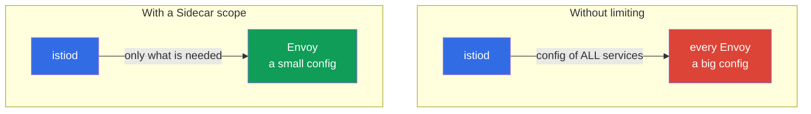

[RU version](ru.md) · [Versión en español](es.md) · [Version française](fr.md) · [Deutsche Version](de.md)

# Chapter 19. Sidecar scoping and proxy configuration optimization

> **What's next.** The domain of advanced scenarios begins. The first of them is optimization. By
> default every sidecar knows about all mesh services, and on a large cluster this is expensive:
> bloated Envoy configs, extra memory, load on istiod. In this chapter we look at how to limit the
> proxy's visibility scope via the `Sidecar` resource and discovery selectors.

## 19.1. The problem: "full mesh" by default

By default Istio works as a "full mesh": istiod pushes to **every** sidecar the configuration of
**all** cluster services - even those this pod never reaches. On a small cluster this is
unnoticeable, but with hundreds and thousands of services real problems arise:

- **Memory.** Each Envoy stores the config of all services - that is tens and hundreds of megabytes
  per proxy, multiplied by thousands of pods.
- **Load on istiod.** On any change (a pod appeared, a service changed) istiod recomputes and
  pushes the config to all proxies.
- **Delivery speed.** The bigger the config, the longer it takes to reach Envoy and be applied.



The idea of the optimization is simple: tell Istio which services specific pods actually need, and
not push everything else to them.

## 19.2. The Sidecar resource: limiting visibility

The `Sidecar` resource (the same one we saw in chapter 12 for egress) lets you limit which services
the proxy "sees", via `egress.hosts`:

```yaml
apiVersion: networking.istio.io/v1
kind: Sidecar
metadata:
  name: default            # the name default = for the whole namespace
  namespace: app
spec:
  egress:
  - hosts:
    - "./*"                # services of its own namespace
    - "istio-system/*"     # system services (gateways, etc.)
```

- **`egress.hosts`** - the list of what the sidecar sees, in `namespace/service` format.
- **`"./*"`** - all services of the current namespace.
- **`"istio-system/*"`** - services from istio-system (needed for the mesh to work).

Now istiod will push the pods of this namespace the configuration only for the listed services,
not for the whole cluster. If the application reaches services in yet another namespace, it is
added to the list: for example, `"payments/*"`.

It is worth remembering that `Sidecar` manages not only `egress.hosts`. The same resource sets:

- **`outboundTrafficPolicy`** - the outbound mode (`REGISTRY_ONLY`/`ALLOW_ANY`, chapter 12);
- **`ingress`** - which inbound ports the proxy listens on (fine-tuning of traffic acceptance);
- **`egress.hosts`** - what is visible to the proxy on the outbound side (our optimization topic).

That is, `Sidecar` is a single "knob" for the proxy's visibility and traffic in a namespace.

## 19.3. What this gives

Limiting visibility directly hits the three problems from 19.1:

- **Less memory on the proxy.** Envoy stores only the needed part of the configuration.
- **Less load on istiod.** A change in an "invisible" namespace no longer forces recomputing and
  pushing the config to these pods.
- **Faster delivery and application.** A small config arrives and is applied faster.

On large clusters the difference is dramatic: the proxy config can shrink from hundreds of
megabytes to single digits. This is one of Istio's main optimizations for scale.

A useful side effect is security: a pod that "sees" only the needed services has a smaller surface
for abuse (recall `REGISTRY_ONLY` from chapter 12, which is set by the same `Sidecar` resource).

## 19.4. Discovery selectors: limiting at the mesh level

`Sidecar` works at the namespace level. There is also a coarser lever - **discovery selectors** -
set globally in `MeshConfig` (at Istio install time). It tells istiod **which namespaces to track
at all**.

```yaml
meshConfig:
  discoverySelectors:
  - matchLabels:
      istio-discovery: enabled
```

With such a setting istiod will consider only namespaces with the label `istio-discovery: enabled`,
and everything happening in the other namespaces (for example, in purely "Kubernetes" namespaces
without a mesh) it ignores entirely - it spends no resources and does not distribute information
about them to the proxies.

The difference with `Sidecar`:

- **discovery selectors** - a coarse filter at the whole-mesh level: which namespaces istiod takes
  into account at all. Configured once at install time.
- **Sidecar** - a fine setting at the namespace/pod level: what a specific proxy sees.

They are used together: discovery selectors cut off whole unnecessary namespaces, and `Sidecar`
additionally narrows visibility within those that remain.

## 19.5. When and how to apply it in practice

The main operational question: how to understand that full mesh is already getting in the way, and
in what order to introduce limits so as not to break anything.

### Signs that it is time

Do not optimize "just in case". Watch the signals:

- **istiod under load.** istiod's CPU and memory grow, it cannot keep up with pushing the config.
- **Slow convergence.** The `pilot_proxy_convergence_time` metric (how long config delivery to the
  proxies takes) increases; proxies hang in the `STALE` status for a long time (`istioctl
  proxy-status`).
- **Big proxy configs.** Envoy containers eat a lot of memory; the size of the `istioctl
  proxy-config all <pod>` dump is tens of megabytes and growing.
- **Scale.** The mesh has hundreds of services and many namespaces, some of which are not connected
  to each other at all.

If there are few services and istiod's metrics are calm - leave full mesh, that is fine.

### The rollout order

Act gradually and measurably, not "turn on scope everywhere at once":

1. **Take a baseline.** Record before the changes: istiod memory, proxy memory, config size
   (`istioctl proxy-config all <pod> -o json | wc -c`), `pilot_proxy_convergence_time`. Without
   baseline numbers you will not understand whether it helped.
2. **Cut off unnecessary namespaces with discovery selectors.** The cheapest and biggest step:
   remove from istiod's view the namespaces that are not in the mesh at all.
3. **Build a dependency map.** Find out who actually reaches whom - from the Kiali graph (chapter
   17), from the `istio_requests_total` metrics (the `source_workload` / `destination_service`
   labels) or from access logs. This is the basis for `egress.hosts`.
4. **Roll out `Sidecar` one namespace at a time,** starting with non-critical ones and in staging.
   For each namespace describe `egress.hosts` = its own namespace + istio-system + those it reaches
   per the dependency map.
5. **Verify nothing broke.** `istioctl analyze`, access tests between services, `istioctl
   proxy-config` (are the needed clusters visible). Pay special attention to dependencies that are
   used rarely and are easy to forget.
6. **Measure the effect and roll out further.** Compare with the baseline, confirm the gain, move on
   to the next namespaces.

### How to build the dependency map

The most reliable way is by the actual traffic, not by the documentation:

```bash
# who reaches the payments service (by Istio metrics)
istio_requests_total{destination_service_name="payments"}   # look at source_workload
```

The Kiali graph shows the same visually. Having gathered the real "who-to-whom" map, you know
exactly what to put into `egress.hosts` and will not cut off something needed.

## 19.6. Three levers for limiting visibility

Besides `Sidecar` and discovery selectors, Istio has a third mechanism - `exportTo`. It is useful
to see all three together, because they work at different levels and complement each other:

| Mechanism | Level | What it limits |
|-----------|-------|----------------|
| **discovery selectors** (MeshConfig) | the whole mesh | which namespaces istiod tracks at all |
| **`Sidecar`** (`egress.hosts`) | namespace / pods | what a specific proxy sees |
| **`exportTo`** (on the resource) | the resource itself | into which namespaces this service/config is visible |

`exportTo` is set **on the resource side** and says to whom it is available at all: `.` - only its
own namespace, `*` - all (the default), or a list of namespaces. It exists on `Service` (via the
`networking.istio.io/exportTo` annotation), and also on `VirtualService`, `DestinationRule` and
`ServiceEntry` (chapter 12):

```yaml
apiVersion: v1
kind: Service
metadata:
  name: internal-only
  namespace: payments
  annotations:
    networking.istio.io/exportTo: "."     # visible only in its own namespace
```

The difference is in direction: `Sidecar` is "what I want to see" (from the consumer's side),
`exportTo` is "to whom I allow myself to be seen" (from the service owner's side). On large
platforms they are combined: discovery selectors coarsely cut off namespaces, `exportTo` hides
internal services from other teams, and `Sidecar` narrows the config of specific proxies.

> **Ambient mode changes the calculus.** Everything said above is about the classic sidecar mode,
> where each pod has its own Envoy with a full config. In **ambient mode** (chapter 22) the L4
> traffic is served by a shared per-node `ztunnel`, and L7 by an optional `waypoint`, so the "bloated
> Envoy in every pod" problem does not arise in this form. discovery selectors are still useful
> there, but the need for `Sidecar` scoping drops noticeably.

## 19.7. Other proxy optimizations

Visibility scope is the main, but not the only, proxy setting for scale. A few more levers worth
knowing:

- **`concurrency` (Envoy workers).** How many worker threads the sidecar has. By default Istio sets
  it by the pod's number of vCPUs; on pods with a large CPU limit but little actual traffic this
  bloats consumption. It is often fixed at `concurrency: 2` (the `proxy.istio.io/config` annotation
  or globally), so the proxy does not occupy extra threads/memory.
- **Sidecar resources.** Set requests/limits for the `istio-proxy` container deliberately (the
  `sidecar.istio.io/proxyCPU`, `proxyMemory` annotations), not by default - especially on
  densely-packed nodes.
- **`holdApplicationUntilProxyStarts`.** Makes the application container wait for the sidecar to be
  ready - eliminates the race at pod startup (the application starts before the proxy and the first
  requests fail). Useful for short jobs and startup-sensitive services.
- **Monitoring istiod.** The `PILOT_*` metrics and `pilot_proxy_convergence_time` (19.5) are the
  main indicator of whether the optimization helps; watch them before/after changes.

These settings are orthogonal to scoping: they are applied both on a large and on a medium cluster
when you want predictable proxy resource consumption.

## 19.8. Best practices

- **On a small cluster do not overcomplicate.** While there are few services, the default full mesh
  works fine. The optimization is needed with growth (hundreds+ of services).
- **Start with discovery selectors.** If some namespaces are not in the mesh at all, cut them off at
  the istiod level - it is the cheapest and biggest win.
- **Add Sidecar per namespace.** For each namespace describe a `Sidecar` with the real list of
  dependencies (its own namespace + those it reaches). This reduces the proxy config and improves
  security along the way.
- **Keep the dependency list up to date.** If a service started reaching a new namespace, and it is
  not in the `Sidecar` - the traffic will break. This is a trade-off: a more precise scope means
  stricter requirements for accuracy.
- **Monitor the effect.** Look at the proxy config size (`istioctl proxy-config` and istiod metrics)
  before and after - that is how you see the real gain.

## 19.9. Chapter summary

- By default every sidecar gets the configuration of all mesh services; on a large cluster this is
  expensive in memory, load on istiod and delivery speed.
- **The `Sidecar` resource** via `egress.hosts` limits which services the proxy sees in a namespace
  - the config shrinks, istiod is offloaded.
- **Discovery selectors** in `MeshConfig` set which namespaces istiod tracks at all - a coarse
  filter at the whole-mesh level.
- They are applied together: discovery selectors cut off namespaces, `Sidecar` narrows visibility
  within the remaining ones.
- The third visibility lever is **`exportTo`** (on
  `Service`/`VirtualService`/`DestinationRule`/`ServiceEntry`): from the owner's side it limits to
  whom the service is visible; `Sidecar` is from the consumer's side. They are combined together
  with discovery selectors.
- `Sidecar` manages not only `egress.hosts`, but also `outboundTrafficPolicy` and `ingress`.
- Other proxy optimizations: `concurrency` (Envoy workers), sidecar resources,
  `holdApplicationUntilProxyStarts`.
- In **ambient mode** (chapter 22) the bloated per-pod Envoy config problem does not arise in this
  form; Sidecar scoping is needed less there.
- A side benefit of scope is security (fewer visible services).
- The trade-off: a precise scope requires keeping the dependency list up to date.
- It is time to introduce scope when the load on istiod, the convergence time
  (`pilot_proxy_convergence_time`) and the proxy config size grow. Introduce it gradually: baseline
  -> discovery selectors -> a dependency map (Kiali/metrics) -> Sidecar per namespace -> verification
  -> measuring the effect.

## 19.10. Self-check questions

1. Why does the default full mesh become a problem on a large cluster?
2. How does the `Sidecar` resource limit visibility and what happens to the proxy config?
3. How do discovery selectors differ from `Sidecar` in their level of action?
4. How do discovery selectors and `Sidecar` complement each other?
5. What is the risk of too narrow a scope and how do you avoid it?
6. By what signs do you tell it is time to introduce limits? Describe the safe rollout order and how
   to build a dependency map.
7. Which three mechanisms limit visibility and how does `exportTo` differ from `Sidecar` in
   direction?
8. What other proxy optimizations are there besides scoping (`concurrency`, resources,
   holdApplicationUntilProxyStarts)?
9. Why is Sidecar scoping needed less in ambient mode?

## Practice

Practice limiting the proxy configuration scope via the `Sidecar` resource:

🧪 Lab 21: [tasks/ica/labs/21](../../labs/21/README.MD)

---
[Contents](../README.md) · [Chapter 18](../18/en.md) · [Chapter 20](../20/en.md)
