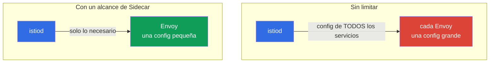

[RU version](ru.md) · [Eng version](en.md) · [Version française](fr.md) · [Deutsche Version](de.md)

# Capítulo 19. Alcance del sidecar y optimización de la configuración del proxy

> **Qué sigue.** Empieza el dominio de los escenarios avanzados. El primero de ellos es la
> optimización. Por defecto cada sidecar conoce todos los servicios de la malla, y en un clúster
> grande esto es caro: configs de Envoy hinchadas, memoria de más, carga sobre istiod. En este
> capítulo vemos cómo limitar el alcance de visibilidad del proxy vía el recurso `Sidecar` y los
> discovery selectors.

## 19.1. El problema: "full mesh" por defecto

Por defecto Istio funciona como una "full mesh": istiod envía a **cada** sidecar la configuración de
**todos** los servicios del clúster, incluso aquellos que este pod nunca alcanza. En un clúster
pequeño esto pasa desapercibido, pero con cientos y miles de servicios surgen problemas reales:

- **Memoria.** Cada Envoy almacena la config de todos los servicios: eso son decenas y cientos de
  megabytes por proxy, multiplicados por miles de pods.
- **Carga sobre istiod.** Ante cualquier cambio (apareció un pod, cambió un servicio) istiod recalcula
  y envía la config a todos los proxies.
- **Velocidad de entrega.** Cuanto mayor es la config, más tarda en llegar a Envoy y aplicarse.



La idea de la optimización es simple: decirle a Istio qué servicios necesitan realmente pods
específicos, y no enviarles todo lo demás.

## 19.2. El recurso Sidecar: limitar la visibilidad

El recurso `Sidecar` (el mismo que vimos en el capítulo 12 para egress) permite limitar qué servicios
"ve" el proxy, vía `egress.hosts`:

```yaml
apiVersion: networking.istio.io/v1
kind: Sidecar
metadata:
  name: default            # el nombre default = para todo el namespace
  namespace: app
spec:
  egress:
  - hosts:
    - "./*"                # servicios de su propio namespace
    - "istio-system/*"     # servicios del sistema (gateways, etc.)
```

- **`egress.hosts`**: la lista de lo que el sidecar ve, en formato `namespace/service`.
- **`"./*"`**: todos los servicios del namespace actual.
- **`"istio-system/*"`**: servicios de istio-system (necesarios para que la malla funcione).

Ahora istiod enviará a los pods de este namespace la configuración solo de los servicios listados, no
de todo el clúster. Si la aplicación alcanza servicios en otro namespace más, se añade a la lista: por
ejemplo, `"payments/*"`.

Conviene recordar que `Sidecar` gestiona no solo `egress.hosts`. El mismo recurso define:

- **`outboundTrafficPolicy`**: el modo de salida (`REGISTRY_ONLY`/`ALLOW_ANY`, capítulo 12);
- **`ingress`**: en qué puertos de entrada escucha el proxy (ajuste fino de la aceptación de tráfico);
- **`egress.hosts`**: lo que es visible para el proxy en el lado de salida (nuestro tema de
  optimización).

Es decir, `Sidecar` es un único "mando" para la visibilidad y el tráfico del proxy en un namespace.

## 19.3. Qué aporta esto

Limitar la visibilidad ataca directamente los tres problemas de 19.1:

- **Menos memoria en el proxy.** Envoy almacena solo la parte necesaria de la configuración.
- **Menos carga sobre istiod.** Un cambio en un namespace "invisible" ya no obliga a recalcular y
  enviar la config a estos pods.
- **Entrega y aplicación más rápidas.** Una config pequeña llega y se aplica más rápido.

En clústeres grandes la diferencia es drástica: la config del proxy puede encogerse de cientos de
megabytes a un solo dígito. Esta es una de las principales optimizaciones de Istio para escala.

Un efecto secundario útil es la seguridad: un pod que "ve" solo los servicios necesarios tiene una
superficie menor para el abuso (recuerda `REGISTRY_ONLY` del capítulo 12, que se define con el mismo
recurso `Sidecar`).

## 19.4. Discovery selectors: limitar a nivel de malla

`Sidecar` funciona a nivel de namespace. También hay una palanca más gruesa -los **discovery
selectors**- que se definen globalmente en `MeshConfig` (al instalar Istio). Le indica a istiod **qué
namespaces rastrear en absoluto**.

```yaml
meshConfig:
  discoverySelectors:
  - matchLabels:
      istio-discovery: enabled
```

Con tal ajuste istiod considerará solo los namespaces con la etiqueta `istio-discovery: enabled`, y
todo lo que ocurra en los demás namespaces (por ejemplo, en namespaces puramente "de Kubernetes" sin
malla) lo ignora por completo: no gasta recursos y no distribuye información sobre ellos a los proxies.

La diferencia con `Sidecar`:

- **discovery selectors**: un filtro grueso a nivel de toda la malla: qué namespaces tiene istiod en
  cuenta en absoluto. Se configura una sola vez al instalar.
- **Sidecar**: un ajuste fino a nivel de namespace/pod: lo que ve un proxy concreto.

Se usan juntos: los discovery selectors recortan namespaces innecesarios completos, y `Sidecar`
estrecha adicionalmente la visibilidad dentro de los que quedan.

## 19.5. Cuándo y cómo aplicarlo en la práctica

La pregunta operativa principal: cómo entender que la full mesh ya está estorbando, y en qué orden
introducir los límites para no romper nada.

### Señales de que es hora

No optimices "por si acaso". Vigila las señales:

- **istiod bajo carga.** La CPU y la memoria de istiod crecen, no da abasto para enviar la config.
- **Convergencia lenta.** La métrica `pilot_proxy_convergence_time` (cuánto tarda la entrega de config
  a los proxies) aumenta; los proxies quedan mucho tiempo en el estado `STALE` (`istioctl
  proxy-status`).
- **Configs de proxy grandes.** Los contenedores de Envoy comen mucha memoria; el tamaño del volcado
  de `istioctl proxy-config all <pod>` es de decenas de megabytes y creciendo.
- **Escala.** La malla tiene cientos de servicios y muchos namespaces, algunos de los cuales no están
  conectados entre sí en absoluto.

Si hay pocos servicios y las métricas de istiod están tranquilas, deja la full mesh, está bien.

### El orden del despliegue

Actúa de forma gradual y medible, no "enciende el alcance en todas partes a la vez":

1. **Toma una baseline.** Registra antes de los cambios: memoria de istiod, memoria del proxy, tamaño
   de la config (`istioctl proxy-config all <pod> -o json | wc -c`), `pilot_proxy_convergence_time`.
   Sin números de baseline no entenderás si ayudó.
2. **Recorta namespaces innecesarios con discovery selectors.** El paso más barato y más grande: quita
   de la vista de istiod los namespaces que no están en la malla en absoluto.
3. **Construye un mapa de dependencias.** Averigua quién alcanza realmente a quién: del grafo de Kiali
   (capítulo 17), de las métricas `istio_requests_total` (las etiquetas `source_workload` /
   `destination_service`) o de los logs de acceso. Esta es la base para `egress.hosts`.
4. **Despliega `Sidecar` un namespace a la vez,** empezando por los no críticos y en staging. Para
   cada namespace describe `egress.hosts` = su propio namespace + istio-system + aquellos que alcanza
   según el mapa de dependencias.
5. **Verifica que nada se rompió.** `istioctl analyze`, pruebas de acceso entre servicios, `istioctl
   proxy-config` (¿son visibles los clusters necesarios?). Presta especial atención a las dependencias
   que se usan rara vez y son fáciles de olvidar.
6. **Mide el efecto y sigue desplegando.** Compara con la baseline, confirma la ganancia, pasa a los
   siguientes namespaces.

### Cómo construir el mapa de dependencias

La forma más fiable es por el tráfico real, no por la documentación:

```bash
# quién alcanza el servicio payments (por las métricas de Istio)
istio_requests_total{destination_service_name="payments"}   # mira source_workload
```

El grafo de Kiali muestra lo mismo de forma visual. Habiendo reunido el mapa real de "quién a quién",
sabes exactamente qué poner en `egress.hosts` y no recortarás algo necesario.

## 19.6. Tres palancas para limitar la visibilidad

Además de `Sidecar` y los discovery selectors, Istio tiene un tercer mecanismo: `exportTo`. Es útil
ver los tres juntos, porque funcionan a niveles distintos y se complementan:

| Mecanismo | Nivel | Qué limita |
|-----------|-------|------------|
| **discovery selectors** (MeshConfig) | toda la malla | qué namespaces rastrea istiod en absoluto |
| **`Sidecar`** (`egress.hosts`) | namespace / pods | lo que ve un proxy concreto |
| **`exportTo`** (en el recurso) | el propio recurso | en qué namespaces es visible este servicio/config |

`exportTo` se define **del lado del recurso** y dice a quién está disponible en absoluto: `.` solo su
propio namespace, `*` todos (el valor por defecto), o una lista de namespaces. Existe en `Service`
(vía la anotación `networking.istio.io/exportTo`), y también en `VirtualService`, `DestinationRule` y
`ServiceEntry` (capítulo 12):

```yaml
apiVersion: v1
kind: Service
metadata:
  name: internal-only
  namespace: payments
  annotations:
    networking.istio.io/exportTo: "."     # visible solo en su propio namespace
```

La diferencia está en la dirección: `Sidecar` es "lo que quiero ver" (del lado del consumidor),
`exportTo` es "a quién permito que me vean" (del lado del dueño del servicio). En plataformas grandes
se combinan: los discovery selectors recortan namespaces de forma gruesa, `exportTo` oculta servicios
internos de otros equipos, y `Sidecar` estrecha la config de proxies concretos.

> **El modo ambient cambia el cálculo.** Todo lo dicho arriba es sobre el modo sidecar clásico, donde
> cada pod tiene su propio Envoy con una config completa. En **modo ambient** (capítulo 22) el tráfico
> L4 lo atiende un `ztunnel` compartido por nodo, y el L7 un `waypoint` opcional, así que el problema
> del "Envoy hinchado en cada pod" no surge de esta forma. Los discovery selectors siguen siendo
> útiles ahí, pero la necesidad del alcance de `Sidecar` cae notablemente.

## 19.7. Otras optimizaciones del proxy

El alcance de visibilidad es el principal, pero no el único, ajuste del proxy para escala. Unas cuantas
palancas más que vale la pena conocer:

- **`concurrency` (workers de Envoy).** Cuántos hilos worker tiene el sidecar. Por defecto Istio lo
  fija según el número de vCPUs del pod; en pods con un límite grande de CPU pero poco tráfico real
  esto hincha el consumo. A menudo se fija en `concurrency: 2` (la anotación `proxy.istio.io/config` o
  globalmente), para que el proxy no ocupe hilos/memoria de más.
- **Recursos del sidecar.** Fija requests/limits para el contenedor `istio-proxy` de forma deliberada
  (las anotaciones `sidecar.istio.io/proxyCPU`, `proxyMemory`), no por defecto, especialmente en nodos
  densamente empaquetados.
- **`holdApplicationUntilProxyStarts`.** Hace que el contenedor de la aplicación espere a que el
  sidecar esté listo: elimina la carrera al arrancar el pod (la aplicación arranca antes que el proxy y
  las primeras peticiones fallan). Útil para jobs cortos y servicios sensibles al arranque.
- **Monitorización de istiod.** Las métricas `PILOT_*` y `pilot_proxy_convergence_time` (19.5) son el
  indicador principal de si la optimización ayuda; vigílalas antes/después de los cambios.

Estos ajustes son ortogonales al alcance: se aplican tanto en un clúster grande como en uno mediano
cuando quieres un consumo de recursos del proxy predecible.

## 19.8. Buenas prácticas

- **En un clúster pequeño no te compliques.** Mientras haya pocos servicios, la full mesh por defecto
  funciona bien. La optimización se necesita con el crecimiento (cientos+ de servicios).
- **Empieza por los discovery selectors.** Si algunos namespaces no están en la malla en absoluto,
  recórtalos a nivel de istiod: es la victoria más barata y más grande.
- **Añade Sidecar por namespace.** Para cada namespace describe un `Sidecar` con la lista real de
  dependencias (su propio namespace + los que alcanza). Esto reduce la config del proxy y mejora la
  seguridad de paso.
- **Mantén la lista de dependencias al día.** Si un servicio empezó a alcanzar un namespace nuevo, y no
  está en el `Sidecar`, el tráfico se romperá. Este es un trade-off: un alcance más preciso implica
  requisitos más estrictos de exactitud.
- **Monitoriza el efecto.** Mira el tamaño de la config del proxy (`istioctl proxy-config` y las
  métricas de istiod) antes y después: así ves la ganancia real.

## 19.9. Resumen del capítulo

- Por defecto cada sidecar recibe la configuración de todos los servicios de la malla; en un clúster
  grande esto es caro en memoria, carga sobre istiod y velocidad de entrega.
- **El recurso `Sidecar`** vía `egress.hosts` limita qué servicios ve el proxy en un namespace: la
  config se encoge, istiod se descarga.
- **Los discovery selectors** en `MeshConfig` definen qué namespaces rastrea istiod en absoluto: un
  filtro grueso a nivel de toda la malla.
- Se aplican juntos: los discovery selectors recortan namespaces, `Sidecar` estrecha la visibilidad
  dentro de los que quedan.
- La tercera palanca de visibilidad es **`exportTo`** (en
  `Service`/`VirtualService`/`DestinationRule`/`ServiceEntry`): del lado del dueño limita a quién es
  visible el servicio; `Sidecar` es del lado del consumidor. Se combinan junto con los discovery
  selectors.
- `Sidecar` gestiona no solo `egress.hosts`, sino también `outboundTrafficPolicy` e `ingress`.
- Otras optimizaciones del proxy: `concurrency` (workers de Envoy), recursos del sidecar,
  `holdApplicationUntilProxyStarts`.
- En **modo ambient** (capítulo 22) el problema de la config de Envoy hinchada por pod no surge de esta
  forma; el alcance de Sidecar se necesita menos ahí.
- Un beneficio secundario del alcance es la seguridad (menos servicios visibles).
- El trade-off: un alcance preciso requiere mantener la lista de dependencias al día.
- Es hora de introducir el alcance cuando la carga sobre istiod, el tiempo de convergencia
  (`pilot_proxy_convergence_time`) y el tamaño de la config del proxy crecen. Introdúcelo gradualmente:
  baseline -> discovery selectors -> un mapa de dependencias (Kiali/métricas) -> Sidecar por namespace
  -> verificación -> medición del efecto.

## 19.10. Preguntas de autoevaluación

1. ¿Por qué la full mesh por defecto se vuelve un problema en un clúster grande?
2. ¿Cómo limita la visibilidad el recurso `Sidecar` y qué le pasa a la config del proxy?
3. ¿En qué se diferencian los discovery selectors de `Sidecar` en su nivel de acción?
4. ¿Cómo se complementan los discovery selectors y `Sidecar`?
5. ¿Cuál es el riesgo de un alcance demasiado estrecho y cómo lo evitas?
6. ¿Por qué señales sabes que es hora de introducir límites? Describe el orden seguro de despliegue y
   cómo construir un mapa de dependencias.
7. ¿Qué tres mecanismos limitan la visibilidad y en qué se diferencia `exportTo` de `Sidecar` en
   dirección?
8. ¿Qué otras optimizaciones del proxy hay además del alcance (`concurrency`, recursos,
   holdApplicationUntilProxyStarts)?
9. ¿Por qué se necesita menos el alcance de Sidecar en modo ambient?

## Práctica

Practica limitar el alcance de la configuración del proxy vía el recurso `Sidecar`:

🧪 Laboratorio 21: [tasks/ica/labs/21](../../labs/21/README_ES.MD)

---
[Índice](../README_ES.md) · [Capítulo 18](../18/es.md) · [Capítulo 20](../20/es.md)
